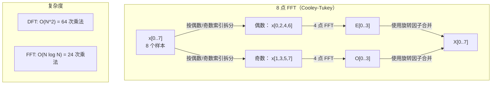
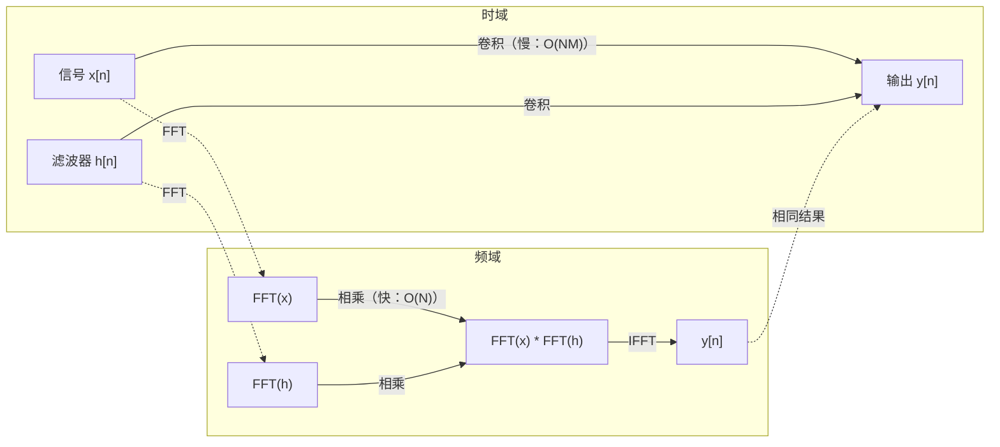

# 傅里叶变换（The Fourier Transform）

> 每个信号都是正弦波之和。傅里叶变换告诉你，它由哪些正弦波组成。

**Type:** Build
**Language:** Python
**Prerequisites:** 第 1 阶段，第 01–04 课、第 19 课（复数，Complex Numbers）
**Time:** ~90 分钟

## 学习目标（Learning Objectives）

- 从零实现 DFT，并与 O(N log N) 的 Cooley-Tukey FFT 对照验证
- 解读频率系数，从信号中提取幅值、相位与功率谱
- 应用卷积定理，通过 FFT 相乘计算卷积
- 将傅里叶频率分解与 Transformer 位置编码、CNN 卷积层联系起来

## 问题背景（The Problem）

录音是随时间采集的一串压力测量值，股票价格是按天记录的一串数值，图像则是空间中像素强度的网格。它们都是时域（Time Domain）或空域（Space Domain）数据，你看到的是数值随某个索引发生变化。

但许多模式在时域中不可见。音频是纯音还是和弦？股价是否有每周周期？图像是否有重复纹理？这些问题关注频率成分，而时域把它们隐藏了起来。

傅里叶变换（Fourier Transform）将数据从时域转换到频域（Frequency Domain），把信号分解为不同频率的正弦波。每个正弦波都有幅值（强度）和相位（起始位置），傅里叶变换会告诉你这两者。

这对机器学习（Machine Learning，ML）很重要，因为频域思维无处不在。卷积神经网络（Convolutional Neural Network，CNN）执行卷积，而卷积在频域中就是乘法。Transformer 位置编码使用频率分解来表示位置。音频模型，如语音识别和音乐生成，处理的是谱图（Spectrogram），也就是声音的频率表示。时间序列模型寻找周期性模式。理解傅里叶变换，就掌握了处理这些问题所需的概念语言。

## 核心概念（The Concept）

### DFT 的定义（The DFT definition）

给定 N 个样本 x[0], x[1], ..., x[N-1]，离散傅里叶变换（Discrete Fourier Transform，DFT）产生 N 个频率系数 X[0], X[1], ..., X[N-1]：

```
X[k] = sum_{n=0}^{N-1} x[n] * e^(-2*pi*i*k*n/N)

其中 k = 0, 1, ..., N-1
```

每个 X[k] 都是复数。其模 |X[k]| 告诉你频率 k 的幅值，相位 angle(X[k]) 告诉你该频率的相位偏移。

关键洞见：`e^(-2*pi*i*k*n/N)` 是频率 k 处的旋转相量。DFT 计算信号与 N 个等间隔频率各自的相关程度。如果信号在频率 k 处包含能量，相关值就大；否则接近零。

### 各个系数的含义（What each coefficient means）

**X[0]：直流分量（Direct Current Component，DC）。** 它是所有样本之和，与均值成正比，表示信号的恒定偏移，即零频偏移。

```
X[0] = sum_{n=0}^{N-1} x[n] * e^0 = 所有样本之和
```

**1 <= k <= N/2 时的 X[k]：正频率。** X[k] 表示每 N 个样本中出现 k 个周期的频率。k 越大，频率越高，振荡越快。

**X[N/2]：奈奎斯特频率（Nyquist Frequency）。** 这是 N 个样本所能表示的最高频率。超过它就会出现混叠（Aliasing），即高频伪装成低频。

**N/2 < k < N 时的 X[k]：负频率。** 对实值信号，X[N-k] = conj(X[k])。负频率是正频率的镜像，因此有用信息位于前 N/2 + 1 个系数中。

### 逆 DFT（Inverse DFT）

逆 DFT 根据频率系数重建原始信号：

```
x[n] = (1/N) * sum_{k=0}^{N-1} X[k] * e^(2*pi*i*k*n/N)

其中 n = 0, 1, ..., N-1
```

与正向 DFT 相比，唯一区别是指数符号为正而非负，并且多了一个 1/N 归一化因子。

逆 DFT 能完美重建信号，不丢失信息。你可以从时域转到频域，再无误差地转回来。DFT 是换基（Change of Basis），也就是在另一套坐标系中重新表达相同信息。

### FFT：加速计算（The FFT: making it fast）

上述定义的 DFT 复杂度为 O(N^2)：对 N 个输出系数中的每一个，都要对 N 个输入样本求和。N = 100 万时，需要 10^12 次运算。

快速傅里叶变换（Fast Fourier Transform，FFT）以 O(N log N) 计算相同结果。N = 100 万时，只需约 2000 万次运算，而非一万亿次。正是它让频率分析变得实用。

Cooley-Tukey 算法是最常见的 FFT，通过分治（Divide and Conquer）工作：

1. 将信号拆成偶数索引样本和奇数索引样本。
2. 递归计算每一半的 DFT。
3. 使用旋转因子（Twiddle Factors）e^(-2*pi*i*k/N)，合并两个半长 DFT。

```
X[k] = E[k] + e^(-2*pi*i*k/N) * O[k]          其中 k = 0, ..., N/2 - 1
X[k + N/2] = E[k] - e^(-2*pi*i*k/N) * O[k]    其中 k = 0, ..., N/2 - 1

其中 E = 偶数索引样本的 DFT
      O = 奇数索引样本的 DFT
```

对称性使每层递归只需 O(N) 工作量，递归共有 log2(N) 层，总计 O(N log N)。



FFT 要求信号长度为 2 的幂。实践中通常通过补零（Zero-padding），将长度扩展到下一个 2 的幂。

### 频谱分析（Spectral analysis）

**功率谱（Power Spectrum）** 为 |X[k]|^2，即每个频率系数模的平方，显示各频率处的能量。

**相位谱（Phase Spectrum）** 为 angle(X[k])，即每个频率的相位偏移。大多数分析任务关注功率谱而忽略相位。

```
频率 k 处的功率：  P[k] = |X[k]|^2 = X[k].real^2 + X[k].imag^2
频率 k 处的相位：  phi[k] = atan2(X[k].imag, X[k].real)
```

### 频率分辨率（Frequency resolution）

DFT 的频率分辨率取决于样本数 N 和采样率 fs。

```
频点 k 的频率：      f_k = k * fs / N
频率分辨率：    delta_f = fs / N
最高频率：       f_max = fs / 2  （奈奎斯特）
```

要区分两个很接近的频率，需要更多样本；要捕捉高频，需要更高采样率。

### 卷积定理（The convolution theorem）

这是信号处理中最重要的结论之一，与 CNN 直接相关。

**时域中的卷积等价于频域中的逐点乘法。**

```
x * h = IFFT(FFT(x) . FFT(h))

其中 * 表示卷积，. 表示逐元素乘法
```

它的重要性在于：

- 长度为 N 和 M 的两个信号直接卷积，需要 O(N*M) 次运算。
- 基于 FFT 的卷积需要 O(N log N)：分别变换、相乘、再逆变换。
- 对大卷积核，FFT 卷积快得多。
- 大感受野卷积层中执行的正是这种操作。

注意：DFT 计算的是循环卷积（Circular Convolution），信号会首尾环绕。若需要无环绕的线性卷积（Linear Convolution），计算前先将两个信号都补零到 N + M - 1 长度。



### 加窗（Windowing）

DFT 假设信号具有周期性，把 N 个样本视为无限重复信号的一个周期。如果信号首尾值不同，边界会出现不连续，表现为虚假的高频成分。这称为频谱泄漏（Spectral Leakage）。

加窗（Windowing）在计算 DFT 前，使信号两端逐渐衰减到零，从而减少泄漏。

常见窗函数：

| 窗函数 | 形状 | 主瓣宽度 | 旁瓣电平 | 使用场景 |
|--------|-------|----------------|-----------------|----------|
| 矩形窗（Rectangular） | 平坦，不加窗 | 最窄 | 最高（-13 dB） | 信号在 N 个样本内恰好为整周期 |
| Hann 窗 | 升余弦 | 中等 | 低（-31 dB） | 通用频谱分析 |
| Hamming 窗 | 修正余弦 | 中等 | 更低（-42 dB） | 音频处理、语音分析 |
| Blackman 窗 | 三项余弦 | 宽 | 很低（-58 dB） | 旁瓣抑制至关重要时 |

```
Hann 窗：    w[n] = 0.5 * (1 - cos(2*pi*n / (N-1)))
Hamming 窗： w[n] = 0.54 - 0.46 * cos(2*pi*n / (N-1))
```

在 DFT 前，将窗函数与信号逐元素相乘即可加窗：`X = DFT(x * w)`。

### DFT 的性质（DFT properties）

| 性质 | 时域 | 频域 |
|----------|-------------|-----------------|
| 线性性 | a*x + b*y | a*X + b*Y |
| 时移 | x[n - k] | X[f] * e^(-2*pi*i*f*k/N) |
| 频移 | x[n] * e^(2*pi*i*f0*n/N) | X[f - f0] |
| 卷积 | x * h | X * H（逐点） |
| 乘法 | x * h（逐点） | X * H（循环卷积，缩放 1/N） |
| 帕塞瓦尔定理（Parseval's Theorem） | sum \|x[n]\|^2 | (1/N) * sum \|X[k]\|^2 |
| 共轭对称性（实输入） | x[n] 为实数 | X[k] = conj(X[N-k]) |

帕塞瓦尔定理指出，两个域中的总能量相同。变换过程保持能量守恒。

### 与位置编码的联系（Connection to positional encodings）

原始 Transformer 使用正弦位置编码（Sinusoidal Positional Encodings）：

```
PE(pos, 2i)   = sin(pos / 10000^(2i/d_model))
PE(pos, 2i+1) = cos(pos / 10000^(2i/d_model))
```

每一对维度 (2i, 2i+1) 都以不同频率振荡。频率按几何间隔从高频（第 0、1 维）排到低频（最后几个维度）。这让每个位置在所有频带上具有独特模式，类似于傅里叶系数唯一标识一个信号。

由此获得的关键性质：

- **唯一性：** 不会有两个位置拥有相同编码。
- **数值有界：** sin 和 cos 始终位于 [-1, 1]。
- **相对位置：** 位置 p+k 的编码可以表示为位置 p 编码的线性函数。模型可以学会关注相对位置。

### 与 CNN 的联系（Connection to CNNs）

卷积层通过在信号或图像上滑动，将学习到的滤波器（卷积核，Kernel）应用于输入。在数学上，这就是卷积运算。

根据卷积定理，它等价于：
1. 对输入做 FFT
2. 对卷积核做 FFT
3. 在频域相乘
4. 对结果做逆快速傅里叶变换（Inverse Fast Fourier Transform，IFFT）

标准 CNN 实现采用直接卷积，因为对 3x3 小核它更快。但对于大核或全局卷积，基于 FFT 的方法快得多。某些架构，如 FNet，用 FFT 完全替代注意力，以 O(N log N) 而非 O(N^2) 的复杂度达到有竞争力的准确率。

### 谱图与短时傅里叶变换（Spectrograms and the Short-Time Fourier Transform）

一次 FFT 给出整个信号的频率成分，却不告诉你这些频率何时出现。啁啾信号（Chirp，频率随时间上升的信号）和和弦（所有频率同时出现）可能具有相同的幅度谱。

短时傅里叶变换（Short-Time Fourier Transform，STFT）通过在重叠信号窗口上计算 FFT 解决这一问题。结果是谱图：一轴为时间、另一轴为频率的二维表示，每个点的强度显示该时刻、该频率处的能量。

```
STFT 步骤：
1. 选择窗口大小，例如 1024 个样本
2. 选择帧移，例如 256 个样本，即 75% 重叠
3. 对每个窗口位置：
   a. 提取该窗口的信号片段
   b. 应用 Hann/Hamming 窗
   c. 计算 FFT
   d. 将幅度谱存为谱图的一列
```

谱图是音频机器学习模型的标准输入表示。Whisper、DeepSpeech 等语音识别模型处理梅尔谱图（Mel-spectrogram）：将频率映射到更符合人类音高感知的梅尔尺度（Mel Scale）的谱图。

### 混叠（Aliasing）

如果信号包含超过 fs/2（奈奎斯特频率）的成分，以 fs 采样会产生混叠副本。以 100 Hz 采样的 90 Hz 信号看起来与 10 Hz 信号相同，仅凭样本无法区分二者。

```
示例：
  真实信号：90 Hz 正弦波
  采样率：100 Hz
  表观频率： 100 - 90 = 10 Hz

  以 100 Hz 采样率对 90 Hz 信号采样得到的样本
  与 10 Hz 信号的样本相同。
  无论用什么数学方法，都无法恢复原始的 90 Hz。
```

因此模数转换器（Analog-to-Digital Converter，ADC）会包含抗混叠滤波器，在采样前移除超过奈奎斯特频率的成分。在机器学习中，未经适当低通滤波就下采样特征图会产生混叠，某些架构通过抗混叠池化层解决此问题。

### 补零不会提高分辨率（Zero-padding does not increase resolution）

一个常见误解是：FFT 前补零能提高频率分辨率。事实并非如此。补零只在现有频点之间插值，使频谱看起来更平滑，却无法揭示原始样本中不存在的频率细节。

真正的频率分辨率只取决于观测时间 T = N / fs。要区分相距 delta_f 的两个频率，至少需要 T = 1 / delta_f 秒的数据。无论补多少零，都无法改变这个基本限制。

```figure
fourier-synthesis
```

## 动手实现（Build It）

### 第 1 步：从零实现 DFT（Step 1: DFT from scratch）

O(N^2) 的 DFT 直接按定义实现。

```python
import math

class Complex:
    ...

def dft(x):
    N = len(x)
    result = []
    for k in range(N):
        total = Complex(0, 0)
        for n in range(N):
            angle = -2 * math.pi * k * n / N
            w = Complex(math.cos(angle), math.sin(angle))
            xn = x[n] if isinstance(x[n], Complex) else Complex(x[n])
            total = total + xn * w
        result.append(total)
    return result
```

### 第 2 步：逆 DFT（Step 2: Inverse DFT）

结构相同，指数取正，并除以 N。

```python
def idft(X):
    N = len(X)
    result = []
    for n in range(N):
        total = Complex(0, 0)
        for k in range(N):
            angle = 2 * math.pi * k * n / N
            w = Complex(math.cos(angle), math.sin(angle))
            total = total + X[k] * w
        result.append(Complex(total.real / N, total.imag / N))
    return result
```

### 第 3 步：FFT（Step 3: FFT (Cooley-Tukey)）

递归 FFT 要求长度为 2 的幂。按偶数与奇数索引拆分、递归，再用旋转因子合并。

```python
def fft(x):
    N = len(x)
    if N <= 1:
        return [x[0] if isinstance(x[0], Complex) else Complex(x[0])]
    if N % 2 != 0:
        return dft(x)

    even = fft([x[i] for i in range(0, N, 2)])
    odd = fft([x[i] for i in range(1, N, 2)])

    result = [Complex(0)] * N
    for k in range(N // 2):
        angle = -2 * math.pi * k / N
        twiddle = Complex(math.cos(angle), math.sin(angle))
        t = twiddle * odd[k]
        result[k] = even[k] + t
        result[k + N // 2] = even[k] - t
    return result
```

### 第 4 步：频谱分析辅助函数（Step 4: Spectral analysis helpers）

```python
def power_spectrum(X):
    return [xk.real ** 2 + xk.imag ** 2 for xk in X]

def convolve_fft(x, h):
    N = len(x) + len(h) - 1
    padded_N = 1
    while padded_N < N:
        padded_N *= 2

    x_padded = x + [0.0] * (padded_N - len(x))
    h_padded = h + [0.0] * (padded_N - len(h))

    X = fft(x_padded)
    H = fft(h_padded)

    Y = [xk * hk for xk, hk in zip(X, H)]

    y = idft(Y)
    return [y[n].real for n in range(N)]
```

## 实际应用（Use It）

实际工作中，使用由高度优化的 C 库支撑的 numpy FFT。

```python
import numpy as np

signal = np.sin(2 * np.pi * 5 * np.arange(256) / 256)
spectrum = np.fft.fft(signal)
freqs = np.fft.fftfreq(256, d=1/256)

power = np.abs(spectrum) ** 2

positive_freqs = freqs[:len(freqs)//2]
positive_power = power[:len(power)//2]
```

加窗及更高级频谱分析：

```python
from scipy.signal import windows, stft

window = windows.hann(256)
windowed = signal * window
spectrum = np.fft.fft(windowed)
```

卷积：

```python
from scipy.signal import fftconvolve

result = fftconvolve(signal, kernel, mode='full')
```

谱图：

```python
from scipy.signal import stft

frequencies, times, Zxx = stft(signal, fs=sample_rate, nperseg=256)
spectrogram = np.abs(Zxx) ** 2
```

谱图矩阵的形状为 (n_frequencies, n_time_frames)。每列是一个时间窗口的功率谱，这正是音频机器学习模型消费的输入。

## 交付成果（Ship It）

运行 `code/fourier.py`，生成 `outputs/prompt-spectral-analyzer.md`。

## 练习（Exercises）

1. **识别纯音。** 创建一个未知频率（1 到 50 Hz）的单正弦波信号，以 128 Hz 采样 1 秒。用你的 DFT 识别频率并验证答案。再加入标准差为 0.5 的高斯噪声，重复实验。噪声如何影响频谱？

2. **FFT 与 DFT 对照验证。** 生成长度为 64 的随机信号，分别计算 DFT（O(N^2)）与 FFT。验证所有系数的差异都在 1e-10 内。测量两个函数在长度 256、512、1024、2048 的信号上的运行时间，绘制 DFT 耗时与 FFT 耗时之比。

3. **通过示例验证卷积定理。** 创建信号 x = [1, 2, 3, 4, 0, 0, 0, 0] 和滤波器 h = [1, 1, 1, 0, 0, 0, 0, 0]。用嵌套循环直接计算循环卷积，再通过 FFT 计算，即变换、相乘、逆变换。验证结果相同，再适当补零以计算线性卷积。

4. **加窗效果。** 创建频率相近的 10 Hz 与 12 Hz 两个正弦波之和，以 128 Hz 采样 1 秒。分别在不加窗、加 Hann 窗、加 Hamming 窗时计算功率谱。哪种窗最容易区分两个峰？为什么？

5. **位置编码分析。** 生成 d_model = 128、max_pos = 512 的正弦位置编码。对每对位置 (p1, p2)，计算编码的点积。展示点积只依赖 |p1 - p2|，而不依赖绝对位置。随着距离增加，点积会怎样变化？

## 关键术语（Key Terms）

| 术语 | 含义 |
|------|---------------|
| 离散傅里叶变换（Discrete Fourier Transform，DFT） | 将 N 个时域样本转换为 N 个频域系数，每个系数表示与该频率复正弦波的相关程度 |
| 快速傅里叶变换（Fast Fourier Transform，FFT） | 以 O(N log N) 计算 DFT 的算法。Cooley-Tukey 算法递归拆分偶数/奇数索引 |
| 逆 DFT（Inverse DFT） | 根据频率系数重建时域信号，公式与 DFT 相同，但指数符号反转，并缩放 1/N |
| 频点（Frequency Bin） | DFT 输出中的每个索引 k 表示 k*fs/N Hz，频点就是离散频率槽位 |
| 直流分量（DC Component） | X[0]，零频系数，与信号均值成正比 |
| 奈奎斯特频率（Nyquist Frequency） | fs/2，即采样率 fs 下可表示的最高频率，超过它会混叠 |
| 功率谱（Power Spectrum） | \|X[k]\|^2，每个频率系数模的平方，显示频率间的能量分布 |
| 相位谱（Phase Spectrum） | angle(X[k])，每个频率分量的相位偏移，分析中经常忽略 |
| 频谱泄漏（Spectral Leakage） | 把非周期信号视为周期信号所产生的虚假频率成分，可通过加窗减轻 |
| 窗函数（Window Function） | DFT 前应用的渐变衰减函数，如 Hann、Hamming、Blackman，用于减少频谱泄漏 |
| 旋转因子（Twiddle Factor） | 复指数 e^(-2*pi*i*k/N)，用于 FFT 蝶形运算中合并子 DFT |
| 卷积定理（Convolution Theorem） | 时域卷积等于频域逐点乘法，是信号处理与 CNN 的基础 |
| 循环卷积（Circular Convolution） | 信号首尾环绕的卷积，是 DFT 自然计算的卷积 |
| 线性卷积（Linear Convolution） | 不环绕的标准卷积，通过 DFT 前补零实现 |
| 帕塞瓦尔定理（Parseval's Theorem） | 傅里叶变换保持总能量：sum \|x[n]\|^2 = (1/N) sum \|X[k]\|^2 |
| 混叠（Aliasing） | 因采样率不足，超过奈奎斯特频率的成分表现为较低频率 |

## 延伸阅读（Further Reading）

- [Cooley 与 Tukey：复傅里叶级数的机器计算算法（An Algorithm for the Machine Calculation of Complex Fourier Series，1965）](https://www.ams.org/journals/mcom/1965-19-090/S0025-5718-1965-0178586-1/)：改变计算领域的原始 FFT 论文
- [3Blue1Brown：傅里叶变换究竟是什么（But what is the Fourier Transform?）](https://www.youtube.com/watch?v=spUNpyF58BY)：出色的傅里叶变换可视化入门
- [Lee-Thorp 等：FNet，用傅里叶变换混合词元（Mixing Tokens with Fourier Transforms，2021）](https://arxiv.org/abs/2105.03824)：在 Transformer 中用 FFT 替代自注意力
- [Smith：科学家和工程师的数字信号处理指南（The Scientist and Engineer's Guide to Digital Signal Processing）](http://www.dspguide.com/)：深入介绍 FFT、加窗和频谱分析的免费在线教材
- [Vaswani 等：注意力就是你所需要的一切（Attention Is All You Need，2017）](https://arxiv.org/abs/1706.03762)：由傅里叶频率分解推导的正弦位置编码
- [Radford 等：Whisper（2022）](https://arxiv.org/abs/2212.04356)：使用梅尔谱图作为输入表示的语音识别
