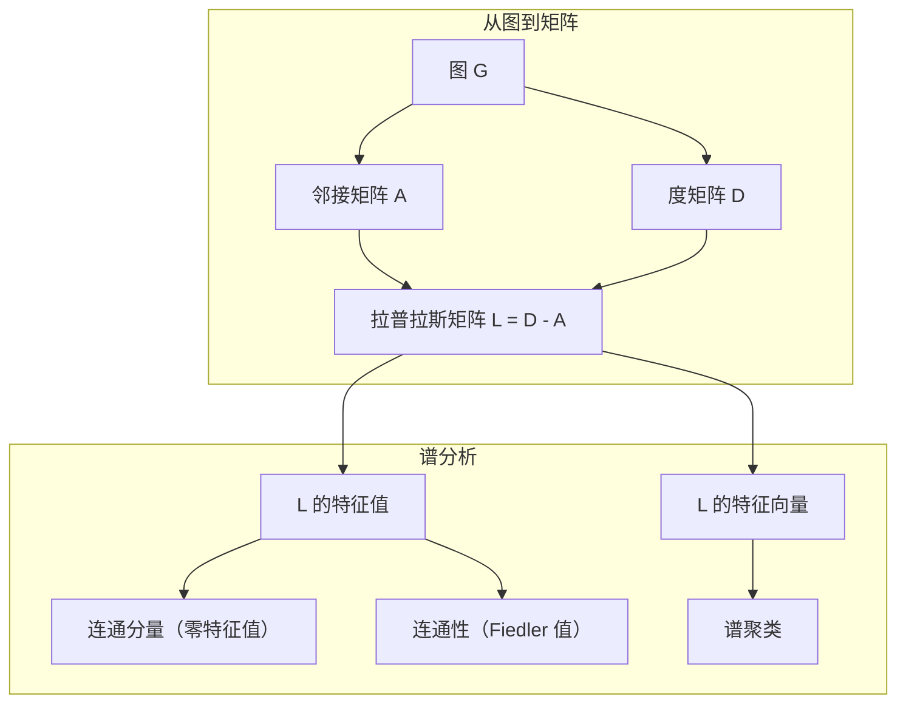
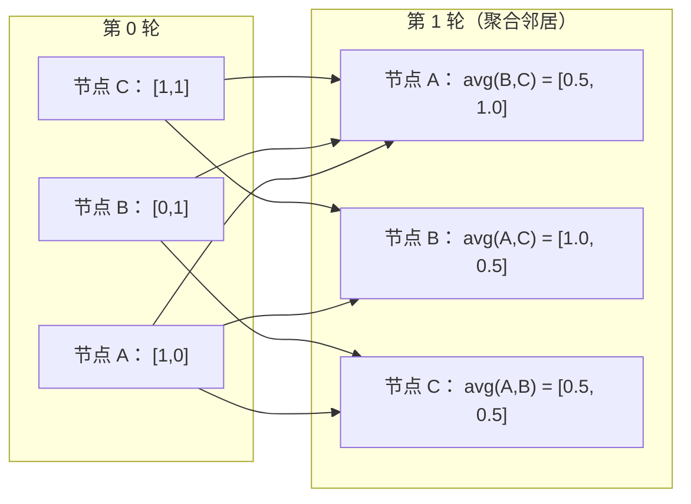

# 机器学习图论（Graph Theory for Machine Learning）

> 图是表示关系的数据结构。如果数据存在连接关系，就需要图论。

**Type:** Build
**Language:** Python
**Prerequisites:** 第 1 阶段，第 01–03 课（线性代数、矩阵）
**Time:** ~90 分钟

## 学习目标（Learning Objectives）

- 构建支持邻接矩阵/邻接表表示的图类，并实现 BFS 与 DFS 遍历
- 计算图拉普拉斯矩阵，使用其特征值检测连通分量并对节点聚类
- 将一轮 GNN 式消息传递实现为归一化邻接矩阵乘法
- 应用谱聚类，使用 Fiedler 向量划分图

## 问题背景（The Problem）

社交网络、分子、知识库、引用网络、路线图，全都是图。传统机器学习（Machine Learning，ML）把数据视为平面表格，每一行相互独立，每个特征占一列。但连接结构本身重要时，表格就不够用了。

以社交网络为例，你想预测用户会购买什么产品。用户自己的购买历史很重要，但朋友们的购买历史可能更重要。连接携带着信号。

再看分子：你想预测它是否会与蛋白质结合。原子很重要，但真正重要的是原子如何彼此成键。结构本身就是数据。

图神经网络（Graph Neural Network，GNN）是深度学习中增长最快的领域，支撑药物发现、社交推荐、欺诈检测和知识图谱推理。所有 GNN 都建立在同一个基础上：基本图论。

你需要四样东西：
1. 用矩阵表示图的方法，以便进行矩阵乘法
2. 探索图结构的遍历算法
3. 拉普拉斯矩阵，即谱图论中最重要的矩阵
4. 消息传递，即使 GNN 运转的操作

## 核心概念（The Concept）

### 图：节点与边（Graphs: Nodes and Edges）

图（Graph）G = (V, E) 由顶点（节点，Vertices/Nodes）V 和边（Edges）E 组成，每条边连接两个节点。

**有向与无向。** 在无向图（Undirected Graph）中，边 (u, v) 表示 u 连接 v，同时 v 连接 u。在有向图（Directed Graph，Digraph）中，边 (u, v) 表示 u 指向 v，但反向关系不一定成立。

**加权与无权。** 无权图（Unweighted Graph）中的边只有存在或不存在两种状态。加权图（Weighted Graph）的每条边都有数值权重，可以是距离、成本或强度。

| 图类型 | 示例 |
|-----------|---------|
| 无向、无权 | Facebook 好友网络 |
| 有向、无权 | Twitter 关注网络 |
| 无向、加权 | 路线图，权重为距离 |
| 有向、加权 | 网页链接，权重为 PageRank 分数 |

### 邻接矩阵（The Adjacency Matrix）

邻接矩阵（Adjacency Matrix）A 是核心表示。对于有 n 个节点的图：

```
A[i][j] = 1    若存在从节点 i 到节点 j 的边
A[i][j] = 0    否则
```

无向图的 A 对称：A[i][j] = A[j][i]。加权图中，A[i][j] = 边 (i, j) 的权重。

**示例：三角形。**

```
节点： 0, 1, 2
边： (0,1), (1,2), (0,2)

A = [[0, 1, 1],
     [1, 0, 1],
     [1, 1, 0]]
```

邻接矩阵是每个 GNN 的输入。对 A 的矩阵运算对应对图的操作。

### 度（Degree）

节点的度（Degree）是与之相连的边数。有向图还区分入度（In-degree，进入的边）和出度（Out-degree，指出的边）。

度矩阵（Degree Matrix）D 是对角矩阵：

```
D[i][i] = 节点 i 的度
D[i][j] = 0    当 i != j
```

对于三角形示例，D = diag(2, 2, 2)，因为每个节点都连接另外两个节点。

度反映节点重要性。度高意味着枢纽节点（Hub Node）。网络的度分布揭示其结构：社交网络遵循幂律，少数枢纽配上大量叶节点；随机图的度则呈泊松分布。

### BFS 与 DFS（BFS and DFS）

这是两种基本图遍历算法，两者都需要掌握。

**广度优先搜索（Breadth-First Search，BFS）：** 先探索所有邻居，再探索邻居的邻居。使用先进先出（First In, First Out，FIFO）队列。

```
从节点 0 开始 BFS：
  访问 0
  队列： [1, 2]        (0 的邻居)
  访问 1
  队列： [2, 3]        (加入 1 的邻居)
  访问 2
  队列： [3]           (2 的邻居已经访问)
  访问 3
  队列： []            (完成)
```

BFS 找到无权图中的最短路径。从起点到任一节点的距离，等于 BFS 首次发现该节点时所在的层数。因此 BFS 被用于社交网络中的跳数距离计算。

**深度优先搜索（Depth-First Search，DFS）：** 尽可能深入，再回溯。使用后进先出（Last In, First Out，LIFO）栈或递归。

```
从节点 0 开始 DFS：
  访问 0
  栈： [1, 2]        (0 的邻居)
  访问 2               (出栈)
  栈： [1, 3]         (加入 2 的邻居)
  访问 3               (出栈)
  栈： [1]
  访问 1               (出栈)
  栈： []             (完成)
```

DFS 可用于：
- 寻找连通分量，从未访问节点开始运行 DFS
- 环检测，检查 DFS 树中的回边
- 拓扑排序，反转 DFS 完成顺序

| 算法 | 数据结构 | 可找到 | 使用场景 |
|-----------|---------------|-------|----------|
| BFS | 队列 | 最短路径 | 社交网络距离、知识图谱遍历 |
| DFS | 栈 | 分量、环 | 连通性、拓扑排序 |

### 图拉普拉斯矩阵（The Graph Laplacian）

L = D - A。这是谱图论（Spectral Graph Theory）中最重要的矩阵。

对于三角形：

```
D = [[2, 0, 0],    A = [[0, 1, 1],    L = [[2, -1, -1],
     [0, 2, 0],         [1, 0, 1],         [-1, 2, -1],
     [0, 0, 2]]         [1, 1, 0]]         [-1, -1,  2]]
```

拉普拉斯矩阵具有重要性质：

1. **L 是半正定的（Positive Semidefinite）。** 所有特征值都 >= 0。

2. **零特征值的数量等于连通分量数。** 连通图恰好有一个零特征值；包含 3 个互不连通分量的图有三个零特征值。

3. **最小非零特征值（Fiedler 值）衡量连通性。** Fiedler 值大意味着图连接紧密，值小则意味着图存在薄弱处，即瓶颈。

4. **Fiedler 值对应的特征向量（Fiedler 向量）揭示最佳划分。** 分量为正的节点归为一组，为负的归为另一组。这就是谱聚类（Spectral Clustering）。



### 谱性质（Spectral Properties）

邻接矩阵和拉普拉斯矩阵的特征值无需遍历便可揭示结构性质。

**谱聚类**的过程如下：
1. 计算拉普拉斯矩阵 L
2. 寻找 L 的 k 个最小特征值对应的特征向量，跳过第一个，连通图中它是全 1 向量
3. 把这些特征向量作为各节点的新坐标
4. 在这些坐标上运行 k 均值（k-means）聚类

为什么有效？L 的特征向量编码图上“最平滑”的函数。连接紧密的节点获得相近的特征向量值，被瓶颈分开的节点获得不同的值，因此特征向量自然地分离出各簇。

**与随机游走的联系。** 归一化拉普拉斯矩阵与图上的随机游走（Random Walk）有关。随机游走的平稳分布与节点度成正比；混合时间（Mixing Time，即游走收敛有多快）取决于谱间隙（Spectral Gap）。

### 消息传递（Message Passing）

这是图神经网络的核心操作：每个节点从邻居收集消息，聚合后更新自身状态。

```
h_v^(k+1) = UPDATE(h_v^(k), AGGREGATE({h_u^(k) : u in neighbors(v)}))
```

最简单的形式中，AGGREGATE = 均值，UPDATE = 线性变换 + 激活：

```
h_v^(k+1) = sigma(W * mean({h_u^(k) : u in neighbors(v)}))
```

它本质上就是矩阵乘法。如果 H 是所有节点特征组成的矩阵，A 是邻接矩阵：

```
H^(k+1) = sigma(A_norm * H^(k) * W)
```

其中 A_norm 是归一化邻接矩阵，每行元素之和为 1。

一轮消息传递让每个节点“看到”直接邻居，两轮让它看到邻居的邻居，K 轮则给每个节点提供 K 跳邻域内的信息。



### 概念与机器学习应用（Concepts and ML Applications）

| 概念 | 机器学习应用 |
|---------|---------------|
| 邻接矩阵 | GNN 输入表示 |
| 图拉普拉斯矩阵 | 谱聚类、社区发现 |
| BFS/DFS | 知识图谱遍历、路径查找 |
| 度分布 | 节点重要性、特征工程 |
| 消息传递 | GNN 层，如图卷积网络（GCN）、图注意力网络（GAT）、GraphSAGE |
| L 的特征值 | 社区发现、图划分 |
| 谱聚类 | 无监督节点分组 |
| PageRank | 节点重要性、网页搜索 |

```figure
graph-degree-distribution
```

## 动手实现（Build It）

### 第 1 步：从零实现 Graph 类（Step 1: Graph class from scratch）

```python
class Graph:
    def __init__(self, n_nodes, directed=False):
        self.n = n_nodes
        self.directed = directed
        self.adj = {i: {} for i in range(n_nodes)}

    def add_edge(self, u, v, weight=1.0):
        self.adj[u][v] = weight
        if not self.directed:
            self.adj[v][u] = weight

    def neighbors(self, node):
        return list(self.adj[node].keys())

    def degree(self, node):
        return len(self.adj[node])

    def adjacency_matrix(self):
        import numpy as np
        A = np.zeros((self.n, self.n))
        for u in range(self.n):
            for v, w in self.adj[u].items():
                A[u][v] = w
        return A

    def degree_matrix(self):
        import numpy as np
        D = np.zeros((self.n, self.n))
        for i in range(self.n):
            D[i][i] = self.degree(i)
        return D

    def laplacian(self):
        return self.degree_matrix() - self.adjacency_matrix()
```

邻接表（Adjacency List，`self.adj`）高效存储邻居。邻接矩阵转换使用 numpy，因为所有谱运算都需要它。

### 第 2 步：BFS 与 DFS（Step 2: BFS and DFS）

```python
from collections import deque

def bfs(graph, start):
    visited = set()
    order = []
    distances = {}
    queue = deque([(start, 0)])
    visited.add(start)
    while queue:
        node, dist = queue.popleft()
        order.append(node)
        distances[node] = dist
        for neighbor in graph.neighbors(node):
            if neighbor not in visited:
                visited.add(neighbor)
                queue.append((neighbor, dist + 1))
    return order, distances


def dfs(graph, start):
    visited = set()
    order = []
    stack = [start]
    while stack:
        node = stack.pop()
        if node in visited:
            continue
        visited.add(node)
        order.append(node)
        for neighbor in reversed(graph.neighbors(node)):
            if neighbor not in visited:
                stack.append(neighbor)
    return order
```

BFS 使用双端队列（Deque），以 O(1) 完成 popleft；DFS 使用列表作为栈。两者都恰好访问每个节点一次，时间复杂度为 O(V + E)。

### 第 3 步：连通分量与拉普拉斯特征值（Step 3: Connected components and Laplacian eigenvalues）

```python
def connected_components(graph):
    visited = set()
    components = []
    for node in range(graph.n):
        if node not in visited:
            order, _ = bfs(graph, node)
            visited.update(order)
            components.append(order)
    return components


def laplacian_eigenvalues(graph):
    import numpy as np
    L = graph.laplacian()
    eigenvalues = np.linalg.eigvalsh(L)
    return eigenvalues
```

`eigvalsh` 用于对称矩阵，无向图的拉普拉斯矩阵始终对称。它按升序返回特征值，数一数零特征值即可得到连通分量数。

### 第 4 步：谱聚类（Step 4: Spectral clustering）

```python
def spectral_clustering(graph, k=2):
    import numpy as np
    L = graph.laplacian()
    eigenvalues, eigenvectors = np.linalg.eigh(L)
    features = eigenvectors[:, 1:k+1]

    labels = np.zeros(graph.n, dtype=int)
    for i in range(graph.n):
        if features[i, 0] >= 0:
            labels[i] = 0
        else:
            labels[i] = 1
    return labels
```

k=2 时，Fiedler 向量的符号将图分成两簇。k>2 时，应在前 k 个特征向量上运行 k-means，排除平凡的全 1 特征向量。

### 第 5 步：消息传递（Step 5: Message passing）

```python
def message_passing(graph, features, weight_matrix):
    import numpy as np
    A = graph.adjacency_matrix()
    row_sums = A.sum(axis=1, keepdims=True)
    row_sums[row_sums == 0] = 1
    A_norm = A / row_sums
    aggregated = A_norm @ features
    output = aggregated @ weight_matrix
    return output
```

这就是一轮 GNN 消息传递。每个节点的新特征为邻居特征的加权平均，再经权重矩阵变换。堆叠多轮可以让信息传播得更远。

## 实际应用（Use It）

使用 networkx 和 numpy，相同操作可以一行完成：

```python
import networkx as nx
import numpy as np

G = nx.karate_club_graph()

A = nx.adjacency_matrix(G).toarray()
L = nx.laplacian_matrix(G).toarray()

eigenvalues = np.linalg.eigvalsh(L.astype(float))
print(f"Smallest eigenvalues: {eigenvalues[:5]}")
print(f"Connected components: {nx.number_connected_components(G)}")

communities = nx.community.greedy_modularity_communities(G)
print(f"Communities found: {len(communities)}")

pr = nx.pagerank(G)
top_nodes = sorted(pr.items(), key=lambda x: x[1], reverse=True)[:5]
print(f"Top 5 PageRank nodes: {top_nodes}")
```

networkx 通过优化的 C 后端处理任意规模的图。生产环境中使用它，用从零实现的版本理解它的工作原理。

### numpy 谱分析（numpy spectral analysis）

```python
import numpy as np

A = np.array([
    [0, 1, 1, 0, 0],
    [1, 0, 1, 0, 0],
    [1, 1, 0, 1, 0],
    [0, 0, 1, 0, 1],
    [0, 0, 0, 1, 0]
])

D = np.diag(A.sum(axis=1))
L = D - A

eigenvalues, eigenvectors = np.linalg.eigh(L)
print(f"Eigenvalues: {np.round(eigenvalues, 4)}")
print(f"Fiedler value: {eigenvalues[1]:.4f}")
print(f"Fiedler vector: {np.round(eigenvectors[:, 1], 4)}")

fiedler = eigenvectors[:, 1]
group_a = np.where(fiedler >= 0)[0]
group_b = np.where(fiedler < 0)[0]
print(f"Cluster A: {group_a}")
print(f"Cluster B: {group_b}")
```

主要工作由 Fiedler 向量完成。正分量归一簇，负分量归另一簇。无需迭代优化，只需一次特征分解。

## 交付成果（Ship It）

本课产出：
- `outputs/skill-graph-analysis.md`：分析图结构数据的技能参考

## 关联知识（Connections）

| 概念 | 出现场景 |
|---------|------------------|
| 邻接矩阵 | GCN、GAT、GraphSAGE 输入 |
| 拉普拉斯矩阵 | 谱聚类、ChebNet 滤波器 |
| BFS | 知识图谱遍历、最短路径查询 |
| 消息传递 | 每个 GNN 层、神经消息传递 |
| 谱间隙 | 图连通性、随机游走的混合时间 |
| 度分布 | 幂律网络、节点特征工程 |
| 连通分量 | 预处理、处理非连通图 |
| PageRank | 节点重要性排序、注意力初始化 |

GNN 值得特别说明。图卷积网络（Graph Convolutional Network，GCN，Kipf 与 Welling，2017）中的图卷积使用添加自环的邻接矩阵 A_hat = A + I：

```text
H^(l+1) = sigma(D_hat^(-1/2) * A_hat * D_hat^(-1/2) * H^(l) * W^(l))
```

其中 A_hat = A + I，即邻接矩阵加自环；D_hat 是 A_hat 的度矩阵。自环确保每个节点在聚合时包含自身特征。这正是带对称归一化的消息传递。D_hat^(-1/2) * A_hat * D_hat^(-1/2) 是归一化邻接矩阵。这里会出现拉普拉斯矩阵，是因为该归一化与 L_sym = I - D^(-1/2) * A * D^(-1/2) 有关。理解拉普拉斯矩阵，就理解了 GCN 为何有效。

## 练习（Exercises）

1. **从零实现 PageRank。** 从均匀分数开始，每一步对所有指向 v 的 u 计算：score(v) = (1-d)/n + d * sum(score(u)/out_degree(u))。使用 d=0.85，运行至收敛，即变化 < 1e-6。在小型网页图上测试。

2. **使用谱聚类发现社区。** 创建包含两个明显分离簇的图，例如两个仅通过一条边连接的团（Clique）。运行谱聚类，验证能找到正确划分。增加跨簇边时会发生什么？

3. **实现 Dijkstra 算法，**求加权图的最短路径。在同一张所有权重相等的图上，与 BFS 结果比较。

4. **构建两层消息传递网络。** 使用不同权重矩阵应用两次消息传递。展示两轮后，每个节点都获得其 2 跳邻域的信息。

5. **分析真实世界的图。** 使用空手道俱乐部图（Karate Club Graph，34 个节点、78 条边）。计算度分布、拉普拉斯特征值和谱聚类，将谱聚类结果与已知真实划分比较。

## 关键术语（Key Terms）

| 术语 | 常见说法 | 实际含义 |
|------|----------------|----------------------|
| 图（Graph） | “节点与边” | 编码两两关系的数学结构 G=(V,E) |
| 邻接矩阵（Adjacency Matrix） | “连接表” | n x n 矩阵，节点 i 与 j 相连时 A[i][j] = 1 |
| 度（Degree） | “节点连接有多广” | 与节点相接的边数 |
| 拉普拉斯矩阵（Laplacian） | “D 减 A” | L = D - A，其特征值揭示图结构 |
| Fiedler 值（Fiedler Value） | “代数连通度” | L 的最小非零特征值，衡量图连接的紧密程度 |
| 广度优先搜索（BFS） | “逐层搜索” | 先访问所有邻居再深入的遍历，能找到最短路径 |
| 深度优先搜索（DFS） | “先深入” | 沿一条路径走到底再回溯的遍历 |
| 消息传递（Message Passing） | “节点与邻居交流” | 各节点聚合邻居信息，是 GNN 的核心 |
| 谱聚类（Spectral Clustering） | “按特征向量聚类” | 使用图拉普拉斯矩阵的特征向量划分图 |
| 连通分量（Connected Component） | “独立的一块” | 每个节点都可到达其他任意节点的极大子图 |

## 延伸阅读（Further Reading）

- **Kipf 与 Welling（2017）**：《使用图卷积网络进行半监督分类》（Semi-Supervised Classification with Graph Convolutional Networks）。开启现代 GNN 的论文，展示谱图卷积如何简化为消息传递。
- **Spielman（2012）**：《谱图论》（Spectral Graph Theory）讲义。拉普拉斯矩阵、谱间隙和图划分的权威入门。
- **Hamilton（2020）**：《图表示学习》（Graph Representation Learning）。覆盖 GNN 基础到应用的书籍。
- **Bronstein 等（2021）**：《几何深度学习：网格、群、图、测地线与规范》（Geometric Deep Learning: Grids, Groups, Graphs, Geodesics, and Gauges）。提出统一框架的论文。
- **Veličković 等（2018）**：《图注意力网络》（Graph Attention Networks）。用注意力机制扩展消息传递。
