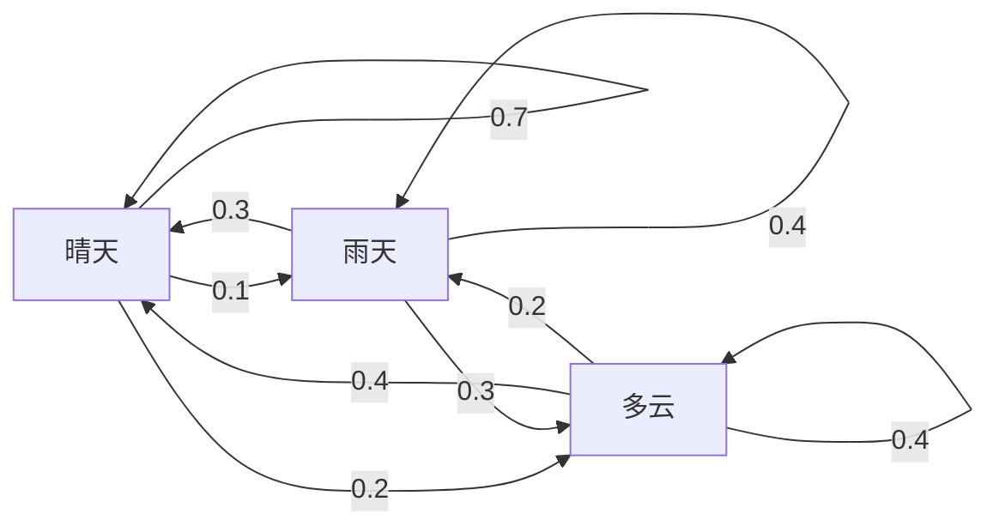
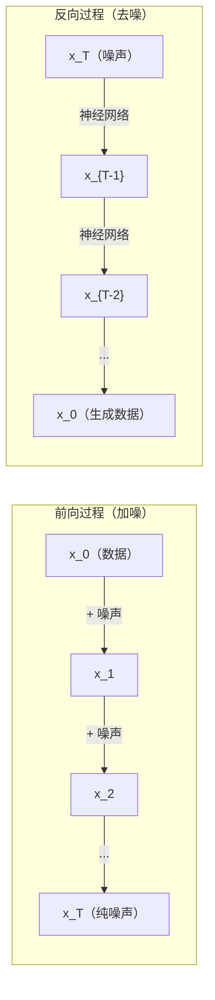

# 随机过程（Stochastic Processes）

> 有结构的随机性：随机游走、马尔可夫链与扩散模型背后的数学。

**Type:** Learn
**Language:** Python
**Prerequisites:** 第 1 阶段，第 06–07 课（概率、贝叶斯）
**Time:** ~75 分钟

## 学习目标（Learning Objectives）

- 模拟一维和二维随机游走，验证位移按 sqrt(n) 缩放
- 构建马尔可夫链模拟器，通过特征分解计算平稳分布
- 实现 Metropolis-Hastings MCMC 和朗之万动力学，从目标分布采样
- 将前向扩散过程与布朗运动联系起来，解释反向过程如何生成数据

## 问题背景（The Problem）

许多 AI 系统包含随时间演化的随机性。它不是静态随机性，而是有结构、按序发展的随机性，每一步都依赖此前发生的事。

语言模型逐个生成词元（Token），每个词元都依赖先前上下文。模型输出概率分布，从中采样，然后继续。这就是随机过程（Stochastic Process）。

扩散模型（Diffusion Model）逐步给图像加噪，直到它变成纯噪声；随后反转过程，逐步去噪，直到出现新图像。前向过程是马尔可夫链（Markov Chain），反向过程则是学习到的、反向运行的马尔可夫链。

强化学习（Reinforcement Learning，RL）智能体（Agent）在环境中采取动作，每个动作以一定概率导向新状态。智能体在随机世界中遵循随机策略，整个系统就是马尔可夫决策过程（Markov Decision Process，MDP）。

马尔可夫链蒙特卡洛（Markov Chain Monte Carlo，MCMC）采样是贝叶斯推断的支柱，它构造一条马尔可夫链，使其平稳分布等于你想采样的后验分布。

这些方法都基于四个基础思想：
1. 随机游走，最简单的随机过程
2. 马尔可夫链，用转移矩阵组织的随机性
3. 朗之万动力学，带噪声的梯度下降
4. Metropolis-Hastings，从任意分布采样

## 核心概念（The Concept）

### 随机游走（Random Walks）

从位置 0 出发，每一步抛一枚公平硬币。正面向右移 +1，反面向左移 -1。

经过 n 步，位置是 n 个随机 +/-1 值之和。期望位置为 0，因为游走无偏；但到原点的期望距离按 sqrt(n) 增长。

这与直觉相反。游走公平，在两个方向都没有漂移，但随着时间推移，它会离起点越来越远。n 步后的标准差为 sqrt(n)。

```
第 0 步：位置 = 0
第 1 步：位置 = +1 或 -1
第 2 步：位置 = +2, 0, 或 -2
...
第 100 步：距原点的期望距离 ~ 10 (sqrt(100))
第 10000 步：距原点的期望距离 ~ 100 (sqrt(10000))
```

**在二维中，**游走以相同概率向上、下、左、右移动。到原点的距离同样按 sqrt(n) 缩放，轨迹形成类似分形的图案。

**为什么是 sqrt(n)？** 每一步以相同概率取 +1 或 -1。n 步后，位置 S_n = X_1 + X_2 + ... + X_n，其中每个 X_i 为 +/-1。每一步方差为 1，且各步独立，因此 Var(S_n) = n，标准差 = sqrt(n)。根据中心极限定理（Central Limit Theorem），S_n / sqrt(n) 收敛到标准正态分布。

这种 sqrt(n) 缩放在机器学习中无处不在。SGD 噪声按 1/sqrt(batch_size) 缩放，嵌入维度按 sqrt(d) 缩放。平方根是独立随机量相加的标志。

**与布朗运动的联系。** 令随机游走步长为 1/sqrt(n)，每单位时间走 n 步。当 n 趋向无穷时，游走收敛到布朗运动（Brownian Motion）B(t)：一个连续时间过程，B(t) 服从均值为 0、方差为 t 的正态分布。

布朗运动是扩散的数学基础，用来描述流体中粒子的随机抖动、股价波动，以及关键的扩散模型噪声过程。

**赌徒破产问题（Gambler's Ruin）。** 随机游走从位置 k 开始，在 0 和 N 处设吸收边界。先到 N 而非 0 的概率是多少？公平游走中，P(reach N) = k/N。这个结果简单而优雅，与鞅（Martingale）理论相联系：公平随机游走是一种鞅，未来期望值等于当前值。

### 马尔可夫链（Markov Chains）

马尔可夫链是按固定概率在状态间转移的系统。关键性质是：下一状态只依赖当前状态，不依赖历史。

```
P(X_{t+1} = j | X_t = i, X_{t-1} = ...) = P(X_{t+1} = j | X_t = i)
```

这就是马尔可夫性质（Markov Property）。它意味着可以用转移矩阵（Transition Matrix）P 描述整个动态过程：

```
P[i][j] = 从状态 i 转移到状态 j 的概率
```

P 的每行之和为 1，因为系统总要转移到某个状态。

**示例：天气。**

```
状态： 晴天 (0), 雨天 (1), 多云 (2)

P = [[0.7, 0.1, 0.2],    (若为晴天： 70% 晴天, 10% 雨天, 20% 多云)
     [0.3, 0.4, 0.3],    (若为雨天： 30% 晴天, 40% 雨天, 30% 多云)
     [0.4, 0.2, 0.4]]    (若为多云： 40% 晴天, 20% 雨天, 40% 多云)
```

从任意状态出发，经过许多次转移后，状态分布收敛到平稳分布（Stationary Distribution）pi，满足 pi * P = pi。它是 P 对应特征值 1 的左特征向量。

对于天气链，平稳分布为 [0.55, 0.18, 0.27]。长期来看，无论初始状态如何，55% 的时间都是晴天。



**计算平稳分布。** 有两种方法：

1. **幂法（Power Method）：** 将任意初始分布反复乘以 P，足够多次迭代后便会收敛。
2. **特征值法（Eigenvalue Method）：** 寻找 P 对应特征值 1 的左特征向量，也就是 P^T 对应特征值 1 的特征向量。

两种方法都要求该链满足收敛条件。

**收敛条件。** 满足以下条件时，马尔可夫链收敛到唯一平稳分布：
- **不可约（Irreducible）：** 每个状态都能从其他任意状态到达
- **非周期（Aperiodic）：** 链不会以固定周期循环

机器学习中遇到的大多数链满足这两个条件。

**吸收态（Absorbing State）。** 若进入某状态后永远不会离开，即 P[i][i] = 1，该状态就是吸收态。吸收马尔可夫链描述有终止状态的过程，例如游戏结束、客户流失，或词元序列到达文本结束词元。

**混合时间（Mixing Time）。** 链需要多少步才“接近”平稳分布？形式化地说，就是与平稳分布的总变差距离降到某阈值以下所需的步数。混合快意味着需要步数少。P 的谱间隙（Spectral Gap，1 减去第二大特征值）控制混合时间，间隙越大，混合越快。

### 与语言模型的联系（Connection to Language Models）

语言模型的词元生成近似为马尔可夫过程。给定当前上下文，模型输出下一词元的分布。温度（Temperature）控制分布的尖锐程度：

```
P(token_i) = exp(logit_i / temperature) / sum(exp(logit_j / temperature))
```

- Temperature = 1.0：标准分布
- Temperature < 1.0：更尖锐，更确定
- Temperature > 1.0：更平坦，更随机
- Temperature -> 0：argmax，即贪心选择

Top-k 采样截断为概率最高的 k 个词元。Top-p（核采样，Nucleus Sampling）截断为累计概率超过 p 的最小词元集合。两者都修改了马尔可夫转移概率。

### 布朗运动（Brownian Motion）

布朗运动是随机游走的连续时间极限。位置 B(t) 有三个性质：
1. B(0) = 0
2. B(t) - B(s) 服从均值为 0、方差为 t - s 的正态分布，其中 t > s
3. 不重叠区间上的增量相互独立

布朗运动连续但处处不可微，在每个尺度上都存在抖动。其平面轨迹的分形维数为 2。

离散模拟中，通过下式近似布朗运动：

```
B(t + dt) = B(t) + sqrt(dt) * z,    其中 z ~ N(0, 1)
```

sqrt(dt) 缩放非常重要，来源于将中心极限定理应用于随机游走。

### 朗之万动力学（Langevin Dynamics）

梯度下降寻找函数最小值。朗之万动力学（Langevin Dynamics）寻找与 exp(-U(x)/T) 成正比的概率分布，其中 U 是能量函数，T 是温度。

```
x_{t+1} = x_t - dt * gradient(U(x_t)) + sqrt(2 * T * dt) * z_t
```

粒子受到两种力：
1. **梯度力**（-dt * gradient(U)）：像梯度下降一样推向低能量区域
2. **随机力**（sqrt(2*T*dt) * z）：向随机方向推动，用于探索

温度 T = 0 时，这就是纯梯度下降。高温时，它近似随机游走。温度合适时，粒子探索能量地形，并在低能量区域停留更久。

**与扩散模型的联系。** 扩散模型的前向过程为：

```
x_t = sqrt(alpha_t) * x_{t-1} + sqrt(1 - alpha_t) * noise
```

这是一条逐渐将数据与噪声混合的马尔可夫链。足够多步后，x_T 变为纯高斯噪声。

反向过程从噪声回到数据，也是一条马尔可夫链，但其转移概率由神经网络学习。网络学习预测每一步添加的噪声，然后减去它。



### 马尔可夫链蒙特卡洛（MCMC: Markov Chain Monte Carlo）

有时你需要从分布 p(x) 采样，它可以求值，允许差一个常数因子，却无法直接采样。贝叶斯后验就是典型示例：你知道似然与先验的乘积，但归一化常数难以计算。

**Metropolis-Hastings** 构造一条平稳分布为 p(x) 的马尔可夫链：

1. 从某位置 x 开始
2. 从提议分布（Proposal Distribution）Q(x'|x) 提出新位置 x'
3. 计算接受比：a = p(x') * Q(x|x') / (p(x) * Q(x'|x))
4. 以 min(1, a) 的概率接受 x'，否则留在 x
5. 重复

如果 Q 对称，例如 Q(x'|x) = Q(x|x') = N(x, sigma^2)，接受比可简化为 a = p(x') / p(x)。只需要概率比，归一化常数会抵消。

在温和条件下，该链保证收敛到 p(x)。但提议步长太小会近似随机游走，太大会频繁拒绝，均可能导致收敛缓慢。调节提议分布是 MCMC 的技巧所在。

**为什么有效。** 接受比确保细致平衡（Detailed Balance）：位于 x 并移到 x' 的概率，等于位于 x' 并移到 x 的概率。细致平衡意味着 p(x) 是链的平稳分布。因此经过足够多步，样本就来自 p(x)。

**实践注意事项：**
- **预热（Burn-in）：** 丢弃前 N 个样本，链从起点到达平稳分布需要时间。
- **抽稀（Thinning）：** 每隔 k 个样本保留一个，以降低自相关。
- **多链（Multiple Chains）：** 从不同起点运行多条链。如果收敛到同一分布，就获得了收敛证据。
- **接受率（Acceptance Rate）：** 对 d 维高斯提议，最优接受率约为 23%（Roberts 与 Rosenthal，2001）。太高意味着链几乎不移动，太低意味着几乎拒绝一切。

### AI 中的随机过程（Stochastic Processes in AI）

| 过程 | AI 应用 |
|---------|---------------|
| 随机游走 | RL 探索、Node2Vec 嵌入 |
| 马尔可夫链 | 文本生成、MCMC 采样 |
| 布朗运动 | 扩散模型的前向过程 |
| 朗之万动力学 | 基于得分的生成模型、SGLD |
| 马尔可夫决策过程 | 强化学习 |
| Metropolis-Hastings | 贝叶斯推断、后验采样 |

```figure
random-walk-diffusion
```

## 动手实现（Build It）

### 第 1 步：随机游走模拟器（Step 1: Random walk simulator）

```python
import numpy as np

def random_walk_1d(n_steps, seed=None):
    rng = np.random.RandomState(seed)
    steps = rng.choice([-1, 1], size=n_steps)
    positions = np.concatenate([[0], np.cumsum(steps)])
    return positions


def random_walk_2d(n_steps, seed=None):
    rng = np.random.RandomState(seed)
    directions = rng.choice(4, size=n_steps)
    dx = np.zeros(n_steps)
    dy = np.zeros(n_steps)
    dx[directions == 0] = 1   # right
    dx[directions == 1] = -1  # left
    dy[directions == 2] = 1   # up
    dy[directions == 3] = -1  # down
    x = np.concatenate([[0], np.cumsum(dx)])
    y = np.concatenate([[0], np.cumsum(dy)])
    return x, y
```

一维游走存储累积和，每一步是 +1 或 -1，n 步后的位置就是这些步的总和。方差随 n 线性增长，因此标准差按 sqrt(n) 增长。

### 第 2 步：马尔可夫链（Step 2: Markov chain）

```python
class MarkovChain:
    def __init__(self, transition_matrix, state_names=None):
        self.P = np.array(transition_matrix, dtype=float)
        self.n_states = len(self.P)
        self.state_names = state_names or [str(i) for i in range(self.n_states)]

    def step(self, current_state, rng=None):
        if rng is None:
            rng = np.random.RandomState()
        probs = self.P[current_state]
        return rng.choice(self.n_states, p=probs)

    def simulate(self, start_state, n_steps, seed=None):
        rng = np.random.RandomState(seed)
        states = [start_state]
        current = start_state
        for _ in range(n_steps):
            current = self.step(current, rng)
            states.append(current)
        return states

    def stationary_distribution(self):
        eigenvalues, eigenvectors = np.linalg.eig(self.P.T)
        idx = np.argmin(np.abs(eigenvalues - 1.0))
        stationary = np.real(eigenvectors[:, idx])
        stationary = stationary / stationary.sum()
        return np.abs(stationary)
```

平稳分布是 P 对应特征值 1 的左特征向量。通过计算 P^T 的特征向量找到它，因为转置把左特征向量转换为右特征向量。

### 第 3 步：朗之万动力学（Step 3: Langevin dynamics）

```python
def langevin_dynamics(grad_U, x0, dt, temperature, n_steps, seed=None):
    rng = np.random.RandomState(seed)
    x = np.array(x0, dtype=float)
    trajectory = [x.copy()]
    for _ in range(n_steps):
        noise = rng.randn(*x.shape)
        x = x - dt * grad_U(x) + np.sqrt(2 * temperature * dt) * noise
        trajectory.append(x.copy())
    return np.array(trajectory)
```

梯度将 x 推向低能量区域，噪声防止它被困住。平衡时，样本分布与 exp(-U(x)/temperature) 成正比。

### 第 4 步：Metropolis-Hastings（Step 4: Metropolis-Hastings）

```python
def metropolis_hastings(target_log_prob, proposal_std, x0, n_samples, seed=None):
    rng = np.random.RandomState(seed)
    x = np.array(x0, dtype=float)
    samples = [x.copy()]
    accepted = 0
    for _ in range(n_samples - 1):
        x_proposed = x + rng.randn(*x.shape) * proposal_std
        log_ratio = target_log_prob(x_proposed) - target_log_prob(x)
        if np.log(rng.rand()) < log_ratio:
            x = x_proposed
            accepted += 1
        samples.append(x.copy())
    acceptance_rate = accepted / (n_samples - 1)
    return np.array(samples), acceptance_rate
```

算法提出新点，检查其概率是否更高，或以与概率比成正比的概率接受它，然后重复。为了良好混合，接受率应在 23–50% 左右。

## 实际应用（Use It）

实践中会使用成熟库实现这些算法，但理解机制对调试与调参很重要。

```python
import numpy as np

rng = np.random.RandomState(42)
walk = np.cumsum(rng.choice([-1, 1], size=10000))
print(f"Final position: {walk[-1]}")
print(f"Expected distance: {np.sqrt(10000):.1f}")
print(f"Actual distance: {abs(walk[-1])}")
```

### 使用 numpy 处理转移矩阵（numpy for transition matrices）

```python
import numpy as np

P = np.array([[0.7, 0.1, 0.2],
              [0.3, 0.4, 0.3],
              [0.4, 0.2, 0.4]])

distribution = np.array([1.0, 0.0, 0.0])
for _ in range(100):
    distribution = distribution @ P

print(f"Stationary distribution: {np.round(distribution, 4)}")
```

将初始分布反复乘以 P。足够多次迭代后，无论从哪里开始，都会收敛到平稳分布。这就是寻找主导左特征向量的幂法。

### 与实际框架的联系（Connections to real frameworks）

- **PyTorch 扩散：** Hugging Face `diffusers` 中的 `DDPMScheduler` 实现前向和反向马尔可夫链
- **NumPyro / PyMC：** 使用 MCMC 进行贝叶斯推断，其中无折返采样器（No-U-Turn Sampler，NUTS）改进了 Metropolis-Hastings
- **Gymnasium（RL）：** 环境的 step 函数定义马尔可夫决策过程

### 验证马尔可夫链收敛（Verifying Markov chain convergence）

```python
import numpy as np

P = np.array([[0.9, 0.1], [0.3, 0.7]])

eigenvalues = np.linalg.eigvals(P)
spectral_gap = 1 - sorted(np.abs(eigenvalues))[-2]
print(f"Eigenvalues: {eigenvalues}")
print(f"Spectral gap: {spectral_gap:.4f}")
print(f"Approximate mixing time: {1/spectral_gap:.1f} steps")
```

谱间隙告诉你链忘记初始状态有多快。间隙为 0.2 意味着大约 5 步混合，间隙为 0.01 意味着大约 100 步。运行长模拟前一定要检查，混合缓慢的链会浪费算力。

## 交付成果（Ship It）

本课产出：
- `outputs/prompt-stochastic-process-advisor.md`：帮助判断给定问题适用哪种随机过程框架的提示词（Prompt）

## 关联知识（Connections）

| 概念 | 出现场景 |
|---------|------------------|
| 随机游走 | Node2Vec 图嵌入、RL 探索 |
| 马尔可夫链 | 大语言模型（Large Language Model，LLM）词元生成、MCMC 采样 |
| 布朗运动 | DDPM 前向扩散、基于随机微分方程（Stochastic Differential Equation，SDE）的模型 |
| 朗之万动力学 | 基于得分的生成模型、随机梯度朗之万动力学（SGLD） |
| 平稳分布 | MCMC 收敛目标、PageRank |
| Metropolis-Hastings | 贝叶斯后验采样、模拟退火 |
| 温度 | LLM 采样、RL 中的玻尔兹曼探索、模拟退火 |
| 混合时间 | MCMC 收敛速度、谱间隙分析 |
| 吸收态 | 序列结束词元、RL 终止状态 |
| 细致平衡 | MCMC 采样器正确性保证 |

扩散模型值得特别关注。去噪扩散概率模型（Denoising Diffusion Probabilistic Models，DDPM，Ho 等，2020）定义一条前向马尔可夫链：

```
q(x_t | x_{t-1}) = N(x_t; sqrt(1-beta_t) * x_{t-1}, beta_t * I)
```

其中 beta_t 为噪声调度。T 步后，x_T 近似服从 N(0, I)。反向过程由预测噪声的神经网络参数化：

```
p_theta(x_{t-1} | x_t) = N(x_{t-1}; mu_theta(x_t, t), sigma_t^2 * I)
```

每一步生成都是学习到的马尔可夫链的一步。理解马尔可夫链，就能理解扩散模型如何生成数据，以及为何能够生成数据。

随机梯度朗之万动力学（Stochastic Gradient Langevin Dynamics，SGLD）将小批量梯度下降与朗之万噪声结合。不计算完整梯度，而使用随机估计并添加经校准的噪声。随着学习率衰减，SGLD 从优化过渡到采样，无需额外成本就能获得近似贝叶斯后验样本。这是从神经网络获取不确定性估计最简单的方法之一。

贯穿这些联系的关键洞见是：随机过程不只是理论工具，也是现代 AI 系统内部的计算机制。调整 LLM 温度，就是调整马尔可夫链；训练扩散模型，就是学习反转类似布朗运动的过程；运行贝叶斯推断，就是构造收敛到后验的链。

## 练习（Exercises）

1. **模拟 1000 次、每次 10000 步的随机游走。** 绘制最终位置分布，验证它近似为均值 0、标准差 sqrt(10000) = 100 的高斯分布。

2. **使用马尔可夫链构建文本生成器。** 在小语料上训练，对每个词统计到下一个词的转移次数，构建转移矩阵。通过从链采样生成新句子。

3. **使用 Metropolis-Hastings 实现模拟退火（Simulated Annealing）。** 从高温开始，几乎接受所有提议，再逐渐降温，只接受改进。用它寻找有许多局部最小值的函数的最小值。

4. **比较不同温度的朗之万动力学。** 从双阱势 U(x) = (x^2 - 1)^2 采样。低温时样本聚集在一个势阱，高温时分布到两个势阱。找出链开始在两个势阱之间混合的临界温度。

5. **实现前向扩散过程。** 从一维信号，例如正弦波开始，使用线性噪声调度，在 100 步内逐渐添加噪声。展示信号如何退化为纯噪声。再实现一个反转此过程的简单去噪器，即使只是减去估计噪声的朴素版本也可以。

## 关键术语（Key Terms）

| 术语 | 常见说法 | 实际含义 |
|------|----------------|----------------------|
| 随机游走（Random Walk） | “抛硬币式移动” | 每步位置按随机增量变化的过程 |
| 马尔可夫性质（Markov Property） | “无记忆” | 未来只依赖当前状态，不依赖历史 |
| 转移矩阵（Transition Matrix） | “概率表” | P[i][j] = 从状态 i 转移到状态 j 的概率 |
| 平稳分布（Stationary Distribution） | “长期平均” | 满足 pi*P = pi 的分布 pi，即链的平衡状态 |
| 布朗运动（Brownian Motion） | “随机抖动” | 随机游走的连续时间极限，B(t) ~ N(0, t) |
| 朗之万动力学（Langevin Dynamics） | “带噪声的梯度下降” | 结合确定性梯度与随机扰动的更新规则 |
| 马尔可夫链蒙特卡洛（MCMC） | “走向目标” | 构造平稳分布等于目标分布的马尔可夫链 |
| Metropolis-Hastings | “提议并接受/拒绝” | 通过接受比确保收敛的 MCMC 算法 |
| 温度（Temperature） | “随机性旋钮” | 控制探索与利用权衡的参数 |
| 扩散过程（Diffusion Process） | “加噪再去噪” | 前向逐渐添加噪声，反向逐渐移除噪声，从而生成数据 |

## 延伸阅读（Further Reading）

- **Ho、Jain、Abbeel（2020）**：《去噪扩散概率模型》（Denoising Diffusion Probabilistic Models）。开启扩散模型变革的 DDPM 论文，清晰推导前向与反向马尔可夫链。
- **Song 与 Ermon（2019）**：《通过估计数据分布梯度进行生成建模》（Generative Modeling by Estimating Gradients of the Data Distribution）。使用朗之万动力学采样的基于得分的方法。
- **Roberts 与 Rosenthal（2004）**：《一般状态空间马尔可夫链与 MCMC 算法》（General state space Markov chains and MCMC algorithms）。解释 MCMC 何时以及为何有效的理论。
- **Norris（1997）**：《马尔可夫链》（Markov Chains）。标准教材，涵盖收敛、平稳分布和首次到达时间。
- **Welling 与 Teh（2011）**：《通过随机梯度朗之万动力学进行贝叶斯学习》（Bayesian Learning via Stochastic Gradient Langevin Dynamics）。结合 SGD 与朗之万动力学，实现可扩展贝叶斯推断。
