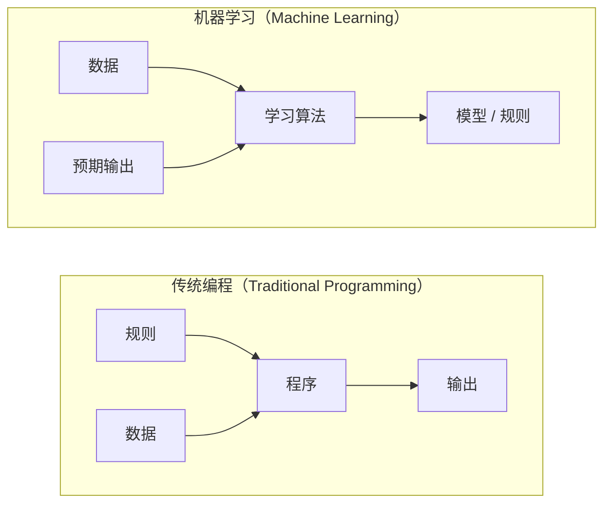
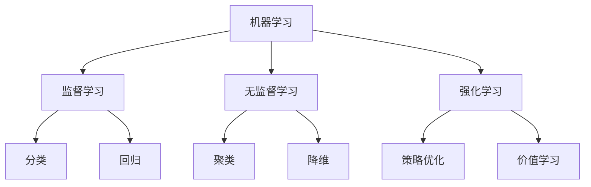
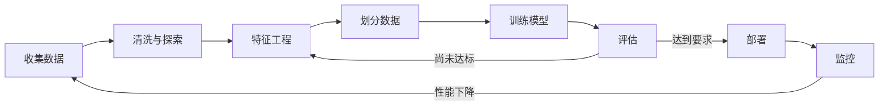
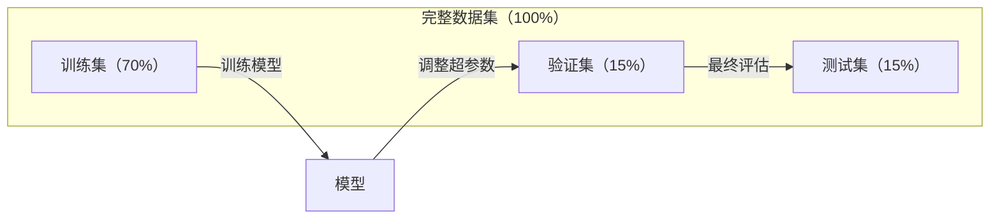
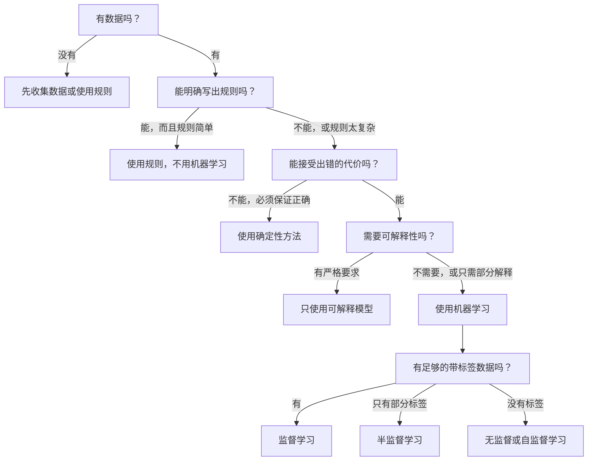

# 什么是机器学习（What Is Machine Learning）

> 机器学习（Machine Learning，ML）让计算机从数据中发现模式，而不是由人手工编写规则。

**Type:** Learn
**Languages:** Python
**Prerequisites:** 阶段 1：数学基础（Math Foundations）
**Time:** ~45 分钟

## 学习目标（Learning Objectives）

- 解释监督学习、无监督学习与强化学习的区别，并判断给定问题适合哪一种学习方式
- 从零实现最近质心分类器（Nearest Centroid Classifier），并与随机基线比较评估结果
- 区分分类与回归任务，为每一种任务选择适当的损失函数
- 判断一个业务问题是否适合机器学习，还是用确定性规则解决更合适

## 问题（The Problem）

你想构建一个垃圾邮件过滤器。传统做法是坐下来编写数百条规则：“如果邮件包含‘免费送钱’，就标记为垃圾邮件；如果感叹号超过 3 个，也标记为垃圾邮件。”你花了数周编写规则，垃圾邮件发送者却改变了措辞。规则失效了，你只好再写更多规则，如此循环，永无止境。

机器学习把这个过程反过来。你不再编写规则，而是给计算机数千封带标签的邮件（“垃圾邮件”或“非垃圾邮件”），让它自己找出规则。计算机会发现你从未想到的模式。当垃圾邮件发送者改变策略时，你只需用新数据重新训练，而不用重写代码。

从“编写规则”转向“从数据中学习”，就是机器学习的核心。推荐引擎、语音助手、自动驾驶汽车和语言模型，都采用这种方式工作。

## 概念（The Concept）

### 从数据而非规则中学习（Learning From Data, Not Rules）

传统编程与机器学习以相反的方向解决问题。



传统编程：你编写规则，程序将规则应用于数据，产生输出。

机器学习：你提供数据和预期输出，算法发现规则。

训练得到的“模型”本身就是规则，只不过它们被编码为数字（权重、参数）。模型从见过的样本中归纳规律，再对从未见过的数据作出预测，这就是泛化（Generalization）。

### 机器学习的三种类型（The Three Types of Machine Learning）



**监督学习（Supervised Learning）**：你有输入与输出配对的数据，模型学习从输入到输出的映射。
- “这里有 10,000 张标记为猫或狗的照片，学会区分它们。”
- “这里有房屋特征和价格，学会预测价格。”

**无监督学习（Unsupervised Learning）**：你只有输入，没有标签，模型自行发现结构。
- “这里有 10,000 位客户的购买记录，找出自然形成的分组。”
- “这里有 1,000 维的数据点，在保留结构的同时将它们降到 2 维。”

**强化学习（Reinforcement Learning，RL）**：智能体（Agent）在环境中采取行动，并获得奖励或惩罚。它学习一种策略（Policy），使总奖励最大化。
- “玩这个游戏，赢了 +1，输了 -1，自己想出策略。”
- “控制这只机械臂，抓起物体 +1，每浪费一秒 -0.01。”

实际工作中，你构建的大部分系统使用监督学习。无监督学习常用于预处理和探索。强化学习则用于游戏 AI、机器人，以及语言模型的基于人类反馈的强化学习（Reinforcement Learning from Human Feedback，RLHF）。

### 三大类型之外（Beyond the Big Three）

上面的三种类型界限分明，但现实中的机器学习常常融合多种思路。

**半监督学习（Semi-supervised Learning）**使用少量有标签数据和大量无标签数据。例如，你可能有 100 张带标签的医学图像，以及 100,000 张无标签图像。相关技术包括：

- **标签传播（Label Propagation）：**构建一张连接相似数据点的图。标签沿图从有标签节点传播到相邻的无标签节点。
- **伪标签（Pseudo-labeling）：**先用有标签数据训练模型，再用它预测无标签数据的标签，最后用全部数据重新训练。模型以自举方式扩充自己的训练集。
- **一致性正则化（Consistency Regularization）：**模型对同一个输入及其轻微扰动版本应给出相同预测。即使没有标签，这种方法也能发挥作用。

**自监督学习（Self-supervised Learning）**从数据本身构造监督信号，完全不需要人工标签。模型利用数据结构创建自己的预测任务。

- **掩码语言建模（Masked Language Modeling，BERT）：**隐藏句子中 15% 的词，训练模型预测缺失词。“标签”来自原始文本。
- **对比学习（Contrastive Learning，SimCLR）：**对一张图像生成两个增强版本，训练模型识别它们来自同一张图像，同时将它们与其他图像的增强版本区分开。
- **下一词元预测（Next-token Prediction，GPT）：**根据前面所有词预测下一个词。每篇文本文档都能成为训练样本。

这些不是独立于三大类型的新类别，而是结合监督与无监督思想的策略。从技术角度看，自监督学习属于监督学习（模型需要预测某个目标），但其标签是自动生成的，而不是由人标注的。

### 分类与回归（Classification vs Regression）

这是监督学习的两类主要任务。

| 维度 | 分类（Classification） | 回归（Regression） |
|--------|---------------|------------|
| 输出 | 离散类别 | 连续数值 |
| 示例 | “这封邮件是垃圾邮件吗？” | “这套房子的价格会是多少？” |
| 输出空间 | {猫, 狗, 鸟} | 任意实数 |
| 损失函数 | 交叉熵（Cross-entropy）、准确率（Accuracy） | 均方误差（Mean Squared Error，MSE）、平均绝对误差（Mean Absolute Error，MAE） |
| 决策 | 类别之间的边界 | 拟合数据的曲线 |

分类回答“属于哪一类？”，回归回答“有多少？”。

有些问题可以从任一角度建模。预测股票上涨还是下跌是分类，预测确切股价则是回归。

### 机器学习工作流（The ML Workflow）

无论采用哪种算法，每个机器学习项目都遵循相同的流水线（Pipeline）。



**收集数据（Collect Data）**：收集原始数据。数据更多通常更好，但质量比数量更重要。

**清洗与探索（Clean & Explore）**：处理缺失值、去重、可视化分布并发现异常。这一步通常占项目总时间的 60–80%。

**特征工程（Feature Engineering）**：将原始数据转换成模型可以使用的特征。例如，将日期转换成星期几、归一化数值列、编码类别变量。好特征比花哨的算法更重要。

**划分数据（Split Data）**：将数据分为训练集、验证集和测试集。模型在训练集上训练，你在验证集上调整超参数，最后在测试集上报告性能。

**训练模型（Train Model）**：将训练数据输入算法，算法调整内部参数，使损失函数（Loss Function）最小化。

**评估（Evaluate）**：在验证或测试数据上衡量性能。如果性能达不到要求，就回到前面，尝试不同的特征、算法或超参数。

**部署（Deploy）**：将模型投入生产环境，让它对新数据作出预测。

**监控（Monitor）**：持续跟踪性能。数据分布会变化，即数据漂移（Data Drift），模型性能也会衰退。性能下降时需要重新训练。

### 训练集、验证集与测试集划分（Training, Validation, and Test Splits）

这是初学者最容易理解错、也最重要的概念。必须用模型在训练时从未见过的数据来评估它，否则你衡量的是记忆能力，而不是学习能力。



| 数据划分 | 用途 | 使用时机 | 常见比例 |
|-------|---------|-----------|-------------|
| 训练集（Training） | 模型从这些数据中学习 | 训练期间 | 60–80% |
| 验证集（Validation） | 调整超参数、比较模型 | 每次训练结束后 | 10–20% |
| 测试集（Test） | 最终的无偏性能估计 | 全部工作结束时，仅一次 | 10–20% |

测试集必须严格隔离，只在最后查看一次。如果你不断依据测试性能调整模型，实际上就是在测试集上训练，报告出来的数字也就失去了意义。

对于小数据集，可以使用 k 折交叉验证（k-fold Cross-validation）：将数据分成 k 份，用 k-1 份训练，剩下一份验证，轮换各份的角色，最后对结果取平均。

### 过拟合与欠拟合（Overfitting vs Underfitting）


**欠拟合（Underfitting）**：模型太简单，无法捕捉数据中的模式，例如用直线拟合曲线关系。训练误差高，测试误差也高。

**过拟合（Overfitting）**：模型太复杂，记住了训练数据，包括其中的噪声。例如，一条曲折的曲线穿过每一个训练点，却无法适用于新数据。训练误差低，测试误差高。

**良好拟合（Good Fit）**：模型捕捉了真实模式，而没有记住噪声。训练误差和测试误差都保持在合理的低水平。

过拟合的迹象：
- 训练准确率远高于验证准确率
- 模型在训练数据上表现好，在新数据上表现差
- 增加训练数据能提升性能（模型此前是在记忆，而不是学习）

解决过拟合的方法：
- 获取更多训练数据
- 降低模型复杂度（减少参数、简化架构）
- 正则化（Regularization）：对过大的权重添加惩罚
- 随机失活（Dropout）：训练时随机将神经元输出置零
- 早停（Early Stopping）：验证误差开始上升时停止训练

解决欠拟合的方法：
- 使用更复杂的模型
- 增加特征
- 减弱正则化
- 延长训练时间

### 偏差与方差的权衡（The Bias-Variance Tradeoff）

这是解释过拟合与欠拟合的数学框架。

**偏差（Bias）**：模型中的错误假设造成的误差。当真实关系是非线性时，线性模型就具有高偏差。高偏差会导致欠拟合。

**方差（Variance）**：模型对训练数据微小波动的敏感性造成的误差。高方差模型在不同数据子集上训练后，会给出差异很大的预测。高方差会导致过拟合。

| 模型复杂度 | 偏差 | 方差 | 结果 |
|-----------------|------|----------|--------|
| 过低（用线性模型拟合曲线数据） | 高 | 低 | 欠拟合 |
| 恰当 | 中 | 中 | 泛化良好 |
| 过高（用 20 次多项式拟合 10 个点） | 低 | 高 | 过拟合 |

Total error = Bias^2 + Variance + Irreducible noise

不可约噪声（Irreducible Noise）来自数据本身的随机性，无法消除。你要找到使偏差平方与方差之和最小的位置。

### 没有免费午餐定理（No Free Lunch Theorem）

不存在对所有问题都最优的单一算法。在某类问题上表现好的算法，在另一类问题上可能表现差。因此，数据科学家会尝试多种算法并比较结果。

实际选择取决于：
- 你有多少数据
- 有多少特征
- 关系是线性还是非线性
- 是否需要可解释性
- 你能承担多少计算开销

### 何时不应使用机器学习（When NOT to Use Machine Learning）

机器学习很强大，却并非总是合适的工具。选模型之前，先问问自己是否真的需要它。

**以下情况不要使用机器学习：**

- **规则简单而明确。**例如税额计算、排序算法、单位换算。如果几条 if 语句就能写清逻辑，引入模型只会增加复杂度，没有收益。
- **没有数据或数据极少。**机器学习需要从样本中学习。只有 10 个数据点，无法训练出有意义的模型。先收集数据。
- **出错代价灾难性，而且必须保证正确。**例如药物剂量计算、核反应堆控制、密码学验证。机器学习模型具有概率性，偶尔会出错。如果不能接受“偶尔出错”，就采用确定性方法。
- **查找表或启发式规则就能解决。**如果简单阈值或表格已覆盖 99% 的情况，添加机器学习只会增加维护成本，不会带来有意义的改进。
- **必须解释决策，但模型无法解释。**信贷、保险、刑事司法等受监管领域，有时要求每项决策都能得到完整解释。一些模型可以解释，例如线性回归、小型决策树；大多数模型则不具备这种可解释性。
- **问题变化速度超过重新训练速度。**如果规则每天变化，而重训需要一周，模型就始终落后。

使用下面的决策流程图：



```figure
f3-learning-boundary
```

## 动手实现（Build It）

`code/ml_intro.py` 从零实现了最近质心分类器，这是最简单的机器学习算法。它演示了核心思想：从数据中学习，再对新数据作出预测。

### 第 1 步：从零实现最近质心分类器（Step 1: Nearest Centroid Classifier from Scratch）

最近质心分类器计算训练数据中每个类别的中心（均值）。预测时，将每个新点分配给中心距离它最近的类别。

```python
class NearestCentroid:
    def fit(self, X, y):
        self.classes = np.unique(y)
        self.centroids = np.array([
            X[y == c].mean(axis=0) for c in self.classes
        ])

    def predict(self, X):
        distances = np.array([
            np.sqrt(((X - c) ** 2).sum(axis=1))
            for c in self.centroids
        ])
        return self.classes[distances.argmin(axis=0)]
```

这就是整个算法。拟合时计算两个均值，预测时计算距离。不需要梯度下降（Gradient Descent）、迭代或超参数（Hyperparameter）。

### 第 2 步：在合成数据上训练（Step 2: Train on Synthetic Data）

我们生成一个二维分类数据集，包含两个略有重叠的类别。质心分类器在两个类别中心之间划出线性决策边界（Decision Boundary）。

```python
rng = np.random.RandomState(42)
X_class0 = rng.randn(100, 2) + np.array([1.0, 1.0])
X_class1 = rng.randn(100, 2) + np.array([-1.0, -1.0])
X = np.vstack([X_class0, X_class1])
y = np.array([0] * 100 + [1] * 100)
```

### 第 3 步：与基线比较（Step 3: Compare Against a Baseline）

每个机器学习模型都应与简单基线（Baseline）比较。这里的基线随机预测类别。如果你的模型连随机猜测都无法超过，说明某个环节出了问题。

```python
baseline_preds = rng.choice([0, 1], size=len(y_test))
baseline_acc = np.mean(baseline_preds == y_test)
```

在这个干净的数据集上，质心分类器的准确率应达到约 90% 或更高，而随机基线约为 50%。

### 为什么这很重要（Why This Matters）

最近质心分类器非常简单，没有超参数、没有迭代，也没有梯度下降，但它体现了机器学习的基本模式：

1. 从训练数据中**学习**一种表示（质心）
2. 用这种表示对新数据作出**预测**（最近距离）
3. 与基线比较进行**评估**（随机猜测）

从逻辑回归到 Transformer，每种机器学习算法都遵循这三个步骤。表示会变得更复杂，但工作流保持不变。

### 第 4 步：质心分类器做不到什么（Step 4: What the Centroid Classifier Cannot Do）

最近质心分类器假设每个类别形成一个单独的数据团，并划出线性决策边界。以下情况会使它失效：

- 一个类别含有多个簇（例如，数字“1”可以有几种不同写法）
- 决策边界非线性（例如，一个类别包围另一个类别）
- 特征尺度差异很大（距离被尺度最大的特征主导）

这些局限正是你学习其他算法的动机。K 近邻（K-nearest Neighbors，KNN）处理多个簇，决策树（Decision Tree）处理非线性边界，特征缩放（Feature Scaling）解决尺度问题。每一课都从前一课的局限继续展开。

## 实际应用（Use It）

sklearn 提供了 `NearestCentroid` 和合成数据生成器：

```python
from sklearn.neighbors import NearestCentroid
from sklearn.datasets import make_classification
from sklearn.model_selection import train_test_split

X, y = make_classification(
    n_samples=500, n_features=2, n_redundant=0,
    n_clusters_per_class=1, random_state=42
)
X_train, X_test, y_train, y_test = train_test_split(X, y, test_size=0.3)

clf = NearestCentroid()
clf.fit(X_train, y_train)
print(f"Accuracy: {clf.score(X_test, y_test):.3f}")
```

## 交付成果（Ship It）

本课产出 `outputs/prompt-ml-problem-framer.md`，这是一个将模糊业务问题转换为具体机器学习任务的提示词（Prompt）。提供一段问题描述，例如“我们想减少客户流失”或“预测下一季度的需求”，它就会识别学习类型、定义预测目标、列出候选特征、选择成功指标、建立基线，并指出数据泄漏或类别不平衡等隐患。在任何机器学习项目开始时使用它，可以避免做出不符合需求的系统。

## 关键术语（Key Terms）

| 术语 | 常见说法 | 实际含义 |
|------|----------------|----------------------|
| 模型（Model） | “那个 AI” | 一个带可学习参数的数学函数，将输入映射为输出 |
| 训练（Training） | “教 AI” | 运行优化算法调整模型参数，使预测匹配已知输出 |
| 特征（Feature） | “一个输入列” | 数据中可度量的属性，模型利用它进行预测 |
| 标签（Label） | “答案” | 训练样本的已知输出，用于计算误差信号 |
| 超参数（Hyperparameter） | “你要调整的设置” | 训练前设置、用于控制学习过程的参数，例如学习率、层数 |
| 损失函数（Loss Function） | “模型错得有多离谱” | 衡量预测输出与实际输出差距的函数，训练的目标是将其最小化 |
| 过拟合（Overfitting） | “它把考题背下来了” | 模型学到了训练数据特有的噪声，而不是一般模式，因此在新数据上失效 |
| 欠拟合（Underfitting） | “它什么也没学会” | 模型太简单，无法捕捉数据中的真实模式 |
| 泛化（Generalization） | “它在新数据上也能用” | 模型对未参与训练的数据作出准确预测的能力 |
| 交叉验证（Cross-validation） | “换几块数据测试” | 反复将数据划分为训练折与测试折并对结果取平均，获得更稳健的性能估计 |
| 正则化（Regularization） | “让权重小一些” | 在损失函数中添加惩罚项，抑制过于复杂的模型 |
| 数据漂移（Data Drift） | “世界变了” | 新输入数据的统计分布随时间变化，导致模型性能下降 |

## 练习（Exercises）

1. 任选一个数据集，例如 Iris 或 Titanic，按 70/15/15 划分为训练集、验证集和测试集。解释为什么不应在测试集上调整超参数。
2. 列出三个现实问题。逐一判断它属于分类、回归还是聚类，以及应采用监督还是无监督学习。
3. 某模型在训练数据上准确率为 99%，在测试数据上却只有 60%。诊断问题，并列出三个你会尝试的解决办法。

## 延伸阅读（Further Reading）

- [统计学习导论（An Introduction to Statistical Learning）](https://www.statlearning.com/)：免费教材，结合实践示例介绍各类经典机器学习方法
- [Google 机器学习速成课程（Machine Learning Crash Course）](https://developers.google.com/machine-learning/crash-course)：以简明的可视化方式介绍机器学习概念
- [Scikit-learn 用户指南（User Guide）](https://scikit-learn.org/stable/user_guide.html)：在 Python 中实现机器学习的实用参考
