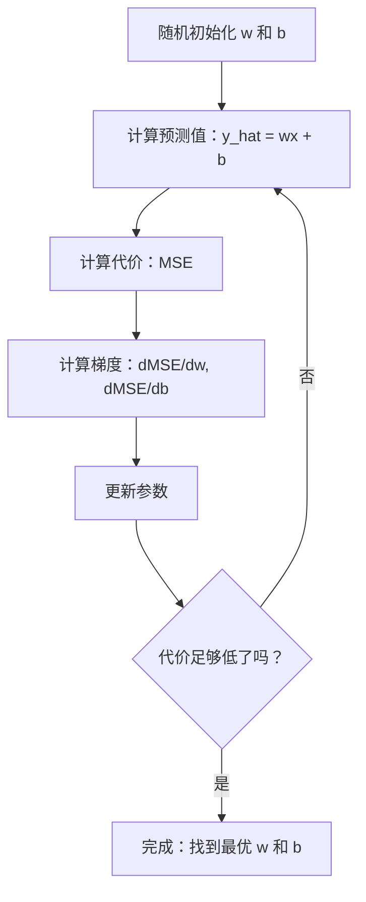

# 线性回归（Linear Regression）

> 线性回归为数据拟合最合适的直线，是机器学习（Machine Learning）的“hello world”。

**Type:** Build
**Languages:** Python
**Prerequisites:** 阶段 1（线性代数、微积分、优化），阶段 2 第 1 课
**Time:** ~90 分钟

## 学习目标（Learning Objectives）

- 推导均方误差的梯度下降更新规则，并从零实现线性回归
- 比较梯度下降与正规方程的计算复杂度及各自适用场景
- 构建采用特征标准化的多元线性回归模型，并解释学到的权重
- 解释岭回归（Ridge Regression）的 L2 正则化如何通过惩罚大权重防止过拟合

## 问题（The Problem）

你有一组房屋面积及售价数据，希望根据新房屋的面积预测价格。你可以在散点图上目测，但实际需要一个公式：找到最贴合数据的直线，代入任意面积就能得到价格预测。

线性回归能给出这条直线。更重要的是，它引出了完整的机器学习训练循环：定义模型、定义代价函数、优化参数。每种机器学习算法都遵循这个模式。在最简单的例子中掌握它，你就能在其他地方认出它。

它并非只适用于简单问题。生产系统使用线性回归进行需求预测、A/B 测试分析和金融建模，它也是各类回归任务的基线（Baseline）。

## 概念（The Concept）

### 模型（The Model）

线性回归假设输入（x）与输出（y）之间存在线性关系：

```
y = wx + b
```

- `w`（权重/斜率，Weight/Slope）：x 增加 1 时 y 的变化量
- `b`（偏置/截距，Bias/Intercept）：x = 0 时 y 的值

对于多个输入（特征，Feature），可以扩展为：

```
y = w1*x1 + w2*x2 + ... + wn*xn + b
```

或者写成向量形式：`y = w^T * x + b`

目标是找到 w 和 b，使所有训练样本的预测 y 尽可能接近实际 y。

### 代价函数：均方误差（The Cost Function: Mean Squared Error）

如何衡量“尽可能接近”？需要用一个数概括预测错了多少。最常用的是均方误差（Mean Squared Error，MSE）：

```
MSE = (1/n) * sum((y_predicted - y_actual)^2)
```

为什么取平方？有两个原因。首先，它对大误差的惩罚更重：误差 10 的惩罚是误差 1 的 100 倍，而非 10 倍。其次，平方函数光滑且处处可微，使优化更容易。

代价函数形成一个曲面。对于单个权重 w 和偏置 b，MSE 曲面像一个碗（凸抛物面，Convex Paraboloid）。碗底就是 MSE 最小的位置，训练就是寻找这个碗底。

### 梯度下降（Gradient Descent）

梯度下降通过逐步下坡寻找碗底。



梯度告诉你两件事：每个参数应向哪个方向移动，以及移动多少。

当 y_hat = wx + b 时，MSE 的梯度为：

```
dMSE/dw = (2/n) * sum((y_hat - y) * x)
dMSE/db = (2/n) * sum(y_hat - y)
```

更新规则如下：

```
w = w - learning_rate * dMSE/dw
b = b - learning_rate * dMSE/db
```

学习率（Learning Rate）控制步长。太大时会越过最小值并发散；太小时训练会十分漫长。常见初始值为 0.01、0.001 或 0.0001。

### 正规方程：闭式解（The Normal Equation: Closed-Form Solution）

对于线性回归，可以直接使用一个公式，无须迭代即可求出最优权重：

```
w = (X^T * X)^(-1) * X^T * y
```

该方法通过矩阵求逆一步求出 w，适合小数据集。大数据集（数百万行或数千个特征）则优先采用梯度下降，因为矩阵求逆相对于特征数的复杂度为 O(n^3)。

### 多元线性回归（Multiple Linear Regression）

存在多个特征时，模型变为：

```
y = w1*x1 + w2*x2 + ... + wn*xn + b
```

工作原理不变：以 MSE 为代价函数，通过梯度下降同时更新所有权重。唯一的区别是，现在拟合的是超平面（Hyperplane）而不是直线。

此时特征缩放（Feature Scaling）很重要。如果一个特征的范围是 0 到 1，另一个是 0 到 1,000,000，代价曲面就会被拉长，使梯度下降难以收敛。训练前应对特征进行标准化（Standardization）：减去均值，再除以标准差。

### 多项式回归（Polynomial Regression）

如果关系不是线性的呢？通过构造多项式特征，仍然可以使用线性回归：

```
y = w1*x + w2*x^2 + w3*x^3 + b
```

这仍然是“线性”回归，因为模型关于权重（w1、w2、w3）是线性的，只是使用了 x 的非线性特征。

高次多项式能拟合更复杂的曲线，但存在过拟合（Overfitting）风险。10 次多项式可以穿过一个含 10 个点的数据集中的每个点，却可能无法准确预测新数据。

### 决定系数（R-Squared Score）

MSE 告诉你误差有多大，但数值依赖于 y 的尺度。决定系数（R-squared，R^2）提供了与尺度无关的度量：

```
R^2 = 1 - (sum of squared residuals) / (sum of squared deviations from mean)
    = 1 - SS_res / SS_tot
```

- R^2 = 1.0：预测完全准确
- R^2 = 0.0：模型并不优于每次都预测均值
- R^2 < 0.0：模型比预测均值还差

### 正则化预览：岭回归（Regularization Preview: Ridge Regression）

特征很多时，模型可能因赋予过大的权重而过拟合。岭回归（Ridge Regression），即 L2 正则化（L2 Regularization），增加一个惩罚项：

```
Cost = MSE + lambda * sum(w_i^2)
```

惩罚项抑制大权重。超参数（Hyperparameter）lambda 控制这一权衡：lambda 越大，权重越小，正则化越强。后续课程会深入讲解，现在先了解这个方法及其作用即可。

```figure
linear-regression-fit
```

## 动手实现（Build It）

### 第 1 步：生成样本数据（Generate sample data）

```python
import random
import math

random.seed(42)

TRUE_W = 3.0
TRUE_B = 7.0
N_SAMPLES = 100

X = [random.uniform(0, 10) for _ in range(N_SAMPLES)]
y = [TRUE_W * x + TRUE_B + random.gauss(0, 2.0) for x in X]

print(f"Generated {N_SAMPLES} samples")
print(f"True relationship: y = {TRUE_W}x + {TRUE_B} (+ noise)")
print(f"First 5 points: {[(round(X[i], 2), round(y[i], 2)) for i in range(5)]}")
```

### 第 2 步：用梯度下降从零实现线性回归（Linear regression from scratch with gradient descent）

```python
class LinearRegression:
    def __init__(self, learning_rate=0.01):
        self.w = 0.0
        self.b = 0.0
        self.lr = learning_rate
        self.cost_history = []

    def predict(self, X):
        return [self.w * x + self.b for x in X]

    def compute_cost(self, X, y):
        predictions = self.predict(X)
        n = len(y)
        cost = sum((pred - actual) ** 2 for pred, actual in zip(predictions, y)) / n
        return cost

    def compute_gradients(self, X, y):
        predictions = self.predict(X)
        n = len(y)
        dw = (2 / n) * sum((pred - actual) * x for pred, actual, x in zip(predictions, y, X))
        db = (2 / n) * sum(pred - actual for pred, actual in zip(predictions, y))
        return dw, db

    def fit(self, X, y, epochs=1000, print_every=200):
        for epoch in range(epochs):
            dw, db = self.compute_gradients(X, y)
            self.w -= self.lr * dw
            self.b -= self.lr * db
            cost = self.compute_cost(X, y)
            self.cost_history.append(cost)
            if epoch % print_every == 0:
                print(f"  Epoch {epoch:4d} | Cost: {cost:.4f} | w: {self.w:.4f} | b: {self.b:.4f}")
        return self

    def r_squared(self, X, y):
        predictions = self.predict(X)
        y_mean = sum(y) / len(y)
        ss_res = sum((actual - pred) ** 2 for actual, pred in zip(y, predictions))
        ss_tot = sum((actual - y_mean) ** 2 for actual in y)
        return 1 - (ss_res / ss_tot)


print("=== Training Linear Regression (Gradient Descent) ===")
model = LinearRegression(learning_rate=0.005)
model.fit(X, y, epochs=1000, print_every=200)
print(f"\nLearned: y = {model.w:.4f}x + {model.b:.4f}")
print(f"True:    y = {TRUE_W}x + {TRUE_B}")
print(f"R-squared: {model.r_squared(X, y):.4f}")
```

### 第 3 步：正规方程与闭式解（Normal equation: closed-form solution）

```python
class LinearRegressionNormal:
    def __init__(self):
        self.w = 0.0
        self.b = 0.0

    def fit(self, X, y):
        n = len(X)
        x_mean = sum(X) / n
        y_mean = sum(y) / n
        numerator = sum((X[i] - x_mean) * (y[i] - y_mean) for i in range(n))
        denominator = sum((X[i] - x_mean) ** 2 for i in range(n))
        self.w = numerator / denominator
        self.b = y_mean - self.w * x_mean
        return self

    def predict(self, X):
        return [self.w * x + self.b for x in X]

    def r_squared(self, X, y):
        predictions = self.predict(X)
        y_mean = sum(y) / len(y)
        ss_res = sum((actual - pred) ** 2 for actual, pred in zip(y, predictions))
        ss_tot = sum((actual - y_mean) ** 2 for actual in y)
        return 1 - (ss_res / ss_tot)


print("\n=== Normal Equation (Closed-Form) ===")
model_normal = LinearRegressionNormal()
model_normal.fit(X, y)
print(f"Learned: y = {model_normal.w:.4f}x + {model_normal.b:.4f}")
print(f"R-squared: {model_normal.r_squared(X, y):.4f}")
```

### 第 4 步：多元线性回归（Multiple linear regression）

```python
class MultipleLinearRegression:
    def __init__(self, n_features, learning_rate=0.01):
        self.weights = [0.0] * n_features
        self.bias = 0.0
        self.lr = learning_rate
        self.cost_history = []

    def predict_single(self, x):
        return sum(w * xi for w, xi in zip(self.weights, x)) + self.bias

    def predict(self, X):
        return [self.predict_single(x) for x in X]

    def compute_cost(self, X, y):
        predictions = self.predict(X)
        n = len(y)
        return sum((pred - actual) ** 2 for pred, actual in zip(predictions, y)) / n

    def fit(self, X, y, epochs=1000, print_every=200):
        n = len(y)
        n_features = len(X[0])
        for epoch in range(epochs):
            predictions = self.predict(X)
            errors = [pred - actual for pred, actual in zip(predictions, y)]
            for j in range(n_features):
                grad = (2 / n) * sum(errors[i] * X[i][j] for i in range(n))
                self.weights[j] -= self.lr * grad
            grad_b = (2 / n) * sum(errors)
            self.bias -= self.lr * grad_b
            cost = self.compute_cost(X, y)
            self.cost_history.append(cost)
            if epoch % print_every == 0:
                print(f"  Epoch {epoch:4d} | Cost: {cost:.4f}")
        return self

    def r_squared(self, X, y):
        predictions = self.predict(X)
        y_mean = sum(y) / len(y)
        ss_res = sum((actual - pred) ** 2 for actual, pred in zip(y, predictions))
        ss_tot = sum((actual - y_mean) ** 2 for actual in y)
        return 1 - (ss_res / ss_tot)


random.seed(42)
N = 100
X_multi = []
y_multi = []
for _ in range(N):
    size = random.uniform(500, 3000)
    bedrooms = random.randint(1, 5)
    age = random.uniform(0, 50)
    price = 50 * size + 10000 * bedrooms - 1000 * age + 50000 + random.gauss(0, 20000)
    X_multi.append([size, bedrooms, age])
    y_multi.append(price)


def standardize(X):
    n_features = len(X[0])
    means = [sum(X[i][j] for i in range(len(X))) / len(X) for j in range(n_features)]
    stds = []
    for j in range(n_features):
        variance = sum((X[i][j] - means[j]) ** 2 for i in range(len(X))) / len(X)
        stds.append(variance ** 0.5)
    X_scaled = []
    for i in range(len(X)):
        row = [(X[i][j] - means[j]) / stds[j] if stds[j] > 0 else 0 for j in range(n_features)]
        X_scaled.append(row)
    return X_scaled, means, stds


y_mean_val = sum(y_multi) / len(y_multi)
y_std_val = (sum((yi - y_mean_val) ** 2 for yi in y_multi) / len(y_multi)) ** 0.5
y_scaled = [(yi - y_mean_val) / y_std_val for yi in y_multi]

X_scaled, x_means, x_stds = standardize(X_multi)

print("\n=== Multiple Linear Regression (3 features) ===")
print("Features: house size, bedrooms, age")
multi_model = MultipleLinearRegression(n_features=3, learning_rate=0.01)
multi_model.fit(X_scaled, y_scaled, epochs=1000, print_every=200)

print(f"\nWeights (standardized): {[round(w, 4) for w in multi_model.weights]}")
print(f"Bias (standardized): {multi_model.bias:.4f}")
print(f"R-squared: {multi_model.r_squared(X_scaled, y_scaled):.4f}")
```

### 第 5 步：多项式回归（Polynomial regression）

```python
class PolynomialRegression:
    def __init__(self, degree, learning_rate=0.01):
        self.degree = degree
        self.weights = [0.0] * degree
        self.bias = 0.0
        self.lr = learning_rate

    def make_features(self, X):
        return [[x ** (d + 1) for d in range(self.degree)] for x in X]

    def predict(self, X):
        features = self.make_features(X)
        return [sum(w * f for w, f in zip(self.weights, row)) + self.bias for row in features]

    def fit(self, X, y, epochs=1000, print_every=200):
        features = self.make_features(X)
        n = len(y)
        for epoch in range(epochs):
            predictions = [sum(w * f for w, f in zip(self.weights, row)) + self.bias for row in features]
            errors = [pred - actual for pred, actual in zip(predictions, y)]
            for j in range(self.degree):
                grad = (2 / n) * sum(errors[i] * features[i][j] for i in range(n))
                self.weights[j] -= self.lr * grad
            grad_b = (2 / n) * sum(errors)
            self.bias -= self.lr * grad_b
            if epoch % print_every == 0:
                cost = sum(e ** 2 for e in errors) / n
                print(f"  Epoch {epoch:4d} | Cost: {cost:.6f}")
        return self

    def r_squared(self, X, y):
        predictions = self.predict(X)
        y_mean = sum(y) / len(y)
        ss_res = sum((actual - pred) ** 2 for actual, pred in zip(y, predictions))
        ss_tot = sum((actual - y_mean) ** 2 for actual in y)
        return 1 - (ss_res / ss_tot)


random.seed(42)
X_poly = [x / 10.0 for x in range(0, 50)]
y_poly = [0.5 * x ** 2 - 2 * x + 3 + random.gauss(0, 1.0) for x in X_poly]

x_max = max(abs(x) for x in X_poly)
X_poly_norm = [x / x_max for x in X_poly]
y_poly_mean = sum(y_poly) / len(y_poly)
y_poly_std = (sum((yi - y_poly_mean) ** 2 for yi in y_poly) / len(y_poly)) ** 0.5
y_poly_norm = [(yi - y_poly_mean) / y_poly_std for yi in y_poly]

print("\n=== Polynomial Regression (degree 2 vs degree 5) ===")
print("True relationship: y = 0.5x^2 - 2x + 3")

print("\nDegree 2:")
poly2 = PolynomialRegression(degree=2, learning_rate=0.1)
poly2.fit(X_poly_norm, y_poly_norm, epochs=2000, print_every=500)
print(f"  R-squared: {poly2.r_squared(X_poly_norm, y_poly_norm):.4f}")

print("\nDegree 5:")
poly5 = PolynomialRegression(degree=5, learning_rate=0.1)
poly5.fit(X_poly_norm, y_poly_norm, epochs=2000, print_every=500)
print(f"  R-squared: {poly5.r_squared(X_poly_norm, y_poly_norm):.4f}")

print("\nDegree 2 fits the true curve well. Degree 5 fits training data slightly better")
print("but risks overfitting on new data.")
```

### 第 6 步：岭回归与 L2 正则化（Ridge regression: L2 regularization）

```python
class RidgeRegression:
    def __init__(self, n_features, learning_rate=0.01, alpha=1.0):
        self.weights = [0.0] * n_features
        self.bias = 0.0
        self.lr = learning_rate
        self.alpha = alpha

    def predict_single(self, x):
        return sum(w * xi for w, xi in zip(self.weights, x)) + self.bias

    def predict(self, X):
        return [self.predict_single(x) for x in X]

    def fit(self, X, y, epochs=1000, print_every=200):
        n = len(y)
        n_features = len(X[0])
        for epoch in range(epochs):
            predictions = self.predict(X)
            errors = [pred - actual for pred, actual in zip(predictions, y)]
            mse = sum(e ** 2 for e in errors) / n
            reg_term = self.alpha * sum(w ** 2 for w in self.weights)
            cost = mse + reg_term
            for j in range(n_features):
                grad = (2 / n) * sum(errors[i] * X[i][j] for i in range(n))
                grad += 2 * self.alpha * self.weights[j]
                self.weights[j] -= self.lr * grad
            grad_b = (2 / n) * sum(errors)
            self.bias -= self.lr * grad_b
            if epoch % print_every == 0:
                print(f"  Epoch {epoch:4d} | Cost: {cost:.4f} | L2 penalty: {reg_term:.4f}")
        return self


print("\n=== Ridge Regression (L2 Regularization) ===")
print("Same data as multiple regression, with alpha=0.1")
ridge = RidgeRegression(n_features=3, learning_rate=0.01, alpha=0.1)
ridge.fit(X_scaled, y_scaled, epochs=1000, print_every=200)
print(f"\nRidge weights: {[round(w, 4) for w in ridge.weights]}")
print(f"Plain weights: {[round(w, 4) for w in multi_model.weights]}")
print("Ridge weights are smaller (shrunk toward zero) due to the L2 penalty.")
```

## 实际应用（Use It）

现在用 scikit-learn 完成同样的工作，这也是你在生产环境中实际使用的工具。

```python
from sklearn.linear_model import LinearRegression as SklearnLR
from sklearn.linear_model import Ridge
from sklearn.preprocessing import PolynomialFeatures, StandardScaler
from sklearn.model_selection import train_test_split
from sklearn.metrics import mean_squared_error, r2_score
import numpy as np

np.random.seed(42)
X_sk = np.random.uniform(0, 10, (100, 1))
y_sk = 3.0 * X_sk.squeeze() + 7.0 + np.random.normal(0, 2.0, 100)

X_train, X_test, y_train, y_test = train_test_split(X_sk, y_sk, test_size=0.2, random_state=42)

lr = SklearnLR()
lr.fit(X_train, y_train)
y_pred = lr.predict(X_test)

print("=== Scikit-learn Linear Regression ===")
print(f"Coefficient (w): {lr.coef_[0]:.4f}")
print(f"Intercept (b): {lr.intercept_:.4f}")
print(f"R-squared (test): {r2_score(y_test, y_pred):.4f}")
print(f"MSE (test): {mean_squared_error(y_test, y_pred):.4f}")

poly = PolynomialFeatures(degree=2, include_bias=False)
X_poly_sk = poly.fit_transform(X_train)
X_poly_test = poly.transform(X_test)

lr_poly = SklearnLR()
lr_poly.fit(X_poly_sk, y_train)
print(f"\nPolynomial degree 2 R-squared: {r2_score(y_test, lr_poly.predict(X_poly_test)):.4f}")

scaler = StandardScaler()
X_train_scaled = scaler.fit_transform(X_train)
X_test_scaled = scaler.transform(X_test)

ridge = Ridge(alpha=1.0)
ridge.fit(X_train_scaled, y_train)
print(f"Ridge R-squared: {r2_score(y_test, ridge.predict(X_test_scaled)):.4f}")
print(f"Ridge coefficient: {ridge.coef_[0]:.4f}")
```

从零实现的版本与 scikit-learn 产生相同的结果。区别在于 scikit-learn 处理了边界情况、数值稳定性及性能优化。生产环境使用库，从零实现则用于理解内部原理。

## 交付成果（Ship It）

本课产出：
- `outputs/skill-regression.md`：根据问题选择合适回归方法的技能

## 练习（Exercises）

1. 实现批量梯度下降（Batch Gradient Descent）、随机梯度下降（Stochastic Gradient Descent，SGD）及小批量梯度下降（Mini-batch Gradient Descent）。在同一数据集上比较收敛速度。哪种最快？哪种代价曲线最平滑？
2. 用三次函数（y = ax^3 + bx^2 + cx + d + noise）生成数据。分别拟合 1、3、10 次多项式，比较训练 R^2 与测试 R^2。到多少次时过拟合变得明显？
3. 实现 Lasso 回归（Lasso Regression），采用 L1 正则化：penalty = alpha * sum(|w_i|)。在多特征房屋数据上训练，对比它与岭回归中哪些权重变为零。为什么 L1 产生稀疏解（Sparse Solution），而 L2 不会？

## 关键术语（Key Terms）

| 术语 | 常见说法 | 实际含义 |
|------|----------------|----------------------|
| 线性回归（Linear Regression） | “画一条穿过数据的直线” | 寻找权重 w 和偏置 b，使 wx+b 与实际 y 值之差的平方和最小 |
| 代价函数（Cost Function） | “模型有多差” | 将模型参数映射为衡量预测误差的单个数值，优化的目标是将其最小化 |
| 均方误差（Mean Squared Error） | “误差平方的平均值” | (1/n) * sum of (predicted - actual)^2，对大误差施加不成比例的更重惩罚 |
| 梯度下降（Gradient Descent） | “走下坡” | 利用偏导数，沿减小代价函数的方向迭代调整参数 |
| 学习率（Learning Rate） | “步长” | 控制每一步梯度下降中参数变化幅度的标量 |
| 正规方程（Normal Equation） | “直接求解” | 无须迭代即可求得最优权重的闭式解 w = (X^T X)^-1 X^T y |
| 决定系数（R-squared） | “拟合得有多好” | 模型解释的 y 方差所占比例，取值从负无穷到 1.0 |
| 特征缩放（Feature Scaling） | “让特征可比” | 将特征变换到相近范围（例如零均值、单位方差），使梯度下降更快收敛 |
| 正则化（Regularization） | “惩罚复杂度” | 在代价函数中加入收缩权重的项，以防过拟合 |
| 岭回归（Ridge Regression） | “L2 正则化” | 在 MSE 上增加 lambda * sum(w_i^2) 惩罚项的线性回归 |
| 多项式回归（Polynomial Regression） | “用线性数学拟合曲线” | 对多项式特征（x, x^2, x^3, ...）进行线性回归，模型关于权重仍是线性的 |
| 过拟合（Overfitting） | “记住训练数据” | 模型过于复杂，拟合了训练数据的噪声，因而无法适用于新数据 |

## 延伸阅读（Further Reading）

- [统计学习导论（An Introduction to Statistical Learning，ISLR）](https://www.statlearning.com/)：免费 PDF，第 3、6 章结合 R 实践示例介绍线性回归与正则化
- [统计学习基础（The Elements of Statistical Learning，ESL）](https://hastie.su.domains/ElemStatLearn/)：免费 PDF，比 ISLR 更偏数学，对岭回归和 Lasso 的讲解更深入
- [Stanford CS229 线性回归讲义（Lecture Notes on Linear Regression）](https://cs229.stanford.edu/main_notes.pdf)：Andrew Ng 的讲义，从基本原理推导正规方程和梯度下降
- [scikit-learn LinearRegression 文档（documentation）](https://scikit-learn.org/stable/modules/linear_model.html)：包含 LinearRegression、Ridge、Lasso、ElasticNet 代码示例的实用参考
