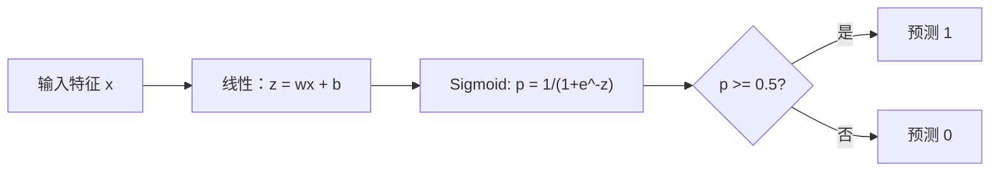
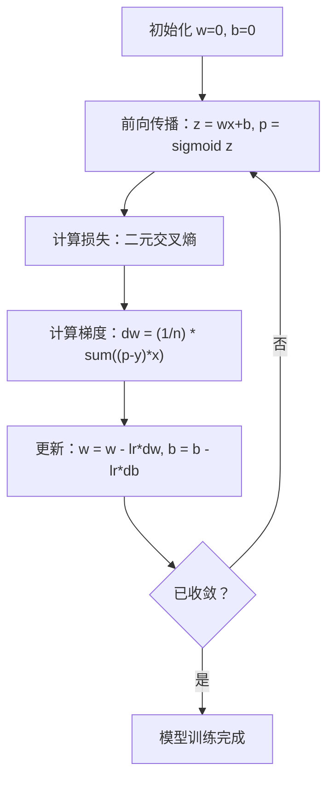

# 逻辑回归（Logistic Regression）

> 逻辑回归将直线弯成 S 形曲线，用概率回答是非问题。

**Type:** Build
**Languages:** Python
**Prerequisites:** 阶段 2 第 1–2 课（什么是机器学习、线性回归）
**Time:** ~90 分钟

## 学习目标（Learning Objectives）

- 使用 Sigmoid 函数和二元交叉熵损失，从零实现逻辑回归
- 计算并解释二分类的精确率、召回率、F1 分数和混淆矩阵
- 解释为什么 MSE 不适合分类，以及二元交叉熵为什么产生凸代价曲面
- 构建用于多分类的 Softmax 回归模型，并评估阈值调优的权衡

## 问题（The Problem）

你想根据肿瘤大小预测其为恶性还是良性。尝试线性回归后，它输出 0.3、1.7 或 -0.5。它们是什么意思？1.7 表示“非常恶性”吗？-0.5 表示“非常良性”吗？线性回归输出无界数值，而分类需要 0 到 1 之间的有界概率，以及明确的是非决策。

逻辑回归解决了这个问题。它将相同的线性组合（wx + b）输入 Sigmoid 函数，将任意数压缩到 (0, 1) 范围。输出是概率，设置阈值（Threshold，通常为 0.5）后即可决策。

这是实践中使用最广泛的算法之一。尽管名字中有“回归”，逻辑回归是分类算法，而非回归算法。名称来自它使用的逻辑函数（Logistic Function），也称 Sigmoid 函数。

## 概念（The Concept）

### 为什么线性回归不适合分类（Why Linear Regression Fails for Classification）

假设根据学习小时数预测通过或未通过（1/0）。线性回归为数据拟合一条直线：

```
hours:  1   2   3   4   5   6   7   8   9   10
actual: 0   0   0   0   1   1   1   1   1   1
```

线性拟合可能在 1 小时时预测 -0.2，在 10 小时时预测 1.3。这些值低于 0 或高于 1，不是概率。更糟的是，一个异常值（例如学习了 50 小时的人）就会拉动整条直线，改变所有人的预测。

分类需要这样的函数：
- 输出 0 到 1 之间的值，即概率
- 形成明确的过渡，即决策边界（Decision Boundary）
- 不受远离边界的异常值影响而扭曲

### Sigmoid 函数（The Sigmoid Function）

Sigmoid 函数正好实现这一点：

```
sigmoid(z) = 1 / (1 + e^(-z))
```

性质如下：
- z 为很大的正数时，sigmoid(z) 趋近于 1
- z 为绝对值很大的负数时，sigmoid(z) 趋近于 0
- z = 0 时，sigmoid(z) = 0.5
- 输出始终位于 0 和 1 之间
- 函数光滑且处处可微

其导数形式很方便：sigmoid'(z) = sigmoid(z) * (1 - sigmoid(z))。这使梯度计算很高效。

### 逻辑回归 = 线性模型 + Sigmoid（Logistic Regression = Linear Model + Sigmoid）

模型计算 z = wx + b（与线性回归相同），然后应用 Sigmoid：



输出 p 解释为 P(y=1 | x)，即输入属于类别 1 的概率。决策边界位于 wx + b = 0 处，此时 Sigmoid 的输出恰好为 0.5。

### 二元交叉熵损失（Binary Cross-Entropy Loss）

逻辑回归不能使用均方误差（Mean Squared Error，MSE）。MSE 与 Sigmoid 结合会产生含有许多局部最小值的非凸代价曲面。应使用二元交叉熵（Binary Cross-entropy），也称对数损失（Log Loss）：

```
Loss = -(1/n) * sum(y * log(p) + (1-y) * log(1-p))
```

为什么有效：
- y=1 且 p 接近 1 时：log(1) = 0，因此损失接近 0（预测正确，代价低）
- y=1 且 p 接近 0 时：log(0) 趋向负无穷，因此损失极大（预测错误，代价高）
- y=0 且 p 接近 0 时：log(1) = 0，因此损失接近 0（预测正确，代价低）
- y=0 且 p 接近 1 时：log(0) 趋向负无穷，因此损失极大（预测错误，代价高）

对于逻辑回归，这个损失函数是凸的，保证存在单一全局最小值。

### 逻辑回归的梯度下降（Gradient Descent for Logistic Regression）

二元交叉熵与 Sigmoid 结合后的梯度形式简洁：

```
dL/dw = (1/n) * sum((p - y) * x)
dL/db = (1/n) * sum(p - y)
```

它们看起来与线性回归的梯度相同。区别是 p = sigmoid(wx + b)，而不是 p = wx + b。Sigmoid 引入了非线性，但梯度更新规则保持不变。



### 决策边界（The Decision Boundary）

对于二维输入（两个特征），决策边界是满足下式的直线：

```
w1*x1 + w2*x2 + b = 0
```

一侧的点被分类为 1，另一侧为 0。逻辑回归总是产生线性决策边界。如果需要曲线边界，应添加多项式特征或使用非线性模型。

### 用 Softmax 进行多分类（Multi-Class Classification with Softmax）

二元逻辑回归处理两个类别。对于 k 个类别，使用 Softmax 函数：

```
softmax(z_i) = e^(z_i) / sum(e^(z_j) for all j)
```

每个类别都有自己的权重向量。模型计算各类别的分数 z_i，再由 Softmax 将分数转换为总和为 1 的概率。概率最高的类别就是预测类别。

损失函数变为类别交叉熵（Categorical Cross-entropy）：

```
Loss = -(1/n) * sum(sum(y_k * log(p_k)))
```

其中，真实类别对应的 y_k 为 1，其他类别为 0，这就是独热编码（One-hot Encoding）。

### 评估指标（Evaluation Metrics）

只看准确率（Accuracy）还不够。若数据集有 95% 负例、5% 正例，始终预测为负的模型就能获得 95% 准确率，却没有实用价值。

**混淆矩阵（Confusion Matrix）**：

| | 预测为正 | 预测为负 |
|---|---|---|
| 实际为正 | 真阳性（True Positive，TP） | 假阴性（False Negative，FN） |
| 实际为负 | 假阳性（False Positive，FP） | 真阴性（True Negative，TN） |

**精确率（Precision）**：所有预测正例中，有多少实际为正？
```
Precision = TP / (TP + FP)
```

**召回率（Recall）**，也称灵敏度（Sensitivity）：所有实际正例中，我们找到了多少？
```
Recall = TP / (TP + FN)
```

**F1 分数（F1 Score）**：精确率与召回率的调和平均数，用来平衡两个指标。
```
F1 = 2 * (Precision * Recall) / (Precision + Recall)
```

如何确定优先级：
- **精确率**：假阳性代价高时，例如垃圾邮件过滤，不希望拦截正常邮件
- **召回率**：假阴性代价高时，例如癌症筛查，不希望漏掉肿瘤
- **F1**：需要单个平衡指标时

```figure
logistic-sigmoid
```

## 动手实现（Build It）

### 第 1 步：Sigmoid 函数与数据生成（Sigmoid function and data generation）

```python
import random
import math

def sigmoid(z):
    z = max(-500, min(500, z))
    return 1.0 / (1.0 + math.exp(-z))


random.seed(42)
N = 200
X = []
y = []

for _ in range(N // 2):
    X.append([random.gauss(2, 1), random.gauss(2, 1)])
    y.append(0)

for _ in range(N // 2):
    X.append([random.gauss(5, 1), random.gauss(5, 1)])
    y.append(1)

combined = list(zip(X, y))
random.shuffle(combined)
X, y = zip(*combined)
X = list(X)
y = list(y)

print(f"Generated {N} samples (2 classes, 2 features)")
print(f"Class 0 center: (2, 2), Class 1 center: (5, 5)")
print(f"First 5 samples:")
for i in range(5):
    print(f"  Features: [{X[i][0]:.2f}, {X[i][1]:.2f}], Label: {y[i]}")
```

### 第 2 步：从零实现逻辑回归（Logistic regression from scratch）

```python
class LogisticRegression:
    def __init__(self, n_features, learning_rate=0.01):
        self.weights = [0.0] * n_features
        self.bias = 0.0
        self.lr = learning_rate
        self.loss_history = []

    def predict_proba(self, x):
        z = sum(w * xi for w, xi in zip(self.weights, x)) + self.bias
        return sigmoid(z)

    def predict(self, x, threshold=0.5):
        return 1 if self.predict_proba(x) >= threshold else 0

    def compute_loss(self, X, y):
        n = len(y)
        total = 0.0
        for i in range(n):
            p = self.predict_proba(X[i])
            p = max(1e-15, min(1 - 1e-15, p))
            total += y[i] * math.log(p) + (1 - y[i]) * math.log(1 - p)
        return -total / n

    def fit(self, X, y, epochs=1000, print_every=200):
        n = len(y)
        n_features = len(X[0])
        for epoch in range(epochs):
            dw = [0.0] * n_features
            db = 0.0
            for i in range(n):
                p = self.predict_proba(X[i])
                error = p - y[i]
                for j in range(n_features):
                    dw[j] += error * X[i][j]
                db += error
            for j in range(n_features):
                self.weights[j] -= self.lr * (dw[j] / n)
            self.bias -= self.lr * (db / n)
            loss = self.compute_loss(X, y)
            self.loss_history.append(loss)
            if epoch % print_every == 0:
                print(f"  Epoch {epoch:4d} | Loss: {loss:.4f} | w: [{self.weights[0]:.3f}, {self.weights[1]:.3f}] | b: {self.bias:.3f}")
        return self

    def accuracy(self, X, y):
        correct = sum(1 for i in range(len(y)) if self.predict(X[i]) == y[i])
        return correct / len(y)


split = int(0.8 * N)
X_train, X_test = X[:split], X[split:]
y_train, y_test = y[:split], y[split:]

print("\n=== Training Logistic Regression ===")
model = LogisticRegression(n_features=2, learning_rate=0.1)
model.fit(X_train, y_train, epochs=1000, print_every=200)

print(f"\nTrain accuracy: {model.accuracy(X_train, y_train):.4f}")
print(f"Test accuracy:  {model.accuracy(X_test, y_test):.4f}")
print(f"Weights: [{model.weights[0]:.4f}, {model.weights[1]:.4f}]")
print(f"Bias: {model.bias:.4f}")
```

### 第 3 步：从零实现混淆矩阵与指标（Confusion matrix and metrics from scratch）

```python
class ClassificationMetrics:
    def __init__(self, y_true, y_pred):
        self.tp = sum(1 for t, p in zip(y_true, y_pred) if t == 1 and p == 1)
        self.tn = sum(1 for t, p in zip(y_true, y_pred) if t == 0 and p == 0)
        self.fp = sum(1 for t, p in zip(y_true, y_pred) if t == 0 and p == 1)
        self.fn = sum(1 for t, p in zip(y_true, y_pred) if t == 1 and p == 0)

    def accuracy(self):
        total = self.tp + self.tn + self.fp + self.fn
        return (self.tp + self.tn) / total if total > 0 else 0

    def precision(self):
        denom = self.tp + self.fp
        return self.tp / denom if denom > 0 else 0

    def recall(self):
        denom = self.tp + self.fn
        return self.tp / denom if denom > 0 else 0

    def f1(self):
        p = self.precision()
        r = self.recall()
        return 2 * p * r / (p + r) if (p + r) > 0 else 0

    def print_confusion_matrix(self):
        print(f"\n  Confusion Matrix:")
        print(f"                  Predicted")
        print(f"                  Pos   Neg")
        print(f"  Actual Pos     {self.tp:4d}  {self.fn:4d}")
        print(f"  Actual Neg     {self.fp:4d}  {self.tn:4d}")

    def print_report(self):
        self.print_confusion_matrix()
        print(f"\n  Accuracy:  {self.accuracy():.4f}")
        print(f"  Precision: {self.precision():.4f}")
        print(f"  Recall:    {self.recall():.4f}")
        print(f"  F1 Score:  {self.f1():.4f}")


y_pred_test = [model.predict(x) for x in X_test]
print("\n=== Classification Report (Test Set) ===")
metrics = ClassificationMetrics(y_test, y_pred_test)
metrics.print_report()
```

### 第 4 步：决策边界分析（Decision boundary analysis）

```python
print("\n=== Decision Boundary ===")
w1, w2 = model.weights
b = model.bias
print(f"Decision boundary: {w1:.4f}*x1 + {w2:.4f}*x2 + {b:.4f} = 0")
if abs(w2) > 1e-10:
    print(f"Solved for x2:     x2 = {-w1/w2:.4f}*x1 + {-b/w2:.4f}")

print("\nSample predictions near the boundary:")
test_points = [
    [3.0, 3.0],
    [3.5, 3.5],
    [4.0, 4.0],
    [2.5, 2.5],
    [5.0, 5.0],
]
for point in test_points:
    prob = model.predict_proba(point)
    pred = model.predict(point)
    print(f"  [{point[0]}, {point[1]}] -> prob={prob:.4f}, class={pred}")
```

### 第 5 步：用 Softmax 进行多分类（Multi-class with softmax）

```python
class SoftmaxRegression:
    def __init__(self, n_features, n_classes, learning_rate=0.01):
        self.n_features = n_features
        self.n_classes = n_classes
        self.lr = learning_rate
        self.weights = [[0.0] * n_features for _ in range(n_classes)]
        self.biases = [0.0] * n_classes

    def softmax(self, scores):
        max_score = max(scores)
        exp_scores = [math.exp(s - max_score) for s in scores]
        total = sum(exp_scores)
        return [e / total for e in exp_scores]

    def predict_proba(self, x):
        scores = [
            sum(self.weights[k][j] * x[j] for j in range(self.n_features)) + self.biases[k]
            for k in range(self.n_classes)
        ]
        return self.softmax(scores)

    def predict(self, x):
        probs = self.predict_proba(x)
        return probs.index(max(probs))

    def fit(self, X, y, epochs=1000, print_every=200):
        n = len(y)
        for epoch in range(epochs):
            grad_w = [[0.0] * self.n_features for _ in range(self.n_classes)]
            grad_b = [0.0] * self.n_classes
            total_loss = 0.0
            for i in range(n):
                probs = self.predict_proba(X[i])
                for k in range(self.n_classes):
                    target = 1.0 if y[i] == k else 0.0
                    error = probs[k] - target
                    for j in range(self.n_features):
                        grad_w[k][j] += error * X[i][j]
                    grad_b[k] += error
                true_prob = max(probs[y[i]], 1e-15)
                total_loss -= math.log(true_prob)
            for k in range(self.n_classes):
                for j in range(self.n_features):
                    self.weights[k][j] -= self.lr * (grad_w[k][j] / n)
                self.biases[k] -= self.lr * (grad_b[k] / n)
            if epoch % print_every == 0:
                print(f"  Epoch {epoch:4d} | Loss: {total_loss / n:.4f}")
        return self

    def accuracy(self, X, y):
        correct = sum(1 for i in range(len(y)) if self.predict(X[i]) == y[i])
        return correct / len(y)


random.seed(42)
X_3class = []
y_3class = []

centers = [(1, 1), (5, 1), (3, 5)]
for label, (cx, cy) in enumerate(centers):
    for _ in range(50):
        X_3class.append([random.gauss(cx, 0.8), random.gauss(cy, 0.8)])
        y_3class.append(label)

combined = list(zip(X_3class, y_3class))
random.shuffle(combined)
X_3class, y_3class = zip(*combined)
X_3class = list(X_3class)
y_3class = list(y_3class)

split_3 = int(0.8 * len(X_3class))
X_train_3 = X_3class[:split_3]
y_train_3 = y_3class[:split_3]
X_test_3 = X_3class[split_3:]
y_test_3 = y_3class[split_3:]

print("\n=== Multi-class Softmax Regression (3 classes) ===")
softmax_model = SoftmaxRegression(n_features=2, n_classes=3, learning_rate=0.1)
softmax_model.fit(X_train_3, y_train_3, epochs=1000, print_every=200)
print(f"\nTrain accuracy: {softmax_model.accuracy(X_train_3, y_train_3):.4f}")
print(f"Test accuracy:  {softmax_model.accuracy(X_test_3, y_test_3):.4f}")

print("\nSample predictions:")
for i in range(5):
    probs = softmax_model.predict_proba(X_test_3[i])
    pred = softmax_model.predict(X_test_3[i])
    print(f"  True: {y_test_3[i]}, Predicted: {pred}, Probs: [{', '.join(f'{p:.3f}' for p in probs)}]")
```

### 第 6 步：阈值调优（Threshold tuning）

```python
print("\n=== Threshold Tuning ===")
print("Default threshold: 0.5. Adjusting the threshold trades precision for recall.\n")

thresholds = [0.3, 0.4, 0.5, 0.6, 0.7]
print(f"{'Threshold':>10} {'Accuracy':>10} {'Precision':>10} {'Recall':>10} {'F1':>10}")
print("-" * 52)

for t in thresholds:
    y_pred_t = [1 if model.predict_proba(x) >= t else 0 for x in X_test]
    m = ClassificationMetrics(y_test, y_pred_t)
    print(f"{t:>10.1f} {m.accuracy():>10.4f} {m.precision():>10.4f} {m.recall():>10.4f} {m.f1():>10.4f}")
```

## 实际应用（Use It）

现在用 scikit-learn 完成同样的工作。

```python
from sklearn.linear_model import LogisticRegression as SklearnLR
from sklearn.metrics import accuracy_score, precision_score, recall_score, f1_score
from sklearn.metrics import confusion_matrix, classification_report
from sklearn.model_selection import train_test_split
from sklearn.preprocessing import StandardScaler
import numpy as np

np.random.seed(42)
X_0 = np.random.randn(100, 2) + [2, 2]
X_1 = np.random.randn(100, 2) + [5, 5]
X_sk = np.vstack([X_0, X_1])
y_sk = np.array([0] * 100 + [1] * 100)

X_tr, X_te, y_tr, y_te = train_test_split(X_sk, y_sk, test_size=0.2, random_state=42)

scaler = StandardScaler()
X_tr_sc = scaler.fit_transform(X_tr)
X_te_sc = scaler.transform(X_te)

lr = SklearnLR()
lr.fit(X_tr_sc, y_tr)
y_pred = lr.predict(X_te_sc)

print("=== Scikit-learn Logistic Regression ===")
print(f"Accuracy:  {accuracy_score(y_te, y_pred):.4f}")
print(f"Precision: {precision_score(y_te, y_pred):.4f}")
print(f"Recall:    {recall_score(y_te, y_pred):.4f}")
print(f"F1:        {f1_score(y_te, y_pred):.4f}")
print(f"\nConfusion Matrix:\n{confusion_matrix(y_te, y_pred)}")
print(f"\nClassification Report:\n{classification_report(y_te, y_pred)}")
```

从零实现的版本产生相同的决策边界和指标。Scikit-learn 还提供求解器选项（liblinear、lbfgs、saga）、自动正则化、多分类策略（一对其余，One-vs-rest；多项式，Multinomial）以及数值稳定性优化。

## 交付成果（Ship It）

本课产出：
- `code/logistic_regression.py`：从零实现的逻辑回归及评估指标

## 练习（Exercises）

1. 生成一个非线性可分数据集（如两个同心圆）。训练逻辑回归并观察其失败，然后添加多项式特征（x1^2, x2^2, x1*x2）再次训练，展示准确率的提升。
2. 为三分类 Softmax 模型实现多分类混淆矩阵，计算每个类别的精确率和召回率。哪个类别最难分类？
3. 从零构建受试者工作特征曲线（Receiver Operating Characteristic，ROC）。在 0 到 1 之间取 100 个阈值，计算真阳性率与假阳性率，并用梯形法则计算曲线下面积（Area Under the Curve，AUC）。

## 关键术语（Key Terms）

| 术语 | 常见说法 | 实际含义 |
|------|----------------|----------------------|
| 逻辑回归（Logistic Regression） | “用于分类的回归” | 在线性模型后接 Sigmoid 函数，输出类别概率 |
| Sigmoid 函数（Sigmoid Function） | “S 形曲线” | 将任意实数映射到 (0, 1) 范围的函数 1/(1+e^(-z)) |
| 二元交叉熵（Binary Cross-entropy） | “对数损失” | 损失函数 -[y*log(p) + (1-y)*log(1-p)]，对置信度高但错误的预测施加重罚 |
| 决策边界（Decision Boundary） | “分界线” | 模型输出概率等于 0.5 的曲面，将预测类别分开 |
| Softmax | “多分类的 Sigmoid” | 将分数向量转换为总和为 1 的概率的函数 |
| 精确率（Precision） | “选中的有多少相关” | TP / (TP + FP)，预测正例中实际为正的比例 |
| 召回率（Recall） | “相关的有多少被选中” | TP / (TP + FN)，实际正例中被模型正确识别的比例 |
| F1 分数（F1 Score） | “平衡的准确率” | 精确率与召回率的调和平均数：2*P*R / (P+R) |
| 混淆矩阵（Confusion Matrix） | “错误明细” | 展示各类别对的 TP、TN、FP、FN 计数的表格 |
| 阈值（Threshold） | “分界值” | 模型在概率超过该值时预测类别 1，默认 0.5，可调整 |
| 独热编码（One-hot Encoding） | “用二进制列表示类别” | 用一个除第 k 位为 1 外其余均为零的向量表示类别 k |
| 类别交叉熵（Categorical Cross-entropy） | “多分类对数损失” | 使用独热编码标签，将二元交叉熵扩展到 k 个类别 |
