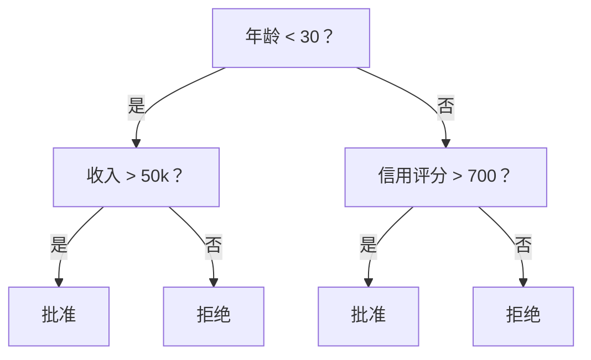
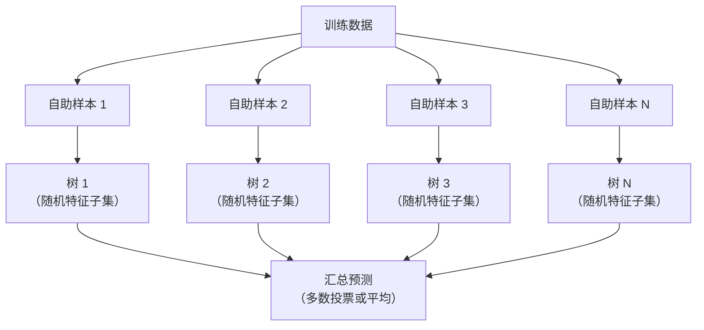

# 决策树与随机森林（Decision Trees and Random Forests）

> 决策树就是一张流程图。但由它们组成的森林，是机器学习（Machine Learning，ML）中最强大的工具之一。

**Type:** Build
**Language:** Python
**Prerequisites:** 阶段 1（第 09 课信息论，第 06 课概率）
**Time:** ~90 分钟

## 学习目标（Learning Objectives）

- 实现基尼不纯度（Gini Impurity）、熵（Entropy）和信息增益（Information Gain）的计算，找到最优的决策树划分。
- 从零构建带有预剪枝（Pre-pruning）控制（最大深度、最小样本数）的决策树分类器。
- 使用自助采样（Bootstrap Sampling）和特征随机化（Feature Randomization）构建随机森林，并解释它为何能降低方差。
- 比较平均不纯度下降（Mean Decrease in Impurity，MDI）特征重要性与排列重要性（Permutation Importance），识别 MDI 何时存在偏差。

## 问题（The Problem）

你有一份表格数据：行是样本，列是特征，其中有一列是你想预测的目标。你可以直接使用神经网络（Neural Network）。但对于表格数据，树模型（决策树、随机森林、梯度提升树）的表现一直优于深度学习（Deep Learning，DL）。Kaggle 上的结构化数据竞赛由 XGBoost 和 LightGBM 主导，而非 Transformer。

为什么？树无需预处理就能处理混合特征类型（数值型和类别型），无需特征工程（Feature Engineering）就能处理非线性关系。它们具有可解释性：查看树就能明确知道为什么会做出某个预测。而对多棵树取平均的随机森林，在中等规模的数据集上很能抵抗过拟合（Overfitting）。

本课使用递归划分从零构建决策树，再以此构建随机森林。你将实现划分准则背后的数学计算（基尼不纯度、熵、信息增益），并理解为什么弱学习器（Weak Learner）的集成（Ensemble）能够成为强学习器。

## 概念（The Concept）

### 决策树做什么（What a decision tree does）

决策树通过提出一连串是非问题，把特征空间（Feature Space）划分成矩形区域。



每个内部节点都将一个特征与阈值比较，每个叶节点都给出一个预测。对新数据点分类时，从根节点出发，沿分支前进，直到到达叶节点。

树自顶向下构建，在每个节点选择最能区分数据的特征和阈值。“最好”由划分准则（Split Criterion）定义。

### 划分准则：衡量不纯度（Split criteria: measuring impurity）

每个节点都有一组样本。我们希望将它们划分后，得到的子节点尽可能“纯”，即每个子节点主要包含同一个类别。

**基尼不纯度（Gini Impurity）**衡量：如果按该节点的类别分布为随机选取的样本赋予标签，该样本被误分类的概率。

```
Gini(S) = 1 - sum(p_k^2)

其中 p_k 是集合 S 中类别 k 的比例。
```

对于纯节点（全部属于一个类别），Gini = 0。对于类别各占 50/50 的二分类划分，Gini = 0.5。越低越好。

```
示例：6 只猫，4 只狗

Gini = 1 - (0.6^2 + 0.4^2) = 1 - (0.36 + 0.16) = 0.48
```

**熵（Entropy）**衡量节点中的信息量（混乱程度）。阶段 1 第 09 课介绍过这一概念。

```
Entropy(S) = -sum(p_k * log2(p_k))
```

对于纯节点，entropy = 0。对于类别各占 50/50 的二分类划分，entropy = 1.0。越低越好。

```
示例：6 只猫，4 只狗

Entropy = -(0.6 * log2(0.6) + 0.4 * log2(0.4))
        = -(0.6 * -0.737 + 0.4 * -1.322)
        = 0.442 + 0.529
        = 0.971 bits
```

**信息增益（Information Gain）**是划分后不纯度（熵或基尼不纯度）的下降量。

```
IG(S, feature, threshold) = Impurity(S) - weighted_avg(Impurity(S_left), Impurity(S_right))

其中权重是各子节点的样本占比。
```

每个节点采用贪心算法（Greedy Algorithm）：尝试每个特征和每个可能的阈值，选择使信息增益最大的（特征，阈值）组合。

### 划分如何进行（How splitting works）

对于当前节点中具有 n 个特征、m 个样本的数据集：

1. 对每个特征 j（j = 1 到 n）：
   - 按特征 j 对样本排序
   - 将相邻不同取值之间的每个中点作为候选阈值
   - 计算每个阈值的信息增益
2. 选择信息增益最高的特征和阈值
3. 将数据分为左侧（feature <= threshold）和右侧（feature > threshold）
4. 对每个子节点递归执行

这种贪心方法不保证得到全局最优树。寻找最优树是 NP 难（NP-hard）问题，但贪心划分在实践中效果很好。

### 停止条件（Stopping conditions）

没有停止条件时，树会一直生长，直到每个叶节点都纯净（每个叶节点一个样本）。这会完全记住训练数据，却导致极差的泛化（Generalization）能力。

**预剪枝（Pre-pruning）**在树完全长成之前停止生长：
- 最大深度：树达到设定深度时停止划分
- 每个叶节点的最小样本数：节点样本少于 k 个时停止
- 最小信息增益：最佳划分带来的不纯度改善小于阈值时停止
- 最大叶节点数：限制叶节点总数

**后剪枝（Post-pruning）**先让树完全长成，再进行修剪：
- 代价复杂度剪枝（Cost-complexity Pruning，scikit-learn 使用的方法）：添加与叶节点数量成正比的惩罚。增大惩罚可得到更小的树
- 错误率降低剪枝（Reduced Error Pruning）：如果移除某棵子树不会增加验证误差，就将其移除

预剪枝更简单、更快。后剪枝通常能得到更好的树，因为它不会过早停止那些可能引出后续有效划分的划分。

### 用于回归的决策树（Decision trees for regression）

对于回归（Regression），叶节点的预测是该叶节点内目标值的均值。划分准则也会改变：

用**方差减少量（Variance Reduction）**替代信息增益：

```
VR(S, feature, threshold) = Var(S) - weighted_avg(Var(S_left), Var(S_right))
```

选择使方差下降最多的划分。树将输入空间划分成多个区域，并在每个区域预测一个常数（均值）。

### 随机森林：集成的力量（Random forests: the power of ensembles）

单棵决策树具有高方差。数据的微小变化就可能产生完全不同的树。随机森林通过对多棵树取平均来解决这个问题。



两种随机性来源使树具有多样性：

**自助聚合（Bootstrap Aggregating，Bagging）：**每棵树都在一个自助样本上训练，即从训练数据中有放回随机抽样得到的样本。每次自助采样中约有 63% 的原始样本出现（其余为袋外样本（Out-of-bag Samples），可用于验证）。

**特征随机化（Feature Randomization）：**每次划分只考虑随机选取的特征子集。分类时默认数量是 sqrt(n_features)，回归时是 n_features/3。这可防止所有树都使用同一个主导特征进行划分。

关键认识是：对多棵去相关的树取平均，可以降低方差而不增加偏差（Bias）。单棵树可能表现平平，集成起来却很强。

### 特征重要性（Feature importance）

随机森林天然可以提供特征重要性分数。最常见的方法是：

**平均不纯度下降（Mean Decrease in Impurity，MDI）：**对于每个特征，将所有树中使用该特征的所有节点带来的不纯度下降量相加。在较早的划分中产生更大不纯度下降的特征更重要。

```
importance(feature_j) = sum over all nodes where feature_j is used:
    (n_samples_at_node / n_total_samples) * impurity_decrease
```

这种方法很快（在训练时计算），但偏向高基数（High-cardinality）特征和具有大量候选划分点的特征。

替代方法是**排列重要性（Permutation Importance）**：打乱某个特征的取值，衡量模型准确率下降多少。它更可靠，但速度更慢。

### 树何时胜过神经网络（When trees beat neural networks）

在表格数据上，树和森林优于神经网络，原因有以下几个：

| 因素 | 树 | 神经网络 |
|--------|-------|----------------|
| 混合类型（数值型 + 类别型） | 原生支持 | 需要编码 |
| 小数据集（< 10k 行） | 效果好 | 过拟合 |
| 特征交互 | 通过划分发现 | 需要架构设计 |
| 可解释性 | 完全透明 | 黑箱 |
| 训练时间 | 分钟级 | 小时级 |
| 超参数（Hyperparameter）敏感性 | 低 | 高 |

当数据具有空间或序列结构（图像、文本、音频）时，神经网络占优。对于扁平的特征表格，树是默认选择。

```figure
decision-tree-depth
```

## 动手实现（Build It）

### 第 1 步：基尼不纯度与熵（Step 1: Gini impurity and entropy）

从零实现这两种划分准则，并验证它们对哪些划分较好的判断一致。

```python
import math

def gini_impurity(labels):
    n = len(labels)
    if n == 0:
        return 0.0
    counts = {}
    for label in labels:
        counts[label] = counts.get(label, 0) + 1
    return 1.0 - sum((c / n) ** 2 for c in counts.values())

def entropy(labels):
    n = len(labels)
    if n == 0:
        return 0.0
    counts = {}
    for label in labels:
        counts[label] = counts.get(label, 0) + 1
    return -sum(
        (c / n) * math.log2(c / n) for c in counts.values() if c > 0
    )
```

### 第 2 步：寻找最佳划分（Step 2: Find the best split）

尝试每个特征和每个阈值，返回信息增益最高的组合。

```python
def information_gain(parent_labels, left_labels, right_labels, criterion="gini"):
    measure = gini_impurity if criterion == "gini" else entropy
    n = len(parent_labels)
    n_left = len(left_labels)
    n_right = len(right_labels)
    if n_left == 0 or n_right == 0:
        return 0.0
    parent_impurity = measure(parent_labels)
    child_impurity = (
        (n_left / n) * measure(left_labels) +
        (n_right / n) * measure(right_labels)
    )
    return parent_impurity - child_impurity
```

### 第 3 步：构建 DecisionTree 类（Step 3: Build the DecisionTree class）

实现递归划分、预测和特征重要性跟踪。`_build` 是树的核心：当节点纯净或达到预剪枝限制时停止；否则选择最佳划分，并递归处理两个子节点。

```python
import random

class DecisionTree:
    def __init__(self, max_depth=None, min_samples_split=2,
                 min_samples_leaf=1, criterion="gini",
                 max_features=None):
        self.max_depth = max_depth
        self.min_samples_split = min_samples_split
        self.min_samples_leaf = min_samples_leaf
        self.criterion = criterion
        self.max_features = max_features
        self.tree = None
        self.feature_importances_ = None

    def fit(self, X, y):
        self.n_features = len(X[0])
        self.feature_importances_ = [0.0] * self.n_features
        self.n_samples = len(X)
        self.tree = self._build(X, y, depth=0)
        total = sum(self.feature_importances_)
        if total > 0:
            self.feature_importances_ = [
                fi / total for fi in self.feature_importances_
            ]

    def predict(self, X):
        return [self._predict_one(x, self.tree) for x in X]

    def _build(self, X, y, depth):
        if len(set(y)) == 1:
            return {"leaf": True, "value": y[0]}

        if self.max_depth is not None and depth >= self.max_depth:
            return self._make_leaf(y)

        if len(y) < self.min_samples_split:
            return self._make_leaf(y)

        best_feature, best_threshold, best_gain = self._best_split(X, y)

        if best_feature is None or best_gain <= 0:
            return self._make_leaf(y)

        left_X, left_y, right_X, right_y = self._split_data(
            X, y, best_feature, best_threshold
        )

        if len(left_y) < self.min_samples_leaf or len(right_y) < self.min_samples_leaf:
            return self._make_leaf(y)

        weight = len(y) / self.n_samples
        self.feature_importances_[best_feature] += weight * best_gain

        return {
            "leaf": False,
            "feature": best_feature,
            "threshold": best_threshold,
            "left": self._build(left_X, left_y, depth + 1),
            "right": self._build(right_X, right_y, depth + 1),
        }

    def _make_leaf(self, y):
        counts = {}
        for label in y:
            counts[label] = counts.get(label, 0) + 1
        return {"leaf": True, "value": max(counts, key=counts.get)}

    def _best_split(self, X, y):
        best_feature = None
        best_threshold = None
        best_gain = -1.0

        if self.max_features == "sqrt":
            k = max(1, int(math.sqrt(self.n_features)))
            feature_indices = random.sample(range(self.n_features), k)
        elif isinstance(self.max_features, int):
            if self.max_features < 1:
                raise ValueError("max_features must be at least 1 when given as an integer")
            k = min(self.max_features, self.n_features)
            feature_indices = random.sample(range(self.n_features), k)
        else:
            feature_indices = list(range(self.n_features))

        for feature_idx in feature_indices:
            values = sorted(set(X[i][feature_idx] for i in range(len(X))))
            if len(values) <= 1:
                continue

            for i in range(len(values) - 1):
                threshold = (values[i] + values[i + 1]) / 2.0
                left_y = [y[j] for j in range(len(X)) if X[j][feature_idx] <= threshold]
                right_y = [y[j] for j in range(len(X)) if X[j][feature_idx] > threshold]

                if len(left_y) < self.min_samples_leaf or len(right_y) < self.min_samples_leaf:
                    continue

                gain = information_gain(y, left_y, right_y, self.criterion)
                if gain > best_gain:
                    best_gain = gain
                    best_feature = feature_idx
                    best_threshold = threshold

        return best_feature, best_threshold, best_gain

    def _split_data(self, X, y, feature, threshold):
        left_X, left_y, right_X, right_y = [], [], [], []
        for i in range(len(X)):
            if X[i][feature] <= threshold:
                left_X.append(X[i])
                left_y.append(y[i])
            else:
                right_X.append(X[i])
                right_y.append(y[i])
        return left_X, left_y, right_X, right_y

    def _predict_one(self, x, node):
        if node["leaf"]:
            return node["value"]
        if x[node["feature"]] <= node["threshold"]:
            return self._predict_one(x, node["left"])
        return self._predict_one(x, node["right"])
```

### 第 4 步：构建 RandomForest 类（Step 4: Build the RandomForest class）

实现自助采样、特征随机化和多数投票（Majority Voting）。

```python
class RandomForest:
    def __init__(self, n_trees=100, max_depth=None,
                 min_samples_split=2, max_features="sqrt",
                 criterion="gini"):
        self.n_trees = n_trees
        self.max_depth = max_depth
        self.min_samples_split = min_samples_split
        self.max_features = max_features
        self.criterion = criterion
        self.trees = []

    def fit(self, X, y):
        n = len(X)
        for _ in range(self.n_trees):
            indices = [random.randint(0, n - 1) for _ in range(n)]
            X_boot = [X[i] for i in indices]
            y_boot = [y[i] for i in indices]
            tree = DecisionTree(
                max_depth=self.max_depth,
                min_samples_split=self.min_samples_split,
                max_features=self.max_features,
                criterion=self.criterion,
            )
            tree.fit(X_boot, y_boot)
            self.trees.append(tree)

    def predict(self, X):
        all_preds = [tree.predict(X) for tree in self.trees]
        predictions = []
        for i in range(len(X)):
            votes = {}
            for preds in all_preds:
                v = preds[i]
                votes[v] = votes.get(v, 0) + 1
            predictions.append(max(votes, key=votes.get))
        return predictions
```

包含全部辅助方法的完整实现见 `code/trees.py`。

## 实际应用（Use It）

使用 scikit-learn，训练随机森林只需三行：

```python
from sklearn.ensemble import RandomForestClassifier
from sklearn.datasets import load_iris
from sklearn.model_selection import train_test_split

X, y = load_iris(return_X_y=True)
X_train, X_test, y_train, y_test = train_test_split(X, y, random_state=42)

rf = RandomForestClassifier(n_estimators=100, random_state=42)
rf.fit(X_train, y_train)
print(f"Accuracy: {rf.score(X_test, y_test):.4f}")
print(f"Feature importances: {rf.feature_importances_}")
```

实践中，梯度提升树（Gradient Boosted Trees，例如 XGBoost、LightGBM、CatBoost）通常比随机森林更强，因为它们按顺序构建树，每棵树纠正之前各棵树的错误。但随机森林更不容易配置出错，几乎不需要超参数调优。

## 交付成果（Ship It）

本课产出 `outputs/prompt-tree-interpreter.md`，这份提示词（Prompt）面向业务相关方解释决策树划分。向它提供训练好的树结构（深度、特征、划分阈值、准确率），它会将模型转化为通俗规则、排列特征重要性、标记过拟合或泄漏，并建议下一步行动。每当你需要向不读代码的人解释树模型时，都可以使用它。

## 练习（Exercises）

1. 在包含 3 个类别的二维数据集上训练一棵决策树。手动追踪划分过程，画出矩形决策边界（Decision Boundary）。比较 max_depth=2 与 max_depth=10 时的边界。

2. 为回归树实现基于方差减少量的划分。生成 200 个满足 y = sin(x) + noise 的点，并拟合你的回归树。绘制树的分段常数预测，与真实曲线对比。

3. 分别构建包含 1、5、10、50、200 棵树的随机森林。绘制训练准确率和测试准确率随树数量变化的曲线。观察测试准确率趋于平稳而不下降的现象（森林能抵抗过拟合）。

4. 在 5 个不同数据集上比较基尼不纯度与熵作为划分准则的效果。测量准确率和树深度。大多数情况下，它们会产生几乎相同的结果。解释原因。

5. 实现排列重要性。在一个特征为高基数随机噪声的数据集上，将它与 MDI 重要性进行比较。MDI 会把该噪声特征排得很高，而排列重要性不会。

## 关键术语（Key Terms）

| 术语 | 常见说法 | 实际含义 |
|------|----------------|----------------------|
| 决策树（Decision Tree） | “用于预测的流程图” | 通过学习一系列 if/else 划分，将特征空间分成矩形区域的模型 |
| 基尼不纯度（Gini Impurity） | “节点有多混杂” | 在节点处将随机样本误分类的概率。0 = 纯净，0.5 = 二分类的最大不纯度 |
| 熵（Entropy） | “节点中的混乱程度” | 节点的信息量。0 = 纯净，1.0 = 二分类的最大不确定性。源自信息论 |
| 信息增益（Information Gain） | “划分有多好” | 划分后不纯度的下降量，是选择划分的贪心准则 |
| 预剪枝（Pre-pruning） | “提前停止树生长” | 设置最大深度、最小样本数或最小增益阈值，让树提前停止生长 |
| 后剪枝（Post-pruning） | “长完再修剪” | 先让树完全长成，再移除不能改善验证表现的子树 |
| 自助聚合（Bootstrap Aggregating，Bagging） | “在随机子集上训练” | 每个模型在不同的有放回随机样本上训练 |
| 随机森林（Random Forest） | “一堆树” | 决策树的集成，每棵树在自助样本上训练，每次划分使用随机特征子集 |
| 特征重要性（Mean Decrease in Impurity，MDI） | “哪些特征重要” | 每个特征贡献的不纯度下降总量，在所有树和节点上求和 |
| 排列重要性（Permutation Importance） | “打乱后检查” | 随机打乱特征值后准确率的下降量。对于噪声特征，比 MDI 更可靠 |
| 方差减少量（Variance Reduction） | “回归版信息增益” | 回归树中与信息增益对应的量。选择使目标方差下降最多的划分 |
| 自助样本（Bootstrap Sample） | “有重复的随机样本” | 从原始数据集中有放回抽取的随机样本。大小相同，但包含重复项 |

## 延伸阅读（Further Reading）

- [Breiman：随机森林（Random Forests，2001）](https://link.springer.com/article/10.1023/A:1010933404324) - 随机森林的原始论文
- [Grinsztajn 等：为什么树模型在表格数据上仍然优于深度学习？（2022）](https://arxiv.org/abs/2207.08815) - 在表格任务上对树与神经网络的严谨比较
- [scikit-learn 决策树文档](https://scikit-learn.org/stable/modules/tree.html) - 包含可视化工具的实用指南
- [XGBoost：可扩展的树提升系统（Chen 与 Guestrin，2016）](https://arxiv.org/abs/1603.02754) - 主导 Kaggle 的梯度提升论文
