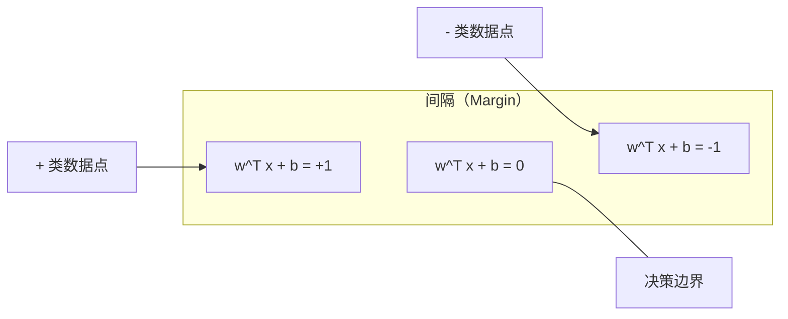
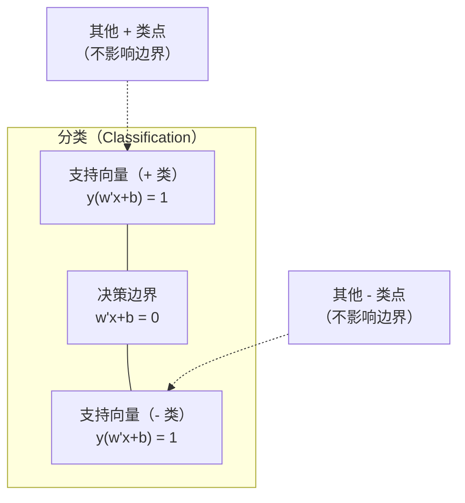
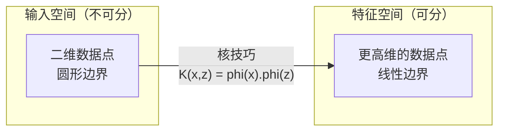

# 支持向量机（Support Vector Machines）

> 在两个类别之间找到最宽的街道。这就是全部思想。

**Type:** Build
**Language:** Python
**Prerequisites:** 阶段 1（第 08 课优化、第 14 课范数与距离、第 18 课凸优化）
**Time:** ~90 分钟

## 学习目标（Learning Objectives）

- 使用合页损失，在原始形式上进行梯度下降，从零实现线性支持向量机
- 解释最大间隔原则，并从训练好的模型中识别支持向量
- 比较线性核、多项式核与 RBF 核，解释核技巧如何避免显式的高维映射
- 评估 C 参数所控制的间隔宽度与分类错误之间的权衡

## 问题（The Problem）

你有两类数据点，需要画一条直线（或超平面，Hyperplane）将它们分开。可行的直线有无穷多条，该选择哪一条？

选择间隔（Margin）最大的那条。间隔是决策边界与两侧最近数据点之间的距离。间隔越宽，分类器越有把握，对未见数据的泛化也越好。

这个直觉引出了支持向量机（Support Vector Machine，SVM），机器学习中数学形式最优雅的算法之一。深度学习出现前，SVM 曾是主流分类方法。对于小数据集、高维数据，以及需要原理清楚、有理论保证的模型的问题，它仍是最佳选择。

SVM 与阶段 1 直接相连：其优化是凸的（第 18 课），间隔通过范数（Norm）度量（第 14 课），核技巧（Kernel Trick）利用点积处理非线性边界，无须实际在高维空间中计算。

## 概念（The Concept）

### 最大间隔分类器（The maximum margin classifier）

给定线性可分数据，标签 y_i 属于 {-1, +1}，特征向量为 x_i。我们希望找到将类别分开的超平面 w^T x + b = 0。

点 x_i 到超平面的距离为：

```
distance = |w^T x_i + b| / ||w||
```

对正确分类的点，有 y_i * (w^T x_i + b) > 0。间隔宽度等于超平面到任意一侧最近点距离的两倍。



优化问题为：

```
maximize    2 / ||w||     (the margin width)
subject to  y_i * (w^T x_i + b) >= 1  for all i
```

等价地，最小化 ||w||^2 更容易优化：

```
minimize    (1/2) ||w||^2
subject to  y_i * (w^T x_i + b) >= 1  for all i
```

这是凸二次规划（Convex Quadratic Program），具有唯一全局解。恰好落在间隔边界上的数据点，即 y_i * (w^T x_i + b) = 1 的点，是支持向量（Support Vector）。只有它们决定决策边界。移动或移除任何非支持向量点，边界都不会改变。

### 支持向量：关键的少数（Support vectors: the critical few）



大多数训练点无关紧要，只有支持向量重要。因此 SVM 预测时内存效率高：只需存储支持向量，不必存储整个训练集。

支持向量数量还给出了泛化误差的界。相对于数据集大小，支持向量越少，泛化越好。

### 软间隔：用 C 参数处理噪声（Soft margin: handling noise with the C parameter）

真实数据很少完全可分。有些点可能位于边界错误的一侧，或落在间隔内部。软间隔（Soft Margin）形式引入松弛变量（Slack Variable），允许违反间隔约束。

```
minimize    (1/2) ||w||^2 + C * sum(xi_i)
subject to  y_i * (w^T x_i + b) >= 1 - xi_i
            xi_i >= 0  for all i
```

松弛变量 xi_i 衡量点 i 违反间隔约束的程度。C 控制这一权衡：

| C 值 | 行为 |
|---------|----------|
| 大 C | 重罚违约。间隔窄，误分类少。过拟合 |
| 小 C | 允许更多违约。间隔宽，误分类多。欠拟合 |

C 与正则化强度成反比。C 大意味着正则化弱，C 小意味着正则化强。

### 合页损失：SVM 的损失函数（Hinge loss: the SVM loss function）

软间隔 SVM 可以改写为无约束优化：

```
minimize    (1/2) ||w||^2 + C * sum(max(0, 1 - y_i * (w^T x_i + b)))
```

其中 max(0, 1 - y_i * f(x_i)) 就是合页损失（Hinge Loss）。当点分类正确且位于间隔之外时，它为零；当点位于间隔内或被误分类时，它呈线性增长。

```
单个点的合页损失：

loss
  |
  | \
  |  \
  |   \
  |    \
  |     \_______________
  |
  +-----|-----|-------->  y * f(x)
       0     1

y*f(x) >= 1 时损失为零（分类正确，位于间隔之外）。
y*f(x) < 1 时施加线性惩罚。
```

与逻辑损失（Logistic Loss，逻辑回归使用）比较：

```
合页损失： max(0, 1 - y*f(x))          在间隔处硬截断
逻辑损失： log(1 + exp(-y*f(x)))        平滑，永远不恰好为零
```

合页损失产生稀疏解（Sparse Solution），只有支持向量的贡献非零。逻辑损失使用所有数据点，因此 SVM 在预测时更节省内存。

### 用梯度下降训练线性 SVM（Training a linear SVM with gradient descent）

可以对合页损失加 L2 正则化进行梯度下降（Gradient Descent），训练线性 SVM，无须求解约束二次规划（Quadratic Program，QP）：

```
L(w, b) = (lambda/2) * ||w||^2 + (1/n) * sum(max(0, 1 - y_i * (w^T x_i + b)))

关于 w 的梯度：
  If y_i * (w^T x_i + b) >= 1:  dL/dw = lambda * w
  If y_i * (w^T x_i + b) < 1:   dL/dw = lambda * w - y_i * x_i

关于 b 的梯度：
  If y_i * (w^T x_i + b) >= 1:  dL/db = 0
  If y_i * (w^T x_i + b) < 1:   dL/db = -y_i
```

这称为原始形式（Primal Formulation）。每轮复杂度为 O(n * d)，其中 n 是样本数，d 是特征数。对于大型、稀疏、高维数据（如文本分类），这种方法很快。

### 对偶形式与核技巧（The dual formulation and the kernel trick）

SVM 问题的拉格朗日对偶（Lagrangian Dual，见阶段 1 第 18 课 KKT 条件）为：

```
maximize    sum(alpha_i) - (1/2) * sum_ij(alpha_i * alpha_j * y_i * y_j * (x_i . x_j))
subject to  0 <= alpha_i <= C
            sum(alpha_i * y_i) = 0
```

对偶问题只涉及数据点之间的点积 x_i . x_j。这是关键：把每个点积替换为核函数（Kernel Function）K(x_i, x_j)，SVM 就能学习非线性边界，而无须显式计算变换。

```
线性核：            K(x, z) = x . z
多项式核：          K(x, z) = (x . z + c)^d
RBF（高斯核）：     K(x, z) = exp(-gamma * ||x - z||^2)
```

径向基函数核（Radial Basis Function Kernel，RBF）将数据映射到无限维空间。输入空间中相近点的核值接近 1，远离点的核值接近 0。它可以学习任意平滑决策边界。



核技巧无须进入高维空间，就能计算该空间中的点积。对于 D 维输入上的 d 次多项式核，显式特征空间有 O(D^d) 维，而计算 K(x, z) 只需 O(D) 时间。

### 用于回归的 SVM（SVM for regression，SVR）

支持向量回归（Support Vector Regression，SVR）围绕数据拟合一个宽度为 epsilon 的管道。管道内的点损失为零，外部的点受到线性惩罚。

```
minimize    (1/2) ||w||^2 + C * sum(xi_i + xi_i*)
subject to  y_i - (w^T x_i + b) <= epsilon + xi_i
            (w^T x_i + b) - y_i <= epsilon + xi_i*
            xi_i, xi_i* >= 0
```

epsilon 参数控制管道宽度。管道越宽，支持向量越少，拟合越平滑；管道越窄，支持向量越多，拟合越紧密。

### SVM 为何被深度学习超越，以及何时仍占优（Why SVMs lost to deep learning and when they still win）

从 1990 年代末到 2010 年代初，SVM 主导机器学习。深度学习因以下原因超越了它：

| 因素 | SVM | 深度学习（Deep Learning） |
|--------|------|---------------|
| 特征工程 | 需要 | 学习特征 |
| 可扩展性 | 核方法为 O(n^2) 到 O(n^3) | SGD 每轮为 O(n) |
| 图像/文本/音频 | 需要手工特征 | 从原始数据学习 |
| 大数据集（>100k） | 慢 | 扩展性好 |
| GPU 加速 | 收益有限 | 大幅提速 |

SVM 在以下情况仍占优：
- 小数据集，几百到几千个样本
- 高维稀疏数据，如采用 TF-IDF 特征的文本
- 需要数学保证，如间隔界（Margin Bounds）
- 必须尽量缩短训练时间，线性 SVM 很快
- 间隔结构清楚的二分类
- 异常检测（Anomaly Detection），使用单类 SVM（One-class SVM）

```figure
svm-margin
```

## 动手实现（Build It）

### 第 1 步：合页损失与梯度（Hinge loss and gradient）

先实现基础：计算一个批次的合页损失及其梯度。

```python
def hinge_loss(X, y, w, b):
    n = len(X)
    total_loss = 0.0
    for i in range(n):
        margin = y[i] * (dot(w, X[i]) + b)
        total_loss += max(0.0, 1.0 - margin)
    return total_loss / n
```

### 第 2 步：通过梯度下降实现线性 SVM（Linear SVM via gradient descent）

最小化正则化合页损失进行训练，无须 QP 求解器。

```python
class LinearSVM:
    def __init__(self, lr=0.001, lambda_param=0.01, n_epochs=1000):
        self.lr = lr
        self.lambda_param = lambda_param
        self.n_epochs = n_epochs
        self.w = None
        self.b = 0.0

    def fit(self, X, y):
        n_features = len(X[0])
        self.w = [0.0] * n_features
        self.b = 0.0

        for epoch in range(self.n_epochs):
            for i in range(len(X)):
                margin = y[i] * (dot(self.w, X[i]) + self.b)
                if margin >= 1:
                    self.w = [wj - self.lr * self.lambda_param * wj
                              for wj in self.w]
                else:
                    self.w = [wj - self.lr * (self.lambda_param * wj - y[i] * X[i][j])
                              for j, wj in enumerate(self.w)]
                    self.b -= self.lr * (-y[i])

    def predict(self, X):
        return [1 if dot(self.w, x) + self.b >= 0 else -1 for x in X]
```

### 第 3 步：核函数（Kernel functions）

实现线性核、多项式核和 RBF 核。

```python
def linear_kernel(x, z):
    return dot(x, z)

def polynomial_kernel(x, z, degree=3, c=1.0):
    return (dot(x, z) + c) ** degree

def rbf_kernel(x, z, gamma=0.5):
    diff = [xi - zi for xi, zi in zip(x, z)]
    return math.exp(-gamma * dot(diff, diff))
```

### 第 4 步：间隔与支持向量识别（Margin and support vector identification）

训练后识别哪些点是支持向量，并计算间隔宽度。

```python
def find_support_vectors(X, y, w, b, tol=1e-3):
    support_vectors = []
    for i in range(len(X)):
        margin = y[i] * (dot(w, X[i]) + b)
        if abs(margin - 1.0) < tol:
            support_vectors.append(i)
    return support_vectors
```

包含全部演示的完整实现见 `code/svm.py`。

## 实际应用（Use It）

使用 scikit-learn：

```python
from sklearn.svm import SVC, LinearSVC, SVR
from sklearn.preprocessing import StandardScaler
from sklearn.pipeline import Pipeline

clf = Pipeline([
    ("scaler", StandardScaler()),
    ("svm", SVC(kernel="rbf", C=1.0, gamma="scale")),
])
clf.fit(X_train, y_train)
print(f"Accuracy: {clf.score(X_test, y_test):.4f}")
print(f"Support vectors: {clf['svm'].n_support_}")
```

重要：训练 SVM 前始终先缩放特征。SVM 对特征量级敏感，因为间隔依赖于 ||w||，未经缩放的特征会扭曲几何结构。

对于大数据集，使用 `LinearSVC`（原始形式，每轮 O(n)），而不是 `SVC`（对偶形式，O(n^2) 到 O(n^3)）：

```python
from sklearn.svm import LinearSVC

clf = Pipeline([
    ("scaler", StandardScaler()),
    ("svm", LinearSVC(C=1.0, max_iter=10000)),
])
```

## 练习（Exercises）

1. 生成二维线性可分数据集。训练你的 LinearSVM 并识别支持向量，验证支持向量就是离决策边界最近的点。

2. 在含噪数据集上将 C 从 0.001 调到 1000。为每个 C 绘制决策边界，观察宽间隔（欠拟合）向窄间隔（过拟合）的转变。

3. 创建类别边界为圆形而非线性的数据集，展示线性 SVM 的失败。计算 RBF 核矩阵，展示类别在核诱导的特征空间中变得可分。

4. 在同一数据集上比较合页损失与逻辑损失。训练线性 SVM 和逻辑回归，统计各模型中有多少训练点对决策边界有贡献，即支持向量与所有点的对比。

5. 实现 SVR，采用 epsilon 不敏感损失（Epsilon-insensitive Loss）。拟合 y = sin(x) + noise，围绕预测绘制 epsilon 管道，并突出标记支持向量，即管道外的点。

## 关键术语（Key Terms）

| 术语 | 实际含义 |
|------|----------------------|
| 支持向量（Support Vectors） | 距决策边界最近的训练点，只有它们决定超平面 |
| 间隔（Margin） | 决策边界与最近支持向量之间的距离，SVM 将其最大化 |
| 合页损失（Hinge Loss） | max(0, 1 - y*f(x))。分类正确且在间隔外时为零，否则线性惩罚 |
| C 参数（C Parameter） | 权衡间隔宽度与分类错误。C 大则间隔窄，C 小则间隔宽 |
| 软间隔（Soft Margin） | 通过松弛变量允许违反间隔约束的 SVM 形式，用于不可分数据 |
| 核技巧（Kernel Trick） | 无须显式映射到高维特征空间，即可计算该空间中的点积 |
| 线性核（Linear Kernel） | K(x, z) = x . z。等价于标准点积，用于线性可分数据 |
| RBF 核（RBF Kernel） | K(x, z) = exp(-gamma * \|\|x-z\|\|^2)。映射到无限维，学习任意平滑边界 |
| 多项式核（Polynomial Kernel） | K(x, z) = (x . z + c)^d。映射到由多项式组合构成的特征空间 |
| 对偶形式（Dual Formulation） | 将 SVM 问题改写为仅依赖数据点间点积的形式，使核方法成为可能 |
| 支持向量回归（Support Vector Regression，SVR） | 围绕数据拟合 epsilon 管道，内部点的损失为零 |
| 松弛变量（Slack Variables） | xi_i：衡量某点违反间隔约束的程度。分类正确且位于间隔外时为零 |
| 最大间隔（Maximum Margin） | 选择使到每个类别最近点的距离最大的超平面的原则 |

## 延伸阅读（Further Reading）

- [Vapnik：统计学习理论的本质（The Nature of Statistical Learning Theory，1995）](https://link.springer.com/book/10.1007/978-1-4757-3264-1)：SVM 与统计学习的基础著作
- [Cortes 与 Vapnik：支持向量网络（Support-vector networks，1995）](https://link.springer.com/article/10.1007/BF00994018)：SVM 的原始论文
- [Platt：序列最小优化（Sequential Minimal Optimization，1998）](https://www.microsoft.com/en-us/research/publication/sequential-minimal-optimization-a-fast-algorithm-for-training-support-vector-machines/)：使 SVM 训练可用于实践的 SMO 算法
- [scikit-learn SVM 文档（documentation）](https://scikit-learn.org/stable/modules/svm.html)：包含实现细节的实用指南
- [LIBSVM：支持向量机库（A Library for Support Vector Machines）](https://www.csie.ntu.edu.tw/~cjlin/libsvm/)：大多数 SVM 实现背后的 C++ 库
