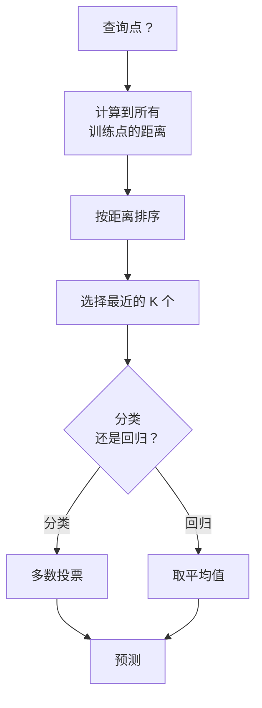
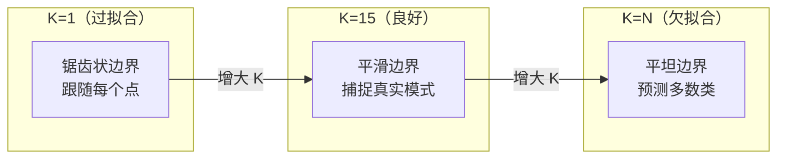
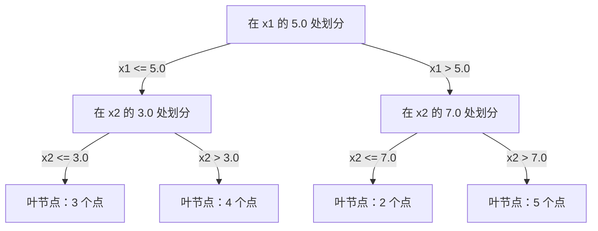

# K 近邻与距离（K-Nearest Neighbors and Distances）

> 存储全部数据，通过查看邻居来预测。这是最简单且确实有效的算法。

**Type:** Build
**Language:** Python
**Prerequisites:** 阶段 1（第 14 课范数与距离）
**Time:** ~90 分钟

## 学习目标（Learning Objectives）

- 从零实现可配置 K、支持距离加权投票的 KNN 分类和回归
- 比较 L1、L2、余弦与闵可夫斯基距离，为给定数据类型选择合适的度量
- 解释维度灾难，并展示 KNN 为何在高维空间中退化
- 构建用于高效近邻搜索的 KD 树，分析它何时优于暴力搜索

## 问题（The Problem）

你有一个数据集。新数据点到来时，需要对其分类或预测数值。你不必像线性回归或 SVM 那样从数据中学习参数，只要找到距离新点最近的 K 个训练点，让它们投票即可。

这就是 K 近邻（K-nearest Neighbors，KNN）。没有训练阶段，没有需要学习的参数，也没有需要最小化的损失函数。你存储整个训练集，在预测时计算距离。

它听起来简单得似乎不可能有效，但在许多问题上，尤其是中小数据集上，KNN 的竞争力超出直觉。深入理解它还能揭示基本概念：距离度量的选择（衔接阶段 1 第 14 课）、维度灾难，以及惰性学习与急切学习的区别。

KNN 也以不同名称出现在现代 AI 的各个角落。向量数据库对嵌入（Embedding）执行 KNN 搜索；检索增强生成（Retrieval-Augmented Generation，RAG）寻找最近的 K 个文档块；推荐系统寻找相似用户或物品。算法相同，差别在规模和数据结构。

## 概念（The Concept）

### KNN 如何工作（How KNN works）

给定带标签的数据点集和一个新查询点：

1. 计算查询点到数据集中每个点的距离
2. 按距离排序
3. 取最近的 K 个点
4. 分类时：对 K 个邻居进行多数投票（Majority Vote）
5. 回归时：对 K 个邻居的值取平均或加权平均



这就是整个算法。无须拟合、梯度下降或训练轮次。

### 选择 K（Choosing K）

K 是唯一的超参数，控制偏差与方差的权衡（Bias-Variance Trade-off）：

| K | 行为 |
|---|----------|
| K = 1 | 决策边界跟随每个点。训练误差为零，方差高，会过拟合 |
| 小 K（3–5） | 对局部结构敏感，可以捕捉复杂边界 |
| 大 K | 边界更平滑，对噪声更稳健，可能欠拟合 |
| K = N | 对每个点都预测多数类，偏差最大 |

对于 N 个点的数据集，常从 K = sqrt(N) 开始。二分类使用奇数 K，避免平票。



### 距离度量（Distance metrics）

距离函数定义什么是“近”。不同度量会得到不同邻居，进而得到不同预测。

默认使用 **L2 欧氏距离（Euclidean Distance）**，即直线距离。

```
d(a, b) = sqrt(sum((a_i - b_i)^2))
```

它对特征尺度敏感。KNN 使用 L2 前，始终先将特征标准化。

**L1 曼哈顿距离（Manhattan Distance）**对绝对差求和。它不对差值平方，因此比 L2 更能抵抗异常值。

```
d(a, b) = sum(|a_i - b_i|)
```

**余弦距离（Cosine Distance）**度量向量夹角，忽略模长，对文本和嵌入数据至关重要。

```
d(a, b) = 1 - (a . b) / (||a|| * ||b||)
```

**闵可夫斯基距离（Minkowski Distance）**用参数 p 将 L1 和 L2 推广。

```
d(a, b) = (sum(|a_i - b_i|^p))^(1/p)

p=1: 曼哈顿距离（Manhattan）
p=2: 欧氏距离（Euclidean）
p->inf: 切比雪夫距离（Chebyshev，最大绝对差）
```

选择哪种度量取决于数据：

| 数据类型 | 最佳度量 | 原因 |
|-----------|------------|-----|
| 数值特征，尺度相近 | L2（欧氏距离） | 默认选择，适用于空间数据 |
| 数值特征，存在异常值 | L1（曼哈顿距离） | 稳健，不放大大差值 |
| 文本嵌入 | 余弦距离 | 模长是噪声，方向表达含义 |
| 高维稀疏数据 | 余弦距离或 L1 | L2 受维度灾难影响 |
| 混合类型 | 自定义距离 | 按特征类型组合度量 |

### 加权 KNN（Weighted KNN）

标准 KNN 对所有 K 个邻居赋予相同权重，但距离 0.1 的邻居应比距离 5.0 的邻居更重要。

**距离加权 KNN（Distance-weighted KNN）**按距离的倒数为各邻居赋权：

```
weight_i = 1 / (distance_i + epsilon)

分类：加权投票
回归：加权平均，weighted average = sum(w_i * y_i) / sum(w_i)
```

epsilon 用于防止查询点与训练点完全重合时除以零。

加权 KNN 对 K 的选择更不敏感，因为无论如何，远处邻居的贡献都很小。

### 维度灾难（The curse of dimensionality）

KNN 在高维空间中性能退化。这不是模糊的担忧，而是数学事实。

**问题 1：距离趋同。**维度增加时，最大距离与最小距离之比趋近于 1。所有点到查询点都变得同样“远”。

```
在 d 维空间中，对于均匀随机点：

d=2:    max_dist / min_dist = 变化范围很大
d=100:  max_dist / min_dist ~ 1.01
d=1000: max_dist / min_dist ~ 1.001

所有距离几乎相同时，“最近”就失去了意义。
```

**问题 2：体积爆炸。**要在占数据固定比例的范围内找到 K 个邻居，必须扩大搜索半径，覆盖特征空间中大得多的比例。高维中的“邻域”包含了空间的大部分。

**问题 3：角落占主导。**在 d 维单位超立方体中，大部分体积集中在角落附近，而非中心。随着 d 增长，内切球的体积占比趋近于零。

实际后果是：特征数在约 20–50 个以内时，KNN 效果良好。超过这一范围，应先降维（Dimensionality Reduction），如 PCA、UMAP、t-SNE，再使用 KNN；或者采用能利用数据内在低维结构的树式搜索结构。

### KD 树：快速近邻搜索（KD-trees: fast nearest neighbor search）

暴力 KNN 计算查询点到每个训练点的距离，每次查询为 O(n * d)，对大数据集而言太慢。

KD 树（KD-tree）沿特征轴递归划分空间，每层沿一个维度在中位数处划分。



寻找最近邻时，沿树遍历到包含查询点的叶节点，然后回溯，仅在相邻分区可能包含更近点时才检查它们。

低维时平均查询时间为 O(log n)。但在高维（d > 20）时，KD 树退化为 O(n)，因为回溯能够排除的分支越来越少。

### 球树：更适合中等维度（Ball trees: better for moderate dimensions）

球树（Ball Tree）将数据划分为嵌套超球体，而非轴对齐的盒子。每个节点定义一个包含其子树全部点的球，即球心加半径。

相对于 KD 树的优势：
- 在中等维度（最高约 50 维）中表现更好
- 能处理非轴对齐结构
- 包围体更紧凑，搜索时能剪掉更多分支

KD 树和球树都是精确算法。真正的大规模搜索（数百万点、数百维）则使用近似最近邻（Approximate Nearest Neighbor）方法，如 HNSW、IVF、乘积量化（Product Quantization）。阶段 1 第 14 课介绍了这些方法。

### 惰性学习与急切学习（Lazy learning vs eager learning）

KNN 是惰性学习器（Lazy Learner）：训练时不工作，所有工作都在预测时完成。大多数其他算法（线性回归、SVM、神经网络）是急切学习器（Eager Learner）：训练时进行大量计算，构建紧凑模型，之后快速预测。

| 维度 | 惰性学习（KNN） | 急切学习（SVM、神经网络） |
|--------|------------|------------------------|
| 训练时间 | O(1)，只存储数据 | O(n * epochs) |
| 预测时间 | 每次查询 O(n * d) | O(d) 或 O(parameters) |
| 预测时内存 | 存储整个训练集 | 只存储模型参数 |
| 适应新数据 | 立即添加点 | 重新训练模型 |
| 决策边界 | 隐式，实时计算 | 显式，训练后固定 |

惰性学习适合以下情况：
- 数据集频繁变化，需要无须重训地增删点
- 只需预测极少量查询
- 希望训练时间为零
- 数据集足够小，暴力搜索也很快

### 用于回归的 KNN（KNN for regression）

KNN 回归不做多数投票，而是对 K 个邻居的目标值取平均。

```
prediction = (1/K) * sum(y_i for i in K nearest neighbors)

或采用距离加权：
prediction = sum(w_i * y_i) / sum(w_i)
where w_i = 1 / distance_i
```

KNN 回归产生分段常数预测，加权后可得到分段平滑预测。它无法外推（Extrapolate）到训练数据范围之外。若训练目标都在 0 到 100 之间，KNN 永远不会预测 200。

```figure
knn-smoothness
```

## 动手实现（Build It）

### 第 1 步：距离函数（Distance functions）

实现 L1、L2、余弦和闵可夫斯基距离，与阶段 1 第 14 课直接衔接。

```python
import math

def l2_distance(a, b):
    return math.sqrt(sum((ai - bi) ** 2 for ai, bi in zip(a, b)))

def l1_distance(a, b):
    return sum(abs(ai - bi) for ai, bi in zip(a, b))

def cosine_distance(a, b):
    dot_val = sum(ai * bi for ai, bi in zip(a, b))
    norm_a = math.sqrt(sum(ai ** 2 for ai in a))
    norm_b = math.sqrt(sum(bi ** 2 for bi in b))
    if norm_a == 0 or norm_b == 0:
        return 1.0
    return 1.0 - dot_val / (norm_a * norm_b)

def minkowski_distance(a, b, p=2):
    if p == float('inf'):
        return max(abs(ai - bi) for ai, bi in zip(a, b))
    return sum(abs(ai - bi) ** p for ai, bi in zip(a, b)) ** (1 / p)
```

### 第 2 步：KNN 分类器与回归器（KNN classifier and regressor）

构建完整 KNN，支持配置 K、距离度量，以及可选的距离加权。

```python
class KNN:
    def __init__(self, k=5, distance_fn=l2_distance, weighted=False,
                 task="classification"):
        self.k = k
        self.distance_fn = distance_fn
        self.weighted = weighted
        self.task = task
        self.X_train = None
        self.y_train = None

    def fit(self, X, y):
        self.X_train = X
        self.y_train = y

    def predict(self, X):
        return [self._predict_one(x) for x in X]
```

### 第 3 步：用于高效搜索的 KD 树（KD-tree for efficient search）

从零构建 KD 树，在各维度的中位数处递归划分。

```python
class KDTree:
    def __init__(self, X, indices=None, depth=0):
        # Recursively partition the data
        self.axis = depth % len(X[0])
        # Split on median of the current axis
        ...

    def query(self, point, k=1):
        # Traverse to leaf, then backtrack
        ...
```

包含全部辅助方法及演示的完整实现见 `code/knn.py`。

### 第 4 步：特征缩放（Feature scaling）

KNN 需要特征缩放，因为距离对特征量级敏感。范围为 0 到 1000 的特征会压过范围为 0 到 1 的特征。

```python
def standardize(X):
    n = len(X)
    d = len(X[0])
    means = [sum(X[i][j] for i in range(n)) / n for j in range(d)]
    stds = [
        max(1e-10, (sum((X[i][j] - means[j]) ** 2 for i in range(n)) / n) ** 0.5)
        for j in range(d)
    ]
    return [[((X[i][j] - means[j]) / stds[j]) for j in range(d)] for i in range(n)], means, stds
```

## 实际应用（Use It）

使用 scikit-learn：

```python
from sklearn.neighbors import KNeighborsClassifier
from sklearn.preprocessing import StandardScaler
from sklearn.pipeline import Pipeline

clf = Pipeline([
    ("scaler", StandardScaler()),
    ("knn", KNeighborsClassifier(n_neighbors=5, metric="euclidean")),
])
clf.fit(X_train, y_train)
print(f"Accuracy: {clf.score(X_test, y_test):.4f}")
```

数据集足够大且维度足够低时，Scikit-learn 自动使用 KD 树或球树。高维数据则退回暴力搜索。可以通过 `algorithm` 参数控制这一行为。

对于大规模近邻搜索（数百万向量），使用 FAISS、Annoy 或向量数据库：

```python
import faiss

index = faiss.IndexFlatL2(dimension)
index.add(embeddings)
distances, indices = index.search(query_vectors, k=5)
```

## 练习（Exercises）

1. 在三分类二维数据集上实现 KNN 分类。绘制 K=1、K=5、K=15 和 K=N 的决策边界，观察从过拟合到欠拟合的变化。

2. 分别在 2、5、10、50、100、500 维空间生成 1000 个随机点。对各维度计算最大两两距离与最小两两距离之比，绘制比值随维度变化的曲线，展示维度灾难。

3. 在使用 TF-IDF 向量的文本分类问题上比较 KNN 的 L1、L2 和余弦距离。哪个准确率最高？为什么文本上余弦距离往往更好？

4. 实现 KD 树，对 2D、10D、50D 空间中包含 1k、10k、100k 个点的数据集，测量并比较它与暴力搜索的查询时间。从多少维起，KD 树不再比暴力搜索快？

5. 为 y = sin(x) + noise 构建加权 KNN 回归器。在 K=3、10、30 时与未加权 KNN 比较，展示加权如何产生更平滑的预测，尤其在 K 较大时。

## 关键术语（Key Terms）

| 术语 | 实际含义 |
|------|----------------------|
| K 近邻（K-nearest Neighbors） | 找到距离查询最近的 K 个训练点来预测的非参数算法 |
| 惰性学习（Lazy Learning） | 训练时不计算，所有工作在预测时完成。KNN 是典型例子 |
| 急切学习（Eager Learning） | 训练时大量计算，构建紧凑模型。大多数机器学习算法属于此类 |
| 维度灾难（Curse of Dimensionality） | 高维中距离趋同，邻域扩大到覆盖大部分空间，使 KNN 失效 |
| KD 树（KD-tree） | 沿特征轴递归划分空间的二叉树，低维查询为 O(log n) |
| 球树（Ball Tree） | 嵌套超球体构成的树，在中等维度（最高约 50 维）中优于 KD 树 |
| 加权 KNN（Weighted KNN） | 按距离倒数赋予邻居权重，越近的邻居对预测影响越大 |
| 特征缩放（Feature Scaling） | 将特征归一到可比较的范围，KNN 等基于距离的方法需要这一步 |
| 多数投票（Majority Vote） | 统计 K 个邻居中哪个类别最常见，以此分类 |
| 暴力搜索（Brute Force Search） | 计算到每个训练点的距离，每次查询 O(n*d)。精确，但 n 大时很慢 |
| 近似最近邻（Approximate Nearest Neighbor） | 比精确搜索快得多地寻找近似最近点的算法，如 HNSW、LSH、IVF |
| 沃罗诺伊图（Voronoi Diagram） | 一种空间划分，每个区域包含距离某个训练点比其他训练点更近的所有点。K=1 的 KNN 产生这种边界 |

## 延伸阅读（Further Reading）

- [Cover 与 Hart：最近邻模式分类（Nearest Neighbor Pattern Classification，1967）](https://ieeexplore.ieee.org/document/1053964)：KNN 基础论文，证明其错误率至多为贝叶斯最优错误率的两倍
- [Friedman、Bentley、Finkel：在对数期望时间内寻找最佳匹配的算法（An Algorithm for Finding Best Matches in Logarithmic Expected Time，1977）](https://dl.acm.org/doi/10.1145/355744.355745)：KD 树原始论文
- [Beyer 等：“最近邻”何时有意义？（When Is "Nearest Neighbor" Meaningful?，1999）](https://link.springer.com/chapter/10.1007/3-540-49257-7_15)：对最近邻维度灾难的形式化分析
- [scikit-learn 最近邻文档（Nearest Neighbors documentation）](https://scikit-learn.org/stable/modules/neighbors.html)：包含算法选择的实用指南
- [FAISS：高效相似度搜索库（A Library for Efficient Similarity Search）](https://github.com/facebookresearch/faiss)：Meta 用于十亿级近似最近邻搜索的库
