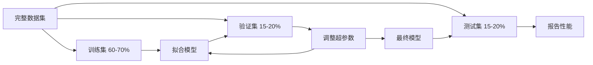

# 模型评估（Model Evaluation）

> 模型是否优秀，取决于你如何衡量它。

**Type:** Build
**Languages:** Python
**Prerequisites:** 阶段 1（概率与分布、机器学习统计学），阶段 2 第 1–8 课
**Time:** ~90 分钟

## 学习目标（Learning Objectives）

- 从零实现 K 折及分层 K 折交叉验证，解释分层对不平衡数据的重要性
- 从零计算精确率、召回率、F1、AUC-ROC，以及回归指标 MSE、RMSE、MAE、R-squared
- 解读学习曲线，诊断模型是高偏差还是高方差
- 识别常见评估错误，包括数据泄漏、指标选择错误和测试集污染

## 问题（The Problem）

你训练了一个模型，在数据上获得 95% 准确率。它好吗？

也许好，也许不好。如果 95% 的数据属于同一类，始终预测该类的模型就能得到 95% 准确率，却完全无用。如果在训练所用的同一批数据上评估，95% 就没有意义，因为模型可能只是记住答案。如果数据带有时间信息，你在划分前随机打乱，模型可能在用未来数据预测过去。

模型评估是大多数机器学习项目出错的地方。错误指标让坏模型看起来很好，错误划分让模型作弊，错误比较让你选中更差的模型。正确评估不是可选项：它决定模型能在生产中工作，还是一见真实数据就失败。

## 概念（The Concept）

### 训练、验证、测试（Train, Validation, Test）



三种划分，三种用途：

- **训练集（Training Set）**：模型从这些数据学习，训练期间会见到这些样本。
- **验证集（Validation Set）**：用于调超参数和选择模型。模型不在其上训练，但你的决策会受其影响。
- **测试集（Test Set）**：只在最后接触一次，用于报告最终性能。如果看了测试性能又回去修改模型，它就不再是测试集，而成了第二个验证集。

测试集是留出保证（Hold-out Guarantee），确保报告的性能反映模型在真正未见数据上的表现。

### K 折交叉验证（K-Fold Cross-Validation）

小数据集上，单次训练/验证划分会浪费数据，并产生噪声较大的估计。K 折交叉验证让所有数据都轮流用于训练与验证：

```mermaid
flowchart TB
    subgraph Fold1["第 1 折"]
        direction LR
        V1["验证"] --- T1a["训练"] --- T1b["训练"] --- T1c["训练"] --- T1d["训练"]
    end
    subgraph Fold2["第 2 折"]
        direction LR
        T2a["训练"] --- V2["验证"] --- T2b["训练"] --- T2c["训练"] --- T2d["训练"]
    end
    subgraph Fold3["第 3 折"]
        direction LR
        T3a["训练"] --- T3b["训练"] --- V3["验证"] --- T3c["训练"] --- T3d["训练"]
    end
    subgraph Fold4["第 4 折"]
        direction LR
        T4a["训练"] --- T4b["训练"] --- T4c["训练"] --- V4["验证"] --- T4d["训练"]
    end
    subgraph Fold5["第 5 折"]
        direction LR
        T5a["训练"] --- T5b["训练"] --- T5c["训练"] --- T5d["训练"] --- V5["验证"]
    end
    Fold1 --> R["分数取平均"]
    Fold2 --> R
    Fold3 --> R
    Fold4 --> R
    Fold5 --> R
```



1. 将数据分成 K 个等大的折
2. 对每一折，用其他 K-1 折训练，在这一折上验证
3. 对 K 个验证分数取平均

K=5 或 K=10 是标准选择。每个数据点恰好用于验证一次。平均分数比任何一次划分都更稳定。

**分层 K 折（Stratified K-fold）**：在各折中保留类别分布。如果数据集中 A 类占 70%、B 类占 30%，每折比例也大致相同。这对不平衡数据很重要，因为随机划分可能把所有少数类样本放到同一折。

### 分类指标（Classification Metrics）

**混淆矩阵（Confusion Matrix）**是一切的基础。二分类中：

|  | 预测为正 | 预测为负 |
|--|---|---|
| 实际为正 | 真阳性（True Positive，TP） | 假阴性（False Negative，FN） |
| 实际为负 | 假阳性（False Positive，FP） | 真阴性（True Negative，TN） |

其他指标都可由该矩阵推导：

- **准确率（Accuracy）** = (TP + TN) / (TP + TN + FP + FN)。正确预测的比例，类别不平衡时会误导。
- **精确率（Precision）** = TP / (TP + FP)。预测为正的对象中有多少确实为正？适用于假阳性代价高的情况，如垃圾邮件过滤器将正常邮件判为垃圾邮件。
- **召回率（Recall，灵敏度 Sensitivity）** = TP / (TP + FN)。实际正例中找到了多少？适用于假阴性代价高的情况，如癌症筛查漏掉肿瘤。
- **F1 分数（F1 Score）** = 2 * precision * recall / (precision + recall)。精确率和召回率的调和平均数，二者没有明确优先级时用于平衡。
- **受试者工作特征曲线下面积（Area Under the Receiver Operating Characteristic Curve，AUC-ROC）**：绘制各分类阈值下真阳性率相对于假阳性率的曲线。AUC = 0.5 表示随机猜测，AUC = 1.0 表示完美分离。它与阈值无关，衡量模型将正例排在负例之前的能力，不受所选截断值影响。

### 回归指标（Regression Metrics）

- **均方误差（Mean Squared Error，MSE）** = mean((y_true - y_pred)^2)。按平方惩罚大误差，对异常值敏感。
- **均方根误差（Root Mean Squared Error，RMSE）** = sqrt(MSE)。与目标变量单位相同，比 MSE 更易解释。
- **平均绝对误差（Mean Absolute Error，MAE）** = mean(|y_true - y_pred|)。线性对待所有误差，比 MSE 更能抵抗异常值。
- **决定系数（R-squared）** = 1 - SS_res / SS_tot，其中 SS_res = sum((y_true - y_pred)^2)，SS_tot = sum((y_true - y_mean)^2)。表示模型解释的方差比例。R^2 = 1.0 为完美，R^2 = 0.0 表示不优于始终预测均值；若比均值还差，R^2 可以为负。

### 学习曲线（Learning Curves）

绘制训练和验证分数随训练集大小变化的曲线：

- **高偏差（High Bias，欠拟合）**：两条曲线都收敛到低分。增加数据无济于事，需要更复杂的模型。
- **高方差（High Variance，过拟合）**：训练分数高，验证分数却低得多，差距很大。增加数据应有帮助。

### 验证曲线（Validation Curves）

绘制训练和验证分数随某个超参数变化的曲线：

- 复杂度低时：两个分数都低，即欠拟合
- 复杂度合适时：两个分数都高且接近
- 复杂度高时：训练分数仍高，验证分数下降，即过拟合

验证分数达到峰值时对应的超参数值就是最优值。

### 常见评估错误（Common Evaluation Mistakes）

**数据泄漏（Data Leakage）**：测试集信息泄漏到训练中。例如划分前在整个数据集上拟合缩放器，在时间序列预测中包含未来数据，使用从目标派生的特征。始终先划分，再预处理。

**类别不平衡（Class Imbalance）**：99% 的交易合法，1% 是欺诈。始终预测“合法”的模型就有 99% 准确率。应改用精确率、召回率、F1 或 AUC-ROC。

**指标错误**：本该优化召回率（医疗诊断）却优化准确率；或数据有严重异常值时优化 RMSE，此时应使用 MAE。

**不使用分层划分**：不平衡数据随机划分后，验证折可能只有极少数少数类样本，导致估计不稳定。

**测试过于频繁**：每次查看测试性能并据此调整，都在向测试集过拟合。测试集只能使用一次。

```figure
precision-recall-threshold
```

## 动手实现（Build It）

### 第 1 步：训练/验证/测试划分（Train/validation/test split）

```python
import random
import math


def train_val_test_split(X, y, train_ratio=0.6, val_ratio=0.2, seed=42):
    random.seed(seed)
    n = len(X)
    indices = list(range(n))
    random.shuffle(indices)

    train_end = int(n * train_ratio)
    val_end = int(n * (train_ratio + val_ratio))

    train_idx = indices[:train_end]
    val_idx = indices[train_end:val_end]
    test_idx = indices[val_end:]

    X_train = [X[i] for i in train_idx]
    y_train = [y[i] for i in train_idx]
    X_val = [X[i] for i in val_idx]
    y_val = [y[i] for i in val_idx]
    X_test = [X[i] for i in test_idx]
    y_test = [y[i] for i in test_idx]

    return X_train, y_train, X_val, y_val, X_test, y_test
```

### 第 2 步：K 折与分层 K 折交叉验证（K-fold and stratified K-fold cross-validation）

```python
def kfold_split(n, k=5, seed=42):
    random.seed(seed)
    indices = list(range(n))
    random.shuffle(indices)

    fold_size = n // k
    folds = []

    for i in range(k):
        start = i * fold_size
        end = start + fold_size if i < k - 1 else n
        val_idx = indices[start:end]
        train_idx = indices[:start] + indices[end:]
        folds.append((train_idx, val_idx))

    return folds


def stratified_kfold_split(y, k=5, seed=42):
    random.seed(seed)

    class_indices = {}
    for i, label in enumerate(y):
        class_indices.setdefault(label, []).append(i)

    for label in class_indices:
        random.shuffle(class_indices[label])

    folds = [{"train": [], "val": []} for _ in range(k)]

    for label, indices in class_indices.items():
        fold_size = len(indices) // k
        for i in range(k):
            start = i * fold_size
            end = start + fold_size if i < k - 1 else len(indices)
            val_part = indices[start:end]
            train_part = indices[:start] + indices[end:]
            folds[i]["val"].extend(val_part)
            folds[i]["train"].extend(train_part)

    return [(f["train"], f["val"]) for f in folds]


def cross_validate(X, y, model_fn, k=5, metric_fn=None, stratified=False):
    n = len(X)

    if stratified:
        folds = stratified_kfold_split(y, k)
    else:
        folds = kfold_split(n, k)

    scores = []
    for train_idx, val_idx in folds:
        X_train = [X[i] for i in train_idx]
        y_train = [y[i] for i in train_idx]
        X_val = [X[i] for i in val_idx]
        y_val = [y[i] for i in val_idx]

        model = model_fn()
        model.fit(X_train, y_train)
        predictions = [model.predict(x) for x in X_val]

        if metric_fn:
            score = metric_fn(y_val, predictions)
        else:
            score = sum(1 for yt, yp in zip(y_val, predictions) if yt == yp) / len(y_val)
        scores.append(score)

    return scores
```

### 第 3 步：混淆矩阵与分类指标（Confusion matrix and classification metrics）

```python
def confusion_matrix(y_true, y_pred):
    tp = sum(1 for yt, yp in zip(y_true, y_pred) if yt == 1 and yp == 1)
    tn = sum(1 for yt, yp in zip(y_true, y_pred) if yt == 0 and yp == 0)
    fp = sum(1 for yt, yp in zip(y_true, y_pred) if yt == 0 and yp == 1)
    fn = sum(1 for yt, yp in zip(y_true, y_pred) if yt == 1 and yp == 0)
    return tp, tn, fp, fn


def accuracy(y_true, y_pred):
    tp, tn, fp, fn = confusion_matrix(y_true, y_pred)
    total = tp + tn + fp + fn
    return (tp + tn) / total if total > 0 else 0.0


def precision(y_true, y_pred):
    tp, tn, fp, fn = confusion_matrix(y_true, y_pred)
    return tp / (tp + fp) if (tp + fp) > 0 else 0.0


def recall(y_true, y_pred):
    tp, tn, fp, fn = confusion_matrix(y_true, y_pred)
    return tp / (tp + fn) if (tp + fn) > 0 else 0.0


def f1_score(y_true, y_pred):
    p = precision(y_true, y_pred)
    r = recall(y_true, y_pred)
    return 2 * p * r / (p + r) if (p + r) > 0 else 0.0


def roc_curve(y_true, y_scores):
    thresholds = sorted(set(y_scores), reverse=True)
    tpr_list = []
    fpr_list = []

    total_positives = sum(y_true)
    total_negatives = len(y_true) - total_positives

    for threshold in thresholds:
        y_pred = [1 if s >= threshold else 0 for s in y_scores]
        tp = sum(1 for yt, yp in zip(y_true, y_pred) if yt == 1 and yp == 1)
        fp = sum(1 for yt, yp in zip(y_true, y_pred) if yt == 0 and yp == 1)

        tpr = tp / total_positives if total_positives > 0 else 0.0
        fpr = fp / total_negatives if total_negatives > 0 else 0.0

        tpr_list.append(tpr)
        fpr_list.append(fpr)

    return fpr_list, tpr_list, thresholds


def auc_roc(y_true, y_scores):
    fpr_list, tpr_list, _ = roc_curve(y_true, y_scores)

    pairs = sorted(zip(fpr_list, tpr_list))
    fpr_sorted = [p[0] for p in pairs]
    tpr_sorted = [p[1] for p in pairs]

    area = 0.0
    for i in range(1, len(fpr_sorted)):
        width = fpr_sorted[i] - fpr_sorted[i - 1]
        height = (tpr_sorted[i] + tpr_sorted[i - 1]) / 2
        area += width * height

    return area
```

### 第 4 步：回归指标（Regression metrics）

```python
def mse(y_true, y_pred):
    n = len(y_true)
    return sum((yt - yp) ** 2 for yt, yp in zip(y_true, y_pred)) / n


def rmse(y_true, y_pred):
    return math.sqrt(mse(y_true, y_pred))


def mae(y_true, y_pred):
    n = len(y_true)
    return sum(abs(yt - yp) for yt, yp in zip(y_true, y_pred)) / n


def r_squared(y_true, y_pred):
    mean_y = sum(y_true) / len(y_true)
    ss_res = sum((yt - yp) ** 2 for yt, yp in zip(y_true, y_pred))
    ss_tot = sum((yt - mean_y) ** 2 for yt in y_true)
    if ss_tot == 0:
        return 0.0
    return 1.0 - ss_res / ss_tot
```

### 第 5 步：学习曲线（Learning curves）

```python
def learning_curve(X, y, model_fn, metric_fn, train_sizes=None, val_ratio=0.2, seed=42):
    random.seed(seed)
    n = len(X)
    indices = list(range(n))
    random.shuffle(indices)

    val_size = int(n * val_ratio)
    val_idx = indices[:val_size]
    pool_idx = indices[val_size:]

    X_val = [X[i] for i in val_idx]
    y_val = [y[i] for i in val_idx]

    if train_sizes is None:
        train_sizes = [int(len(pool_idx) * r) for r in [0.1, 0.2, 0.4, 0.6, 0.8, 1.0]]

    train_scores = []
    val_scores = []

    for size in train_sizes:
        subset = pool_idx[:size]
        X_train = [X[i] for i in subset]
        y_train = [y[i] for i in subset]

        model = model_fn()
        model.fit(X_train, y_train)

        train_pred = [model.predict(x) for x in X_train]
        val_pred = [model.predict(x) for x in X_val]

        train_scores.append(metric_fn(y_train, train_pred))
        val_scores.append(metric_fn(y_val, val_pred))

    return train_sizes, train_scores, val_scores
```

### 第 6 步：用于测试的简单分类器及完整演示（A simple classifier for testing, plus the full demo）

```python
class SimpleLogistic:
    def __init__(self, lr=0.1, epochs=100):
        self.lr = lr
        self.epochs = epochs
        self.weights = None
        self.bias = 0.0

    def sigmoid(self, z):
        z = max(-500, min(500, z))
        return 1.0 / (1.0 + math.exp(-z))

    def fit(self, X, y):
        n_features = len(X[0])
        self.weights = [0.0] * n_features
        self.bias = 0.0

        for _ in range(self.epochs):
            for xi, yi in zip(X, y):
                z = sum(w * x for w, x in zip(self.weights, xi)) + self.bias
                pred = self.sigmoid(z)
                error = yi - pred
                for j in range(n_features):
                    self.weights[j] += self.lr * error * xi[j]
                self.bias += self.lr * error

    def predict_proba(self, x):
        z = sum(w * xi for w, xi in zip(self.weights, x)) + self.bias
        return self.sigmoid(z)

    def predict(self, x):
        return 1 if self.predict_proba(x) >= 0.5 else 0


class SimpleLinearRegression:
    def __init__(self, lr=0.001, epochs=200):
        self.lr = lr
        self.epochs = epochs
        self.weights = None
        self.bias = 0.0

    def fit(self, X, y):
        n_features = len(X[0])
        self.weights = [0.0] * n_features
        self.bias = 0.0
        n = len(X)

        for _ in range(self.epochs):
            for xi, yi in zip(X, y):
                pred = sum(w * x for w, x in zip(self.weights, xi)) + self.bias
                error = yi - pred
                for j in range(n_features):
                    self.weights[j] += self.lr * error * xi[j] / n
                self.bias += self.lr * error / n

    def predict(self, x):
        return sum(w * xi for w, xi in zip(self.weights, x)) + self.bias


def standardize(values):
    n = len(values)
    mean = sum(values) / n
    var = sum((v - mean) ** 2 for v in values) / n
    std = math.sqrt(var) if var > 0 else 1.0
    return [(v - mean) / std for v in values], mean, std


def make_classification_data(n=300, seed=42):
    random.seed(seed)
    X = []
    y = []
    for _ in range(n):
        x1 = random.gauss(0, 1)
        x2 = random.gauss(0, 1)
        label = 1 if (x1 + x2 + random.gauss(0, 0.5)) > 0 else 0
        X.append([x1, x2])
        y.append(label)
    return X, y


def make_regression_data(n=200, seed=42):
    random.seed(seed)
    X = []
    y = []
    for _ in range(n):
        x1 = random.uniform(0, 10)
        x2 = random.uniform(0, 5)
        target = 3 * x1 + 2 * x2 + random.gauss(0, 2)
        X.append([x1, x2])
        y.append(target)
    return X, y


def make_imbalanced_data(n=300, minority_ratio=0.05, seed=42):
    random.seed(seed)
    X = []
    y = []
    for _ in range(n):
        if random.random() < minority_ratio:
            x1 = random.gauss(3, 0.5)
            x2 = random.gauss(3, 0.5)
            label = 1
        else:
            x1 = random.gauss(0, 1)
            x2 = random.gauss(0, 1)
            label = 0
        X.append([x1, x2])
        y.append(label)
    return X, y


if __name__ == "__main__":
    X_clf, y_clf = make_classification_data(300)

    print("=== Train/Validation/Test Split ===")
    X_train, y_train, X_val, y_val, X_test, y_test = train_val_test_split(X_clf, y_clf)
    print(f"  Train: {len(X_train)}, Val: {len(X_val)}, Test: {len(X_test)}")
    print(f"  Train class distribution: {sum(y_train)}/{len(y_train)} positive")
    print(f"  Val class distribution: {sum(y_val)}/{len(y_val)} positive")

    model = SimpleLogistic(lr=0.1, epochs=200)
    model.fit(X_train, y_train)

    print("\n=== Classification Metrics ===")
    y_pred = [model.predict(x) for x in X_test]
    tp, tn, fp, fn = confusion_matrix(y_test, y_pred)
    print(f"  Confusion matrix: TP={tp}, TN={tn}, FP={fp}, FN={fn}")
    print(f"  Accuracy:  {accuracy(y_test, y_pred):.4f}")
    print(f"  Precision: {precision(y_test, y_pred):.4f}")
    print(f"  Recall:    {recall(y_test, y_pred):.4f}")
    print(f"  F1 Score:  {f1_score(y_test, y_pred):.4f}")

    y_scores = [model.predict_proba(x) for x in X_test]
    auc = auc_roc(y_test, y_scores)
    print(f"  AUC-ROC:   {auc:.4f}")

    print("\n=== K-Fold Cross-Validation (K=5) ===")
    cv_scores = cross_validate(
        X_clf, y_clf,
        model_fn=lambda: SimpleLogistic(lr=0.1, epochs=200),
        k=5,
        metric_fn=accuracy,
    )
    mean_cv = sum(cv_scores) / len(cv_scores)
    std_cv = math.sqrt(sum((s - mean_cv) ** 2 for s in cv_scores) / len(cv_scores))
    print(f"  Fold scores: {[round(s, 4) for s in cv_scores]}")
    print(f"  Mean: {mean_cv:.4f} (+/- {std_cv:.4f})")

    print("\n=== Stratified K-Fold Cross-Validation (K=5) ===")
    strat_scores = cross_validate(
        X_clf, y_clf,
        model_fn=lambda: SimpleLogistic(lr=0.1, epochs=200),
        k=5,
        metric_fn=accuracy,
        stratified=True,
    )
    strat_mean = sum(strat_scores) / len(strat_scores)
    strat_std = math.sqrt(sum((s - strat_mean) ** 2 for s in strat_scores) / len(strat_scores))
    print(f"  Fold scores: {[round(s, 4) for s in strat_scores]}")
    print(f"  Mean: {strat_mean:.4f} (+/- {strat_std:.4f})")

    print("\n=== Imbalanced Data: Why Accuracy Lies ===")
    X_imb, y_imb = make_imbalanced_data(300, minority_ratio=0.05)
    positives = sum(y_imb)
    print(f"  Class distribution: {positives} positive, {len(y_imb) - positives} negative ({positives/len(y_imb)*100:.1f}% positive)")

    always_negative = [0] * len(y_imb)
    print(f"  Always-negative baseline:")
    print(f"    Accuracy:  {accuracy(y_imb, always_negative):.4f}")
    print(f"    Precision: {precision(y_imb, always_negative):.4f}")
    print(f"    Recall:    {recall(y_imb, always_negative):.4f}")
    print(f"    F1 Score:  {f1_score(y_imb, always_negative):.4f}")

    X_tr_i, y_tr_i, X_v_i, y_v_i, X_te_i, y_te_i = train_val_test_split(X_imb, y_imb)
    model_imb = SimpleLogistic(lr=0.5, epochs=500)
    model_imb.fit(X_tr_i, y_tr_i)
    y_pred_imb = [model_imb.predict(x) for x in X_te_i]
    print(f"\n  Trained model on imbalanced data:")
    print(f"    Accuracy:  {accuracy(y_te_i, y_pred_imb):.4f}")
    print(f"    Precision: {precision(y_te_i, y_pred_imb):.4f}")
    print(f"    Recall:    {recall(y_te_i, y_pred_imb):.4f}")
    print(f"    F1 Score:  {f1_score(y_te_i, y_pred_imb):.4f}")

    print("\n=== Regression Metrics ===")
    X_reg, y_reg = make_regression_data(200)

    col0 = [x[0] for x in X_reg]
    col1 = [x[1] for x in X_reg]
    col0_s, m0, s0 = standardize(col0)
    col1_s, m1, s1 = standardize(col1)
    X_reg_scaled = [[col0_s[i], col1_s[i]] for i in range(len(X_reg))]

    X_tr_r, y_tr_r, X_v_r, y_v_r, X_te_r, y_te_r = train_val_test_split(X_reg_scaled, y_reg)
    reg_model = SimpleLinearRegression(lr=0.01, epochs=500)
    reg_model.fit(X_tr_r, y_tr_r)
    y_pred_r = [reg_model.predict(x) for x in X_te_r]

    print(f"  MSE:       {mse(y_te_r, y_pred_r):.4f}")
    print(f"  RMSE:      {rmse(y_te_r, y_pred_r):.4f}")
    print(f"  MAE:       {mae(y_te_r, y_pred_r):.4f}")
    print(f"  R-squared: {r_squared(y_te_r, y_pred_r):.4f}")

    mean_baseline = [sum(y_tr_r) / len(y_tr_r)] * len(y_te_r)
    print(f"\n  Mean baseline:")
    print(f"    MSE:       {mse(y_te_r, mean_baseline):.4f}")
    print(f"    R-squared: {r_squared(y_te_r, mean_baseline):.4f}")

    print("\n=== Learning Curve ===")
    sizes, train_sc, val_sc = learning_curve(
        X_clf, y_clf,
        model_fn=lambda: SimpleLogistic(lr=0.1, epochs=200),
        metric_fn=accuracy,
    )
    print(f"  {'Size':>6} {'Train':>8} {'Val':>8}")
    for s, tr, va in zip(sizes, train_sc, val_sc):
        print(f"  {s:>6} {tr:>8.4f} {va:>8.4f}")

    print("\n=== Statistical Model Comparison ===")
    model_a_scores = cross_validate(
        X_clf, y_clf,
        model_fn=lambda: SimpleLogistic(lr=0.1, epochs=100),
        k=5, metric_fn=accuracy,
    )
    model_b_scores = cross_validate(
        X_clf, y_clf,
        model_fn=lambda: SimpleLogistic(lr=0.1, epochs=500),
        k=5, metric_fn=accuracy,
    )
    diffs = [a - b for a, b in zip(model_a_scores, model_b_scores)]
    mean_diff = sum(diffs) / len(diffs)
    std_diff = math.sqrt(sum((d - mean_diff) ** 2 for d in diffs) / len(diffs))
    t_stat = mean_diff / (std_diff / math.sqrt(len(diffs))) if std_diff > 0 else 0.0
    print(f"  Model A (100 epochs) mean: {sum(model_a_scores)/len(model_a_scores):.4f}")
    print(f"  Model B (500 epochs) mean: {sum(model_b_scores)/len(model_b_scores):.4f}")
    print(f"  Mean difference: {mean_diff:.4f}")
    print(f"  Paired t-statistic: {t_stat:.4f}")
    print(f"  (|t| > 2.78 for significance at p<0.05 with df=4)")
```

## 实际应用（Use It）

使用 scikit-learn，可以将评估融入工作流：

```python
from sklearn.model_selection import cross_val_score, StratifiedKFold, learning_curve
from sklearn.metrics import (
    accuracy_score, precision_score, recall_score, f1_score,
    roc_auc_score, confusion_matrix, mean_squared_error, r2_score,
)
from sklearn.linear_model import LogisticRegression

model = LogisticRegression()
scores = cross_val_score(model, X, y, cv=StratifiedKFold(5), scoring="f1")
```

从零实现的版本准确展示交叉验证在做什么（没有魔法，只有 for 循环和索引跟踪）、各指标如何计算（统计 TP/FP/TN/FN），以及分层为何重要（保持各折类别比例）。库版本增加并行计算、更多评分选项和流水线集成。

## 交付成果（Ship It）

本课产出：
- `outputs/skill-evaluation.md`：涵盖分类与回归模型评估策略的技能

## 练习（Exercises）

1. 实现精确率–召回率曲线（Precision-Recall Curve，PR）：绘制不同阈值下精确率与召回率的关系，计算平均精确率（Average Precision，即 PR 曲线下面积）。在不平衡数据集上比较 PR 和 ROC 曲线，解释各自何时更有信息量。
2. 构建嵌套交叉验证（Nested Cross-validation）循环：外层评估模型性能，内层调整超参数。用它公平比较两个模型，不让验证数据信息泄漏到评估中。
3. 实现用于模型比较的置换检验（Permutation Test）：打乱标签、重新训练并测量性能。重复 100 次构建零假设分布（Null Distribution），据此计算实际模型性能的 p 值。

## 关键术语（Key Terms）

| 术语 | 常见说法 | 实际含义 |
|------|----------------|----------------------|
| 过拟合（Overfitting） | “记住训练数据” | 模型捕捉训练数据中的噪声，在训练数据上好，在未见数据上差 |
| 交叉验证（Cross-validation） | “在不同子集上测试” | 系统轮换用于验证的数据部分，对所有轮换结果取平均 |
| 精确率（Precision） | “预测正例中有多少正确” | TP / (TP + FP)：预测正例中实际为正的比例 |
| 召回率（Recall） | “找到了多少实际正例” | TP / (TP + FN)：实际正例中被正确识别的比例 |
| AUC-ROC | “模型区分类别的能力” | 所有阈值下真阳性率对假阳性率曲线的面积，从 0.5（随机）到 1.0（完美） |
| 决定系数（R-squared） | “解释了多少方差” | 1 - (sum of squared residuals / total sum of squares)：模型捕捉的目标方差比例 |
| 数据泄漏（Data Leakage） | “模型作弊了” | 训练时使用预测时不可获得的信息，导致评估乐观 |
| 学习曲线（Learning Curve） | “数据增多时性能如何变化” | 训练、验证分数相对于训练集大小的图，揭示欠拟合或过拟合 |
| 分层划分（Stratified Split） | “保持类别比例平衡” | 划分数据，使每个子集的各类别比例与完整数据集相同 |

## 延伸阅读（Further Reading）

- [scikit-learn 模型选择指南（Model Selection Guide）](https://scikit-learn.org/stable/model_selection.html)：交叉验证、指标及超参数调优的完整参考
- [准确率之外：精确率与召回率（Beyond Accuracy: Precision and Recall，Google ML Crash Course）](https://developers.google.com/machine-learning/crash-course/classification/precision-and-recall)：结合交互示例的清楚解释
- [交叉验证过程综述（A Survey of Cross-Validation Procedures，Arlot 与 Celisse，2010）](https://projecteuclid.org/journals/statistics-surveys/volume-4/issue-none/A-survey-of-cross-validation-procedures-for-model-selection/10.1214/09-SS054.full)：严谨讨论不同交叉验证策略何时有效以及原因
