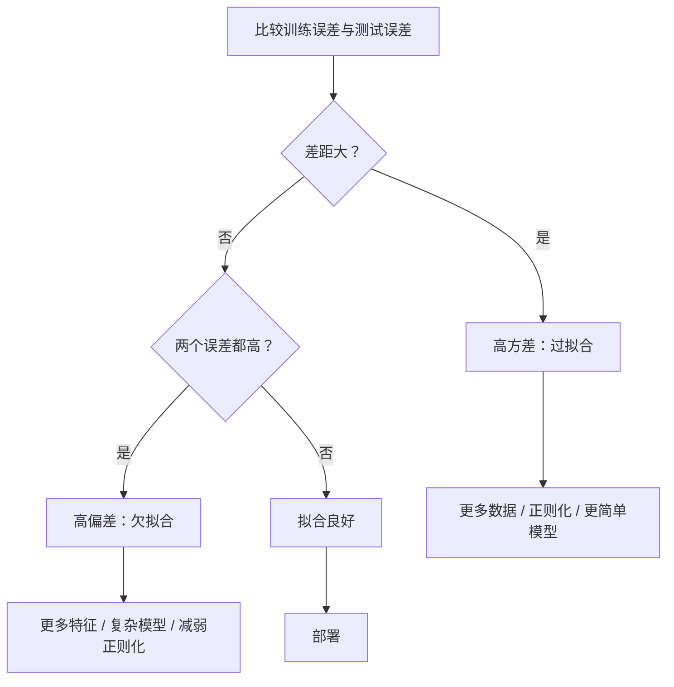
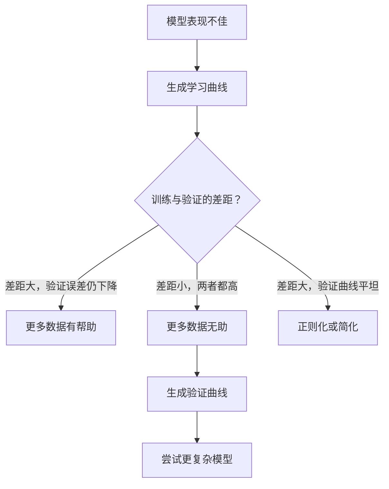

# 偏差与方差的权衡（Bias-Variance Tradeoff）

> 模型误差来自三种来源：偏差、方差或噪声。你只能控制前两种。

**Type:** Learn
**Language:** Python
**Prerequisites:** 阶段 2 第 01–09 课（机器学习基础、回归、分类、评估）
**Time:** ~75 分钟

## 学习目标（Learning Objectives）

- 推导期望预测误差的偏差–方差分解，解释不可约噪声的作用
- 根据训练和测试误差模式，诊断模型是高偏差还是高方差
- 解释正则化技术（L1、L2、随机失活、早停）如何用偏差换取方差降低
- 实现实验，可视化复杂度逐渐增加的模型中的偏差–方差权衡

## 问题（The Problem）

你训练了一个模型，它在测试数据上有一定误差。误差来自哪里？

模型太简单时，例如对曲线数据使用线性回归，会持续错过真实模式，这就是偏差。模型太复杂时，例如对 15 个点拟合 20 次多项式，会完美拟合训练数据，却对新数据给出剧烈变化的预测，这就是方差。

模型容量固定时，无法同时最小化二者。降低偏差，方差会上升；降低方差，偏差会上升。理解这个权衡是机器学习中最有用的诊断技能：它告诉你该增加还是降低模型复杂度，该增加数据还是改进特征，该增强还是减弱正则化。

## 概念（The Concept）

### 偏差：系统性误差（Bias: Systematic Error）

偏差（Bias）衡量模型平均预测与真值相差多远。从同一分布抽取许多不同训练集，训练相同模型，再对预测取平均，偏差就是该平均值与真值之差。

高偏差意味着模型太僵硬，无法捕捉真实模式。用直线拟合抛物线，无论数据多少都无法贴合曲线，这就是欠拟合（Underfitting）。

```
高偏差（欠拟合）：
  模型总是给出大致相同的错误预测。
  训练误差：高
  测试误差：高
  两者差距：小
```

### 方差：对训练数据的敏感性（Variance: Sensitivity to Training Data）

方差（Variance）衡量在不同数据子集上训练时，预测变化多少。训练集的微小变化若导致模型大幅变化，方差就高。

高方差意味着模型拟合的是训练数据中的噪声，而非底层信号。20 次多项式会穿过每个训练点，却在点与点之间剧烈振荡，这就是过拟合（Overfitting）。

```
高方差（过拟合）：
  模型完美拟合训练数据，却无法适用于新数据。
  训练误差：低
  测试误差：高
  两者差距：大
```

### 分解（The Decomposition）

对任意点 x，平方损失下的期望预测误差可以精确分解为：

```
Expected Error = Bias^2 + Variance + Irreducible Noise

where:
  Bias^2   = (E[f_hat(x)] - f(x))^2
  Variance = E[(f_hat(x) - E[f_hat(x)])^2]
  Noise    = E[(y - f(x))^2]             (sigma^2)
```

- `f(x)` 是真实函数
- `f_hat(x)` 是模型预测
- `E[...]` 是对不同训练集取期望
- `y` 是观测标签，即真实函数加噪声

噪声项不可约。在含噪数据上，任何模型都无法优于 sigma^2。你的任务是在 bias^2 与 variance 之间找到合适平衡。

### 模型复杂度与误差（Model Complexity vs Error）


经典的 U 形曲线：

| 复杂度 | 偏差 | 方差 | 总误差 |
|-----------|------|----------|-------------|
| 过低 | 高 | 低 | 高，欠拟合 |
| 合适 | 中等 | 中等 | 最低 |
| 过高 | 低 | 高 | 高，过拟合 |

### 用正则化控制偏差与方差（Regularization as Bias-Variance Control）

正则化（Regularization）有意增加偏差来降低方差，约束模型，使其无法追逐噪声。

- **L2（岭回归，Ridge）：**将所有权重向零收缩，保留全部特征但减弱影响。
- **L1（Lasso）：**将部分权重压到恰好为零，进行特征选择。
- **随机失活（Dropout）：**训练时随机禁用神经元，迫使模型形成冗余表示。
- **早停（Early Stopping）：**在模型完全拟合训练数据前停止训练。

正则化强度（lambda、随机失活率、训练轮数）直接控制模型位于偏差–方差曲线何处。正则化越强，偏差越高，方差越低。

### 双下降：现代视角（Double Descent: The Modern Perspective）

经典理论认为：越过最佳平衡点后，增加复杂度总会有害。但 2019 年以来的研究发现意外现象：如果继续增加模型容量，远超插值阈值（Interpolation Threshold，即参数已足以完美拟合训练数据的位置），测试误差可能再次下降。


这种“双下降（Double Descent）”现象解释了为什么严重过参数化（Overparameterized）的神经网络，即参数远多于训练样本，仍能良好泛化。经典偏差–方差权衡并非错误，但对现代情形而言并不完整。

关于双下降的关键观察：
- 在线性模型、决策树和神经网络中都会发生
- 插值区域中，更多数据反而可能有害，即样本维度双下降（Sample-wise Double Descent）
- 更多训练轮次也可能引发，即轮次维度双下降（Epoch-wise Double Descent）
- 正则化能平滑峰值，但不能消除它

为什么会这样？在插值阈值处，模型容量刚好足以拟合全部训练点，被迫选择一条穿过每个点的特定解。数据的微小扰动就会引起拟合大幅变化，方差在此达到峰值。越过阈值后，模型有许多可完美拟合数据的解。学习算法，例如带隐式正则化（Implicit Regularization）的梯度下降，倾向于选择最简单的解。这种偏向简单解的隐式偏好解释了过参数化模型为何能泛化。

| 区域 | 参数数与样本数 | 行为 |
|--------|----------------------|----------|
| 欠参数化（Underparameterized） | p << n | 经典权衡适用 |
| 插值阈值 | p ~ n | 方差达峰，测试误差突增 |
| 过参数化（Overparameterized） | p >> n | 隐式正则化起作用，测试误差下降 |

实践上，使用神经网络或大型树集成时，不要停在插值阈值。要么借助显式正则化远低于阈值，要么远远越过阈值。恰好处于阈值是最糟的位置。

### 诊断模型（Diagnosing Your Model）



| 症状 | 诊断 | 修复 |
|---------|-----------|-----|
| 训练误差高，测试误差高 | 偏差 | 更多特征、复杂模型、减弱正则化 |
| 训练误差低，测试误差高 | 方差 | 更多数据、正则化、更简单模型、随机失活 |
| 训练误差低，测试误差低 | 拟合良好 | 交付 |
| 训练误差下降，测试误差上升 | 正在过拟合 | 早停 |

### 实用策略（Practical Strategies）

**问题是偏差时：**
- 添加多项式或交互特征
- 使用更灵活的模型，如用树集成替代线性模型
- 降低正则化强度
- 尚未收敛时延长训练

**问题是方差时：**
- 获取更多训练数据
- 使用自助聚合（Bagging），如随机森林
- 增强正则化，提高 lambda、增加随机失活
- 特征选择，移除噪声特征
- 用交叉验证及早发现问题

### 集成方法与方差降低（Ensemble Methods and Variance Reduction）

集成方法（Ensemble Methods）是对抗方差最实用的工具。

**自助聚合（Bootstrap Aggregating，Bagging）**在训练数据的不同自助样本上训练多个模型，再对预测取平均。各个模型方差高，但平均后的方差低得多。随机森林就是将自助聚合应用于决策树。

数学原因是：对 N 个方差均为 sigma^2 的独立预测取平均，平均值的方差为 sigma^2 / N。模型并非真正独立，因为它们见到相似数据，所以降幅达不到独立情形的 1/N 水平，但仍然显著。

**提升（Boosting）**通过顺序构建模型降低偏差，每个新模型关注当前集成的错误。梯度提升（Gradient Boosting）和 AdaBoost 是主要例子。加入模型过多时，提升也会过拟合，因此需要早停或正则化。

| 方法 | 主要效果 | 偏差变化 | 方差变化 |
|--------|---------------|-------------|-----------------|
| 自助聚合（Bagging） | 降低方差 | 不变 | 降低 |
| 提升（Boosting） | 降低偏差 | 降低 | 可能增加 |
| 堆叠（Stacking） | 二者都降低 | 取决于元学习器 | 取决于基模型 |
| 随机失活（Dropout） | 隐式自助聚合 | 略增 | 降低 |

**实用规则：**基模型方差高时，如深树、高次多项式，用自助聚合；基模型偏差高时，如浅树桩、简单线性模型，用提升。

### 学习曲线（Learning Curves）

学习曲线绘制训练、验证误差随训练集大小的变化，是最实用的诊断工具。不同于单次训练/测试比较，学习曲线展示模型的变化趋势，告诉你更多数据是否有帮助。


如何解读：

| 场景 | 训练误差 | 验证误差 | 差距 | 含义 | 行动 |
|----------|---------------|-----------------|-----|---------------|------------|
| 高偏差 | 高 | 高 | 小 | 模型无法捕捉模式 | 更多特征、复杂模型、减弱正则化 |
| 高方差 | 低 | 高 | 大 | 模型记住训练数据 | 更多数据、正则化、更简单模型 |
| 拟合良好 | 中等 | 中等 | 小 | 泛化良好 | 交付 |
| 高方差，正在改善 | 低 | 随数据增加而降低 | 缩小 | 数据能解决的方差问题 | 收集更多数据 |
| 高偏差，曲线平坦 | 高 | 高且平坦 | 小且不变 | 更多数据无助 | 改变模型架构 |

关键是：两条曲线都已平台化、差距小但误差都高时，更多数据无用，需要更好的模型。如果差距很大且仍在缩小，更多数据就有帮助。

### 如何生成学习曲线（How to Generate Learning Curves）

有两种方法：

**方法 1：固定模型，改变训练集大小。**保持模型和超参数不变，在越来越大的训练子集上训练，测量各大小下的训练和验证误差。这是标准学习曲线。

**方法 2：固定数据，改变模型复杂度。**保持数据不变，遍历复杂度参数，如多项式次数、树深、层数，测量各复杂度下的训练和验证误差。这是验证曲线（Validation Curve），直接展示偏差–方差权衡。

两种方法互补。第一种告诉你更多数据是否有用，第二种告诉你换模型是否有用。决定下一步之前，应都运行一遍。



```figure
bias-variance
```

## 动手实现（Build It）

`code/bias_variance.py` 运行完整的偏差–方差分解实验。下面逐步说明方法。

### 第 1 步：从已知函数生成合成数据（Generate Synthetic Data from a Known Function）

使用 `f(x) = sin(1.5x) + 0.5x` 加高斯噪声。已知真实函数后，就能精确计算偏差和方差。

```python
def true_function(x):
    return np.sin(1.5 * x) + 0.5 * x

def generate_data(n_samples=30, noise_std=0.5, x_range=(-3, 3), seed=None):
    rng = np.random.RandomState(seed)
    x = rng.uniform(x_range[0], x_range[1], n_samples)
    y = true_function(x) + rng.normal(0, noise_std, n_samples)
    return x, y
```

### 第 2 步：自助采样与多项式拟合（Bootstrap Sampling and Polynomial Fitting）

对每个多项式次数，抽取许多自助训练集，拟合多项式，并记录固定测试网格上的预测，从而得到每个测试点的预测分布。

```python
def fit_polynomial(x_train, y_train, degree, lam=0.0):
    X = np.column_stack([x_train ** d for d in range(degree + 1)])
    if lam > 0:
        penalty = lam * np.eye(X.shape[1])
        penalty[0, 0] = 0
        w = np.linalg.solve(X.T @ X + penalty, X.T @ y_train)
    else:
        w = np.linalg.lstsq(X, y_train, rcond=None)[0]
    return w
```

在 200 个不同自助样本上拟合。每个样本来自相同底层分布，但包含不同的点。

### 第 3 步：计算偏差平方与方差分解（Computing Bias^2, Variance Decomposition）

每个测试点都有 200 组预测，可以直接按定义计算分解：

```python
mean_pred = predictions.mean(axis=0)
bias_sq = np.mean((mean_pred - y_true) ** 2)
variance = np.mean(predictions.var(axis=0))
total_error = np.mean(np.mean((predictions - y_true) ** 2, axis=1))
```

- `mean_pred` 是从自助样本估计的 E[f_hat(x)]
- `bias_sq` 是平均预测与真值差距的平方
- `variance` 是跨自助样本预测离散程度的平均值
- `total_error` 应近似等于 bias^2 + variance + noise

### 第 4 步：学习曲线（Learning Curves）

学习曲线固定模型复杂度，遍历训练集大小，展示模型受数据量限制还是受容量限制。

```python
def demo_learning_curves():
    sizes = [10, 15, 20, 30, 50, 75, 100, 150, 200, 300]
    degree = 5

    for n in sizes:
        train_errors = []
        test_errors = []
        for seed in range(50):
            x_train, y_train = generate_data(n_samples=n, seed=seed * 100)
            w = fit_polynomial(x_train, y_train, degree)
            train_pred = predict_polynomial(x_train, w)
            train_mse = np.mean((train_pred - y_train) ** 2)
            test_pred = predict_polynomial(x_test, w)
            test_mse = np.mean((test_pred - y_test) ** 2)
            train_errors.append(train_mse)
            test_errors.append(test_mse)
        # Average over runs gives the learning curve point
```

对于高方差模型，例如小数据上的 5 次多项式，可以看到：
- 训练误差起初低，随着数据增多、记忆变难而上升
- 测试误差起初高，随着模型获得更多信号而下降
- 数据增多时差距缩小

对于高偏差模型（1 次多项式），两种误差迅速收敛到相同高值，更多数据无助。

### 第 5 步：遍历正则化强度（Regularization Sweep）

代码还包含 `demo_regularization_sweep()`，固定使用高次多项式（15 次），将 Ridge 正则化强度从 0.001 遍历到 100。这从另一个角度展示偏差–方差权衡：改变约束强度，而不是模型复杂度。

```python
def demo_regularization_sweep():
    alphas = [0.001, 0.005, 0.01, 0.05, 0.1, 0.5, 1.0, 5.0, 10.0, 50.0, 100.0]
    for alpha in alphas:
        results = bias_variance_decomposition([15], lam=alpha)
        r = results[15]
        print(f"alpha={alpha:.3f}  bias={r['bias_sq']:.4f}  var={r['variance']:.4f}")
```

alpha 小时，15 次多项式几乎不受约束。模型追逐各自助样本中的噪声，方差占主导。alpha 大时，惩罚很强，模型实际上成为近似常数函数，偏差占主导。最优 alpha 位于两种极端之间。

这与改变多项式次数得到的是同一条 U 形曲线，但控制量从离散变为连续。实践中优先用正则化控制该权衡，因为它无须改变特征集，就能进行细粒度调整。

## 实际应用（Use It）

sklearn 提供 `learning_curve` 和 `validation_curve`，无须编写自助采样循环即可自动进行这些诊断。

### 验证曲线：遍历模型复杂度（Validation Curve: Sweep Model Complexity）

```python
from sklearn.model_selection import validation_curve
from sklearn.pipeline import make_pipeline
from sklearn.preprocessing import PolynomialFeatures
from sklearn.linear_model import Ridge

degrees = list(range(1, 16))
train_scores_all = []
val_scores_all = []

for d in degrees:
    pipe = make_pipeline(PolynomialFeatures(d), Ridge(alpha=0.01))
    train_scores, val_scores = validation_curve(
        pipe, X, y, param_name="polynomialfeatures__degree",
        param_range=[d], cv=5, scoring="neg_mean_squared_error"
    )
    train_scores_all.append(-train_scores.mean())
    val_scores_all.append(-val_scores.mean())
```

这直接给出偏差–方差权衡曲线。验证分数相对训练分数最差处，方差占主导；两者都差处，偏差占主导。

### 学习曲线：遍历训练集大小（Learning Curve: Sweep Training Set Size）

```python
from sklearn.model_selection import learning_curve

pipe = make_pipeline(PolynomialFeatures(5), Ridge(alpha=0.01))
train_sizes, train_scores, val_scores = learning_curve(
    pipe, X, y, train_sizes=np.linspace(0.1, 1.0, 10),
    cv=5, scoring="neg_mean_squared_error"
)
train_mse = -train_scores.mean(axis=1)
val_mse = -val_scores.mean(axis=1)
```

绘制 `train_mse`、`val_mse` 随 `train_sizes` 变化的曲线，其形状揭示模型状况。

### 结合正则化遍历的交叉验证（Cross-Validation with Regularization Sweep）

```python
from sklearn.model_selection import cross_val_score

alphas = [0.001, 0.01, 0.1, 1.0, 10.0, 100.0]
for alpha in alphas:
    pipe = make_pipeline(PolynomialFeatures(10), Ridge(alpha=alpha))
    scores = cross_val_score(pipe, X, y, cv=5, scoring="neg_mean_squared_error")
    print(f"alpha={alpha:>7.3f}  MSE={-scores.mean():.4f} +/- {scores.std():.4f}")
```

这固定模型复杂度，遍历正则化强度。你会看到同样的偏差–方差权衡：alpha 低意味着方差高，alpha 高意味着偏差高。

### 综合应用：完整诊断工作流（Putting It All Together: A Complete Diagnostic Workflow）

实践中，按顺序运行这些诊断：

1. 训练模型，计算训练误差和测试误差。
2. 两者都高：存在偏差问题，跳到第 4 步。
3. 训练低、测试高：存在方差问题。生成学习曲线，判断更多数据是否有用；若无用，就正则化。
4. 遍历主要复杂度参数生成验证曲线，找到最佳平衡点。
5. 在该点生成学习曲线。如果差距仍大，需要更多数据或正则化。
6. 使用 `cross_val_score` 尝试不同 alpha 的 Ridge/Lasso，选择交叉验证误差最低的 alpha。

对大多数表格数据集，这需要 10–15 分钟计算，却能省去数小时猜测。

## 交付成果（Ship It）

本课产出：`outputs/prompt-model-diagnostics.md`

## 练习（Exercises）

1. 用 `noise_std=0`（无噪声）运行分解。不可约误差项会怎样？最佳复杂度会变吗？

2. 将训练集从 30 增至 300。方差分量受何影响？最佳多项式次数是否移动？

3. 在实验中加入 L2 正则化（岭回归）。固定高次多项式（15 次），将 lambda 从 0 遍历到 100，绘制 bias^2 和 variance 随 lambda 变化的曲线。

4. 将真实函数从多项式改为 `sin(x)`。偏差–方差分解如何变化？是否仍有明确的最佳次数？

5. 实现简单的自助聚合包装器：在自助样本上训练 10 个模型并平均预测，展示它如何降低方差而不大幅增加偏差。

## 关键术语（Key Terms）

| 术语 | 常见说法 | 实际含义 |
|------|----------------|----------------------|
| 偏差（Bias） | “模型太简单” | 错误假设产生的系统性误差，即模型平均预测与真值之差。 |
| 方差（Variance） | “模型过拟合” | 对训练数据敏感而产生的误差，即不同训练集之间预测的变化程度。 |
| 不可约误差（Irreducible Error） | “数据中的噪声” | 真实数据生成过程的随机性所带来的误差，任何模型都无法消除。 |
| 欠拟合（Underfitting） | “学得不够” | 模型偏差高，甚至在训练数据上也错过真实模式。 |
| 过拟合（Overfitting） | “记住数据” | 模型方差高，拟合训练数据中不能泛化的噪声。 |
| 正则化（Regularization） | “约束模型” | 加入惩罚降低模型复杂度，用增加偏差换取降低方差。 |
| 双下降（Double Descent） | “更多参数可能有用” | 模型容量远超插值阈值后，测试误差再次下降。 |
| 模型复杂度（Model Complexity） | “模型有多灵活” | 模型拟合任意模式的容量，由架构、特征或正则化控制。 |

## 延伸阅读（Further Reading）

- [Hastie、Tibshirani、Friedman：统计学习基础（Elements of Statistical Learning）第 7 章](https://hastie.su.domains/ElemStatLearn/)：偏差–方差分解的权威论述
- [Belkin 等：调和现代机器学习实践与偏差–方差权衡（Reconciling modern machine learning practice and the bias-variance trade-off，2019）](https://arxiv.org/abs/1812.11118)：双下降论文
- [Nakkiran 等：深度双下降（Deep Double Descent，2019）](https://arxiv.org/abs/1912.02292)：轮次维度及样本维度双下降
- [Scott Fortmann-Roe：理解偏差–方差权衡（Understanding the Bias-Variance Tradeoff）](http://scott.fortmann-roe.com/docs/BiasVariance.html)：清晰的可视化解释
