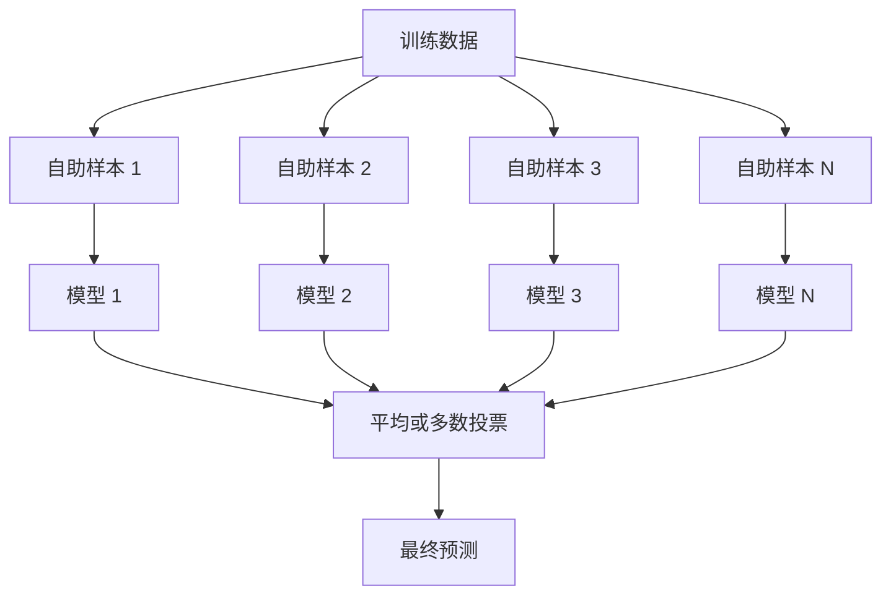
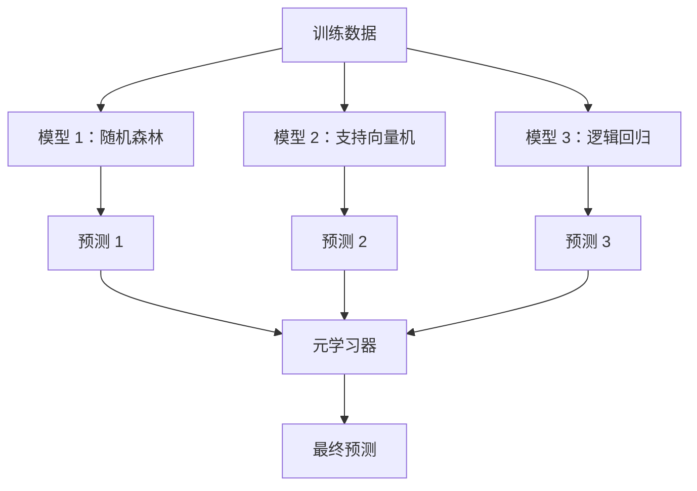

# 集成方法（Ensemble Methods）

> 一组弱学习器（Weak Learners）经过正确组合，可以成为强学习器（Strong Learner）。这不是比喻，而是一个定理。

**Type:** Build
**Language:** Python
**Prerequisites:** 第 2 阶段，第 10 课：偏差–方差权衡（Bias-Variance Tradeoff）
**Time:** 约 120 分钟

## 学习目标（Learning Objectives）

- 从零实现 AdaBoost 和梯度提升（Gradient Boosting），解释提升方法如何逐步降低偏差
- 构建装袋集成（Bagging Ensemble），展示对去相关模型求平均如何在不增加偏差的情况下降低方差
- 比较装袋（Bagging）、提升（Boosting）和堆叠（Stacking）各自针对的误差分量
- 评估集成多样性（Ensemble Diversity），解释增加独立弱学习器为何能提高多数投票的准确率

## 问题（The Problem）

单棵决策树（Decision Tree）训练快、易于解释，却会过拟合。单个线性模型在复杂边界上又会欠拟合。你可以花几天设计完美的模型架构，也可以把一组不完美的模型组合起来，得到比其中任何单个模型都更好的结果。

集成方法做的正是这件事。它们是赢得 Kaggle 表格数据竞赛最可靠的技术，支撑着大多数生产环境中的机器学习系统，也展示了偏差–方差权衡的实际作用。装袋降低方差，提升降低偏差，堆叠则学习面对不同输入时应该信任哪些模型。

## 核心概念（The Concept）

### 集成为何有效（Why Ensembles Work）

假设有 N 个独立分类器（Classifiers），每个的准确率为 p > 0.5。多数投票的准确率为：

```
P(majority correct) = sum over k > N/2 of C(N,k) * p^k * (1-p)^(N-k)
```

如果有 21 个准确率均为 60% 的分类器，多数投票的准确率约为 74%；增加到 101 个时，准确率升至 84%。当模型犯的错误不同时，错误会相互抵消。

关键要求是**多样性（Diversity）**。如果所有模型都犯同样的错误，组合它们就没有帮助。集成通过以下方式产生多样化模型，因而能够奏效：

- 使用不同的训练子集（装袋）
- 使用不同的特征子集（随机森林）
- 依次纠正错误（提升）
- 使用不同的模型家族（堆叠）

### 装袋：自助聚合（Bagging / Bootstrap Aggregating）

装袋通过让每个模型在训练数据的不同自助采样（Bootstrap Sample）上训练来创造多样性。



自助样本通过对原始数据进行有放回抽样得到，规模与原始数据相同。每次自助采样约包含 63.2% 的不同原始样本，剩余的 36.8% 称为袋外样本（Out-of-Bag Samples），可直接提供验证集。

装袋在不明显增加偏差的情况下降低方差。每棵树都会对自己的自助样本过拟合，但各棵树过拟合的方式不同，因此求平均能抵消噪声。

**随机森林（Random Forests）**在装袋的基础上增加了一步：每次分裂只考虑随机选取的特征子集。这会进一步增加树之间的多样性。候选特征数通常在分类中取 `sqrt(n_features)`，在回归中取 `n_features / 3`。

### 提升：顺序纠错（Boosting / Sequential Error Correction）

提升按顺序训练模型，每个新模型都重点处理之前模型预测错误的样本。


提升降低偏差。每个新模型纠正当前集成的系统性错误。最终预测是所有模型的加权和，表现更好的模型获得更高权重。

代价是：轮数过多时，提升可能过拟合，因为它持续拟合更难的样本，而其中有些可能只是噪声。

### 自适应提升（AdaBoost）

自适应提升（AdaBoost / Adaptive Boosting）是第一个实用的提升算法。它适用于任意基学习器（Base Learner），通常使用决策树桩（Decision Stumps），即深度为 1 的树。

算法如下：

```
1. 初始化样本权重：对所有 i，w_i = 1/N

2. 对 t = 1 到 T：
   a. 在加权数据上训练弱学习器 h_t
   b. 计算加权误差：
      err_t = sum(w_i * I(h_t(x_i) != y_i)) / sum(w_i)
   c. 计算模型权重：
      alpha_t = 0.5 * ln((1 - err_t) / err_t)
   d. 更新样本权重：
      w_i = w_i * exp(-alpha_t * y_i * h_t(x_i))
   e. 归一化权重，使其总和为 1

3. 最终预测：H(x) = sign(sum(alpha_t * h_t(x)))
```

误差更低的模型获得更大的 alpha。误分类样本获得更高权重，让下一个模型重点关注它们。

### 梯度提升（Gradient Boosting）

梯度提升将提升方法推广到任意损失函数。它不对样本重新加权，而是让每个新模型拟合当前集成的残差（Residuals），即损失的负梯度。

```
1. 初始化：F_0(x) = argmin_c sum(L(y_i, c))

2. 对 t = 1 到 T：
   a. 计算伪残差（Pseudo-Residuals）：
      r_i = -dL(y_i, F_{t-1}(x_i)) / dF_{t-1}(x_i)
   b. 用树 h_t 拟合残差 r_i
   c. 寻找最优步长：
      gamma_t = argmin_gamma sum(L(y_i, F_{t-1}(x_i) + gamma * h_t(x_i)))
   d. 更新：
      F_t(x) = F_{t-1}(x) + learning_rate * gamma_t * h_t(x)

3. 最终预测：F_T(x)
```

对于平方误差损失，伪残差就是实际残差：`r_i = y_i - F_{t-1}(x_i)`。每棵树拟合的确实就是之前集成的误差。

学习率（Learning Rate），也称收缩率（Shrinkage），控制每棵树的贡献大小。较小的学习率需要更多树，但泛化效果更好。典型取值为 0.01 到 0.3。

### XGBoost：为何主导表格数据任务（Why It Dominates Tabular Data）

XGBoost（eXtreme Gradient Boosting）通过工程优化，使梯度提升运行更快、预测更准，并能抵抗过拟合：

- **正则化目标（Regularized Objective）：**对叶节点权重施加 L1 和 L2 惩罚，防止单棵树过于自信
- **二阶近似（Second-Order Approximation）：**同时使用损失的一阶和二阶导数，作出更好的分裂决策
- **稀疏感知分裂（Sparsity-Aware Splits）：**每次分裂都学习缺失数据的最佳去向，原生处理缺失值
- **列子采样（Column Subsampling）：**像随机森林一样，在每次分裂时采样特征以增加多样性
- **加权分位数摘要（Weighted Quantile Sketch）：**高效地为分布式数据中的连续特征寻找分裂点
- **缓存感知块结构（Cache-Aware Block Structure）：**针对 CPU 缓存行优化内存布局

对于表格数据，XGBoost（以及其后继者 LightGBM）持续优于神经网络，这种情况短期内不会改变。如果你的数据可以组织成有行有列的表格，就从梯度提升开始。

### 堆叠：元学习（Stacking / Meta-Learning）

堆叠将多个基模型的预测作为元学习器（Meta-Learner）的特征。



元学习器学习对哪些输入应信任哪个基模型。如果随机森林在某些区域更好，而支持向量机（SVM）在其他区域更好，元学习器就会学会相应地分配信任。

为避免数据泄漏（Data Leakage），必须通过训练集上的交叉验证生成基模型预测。绝不能用同一批数据训练基模型，又用这些数据生成元特征（Meta-Features）。

### 投票（Voting）

这是最简单的集成，直接组合预测即可。

- **硬投票（Hard Voting）：**对类别标签进行多数投票。
- **软投票（Soft Voting）：**对预测概率求平均，选择平均概率最高的类别。它利用了置信度信息，因此通常更好。

```figure
f3-ensemble-average
```

## 动手实现（Build It）

### 第 1 步：决策树桩，基学习器（Decision Stump / Base Learner）

`code/ensembles.py` 中的代码从零实现所有内容。我们先从决策树桩开始：一棵只进行一次分裂的树。

```python
class DecisionStump:
    def __init__(self):
        self.feature_idx = None
        self.threshold = None
        self.polarity = 1
        self.alpha = None

    def fit(self, X, y, weights):
        n_samples, n_features = X.shape
        best_error = float("inf")

        for f in range(n_features):
            thresholds = np.unique(X[:, f])
            for thresh in thresholds:
                for polarity in [1, -1]:
                    pred = np.ones(n_samples)
                    pred[polarity * X[:, f] < polarity * thresh] = -1
                    error = np.sum(weights[pred != y])
                    if error < best_error:
                        best_error = error
                        self.feature_idx = f
                        self.threshold = thresh
                        self.polarity = polarity

    def predict(self, X):
        n = X.shape[0]
        pred = np.ones(n)
        idx = self.polarity * X[:, self.feature_idx] < self.polarity * self.threshold
        pred[idx] = -1
        return pred
```

### 第 2 步：从零实现 AdaBoost（AdaBoost from Scratch）

```python
class AdaBoostScratch:
    def __init__(self, n_estimators=50):
        self.n_estimators = n_estimators
        self.stumps = []
        self.alphas = []

    def fit(self, X, y):
        n = X.shape[0]
        weights = np.full(n, 1 / n)

        for _ in range(self.n_estimators):
            stump = DecisionStump()
            stump.fit(X, y, weights)
            pred = stump.predict(X)

            err = np.sum(weights[pred != y])
            err = np.clip(err, 1e-10, 1 - 1e-10)

            alpha = 0.5 * np.log((1 - err) / err)
            weights *= np.exp(-alpha * y * pred)
            weights /= weights.sum()

            stump.alpha = alpha
            self.stumps.append(stump)
            self.alphas.append(alpha)

    def predict(self, X):
        total = sum(a * s.predict(X) for a, s in zip(self.alphas, self.stumps))
        return np.sign(total)
```

### 第 3 步：从零实现梯度提升（Gradient Boosting from Scratch）

```python
class GradientBoostingScratch:
    def __init__(self, n_estimators=100, learning_rate=0.1, max_depth=3):
        self.n_estimators = n_estimators
        self.lr = learning_rate
        self.max_depth = max_depth
        self.trees = []
        self.initial_pred = None

    def fit(self, X, y):
        self.initial_pred = np.mean(y)
        current_pred = np.full(len(y), self.initial_pred)

        for _ in range(self.n_estimators):
            residuals = y - current_pred
            tree = SimpleRegressionTree(max_depth=self.max_depth)
            tree.fit(X, residuals)
            update = tree.predict(X)
            current_pred += self.lr * update
            self.trees.append(tree)

    def predict(self, X):
        pred = np.full(X.shape[0], self.initial_pred)
        for tree in self.trees:
            pred += self.lr * tree.predict(X)
        return pred
```

### 第 4 步：与 sklearn 比较（Compare against sklearn）

代码验证我们的从零实现与 sklearn 的 `AdaBoostClassifier` 和 `GradientBoostingClassifier` 具有相近准确率，并对所有方法进行并列比较。

## 实际应用（Use It）

### 各方法的适用时机（When to Use Each Method）

| 方法 | 降低的误差 | 最适合 | 注意事项 |
|--------|---------|----------|---------------|
| 装袋 / 随机森林（Bagging / Random Forest） | 方差 | 噪声数据、特征较多 | 无法改善偏差 |
| AdaBoost | 偏差 | 干净数据、简单基学习器 | 对离群点和噪声敏感 |
| 梯度提升（Gradient Boosting） | 偏差 | 表格数据、竞赛 | 训练慢，不调参容易过拟合 |
| XGBoost / LightGBM | 两者 | 生产环境中的表格机器学习 | 超参数较多 |
| 堆叠（Stacking） | 两者 | 争取最后 1–2% 的准确率提升 | 复杂，元学习器可能过拟合 |
| 投票（Voting） | 方差 | 快速组合多样化模型 | 只有模型具有多样性时才有效 |

### 表格数据的生产技术组合（The Production Stack for Tabular Data）

对于大多数表格预测问题，按以下顺序尝试：

1. 使用默认参数的 **LightGBM 或 XGBoost**
2. 调整 n_estimators、learning_rate、max_depth、min_child_weight
3. 如果需要再争取最后 0.5% 的提升，使用 3–5 个多样化模型构建堆叠集成
4. 全程使用交叉验证

尽管相关研究持续尝试，神经网络在表格数据上几乎总是逊于梯度提升。TabNet、NODE 及类似架构偶尔能追平，但很少超过经过充分调参的 XGBoost。

## 交付成果（Ship It）

本课产出 `outputs/prompt-ensemble-selector.md`，其中的提示词帮助你为给定数据集选择合适的集成方法。描述你的数据（规模、特征类型、噪声水平、类别平衡情况）以及要解决的问题。提示词会逐项执行决策清单、推荐方法、建议初始超参数，并提醒该方法的常见错误。本课还产出包含完整选择指南的 `outputs/skill-ensemble-builder.md`。

## 练习（Exercises）

1. 修改 AdaBoost 实现，记录每轮后的训练准确率。绘制准确率随估计器数量变化的曲线。它何时收敛？

2. 为回归树加入随机特征子采样，从零实现随机森林。设置 `max_features=sqrt(n_features)` 训练 100 棵树，并对预测求平均。与单棵树比较方差降低的程度。

3. 在梯度提升实现中加入早停（Early Stopping）：记录每轮后的验证损失，连续 10 轮没有改善就停止。实际需要多少棵树？

4. 使用三个基模型（逻辑回归、决策树、k 近邻）和一个逻辑回归元学习器构建堆叠集成。通过 5 折交叉验证生成元特征，与各个基模型单独使用时进行比较。

5. 在同一数据集上使用默认参数运行 XGBoost，将准确率与你从零实现的梯度提升比较。记录两者耗时，速度差距有多大？

## 关键术语（Key Terms）

| 术语 | 常见说法 | 实际含义 |
|------|----------------|----------------------|
| 装袋（Bagging） | “在随机子集上训练” | 自助聚合：在自助样本上训练模型，通过预测平均降低方差 |
| 提升（Boosting） | “关注难样本” | 顺序训练模型，让每个模型纠正当前集成的错误，以降低偏差 |
| 自适应提升（AdaBoost） | “重新加权数据” | 通过更新样本权重进行提升；给误分类点更高权重，供下一个学习器使用 |
| 梯度提升（Gradient Boosting） | “拟合残差” | 让每个新模型拟合损失函数的负梯度，实现提升 |
| XGBoost | “Kaggle 利器” | 结合正则化、二阶优化和系统级加速技巧的梯度提升 |
| 堆叠（Stacking） | “模型之上再放模型” | 将基模型的预测作为元学习器的输入特征 |
| 随机森林（Random Forest） | “许多随机化的树” | 对决策树进行装袋，并在每次分裂时随机采样特征，以增加多样性 |
| 集成多样性（Ensemble Diversity） | “犯不同的错误” | 模型错误之间必须不相关，集成才有可能优于单个模型 |
| 袋外误差（Out-of-Bag Error） | “免费的验证” | 将未被自助采样抽中的样本（约 36.8%）作为验证集，无须另留数据 |

## 延伸阅读（Further Reading）

- [Schapire 与 Freund：提升方法：基础与算法（Boosting: Foundations and Algorithms）](https://mitpress.mit.edu/9780262526036/)：AdaBoost 创始人编写的书
- [Friedman：贪心函数逼近：梯度提升机（Greedy Function Approximation: A Gradient Boosting Machine，2001）](https://doi.org/10.1214/aos/1013203451)：梯度提升的原始论文
- [Chen 与 Guestrin：XGBoost（2016）](https://arxiv.org/abs/1603.02754)：XGBoost 论文
- [Wolpert：堆叠泛化（Stacked Generalization，1992）](https://www.sciencedirect.com/science/article/abs/pii/S0893608005800231)：堆叠的原始论文
- [scikit-learn 集成方法（Ensemble Methods）](https://scikit-learn.org/stable/modules/ensemble.html)：实践参考
