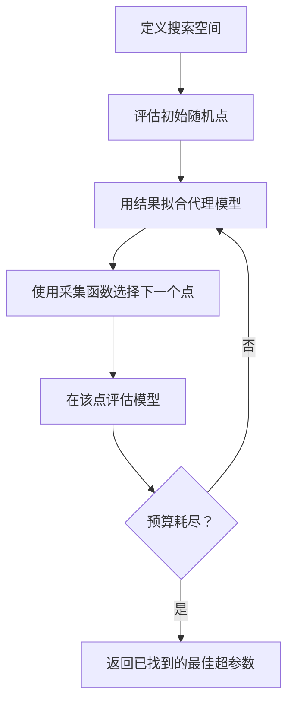
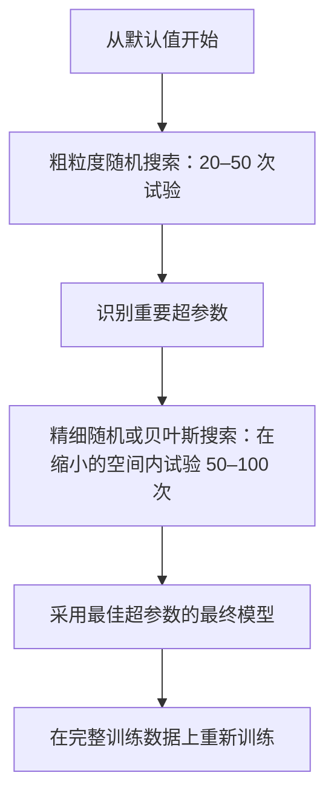
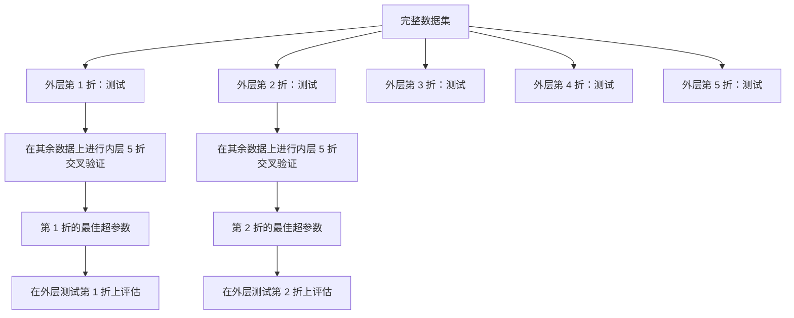

# 超参数调优（Hyperparameter Tuning）

> 超参数是在训练开始前调节的旋钮。调得好不好，决定了模型是平庸还是出色。

**Type:** Build
**Language:** Python
**Prerequisites:** 第 2 阶段，第 11 课：集成方法（Ensemble Methods）
**Time:** 约 90 分钟

## 学习目标（Learning Objectives）

- 从零实现网格搜索（Grid Search）、随机搜索（Random Search）和贝叶斯优化（Bayesian Optimization），比较它们的样本效率
- 解释当超参数的有效维度较低时，随机搜索为何优于网格搜索
- 使用代理模型（Surrogate Model）和采集函数（Acquisition Function）构建引导搜索的贝叶斯优化循环
- 设计超参数调优策略，通过适当的交叉验证避免对验证集过拟合

## 问题（The Problem）

你的梯度提升模型包含学习率、树的数量、最大深度、每个叶节点的最小样本数、子采样比例和列采样比例，共六个超参数。如果每个都有 5 个合理取值，网格就包含 5^6 = 15,625 种组合。每次训练耗时 10 秒，全部尝试需要 43 小时计算时间。

网格搜索是最直观的方法，却也是规模扩大后最差的方法。随机搜索用更少计算取得更好结果，贝叶斯优化则通过学习过去的评估结果进一步改进。知道该选哪种策略、哪些超参数真正重要，可以省下数天被浪费的 GPU 时间。

## 核心概念（The Concept）

### 参数与超参数（Parameters vs Hyperparameters）

参数（Parameters）在训练中学习得到，例如权重、偏置和分裂阈值。超参数（Hyperparameters）在训练开始前设定，控制学习如何进行。

| 超参数 | 控制什么 | 典型范围 |
|---------------|-----------------|---------------|
| 学习率（Learning Rate） | 每次更新的步长 | 0.001 到 1.0 |
| 树的数量 / 训练轮数（Epochs） | 训练多久 | 10 到 10,000 |
| 最大深度（Max Depth） | 模型复杂度 | 1 到 30 |
| 正则化（Regularization，lambda） | 防止过拟合 | 0.0001 到 100 |
| 批大小（Batch Size） | 梯度估计噪声 | 16 到 512 |
| 丢弃率（Dropout Rate） | 丢弃的神经元比例 | 0.0 到 0.5 |

### 网格搜索（Grid Search）

网格搜索评估指定取值的每一种组合。它穷尽所有情况，易于理解，但开销随超参数数量呈指数增长。

```
两个超参数的网格：

  learning_rate: [0.01, 0.1, 1.0]
  max_depth:     [3, 5, 7]

  评估次数：3 x 3 = 9 种组合

  (0.01, 3)  (0.01, 5)  (0.01, 7)
  (0.1,  3)  (0.1,  5)  (0.1,  7)
  (1.0,  3)  (1.0,  5)  (1.0,  7)
```

网格搜索有一个根本缺陷：如果一个超参数重要，另一个不重要，大多数评估就浪费了。9 次评估只尝试了重要参数的 3 个不同值。

### 随机搜索（Random Search）

随机搜索从分布中采样超参数，而不是使用网格。在同样的 9 次评估预算下，每个超参数都能得到 9 个不同值。


随机搜索胜过网格搜索的原因（Bergstra 与 Bengio，2012）：

- 超参数通常具有较低的有效维度。对于给定问题，6 个超参数中通常只有 1–2 个真正重要。
- 网格搜索在不重要的维度上浪费评估。
- 在相同预算下，随机搜索能更密集地覆盖重要维度。
- 进行 60 次随机试验时，有 95% 的概率找到与最优值相差不超过 5% 的点，前提是搜索空间中存在这样的点。

### 贝叶斯优化（Bayesian Optimization）

随机搜索忽略结果。它不会学到高学习率导致发散，也不会学到深度 3 持续优于深度 10。贝叶斯优化利用过去的评估决定下一步在哪里搜索。



两个关键组成部分：

**代理模型（Surrogate Model）：**评估成本低的模型，通常是高斯过程（Gaussian Process），用来近似昂贵的目标函数。它能在搜索空间任意点给出预测和不确定性估计。

**采集函数（Acquisition Function）：**平衡利用（Exploitation，在已知好点附近搜索）与探索（Exploration，在高不确定性区域搜索），决定下一次评估位置。常见选择包括：

- **期望改进（Expected Improvement，EI）：**预计这个点相对于当前最佳结果能改善多少？
- **置信上界（Upper Confidence Bound，UCB）：**预测加上不确定性的某个倍数。较高的 UCB 表示该点有希望，或尚未充分探索。
- **改进概率（Probability of Improvement，PI）：**这个点超过当前最佳结果的概率是多少？

贝叶斯优化通常只需随机搜索 1/2 到 1/5 的评估次数，就能找到更好的超参数。与训练实际模型相比，拟合代理模型的开销可以忽略。

### 早停（Early Stopping）

不是每次训练都需要完成。如果一种配置在 10 轮后明显表现差，就停止它并继续尝试其他配置。这就是超参数搜索中的早停。

策略包括：
- **基于耐心值（Patience-Based）：**验证损失连续 N 轮未改善就停止
- **中位数剪枝（Median Pruning）：**某次试验的中间结果差于已完成试验在相同步骤上的中位数时停止
- **Hyperband：**给许多配置分配小预算，再逐步增加最佳配置的预算

Hyperband 尤其有效。它先让 81 种配置各训练 1 轮，保留最好的三分之一，给它们 3 轮预算，再保留最好的三分之一，依此类推。与让所有配置使用完整预算相比，找到好配置的速度可快 10–50 倍。

### 学习率调度器（Learning Rate Schedulers）

学习率几乎总是最重要的超参数。调度器在训练期间调整学习率，而不是保持固定。

| 调度器 | 公式 | 适用场景 |
|-----------|---------|-------------|
| 阶梯衰减（Step Decay） | 每 N 轮乘以 0.1 | 经典卷积神经网络（CNN）训练 |
| 余弦退火（Cosine Annealing） | lr * 0.5 * (1 + cos(pi * t / T)) | 现代默认方案 |
| 预热加衰减（Warmup + Decay） | 线性增大后进行余弦衰减 | Transformer |
| 单周期（One-Cycle） | 在一个周期内先增大后减小 | 快速收敛 |
| 平台期降率（Reduce on Plateau） | 指标停滞时按系数降低 | 稳妥的默认方案 |

### 超参数重要性（Hyperparameter Importance）

并非所有超参数都同样重要。对随机森林（Probst 等，2019）和梯度提升的研究显示出一致规律：

**高重要性：**
- 学习率（始终首先调整）
- 估计器数量 / 训练轮数（使用早停代替调参）
- 正则化强度

**中等重要性：**
- 最大深度 / 层数
- 每叶最小样本数 / 权重衰减（Weight Decay）
- 子采样比例

**低重要性：**
- 最大特征数（对随机森林而言）
- 具体激活函数的选择
- 批大小（在合理范围内）

先调重要参数，其余保留默认值。

### 实践策略（Practical Strategy）



具体流程：

1. **从库的默认值开始。**它们由有经验的实践者选择，通常已经完成了目标的 80%。
2. **粗粒度随机搜索。**使用宽范围，试验 20–50 次。利用早停迅速终止差的训练。
3. **分析结果。**哪些超参数与性能相关？缩小搜索空间。
4. **精细搜索。**在缩小后的空间内进行贝叶斯优化或有针对性的随机搜索，试验 50–100 次。
5. 使用找到的最佳超参数，**在全部训练数据上重新训练**。

### 整合交叉验证（Cross-Validation Integration）

在单次验证划分上调超参数存在风险，最佳超参数可能对该验证折过拟合。嵌套交叉验证（Nested Cross-Validation）通过两个循环解决这一问题：

- **外层循环**（评估）：将数据划分为训练加验证部分与测试部分，报告无偏性能。
- **内层循环**（调参）：将训练加验证部分进一步划分为训练与验证，寻找最佳超参数。



每个外层折独立寻找自己的最佳超参数。外层得分是泛化性能的无偏估计。

使用 sklearn：

```python
from sklearn.model_selection import cross_val_score, GridSearchCV
from sklearn.ensemble import GradientBoostingRegressor

inner_cv = GridSearchCV(
    GradientBoostingRegressor(),
    param_grid={
        "learning_rate": [0.01, 0.05, 0.1],
        "max_depth": [2, 3, 5],
        "n_estimators": [50, 100, 200],
    },
    cv=5,
    scoring="neg_mean_squared_error",
)

outer_scores = cross_val_score(
    inner_cv, X, y, cv=5, scoring="neg_mean_squared_error"
)

print(f"Nested CV MSE: {-outer_scores.mean():.4f} +/- {outer_scores.std():.4f}")
```

这样做成本高：5 个外层折 x 5 个内层折 x 27 个网格点 = 675 次模型拟合，但能得到可信的性能估计。在论文中报告最终结果，或决策影响重大时使用。

### 实践建议（Practical Tips）

**从学习率开始。**对基于梯度的方法，它始终是最重要的超参数。糟糕的学习率会让其他因素都失去意义。先将其他超参数固定为默认值，遍历学习率。

**学习率和正则化使用对数均匀分布（Log-Uniform Distributions）。**0.001 与 0.01 之间的差别和 0.1 与 1.0 之间同样重要。线性搜索会把预算浪费在大数值端。

**使用早停代替调整 n_estimators。**对提升和神经网络，将 n_estimators 或训练轮数设得较大，由早停决定何时停止。这能从搜索中移除一个超参数。

**预算分配。**将 60% 的调参预算用于最重要的两个超参数，其余 40% 用于其他参数。前两个参数解释了大部分性能变化。

**尺度很重要。**不要在对数尺度上搜索批大小（16、32、64 这样的取值可以）。学习率则始终使用对数尺度。让搜索分布匹配超参数影响模型的方式。

| 模型类型 | 最重要的超参数 | 推荐搜索方法 | 预算 |
|-----------|--------------------|--------------------|--------|
| 随机森林（Random Forest） | n_estimators, max_depth, min_samples_leaf | 随机搜索，50 次试验 | 低（训练快） |
| 梯度提升（Gradient Boosting） | learning_rate, n_estimators, max_depth | 贝叶斯优化，100 次试验加早停 | 中等 |
| 神经网络（Neural Network） | learning_rate, weight_decay, batch_size | 贝叶斯或随机搜索，100 次以上 | 高（训练慢） |
| 支持向量机（SVM） | C, gamma（径向基函数核，RBF Kernel） | 对数尺度网格搜索，25–50 次 | 低（2 个参数） |
| Lasso / 岭回归（Ridge） | alpha | 对数尺度一维搜索，20 次 | 很低 |
| XGBoost | learning_rate, max_depth, subsample, colsample | 贝叶斯优化，100–200 次试验加早停 | 中等 |

**不确定时：**使用随机搜索，试验次数至少为超参数数量的 2 倍，例如 6 个超参数至少试验 12 次。50 次随机搜索胜过精心设计的网格搜索的频率，会让你吃惊。

```figure
k-fold-cv
```

## 动手实现（Build It）

### 第 1 步：从零实现网格搜索（Grid Search from Scratch）

`code/tuning.py` 中的代码从零实现了网格搜索、随机搜索和一个简单的贝叶斯优化器。

```python
def grid_search(model_fn, param_grid, X_train, y_train, X_val, y_val):
    keys = list(param_grid.keys())
    values = list(param_grid.values())
    best_score = -float("inf")
    best_params = None
    n_evals = 0

    for combo in itertools.product(*values):
        params = dict(zip(keys, combo))
        model = model_fn(**params)
        model.fit(X_train, y_train)
        score = evaluate(model, X_val, y_val)
        n_evals += 1

        if score > best_score:
            best_score = score
            best_params = params

    return best_params, best_score, n_evals
```

### 第 2 步：从零实现随机搜索（Random Search from Scratch）

```python
def random_search(model_fn, param_distributions, X_train, y_train,
                  X_val, y_val, n_iter=50, seed=42):
    rng = np.random.RandomState(seed)
    best_score = -float("inf")
    best_params = None

    for _ in range(n_iter):
        params = {k: sample(v, rng) for k, v in param_distributions.items()}
        model = model_fn(**params)
        model.fit(X_train, y_train)
        score = evaluate(model, X_val, y_val)

        if score > best_score:
            best_score = score
            best_params = params

    return best_params, best_score, n_iter
```

### 第 3 步：简化版贝叶斯优化（Bayesian Optimization, Simplified）

核心思想是：对观测到的“超参数、得分”数据对拟合高斯过程，再通过采集函数决定下一步搜索位置。

```python
class SimpleBayesianOptimizer:
    def __init__(self, search_space, n_initial=5):
        self.search_space = search_space
        self.n_initial = n_initial
        self.X_observed = []
        self.y_observed = []

    def _kernel(self, x1, x2, length_scale=1.0):
        dists = np.sum((x1[:, None, :] - x2[None, :, :]) ** 2, axis=2)
        return np.exp(-0.5 * dists / length_scale ** 2)

    def _fit_gp(self, X_new):
        X_obs = np.array(self.X_observed)
        y_obs = np.array(self.y_observed)
        y_mean = y_obs.mean()
        y_centered = y_obs - y_mean

        K = self._kernel(X_obs, X_obs) + 1e-4 * np.eye(len(X_obs))
        K_star = self._kernel(X_new, X_obs)

        L = np.linalg.cholesky(K)
        alpha = np.linalg.solve(L.T, np.linalg.solve(L, y_centered))
        mu = K_star @ alpha + y_mean

        v = np.linalg.solve(L, K_star.T)
        var = 1.0 - np.sum(v ** 2, axis=0)
        var = np.maximum(var, 1e-6)

        return mu, var

    def _expected_improvement(self, mu, var, best_y):
        sigma = np.sqrt(var)
        z = (mu - best_y) / (sigma + 1e-10)
        ei = sigma * (z * norm_cdf(z) + norm_pdf(z))
        return ei

    def suggest(self):
        if len(self.X_observed) < self.n_initial:
            return sample_random(self.search_space)

        candidates = [sample_random(self.search_space) for _ in range(500)]
        X_cand = np.array([to_vector(c) for c in candidates])
        mu, var = self._fit_gp(X_cand)
        ei = self._expected_improvement(mu, var, max(self.y_observed))
        return candidates[np.argmax(ei)]

    def observe(self, params, score):
        self.X_observed.append(to_vector(params))
        self.y_observed.append(score)
```

高斯过程（GP）代理模型在每个候选点提供两项信息：预测得分（mu）和不确定性（var）。期望改进平衡两者，偏好预测得分高或者不确定性高的点。初期多数点不确定性高，优化器因此进行探索；后期则聚焦最有希望的区域。

### 第 4 步：比较所有方法（Compare All Methods）

在同一个合成目标上运行三种方法并比较。这里使用一个简化包装器，直接以目标函数调用各优化器，不训练模型，因此 API 与上面基于模型的实现不同：

```python
def synthetic_objective(params):
    lr = params["learning_rate"]
    depth = params["max_depth"]
    return -(np.log10(lr) + 2) ** 2 - (depth - 4) ** 2 + 10

param_grid = {
    "learning_rate": [0.001, 0.01, 0.1, 1.0],
    "max_depth": [2, 3, 4, 5, 6, 7, 8],
}

grid_best = None
grid_score = -float("inf")
grid_history = []
for combo in itertools.product(*param_grid.values()):
    params = dict(zip(param_grid.keys(), combo))
    score = synthetic_objective(params)
    grid_history.append((params, score))
    if score > grid_score:
        grid_score = score
        grid_best = params

param_dist = {
    "learning_rate": ("log_float", 0.001, 1.0),
    "max_depth": ("int", 2, 8),
}

rand_best = None
rand_score = -float("inf")
rand_history = []
rng = np.random.RandomState(42)
for _ in range(28):
    params = {k: sample(v, rng) for k, v in param_dist.items()}
    score = synthetic_objective(params)
    rand_history.append((params, score))
    if score > rand_score:
        rand_score = score
        rand_best = params

optimizer = SimpleBayesianOptimizer(param_dist, n_initial=5)
bayes_history = []
for _ in range(28):
    params = optimizer.suggest()
    score = synthetic_objective(params)
    optimizer.observe(params, score)
    bayes_history.append((params, score))
bayes_score = max(s for _, s in bayes_history)

print(f"{'Method':<20} {'Best Score':>12} {'Evaluations':>12}")
print("-" * 50)
print(f"{'Grid Search':<20} {grid_score:>12.4f} {len(grid_history):>12}")
print(f"{'Random Search':<20} {rand_score:>12.4f} {len(rand_history):>12}")
print(f"{'Bayesian Opt':<20} {bayes_score:>12.4f} {len(bayes_history):>12}")
```

在相同预算下，贝叶斯优化通常最快找到最佳得分，因为它不会在明显差的区域浪费评估。随机搜索比网格搜索覆盖更广。只有超参数很少且能够承担穷尽搜索时，网格搜索才会胜出。

## 实际应用（Use It）

### Optuna 实践（Optuna in Practice）

严肃的超参数调优推荐使用 Optuna。它开箱即用地支持剪枝、分布式搜索和可视化。

```python
import optuna

def objective(trial):
    lr = trial.suggest_float("learning_rate", 1e-4, 1e-1, log=True)
    n_est = trial.suggest_int("n_estimators", 50, 500)
    max_depth = trial.suggest_int("max_depth", 2, 10)

    model = GradientBoostingRegressor(
        learning_rate=lr,
        n_estimators=n_est,
        max_depth=max_depth,
    )
    model.fit(X_train, y_train)
    return mean_squared_error(y_val, model.predict(X_val))

study = optuna.create_study(direction="minimize")
study.optimize(objective, n_trials=100)

print(f"Best params: {study.best_params}")
print(f"Best MSE: {study.best_value:.4f}")
```

Optuna 的关键功能：
- `suggest_float(..., log=True)` 用于适合在对数尺度搜索的参数，如学习率和正则化
- `suggest_int` 用于整数参数
- `suggest_categorical` 用于离散选择
- 内置 MedianPruner，提前停止表现差的试验
- `study.trials_dataframe()` 用于分析

### 使用 Optuna 剪枝（Optuna with Pruning）

剪枝提前停止希望不大的试验，节省大量计算。使用模式如下：

```python
import optuna
from sklearn.model_selection import cross_val_score

def objective(trial):
    params = {
        "learning_rate": trial.suggest_float("lr", 1e-4, 0.5, log=True),
        "max_depth": trial.suggest_int("max_depth", 2, 10),
        "n_estimators": trial.suggest_int("n_estimators", 50, 500),
        "subsample": trial.suggest_float("subsample", 0.5, 1.0),
    }

    model = GradientBoostingRegressor(**params)
    scores = cross_val_score(model, X_train, y_train, cv=3,
                             scoring="neg_mean_squared_error")
    mean_score = -scores.mean()

    trial.report(mean_score, step=0)
    if trial.should_prune():
        raise optuna.TrialPruned()

    return mean_score

pruner = optuna.pruners.MedianPruner(n_startup_trials=10, n_warmup_steps=5)
study = optuna.create_study(direction="minimize", pruner=pruner)
study.optimize(objective, n_trials=200)
```

如果一次试验的中间值差于所有已完成试验在相同步骤上的中位数，`MedianPruner` 就会停止它。剪枝需要调用 `trial.report()` 报告中间指标，再调用 `trial.should_prune()` 检查是否应该停止试验。`n_startup_trials=10` 确保至少有 10 次试验完整结束后才开始剪枝。这通常可节省总计算量的 40–60%。

### sklearn 内置调优器（sklearn's Built-in Tuners）

为快速实验，sklearn 提供 `GridSearchCV`、`RandomizedSearchCV` 和 `HalvingRandomSearchCV`：

```python
from sklearn.model_selection import RandomizedSearchCV
from scipy.stats import loguniform, randint

param_dist = {
    "learning_rate": loguniform(1e-4, 0.5),
    "max_depth": randint(2, 10),
    "n_estimators": randint(50, 500),
}

search = RandomizedSearchCV(
    GradientBoostingRegressor(),
    param_dist,
    n_iter=100,
    cv=5,
    scoring="neg_mean_squared_error",
    random_state=42,
    n_jobs=-1,
)
search.fit(X_train, y_train)
print(f"Best params: {search.best_params_}")
print(f"Best CV MSE: {-search.best_score_:.4f}")
```

学习率和正则化使用 scipy 的 `loguniform`，整数超参数使用 `randint`。`n_jobs=-1` 标志会在所有 CPU 核心上并行运行。

### 超参数调优的常见错误（Common Mistakes in Hyperparameter Tuning）

**预处理造成数据泄漏。**如果在交叉验证前用完整数据集拟合缩放器，验证折的信息就泄漏进训练。始终把预处理放进 `Pipeline`，确保只在训练折上拟合。

**对验证集过拟合。**进行数千次试验实际上相当于在验证集上训练。最终性能估计应使用嵌套交叉验证，或单独留出一个调参期间从不接触的测试集。

**搜索范围太窄。**如果最佳值落在搜索空间边界，说明搜索不够宽，最优值可能在范围之外。始终检查最佳参数是否位于边缘。

**忽略交互效应。**在提升中，学习率与估计器数量存在强交互。低学习率需要更多估计器，分别调整的结果比联合调整更差。

**迭代模型不使用早停。**对于梯度提升和神经网络，将 n_estimators 或训练轮数设为较大值，再使用早停。这严格优于把迭代次数当作超参数来调整。

## 练习（Exercises）

1. 以相同总预算，例如 50 次评估，运行网格搜索和随机搜索，比较各自找到的最佳得分。使用不同随机种子重复实验 10 次。随机搜索获胜的频率是多少？

2. 从零实现 Hyperband。从 81 种配置开始，每种训练 1 轮，每轮保留最好的 1/3，并将其预算增至三倍。比较总计算量（所有配置训练轮数之和）与让 81 种配置都用完整预算时的计算量。

3. 为第 11 课的梯度提升实现加入学习率调度器（余弦退火）。与固定学习率相比是否有帮助？

4. 使用 Optuna 在真实数据集上调整 RandomForestClassifier，例如 sklearn 的乳腺癌数据集。通过 `optuna.visualization.plot_param_importances(study)` 查看哪些超参数最重要。与本课的重要性排序一致吗？

5. 实现一个简单采集函数（期望改进），展示探索与利用。绘制代理模型的均值和不确定性，并显示 EI 选择的下一次评估位置。

## 关键术语（Key Terms）

| 术语 | 常见说法 | 实际含义 |
|------|----------------|----------------------|
| 超参数（Hyperparameter） | “你选择的设置” | 训练前设定、控制学习过程的值，不从数据中学习 |
| 网格搜索（Grid Search） | “尝试所有组合” | 穷尽指定参数网格，成本呈指数增长 |
| 随机搜索（Random Search） | “随机采样就行” | 从分布采样超参数，比网格搜索更好地覆盖重要维度 |
| 贝叶斯优化（Bayesian Optimization） | “智能搜索” | 用目标函数的代理模型决定下一次评估位置，平衡探索与利用 |
| 代理模型（Surrogate Model） | “低成本近似” | 根据已有评估近似昂贵目标函数的模型，通常是高斯过程 |
| 采集函数（Acquisition Function） | “下一步看哪里” | 平衡期望改进与不确定性，为候选点评分；常用 EI 和 UCB |
| 早停（Early Stopping） | “别再浪费时间” | 验证性能停止改善时提前终止训练 |
| Hyperband | “配置的淘汰赛” | 自适应资源分配：让许多配置以小预算开始，保留最佳配置并增加预算 |
| 学习率调度器（Learning Rate Scheduler） | “训练中改变 lr” | 在训练期间调整学习率以改善收敛的函数 |

## 延伸阅读（Further Reading）

- [Bergstra 与 Bengio：超参数优化的随机搜索（Random Search for Hyper-Parameter Optimization，2012）](https://jmlr.org/papers/v13/bergstra12a.html)：证明随机搜索胜过网格搜索的论文
- [Snoek 等：机器学习算法的实用贝叶斯优化（Practical Bayesian Optimization of Machine Learning Algorithms，2012）](https://arxiv.org/abs/1206.2944)：面向机器学习的贝叶斯优化
- [Li 等：Hyperband：一种新型多臂老虎机方法（Hyperband: A Novel Bandit-Based Approach，2018）](https://jmlr.org/papers/v18/16-558.html)：Hyperband 论文
- [Optuna：下一代超参数优化框架（A Next-generation Hyperparameter Optimization Framework）](https://arxiv.org/abs/1907.10902)：Optuna 论文
- [Probst 等：可调性：超参数的重要性（Tunability: Importance of Hyperparameters，2019）](https://jmlr.org/papers/v20/18-444.html)：哪些超参数重要
