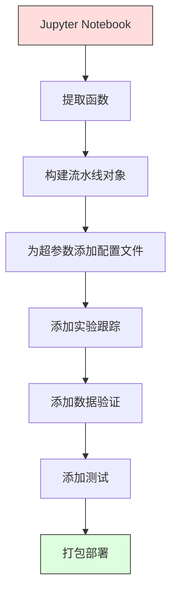

# 机器学习流水线（ML Pipelines）

> 模型不是产品，流水线才是。流水线涵盖从原始数据到部署预测的一切，每个步骤都必须可复现。

**Type:** Build
**Language:** Python
**Prerequisites:** 第 2 阶段，第 12 课：超参数调优（Hyperparameter Tuning）
**Time:** 约 120 分钟

## 学习目标（Learning Objectives）

- 从零构建机器学习流水线（ML Pipeline），将填补、缩放、编码和模型训练串联成单个可复现对象
- 识别数据泄漏场景，解释流水线如何通过仅在训练数据上拟合转换器来防止泄漏
- 构建 ColumnTransformer，为数值特征和类别特征应用不同预处理
- 实现流水线序列化，证明同一个已拟合流水线在训练和生产环境中会产生相同结果

## 问题（The Problem）

你有一个笔记本（Notebook），它加载数据、用中位数填补缺失值、缩放特征、训练模型并打印准确率。运行正常，于是你把它交付了。

一个月后，有人重新训练模型，却得到不同结果。中位数是用包含测试数据的完整数据集计算的，造成数据泄漏；缩放参数没有保存，推理时使用了不同统计量；特征工程代码在训练和服务代码间复制粘贴，随后两个副本出现分歧；生产环境的类别列还出现了编码器从未见过的新值。

这些不是假设，而是机器学习系统在生产中失败的最常见原因。流水线将每个转换步骤封装成单个、有序、可复现的对象，解决这些问题。

## 核心概念（The Concept）

### 什么是流水线（What a Pipeline Is）

流水线是一系列有序的数据转换，最后接一个模型。每步以上一步输出为输入，整条流水线在训练数据上拟合一次。推理时，同一个已拟合流水线转换新数据并生成预测。


流水线保证：
- 转换只在训练数据上拟合，不发生泄漏
- 推理时应用相同转换
- 整个对象可以序列化，作为单一制品部署
- 交叉验证在每一折内应用流水线，防止隐蔽的泄漏

### 数据泄漏：隐蔽的破坏者（Data Leakage: The Silent Killer）

数据泄漏（Data Leakage）是测试集或未来数据的信息污染了训练。流水线能够防止最常见的泄漏形式。

**存在泄漏的错误做法：**
```python
X = df.drop("target", axis=1)
y = df["target"]

scaler = StandardScaler()
X_scaled = scaler.fit_transform(X)

X_train, X_test = X_scaled[:800], X_scaled[800:]
y_train, y_test = y[:800], y[800:]
```

缩放器见过测试数据，均值和标准差包含测试样本的信息，这会夸大准确率估计。

**正确做法：**
```python
X_train, X_test = X[:800], X[800:]

scaler = StandardScaler()
X_train_scaled = scaler.fit_transform(X_train)
X_test_scaled = scaler.transform(X_test)
```

使用流水线时，无须再操心这一点，流水线会自动处理。

### sklearn 流水线（sklearn Pipeline）

sklearn 的 `Pipeline` 串联转换器（Transformers）和估计器（Estimator），提供按顺序应用全部步骤的 `.fit()`、`.predict()` 和 `.score()`。

```python
from sklearn.pipeline import Pipeline
from sklearn.preprocessing import StandardScaler
from sklearn.linear_model import LogisticRegression

pipe = Pipeline([
    ("scaler", StandardScaler()),
    ("model", LogisticRegression()),
])

pipe.fit(X_train, y_train)
predictions = pipe.predict(X_test)
```

调用 `pipe.fit(X_train, y_train)` 时：
1. 缩放器对 X_train 调用 `fit_transform`
2. 模型对缩放后的 X_train 调用 `fit`

调用 `pipe.predict(X_test)` 时：
1. 缩放器对 X_test 调用 `transform`，而非 fit_transform
2. 模型对缩放后的 X_test 调用 `predict`

缩放器在拟合期间从未见过测试数据，这正是关键。

### 列转换器：不同列使用不同流水线（ColumnTransformer: Different Pipelines for Different Columns）

真实数据集包含需要不同预处理的数值列和类别列，`ColumnTransformer` 可以处理这种情况。

```python
from sklearn.compose import ColumnTransformer
from sklearn.preprocessing import StandardScaler, OneHotEncoder
from sklearn.impute import SimpleImputer

numeric_pipe = Pipeline([
    ("impute", SimpleImputer(strategy="median")),
    ("scale", StandardScaler()),
])

categorical_pipe = Pipeline([
    ("impute", SimpleImputer(strategy="most_frequent")),
    ("encode", OneHotEncoder(handle_unknown="ignore")),
])

preprocessor = ColumnTransformer([
    ("num", numeric_pipe, ["age", "income", "score"]),
    ("cat", categorical_pipe, ["city", "gender", "plan"]),
])

full_pipeline = Pipeline([
    ("preprocess", preprocessor),
    ("model", GradientBoostingClassifier()),
])
```

OneHotEncoder 中的 `handle_unknown="ignore"` 对生产环境至关重要。当出现新类别，例如模型从未见过的城市时，它会输出零向量，而不是崩溃。

### 实验跟踪（Experiment Tracking）

流水线让训练可复现，但你还需要跟踪各次实验发生了什么：使用了哪些超参数、哪个数据集版本、指标是多少，以及运行的是哪版代码。

**MLflow** 是最常见的开源方案：

```python
import mlflow

with mlflow.start_run():
    mlflow.log_param("max_depth", 5)
    mlflow.log_param("n_estimators", 100)
    mlflow.log_param("learning_rate", 0.1)

    pipe.fit(X_train, y_train)
    accuracy = pipe.score(X_test, y_test)

    mlflow.log_metric("accuracy", accuracy)
    mlflow.sklearn.log_model(pipe, "model")
```

每次运行都会记录参数、指标、制品和完整模型。你可以比较运行、复现任意实验，并部署任意模型版本。

**Weights & Biases（wandb）**通过托管仪表板提供相同功能：

```python
import wandb

wandb.init(project="my-pipeline")
wandb.config.update({"max_depth": 5, "n_estimators": 100})

pipe.fit(X_train, y_train)
accuracy = pipe.score(X_test, y_test)

wandb.log({"accuracy": accuracy})
```

### 模型版本管理（Model Versioning）

在实验跟踪之后，你需要管理模型版本。哪个模型正在生产环境？哪个在预发布环境？哪个是上周的版本？

MLflow 的模型注册表（Model Registry）提供：
- **版本跟踪（Version Tracking）：**每个保存的模型获得一个版本号
- **阶段迁移（Stage Transitions）：**预发布 "Staging"、生产 "Production"、归档 "Archived"
- **审批流程（Approval Workflow）：**模型必须被明确提升到生产阶段
- **回滚（Rollback）：**立即切回之前的版本

### 使用 DVC 管理数据版本（Data Versioning with DVC）

代码使用 git 管理版本，数据也应该如此，但 git 无法处理大文件。DVC（Data Version Control）解决了这个问题。

```
dvc init
dvc add data/training.csv
git add data/training.csv.dvc data/.gitignore
git commit -m "Track training data"
dvc push
```

DVC 将实际数据存储在远端存储（S3、GCS、Azure），在 git 中保留一个记录哈希的小型 `.dvc` 文件。检出某个 git 提交时，`dvc checkout` 会还原当时使用的确切数据。

这意味着每个 git 提交同时固定代码和数据，实现完整复现。

### 可复现实验（Reproducible Experiments）

可复现实验需要四项条件：

1. **固定随机种子：**为 numpy、random 和框架（torch、sklearn）设置种子
2. **固定依赖：**在 requirements.txt 或 poetry.lock 中指定确切版本
3. **数据版本管理：**使用 DVC 或类似工具
4. **配置文件：**把所有超参数放入配置，不要硬编码

```python
import numpy as np
import random

def set_seed(seed=42):
    random.seed(seed)
    np.random.seed(seed)
    try:
        import torch
        torch.manual_seed(seed)
        torch.cuda.manual_seed_all(seed)
        torch.backends.cudnn.deterministic = True
    except ImportError:
        pass
```

### 从笔记本到生产流水线（From Notebook to Production Pipeline）



典型演进过程：

1. **笔记本探索：**快速实验、可视化、构思特征
2. **提取函数：**将预处理、特征工程、评估移入模块
3. **构建流水线：**将转换串联为 sklearn Pipeline 或自定义类
4. **配置管理：**将所有超参数移入 YAML/JSON 配置
5. **实验跟踪：**加入 MLflow 或 wandb 日志
6. **数据验证：**训练前检查数据模式（Schema）、分布和缺失值模式
7. **测试：**为转换器编写单元测试，为完整流水线编写集成测试
8. **部署：**序列化流水线，用 API（FastAPI、Flask）封装，并容器化

### 常见流水线错误（Common Pipeline Mistakes）

| 错误 | 危害 | 修复 |
|---------|-------------|-----|
| 划分前在完整数据上拟合 | 数据泄漏 | 使用 Pipeline 配合 cross_val_score |
| 在流水线外进行特征工程 | 训练与服务转换不同 | 将全部转换放入 Pipeline |
| 不处理未知类别 | 生产环境出现新值时崩溃 | OneHotEncoder(handle_unknown="ignore") |
| 硬编码列名 | 数据模式变化时失效 | 从配置读取列名列表 |
| 没有数据验证 | 坏数据导致预测悄悄出错 | 预测前加入数据模式检查 |
| 训练与服务偏差（Training/Serving Skew） | 生产环境中的模型看到不同特征 | 两者使用同一 Pipeline 对象 |

```figure
f3-pipeline-flow
```

## 动手实现（Build It）

`code/pipeline.py` 中的代码从零构建完整机器学习流水线：

### 第 1 步：自定义转换器（Custom Transformer）

```python
class CustomTransformer:
    def __init__(self):
        self.means = None
        self.stds = None

    def fit(self, X):
        self.means = np.mean(X, axis=0)
        self.stds = np.std(X, axis=0)
        self.stds[self.stds == 0] = 1.0
        return self

    def transform(self, X):
        return (X - self.means) / self.stds

    def fit_transform(self, X):
        return self.fit(X).transform(X)
```

### 第 2 步：从零实现流水线（Pipeline from Scratch）

```python
class PipelineFromScratch:
    def __init__(self, steps):
        self.steps = steps

    def fit(self, X, y=None):
        X_current = X.copy()
        for name, step in self.steps[:-1]:
            X_current = step.fit_transform(X_current)
        name, model = self.steps[-1]
        model.fit(X_current, y)
        return self

    def predict(self, X):
        X_current = X.copy()
        for name, step in self.steps[:-1]:
            X_current = step.transform(X_current)
        name, model = self.steps[-1]
        return model.predict(X_current)
```

### 第 3 步：流水线与交叉验证（Cross-Validation with Pipeline）

代码展示流水线中的交叉验证如何防止数据泄漏：缩放器分别在每一折的训练数据上拟合。

### 第 4 步：使用 sklearn 构建完整生产流水线（Full Production Pipeline with sklearn）

一条包含 `ColumnTransformer`、多条预处理路径和模型的完整流水线，使用适当的交叉验证和实验日志进行训练。

## 交付成果（Ship It）

本课产出：
- `outputs/prompt-ml-pipeline.md`：用于构建和调试机器学习流水线的技能
- `code/pipeline.py`：从零实现到 sklearn 实现的完整流水线

## 练习（Exercises）

1. 为包含 3 个数值列和 2 个类别列的数据集构建流水线。使用 `ColumnTransformer` 对数值列应用中位数填补加缩放，对类别列应用众数填补加独热编码。使用 5 折交叉验证训练。

2. 故意引入数据泄漏：在划分前，用完整数据集拟合缩放器。比较存在泄漏的交叉验证得分与流水线中无泄漏的交叉验证得分。差距有多大？

3. 使用 `joblib.dump` 序列化流水线。在单独脚本中加载并预测，验证预测完全一致。

4. 向流水线加入一个自定义转换器，为最重要的两个数值列创建 2 次多项式特征（Polynomial Features）。它应该放在流水线什么位置？

5. 为流水线配置 MLflow 跟踪。使用不同超参数运行 5 次实验，通过 MLflow 界面（`mlflow ui`）比较运行并选择最佳模型。

## 关键术语（Key Terms）

| 术语 | 常见说法 | 实际含义 |
|------|----------------|----------------------|
| 流水线（Pipeline） | “转换链加模型” | 已拟合转换器与模型组成的有序序列，作为一个整体应用以防止泄漏 |
| 数据泄漏（Data Leakage） | “测试信息泄漏进训练” | 利用训练集之外的信息构建模型，夸大性能估计 |
| 列转换器（ColumnTransformer） | “每列采用不同预处理” | 为不同列子集应用不同流水线，再合并结果 |
| 实验跟踪（Experiment Tracking） | “记录每次运行” | 为每次训练记录参数、指标、制品和代码版本 |
| MLflow | “跟踪和部署模型” | 用于实验跟踪、模型注册和部署的开源平台 |
| DVC | “数据的 Git” | 大型数据文件的版本控制系统，在 git 中存哈希，在远端存数据 |
| 模型注册表（Model Registry） | “模型版本目录” | 使用阶段标签（staging、production、archived）跟踪模型版本的系统 |
| 训练与服务偏差（Training/Serving Skew） | “笔记本里明明能用” | 训练与推理期间数据处理方式不同，导致隐蔽错误 |
| 可复现性（Reproducibility） | “相同代码，相同结果” | 使用相同代码、数据和配置得到完全相同结果的能力 |

## 延伸阅读（Further Reading）

- [scikit-learn 流水线文档（Pipeline Docs）](https://scikit-learn.org/stable/modules/compose.html)：官方流水线参考
- [MLflow 文档](https://mlflow.org/docs/latest/index.html)：实验跟踪与模型注册表
- [DVC 文档](https://dvc.org/doc)：数据版本管理
- [Sculley 等：机器学习系统中隐藏的技术债（Hidden Technical Debt in Machine Learning Systems，2015）](https://papers.nips.cc/paper/2015/hash/86df7dcfd896fcaf2674f757a2463eba-Abstract.html)：机器学习系统复杂性的奠基论文
- [Google 机器学习最佳实践：机器学习规则（Rules of ML）](https://developers.google.com/machine-learning/guides/rules-of-ml)：生产机器学习的实践建议
