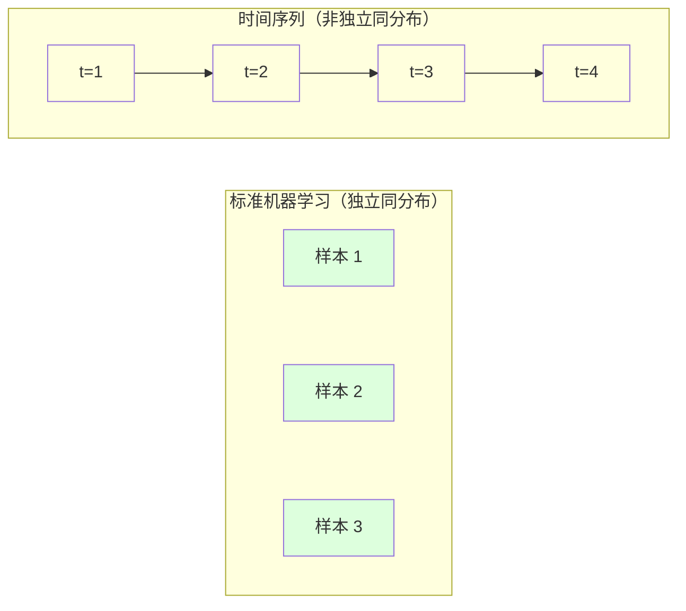
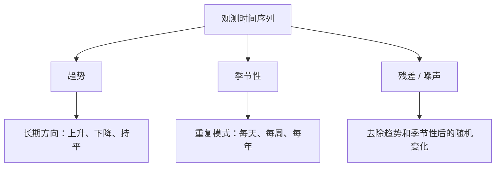
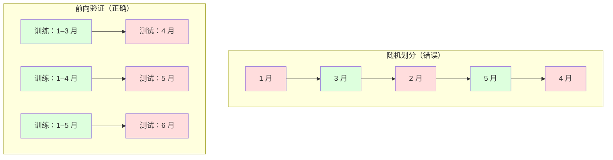

# 时间序列基础（Time Series Fundamentals）

> 过去的表现确实能预测未来结果，前提是先检查平稳性。

**Type:** Build
**Language:** Python
**Prerequisites:** 第 2 阶段，第 01–09 课
**Time:** 约 90 分钟

## 学习目标（Learning Objectives）

- 将时间序列（Time Series）分解为趋势、季节性和残差分量，并检验平稳性（Stationarity）
- 实现滞后特征（Lag Features）和滚动统计量（Rolling Statistics），将时间序列转换为监督学习问题
- 构建前向验证（Walk-Forward Validation）框架，防止未来数据泄漏进训练
- 解释随机训练/测试划分为何不适用于时间序列，并展示它与正确时间划分之间的性能差距

## 问题（The Problem）

你有按时间排序的数据：每日销售额、每小时温度、每分钟 CPU 使用率、每周股价。你想预测下一个值、下一周、下一季度。

你拿出标准机器学习工具：随机划分训练和测试集、交叉验证、输入特征矩阵、输出预测。每一步都错了。

时间序列打破了标准机器学习依赖的假设。样本并不独立，今天的温度依赖昨天；随机划分让未来信息泄漏进过去；回测中看似优秀的特征在生产中失效，因为它们依赖随时间变化的模式。

随机交叉验证准确率为 95% 的模型，在正确的时间评估下可能只有 55%。差别不是技术细节，而是模型只在纸面上有效，还是在生产中真正有效。

本课介绍基础知识：时间数据有何不同、如何诚实地评估模型，以及如何将时间序列转为标准机器学习模型可使用的特征。

## 核心概念（The Concept）

### 时间序列有何不同（What Makes Time Series Different）

标准机器学习假设独立同分布（Independent and Identically Distributed，i.i.d.）：每个样本都独立于其他样本，从同一分布抽取。时间序列同时违反两点：

- **不独立。**今天的股价依赖昨天，本周销售额与上周相关。
- **不同分布。**分布随时间变化，12 月的销售情况与 3 月不同。

这些偏离不是小事，会改变特征构建、模型评估方式，以及哪些算法有效。



在标准机器学习中，样本可以互换，打乱顺序不改变任何东西。在时间序列中，顺序决定一切，打乱会破坏信号。

### 时间序列的组成（Components of a Time Series）

每条时间序列都由以下部分组合而成：



- **趋势（Trend）：**长期方向，例如营收每年增长 10%，全球温度上升。
- **季节性（Seasonality）：**按固定间隔重复的模式，例如零售额在 12 月激增，空调用量在 7 月达到峰值。
- **残差（Residual）：**去除趋势和季节性后剩余的部分。如果残差看起来像白噪声，说明分解捕捉到了信号。

### 平稳性（Stationarity）

如果时间序列的统计性质，包括均值、方差和自相关，不随时间变化，就称它平稳。大多数预测方法假设平稳性。

**为何重要：**非平稳序列的均值会漂移。在 1 月数据上训练的模型，学到的均值不同于 2 月实际呈现的均值，因此会系统性出错。

**如何检查：**按窗口计算滚动均值和滚动标准差。如果它们漂移，序列就不平稳。

**如何修复：**差分（Differencing）。不建模原始值，而是建模相邻值的变化：

```
diff[t] = value[t] - value[t-1]
```

如果一次差分不能使序列平稳，就再做一次，即二阶差分。大多数真实序列最多需要两次。

**示例：**

原始序列：[100, 102, 106, 112, 120]
一阶差分：[2, 4, 6, 8]（仍有上升趋势）
二阶差分：[2, 2, 2]（恒定，即平稳）

原序列有二次趋势，一阶差分将其变成线性趋势，二阶差分使它变平。实践中很少需要超过两次。

**正式检验：**增广迪基–富勒检验（Augmented Dickey-Fuller，ADF）是检验平稳性的标准统计方法。原假设为“序列非平稳”。p 值低于 0.05 时，可以拒绝原假设并判断为平稳。我们不从零实现 ADF，因为它需要渐近分布表；代码中的滚动统计方法提供了实用的视觉检查。

### 自相关（Autocorrelation）

自相关衡量时间 t 的值与时间 t-k，即过去 k 步的值，相关程度有多大。自相关函数（Autocorrelation Function，ACF）绘制每个滞后 k 对应的相关性。

**ACF 告诉你：**
- 序列记忆有多长。如果 ACF 在滞后 5 后降至零，5 步以前的值就不再相关。
- 是否存在季节性。如果月度数据的 ACF 在滞后 12 处出现尖峰，说明存在年度季节性。
- 应创建多少滞后特征。使用直到 ACF 可以忽略为止的滞后。

**偏自相关函数（Partial Autocorrelation Function，PACF）**去除间接相关。如果今天与 3 天前相关，只因两者都与昨天相关，那么滞后 3 的 PACF 为零，而 ACF 不为零。

### 滞后特征：将时间序列转为监督学习（Lag Features: Turning Time Series into Supervised Learning）

标准机器学习需要特征矩阵 X 和目标 y，而时间序列只提供一列数值。两者之间的桥梁就是滞后特征。

以序列 [10, 12, 14, 13, 15] 创建滞后 1 和滞后 2 特征：

| lag_2 | lag_1 | target |
|-------|-------|--------|
| 10    | 12    | 14     |
| 12    | 14    | 13     |
| 14    | 13    | 15     |

现在你得到一个标准回归问题。任何机器学习模型，如线性回归、随机森林或梯度提升，都能从滞后值预测目标。

还可以构建以下特征：
- **滚动统计量：**最近 k 个值的均值、标准差、最小值、最大值
- **日历特征（Calendar Features）：**星期几、月份、is_holiday、is_weekend
- **差分值：**相对上一步的变化
- **扩展统计量（Expanding Statistics）：**累计均值、累计和
- **比率特征（Ratio Features）：**当前值 / 滚动均值，衡量偏离近期平均水平的程度
- **交互特征（Interaction Features）：**lag_1 * day_of_week，表示星期对变化动量的影响

**用多少个滞后？**看自相关函数。如果 ACF 到滞后 10 都显著，至少使用 10 个滞后。如果有周季节性，就包含滞后 7，也可能包含 14。更多滞后给模型更多历史，但也增加需要拟合的特征，提升过拟合风险。

**目标对齐陷阱。**创建滞后特征时，目标必须是 t 时刻的值，所有特征只能使用 t-1 或更早的数据。如果意外把 t 时刻的值作为特征，你就得到一个完美预测器，以及一个完全没用的模型。这是时间序列特征工程中最常见的错误。

### 前向验证（Walk-Forward Validation）

这是本课最重要的概念。标准 k 折交叉验证随机将样本分配到训练和测试中，对时间序列而言会泄漏未来信息。



前向验证流程：
1. 使用截至时间 t 的数据训练
2. 预测时间 t+1，多步预测则预测 t+1 到 t+k
3. 将窗口向前移动
4. 重复

每个测试折只包含所有训练数据之后的数据，没有未来泄漏，因此能诚实估计模型部署后的表现。

**扩展窗口（Expanding Window）**使用所有历史数据训练，窗口不断增长；**滑动窗口（Sliding Window）**使用固定长度的训练窗口，窗口向前移动。认为旧数据仍相关时使用扩展窗口；世界已变化、旧数据有害时使用滑动窗口。

### ARIMA 的直觉（ARIMA Intuition）

ARIMA 是经典时间序列模型，包含三部分：

- **自回归（Autoregressive，AR）：**根据过去值预测。AR(p) 使用最近 p 个值。
- **单整（Integrated，I）：**通过差分实现平稳。I(d) 进行 d 次差分。
- **移动平均（Moving Average，MA）：**根据过去预测误差预测。MA(q) 使用最近 q 个误差。

ARIMA(p, d, q) 组合三者。根据 ACF/PACF 分析或自动搜索（auto-ARIMA）选择 p、d、q。

我们不从零实现 ARIMA，因为它需要超出本课范围的数值优化。关键是理解每部分作用，从而能解释 ARIMA 结果，并知道何时使用它。

### 各方法的适用场景（When to Use What）

| 方法 | 最适合 | 处理季节性 | 处理外部特征 |
|----------|---------|-------------------|------------------------|
| 滞后特征 + 机器学习 | 外部特征很多的表格数据 | 配合日历特征 | 是 |
| ARIMA | 单条单变量序列、短期预测 | SARIMA 变体 | 否，ARIMAX 有限支持 |
| 指数平滑（Exponential Smoothing） | 简单趋势加季节性 | 是，Holt-Winters | 否 |
| Prophet | 业务预测、节假日 | 是，傅里叶项（Fourier Terms） | 有限 |
| 神经网络（LSTM、Transformer） | 长序列、多条序列 | 学习得到 | 是 |

对大多数实际问题，滞后特征加梯度提升是最强的起点。它自然支持外部特征，不要求平稳性，也易于调试。

### 预测跨度与策略（Forecasting Horizons and Strategies）

单步预测预测未来一步，多步预测预测未来多步。有三种策略：

**递归式（Recursive / Iterated）：**预测下一步，再将预测作为下一步输入。简单，但误差会累积，因为每次预测都使用上一次预测，错误逐步叠加。

**直接式（Direct）：**为每个预测跨度单独训练模型。Model-1 预测 t+1，Model-5 预测 t+5。没有误差累积，但每个模型的训练样本更少，模型之间也不共享信息。

**多输出（Multi-Output）：**训练一个同时输出所有跨度的模型。跨度之间共享信息，但模型必须支持多输出，或需要自定义损失函数。

对大多数实际问题，短跨度（1–5 步）先用递归式，较长跨度用直接式。

### 时间序列的常见错误（Common Mistakes in Time Series）

| 错误 | 原因 | 修复方法 |
|---------|---------------|-----------|
| 随机训练/测试划分 | 沿用标准机器学习习惯 | 使用前向验证或时间划分 |
| 使用未来特征 | 误将 t 时刻的特征纳入 | 审查每个特征的时间对齐 |
| 对季节性过拟合 | 模型记住日历模式 | 在测试集中留出完整季节周期 |
| 忽略尺度变化 | 营收翻倍但模式不变 | 建模百分比变化而非绝对值 |
| 滞后特征过多 | “历史越多越好” | 使用 ACF 确定相关滞后 |
| 不做差分 | “模型会自己学会” | 树模型处理趋势，线性模型需要平稳性 |

```figure
f3-series-decompose
```

## 动手实现（Build It）

`code/time_series.py` 中的代码从零实现核心构件。

### 滞后特征生成器（Lag Feature Creator）

```python
def make_lag_features(series, n_lags):
    n = len(series)
    X = np.full((n, n_lags), np.nan)
    for lag in range(1, n_lags + 1):
        X[lag:, lag - 1] = series[:-lag]
    valid = ~np.isnan(X).any(axis=1)
    return X[valid], series[valid]
```

它将一维序列转换为特征矩阵，每行以最近 `n_lags` 个值为特征，当前值为目标。

### 前向交叉验证（Walk-Forward Cross-Validation）

```python
def walk_forward_split(n_samples, n_splits=5, min_train=50):
    assert min_train < n_samples, "min_train must be less than n_samples"
    step = max(1, (n_samples - min_train) // n_splits)
    for i in range(n_splits):
        train_end = min_train + i * step
        test_end = min(train_end + step, n_samples)
        if train_end >= n_samples:
            break
        yield slice(0, train_end), slice(train_end, test_end)
```

每次划分确保训练数据严格早于测试数据，训练窗口逐折扩大。

### 简单自回归模型（Simple Autoregressive Model）

纯 AR 模型就是对滞后特征进行线性回归：

```python
class SimpleAR:
    def __init__(self, n_lags=5):
        self.n_lags = n_lags
        self.weights = None
        self.bias = None

    def fit(self, series):
        X, y = make_lag_features(series, self.n_lags)
        # Solve via normal equations
        X_b = np.column_stack([np.ones(len(X)), X])
        theta = np.linalg.lstsq(X_b, y, rcond=None)[0]
        self.bias = theta[0]
        self.weights = theta[1:]
        return self
```

概念上与第 02 课的线性回归完全相同，只是应用于同一变量的时间滞后版本。

### 平稳性检查（Stationarity Check）

代码计算滚动统计量，从视觉和数值两方面评估平稳性：

```python
def check_stationarity(series, window=50):
    rolling_mean = np.array([
        series[max(0, i - window):i].mean()
        for i in range(1, len(series) + 1)
    ])
    rolling_std = np.array([
        series[max(0, i - window):i].std()
        for i in range(1, len(series) + 1)
    ])
    return rolling_mean, rolling_std
```

如果滚动均值漂移或滚动标准差变化，序列就非平稳。进行差分后再次检查。

代码还通过比较序列前半段和后半段来检查平稳性。如果均值差超过半个标准差，或方差比超过 2 倍，就将序列标记为非平稳。

### 自相关（Autocorrelation）

```python
def autocorrelation(series, max_lag=20):
    n = len(series)
    mean = series.mean()
    var = series.var()
    acf = np.zeros(max_lag + 1)
    for k in range(max_lag + 1):
        cov = np.mean((series[:n-k] - mean) * (series[k:] - mean))
        acf[k] = cov / var if var > 0 else 0
    return acf
```

## 实际应用（Use It）

使用 sklearn 时，可将滞后特征直接交给任意回归器：

```python
from sklearn.linear_model import Ridge
from sklearn.ensemble import GradientBoostingRegressor

X, y = make_lag_features(series, n_lags=10)

for train_idx, test_idx in walk_forward_split(len(X)):
    model = Ridge(alpha=1.0)
    model.fit(X[train_idx], y[train_idx])
    predictions = model.predict(X[test_idx])
```

ARIMA 使用 statsmodels：

```python
from statsmodels.tsa.arima.model import ARIMA

model = ARIMA(train_series, order=(5, 1, 2))
fitted = model.fit()
forecast = fitted.forecast(steps=30)
```

`time_series.py` 中的代码展示两种方法，并通过前向验证比较。

### sklearn 时间序列划分（sklearn TimeSeriesSplit）

sklearn 提供实现前向验证的 `TimeSeriesSplit`：

```python
from sklearn.model_selection import TimeSeriesSplit

tscv = TimeSeriesSplit(n_splits=5)
for train_index, test_index in tscv.split(X):
    X_train, X_test = X[train_index], X[test_index]
    y_train, y_test = y[train_index], y[test_index]
    model.fit(X_train, y_train)
    score = model.score(X_test, y_test)
```

它等价于我们从零实现的 `walk_forward_split`，但集成在 sklearn 交叉验证框架中，可以与 `cross_val_score` 配合：

```python
from sklearn.model_selection import cross_val_score

scores = cross_val_score(model, X, y, cv=TimeSeriesSplit(n_splits=5))
print(f"Mean score: {scores.mean():.4f} +/- {scores.std():.4f}")
```

### 评估指标（Evaluation Metrics）

时间序列预测使用回归指标，但必须结合时间背景：

- **平均绝对误差（Mean Absolute Error，MAE）：**|y_true - y_pred| 的平均值。易于按原单位解释，例如“预测平均相差 3.2 度”。
- **均方根误差（Root Mean Squared Error，RMSE）：**均方误差的平方根，比 MAE 更重地惩罚大误差。大误差比许多小误差更糟时使用。
- **平均绝对百分比误差（Mean Absolute Percentage Error，MAPE）：**|error / true_value| * 100 的平均值。与尺度无关，适合比较不同序列，但真实值为零时无定义。
- **朴素基线比较（Naive Baseline Comparison）：**始终与简单基线比较。季节性朴素基线预测一个周期前的值，例如昨天或上周。如果模型无法胜过它，就有问题。

### 滚动特征（Rolling Features）

代码演示在滞后特征之外添加滚动统计量：7 天和 14 天窗口内的均值、标准差、最小值、最大值。它们提供近期趋势和波动信息，单靠滞后特征无法捕捉这些信息。

例如，滚动均值上升提示上升趋势；滚动标准差增大提示波动增加。这类模式是树模型可以学习、线性模型无法学习的。

## 交付成果（Ship It）

本课产出：
- `outputs/prompt-time-series-advisor.md`：用于界定时间序列问题的提示词
- `code/time_series.py`：滞后特征、前向验证、AR 模型和平稳性检查

### 必须超越的基线（Baselines You Must Beat）

构建任何模型之前，先建立基线：

1. **最后值，持续性预测（Last Value / Persistence）。**预测明天与今天相同。对许多序列，它出乎意料地难以超越。
2. **季节性朴素预测（Seasonal Naive）。**预测今天与上周或去年同一天相同。如果模型无法胜过它，就没学到季节性之外的有用模式。
3. **移动平均（Moving Average）。**预测最近 k 个值的平均值。能平滑噪声，但无法捕捉突变。

如果你的复杂机器学习模型输给季节性朴素基线，就存在错误。最常见原因是特征中的未来泄漏、评估方法错误，或序列确实随机且不可预测。

### 实践建议（Practical Tips）

1. **从画图开始。**建模前先绘制原始序列，寻找趋势、季节性、离群点和结构突变（行为突然改变）。30 秒视觉检查提供的信息往往多于一小时自动分析。

2. **先差分，再建模。**如果序列有明显趋势，在创建滞后特征前先差分。树模型能处理趋势，线性模型不能，而且差分从不会有害。

3. **至少留出一个完整季节周期。**如果存在周季节性，测试集至少覆盖完整一周；如果是月季节性，至少完整一个月。否则无法评估模型是否捕捉了季节模式。

4. **在生产环境中监控。**随着世界变化，时间序列模型会逐渐退化。滚动跟踪预测误差，误差开始增大时，用近期数据重新训练。

5. **警惕状态变化（Regime Changes）。**在疫情前数据上训练的模型无法预测疫情后行为。将已知状态变化的指示变量作为特征，或使用能够遗忘旧数据的滑动窗口。

6. **对偏斜序列进行对数变换。**营收、价格和计数通常右偏。取对数能稳定方差，将乘法模式转为线性模型可处理的加法模式。在对数空间预测，再取指数还原原始单位。

## 练习（Exercises）

1. **平稳性实验。**生成带线性趋势的序列，用滚动统计量检查平稳性，做一阶差分后再检查。二次趋势需要几次差分？

2. **滞后选择。**对季节性序列（period=7）计算 ACF。哪些滞后自相关最高？只使用这些滞后创建特征，而非连续滞后。与使用滞后 1 到 7 相比，准确率改善了吗？

3. **前向验证与随机划分。**在滞后特征上训练岭回归（Ridge Regression），分别用随机 80/20 划分和前向验证评估。随机划分高估了多少性能？

4. **特征工程。**在滞后特征之外加入滚动均值（window=7）、滚动标准差（window=7）和星期几特征。用前向验证比较加入前后的准确率。

5. **多步预测。**修改 AR 模型，使其预测未来 5 步而非 1 步。比较两种策略：（a）预测一步并用预测作为下一步输入，即递归式；（b）为每个跨度单独训练模型，即直接式。哪种更准确？

## 关键术语（Key Terms）

| 术语 | 常见说法 | 实际含义 |
|------|----------------|----------------------|
| 平稳性（Stationarity） | “统计量不随时间变化” | 序列的均值、方差和自相关结构随时间保持恒定 |
| 差分（Differencing） | “相邻值相减” | 计算 y[t] - y[t-1]，去除趋势并实现平稳 |
| 自相关（Autocorrelation，ACF） | “序列与自身的相关性” | 时间序列与其滞后副本的相关性，是滞后的函数 |
| 偏自相关（Partial Autocorrelation，PACF） | “只看直接相关” | 去掉所有更短滞后影响后，滞后 k 处的自相关 |
| 滞后特征（Lag Features） | “过去值作为输入” | 使用 y[t-1], y[t-2], ..., y[t-k] 作为特征预测 y[t] |
| 前向验证（Walk-Forward Validation） | “尊重时间的交叉验证” | 训练数据在时间上始终先于测试数据的评估 |
| ARIMA | “经典时间序列模型” | 自回归单整移动平均（AutoRegressive Integrated Moving Average）：结合过去值 AR、差分 I 和过去误差 MA |
| 季节性（Seasonality） | “重复的日历模式” | 与每日、每周、每年等日历周期关联的规则、可预测循环 |
| 趋势（Trend） | “长期方向” | 序列水平随时间持续增加或降低 |
| 扩展窗口（Expanding Window） | “使用全部历史” | 训练集随每折增长的前向验证 |
| 滑动窗口（Sliding Window） | “固定长度历史” | 训练集是向前滑动的固定长度窗口的前向验证 |

## 延伸阅读（Further Reading）

- [Hyndman 与 Athanasopoulos：预测：原理与实践（Forecasting: Principles and Practice，第 3 版）](https://otexts.com/fpp3/)：最好的免费时间序列预测教材
- [scikit-learn 时间序列划分（Time Series Split）](https://scikit-learn.org/stable/modules/generated/sklearn.model_selection.TimeSeriesSplit.html)：sklearn 的前向划分器
- [statsmodels ARIMA 文档](https://www.statsmodels.org/stable/generated/statsmodels.tsa.arima.model.ARIMA.html)：带诊断的 ARIMA 实现
- [Makridakis 等：M5 竞赛（The M5 Competition，2022）](https://www.sciencedirect.com/science/article/pii/S0169207021001874)：比较机器学习与统计方法的大规模预测竞赛
