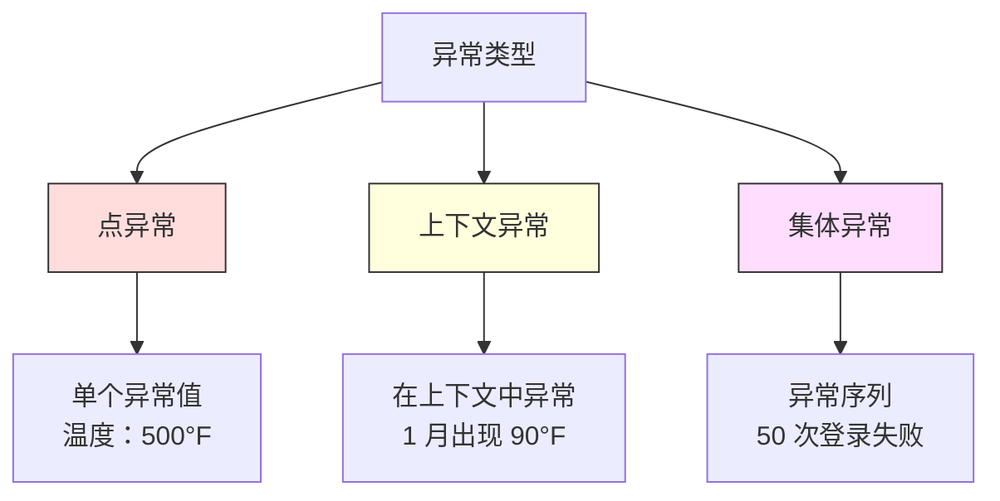
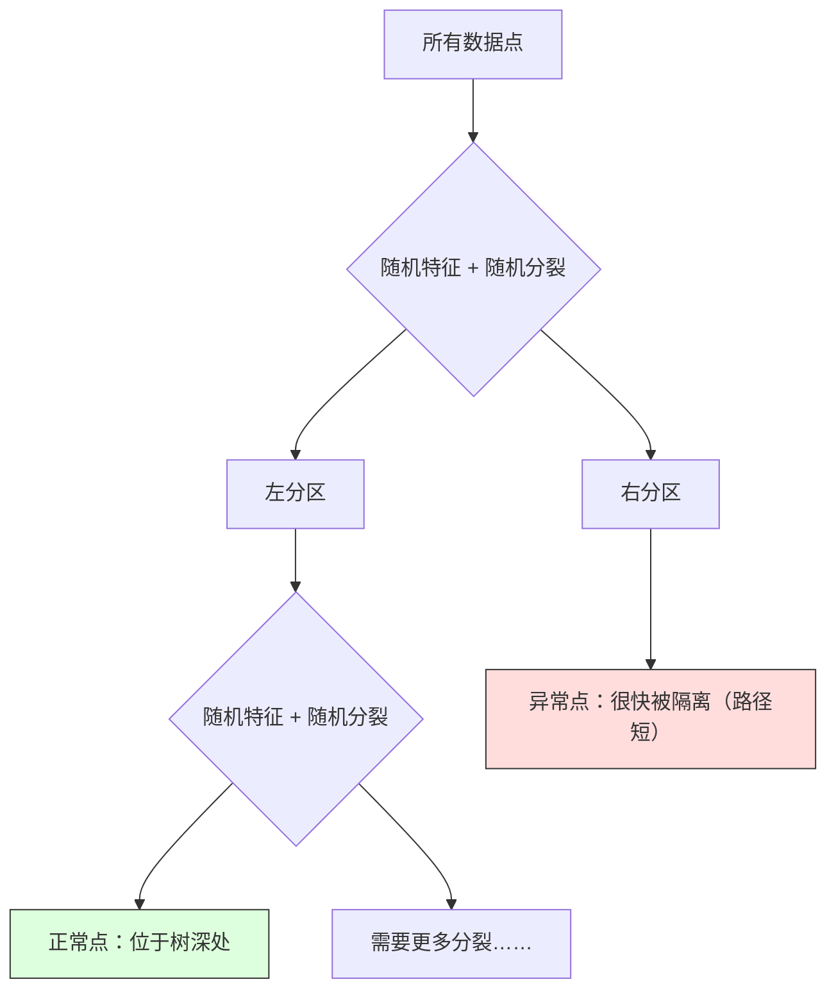
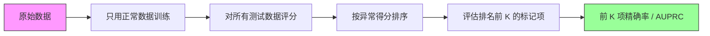

# 异常检测（Anomaly Detection）

> 正常容易定义，异常就是不符合正常模式的东西。

**Type:** Build
**Language:** Python
**Prerequisites:** 第 2 阶段，第 01–09 课
**Time:** 约 75 分钟

## 学习目标（Learning Objectives）

- 从零实现 Z 分数（Z-Score）、四分位距（IQR）和孤立森林（Isolation Forest）异常检测方法
- 区分点异常、上下文异常和集体异常，为每类选择适当检测方法
- 解释为何将异常检测界定为建模正常数据，而不是对异常分类
- 比较无监督异常检测与监督分类，评估新型异常覆盖范围与精确率之间的权衡

## 问题（The Problem）

一张信用卡下午 2 点在纽约使用，2 点 05 分又在东京使用；工厂传感器正常范围为 80–120 度，却读到 150 度；服务器每日平均每秒发送 200 个请求，却突然达到每秒 50,000 个。

这些都是异常。找到它们很重要：欺诈造成数十亿美元损失，设备故障带来停机，网络入侵导致数据损失。

挑战在于，你很少拥有带标签的异常样本。欺诈只占交易的 0.1%，设备一年只故障几次。“异常”类几乎没有可学习的样本，无法训练标准分类器。即使有一些标签，已见异常也不是未来会遇到的全部类型。明天的欺诈手法与今天不同。

异常检测将问题反过来：不学习什么是异常，而是学习什么是正常。任何偏离正常的情况都可疑。这样无需标签，能适应新型异常，也能扩展到海量数据。

## 核心概念（The Concept）

### 异常类型（Types of Anomalies）

异常并不都相同：

- **点异常（Point Anomalies）。**无论上下文如何，单个数据点都不寻常。例如温度读数 500 度，或平时只花 50 美元的账户发生 50,000 美元交易。
- **上下文异常（Contextual Anomalies）。**在特定上下文中不寻常的数据点。例如 90 度在夏天正常、冬天异常；值相同，上下文不同。
- **集体异常（Collective Anomalies）。**作为整体不寻常的数据序列，即使每个点单看可能正常。5 次登录失败正常，连续 50 次则是暴力破解攻击。

大多数方法检测点异常。上下文异常需要时间或位置特征，集体异常需要理解序列的方法。



### 无监督问题界定（The Unsupervised Framing）

标准分类有两个类别的标签，异常检测通常面对三种情况之一：

1. **完全无监督（Fully Unsupervised）。**完全没有标签。在所有数据上拟合检测器，寄希望于异常足够少，不至于污染“正常”模型。
2. **半监督（Semi-Supervised）。**有一个只包含正常数据的干净数据集。在它上面拟合，对其余数据评分。条件允许时，这是最强的设置。
3. **弱监督（Weakly Supervised）。**有少量带标签异常。将其用于评估，而非训练。采用无监督训练，再在带标签子集上衡量精确率和召回率。

关键认识是：异常检测与分类根本不同。你建模的是正常数据的分布，而非两个类别间的决策边界。

### 监督与无监督的权衡（Supervised vs Unsupervised: The Tradeoff）

如果确实有带标签异常，该用于训练，即监督分类，还是仅用于评估，即无监督检测？

**监督方式，将其视为分类：**
- 捕捉之前见过的确切异常类型
- 对已知异常类型有更高精确率
- 完全漏掉新型异常
- 新异常类型出现时需要重新训练
- 需要足够异常样本，但通常样本太少

**无监督方式，建模正常并标记偏离：**
- 捕捉任何偏离正常的情况，包括新型异常
- 不要求带标签异常
- 误报率更高，因为不寻常不一定有害
- 对分布变化更鲁棒

实践中，最好的系统结合两者：无监督检测广泛覆盖，监督模型处理已知高优先级异常类型，不确定情况交给人工复核。

### Z 分数方法（Z-Score Method）

最简单的方法：计算每个特征的均值和标准差，将偏离均值超过 k 个标准差的点标记为异常。

```text
z_score = (x - mean) / std
若 |z_score| > threshold，则为异常
```

默认阈值为 3.0。高斯分布中 99.7% 的正常数据落在 3 个标准差以内。

**优点：**简单、快速、可解释，例如“该值偏离正常水平 4.5 个标准差”。

**缺点：**假设数据服从正态分布。对训练数据中的离群点敏感，因为离群点会移动均值并增大标准差，使自身更难被检测。在多峰分布上失效。

**适用情况：**数据近似钟形的单特征监控，例如服务器响应时间、制造公差、基线稳定的传感器读数。

**失效情况：**多簇数据，如基准温度不同的两个办公地点；偏斜数据，如 1000 美元罕见但不异常的交易金额；训练集包含离群点的数据。

### 四分位距方法（IQR Method）

比 Z 分数更鲁棒，使用四分位距（Interquartile Range）而非均值和标准差。

```
Q1 = 第 25 百分位数
Q3 = 第 75 百分位数
IQR = Q3 - Q1
lower_bound = Q1 - factor * IQR
upper_bound = Q3 + factor * IQR
异常条件：x < lower_bound or x > upper_bound
```

默认系数为 1.5。

**优点：**对离群点鲁棒，百分位数不受极端值影响；适用于偏斜分布，不假设正态性。

**缺点：**仅适用于单变量，对各特征独立应用。无法发现只有联合考虑特征时才异常的点：一个点在每个特征上分别正常，却可能在联合空间中异常。

**实践说明：**IQR 的 1.5 系数对应箱线图的须，须外的点是潜在离群点。改用 3.0 会使检测器更保守，标记更少、误报更少。合适系数取决于对误报的容忍度。

### 孤立森林（Isolation Forest）

关键认识是：异常稀少且不同。在随机划分数据时，异常更容易被隔离，需要更少随机分裂就能与其他数据分开。



**工作方式：**
1. 构建多棵随机树，组成孤立森林
2. 每个节点随机选择特征，再在该特征最小值和最大值之间随机选择分裂值
3. 持续分裂，直到每个点被隔离在自己的叶节点中
4. 异常在所有树上的平均路径长度更短

**为何有效：**正常点位于密集区域，需要多次随机分裂才能与邻居分开；异常位于稀疏区域，一两次随机分裂就足以隔离。

异常得分基于所有树的平均路径长度，再按随机二叉搜索树的期望路径长度归一化：

```
score(x) = 2^(-average_path_length(x) / c(n))
```

其中 `c(n)` 是 n 个样本的期望路径长度。得分接近 1 表示异常，接近 0.5 表示正常，接近 0 表示非常正常，位于密集簇深处。

**优点：**不假设分布，适用于高维，扩展性好。每棵树使用子样本，因此相对于样本规模是次线性的。支持混合特征类型。

**缺点：**难以处理密集区域中的异常，即掩蔽效应（Masking Effect）。大量特征无关时，随机分裂效果会降低。

**关键超参数：**
- `n_estimators`：树的数量。通常 100 棵足够。更多树带来更稳定得分，但计算更慢。
- `max_samples`：每棵树的样本数。原论文默认 256。更小取值降低单棵树准确性，但增加多样性。子采样是孤立森林快速的原因，每棵树只看到少量数据。
- `contamination`：预期异常比例。仅用于设置阈值，不影响得分本身。

### 局部离群因子（Local Outlier Factor，LOF）

LOF 比较一个点周围的局部密度与其邻居周围的密度。一个位于稀疏区域、却被密集区域包围的点是异常。

**工作方式：**
1. 为每个点寻找 k 个最近邻
2. 计算局部可达密度（Local Reachability Density），即邻域有多密集
3. 比较每个点的密度与其邻居密度
4. 如果一个点的密度远低于邻居，就是离群点

**LOF 得分：**
- 接近 1.0：密度与邻居相近，正常
- 大于 1.0：密度低于邻居，可能异常
- 远大于 1.0，例如 2.0 以上：密度显著更低，很可能异常

“局部”很关键。设数据集有两个簇：含 1000 个点的密集簇和含 50 个点的稀疏簇。稀疏簇边缘的点从全局看并不异常，它有 50 个邻居；但若紧邻点比它更密集，它在局部就异常。LOF 能捕捉全局方法遗漏的这种细节。

**优点：**检测局部异常，即在邻域内异常、即使全局不异常的点。适用于不同密度的簇。

**缺点：**在大数据集上慢，朴素实现为 O(n^2)；对 k 的选择敏感；在很高维时效果不好，维度灾难会影响距离计算。

### 方法比较（Comparison）

| 方法 | 假设 | 速度 | 处理高维 | 检测局部异常 |
|--------|------------|-------|-------------------|------------------------|
| Z 分数（Z-Score） | 正态分布 | 很快 | 是，逐特征 | 否 |
| 四分位距（IQR） | 无，逐特征 | 很快 | 是，逐特征 | 否 |
| 孤立森林（Isolation Forest） | 无 | 快 | 是 | 部分 |
| 局部离群因子（LOF） | 距离有意义 | 慢 | 较差 | 是 |

### 评估挑战（Evaluation Challenges）

异常检测器比分类器更难评估：

- **极端类别不平衡。**异常占 0.1% 时，对所有点预测“正常”就有 99.9% 准确率，因此准确率无用。
- **AUROC 会误导。**严重不平衡时，即使模型在实际阈值下漏掉大部分异常，AUROC 也可能很好看。
- **更好的指标：**前 k 项精确率（Precision@k，前 k 个标记项中多少是真异常）、精确率–召回率曲线下面积（AUPRC），以及固定假阳性率下的召回率。



### 异常检测流水线（Anomaly Detection Pipeline）

实践中采用以下流程：

1. **收集基线数据。**理想情况下，选择已知没有异常或异常很少的时段。
2. **特征工程。**原始特征加派生特征，如滚动统计量、时间特征、比率。
3. **训练检测器。**在基线数据上拟合，让模型学习“正常”的样子。
4. **对新数据评分。**每个新观测得到一个异常得分。
5. **选择阈值。**确定得分截断点。这是业务决策：阈值越高，误报越少，漏掉异常越多。
6. **告警与调查。**将标记点交给人工复核或自动响应。
7. **收集反馈。**记录标记项是真异常还是误报，用这些数据评估检测器，并持续调整阈值。

流水线永远不会“一劳永逸”。数据分布会改变，新异常类型会出现，阈值需要调整。把异常检测当作持续运行的系统，而非一次性模型。

```figure
f3-anomaly-fence
```

## 动手实现（Build It）

`code/anomaly_detection.py` 中的代码从零实现 Z 分数、IQR 和孤立森林。

### Z 分数检测器（Z-Score Detector）

```python
def zscore_detect(X, threshold=3.0):
    mean = X.mean(axis=0)
    std = X.std(axis=0)
    std[std == 0] = 1.0
    z = np.abs((X - mean) / std)
    return z.max(axis=1) > threshold
```

实现简单且向量化，只要任一特征超过阈值就标记该点。

### 四分位距检测器（IQR Detector）

```python
def iqr_detect(X, factor=1.5):
    q1 = np.percentile(X, 25, axis=0)
    q3 = np.percentile(X, 75, axis=0)
    iqr = q3 - q1
    iqr[iqr == 0] = 1.0
    lower = q1 - factor * iqr
    upper = q3 + factor * iqr
    outside = (X < lower) | (X > upper)
    return outside.any(axis=1)
```

### 从零实现孤立森林（Isolation Forest from Scratch）

从零实现通过构建孤立树，随机划分特征空间：

```python
class IsolationTree:
    def __init__(self, max_depth):
        self.max_depth = max_depth

    def fit(self, X, depth=0):
        n, p = X.shape
        if depth >= self.max_depth or n <= 1:
            self.is_leaf = True
            self.size = n
            return self
        self.is_leaf = False
        self.feature = np.random.randint(p)
        x_min = X[:, self.feature].min()
        x_max = X[:, self.feature].max()
        if x_min == x_max:
            self.is_leaf = True
            self.size = n
            return self
        self.threshold = np.random.uniform(x_min, x_max)
        left_mask = X[:, self.feature] < self.threshold
        self.left = IsolationTree(self.max_depth).fit(X[left_mask], depth + 1)
        self.right = IsolationTree(self.max_depth).fit(X[~left_mask], depth + 1)
        return self
```

隔离一个点的路径长度决定异常得分，路径越短越异常。

`IsolationForest` 类封装多棵树：

```python
class IsolationForest:
    def __init__(self, n_estimators=100, max_samples=256, seed=42):
        self.n_estimators = n_estimators
        self.max_samples = max_samples

    def fit(self, X):
        sample_size = min(self.max_samples, X.shape[0])
        max_depth = int(np.ceil(np.log2(sample_size)))
        for _ in range(self.n_estimators):
            idx = rng.choice(X.shape[0], size=sample_size, replace=False)
            tree = IsolationTree(max_depth=max_depth)
            tree.fit(X[idx])
            self.trees.append(tree)

    def anomaly_score(self, X):
        avg_path = average path length across all trees
        scores = 2.0 ** (-avg_path / c(max_samples))
        return scores
```

归一化因子 `c(n)` 是包含 n 个元素的二叉搜索树中失败查找的期望路径长度，等于 `2 * H(n-1) - 2*(n-1)/n`，其中 `H` 是调和数（Harmonic Number）。归一化确保不同规模数据集的得分可比较。

### 演示场景（Demo Scenarios）

代码生成多个测试场景：

1. **带离群点的单簇。**二维高斯簇，在远离中心处注入异常。所有方法都应有效。
2. **多峰数据。**三个大小和密度不同的簇，簇间点为异常。各特征范围较宽，Z 分数会遇到困难。
3. **高维数据。**50 个特征，但异常只在其中 5 个特征上不同。检验方法能否在特征子集中找到异常。

每个演示使用精确率、召回率、F1 和 Precision@k 比较所有方法。

## 实际应用（Use It）

使用 sklearn 的库实现，而非从零实现：

```python
from sklearn.ensemble import IsolationForest
from sklearn.neighbors import LocalOutlierFactor

iso = IsolationForest(n_estimators=100, contamination=0.05, random_state=42)
iso.fit(X_train)
predictions = iso.predict(X_test)

lof = LocalOutlierFactor(n_neighbors=20, contamination=0.05, novelty=True)
lof.fit(X_train)
predictions = lof.predict(X_test)
```

注意，`contamination` 设置预期异常比例。设置正确很重要：太低会漏掉异常，太高会产生误报。

`anomaly_detection.py` 中的代码在相同数据上比较从零实现与 sklearn。

### sklearn 的污染比例参数（sklearn Contamination Parameter）

sklearn 中的 `contamination` 决定将连续异常得分转换为二元预测的阈值，不改变底层得分。

```python
iso_5 = IsolationForest(contamination=0.05)
iso_10 = IsolationForest(contamination=0.10)
```

两者产生相同异常得分，但 `iso_5` 标记前 5%，`iso_10` 标记前 10%。如果不知道真实异常率，通常都是如此，将 contamination 设为 "auto"，直接使用原始得分。根据假阳性与假阴性的成本权衡，自行设定阈值。

### 单类支持向量机（One-Class SVM）

这是另一个值得了解的无监督异常检测器。单类 SVM 使用核技巧（Kernel Trick），在高维特征空间中为正常数据拟合边界。

```python
from sklearn.svm import OneClassSVM

oc_svm = OneClassSVM(kernel="rbf", gamma="auto", nu=0.05)
oc_svm.fit(X_train)
predictions = oc_svm.predict(X_test)
```

`nu` 参数近似表示异常比例。单类 SVM 在中小数据集上效果好，但无法扩展到很大数据，因为核矩阵呈平方增长。

### 自编码器方法预览（Autoencoder Approach, Preview）

自编码器（Autoencoders）是学习压缩和重建数据的神经网络。用正常数据训练，测试时异常会有较高重建误差，因为网络只学会重建正常模式。

第 3 阶段深度学习会介绍它，但原则相同：建模正常，标记偏离。

### 集成异常检测（Ensemble Anomaly Detection）

正如第 11 课的集成方法改善分类，组合多个异常检测器也能改善检测。最简单的方法：

1. 运行多个检测器，如 Z 分数、IQR、孤立森林、LOF
2. 将各检测器得分归一化到 [0, 1]
3. 对归一化得分求平均
4. 标记平均得分超过阈值的点

不同方法有不同失效模式，因此可减少误报。被四种方法都标记的点几乎肯定异常；只被一种标记，可能只是该方法的特殊偏差。

更复杂的集成会按各检测器的估计可靠性加权。如果有包含已知异常的验证集，可在上面衡量可靠性。

### 生产环境注意事项（Production Considerations）

1. **阈值漂移（Threshold Drift）。**数据分布变化后，固定阈值会过时。监控异常得分分布，定期调整。
2. **告警疲劳（Alert Fatigue）。**误报太多，操作人员就不再关注。先用较高阈值，减少告警并提高可靠性，建立信任后再降低。
3. **集成方案。**生产中组合多个检测器，只有多种方法一致认为异常才标记，可显著减少误报。
4. **特征工程。**原始特征很少足够，应加入滚动统计量、比率、距上次事件时间和领域特征。好特征集比选择哪种检测器更重要。
5. **反馈循环（Feedback Loop）。**操作人员调查标记项并确认或排除后，将结果反馈给系统。逐步积累标签数据，评估并改进检测器。

## 交付成果（Ship It）

本课产出：
- `outputs/skill-anomaly-detector.md`：选择合适检测器的决策技能
- `code/anomaly_detection.py`：从零实现 Z 分数、IQR、孤立森林，并与 sklearn 比较

### 选择阈值（Choosing a Threshold）

异常得分连续，需要阈值作出二元决策。这是业务决策，而非技术决策。

考虑两种场景：
- **欺诈检测。**漏掉欺诈代价高，包括拒付和客户信任损失；误报只需分析员花 5 分钟调查。应降低阈值，捕捉更多欺诈，接受更多误报。
- **设备维护。**误报引发不必要停机，成本 50,000 美元；漏掉故障意味着 500,000 美元维修。应设置阈值平衡两种成本。

两种情况下，最佳阈值都取决于假阳性与假阴性的成本比。绘制不同阈值下的精确率和召回率，叠加成本函数，选择成本最低的点。

### 扩展到生产（Scaling to Production）

生产环境中的实时异常检测：

1. **批量训练、在线评分。**定期，例如每天或每周，用近期正常数据训练模型；每个新观测到达时立即评分。
2. **特征计算必须一致。**如果训练使用 30 天滚动统计量，为新观测计算特征也需要 30 天历史，应缓存所需历史。
3. **监控得分分布。**跟踪异常得分分布随时间的变化。如果中位得分上升，可能是数据变化，也可能是模型过时。
4. **可解释性（Explainability）。**标记异常时说明原因。Z 分数：“特征 X 高于正常水平 4.2 个标准差。”孤立森林：“此点平均经过 3.1 次分裂就被隔离，正常点需要 8.5 次。”

## 练习（Exercises）

1. **阈值调优。**以 0.5 为步长，从 1.0 到 5.0 运行 Z 分数检测器，绘制各阈值的精确率和召回率。你的数据在哪个位置权衡最好？

2. **多变量异常。**构造二维数据，使每个特征单独看都正常，但组合异常，例如远离主簇对角线的点。展示逐特征 Z 分数会漏掉它们，而孤立森林能捕捉。

3. **从零实现 LOF。**使用 k 近邻实现局部离群因子，在相同数据上与 sklearn 的 LocalOutlierFactor 比较。分别用 k=10 和 k=50，k 的选择如何影响结果？

4. **流式异常检测。**修改 Z 分数检测器，使其适用于流式环境：新点到达时，用 Welford 在线算法更新运行均值和方差。在同一数据上与批量 Z 分数比较。

5. **真实评估。**选择有已知异常的数据集，例如 Kaggle 信用卡欺诈数据。使用 precision@100、precision@500 和 AUPRC 评估四种方法。哪种最好？为什么？

## 关键术语（Key Terms）

| 术语 | 常见说法 | 实际含义 |
|------|----------------|----------------------|
| 异常（Anomaly） | “离群点、不寻常点” | 显著偏离正常数据预期模式的数据点 |
| 点异常（Point Anomaly） | “单个奇怪的值” | 无论上下文如何都不寻常的单个观测 |
| 上下文异常（Contextual Anomaly） | “正常值，错误上下文” | 在时间、地点等给定上下文中不寻常，但在其他上下文可能正常的观测 |
| 孤立森林（Isolation Forest） | “随机分裂找离群点” | 通过比正常点更少的分裂隔离异常的随机树集成 |
| 局部离群因子（Local Outlier Factor） | “与邻居比较密度” | 标记局部密度远低于邻居密度的点的方法 |
| Z 分数（Z-Score） | “离均值多少个标准差” | (x - mean) / std，以标准差为单位衡量点偏离中心的距离 |
| 四分位距（IQR） | “四分位间距” | Q3 - Q1，衡量中间 50% 数据的离散程度，用于鲁棒离群检测 |
| 污染比例（Contamination） | “预期异常比例” | 告诉检测器应将多少比例数据标为异常的超参数 |
| 前 k 项精确率（Precision@k） | “前 k 个标记中多少是真的” | 仅对最可疑的 k 个点计算精确率，适用于不平衡异常检测 |
| 精确率–召回率曲线下面积（AUPRC） | “PR 曲线下的面积” | 汇总所有阈值下精确率与召回率表现的指标，对不平衡数据优于 AUROC |

## 延伸阅读（Further Reading）

- [Liu 等：孤立森林（Isolation Forest，2008）](https://cs.nju.edu.cn/zhouzh/zhouzh.files/publication/icdm08b.pdf)：孤立森林原始论文
- [Breunig 等：LOF：识别基于密度的局部离群点（Identifying Density-Based Local Outliers，2000）](https://dl.acm.org/doi/10.1145/342009.335388)：LOF 原始论文
- [scikit-learn 离群检测文档（Outlier Detection Docs）](https://scikit-learn.org/stable/modules/outlier_detection.html)：sklearn 所有异常检测器概览
- [Chandola 等：异常检测综述（Anomaly Detection: A Survey，2009）](https://dl.acm.org/doi/10.1145/1541880.1541882)：异常检测方法的全面综述
- [Goldstein 与 Uchida：无监督异常检测算法的比较评估（A Comparative Evaluation of Unsupervised Anomaly Detection Algorithms，2016）](https://journals.plos.org/plosone/article?id=10.1371/journal.pone.0152173)：在真实数据集上对 10 种方法进行实证比较
