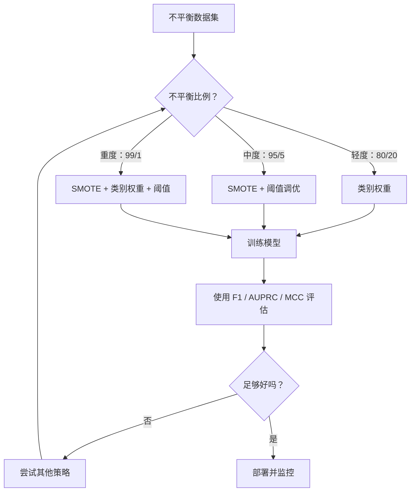
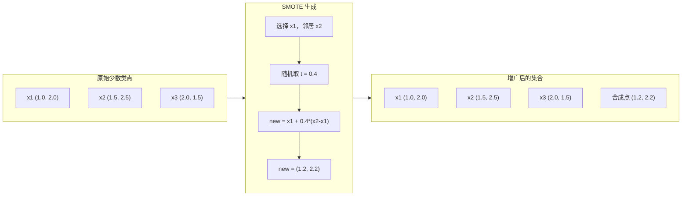
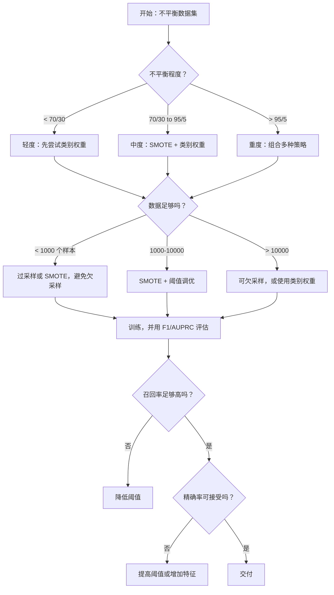

# 处理不平衡数据（Handling Imbalanced Data）

> 当 99% 的数据都是“正常”时，准确率就是谎言。

**Type:** Build
**Language:** Python
**Prerequisites:** 第 2 阶段，第 01–09 课，尤其是评估指标（Evaluation Metrics）
**Time:** 约 90 分钟

## 学习目标（Learning Objectives）

- 从零实现 SMOTE，解释合成过采样（Synthetic Oversampling）与随机复制的区别
- 使用 F1、AUPRC 和马修斯相关系数（Matthews Correlation Coefficient）代替准确率评估不平衡分类器
- 比较类别加权（Class Weighting）、阈值调优（Threshold Tuning）和重采样（Resampling）策略，为给定不平衡比例选择合适方法
- 构建结合 SMOTE、类别权重和阈值优化的完整不平衡数据流水线

## 问题（The Problem）

你构建了一个欺诈检测模型，准确率达到 99.9%。你庆祝了一番，随后发现它对每一笔交易都预测“非欺诈”。

这不是程序错误。当只有 0.1% 的交易是欺诈时，这样做很合理。模型学到，始终猜多数类可以最小化总体错误。它在技术上正确，却完全没用。

真正重要的分类场景到处如此：疾病诊断阳性率 1%，网络入侵攻击率 0.01%，制造缺陷率 0.5%，垃圾邮件占 20%，客户流失率 5%。少数类越重要，往往越稀少。

准确率失效，是因为它平等看待所有正确预测。正确标记正常交易与正确捕捉欺诈，对准确率的贡献相同；但捕捉欺诈才是模型存在的全部理由。我们需要迫使模型关注稀少但重要类别的指标、技术和训练策略。

## 核心概念（The Concept）

### 准确率为何失效（Why Accuracy Fails）

考虑 1000 个样本的数据集：990 个负类，10 个正类。一个始终预测负类的模型：

|  | 预测为正 | 预测为负 |
|--|---|---|
| 实际为正 | 0 (TP) | 10 (FN) |
| 实际为负 | 0 (FP) | 990 (TN) |

准确率：Accuracy = (0 + 990) / 1000 = 99.0%

模型没有抓到任何欺诈、疾病或缺陷，但准确率却说 99%。这就是在不平衡问题中使用准确率的危险。

### 更好的指标（Better Metrics）

**精确率（Precision）** = TP / (TP + FP)。所有被标为正类的样本中，有多少确实为正？高精确率意味着误报少。

**召回率（Recall）** = TP / (TP + FN)。所有真实正类中，捕捉到多少？高召回率意味着漏掉的正类少。

**F1 得分（F1 Score）** = 2 * precision * recall / (precision + recall)。它是调和平均数，对精确率和召回率的极端不均衡，比算术平均惩罚更重。

**F-beta 得分（F-beta Score）** = (1 + beta^2) * precision * recall / (beta^2 * precision + recall)。beta > 1 时更重视召回率，beta < 1 时更重视精确率。欺诈检测常用 F2，因为漏掉欺诈比误报更糟。

**精确率–召回率曲线下面积（Area Under Precision-Recall Curve，AUPRC）**。类似 AUC-ROC，但对不平衡数据更有信息量。随机分类器的 AUPRC 等于正类比例，而不像 ROC 基线为 0.5，因此更容易看出改善。

**马修斯相关系数（Matthews Correlation Coefficient）** = (TP * TN - FP * FN) / sqrt((TP+FP)(TP+FN)(TN+FP)(TN+FN))。范围为 -1 到 +1，只有模型对两个类别都表现好时才给高分。即使类别规模相差很大也保持平衡。

对上面的“始终预测负类”模型：precision = 0/0，无定义，通常设为 0；recall = 0/10 = 0；F1 = 0；MCC = 0。这些指标正确指出模型毫无价值。

### 不平衡数据流水线（The Imbalanced Data Pipeline）



### 合成少数类过采样技术（SMOTE: Synthetic Minority Oversampling Technique）

随机过采样复制现有少数类样本。它有效，但模型反复看到完全相同的点，存在过拟合风险。

SMOTE 创建合理但并非副本的新合成少数类样本。算法如下：

1. 对每个少数类样本 x，在其他少数类样本中寻找 k 个最近邻
2. 随机选择一个邻居
3. 在 x 与该邻居之间的线段上创建新样本

公式为：`new_sample = x + random(0, 1) * (neighbor - x)`

它在真实少数类点间插值，在相同特征空间区域生成样本，而非单纯复制数据。



### 采样策略比较（Sampling Strategies Compared）

**随机过采样（Random Oversampling）**：复制少数类样本，使数量与多数类相同。
- 优点：简单，没有信息损失
- 缺点：完全重复的点导致过拟合，训练时间增加

**随机欠采样（Random Undersampling）**：删除多数类样本，使数量与少数类相同。
- 优点：训练快，简单
- 缺点：丢弃可能有用的多数类数据，方差更高

**SMOTE**：通过插值生成合成少数类样本。
- 优点：生成新数据点，相较随机过采样减少过拟合
- 缺点：可能在决策边界附近生成噪声样本，不考虑多数类分布

| 策略 | 数据变化 | 风险 | 适用情况 |
|----------|-------------|------|-------------|
| 过采样（Oversample） | 复制少数类 | 过拟合 | 小数据集、中度不平衡 |
| 欠采样（Undersample） | 删除多数类 | 信息损失 | 大数据集、希望训练快 |
| SMOTE | 添加合成少数类 | 边界噪声 | 中度不平衡，少数类样本足够用于 k 近邻 |

### 类别权重（Class Weights）

不改变数据，而是改变模型对待错误的方式。给少数类误分类更高权重。

对包含 950 个负类、50 个正类的二分类问题：
- 负类权重 = n_samples / (2 * n_negative) = 1000 / (2 * 950) = 0.526
- 正类权重 = n_samples / (2 * n_positive) = 1000 / (2 * 50) = 10.0

正类权重是负类的 19 倍。错分一个正类样本的代价，相当于错分 19 个负类样本，模型因此被迫关注少数类。

在逻辑回归中，这会修改损失函数：

```
weighted_loss = -sum(w_i * [y_i * log(p_i) + (1-y_i) * log(1-p_i)])
```

其中 w_i 取决于样本 i 的类别。

从期望上看，类别权重与过采样在数学上等价，但无须创建新数据点，因此更快，也避免重复样本带来的过拟合风险。

### 阈值调优（Threshold Tuning）

大多数分类器输出概率，默认阈值为 0.5：若 P(positive) >= 0.5，就预测正类。但 0.5 是任意选择。类别不平衡时，最优阈值通常低得多。

过程如下：
1. 训练模型
2. 获取验证集预测概率
3. 遍历 0.0 到 1.0 的阈值
4. 在每个阈值计算 F1 或所选指标
5. 选择使指标最大的阈值


模型可能为一笔欺诈交易输出 P(fraud) = 0.15。阈值为 0.5 时被判为非欺诈，阈值为 0.10 时则能正确捕捉。概率校准不如排序重要：只要欺诈的概率高于非欺诈，就存在能分开它们的阈值。

### 成本敏感学习（Cost-Sensitive Learning）

这是类别权重的推广。不使用统一成本，而是指定具体的误分类成本：

| | 预测为正 | 预测为负 |
|--|---|---|
| 实际为正 | 0（正确） | C_FN = 100 |
| 实际为负 | C_FP = 1 | 0（正确） |

漏掉欺诈交易（FN）的成本是误报（FP）的 100 倍。模型优化总成本，而非总错误数。

能估计真实成本时，这是最有原则的方法。漏诊癌症与误报导致额外活检的成本截然不同。明确这些成本，才能作出正确权衡。

### 决策流程图（Decision Flowchart）



```figure
class-imbalance
```

## 动手实现（Build It）

### 第 1 步：生成不平衡数据集（Generate an Imbalanced Dataset）

```python
import numpy as np


def make_imbalanced_data(n_majority=950, n_minority=50, seed=42):
    rng = np.random.RandomState(seed)

    X_maj = rng.randn(n_majority, 2) * 1.0 + np.array([0.0, 0.0])
    X_min = rng.randn(n_minority, 2) * 0.8 + np.array([2.5, 2.5])

    X = np.vstack([X_maj, X_min])
    y = np.concatenate([np.zeros(n_majority), np.ones(n_minority)])

    shuffle_idx = rng.permutation(len(y))
    return X[shuffle_idx], y[shuffle_idx]
```

### 第 2 步：从零实现 SMOTE（SMOTE from Scratch）

```python
def euclidean_distance(a, b):
    return np.sqrt(np.sum((a - b) ** 2))


def find_k_neighbors(X, idx, k):
    distances = []
    for i in range(len(X)):
        if i == idx:
            continue
        d = euclidean_distance(X[idx], X[i])
        distances.append((i, d))
    distances.sort(key=lambda x: x[1])
    return [d[0] for d in distances[:k]]


def smote(X_minority, k=5, n_synthetic=100, seed=42):
    rng = np.random.RandomState(seed)
    n_samples = len(X_minority)
    k = min(k, n_samples - 1)
    synthetic = []

    for _ in range(n_synthetic):
        idx = rng.randint(0, n_samples)
        neighbors = find_k_neighbors(X_minority, idx, k)
        neighbor_idx = neighbors[rng.randint(0, len(neighbors))]
        t = rng.random()
        new_point = X_minority[idx] + t * (X_minority[neighbor_idx] - X_minority[idx])
        synthetic.append(new_point)

    return np.array(synthetic)
```

### 第 3 步：随机过采样与欠采样（Random Oversampling and Undersampling）

```python
def random_oversample(X, y, seed=42):
    rng = np.random.RandomState(seed)
    classes, counts = np.unique(y, return_counts=True)
    max_count = counts.max()

    X_resampled = list(X)
    y_resampled = list(y)

    for cls, count in zip(classes, counts):
        if count < max_count:
            cls_indices = np.where(y == cls)[0]
            n_needed = max_count - count
            chosen = rng.choice(cls_indices, size=n_needed, replace=True)
            X_resampled.extend(X[chosen])
            y_resampled.extend(y[chosen])

    X_out = np.array(X_resampled)
    y_out = np.array(y_resampled)
    shuffle = rng.permutation(len(y_out))
    return X_out[shuffle], y_out[shuffle]


def random_undersample(X, y, seed=42):
    rng = np.random.RandomState(seed)
    classes, counts = np.unique(y, return_counts=True)
    min_count = counts.min()

    X_resampled = []
    y_resampled = []

    for cls in classes:
        cls_indices = np.where(y == cls)[0]
        chosen = rng.choice(cls_indices, size=min_count, replace=False)
        X_resampled.extend(X[chosen])
        y_resampled.extend(y[chosen])

    X_out = np.array(X_resampled)
    y_out = np.array(y_resampled)
    shuffle = rng.permutation(len(y_out))
    return X_out[shuffle], y_out[shuffle]
```

### 第 4 步：带类别权重的逻辑回归（Logistic Regression with Class Weights）

```python
def sigmoid(z):
    return 1.0 / (1.0 + np.exp(-np.clip(z, -500, 500)))


def logistic_regression_weighted(X, y, weights, lr=0.01, epochs=200):
    n_samples, n_features = X.shape
    w = np.zeros(n_features)
    b = 0.0

    for _ in range(epochs):
        z = X @ w + b
        pred = sigmoid(z)
        error = pred - y
        weighted_error = error * weights

        gradient_w = (X.T @ weighted_error) / n_samples
        gradient_b = np.mean(weighted_error)

        w -= lr * gradient_w
        b -= lr * gradient_b

    return w, b


def compute_class_weights(y):
    classes, counts = np.unique(y, return_counts=True)
    n_samples = len(y)
    n_classes = len(classes)
    weight_map = {}
    for cls, count in zip(classes, counts):
        weight_map[cls] = n_samples / (n_classes * count)
    return np.array([weight_map[yi] for yi in y])
```

### 第 5 步：阈值调优（Threshold Tuning）

```python
def find_optimal_threshold(y_true, y_probs, metric="f1"):
    best_threshold = 0.5
    best_score = -1.0

    for threshold in np.arange(0.05, 0.96, 0.01):
        y_pred = (y_probs >= threshold).astype(int)
        tp = np.sum((y_pred == 1) & (y_true == 1))
        fp = np.sum((y_pred == 1) & (y_true == 0))
        fn = np.sum((y_pred == 0) & (y_true == 1))

        if metric == "f1":
            precision = tp / (tp + fp) if (tp + fp) > 0 else 0.0
            recall = tp / (tp + fn) if (tp + fn) > 0 else 0.0
            score = 2 * precision * recall / (precision + recall) if (precision + recall) > 0 else 0.0
        elif metric == "recall":
            score = tp / (tp + fn) if (tp + fn) > 0 else 0.0
        elif metric == "precision":
            score = tp / (tp + fp) if (tp + fp) > 0 else 0.0

        if score > best_score:
            best_score = score
            best_threshold = threshold

    return best_threshold, best_score
```

### 第 6 步：评估函数（Evaluation Functions）

```python
def confusion_matrix_values(y_true, y_pred):
    tp = np.sum((y_pred == 1) & (y_true == 1))
    tn = np.sum((y_pred == 0) & (y_true == 0))
    fp = np.sum((y_pred == 1) & (y_true == 0))
    fn = np.sum((y_pred == 0) & (y_true == 1))
    return tp, tn, fp, fn


def compute_metrics(y_true, y_pred):
    tp, tn, fp, fn = confusion_matrix_values(y_true, y_pred)
    accuracy = (tp + tn) / (tp + tn + fp + fn)
    precision = tp / (tp + fp) if (tp + fp) > 0 else 0.0
    recall = tp / (tp + fn) if (tp + fn) > 0 else 0.0
    f1 = 2 * precision * recall / (precision + recall) if (precision + recall) > 0 else 0.0

    denom = np.sqrt(float((tp + fp) * (tp + fn) * (tn + fp) * (tn + fn)))
    mcc = (tp * tn - fp * fn) / denom if denom > 0 else 0.0

    return {
        "accuracy": accuracy,
        "precision": precision,
        "recall": recall,
        "f1": f1,
        "mcc": mcc,
    }
```

### 第 7 步：比较所有方法（Compare All Approaches）

```python
X, y = make_imbalanced_data(950, 50, seed=42)
split = int(0.8 * len(y))
X_train, X_test = X[:split], X[split:]
y_train, y_test = y[:split], y[split:]

# Baseline: no treatment
w_base, b_base = logistic_regression_weighted(
    X_train, y_train, np.ones(len(y_train)), lr=0.1, epochs=300
)
probs_base = sigmoid(X_test @ w_base + b_base)
preds_base = (probs_base >= 0.5).astype(int)

# Oversampled
X_over, y_over = random_oversample(X_train, y_train)
w_over, b_over = logistic_regression_weighted(
    X_over, y_over, np.ones(len(y_over)), lr=0.1, epochs=300
)
preds_over = (sigmoid(X_test @ w_over + b_over) >= 0.5).astype(int)

# SMOTE
minority_mask = y_train == 1
X_minority = X_train[minority_mask]
synthetic = smote(X_minority, k=5, n_synthetic=len(y_train) - 2 * int(minority_mask.sum()))
X_smote = np.vstack([X_train, synthetic])
y_smote = np.concatenate([y_train, np.ones(len(synthetic))])
w_sm, b_sm = logistic_regression_weighted(
    X_smote, y_smote, np.ones(len(y_smote)), lr=0.1, epochs=300
)
preds_smote = (sigmoid(X_test @ w_sm + b_sm) >= 0.5).astype(int)

# Class weights
sample_weights = compute_class_weights(y_train)
w_cw, b_cw = logistic_regression_weighted(
    X_train, y_train, sample_weights, lr=0.1, epochs=300
)
probs_cw = sigmoid(X_test @ w_cw + b_cw)
preds_cw = (probs_cw >= 0.5).astype(int)

# Threshold tuning (tune on held-out validation set, not test set)
probs_val = sigmoid(X_val @ w_cw + b_cw)
best_thresh, best_f1 = find_optimal_threshold(y_val, probs_val, metric="f1")
preds_thresh = (probs_cw >= best_thresh).astype(int)
```

代码文件在单个脚本中运行以上全部内容并打印结果。

## 实际应用（Use It）

使用 scikit-learn 和 imbalanced-learn，这些技术都能一行调用：

```python
from sklearn.linear_model import LogisticRegression
from sklearn.metrics import classification_report, f1_score
from sklearn.model_selection import train_test_split
from imblearn.over_sampling import SMOTE
from imblearn.under_sampling import RandomUnderSampler
from imblearn.pipeline import Pipeline

X_train, X_test, y_train, y_test = train_test_split(X, y, stratify=y)

model_weighted = LogisticRegression(class_weight="balanced")
model_weighted.fit(X_train, y_train)
print(classification_report(y_test, model_weighted.predict(X_test)))

smote = SMOTE(random_state=42)
X_resampled, y_resampled = smote.fit_resample(X_train, y_train)
model_smote = LogisticRegression()
model_smote.fit(X_resampled, y_resampled)
print(classification_report(y_test, model_smote.predict(X_test)))

pipeline = Pipeline([
    ("smote", SMOTE()),
    ("model", LogisticRegression(class_weight="balanced")),
])
pipeline.fit(X_train, y_train)
print(classification_report(y_test, pipeline.predict(X_test)))
```

从零实现清楚展示了每种技术的作用：SMOTE 只是对少数类做 k 近邻插值，类别权重乘在损失上，阈值调优是遍历截断点的 for 循环。没有魔法。

## 交付成果（Ship It）

本课产出：
- `outputs/skill-imbalanced-data.md`：处理不平衡分类问题的决策清单

## 练习（Exercises）

1. **边界 SMOTE（Borderline-SMOTE）：**修改 SMOTE，只为接近决策边界的少数类点生成合成样本，即 k 近邻中包含多数类样本的点。在类别重叠的数据集上与标准 SMOTE 比较。

2. **成本矩阵优化：**实现以成本矩阵为参数的成本敏感学习。创建函数，输入成本矩阵，返回最小化期望成本的最优预测。测试 1:10、1:100、1:1000 等成本比，绘制精确率–召回率权衡如何变化。

3. **阈值校准：**实现 Platt 缩放（Platt Scaling），在模型原始输出上拟合逻辑回归，生成校准概率。比较校准前后的精确率–召回率曲线。展示校准不改变排序，AUC 保持相同，但让概率更有意义。

4. **平衡装袋集成（Balanced Bagging）：**训练多个模型，每个使用平衡的自助样本，即全部少数类加随机多数类子集。对预测求平均，与单个使用 SMOTE 的模型比较。衡量性能和多次运行间的方差。

5. **不平衡比例实验：**取一个平衡数据集，逐步增加不平衡比例：50/50、70/30、90/10、95/5、99/1。每个比例都分别在使用和不使用 SMOTE 时训练，绘制两种方法的 F1 随比例变化的曲线。SMOTE 从哪个比例开始产生明显影响？

## 关键术语（Key Terms）

| 术语 | 常见说法 | 实际含义 |
|------|----------------|----------------------|
| 类别不平衡（Class Imbalance） | “一个类别样本多得多” | 数据集类别分布显著偏斜，使模型偏向多数类 |
| SMOTE | “合成过采样” | 在现有少数类样本与其 k 个最近少数类邻居间插值，创建新少数类样本 |
| 类别权重（Class Weights） | “稀有类犯错代价更高” | 用类别特定权重乘损失函数，让模型更重地惩罚少数类误分类 |
| 阈值调优（Threshold Tuning） | “移动决策边界” | 将分类概率截断点从默认 0.5 改为优化目标指标的值 |
| 精确率–召回率权衡（Precision-Recall Tradeoff） | “不能两全” | 降低阈值捕捉更多正类、提高召回率，但也标记更多假阳性、降低精确率；反之亦然 |
| 精确率–召回率曲线下面积（AUPRC） | “PR 曲线下的面积” | 将 PR 曲线汇总为一个数字，类别严重不平衡时比 AUC-ROC 更有信息量 |
| 马修斯相关系数（Matthews Correlation Coefficient） | “平衡的指标” | 预测与实际标签之间的相关性，只有模型对两类均表现良好时才得到高分 |
| 成本敏感学习（Cost-Sensitive Learning） | “不同错误代价不同” | 将真实误分类成本纳入训练目标，使模型优化总成本而非错误数量 |
| 随机过采样（Random Oversampling） | “复制少数类” | 重复少数类样本以平衡数量，简单但可能对重复点过拟合 |

## 延伸阅读（Further Reading）

- [SMOTE：合成少数类过采样技术（Synthetic Minority Over-sampling Technique，Chawla 等，2002）](https://arxiv.org/abs/1106.1813)：SMOTE 原始论文，仍是不平衡学习领域被引用最多的工作
- [从不平衡数据中学习（Learning from Imbalanced Data，He 与 Garcia，2009）](https://ieeexplore.ieee.org/document/5128907)：涵盖采样、成本敏感和算法方法的全面综述
- [imbalanced-learn 文档](https://imbalanced-learn.org/stable/)：提供 SMOTE 变体、欠采样策略和流水线集成的 Python 库
- [精确率–召回率图比 ROC 图更有信息量（The Precision-Recall Plot Is More Informative than the ROC Plot，Saito 与 Rehmsmeier，2015）](https://journals.plos.org/plosone/article?id=10.1371/journal.pone.0118432)：不平衡问题中何时及为何应优先使用 PR 曲线
