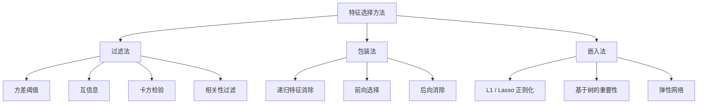
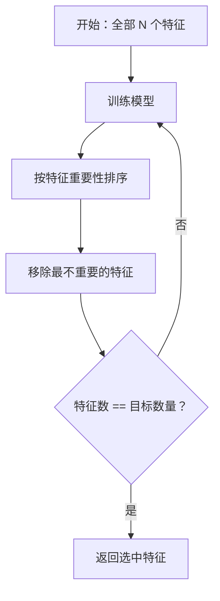
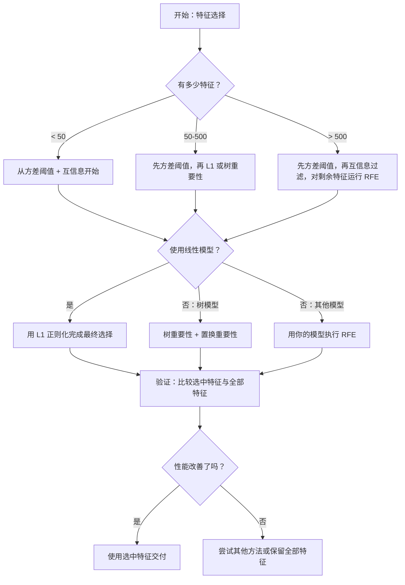

# 特征选择（Feature Selection）

> 特征不是越多越好，而是选对了才好。

**Type:** Build
**Language:** Python
**Prerequisites:** 第 2 阶段，第 01–09 课、08 课：特征工程（Feature Engineering）
**Time:** 约 75 分钟

## 学习目标（Learning Objectives）

- 从零实现过滤法（Filter Methods），包括方差阈值、互信息、卡方检验，以及包装法（Wrapper Methods），包括 RFE 和前向选择
- 解释互信息为何能捕捉相关性遗漏的非线性特征–目标关系
- 比较 L1 正则化（嵌入式选择）与 RFE（包装式选择），评估计算成本的权衡
- 构建组合多种方法的特征选择流水线，展示在留出数据上的泛化改善

## 问题（The Problem）

你有 500 个特征。模型训练慢、不断过拟合，没人能解释它学到了什么。你希望通过增加特征改善性能，结果更糟。

这就是维度灾难（Curse of Dimensionality）。随着特征数增长，特征空间体积爆炸，数据点变稀疏，点间距离趋同。模型需要指数增长的数据量才能找到真实模式。噪声特征淹没有效信号，过拟合成为常态。

特征选择就是解药：剥离噪声、移除冗余，保留真正携带目标信息的特征。结果是训练更快、泛化更好，模型也能解释清楚。

目标不是用尽所有可用信息，而是使用正确的信息。

## 核心概念（The Concept）

### 特征选择的三类方法（Three Categories of Feature Selection）

每种特征选择方法都属于以下三类之一：



**过滤法（Filter Methods）**用统计量独立评价每个特征，不使用模型。速度快，但会遗漏特征交互。

**包装法（Wrapper Methods）**通过训练模型评估特征子集，以模型性能作为得分。结果更好，但需要多次重新训练，成本高。

**嵌入法（Embedded Methods）**在模型训练过程中选择特征。L1 正则化将权重压到零，决策树按最有用特征分裂。选择发生在拟合期间，而非单独步骤。

### 方差阈值（Variance Threshold）

最简单的过滤方法。如果一个特征在不同样本间几乎不变，它就几乎没有信息。

考虑一个特征，在 1000 个样本中的 999 个上都为 0.0，其方差接近零。没有模型能用它区分类别，应将其移除。

```
variance(x) = mean((x - mean(x))^2)
```

设置阈值，例如 0.01，删除方差低于该值的所有特征。这会移除常量或近常量特征，完全不需要查看目标变量。

适用时机：在其他方法之前作为预处理，几乎零成本地找到明显无用的特征。

局限：高方差特征仍可能是纯噪声。方差阈值必要，但并不充分。

### 互信息（Mutual Information）

互信息衡量知道特征 X 的值后，目标 Y 的不确定性降低了多少。

```
I(X; Y) = sum_x sum_y p(x, y) * log(p(x, y) / (p(x) * p(y)))
```

如果 X 与 Y 独立，p(x, y) = p(x) * p(y)，对数项为零，I(X; Y) = 0。X 提供的 Y 信息越多，互信息越高。

相较相关性，关键优势是能捕捉非线性关系。特征与目标的相关性可能为零，但若关系为二次或周期性，互信息仍然很高。

连续特征先分箱离散化，即基于直方图估计。箱数影响估计：太少丢信息，太多增噪声。常见选择为 sqrt(n) 个箱，或斯特吉斯规则（Sturges' Rule）：1 + log2(n)。


### 递归特征消除（Recursive Feature Elimination，RFE）

RFE 是包装法，利用模型自身的特征重要性迭代剪除：

1. 用全部特征训练模型
2. 按重要性排序，线性模型使用系数，树使用不纯度下降
3. 移除最不重要的一个或多个特征
4. 重复，直到剩下目标数量的特征



模型同时看到所有剩余特征，因此 RFE 能考虑特征交互。删除一个特征会改变其他特征的重要性，这使它比过滤法更彻底。

代价是训练模型 N - target 次。若有 500 个特征，目标保留 10 个，就要训练 490 次。对于昂贵模型，这很慢。可通过每步移除多个特征加速，例如每轮移除末尾 10%。

### L1 / Lasso 正则化（L1 / Lasso Regularization）

L1 正则化将权重绝对值之和加入损失函数：

```
loss = prediction_error + alpha * sum(|w_i|)
```

alpha 控制特征剪除强度。alpha 越高，越多权重会精确变为零。

为何恰好为零？L1 惩罚在权重空间形成菱形约束区域，最优解倾向落在菱形顶点，此处一个或多个权重为零。L2 正则化，即岭回归（Ridge），形成圆形约束，权重会缩小却很少恰好为零。

这就是嵌入式特征选择：模型在训练中学习忽略哪些特征，零权重特征实际上被移除了。

优点：只训练一次，能处理相关特征，选一个并将其他权重置零，大多数线性模型实现已内置支持。

局限：仅适用于线性模型，无法捕捉非线性特征重要性。

### 基于树的特征重要性（Tree-Based Feature Importance）

决策树及其集成，如随机森林、梯度提升，天然能对特征排序。每次分裂降低不纯度（Impurity），分类使用基尼不纯度或熵，回归使用方差。带来更大不纯度下降的特征更重要。

对包含 T 棵树的随机森林：

```
importance(feature_j) = (1/T) * sum over all trees of
    sum over all nodes splitting on feature_j of
        (n_samples * impurity_decrease)
```

这为每个特征提供归一化重要性得分，自动处理非线性关系与特征交互。

注意：树重要性偏向具有很多不同值的特征，即高基数（High Cardinality）特征。随机 ID 列看起来也会重要，因为它能完美拆分每个样本。应使用置换重要性进行合理性检查。

### 置换重要性（Permutation Importance）

一种与模型无关的方法：

1. 训练模型，记录验证数据上的基线性能
2. 对每个特征随机打乱取值，测量性能下降
3. 下降越大，特征越重要

打乱特征不影响性能，说明模型不依赖它；性能崩溃，则说明它至关重要。

置换重要性避免树重要性的基数偏差，但速度慢：每个特征要完整评估一次，还要多次重复以获得稳定结果。

### 方法对照表（Comparison Table）

| 方法 | 类型 | 速度 | 非线性 | 特征交互 |
|--------|------|-------|-----------|---------------------|
| 方差阈值（Variance Threshold） | 过滤法 | 很快 | 否 | 否 |
| 互信息（Mutual Information） | 过滤法 | 快 | 是 | 否 |
| 相关性过滤（Correlation Filter） | 过滤法 | 快 | 否 | 否 |
| 递归特征消除（RFE） | 包装法 | 慢 | 取决于模型 | 是 |
| L1 / Lasso | 嵌入法 | 快 | 否，仅线性 | 否 |
| 树重要性（Tree Importance） | 嵌入法 | 中等 | 是 | 是 |
| 置换重要性（Permutation Importance） | 与模型无关 | 慢 | 是 | 是 |

### 决策流程图（Decision Flowchart）



```figure
f3-feature-prune
```

## 动手实现（Build It）

### 第 1 步：生成特征结构已知的合成数据（Generate Synthetic Data with Known Feature Structure）

```python
import numpy as np


def make_feature_selection_data(n_samples=500, seed=42):
    rng = np.random.RandomState(seed)

    x1 = rng.randn(n_samples)
    x2 = rng.randn(n_samples)
    x3 = rng.randn(n_samples)
    x4 = x1 + 0.1 * rng.randn(n_samples)
    x5 = x2 + 0.1 * rng.randn(n_samples)

    informative = np.column_stack([x1, x2, x3, x4, x5])

    correlated = np.column_stack([
        x1 * 0.9 + 0.1 * rng.randn(n_samples),
        x2 * 0.8 + 0.2 * rng.randn(n_samples),
        x3 * 0.7 + 0.3 * rng.randn(n_samples),
        x1 * 0.5 + x2 * 0.5 + 0.1 * rng.randn(n_samples),
        x2 * 0.6 + x3 * 0.4 + 0.1 * rng.randn(n_samples),
    ])

    noise = rng.randn(n_samples, 10) * 0.5

    X = np.hstack([informative, correlated, noise])
    y = (2 * x1 - 1.5 * x2 + x3 + 0.5 * rng.randn(n_samples) > 0).astype(int)

    feature_names = (
        [f"info_{i}" for i in range(5)]
        + [f"corr_{i}" for i in range(5)]
        + [f"noise_{i}" for i in range(10)]
    )

    return X, y, feature_names
```

我们知道真实结构：特征 0–4 含有信息，其中 3 和 4 还是 0 和 1 的相关副本；特征 5–9 与有效特征相关；特征 10–19 是纯噪声。好的选择方法应将 0–4 排在最前，10–19 排在最后。

### 第 2 步：方差阈值（Variance Threshold）

```python
def variance_threshold(X, threshold=0.01):
    variances = np.var(X, axis=0)
    mask = variances > threshold
    return mask, variances
```

### 第 3 步：离散互信息（Mutual Information, Discrete）

```python
def discretize(x, n_bins=10):
    min_val, max_val = x.min(), x.max()
    if max_val == min_val:
        return np.zeros_like(x, dtype=int)
    bin_edges = np.linspace(min_val, max_val, n_bins + 1)
    binned = np.digitize(x, bin_edges[1:-1])
    return binned


def mutual_information(X, y, n_bins=10):
    n_samples, n_features = X.shape
    mi_scores = np.zeros(n_features)

    y_vals, y_counts = np.unique(y, return_counts=True)
    p_y = y_counts / n_samples

    for f in range(n_features):
        x_binned = discretize(X[:, f], n_bins)
        x_vals, x_counts = np.unique(x_binned, return_counts=True)
        p_x = dict(zip(x_vals, x_counts / n_samples))

        mi = 0.0
        for xv in x_vals:
            for yi, yv in enumerate(y_vals):
                joint_mask = (x_binned == xv) & (y == yv)
                p_xy = np.sum(joint_mask) / n_samples
                if p_xy > 0:
                    mi += p_xy * np.log(p_xy / (p_x[xv] * p_y[yi]))
        mi_scores[f] = mi

    return mi_scores
```

### 第 4 步：递归特征消除（Recursive Feature Elimination）

```python
def simple_logistic_importance(X, y, lr=0.1, epochs=100):
    n_samples, n_features = X.shape
    w = np.zeros(n_features)
    b = 0.0

    for _ in range(epochs):
        z = X @ w + b
        pred = 1.0 / (1.0 + np.exp(-np.clip(z, -500, 500)))
        error = pred - y
        w -= lr * (X.T @ error) / n_samples
        b -= lr * np.mean(error)

    return w, b


def rfe(X, y, n_features_to_select=5, lr=0.1, epochs=100):
    n_total = X.shape[1]
    remaining = list(range(n_total))
    rankings = np.ones(n_total, dtype=int)
    rank = n_total

    while len(remaining) > n_features_to_select:
        X_subset = X[:, remaining]
        w, _ = simple_logistic_importance(X_subset, y, lr, epochs)
        importances = np.abs(w)

        least_idx = np.argmin(importances)
        original_idx = remaining[least_idx]
        rankings[original_idx] = rank
        rank -= 1
        remaining.pop(least_idx)

    for idx in remaining:
        rankings[idx] = 1

    selected_mask = rankings == 1
    return selected_mask, rankings
```

### 第 5 步：L1 特征选择（L1 Feature Selection）

```python
def soft_threshold(w, alpha):
    return np.sign(w) * np.maximum(np.abs(w) - alpha, 0)


def l1_feature_selection(X, y, alpha=0.1, lr=0.01, epochs=500):
    n_samples, n_features = X.shape
    w = np.zeros(n_features)
    b = 0.0

    for _ in range(epochs):
        z = X @ w + b
        pred = 1.0 / (1.0 + np.exp(-np.clip(z, -500, 500)))
        error = pred - y

        gradient_w = (X.T @ error) / n_samples
        gradient_b = np.mean(error)

        w -= lr * gradient_w
        w = soft_threshold(w, lr * alpha)
        b -= lr * gradient_b

    selected_mask = np.abs(w) > 1e-6
    return selected_mask, w
```

### 第 6 步：基于简单决策树的重要性（Tree-Based Importance, Simple Decision Tree）

```python
def gini_impurity(y):
    if len(y) == 0:
        return 0.0
    classes, counts = np.unique(y, return_counts=True)
    probs = counts / len(y)
    return 1.0 - np.sum(probs ** 2)


def best_split(X, y, feature_idx):
    values = np.unique(X[:, feature_idx])
    if len(values) <= 1:
        return None, -1.0

    best_threshold = None
    best_gain = -1.0
    parent_gini = gini_impurity(y)
    n = len(y)

    for i in range(len(values) - 1):
        threshold = (values[i] + values[i + 1]) / 2.0
        left_mask = X[:, feature_idx] <= threshold
        right_mask = ~left_mask

        n_left = np.sum(left_mask)
        n_right = np.sum(right_mask)

        if n_left == 0 or n_right == 0:
            continue

        gain = parent_gini - (n_left / n) * gini_impurity(y[left_mask]) - (n_right / n) * gini_impurity(y[right_mask])

        if gain > best_gain:
            best_gain = gain
            best_threshold = threshold

    return best_threshold, best_gain


def tree_importance(X, y, n_trees=50, max_depth=5, seed=42):
    rng = np.random.RandomState(seed)
    n_samples, n_features = X.shape
    importances = np.zeros(n_features)

    for _ in range(n_trees):
        sample_idx = rng.choice(n_samples, size=n_samples, replace=True)
        feature_subset = rng.choice(n_features, size=max(1, int(np.sqrt(n_features))), replace=False)

        X_boot = X[sample_idx]
        y_boot = y[sample_idx]

        tree_imp = _build_tree_importance(X_boot, y_boot, feature_subset, max_depth)
        importances += tree_imp

    total = importances.sum()
    if total > 0:
        importances /= total

    return importances


def _build_tree_importance(X, y, feature_subset, max_depth, depth=0):
    n_features = X.shape[1]
    importances = np.zeros(n_features)

    if depth >= max_depth or len(np.unique(y)) <= 1 or len(y) < 4:
        return importances

    best_feature = None
    best_threshold = None
    best_gain = -1.0

    for f in feature_subset:
        threshold, gain = best_split(X, y, f)
        if gain > best_gain:
            best_gain = gain
            best_feature = f
            best_threshold = threshold

    if best_feature is None or best_gain <= 0:
        return importances

    importances[best_feature] += best_gain * len(y)

    left_mask = X[:, best_feature] <= best_threshold
    right_mask = ~left_mask

    importances += _build_tree_importance(X[left_mask], y[left_mask], feature_subset, max_depth, depth + 1)
    importances += _build_tree_importance(X[right_mask], y[right_mask], feature_subset, max_depth, depth + 1)

    return importances
```

### 第 7 步：运行并比较所有方法（Run All Methods and Compare）

代码文件在同一合成数据集上运行全部五种方法，打印对照表，展示各方法选择的特征。

## 实际应用（Use It）

使用 scikit-learn，可以将特征选择内置于流水线：

```python
from sklearn.feature_selection import (
    VarianceThreshold,
    mutual_info_classif,
    RFE,
    SelectFromModel,
)
from sklearn.linear_model import Lasso, LogisticRegression
from sklearn.ensemble import RandomForestClassifier

vt = VarianceThreshold(threshold=0.01)
X_filtered = vt.fit_transform(X)

mi_scores = mutual_info_classif(X, y)
top_k = np.argsort(mi_scores)[-10:]

rfe_selector = RFE(LogisticRegression(), n_features_to_select=10)
rfe_selector.fit(X, y)
X_rfe = rfe_selector.transform(X)

lasso_selector = SelectFromModel(Lasso(alpha=0.01))
lasso_selector.fit(X, y)
X_lasso = lasso_selector.transform(X)

rf = RandomForestClassifier(n_estimators=100)
rf.fit(X, y)
importances = rf.feature_importances_
```

从零实现展示了每种方法内部的确切过程：方差阈值只是计算 `var(X, axis=0)` 并应用掩码；互信息是在列联表（Contingency Table）中统计联合与边际频率；RFE 是训练、排序、剪除的循环；L1 是带软阈值（Soft-Thresholding）步骤的梯度下降；树重要性累计各次分裂的不纯度下降。没有魔法，只有统计与循环。

sklearn 版本增加了鲁棒性，例如 mutual_info_classif 使用 k 近邻密度估计而非分箱，还通过 C 实现加速，并支持流水线集成。

## 交付成果（Ship It）

本课产出：
- `outputs/skill-feature-selector.md`：选择正确特征选择方法的速查决策树

## 练习（Exercises）

1. **前向选择（Forward Selection）：**实现 RFE 的反向过程。从零个特征开始，每步加入最能改善模型性能的特征，直到增加特征不再有帮助。与 RFE 比较选中特征。哪个更快？哪个结果更好？

2. **稳定性选择（Stability Selection）：**运行 L1 特征选择 50 次，每次使用随机 80% 数据子样本和略有不同的 alpha。统计每个特征被选择的频率，超过 80% 次数被选中的特征称为“稳定”。与单次 L1 选择比较，哪个更可靠？

3. **多重共线性检测（Multicollinearity Detection）：**计算所有特征的相关矩阵。实现函数，给定相关阈值，例如 0.9，从每对高度相关特征中删除一个，保留与目标互信息更高的那个。在合成数据集上测试，验证它能删除冗余相关特征。

4. **特征选择流水线：**将方差阈值、互信息过滤和 RFE 串成一条流水线。先去掉近零方差特征，再按互信息保留前 50%，最后对剩余特征执行 RFE。与直接对全部特征运行 RFE 比较，流水线是否更快？准确率相同吗？

5. **从零实现置换重要性：**对每个特征打乱取值 10 次，测量 F1 得分的平均下降。与树重要性排序比较，找出两者不一致的情况并解释原因，提示：相关特征。

## 关键术语（Key Terms）

| 术语 | 常见说法 | 实际含义 |
|------|----------------|----------------------|
| 过滤法（Filter Method） | “独立评价特征” | 不训练模型，使用统计量分别评估和排序每个特征的选择方法 |
| 包装法（Wrapper Method） | “让模型挑特征” | 训练模型评估特征子集，以性能为选择标准的方法 |
| 嵌入法（Embedded Method） | “模型训练时选择特征” | 在拟合过程中进行特征选择，例如 L1 正则化将权重压到零 |
| 互信息（Mutual Information） | “一个变量告诉你多少另一个变量的信息” | 衡量已知 X 后 Y 的不确定性降低多少，同时捕捉线性和非线性依赖 |
| 递归特征消除（Recursive Feature Elimination） | “训练、排序、剪除、重复” | 训练模型、移除最不重要特征、重复直到目标数量的迭代包装法 |
| L1 / Lasso 正则化（L1 / Lasso Regularization） | “杀掉特征的惩罚” | 将权重绝对值之和加入损失，把不重要特征的权重精确压到零 |
| 方差阈值（Variance Threshold） | “移除常量特征” | 删除跨样本方差低于指定阈值的特征，过滤无信息特征 |
| 特征重要性（Feature Importance） | “哪些特征最重要” | 表示各特征对预测贡献的得分，来自树分裂增益或线性模型系数大小 |
| 置换重要性（Permutation Importance） | “打乱并测量损害” | 随机打乱各特征值，测量模型性能下降，以评估重要性 |
| 维度灾难（Curse of Dimensionality） | “特征太多，数据不够” | 增加特征使特征空间体积指数增长，数据变稀疏、距离失去意义的现象 |

## 延伸阅读（Further Reading）

- [变量与特征选择导论（An Introduction to Variable and Feature Selection，Guyon 与 Elisseeff，2003）](https://jmlr.org/papers/v3/guyon03a.html)：特征选择方法的奠基综述，至今广泛引用
- [scikit-learn 特征选择指南（Feature Selection Guide）](https://scikit-learn.org/stable/modules/feature_selection.html)：带代码示例的过滤法、包装法与嵌入法实践参考
- [稳定性选择（Stability Selection，Meinshausen 与 Buhlmann，2010）](https://arxiv.org/abs/0809.2932)：结合子采样和特征选择，获得鲁棒、可复现结果
- [警惕默认随机森林重要性（Beware Default Random Forest Importances，Strobl 等，2007）](https://bmcbioinformatics.biomedcentral.com/articles/10.1186/1471-2105-8-25)：展示树重要性的基数偏差，并提出条件重要性作为替代
