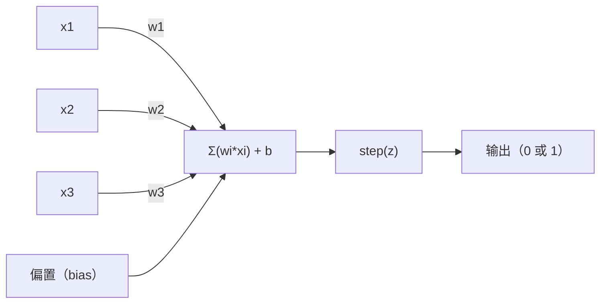
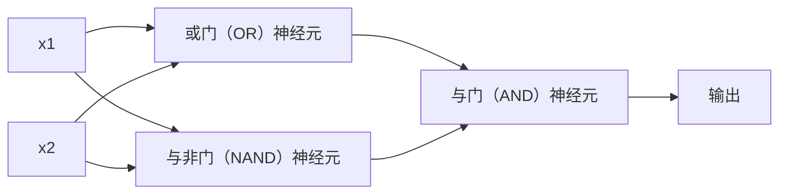

# 感知机（The Perceptron）

> 感知机（Perceptron）是神经网络（Neural Network）的基本单元。拆开来看，其中只有权重、偏置和一次决策。

**Type:** Build
**Languages:** Python
**Prerequisites:** 阶段 1（线性代数直觉，Linear Algebra Intuition）
**Time:** ~60 分钟

## 学习目标（Learning Objectives）

- 用 Python 从零实现感知机，包括权重更新规则与阶跃激活函数（Step Activation Function）
- 解释为什么单个感知机只能解决线性可分（Linearly Separable）问题，并演示学习异或（Exclusive OR，XOR）失败的情况
- 组合或门（OR）、与非门（NAND）和与门（AND），构建多层感知机（Multi-Layer Perceptron，MLP）来解决 XOR 问题
- 使用 Sigmoid 激活函数与反向传播（Backpropagation）训练双层网络，使其自动学会 XOR

## 问题（The Problem）

你已经了解向量（Vector）和点积（Dot Product），也知道矩阵能将输入变换为输出。但机器如何*学会*该采用哪种变换？

感知机回答了这个问题。它是一种最简单的学习机器：接收输入、乘以权重（Weight）、加上偏置（Bias），然后作出二元决策，再进行调整。仅此而已。所有神经网络都是将这个想法逐层堆叠而成的。

理解感知机，也就理解了代码中的“学习”究竟是什么：调整数值，直到输出与实际情况相符。

## 概念（The Concept）

### 一个神经元，一次决策（One Neuron, One Decision）

感知机接收 n 个输入，将每个输入乘以相应权重后求和，加上偏置，再将结果传入激活函数（Activation Function）。



阶跃函数（Step Function）的处理很直接：如果加权和加上偏置 >= 0，就输出 1；否则输出 0。

```
step(z) = 1  if z >= 0
           0  if z < 0
```

这是一个线性分类器（Linear Classifier）。权重和偏置定义了一条直线（在更高维度中则是超平面，Hyperplane），将输入空间划分为两个区域。

### 决策边界（The Decision Boundary）

对于两个输入，感知机会在二维空间中画出一条直线：

```
  x2
  ┤
  │  类别 1         /
  │    (0)          /
  │                /
  │               / w1·x1 + w2·x2 + b = 0
  │              /
  │             /     类别 2
  │            /        (1)
  ┼───────────/──────────── x1
```

直线一侧的所有点输出 0，另一侧的所有点输出 1。训练会移动这条直线，直到它能正确区分类别。

### 学习规则（The Learning Rule）

感知机的学习规则很简单：

```
对于每个训练样本 (x, y_true)：
    y_pred = predict(x)
    error = y_true - y_pred

    对于每个权重：
        w_i = w_i + learning_rate * error * x_i
    bias = bias + learning_rate * error
```

如果预测正确，error = 0，不作任何修改。如果预测为 0、实际应为 1，权重增大；如果预测为 1、实际应为 0，权重减小。学习率（Learning Rate）控制每次调整的幅度。

### XOR 问题（The XOR Problem）

感知机在这里遇到了局限。看看这些逻辑门：

```
与门（AND）：        或门（OR）：        异或门（XOR）：
x1  x2  out         x1  x2  out         x1  x2  out
0   0   0           0   0   0           0   0   0
0   1   0           0   1   1           0   1   1
1   0   0           1   0   1           1   0   1
1   1   1           1   1   1           1   1   0
```

AND 和 OR 是线性可分的：画一条直线就能把输出为 0 的点与输出为 1 的点分开。XOR 则不行。不存在一条直线能将 [0,1] 和 [1,0] 与 [0,0] 和 [1,1] 分开。

```
AND（线性可分）：       XOR（线性不可分）：

  x2                      x2
  1 ┤  0     1            1 ┤  1     0
    │     /                 │
  0 ┤  0 / 0              0 ┤  0     1
    ┼──/──────── x1         ┼──────────── x1
       一条直线就够！       任何单条直线都不行！
```

这是一项根本局限：单个感知机只能解决线性可分的问题。Minsky 和 Papert 在 1969 年证明了这一点，随后近十年间，神经网络研究几乎陷入停滞。

解决方法是将感知机堆叠成多层。多层感知机能把两个线性决策组合成一个非线性决策，从而解决 XOR 问题。

```figure
perceptron-boundary
```

## 动手实现（Build It）

### 步骤 1：Perceptron 类（Step 1: The Perceptron class）

```python
class Perceptron:
    def __init__(self, n_inputs, learning_rate=0.1):
        self.weights = [0.0] * n_inputs
        self.bias = 0.0
        self.lr = learning_rate

    def predict(self, inputs):
        total = sum(w * x for w, x in zip(self.weights, inputs))
        total += self.bias
        return 1 if total >= 0 else 0

    def train(self, training_data, epochs=100):
        for epoch in range(epochs):
            errors = 0
            for inputs, target in training_data:
                prediction = self.predict(inputs)
                error = target - prediction
                if error != 0:
                    errors += 1
                    for i in range(len(self.weights)):
                        self.weights[i] += self.lr * error * inputs[i]
                    self.bias += self.lr * error
            if errors == 0:
                print(f"Converged at epoch {epoch + 1}")
                return
        print(f"Did not converge after {epochs} epochs")
```

### 步骤 2：训练逻辑门（Step 2: Train on logic gates）

```python
and_data = [
    ([0, 0], 0),
    ([0, 1], 0),
    ([1, 0], 0),
    ([1, 1], 1),
]

or_data = [
    ([0, 0], 0),
    ([0, 1], 1),
    ([1, 0], 1),
    ([1, 1], 1),
]

not_data = [
    ([0], 1),
    ([1], 0),
]

print("=== AND Gate ===")
p_and = Perceptron(2)
p_and.train(and_data)
for inputs, _ in and_data:
    print(f"  {inputs} -> {p_and.predict(inputs)}")

print("\n=== OR Gate ===")
p_or = Perceptron(2)
p_or.train(or_data)
for inputs, _ in or_data:
    print(f"  {inputs} -> {p_or.predict(inputs)}")

print("\n=== NOT Gate ===")
p_not = Perceptron(1)
p_not.train(not_data)
for inputs, _ in not_data:
    print(f"  {inputs} -> {p_not.predict(inputs)}")
```

### 步骤 3：观察 XOR 学习失败（Step 3: Watch XOR fail）

```python
xor_data = [
    ([0, 0], 0),
    ([0, 1], 1),
    ([1, 0], 1),
    ([1, 1], 0),
]

print("\n=== XOR Gate (single perceptron) ===")
p_xor = Perceptron(2)
p_xor.train(xor_data, epochs=1000)
for inputs, expected in xor_data:
    result = p_xor.predict(inputs)
    status = "OK" if result == expected else "WRONG"
    print(f"  {inputs} -> {result} (expected {expected}) {status}")
```

它永远不会收敛（Converge）。这直接展示了单个感知机无法学会 XOR。

### 步骤 4：用两层网络解决 XOR（Step 4: Solve XOR with two layers）

关键在于：XOR = (x1 OR x2) AND NOT (x1 AND x2)。把三个感知机组合起来：



```python
def xor_network(x1, x2):
    or_neuron = Perceptron(2)
    or_neuron.weights = [1.0, 1.0]
    or_neuron.bias = -0.5

    nand_neuron = Perceptron(2)
    nand_neuron.weights = [-1.0, -1.0]
    nand_neuron.bias = 1.5

    and_neuron = Perceptron(2)
    and_neuron.weights = [1.0, 1.0]
    and_neuron.bias = -1.5

    hidden1 = or_neuron.predict([x1, x2])
    hidden2 = nand_neuron.predict([x1, x2])
    output = and_neuron.predict([hidden1, hidden2])
    return output


print("\n=== XOR Gate (multi-layer network) ===")
for inputs, expected in xor_data:
    result = xor_network(inputs[0], inputs[1])
    print(f"  {inputs} -> {result} (expected {expected})")
```

四种情况的结果都正确。把感知机堆叠成多层，就能构造出单个感知机无法产生的决策边界。

### 步骤 5：训练双层网络（Step 5: Train a Two-Layer Network）

步骤 4 中的权重是手动设定的。这对 XOR 有效，但现实问题中你无法预先知道正确的权重，因此不能照搬。解决方法是用 Sigmoid 函数替换阶跃函数，通过反向传播自动学习权重。

```python
class TwoLayerNetwork:
    def __init__(self, learning_rate=0.5):
        import random
        random.seed(0)
        self.w_hidden = [[random.uniform(-1, 1), random.uniform(-1, 1)] for _ in range(2)]
        self.b_hidden = [random.uniform(-1, 1), random.uniform(-1, 1)]
        self.w_output = [random.uniform(-1, 1), random.uniform(-1, 1)]
        self.b_output = random.uniform(-1, 1)
        self.lr = learning_rate

    def sigmoid(self, x):
        import math
        x = max(-500, min(500, x))
        return 1.0 / (1.0 + math.exp(-x))

    def forward(self, inputs):
        self.inputs = inputs
        self.hidden_outputs = []
        for i in range(2):
            z = sum(w * x for w, x in zip(self.w_hidden[i], inputs)) + self.b_hidden[i]
            self.hidden_outputs.append(self.sigmoid(z))
        z_out = sum(w * h for w, h in zip(self.w_output, self.hidden_outputs)) + self.b_output
        self.output = self.sigmoid(z_out)
        return self.output

    def train(self, training_data, epochs=10000):
        for epoch in range(epochs):
            total_error = 0
            for inputs, target in training_data:
                output = self.forward(inputs)
                error = target - output
                total_error += error ** 2

                d_output = error * output * (1 - output)

                saved_w_output = self.w_output[:]
                hidden_deltas = []
                for i in range(2):
                    h = self.hidden_outputs[i]
                    hd = d_output * saved_w_output[i] * h * (1 - h)
                    hidden_deltas.append(hd)

                for i in range(2):
                    self.w_output[i] += self.lr * d_output * self.hidden_outputs[i]
                self.b_output += self.lr * d_output

                for i in range(2):
                    for j in range(len(inputs)):
                        self.w_hidden[i][j] += self.lr * hidden_deltas[i] * inputs[j]
                    self.b_hidden[i] += self.lr * hidden_deltas[i]
```

```python
net = TwoLayerNetwork(learning_rate=2.0)
net.train(xor_data, epochs=10000)
for inputs, expected in xor_data:
    result = net.forward(inputs)
    predicted = 1 if result >= 0.5 else 0
    print(f"  {inputs} -> {result:.4f} (rounded: {predicted}, expected {expected})")
```

这与步骤 4 有两个关键区别。首先，Sigmoid 替代了阶跃函数：它是平滑的，因此存在梯度（Gradient）。其次，`train` 方法将误差从输出层反向传到隐藏层（Hidden Layer），按照每个权重对误差的贡献成比例地调整权重。这就是用 20 行代码实现的反向传播。

这为第 03 课作了铺垫。`d_output` 和 `hidden_deltas` 背后的数学原理，就是将链式法则（Chain Rule）应用到网络计算图上。我们将在那一课中作完整推导。

## 实际应用（Use It）

刚才从零实现的功能，通过一次导入就能获得：

```python
from sklearn.linear_model import Perceptron as SkPerceptron
import numpy as np

X = np.array([[0,0],[0,1],[1,0],[1,1]])
y = np.array([0, 0, 0, 1])

clf = SkPerceptron(max_iter=100, tol=1e-3)
clf.fit(X, y)
print([clf.predict([x])[0] for x in X])
```

只需五行。你写的 30 行 `Perceptron` 类做的是同一件事。sklearn 版本还提供了收敛检查、多种损失函数（Loss Function）和稀疏输入支持，但核心循环完全一样：求加权和、应用阶跃函数、出错时更新权重。

真正的差异体现在规模上。生产环境的网络会有以下变化：

- 阶跃函数被替换为 Sigmoid、修正线性单元（Rectified Linear Unit，ReLU）或其他平滑激活函数
- 通过反向传播自动学习权重（第 03 课）
- 网络层数增加：3 层、10 层、100 层以上
- 基本原理不变：每层从上一层的输出中创建新特征

单个感知机只能画直线。把它们堆叠起来，就能画出任意形状。

## 交付成果（Ship It）

本课产出：
- `outputs/skill-perceptron.md`：说明何时使用单层或多层架构的技能文档

## 练习（Exercises）

1. 训练一个感知机来实现与非门（NAND，它是通用逻辑门，任何逻辑电路都可以由 NAND 构建）。验证它的权重和偏置是否构成有效的决策边界。
2. 修改 Perceptron 类，记录每个训练轮次（Epoch）的决策边界 (w1*x1 + w2*x2 + b = 0)。打印训练 AND 门时这条直线如何移动。
3. 构建一个具有 3 个输入的感知机，仅当其中至少 2 个输入为 1 时才输出 1（即多数投票函数）。这个问题是线性可分的吗？为什么？

## 关键术语（Key Terms）

| 术语 | 常见说法 | 实际含义 |
|------|----------------|----------------------|
| 感知机（Perceptron） | “一个仿真神经元” | 线性分类器：计算输入与权重的点积，加上偏置，再通过阶跃函数 |
| 权重（Weight） | “输入有多重要” | 缩放每个输入对决策贡献的乘数 |
| 偏置（Bias） | “阈值” | 移动决策边界的常数，使感知机即使在输入全为零时也能激活 |
| 激活函数（Activation Function） | “把数值压缩一下的东西” | 应用于加权和之后的函数：感知机使用阶跃函数，现代网络使用 Sigmoid/ReLU |
| 线性可分（Linearly Separable） | “可以画一条线把它们分开” | 一个超平面就能将各类别完全分开的数据集性质 |
| XOR 问题（XOR Problem） | “感知机做不到的事” | 证明单层网络无法学会线性不可分的函数 |
| 决策边界（Decision Boundary） | “分类器改变判断的位置” | 将输入空间划分为两个类别的超平面 w*x + b = 0 |
| 多层感知机（Multi-Layer Perceptron，MLP） | “真正的神经网络” | 分层堆叠的感知机，每一层的输出作为下一层的输入 |

## 延伸阅读（Further Reading）

- Frank Rosenblatt，《感知机：大脑信息存储与组织的概率模型（The Perceptron: A Probabilistic Model for Information Storage and Organization in the Brain）》（1958）：开创这一研究方向的原始论文
- Minsky 与 Papert，《感知机（Perceptrons）》（1969）：证明单层网络无法解决 XOR 问题的著作，使感知机研究停滞了近十年
- Michael Nielsen，《神经网络与深度学习（Neural Networks and Deep Learning）》第 1 章 (http://neuralnetworksanddeeplearning.com/)：免费在线阅读，以出色的可视化方式解释感知机如何组成网络
