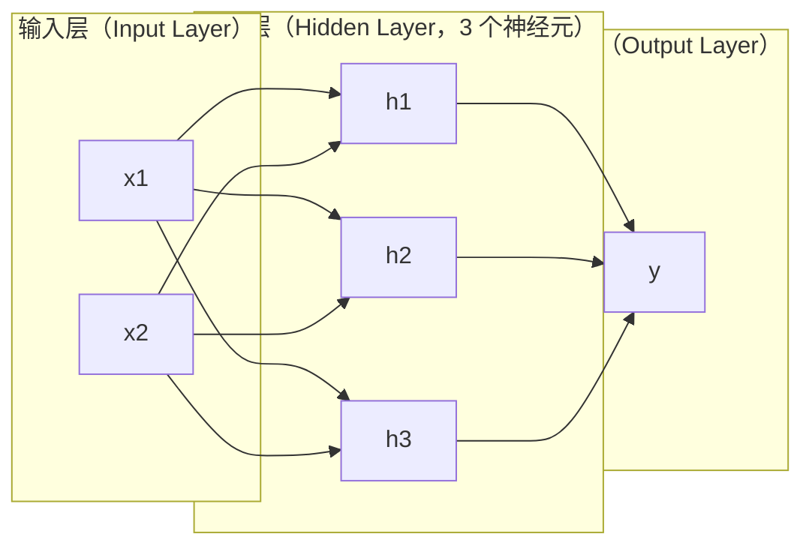
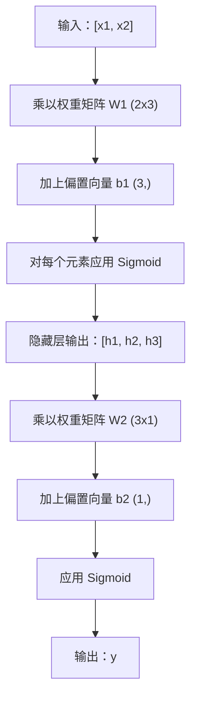

# 多层网络与前向传播（Multi-Layer Networks and Forward Pass）

> 一个神经元画一条直线。将它们堆叠起来，就能画出任意形状。

**Type:** Build
**Languages:** Python
**Prerequisites:** 阶段 01（数学基础，Math Foundations），第 03.01 课（感知机，The Perceptron）
**Time:** ~90 分钟

## 学习目标（Learning Objectives）

- 从零构建包含 Layer 和 Network 类的多层网络，执行完整的前向传播（Forward Pass）
- 追踪网络各层的矩阵维度，识别形状不匹配问题
- 解释堆叠非线性激活如何使网络学会弯曲的决策边界（Decision Boundary）
- 使用手动调整 Sigmoid 权重的 2-2-1 架构解决 XOR 问题

## 问题（The Problem）

单个神经元只能画线，仅此而已：在数据中画一条直线。AI 中的实际问题，包括图像识别、语言理解和下围棋，都需要曲线。将神经元堆叠成层，就能得到曲线。

1969 年，Minsky 和 Papert 证明了这一局限的致命性：单层网络无法学会 XOR。不是“难以学会”，而是在数学上不可能。XOR 真值表将 [0,1] 和 [1,0] 归为一类，将 [0,0] 和 [1,1] 归为另一类，没有一条直线能将它们分开。

这使神经网络研究资助中断了十多年。事后看，解决方法很明显：不再只用一层，而是将神经元堆叠成多层。让第一层把输入空间划分为新特征，再让第二层组合这些特征，作出任何单条直线都无法作出的决策。

这种堆叠就是多层网络（Multi-Layer Network），它是当今所有生产环境深度学习模型的基础。前向传播指数据从输入经过隐藏层流向输出；要让其他部分工作，首先必须实现它。

## 概念（The Concept）

### 网络层：输入、隐藏、输出（Layers: Input, Hidden, Output）

多层网络包含三类层：

**输入层（Input Layer）**：严格来说不算真正的层。它保存原始数据，两个特征对应两个输入节点，这里不进行计算。

**隐藏层（Hidden Layers）**：实际进行计算的地方。每个神经元接收上一层的全部输出，应用权重和偏置，再将结果传入激活函数（Activation Function）。称为“隐藏”，是因为训练数据中不会直接出现这些值。

**输出层（Output Layer）**：给出最终答案。二元分类使用一个带 Sigmoid 的神经元，多分类则每个类别对应一个神经元。



这是一个 2-3-1 网络：两个输入、三个隐藏神经元、一个输出。每条连接都有权重，每个神经元（输入节点除外）都有偏置。

每层产生一个数值向量，称为隐藏状态（Hidden State）。对于文本，隐藏状态增加维度，将一个词编码为 768 个数字来捕捉语义；对于图像，则降低维度，将数百万像素压缩为可处理的表示。学习成果就体现在隐藏状态中。

### 神经元与激活（Neurons and Activations）

每个神经元做三件事：

1. 将每个输入乘以对应权重
2. 对所有乘积求和并加上偏置
3. 将结果传入激活函数

目前使用 Sigmoid 激活函数：

```
sigmoid(z) = 1 / (1 + e^(-z))
```

Sigmoid 将任意数压缩到 (0, 1) 区间。较大的正输入使输出趋近 1，较大的负输入使输出趋近 0，零映射到 0.5。这条平滑曲线让学习成为可能：不同于感知机的硬阶跃，Sigmoid 处处都有梯度（Gradient）。

### 前向传播：数据如何流动（Forward Pass: How Data Flows）

前向传播将输入数据逐层传过网络，直到输出。前向传播期间不发生学习，只进行计算：乘法、加法、激活，然后重复。



每层依次执行三项操作：

```
z = W * input + b       （线性变换，Linear Transformation）
a = sigmoid(z)           （激活，Activation）
```

一层的输出成为下一层的输入，这就是整个前向传播过程。

### 矩阵维度（Matrix Dimensions）

追踪维度是深度学习中最重要的调试技能。以下是 2-3-1 网络的维度：

| 步骤 | 运算 | 维度 | 结果形状 |
|------|-----------|------------|-------------|
| 输入 | x | -- | (2,) |
| 隐藏层线性运算 | W1 * x + b1 | W1: (3, 2), b1: (3,) | (3,) |
| 隐藏层激活 | sigmoid(z1) | -- | (3,) |
| 输出层线性运算 | W2 * h + b2 | W2: (1, 3), b2: (1,) | (1,) |
| 输出层激活 | sigmoid(z2) | -- | (1,) |

规则是：第 k 层的权重矩阵 W 的形状为 (neurons_in_layer_k, neurons_in_layer_k_minus_1)。行对应当前层，列对应上一层。形状对不上，就说明存在错误。

### 通用逼近定理（Universal Approximation Theorem）

1989 年，George Cybenko 证明了一个重要结论：具有单个隐藏层且神经元足够多的神经网络，可以按任意所需精度逼近任何连续函数。

这并不意味着单隐藏层总是最优，只说明该架构在理论上有这种能力。实践中，更深的网络（层数更多、每层神经元更少）学习相同函数所需的总参数量，远少于浅而宽的网络。这就是深度学习有效的原因。

直观上，隐藏层的每个神经元学习一个“凸起”或特征。将足够多的凸起放在合适的位置，就能逼近任意平滑曲线。神经元越多，凸起越多，逼近效果越好。


### 可组合性（Composability）

神经网络可以组合：堆叠、串联，也可以并行运行。Whisper 使用编码器（Encoder）网络处理音频，再用独立的解码器（Decoder）网络生成文本。现代大语言模型（LLM）仅使用解码器，BERT 仅使用编码器，T5 同时使用编码器和解码器。架构选择决定了模型能做什么。

```figure
mlp-forward
```

## 动手实现（Build It）

使用纯 Python，不用 numpy。每项矩阵运算都从零编写。

### 步骤 1：Sigmoid 激活（Step 1: Sigmoid Activation）

```python
import math

def sigmoid(x):
    x = max(-500.0, min(500.0, x))
    return 1.0 / (1.0 + math.exp(-x))
```

将数值限制在 [-500, 500] 可以防止溢出。`math.exp(500)` 很大但有限，`math.exp(1000)` 则是无穷大。

### 步骤 2：Layer 类（Step 2: Layer Class）

整个深度学习中最重要的运算是矩阵乘法（Matrix Multiplication）。每一层、每个注意力头（Attention Head）、每次前向传播，底层都是矩阵乘法。线性层接收输入向量，乘以权重矩阵，再加上偏置向量：y = Wx + b。仅这个等式就占神经网络计算量的 90%。

一层保存一个权重矩阵和一个偏置向量，其 forward 方法接收输入向量，返回激活后的输出。

```python
class Layer:
    def __init__(self, n_inputs, n_neurons, weights=None, biases=None):
        if weights is not None:
            self.weights = weights
        else:
            import random
            self.weights = [
                [random.uniform(-1, 1) for _ in range(n_inputs)]
                for _ in range(n_neurons)
            ]
        if biases is not None:
            self.biases = biases
        else:
            self.biases = [0.0] * n_neurons

    def forward(self, inputs):
        self.last_input = inputs
        self.last_output = []
        for neuron_idx in range(len(self.weights)):
            z = sum(
                w * x for w, x in zip(self.weights[neuron_idx], inputs)
            )
            z += self.biases[neuron_idx]
            self.last_output.append(sigmoid(z))
        return self.last_output
```

权重矩阵的形状为 (n_neurons, n_inputs)。每一行是一个神经元对应全部输入的权重。forward 方法遍历神经元，计算加权和与偏置，应用 Sigmoid，然后收集结果。

### 步骤 3：Network 类（Step 3: Network Class）

网络就是层的列表。前向传播将它们串起来：第 k 层的输出传入第 k+1 层。

```python
class Network:
    def __init__(self, layers):
        self.layers = layers

    def forward(self, inputs):
        current = inputs
        for layer in self.layers:
            current = layer.forward(current)
        return current
```

这就是整个前向传播，只需四行逻辑。数据进入网络，流过每一层，再从另一端输出。

### 步骤 4：用手调权重解决 XOR（Step 4: XOR with Hand-Tuned Weights）

第 01 课中，我们组合 OR、NAND 和 AND 感知机解决了 XOR。现在用 Layer 和 Network 类完成同样的事。2-2-1 架构包含两个输入、两个隐藏神经元和一个输出。

```python
hidden = Layer(
    n_inputs=2,
    n_neurons=2,
    weights=[[20.0, 20.0], [-20.0, -20.0]],
    biases=[-10.0, 30.0],
)

output = Layer(
    n_inputs=2,
    n_neurons=1,
    weights=[[20.0, 20.0]],
    biases=[-30.0],
)

xor_net = Network([hidden, output])

xor_data = [
    ([0, 0], 0),
    ([0, 1], 1),
    ([1, 0], 1),
    ([1, 1], 0),
]

for inputs, expected in xor_data:
    result = xor_net.forward(inputs)
    predicted = 1 if result[0] >= 0.5 else 0
    print(f"  {inputs} -> {result[0]:.6f} (rounded: {predicted}, expected: {expected})")
```

较大的权重 (20, -20) 使 Sigmoid 表现得像阶跃函数。第一个隐藏神经元近似 OR，第二个近似 NAND，输出神经元对两者执行 AND，从而得到 XOR。

### 步骤 5：圆内外分类（Step 5: Circle Classification）

更难的问题：判断二维点位于以原点为中心、半径为 0.5 的圆内还是圆外。这需要弯曲的决策边界，单个感知机不可能做到。

```python
import random
import math

random.seed(42)

data = []
for _ in range(200):
    x = random.uniform(-1, 1)
    y = random.uniform(-1, 1)
    label = 1 if (x * x + y * y) < 0.25 else 0
    data.append(([x, y], label))

circle_net = Network([
    Layer(n_inputs=2, n_neurons=8),
    Layer(n_inputs=8, n_neurons=1),
])
```

使用随机权重时，网络的分类效果不好，但前向传播仍能运行。关键就在这里：前向传播只是计算。学习正确的权重依赖反向传播（Backpropagation），第 03 课将介绍它。

```python
correct = 0
for inputs, expected in data:
    result = circle_net.forward(inputs)
    predicted = 1 if result[0] >= 0.5 else 0
    if predicted == expected:
        correct += 1

print(f"Accuracy with random weights: {correct}/{len(data)} ({100*correct/len(data):.1f}%)")
```

随机权重的准确率很差，往往还不如一律猜多数类。经过训练（第 03 课），这个同样包含 8 个隐藏神经元的架构将画出一条曲线边界，区分圆内和圆外。

## 实际应用（Use It）

PyTorch 用四行就能完成以上所有功能：

```python
import torch
import torch.nn as nn

model = nn.Sequential(
    nn.Linear(2, 8),
    nn.Sigmoid(),
    nn.Linear(8, 1),
    nn.Sigmoid(),
)

x = torch.tensor([[0.0, 0.0], [0.0, 1.0], [1.0, 0.0], [1.0, 1.0]])
output = model(x)
print(output)
```

`nn.Linear(2, 8)` 对应你的 Layer 类：权重矩阵形状为 (8, 2)，偏置向量形状为 (8,)。`nn.Sigmoid()` 对每个元素应用你的 Sigmoid 函数。`nn.Sequential` 对应你的 Network 类，按顺序串联各层。

区别在于速度和规模。PyTorch 可以在 GPU 上运行，批量处理数百万个样本，并自动计算反向传播所需的梯度。但前向传播逻辑与你刚刚从零实现的完全相同。

## 交付成果（Ship It）

本课产出一个设计网络架构的可复用提示词（Prompt）：

- `outputs/prompt-network-architect.md`

针对具体问题需要决定层数、每层神经元数量以及激活函数时，可以使用它。

## 练习（Exercises）

1. 构建一个 2-4-2-1 网络（两个隐藏层），使用随机权重对 XOR 数据执行前向传播。打印中间隐藏层的输出，观察表示在每层如何变换。

2. 将圆内外分类器的隐藏层大小从 8 改成 2，再改成 32，每次都使用随机权重运行前向传播。隐藏神经元数量会改变输出范围或分布吗？为什么？

3. 为 Network 类实现 `count_parameters` 方法，返回可训练权重和偏置的总数。在 784-256-128-10 网络（经典 MNIST 架构）上测试，它有多少参数？

4. 实现 3-4-4-2 网络的前向传播。输入 RGB 颜色值（归一化到 0-1），观察两个输出。这是一个简单的二类别颜色分类器架构。

5. 用“泄漏阶跃（Leaky Step）”函数替代 Sigmoid：z < 0 时返回 0.01 * z，否则返回 1.0。使用步骤 4 相同的手调权重对 XOR 执行前向传播。它还有效吗？为什么更倾向于平滑的 Sigmoid 而非硬截断？

## 关键术语（Key Terms）

| 术语 | 常见说法 | 实际含义 |
|------|----------------|----------------------|
| 前向传播（Forward Pass） | “运行模型” | 将输入传过每层，乘以权重、加上偏置、激活，最终产生输出 |
| 隐藏层（Hidden Layer） | “中间部分” | 输入与输出之间的任一层，其数值不能在数据中直接观察到 |
| 多层网络（Multi-Layer Network） | “深度神经网络” | 按顺序堆叠的神经元层，每层的输出作为下一层的输入 |
| 激活函数（Activation Function） | “非线性” | 在线性变换之后应用的函数，使决策边界能够弯曲 |
| S 形函数（Sigmoid） | “S 曲线” | sigma(z) = 1/(1+e^(-z))，将任意实数压缩至 (0,1)，处处平滑可微 |
| 权重矩阵（Weight Matrix） | “参数” | 形状为 (current_layer_neurons, previous_layer_neurons) 的矩阵 W，包含可学习的连接强度 |
| 偏置向量（Bias Vector） | “偏移量” | 矩阵乘法之后加上的向量，让所有输入为零时神经元也能激活 |
| 通用逼近（Universal Approximation） | “神经网络什么都能学” | 神经元足够多的单隐藏层可以逼近任意连续函数，但“足够多”可能意味着数十亿个 |
| 线性变换（Linear Transformation） | “矩阵相乘那一步” | z = W * x + b，激活前将输入映射到新空间的计算 |
| 决策边界（Decision Boundary） | “分类器改变判断的位置” | 输入空间中网络输出越过分类阈值的曲面 |

## 延伸阅读（Further Reading）

- Michael Nielsen，《神经网络与深度学习（Neural Networks and Deep Learning）》第 1-2 章 (http://neuralnetworksanddeeplearning.com/)：对前向传播和网络结构最清晰的免费讲解，配有交互式可视化
- Cybenko，《Sigmoid 函数叠加的逼近（Approximation by Superpositions of a Sigmoidal Function）》（1989）：通用逼近定理的原始论文，比想象中容易阅读
- 3Blue1Brown，《神经网络究竟是什么？（But what is a neural network?）》(https://www.youtube.com/watch?v=aircAruvnKk)：用 20 分钟可视化讲解网络层、权重和前向传播，帮助建立正确的心智模型
- Goodfellow、Bengio、Courville，《深度学习（Deep Learning）》第 6 章 (https://www.deeplearningbook.org/)：多层网络的标准参考资料，可免费在线阅读
