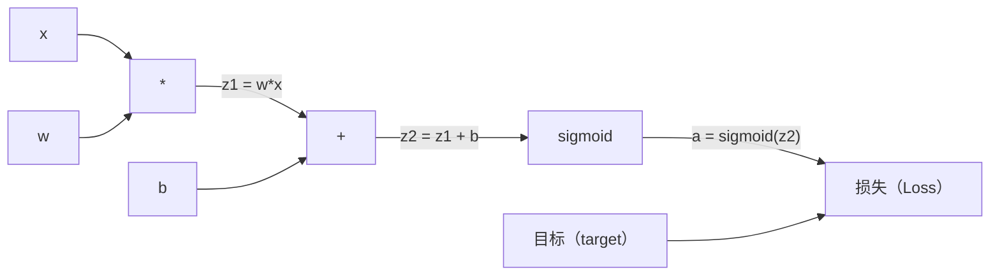
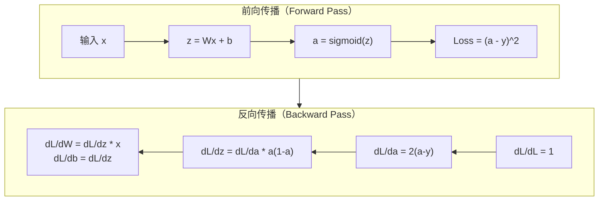
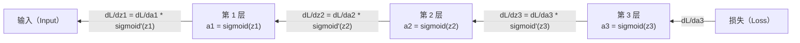

# 从零实现反向传播（Backpropagation from Scratch）

> 反向传播（Backpropagation）是让学习成为可能的算法。没有它，神经网络只是昂贵的随机数生成器。

**Type:** Build
**Languages:** Python
**Prerequisites:** 第 03.02 课（多层网络，Multi-Layer Networks）
**Time:** ~120 分钟

## 学习目标（Learning Objectives）

- 实现基于 Value 的自动求导（Autograd）引擎，构建计算图（Computational Graph）并通过拓扑排序（Topological Sort）计算梯度
- 使用链式法则（Chain Rule）推导加法、乘法及 Sigmoid 的反向传播
- 仅用自己从零实现的反向传播引擎，训练多层网络解决 XOR 和圆内外分类问题
- 识别深层 Sigmoid 网络中的梯度消失（Vanishing Gradient）问题，解释梯度为什么会指数级缩小

## 问题（The Problem）

你的网络只有一个隐藏层，包含 768 个输入和 3072 个输出，也就是 2,359,296 个权重。网络预测错了，哪些权重导致了误差？逐个测试权重需要 230 万次前向传播。反向传播只需一次反向计算，就能求出全部 230 万个梯度。这不只是优化，而是能否训练的区别。

朴素方法是：取一个权重，微调一点，再运行一次前向传播，测量损失上升还是下降，从而得到该权重的梯度。然后对网络中的每个权重重复这一过程，再乘以数千个训练步骤和数百万个数据点。要训练出有用的模型，耗时恐怕得用地质年代计算。

反向传播解决了这个问题：一次前向传播、一次反向传播，就算出所有梯度。诀窍是将微积分中的链式法则系统地应用于计算图。这个算法让深度学习走向实用；没有它，我们还会困在玩具问题上。

## 概念（The Concept）

### 将链式法则应用于网络（The Chain Rule, Applied to Networks）

阶段 01 第 05 课介绍过链式法则。快速回顾：若 y = f(g(x))，则 dy/dx = f'(g(x)) * g'(x)，即沿链条将导数相乘。

在神经网络中，“链条”是从输入到损失的一系列操作。每层应用权重、加上偏置并经过激活函数。损失函数比较最终输出与目标。反向传播沿这条链逆向追踪，计算每项操作对误差的贡献。

### 计算图（Computational Graphs）

每次前向传播都会构建一张图。每个节点是一项操作（乘法、加法、Sigmoid），每条边向前传递数值，向后传递梯度。



前向传播：数值从左向右流动。x 和 w 产生 z1 = w*x，加上 b 得到 z2，Sigmoid 产生激活值 a，再用损失函数比较 a 与目标 y。

反向传播：梯度从右向左流动。从 dL/da（损失随激活值的变化率）开始，乘以 da/dz2（Sigmoid 的导数），得到 dL/dz2。再分为 dL/db（由于 z2 = z1 + b，它等于 dL/dz2）和 dL/dz1。然后 dL/dw = dL/dz1 * x，dL/dx = dL/dz1 * w。

反向传播时，图中每个节点只做一件事：接收上方传来的梯度，乘以自身的局部导数，再向下传递。

### 前向与反向（Forward vs Backward）



前向传播保存所有中间值：z、a 和每层的输入。反向传播需要这些值来计算梯度。这正是反向传播的内存与计算权衡：用内存（保存激活值）换速度（一次传播代替数百万次）。

### 网络中的梯度流（Gradient Flow Through a Network）

对于 3 层网络，梯度沿着每层依次传递：



每层都会将梯度乘以 Sigmoid 的导数。该导数为 a * (1 - a)，最大值为 0.25（当 a = 0.5 时）。经过三层，梯度最多乘以 0.25^3 = 0.0156；经过十层，则为 0.25^10 = 0.000001。

### 梯度消失（Vanishing Gradients）

这就是梯度消失问题。Sigmoid 将输出压缩到 0 和 1 之间，其导数始终小于 0.25。堆叠足够多的 Sigmoid 层，梯度就会缩小到几乎没有。早期层收到接近零的梯度，几乎无法学习。

```
sigmoid(z):     输出范围 [0, 1]
sigmoid'(z):    最大值 0.25（在 z = 0 时）

经过 5 层：   gradient * 0.25^5 = 原值的 0.001x
经过 10 层：  gradient * 0.25^10 = 原值的 0.000001x
```

这就是深层 Sigmoid 网络几乎无法训练的原因。解决方法是 ReLU 及其变体，第 04 课将介绍。目前要理解，反向传播本身工作正常，问题在于它所经过的函数。

### 推导双层网络的梯度（Deriving Gradients for a 2-Layer Network）

下面给出具体数学推导：网络输入为 x，隐藏层与输出层均使用 Sigmoid，损失为均方误差（Mean Squared Error，MSE）。

前向传播：
```
z1 = W1 * x + b1
a1 = sigmoid(z1)
z2 = W2 * a1 + b2
a2 = sigmoid(z2)
L = (a2 - y)^2
```

反向传播（逐步应用链式法则）：
```
dL/da2 = 2(a2 - y)
da2/dz2 = a2 * (1 - a2)
dL/dz2 = dL/da2 * da2/dz2 = 2(a2 - y) * a2 * (1 - a2)

dL/dW2 = dL/dz2 * a1
dL/db2 = dL/dz2

dL/da1 = dL/dz2 * W2
da1/dz1 = a1 * (1 - a1)
dL/dz1 = dL/da1 * da1/dz1

dL/dW1 = dL/dz1 * x
dL/db1 = dL/dz1
```

每个梯度都是从损失反向追踪得到的局部导数的乘积。反向传播就是这么回事。

```figure
backprop-vanishing
```

## 动手实现（Build It）

### 步骤 1：Value 节点（Step 1: The Value Node）

计算中的每个数都成为一个 Value。它保存自身数据、梯度以及创建方式，因此知道如何反向计算梯度。

```python
class Value:
    def __init__(self, data, children=(), op=''):
        self.data = data
        self.grad = 0.0
        self._backward = lambda: None
        self._children = set(children)
        self._op = op

    def __repr__(self):
        return f"Value(data={self.data:.4f}, grad={self.grad:.4f})"
```

目前还没有梯度（0.0），也没有反向函数（空操作）。`_children` 记录哪些 Value 产生了当前值，便于稍后对图进行拓扑排序。

### 步骤 2：带反向函数的操作（Step 2: Operations with Backward Functions）

每项操作创建一个新 Value，并定义梯度如何反向流经它。

```python
def __add__(self, other):
    other = other if isinstance(other, Value) else Value(other)
    out = Value(self.data + other.data, (self, other), '+')

    def _backward():
        self.grad += out.grad
        other.grad += out.grad

    out._backward = _backward
    return out

def __mul__(self, other):
    other = other if isinstance(other, Value) else Value(other)
    out = Value(self.data * other.data, (self, other), '*')

    def _backward():
        self.grad += other.data * out.grad
        other.grad += self.data * out.grad

    out._backward = _backward
    return out
```

对于加法：d(a+b)/da = 1，d(a+b)/db = 1，因此两个输入都直接接收输出的梯度。

对于乘法：d(a*b)/da = b，d(a*b)/db = a。每个输入接收另一个输入的值乘以输出梯度。

`+=` 至关重要。一个 Value 可能被多个操作使用，其梯度是所有路径传来梯度的总和。

### 步骤 3：Sigmoid 与损失（Step 3: Sigmoid and Loss）

```python
import math

def sigmoid(self):
    x = self.data
    x = max(-500, min(500, x))
    s = 1.0 / (1.0 + math.exp(-x))
    out = Value(s, (self,), 'sigmoid')

    def _backward():
        self.grad += (s * (1 - s)) * out.grad

    out._backward = _backward
    return out
```

Sigmoid 的导数为 sigmoid(x) * (1 - sigmoid(x))。前向传播已经算出 sigmoid(x) = s，直接复用，无需额外计算。

```python
def mse_loss(predicted, target):
    diff = predicted + Value(-target)
    return diff * diff
```

单输出的 MSE 为 (predicted - target)^2。我们用加上取负的 Value 来表示减法。

### 步骤 4：反向传播（Step 4: Backward Pass）

拓扑排序保证节点处理顺序正确：先完整累积节点的梯度，再通过该节点继续传播。

```python
def backward(self):
    topo = []
    visited = set()

    def build_topo(v):
        if v not in visited:
            visited.add(v)
            for child in v._children:
                build_topo(child)
            topo.append(v)

    build_topo(self)
    self.grad = 1.0
    for v in reversed(topo):
        v._backward()
```

从损失开始（gradient = 1.0，因为 dL/dL = 1），沿排序后的图逆向遍历。每个节点的 `_backward` 将梯度传给其子节点。

### 步骤 5：Layer 与 Network（Step 5: Layer and Network）

```python
import random

class Neuron:
    def __init__(self, n_inputs):
        scale = (2.0 / n_inputs) ** 0.5
        self.weights = [Value(random.uniform(-scale, scale)) for _ in range(n_inputs)]
        self.bias = Value(0.0)

    def __call__(self, x):
        act = sum((wi * xi for wi, xi in zip(self.weights, x)), self.bias)
        return act.sigmoid()

    def parameters(self):
        return self.weights + [self.bias]


class Layer:
    def __init__(self, n_inputs, n_outputs):
        self.neurons = [Neuron(n_inputs) for _ in range(n_outputs)]

    def __call__(self, x):
        out = [n(x) for n in self.neurons]
        return out[0] if len(out) == 1 else out

    def parameters(self):
        params = []
        for n in self.neurons:
            params.extend(n.parameters())
        return params


class Network:
    def __init__(self, sizes):
        self.layers = []
        for i in range(len(sizes) - 1):
            self.layers.append(Layer(sizes[i], sizes[i + 1]))

    def __call__(self, x):
        for layer in self.layers:
            x = layer(x)
            if not isinstance(x, list):
                x = [x]
        return x[0] if len(x) == 1 else x

    def parameters(self):
        params = []
        for layer in self.layers:
            params.extend(layer.parameters())
        return params

    def zero_grad(self):
        for p in self.parameters():
            p.grad = 0.0
```

Neuron 接收输入，计算加权和与偏置，再应用 Sigmoid。初始化权重时按 sqrt(2/n_inputs) 缩放，以防较深网络中的 Sigmoid 饱和（Saturation）。Layer 是 Neuron 列表，Network 是 Layer 列表。`parameters()` 方法收集全部可学习的 Value，供我们更新。

### 步骤 6：训练 XOR（Step 6: Train on XOR）

```python
random.seed(42)
net = Network([2, 4, 1])

xor_data = [
    ([0.0, 0.0], 0.0),
    ([0.0, 1.0], 1.0),
    ([1.0, 0.0], 1.0),
    ([1.0, 1.0], 0.0),
]

learning_rate = 1.0

for epoch in range(1000):
    total_loss = Value(0.0)
    for inputs, target in xor_data:
        x = [Value(i) for i in inputs]
        pred = net(x)
        loss = mse_loss(pred, target)
        total_loss = total_loss + loss

    net.zero_grad()
    total_loss.backward()

    for p in net.parameters():
        p.data -= learning_rate * p.grad

    if epoch % 100 == 0:
        print(f"Epoch {epoch:4d} | Loss: {total_loss.data:.6f}")

print("\nXOR Results:")
for inputs, target in xor_data:
    x = [Value(i) for i in inputs]
    pred = net(x)
    print(f"  {inputs} -> {pred.data:.4f} (expected {target})")
```

观察损失下降。从随机预测到正确的 XOR 输出，整个过程完全由反向传播计算梯度、沿正确方向微调权重来驱动。

### 步骤 7：圆内外分类（Step 7: Circle Classification）

第 02 课中，你手动调整了圆内外分类的权重，现在让网络自己学习。

```python
random.seed(7)

def generate_circle_data(n=100):
    data = []
    for _ in range(n):
        x1 = random.uniform(-1.5, 1.5)
        x2 = random.uniform(-1.5, 1.5)
        label = 1.0 if x1 * x1 + x2 * x2 < 1.0 else 0.0
        data.append(([x1, x2], label))
    return data

circle_data = generate_circle_data(80)

circle_net = Network([2, 8, 1])
learning_rate = 0.5

for epoch in range(2000):
    random.shuffle(circle_data)
    total_loss_val = 0.0
    for inputs, target in circle_data:
        x = [Value(i) for i in inputs]
        pred = circle_net(x)
        loss = mse_loss(pred, target)
        circle_net.zero_grad()
        loss.backward()
        for p in circle_net.parameters():
            p.data -= learning_rate * p.grad
        total_loss_val += loss.data

    if epoch % 200 == 0:
        correct = 0
        for inputs, target in circle_data:
            x = [Value(i) for i in inputs]
            pred = circle_net(x)
            predicted_class = 1.0 if pred.data > 0.5 else 0.0
            if predicted_class == target:
                correct += 1
        accuracy = correct / len(circle_data) * 100
        print(f"Epoch {epoch:4d} | Loss: {total_loss_val:.4f} | Accuracy: {accuracy:.1f}%")
```

这里使用在线随机梯度下降（Online SGD）：每个样本后更新权重，而非累积整个批次。这样能更快打破对称性，避免在完整损失曲面上出现 Sigmoid 饱和。每轮打乱数据可以防止网络记住样本顺序。

无需手动调整，网络会自行发现圆形决策边界。这就是反向传播的力量：你定义架构、损失函数和数据，算法找出权重。

## 实际应用（Use It）

PyTorch 用几行就能完成以上所有工作。核心思想相同：自动求导在前向传播时构建计算图，再反向追踪它来计算梯度。

```python
import torch
import torch.nn as nn

model = nn.Sequential(
    nn.Linear(2, 4),
    nn.Sigmoid(),
    nn.Linear(4, 1),
    nn.Sigmoid(),
)
optimizer = torch.optim.SGD(model.parameters(), lr=1.0)
criterion = nn.MSELoss()

X = torch.tensor([[0,0],[0,1],[1,0],[1,1]], dtype=torch.float32)
y = torch.tensor([[0],[1],[1],[0]], dtype=torch.float32)

for epoch in range(1000):
    pred = model(X)
    loss = criterion(pred, y)
    optimizer.zero_grad()
    loss.backward()
    optimizer.step()

print("PyTorch XOR Results:")
with torch.no_grad():
    for i in range(4):
        pred = model(X[i])
        print(f"  {X[i].tolist()} -> {pred.item():.4f} (expected {y[i].item()})")
```

`loss.backward()` 对应你的 `total_loss.backward()`，`optimizer.step()` 对应手写的 `p.data -= lr * p.grad`，`optimizer.zero_grad()` 对应你的 `net.zero_grad()`。算法相同，实现达到工业级强度。PyTorch 处理 GPU 加速、混合精度（Mixed Precision）、梯度检查点（Gradient Checkpointing）以及数百种网络层，但反向传播仍是在同样的计算图上应用同样的链式法则。

训练先执行前向传播，再执行反向传播，然后更新权重。推理（Inference）只运行前向传播，没有梯度，也不更新权重。这一区别很重要，因为生产环境执行的是推理。调用 Claude 或 GPT 这样的 API 时，你就在运行推理：提示词向前流过网络，另一端输出词元（Token）。权重不会改变。理解反向传播之所以重要，是因为它塑造了网络中的每一个权重。

## 交付成果（Ship It）

本课产出：
- `outputs/prompt-gradient-debugger.md`：可复用提示词，用于诊断任意神经网络中的梯度问题（消失、爆炸、NaN）

## 练习（Exercises）

1. 为 Value 类添加 `__sub__` 方法（a - b = a + (-1 * b)），然后实现 `__neg__` 方法。对 (a - b)^2 等简单表达式手算梯度，与实现结果对比，验证正确性。

2. 为 Value 添加 `relu` 方法（输出 max(0, x)，x > 0 时导数为 1，否则为 0）。用 relu 替换隐藏层的 Sigmoid，再次训练 XOR 并比较收敛速度。你应当看到训练更快，这为第 04 课作了预告。

3. 为 Value 实现整数幂的 `__pow__` 方法。用它将 `mse_loss` 替换为规范的 `(predicted - target) ** 2` 表达式，验证梯度与原始实现一致。

4. 在训练循环中添加梯度裁剪（Gradient Clipping）：调用 `backward()` 后将所有梯度裁剪到 [-1, 1]。训练更深的网络（4 层以上，使用 Sigmoid），比较有无裁剪时的损失曲线。这是应对梯度爆炸（Exploding Gradients）的第一道防线。

5. 构建一个可视化：训练 XOR 后，打印网络中每个参数的梯度，找出梯度最小的层。这会展示概念部分介绍的梯度消失问题。

## 关键术语（Key Terms）

| 术语 | 常见说法 | 实际含义 |
|------|----------------|----------------------|
| 反向传播（Backpropagation） | “网络在学习” | 沿计算图反向应用链式法则，为每个权重计算 dL/dw 的算法 |
| 计算图（Computational Graph） | “网络结构” | 有向无环图，节点表示操作，边向前传递数值、向后传递梯度 |
| 链式法则（Chain Rule） | “把导数相乘” | 若 y = f(g(x))，则 dy/dx = f'(g(x)) * g'(x)，这是反向传播的数学基础 |
| 梯度（Gradient） | “最陡上升方向” | 损失对参数的偏导数，指出怎样改变该参数才能减小损失 |
| 梯度消失（Vanishing Gradient） | “深层网络学不动” | 梯度经过使用 Sigmoid 等饱和激活函数的层时指数级缩小 |
| 前向传播（Forward Pass） | “运行网络” | 依次应用各层操作，从输入计算输出并保存中间值 |
| 反向计算（Backward Pass） | “计算梯度” | 逆向遍历计算图，用链式法则在每个节点累积梯度 |
| 学习率（Learning Rate） | “学得多快” | 控制权重更新步长的标量：w_new = w_old - lr * gradient |
| 拓扑排序（Topological Sort） | “正确顺序” | 对图节点排序，使每个节点都出现在它依赖的所有节点之后，确保传播前梯度已完整累积 |
| 自动求导（Autograd） | “自动微分” | 在前向计算时构建计算图并自动计算梯度的系统，即 PyTorch 引擎所做的事 |

## 延伸阅读（Further Reading）

- Rumelhart、Hinton 与 Williams，《通过反向传播误差学习表示（Learning representations by back-propagating errors）》（1986）：使反向传播成为主流并开启多层网络训练的论文
- 3Blue1Brown，《神经网络（Neural Networks）》系列 (https://www.youtube.com/playlist?list=PLZHQObOWTQDNU6R1_67000Dx_ZCJB-3pi)：关于反向传播及网络中梯度流的最佳可视化讲解
