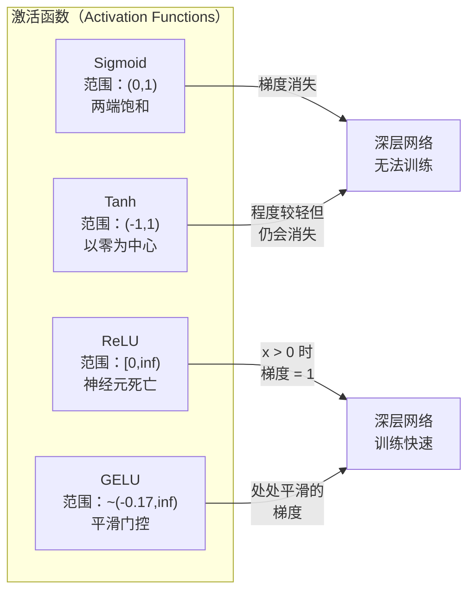
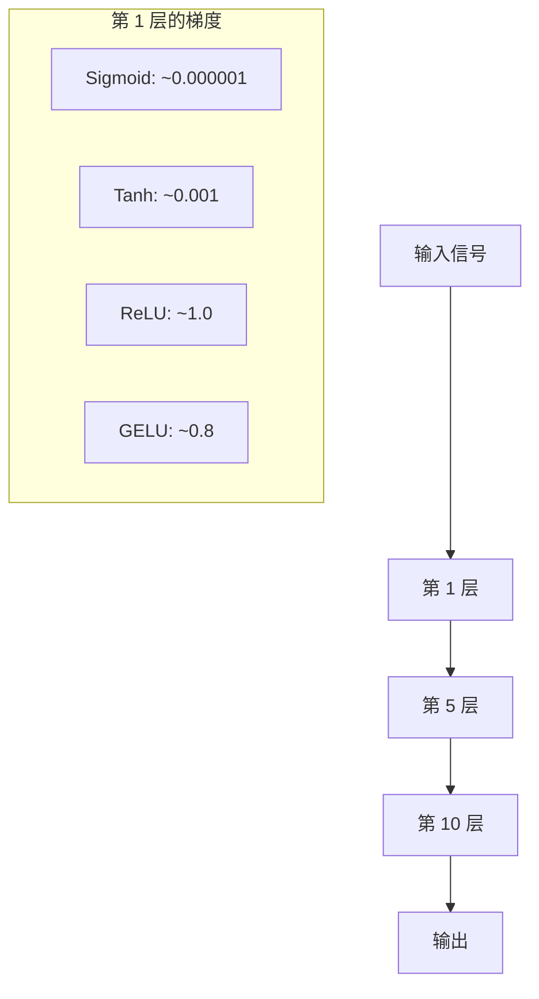
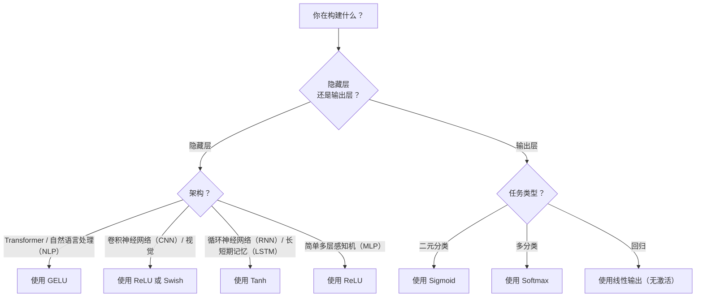

# 激活函数（Activation Functions）

> 没有非线性，100 层网络也只是一次复杂包装的矩阵乘法。激活函数是让神经网络能够用曲线思考的门。

**Type:** Build
**Languages:** Python
**Prerequisites:** 第 03.03 课（反向传播，Backpropagation）
**Time:** ~75 分钟

## 学习目标（Learning Objectives）

- 从零实现 Sigmoid、tanh、ReLU、Leaky ReLU、GELU、Swish、Softmax 及其导数
- 测量采用不同激活函数的 10 层以上网络中的激活值幅度，诊断梯度消失（Vanishing Gradient）问题
- 检测 ReLU 网络中的死亡神经元（Dead Neuron），解释 GELU 为什么能避免这一失效模式
- 为给定架构（Transformer、CNN、RNN、输出层）选择正确的激活函数

## 问题（The Problem）

堆叠两个线性变换：y = W2(W1x + b1) + b2。展开得到 y = W2W1x + W2b1 + b2，也就是 y = Ax + c，仍是一个线性变换。无论堆叠多少线性层，结果都会退化为一次矩阵乘法。100 层网络的表示能力与单层相同。

这不只是理论上的趣闻。它意味着深层线性网络确实无法学会 XOR、无法分类螺旋数据集、无法识别人脸。没有激活函数，深度只是假象。

激活函数打破了线性关系。它通过非线性函数变换各层输出，让网络能够弯曲决策边界、逼近任意函数，真正进行学习。但选错激活函数会让梯度消失至零（深层网络中的 Sigmoid）、爆炸至无穷大（初始化不当的无界激活），或让神经元永久死亡（带较大负偏置的 ReLU）。激活函数的选择直接决定网络能否学习。

## 概念（The Concept）

### 为什么需要非线性（Why Nonlinearity Is Necessary）

矩阵乘法具有可组合性。向量先乘矩阵 A 再乘矩阵 B，等价于乘以 AB。这意味着堆叠十个线性层，在数学上等价于一个带大矩阵的线性层。所有这些参数和深度都白费了。需要某种操作打破这条链，激活函数就负责这件事。

证明如下。线性层计算 f(x) = Wx + b。堆叠两层：

```
第 1 层：h = W1 * x + b1
第 2 层：y = W2 * h + b2
```

代入：

```
y = W2 * (W1 * x + b1) + b2
y = (W2 * W1) * x + (W2 * b1 + b2)
y = A * x + c
```

仍然只有一层。在两层之间插入非线性激活 g()：

```
h = g(W1 * x + b1)
y = W2 * h + b2
```

现在代入后无法合并。W2 * g(W1 * x + b1) + b2 不能化简为单个线性变换。网络因而可以表示非线性函数，每增加一个带激活函数的层，都会增加表示能力。

### S 形函数（Sigmoid）

神经网络最早使用的激活函数。

```
sigmoid(x) = 1 / (1 + e^(-x))
```

输出范围：(0, 1)。平滑、可微，将任意实数映射为类似概率的值。

导数：

```
sigmoid'(x) = sigmoid(x) * (1 - sigmoid(x))
```

该导数在 x = 0 时达到最大值 0.25。反向传播中梯度会逐层相乘。十层 Sigmoid 意味着梯度连续十次乘以最大为 0.25 的数：

```
0.25^10 = 0.000000953674
```

结果不到原始信号的百万分之一。这就是梯度消失问题。早期层梯度变得太小，权重几乎不再更新。网络看似在学习，后面层的损失在下降，但最初几层已经冻结。深层 Sigmoid 网络根本训练不动。

另一个问题是 Sigmoid 输出始终为正（0 到 1），这意味着各权重的梯度始终同号，导致梯度下降时走出锯齿形轨迹。

### 双曲正切（Tanh）

以零为中心的 Sigmoid 版本。

```
tanh(x) = (e^x - e^(-x)) / (e^x + e^(-x))
```

输出范围：(-1, 1)。以零为中心，因此消除了锯齿形轨迹问题。

导数：

```
tanh'(x) = 1 - tanh(x)^2
```

最大导数在 x = 0 时为 1.0，是 Sigmoid 的四倍。但梯度消失问题仍然存在：正负输入绝对值较大时，导数趋近零。十层仍会压缩梯度，只是程度较轻。

### ReLU：突破（ReLU: The Breakthrough）

修正线性单元（Rectified Linear Unit，ReLU）。Nair 和 Hinton 于 2010 年将它推广到深度学习中（函数本身可追溯至 Fukushima 1969 年的工作），它改变了一切。

```
relu(x) = max(0, x)
```

输出范围：[0, infinity)。导数非常简单：

```
relu'(x) = 1  if x > 0
            0  if x <= 0
```

对于正输入，不会发生梯度消失。梯度恰好为 1，直接向后传递。深层网络因此变得可以训练：ReLU 保留了梯度跨层传播的幅度。

但存在一种失效模式：死亡神经元。如果某个神经元的加权输入始终为负（源于较大负偏置或不合适的权重初始化），输出就始终为零，梯度始终为零，也永远不会更新。它永久死亡了。实践中，ReLU 网络里 10-40% 的神经元可能在训练期间死亡。

### 泄漏修正线性单元（Leaky ReLU）

解决死亡神经元的最简单方法。

```
leaky_relu(x) = x        if x > 0
                alpha * x if x <= 0
```

其中 alpha 是一个小常数，通常为 0.01。负半轴具有一个小斜率而非零，因此死亡神经元仍能获得梯度信号并恢复。

### GELU：现代默认选择（GELU: The Modern Default）

高斯误差线性单元（Gaussian Error Linear Unit，GELU），由 Hendrycks 和 Gimpel 于 2016 年提出，是 BERT、GPT 和大多数现代 Transformer 的默认激活函数。

```
gelu(x) = x * Phi(x)
```

其中 Phi(x) 是标准正态分布的累积分布函数（Cumulative Distribution Function，CDF）。实践中使用如下近似：

```
gelu(x) ~= 0.5 * x * (1 + tanh(sqrt(2/pi) * (x + 0.044715 * x^3)))
```

GELU 处处平滑，允许小负值（ReLU 则将负值硬截断为零），还有概率解释：按每个输入在高斯分布下为正的可能性为其加权。这种平滑门控（Gating）在 Transformer 架构中优于 ReLU，因为梯度流更好，而且完全避免了死亡神经元问题。

### Swish / Sigmoid 线性单元（Swish / SiLU）

Ramachandran 等人在 2017 年通过自动搜索发现的自门控激活函数。

```
swish(x) = x * sigmoid(x)
```

Swish 的正式表达式是 x * sigmoid(x)。Google 通过自动搜索激活函数空间发现它，也就是让神经网络设计神经网络的组件。

与 GELU 一样，它平滑、非单调，并允许小负值。区别很细微：Swish 用 Sigmoid 门控，GELU 用高斯 CDF。实践中两者性能几乎一样。Swish 用于 EfficientNet 和部分视觉模型，GELU 则主导语言模型。

### Softmax：输出激活（Softmax: The Output Activation）

Softmax 不用于隐藏层。它将原始分数向量（Logits）转换为概率分布。

```
softmax(x_i) = e^(x_i) / sum(e^(x_j) for all j)
```

每个输出都介于 0 和 1 之间，所有输出之和为 1，因此它是多分类的标准最终激活函数。最大的 Logit 获得最高概率，但不同于 argmax，Softmax 可微，并保留相对置信度的信息。

### 形状对比（Comparison of Shapes）



### 梯度流对比（Gradient Flow Comparison）



### 何时选择哪种激活（Which Activation When）



```figure
softmax-temperature
```

## 动手实现（Build It）

### 步骤 1：实现所有激活函数及其导数（Step 1: Implement All Activation Functions with Derivatives）

每个函数接收一个浮点数并返回一个浮点数。相应的导数函数接收同样的输入，返回梯度。

```python
import math

def sigmoid(x):
    x = max(-500, min(500, x))
    return 1.0 / (1.0 + math.exp(-x))

def sigmoid_derivative(x):
    s = sigmoid(x)
    return s * (1 - s)

def tanh_act(x):
    return math.tanh(x)

def tanh_derivative(x):
    t = math.tanh(x)
    return 1 - t * t

def relu(x):
    return max(0.0, x)

def relu_derivative(x):
    return 1.0 if x > 0 else 0.0

def leaky_relu(x, alpha=0.01):
    return x if x > 0 else alpha * x

def leaky_relu_derivative(x, alpha=0.01):
    return 1.0 if x > 0 else alpha

def gelu(x):
    return 0.5 * x * (1 + math.tanh(math.sqrt(2 / math.pi) * (x + 0.044715 * x ** 3)))

def gelu_derivative(x):
    phi = 0.5 * (1 + math.erf(x / math.sqrt(2)))
    pdf = math.exp(-0.5 * x * x) / math.sqrt(2 * math.pi)
    return phi + x * pdf

def swish(x):
    return x * sigmoid(x)

def swish_derivative(x):
    s = sigmoid(x)
    return s + x * s * (1 - s)

def softmax(xs):
    max_x = max(xs)
    exps = [math.exp(x - max_x) for x in xs]
    total = sum(exps)
    return [e / total for e in exps]
```

### 步骤 2：可视化梯度消失的位置（Step 2: Visualize Where Gradients Die）

在 -5 到 5 之间均匀取 100 个点计算梯度。打印文本直方图，展示每个激活函数的梯度在哪些位置接近零。

```python
def gradient_scan(name, derivative_fn, start=-5, end=5, n=100):
    step = (end - start) / n
    near_zero = 0
    healthy = 0
    for i in range(n):
        x = start + i * step
        g = derivative_fn(x)
        if abs(g) < 0.01:
            near_zero += 1
        else:
            healthy += 1
    pct_dead = near_zero / n * 100
    print(f"{name:15s}: {healthy:3d} healthy, {near_zero:3d} near-zero ({pct_dead:.0f}% dead zone)")

gradient_scan("Sigmoid", sigmoid_derivative)
gradient_scan("Tanh", tanh_derivative)
gradient_scan("ReLU", relu_derivative)
gradient_scan("Leaky ReLU", leaky_relu_derivative)
gradient_scan("GELU", gelu_derivative)
gradient_scan("Swish", swish_derivative)
```

### 步骤 3：梯度消失实验（Step 3: Vanishing Gradient Experiment）

分别使用 Sigmoid 和 ReLU，让信号前向通过 N 层，测量激活值幅度的变化。

```python
import random

def vanishing_gradient_experiment(activation_fn, name, n_layers=10, n_inputs=5):
    random.seed(42)
    values = [random.gauss(0, 1) for _ in range(n_inputs)]

    print(f"\n{name} through {n_layers} layers:")
    for layer in range(n_layers):
        weights = [random.gauss(0, 1) for _ in range(n_inputs)]
        z = sum(w * v for w, v in zip(weights, values))
        activated = activation_fn(z)
        magnitude = abs(activated)
        bar = "#" * int(magnitude * 20)
        print(f"  Layer {layer+1:2d}: magnitude = {magnitude:.6f} {bar}")
        values = [activated] * n_inputs

vanishing_gradient_experiment(sigmoid, "Sigmoid")
vanishing_gradient_experiment(relu, "ReLU")
vanishing_gradient_experiment(gelu, "GELU")
```

### 步骤 4：死亡神经元检测器（Step 4: Dead Neuron Detector）

创建 ReLU 网络，传入随机输入，统计有多少神经元从未激活。

```python
def dead_neuron_detector(n_inputs=5, hidden_size=20, n_samples=1000):
    random.seed(0)
    weights = [[random.gauss(0, 1) for _ in range(n_inputs)] for _ in range(hidden_size)]
    biases = [random.gauss(0, 1) for _ in range(hidden_size)]

    fire_counts = [0] * hidden_size

    for _ in range(n_samples):
        inputs = [random.gauss(0, 1) for _ in range(n_inputs)]
        for neuron_idx in range(hidden_size):
            z = sum(w * x for w, x in zip(weights[neuron_idx], inputs)) + biases[neuron_idx]
            if relu(z) > 0:
                fire_counts[neuron_idx] += 1

    dead = sum(1 for c in fire_counts if c == 0)
    rarely_fire = sum(1 for c in fire_counts if 0 < c < n_samples * 0.05)
    healthy = hidden_size - dead - rarely_fire

    print(f"\nDead Neuron Report ({hidden_size} neurons, {n_samples} samples):")
    print(f"  Dead (never fired):     {dead}")
    print(f"  Barely alive (<5%):     {rarely_fire}")
    print(f"  Healthy:                {healthy}")
    print(f"  Dead neuron rate:       {dead/hidden_size*100:.1f}%")

    for i, c in enumerate(fire_counts):
        status = "DEAD" if c == 0 else "WEAK" if c < n_samples * 0.05 else "OK"
        bar = "#" * (c * 40 // n_samples)
        print(f"  Neuron {i:2d}: {c:4d}/{n_samples} fires [{status:4s}] {bar}")

dead_neuron_detector()
```

### 步骤 5：训练对比，Sigmoid、ReLU 与 GELU（Step 5: Training Comparison -- Sigmoid vs ReLU vs GELU）

用三种不同的激活函数，在圆形数据集上训练相同的双层网络（圆内点为类别 1，圆外点为类别 0），比较收敛速度。

```python
def make_circle_data(n=200, seed=42):
    random.seed(seed)
    data = []
    for _ in range(n):
        x = random.uniform(-2, 2)
        y = random.uniform(-2, 2)
        label = 1.0 if x * x + y * y < 1.5 else 0.0
        data.append(([x, y], label))
    return data


class ActivationNetwork:
    def __init__(self, activation_fn, activation_deriv, hidden_size=8, lr=0.1):
        random.seed(0)
        self.act = activation_fn
        self.act_d = activation_deriv
        self.lr = lr
        self.hidden_size = hidden_size

        self.w1 = [[random.gauss(0, 0.5) for _ in range(2)] for _ in range(hidden_size)]
        self.b1 = [0.0] * hidden_size
        self.w2 = [random.gauss(0, 0.5) for _ in range(hidden_size)]
        self.b2 = 0.0

    def forward(self, x):
        self.x = x
        self.z1 = []
        self.h = []
        for i in range(self.hidden_size):
            z = self.w1[i][0] * x[0] + self.w1[i][1] * x[1] + self.b1[i]
            self.z1.append(z)
            self.h.append(self.act(z))

        self.z2 = sum(self.w2[i] * self.h[i] for i in range(self.hidden_size)) + self.b2
        self.out = sigmoid(self.z2)
        return self.out

    def backward(self, target):
        error = self.out - target
        d_out = error * self.out * (1 - self.out)

        for i in range(self.hidden_size):
            d_h = d_out * self.w2[i] * self.act_d(self.z1[i])
            self.w2[i] -= self.lr * d_out * self.h[i]
            for j in range(2):
                self.w1[i][j] -= self.lr * d_h * self.x[j]
            self.b1[i] -= self.lr * d_h
        self.b2 -= self.lr * d_out

    def train(self, data, epochs=200):
        losses = []
        for epoch in range(epochs):
            total_loss = 0
            correct = 0
            for x, y in data:
                pred = self.forward(x)
                self.backward(y)
                total_loss += (pred - y) ** 2
                if (pred >= 0.5) == (y >= 0.5):
                    correct += 1
            avg_loss = total_loss / len(data)
            accuracy = correct / len(data) * 100
            losses.append(avg_loss)
            if epoch % 50 == 0 or epoch == epochs - 1:
                print(f"    Epoch {epoch:3d}: loss={avg_loss:.4f}, accuracy={accuracy:.1f}%")
        return losses


data = make_circle_data()

configs = [
    ("Sigmoid", sigmoid, sigmoid_derivative),
    ("ReLU", relu, relu_derivative),
    ("GELU", gelu, gelu_derivative),
]

results = {}
for name, act_fn, act_d_fn in configs:
    print(f"\n=== Training with {name} ===")
    net = ActivationNetwork(act_fn, act_d_fn, hidden_size=8, lr=0.1)
    losses = net.train(data, epochs=200)
    results[name] = losses

print("\n=== Final Loss Comparison ===")
for name, losses in results.items():
    print(f"  {name:10s}: start={losses[0]:.4f} -> end={losses[-1]:.4f} (improvement: {(1 - losses[-1]/losses[0])*100:.1f}%)")
```

## 实际应用（Use It）

PyTorch 为以上所有激活提供了函数式和模块式两种形式：

```python
import torch
import torch.nn as nn
import torch.nn.functional as F

x = torch.randn(4, 10)

relu_out = F.relu(x)
gelu_out = F.gelu(x)
sigmoid_out = torch.sigmoid(x)
swish_out = F.silu(x)

logits = torch.randn(4, 5)
probs = F.softmax(logits, dim=1)

model = nn.Sequential(
    nn.Linear(10, 64),
    nn.GELU(),
    nn.Linear(64, 32),
    nn.GELU(),
    nn.Linear(32, 5),
)
```

Transformer 隐藏层用 GELU，CNN 隐藏层用 ReLU，分类输出层用 Softmax，回归输出层不用激活函数（线性），概率输出层用 Sigmoid。就这些。从这些默认选择开始，有证据时才修改。

RNN 和 LSTM 的隐藏状态用 tanh，门控用 Sigmoid；但今天从零构建模型时，你大概不会再使用 RNN。ReLU 网络中有神经元死亡，就切换到 GELU。除非有特定理由，否则不必选择 Leaky ReLU：GELU 能解决神经元死亡问题，并提供更好的梯度流。

## 交付成果（Ship It）

本课产出：
- `outputs/prompt-activation-selector.md`：可复用提示词，帮助你为任意架构选择合适的激活函数

## 练习（Exercises）

1. 实现参数化 ReLU（Parametric ReLU，PReLU），让负半轴斜率 alpha 成为可学习参数。在圆形数据集上训练，并与固定斜率的 Leaky ReLU 比较。

2. 将梯度消失实验从 10 层改成 50 层。绘制 Sigmoid、tanh、ReLU、GELU 在各层的幅度。每种激活函数的信号在哪一层实际上接近零？

3. 实现指数线性单元（Exponential Linear Unit，ELU）：x > 0 时 elu(x) = x，x <= 0 时为 alpha * (e^x - 1)。在相同网络上比较它与 ReLU 的死亡神经元比例。

4. 构建训练期间运行的“梯度健康监测器”：每轮计算各层的平均梯度幅度。任何一层的梯度低于 0.001 或超过 100 时打印警告。

5. 修改训练对比实验，用第 01 课的 XOR 数据集替代圆形数据集。哪种激活在 XOR 上收敛最快？为什么与圆形数据集结果不同？

## 关键术语（Key Terms）

| 术语 | 常见说法 | 实际含义 |
|------|----------------|----------------------|
| 激活函数（Activation Function） | “非线性部分” | 应用于每个神经元输出的函数，打破线性关系，使网络能够学习非线性映射 |
| 梯度消失（Vanishing Gradient） | “深层网络里的梯度消失了” | 激活函数导数小于 1 时，梯度逐层指数级缩小，导致早期层无法训练 |
| 梯度爆炸（Exploding Gradient） | “梯度炸了” | 有效乘数超过 1 时，梯度逐层指数级增长，导致训练不稳定 |
| 死亡神经元（Dead Neuron） | “停止学习的神经元” | 输入永久为负的 ReLU 神经元，输出与梯度均为零 |
| S 形函数（Sigmoid） | “把值压到 0-1” | 逻辑函数 1/(1+e^-x)，具有历史意义，但会导致深层网络梯度消失 |
| 修正线性单元（ReLU） | “把负数截为零” | max(0, x)，通过保留梯度幅度让深度学习变得实用的激活函数 |
| 高斯误差线性单元（GELU） | “Transformer 的激活函数” | 按输入为正的概率对其加权的平滑激活函数 |
| 自门控激活 / Sigmoid 线性单元（Swish/SiLU） | “自门控 ReLU” | x * sigmoid(x)，通过自动搜索发现，用于 EfficientNet |
| 归一化指数函数（Softmax） | “把分数变成概率” | 将 Logit 向量归一化为概率分布，每个值在 (0,1) 内且总和为 1 |
| 泄漏修正线性单元（Leaky ReLU） | “不会死亡的 ReLU” | max(alpha*x, x)，alpha 是小值（0.01），通过允许小的负向梯度防止神经元死亡 |
| 饱和（Saturation） | “Sigmoid 平坦的部分” | 激活函数导数接近零的区域，会阻断梯度流 |
| 未归一化分数（Logit） | “Softmax 前的原始分数” | 应用 Softmax 或 Sigmoid 之前，最后一层的未归一化输出 |

## 延伸阅读（Further Reading）

- Nair 与 Hinton，《修正线性单元改进受限玻尔兹曼机（Rectified Linear Units Improve Restricted Boltzmann Machines）》（2010）：引入 ReLU、让深层网络能够训练的论文
- Hendrycks 与 Gimpel，《高斯误差线性单元（Gaussian Error Linear Units (GELUs)）》（2016）：提出后来成为 Transformer 默认选择的激活函数
- Ramachandran 等，《搜索激活函数（Searching for Activation Functions）》（2017）：通过自动搜索发现 Swish，展示激活函数设计可以自动化
- Glorot 与 Bengio，《理解深度前馈神经网络的训练困难（Understanding the difficulty of training deep feedforward neural networks）》（2010）：诊断梯度消失/爆炸并提出 Xavier 初始化的论文
- Goodfellow、Bengio、Courville，《深度学习（Deep Learning）》第 6.3 章 (https://www.deeplearningbook.org/)：对隐藏单元与激活函数的严谨论述
