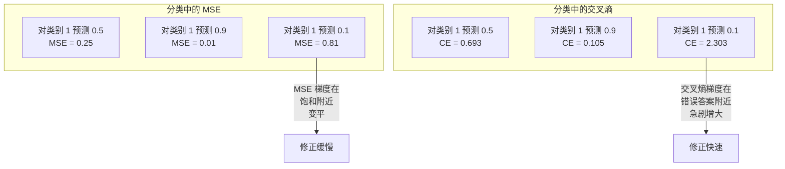
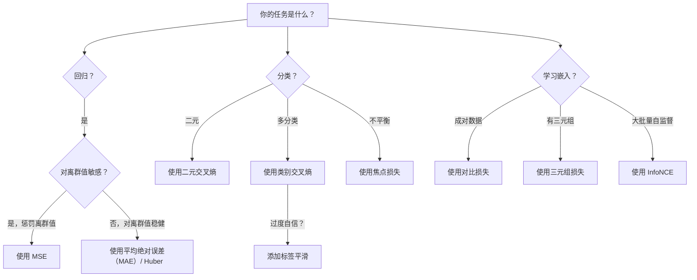
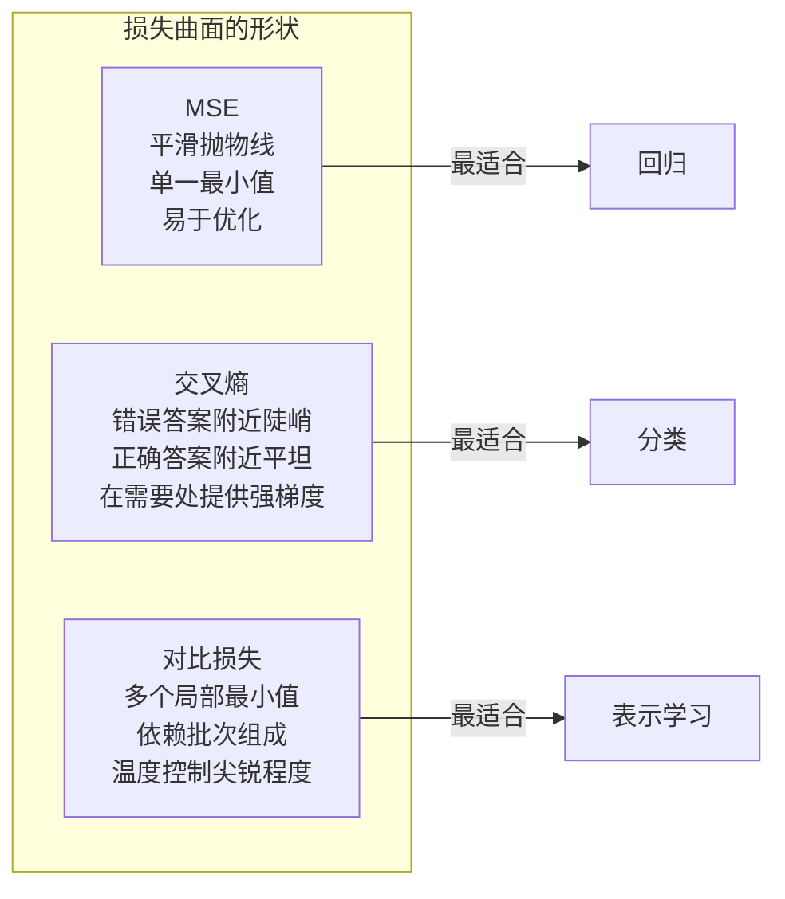

# 损失函数（Loss Functions）

> 网络作出预测，但真实值并不认同。它错得有多远？这个数就是损失。选错损失函数，模型就会全力优化错误的目标。

**Type:** Build
**Languages:** Python
**Prerequisites:** 第 03.04 课（激活函数，Activation Functions）
**Time:** ~75 分钟

## 学习目标（Learning Objectives）

- 从零实现均方误差（MSE）、二元交叉熵、类别交叉熵和对比损失（InfoNCE）及其梯度
- 演示“对一切都预测 0.5”的失效模式，解释 MSE 为什么不适合分类
- 为交叉熵应用标签平滑（Label Smoothing），说明它如何防止过度自信的预测
- 为回归、二元分类、多分类及嵌入学习任务选择正确的损失函数

## 问题（The Problem）

在分类问题中最小化 MSE 的模型，会信心十足地对所有输入都预测 0.5。它确实在最小化损失，但也毫无用处。

损失函数是模型真正优化的唯一对象。不是准确率，不是 F1 分数，也不是你汇报给经理的任何指标。优化器计算损失函数的梯度，调整权重让这个数变小。如果损失函数没有表达你关心的东西，模型就会寻找数学上代价最低的满足方式，而那几乎从来不是你想要的。

举个具体例子。你有一个二元分类任务，两类各占 50%。使用 MSE 后，模型对每个输入都预测 0.5，平均 MSE 为 0.25，这是不实际学习任何东西所能达到的最小值。模型没有任何区分能力，却在技术上最小化了你的损失函数。换成交叉熵，同一个模型就必须将预测推向 0 或 1，因为 -log(0.5) = 0.693 是很差的损失，而 -log(0.99) = 0.01 会奖励自信且正确的预测。选择什么损失函数，决定了模型是在学习，还是在钻指标的空子。

情况还可能更糟。在自监督学习（Self-Supervised Learning）中，你甚至没有标签。对比损失完全定义了学习信号：什么算相似，什么算不同，模型应多用力将它们分开。对比损失设计不当，嵌入就会坍塌（Collapse）成一个点，所有输入都映射到同一向量。技术上损失为零，却完全无用。

## 概念（The Concept）

### 均方误差（Mean Squared Error，MSE）

回归任务的默认选择。计算预测与目标之差的平方，再对所有样本取平均。

```
MSE = (1/n) * sum((y_pred - y_true)^2)
```

平方为什么重要：它以二次方惩罚大误差。误差为 2 的代价是误差为 1 的 4x，误差为 10 则为 100x。因此 MSE 对离群值（Outlier）敏感，一次极端错误的预测就可能主导损失。

用实际数值说明：模型预测房价，多数房屋误差为 $10,000，但一栋豪宅误差为 $200,000。MSE 会优先大幅修正这栋豪宅，可能因此损害另外 99 栋房屋的预测表现。

MSE 对预测值的梯度为：

```
dMSE/dy_pred = (2/n) * (y_pred - y_true)
```

梯度与误差呈线性关系。误差越大，梯度越大。这对回归是优点（大误差需要大修正），对分类则是缺点（你希望指数级而非线性地惩罚自信的错误答案）。

### 交叉熵损失（Cross-Entropy Loss）

用于分类的损失函数，根植于信息论（Information Theory），衡量预测概率分布与真实分布之间的差异。

**二元交叉熵（Binary Cross-Entropy，BCE）：**

```
BCE = -(y * log(p) + (1 - y) * log(1 - p))
```

其中 y 为真实标签（0 或 1），p 为预测概率。

-log(p) 为什么有效：真实标签为 1、预测 p = 0.99 时，损失为 -log(0.99) = 0.01；预测 p = 0.01 时，损失为 -log(0.01) = 4.6。这 460x 的差异就是交叉熵有效的原因：它严厉惩罚自信的错误预测，对自信的正确预测几乎不作惩罚。

梯度也表达了同样的规律：

```
dBCE/dp = -(y/p) + (1-y)/(1-p)
```

当 y = 1 且 p 接近零时，梯度为 -1/p，趋向负无穷大。模型收到极强的信号来修正错误。p 接近 1 时梯度很小，因为已经正确，无需修正。

**类别交叉熵（Categorical Cross-Entropy，CCE）：**

用于目标采用独热编码（One-Hot Encoding）的多分类任务。

```
CCE = -sum(y_i * log(p_i))
```

只有真实类别贡献损失，因为其他 y_i 都为零。若共有 10 类，正确类概率为 0.1（随机猜测），损失为 -log(0.1) = 2.3；正确类概率为 0.9 时，损失为 -log(0.9) = 0.105。模型学习将概率质量集中在正确答案上。

### MSE 为什么不适合分类（Why MSE Fails for Classification）



预测接近 0 或 1 时，MSE 的梯度会因 Sigmoid 饱和而变平。交叉熵梯度能补偿这一效应：-log 抵消 Sigmoid 的平坦区域，在最需要的位置提供强梯度。

### 标签平滑（Label Smoothing）

标准独热标签表示“100% 属于类别 3，其他类别都是 0%”。这是一个很强的断言，标签平滑会将其软化：

```
smooth_label = (1 - alpha) * one_hot + alpha / num_classes
```

alpha = 0.1 且有 10 个类别时，目标由 [0, 0, 1, 0, ...] 变为 [0.01, 0.01, 0.91, 0.01, ...]，模型以 0.91 而不是 1.0 为目标。

它之所以有效，是因为模型若想通过 Softmax 精确输出 1.0，就必须将 Logit 推向无穷大。这会导致过度自信、损害泛化（Generalization），并让模型难以应对分布偏移（Distribution Shift）。标签平滑将目标上限设为 0.9（alpha=0.1 时），使 Logit 保持在合理范围。GPT 和大多数现代模型都使用标签平滑或等效方法。

### 对比损失（Contrastive Loss）

没有标签，没有类别，只有成对输入，以及一个问题：它们相似还是不同？

**SimCLR 风格的对比损失（NT-Xent / InfoNCE）：**

取一张图像，创建两个增强视图（裁剪、旋转、颜色抖动）。它们构成“正样本对（Positive Pair）”，应有相似的嵌入。批次中的其他每张图像都构成“负样本对（Negative Pair）”，应有不同的嵌入。

```
L = -log(exp(sim(z_i, z_j) / tau) / sum(exp(sim(z_i, z_k) / tau)))
```

其中 sim() 为余弦相似度（Cosine Similarity），z_i 和 z_j 为正样本对，对所有负样本求和；tau（温度，Temperature）控制分布有多尖锐。温度越低，负样本越难，分离就越强。

实际数值：批量大小为 256，意味着每个正样本对有 255 个负样本。温度 tau = 0.07（SimCLR 默认值）。损失看起来像对相似度执行 Softmax，希望正样本对的相似度在全部 256 个选项中最高。

**三元组损失（Triplet Loss）：**

接收三个输入：锚点（Anchor）、正样本（同类）、负样本（异类）。

```
L = max(0, d(anchor, positive) - d(anchor, negative) + margin)
```

间隔（Margin，通常为 0.2-1.0）强制正负样本距离至少相差一定数值。负样本已经足够远时，损失为零，没有梯度，也不更新。这使训练高效，但需要仔细进行三元组挖掘（Triplet Mining），挑选靠近锚点的困难负样本。

### 焦点损失（Focal Loss）

用于不平衡数据集。标准交叉熵同等对待所有分类正确的样本，焦点损失降低简单样本的权重：

```
FL = -alpha * (1 - p_t)^gamma * log(p_t)
```

其中 p_t 为真实类别的预测概率，gamma 控制聚焦程度。gamma = 0 时就是标准交叉熵。gamma = 2（默认值）时：

- 简单样本（p_t = 0.9）：weight = (0.1)^2 = 0.01，实际上被忽略。
- 困难样本（p_t = 0.1）：weight = (0.9)^2 = 0.81，保留充分的梯度信号。

Lin 等人为目标检测提出了焦点损失，其中 99% 的候选区域是背景（简单负样本）。没有焦点损失，模型会淹没在简单背景样本中，始终学不会检测物体。有了它，模型就能将能力集中到真正重要、困难且模糊的样本上。

### 损失函数决策树（Loss Function Decision Tree）



### 损失曲面（Loss Landscape）



```figure
cross-entropy-loss
```

## 动手实现（Build It）

### 步骤 1：MSE 及其梯度（Step 1: MSE and Its Gradient）

```python
def mse(predictions, targets):
    n = len(predictions)
    total = 0.0
    for p, t in zip(predictions, targets):
        total += (p - t) ** 2
    return total / n

def mse_gradient(predictions, targets):
    n = len(predictions)
    grads = []
    for p, t in zip(predictions, targets):
        grads.append(2.0 * (p - t) / n)
    return grads
```

### 步骤 2：二元交叉熵（Step 2: Binary Cross-Entropy）

log(0) 确实是个问题。如果模型对正样本的预测恰好为 0，log(0) = 负无穷大。裁剪可以防止这种情况。

```python
import math

def binary_cross_entropy(predictions, targets, eps=1e-15):
    n = len(predictions)
    total = 0.0
    for p, t in zip(predictions, targets):
        p_clipped = max(eps, min(1 - eps, p))
        total += -(t * math.log(p_clipped) + (1 - t) * math.log(1 - p_clipped))
    return total / n

def bce_gradient(predictions, targets, eps=1e-15):
    grads = []
    for p, t in zip(predictions, targets):
        p_clipped = max(eps, min(1 - eps, p))
        grads.append(-(t / p_clipped) + (1 - t) / (1 - p_clipped))
    return grads
```

### 步骤 3：结合 Softmax 的类别交叉熵（Step 3: Categorical Cross-Entropy with Softmax）

Softmax 将原始 Logit 转换为概率，然后我们相对于独热目标计算交叉熵。

```python
def softmax(logits):
    max_val = max(logits)
    exps = [math.exp(x - max_val) for x in logits]
    total = sum(exps)
    return [e / total for e in exps]

def categorical_cross_entropy(logits, target_index, eps=1e-15):
    probs = softmax(logits)
    p = max(eps, probs[target_index])
    return -math.log(p)

def cce_gradient(logits, target_index):
    probs = softmax(logits)
    grads = list(probs)
    grads[target_index] -= 1.0
    return grads
```

Softmax 加交叉熵的梯度可以漂亮地化简：真实类别为（预测概率 - 1），其余类别为（预测概率）。这种简洁并非巧合，它正是 Softmax 与交叉熵配对使用的原因。

### 步骤 4：标签平滑（Step 4: Label Smoothing）

```python
def label_smoothed_cce(logits, target_index, num_classes, alpha=0.1, eps=1e-15):
    probs = softmax(logits)
    loss = 0.0
    for i in range(num_classes):
        if i == target_index:
            smooth_target = 1.0 - alpha + alpha / num_classes
        else:
            smooth_target = alpha / num_classes
        p = max(eps, probs[i])
        loss += -smooth_target * math.log(p)
    return loss
```

### 步骤 5：对比损失，简化版 InfoNCE（Step 5: Contrastive Loss (Simplified InfoNCE)）

```python
def cosine_similarity(a, b):
    dot = sum(x * y for x, y in zip(a, b))
    norm_a = math.sqrt(sum(x * x for x in a))
    norm_b = math.sqrt(sum(x * x for x in b))
    if norm_a < 1e-10 or norm_b < 1e-10:
        return 0.0
    return dot / (norm_a * norm_b)

def contrastive_loss(anchor, positive, negatives, temperature=0.07):
    sim_pos = cosine_similarity(anchor, positive) / temperature
    sim_negs = [cosine_similarity(anchor, neg) / temperature for neg in negatives]

    max_sim = max(sim_pos, max(sim_negs)) if sim_negs else sim_pos
    exp_pos = math.exp(sim_pos - max_sim)
    exp_negs = [math.exp(s - max_sim) for s in sim_negs]
    total_exp = exp_pos + sum(exp_negs)

    return -math.log(max(1e-15, exp_pos / total_exp))
```

### 步骤 6：分类中的 MSE 与交叉熵对比（Step 6: MSE vs Cross-Entropy on Classification）

分别使用两种损失函数训练第 04 课的同一网络（圆形数据集），观察交叉熵如何更快收敛。

```python
import random

def sigmoid(x):
    x = max(-500, min(500, x))
    return 1.0 / (1.0 + math.exp(-x))

def make_circle_data(n=200, seed=42):
    random.seed(seed)
    data = []
    for _ in range(n):
        x = random.uniform(-2, 2)
        y = random.uniform(-2, 2)
        label = 1.0 if x * x + y * y < 1.5 else 0.0
        data.append(([x, y], label))
    return data


class LossComparisonNetwork:
    def __init__(self, loss_type="bce", hidden_size=8, lr=0.1):
        random.seed(0)
        self.loss_type = loss_type
        self.lr = lr
        self.hidden_size = hidden_size

        self.w1 = [[random.gauss(0, 0.5) for _ in range(2)] for _ in range(hidden_size)]
        self.b1 = [0.0] * hidden_size
        self.w2 = [random.gauss(0, 0.5) for _ in range(hidden_size)]
        self.b2 = 0.0

    def forward(self, x):
        self.x = x
        self.z1 = []
        self.h = []
        for i in range(self.hidden_size):
            z = self.w1[i][0] * x[0] + self.w1[i][1] * x[1] + self.b1[i]
            self.z1.append(z)
            self.h.append(max(0.0, z))

        self.z2 = sum(self.w2[i] * self.h[i] for i in range(self.hidden_size)) + self.b2
        self.out = sigmoid(self.z2)
        return self.out

    def backward(self, target):
        if self.loss_type == "mse":
            d_loss = 2.0 * (self.out - target)
        else:
            eps = 1e-15
            p = max(eps, min(1 - eps, self.out))
            d_loss = -(target / p) + (1 - target) / (1 - p)

        d_sigmoid = self.out * (1 - self.out)
        d_out = d_loss * d_sigmoid

        for i in range(self.hidden_size):
            d_relu = 1.0 if self.z1[i] > 0 else 0.0
            d_h = d_out * self.w2[i] * d_relu
            self.w2[i] -= self.lr * d_out * self.h[i]
            for j in range(2):
                self.w1[i][j] -= self.lr * d_h * self.x[j]
            self.b1[i] -= self.lr * d_h
        self.b2 -= self.lr * d_out

    def compute_loss(self, pred, target):
        if self.loss_type == "mse":
            return (pred - target) ** 2
        else:
            eps = 1e-15
            p = max(eps, min(1 - eps, pred))
            return -(target * math.log(p) + (1 - target) * math.log(1 - p))

    def train(self, data, epochs=200):
        losses = []
        for epoch in range(epochs):
            total_loss = 0.0
            correct = 0
            for x, y in data:
                pred = self.forward(x)
                self.backward(y)
                total_loss += self.compute_loss(pred, y)
                if (pred >= 0.5) == (y >= 0.5):
                    correct += 1
            avg_loss = total_loss / len(data)
            accuracy = correct / len(data) * 100
            losses.append((avg_loss, accuracy))
            if epoch % 50 == 0 or epoch == epochs - 1:
                print(f"    Epoch {epoch:3d}: loss={avg_loss:.4f}, accuracy={accuracy:.1f}%")
        return losses
```

## 实际应用（Use It）

PyTorch 提供全部标准损失函数，并内置数值稳定性处理：

```python
import torch
import torch.nn as nn
import torch.nn.functional as F

predictions = torch.tensor([0.9, 0.1, 0.7], requires_grad=True)
targets = torch.tensor([1.0, 0.0, 1.0])

mse_loss = F.mse_loss(predictions, targets)
bce_loss = F.binary_cross_entropy(predictions, targets)

logits = torch.randn(4, 10)
labels = torch.tensor([3, 7, 1, 9])
ce_loss = F.cross_entropy(logits, labels)
ce_smooth = F.cross_entropy(logits, labels, label_smoothing=0.1)
```

使用 `F.cross_entropy`，而不是 `F.nll_loss` 加手动 Softmax。它将对数 Softmax 与负对数似然（Negative Log-Likelihood）合并为一次数值稳定的操作。单独应用 Softmax 再取对数稳定性较差，大指数值相减时会丢失精度。

对比学习中，多数团队使用自定义实现或 `lightly`、`pytorch-metric-learning` 等库。核心循环始终相同：计算成对相似度，对正负样本构造 Softmax，再进行反向传播。

## 交付成果（Ship It）

本课产出：
- `outputs/prompt-loss-function-selector.md`：选择合适损失函数的可复用提示词
- `outputs/prompt-loss-debugger.md`：损失曲线异常时使用的诊断提示词

## 练习（Exercises）

1. 实现 Huber 损失（平滑 L1 损失，Smooth L1 Loss），小误差时用 MSE，大误差时用 MAE。为 5% 的训练目标加入随机噪声（离群值），分别用 MSE 和 Huber 训练预测 y = sin(x) 的回归网络，比较最终测试误差。

2. 为二元分类训练循环添加焦点损失。构建不平衡数据集（90% 为类别 0，10% 为类别 1），比较训练 200 轮后标准 BCE 与焦点损失（gamma=2）的少数类召回率（Recall）。

3. 实现带半困难负样本挖掘（Semi-Hard Negative Mining）的三元组损失。生成 5 个类别的二维嵌入数据。对每个锚点，找出仍比正样本更远的最困难负样本（半困难），与随机选择三元组的收敛情况比较。

4. 运行 MSE 与交叉熵对比，并在训练中追踪各层梯度幅度。绘制每轮平均梯度范数，验证模型最不确定的早期轮次中，交叉熵产生更大的梯度。

5. 实现 KL 散度（KL Divergence）损失，验证真实分布为独热分布时，最小化 KL(true || predicted) 与交叉熵产生相同梯度。然后尝试软目标（如知识蒸馏，Knowledge Distillation），“真实”分布来自教师模型的 Softmax 输出。

## 关键术语（Key Terms）

| 术语 | 常见说法 | 实际含义 |
|------|----------------|----------------------|
| 损失函数（Loss Function） | “模型错得多远” | 将预测与目标映射为标量的可微函数，由优化器最小化 |
| 均方误差（MSE） | “平方误差的平均值” | 预测与目标之差的平方均值，以二次方惩罚大误差 |
| 交叉熵（Cross-Entropy） | “分类损失” | 使用 -log(p) 衡量预测概率分布与真实分布的差异 |
| 二元交叉熵（Binary Cross-Entropy） | “BCE” | 用于两个类别的交叉熵：-(y*log(p) + (1-y)*log(1-p)) |
| 标签平滑（Label Smoothing） | “软化目标” | 将硬 0/1 目标替换为软数值（如 0.1/0.9），防止过度自信并改善泛化 |
| 对比损失（Contrastive Loss） | “拉近、推远” | 让嵌入空间中的相似样本对靠近、不相似样本对远离，以此学习表示的损失 |
| 信息噪声对比估计（InfoNCE） | “CLIP/SimCLR 的损失” | 对相似度分数计算归一化温度缩放交叉熵，将对比学习视为分类 |
| 焦点损失（Focal Loss） | “解决数据不平衡” | 用 (1-p_t)^gamma 加权交叉熵，降低简单样本权重并聚焦困难样本 |
| 三元组损失（Triplet Loss） | “锚点、正样本、负样本” | 在嵌入空间中，让锚点到正样本的距离至少比到负样本小一个间隔 |
| 温度（Temperature） | “尖锐度旋钮” | Logit/相似度的标量除数，控制所得分布的尖锐程度，越低越尖锐 |

## 延伸阅读（Further Reading）

- Lin 等，《密集目标检测的焦点损失（Focal Loss for Dense Object Detection）》（2017）：提出焦点损失，处理目标检测（RetinaNet）中的极端类别不平衡
- Chen 等，《视觉表示对比学习的简单框架（A Simple Framework for Contrastive Learning of Visual Representations）》（SimCLR，2020）：用 NT-Xent 损失定义现代对比学习流程
- Szegedy 等，《重新思考 Inception 架构（Rethinking the Inception Architecture）》（2016）：提出标签平滑这一正则化技术，如今已成为大多数大型模型的标准配置
- Hinton 等，《蒸馏神经网络中的知识（Distilling the Knowledge in a Neural Network）》（2015）：使用软目标和 KL 散度进行知识蒸馏，是模型压缩的基础
