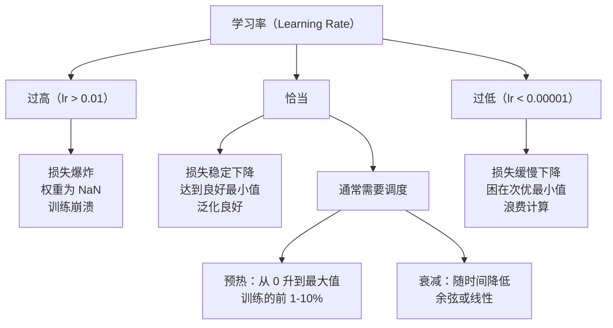
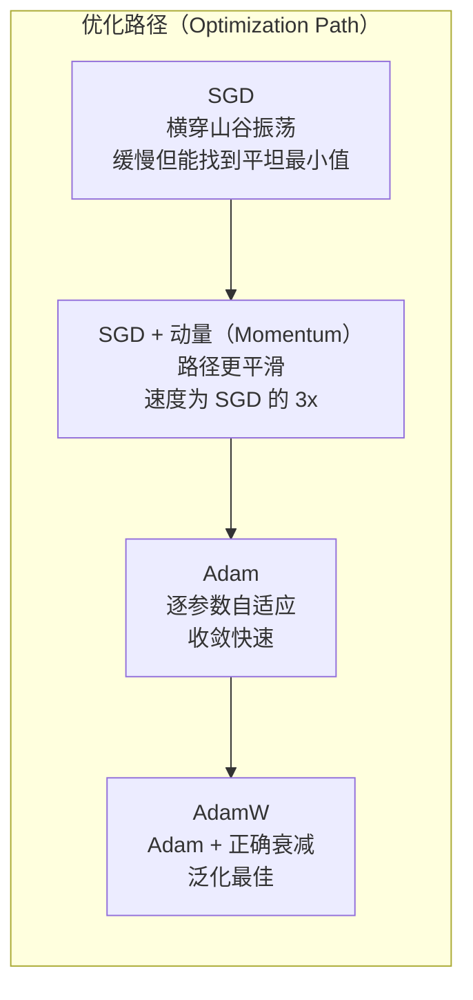
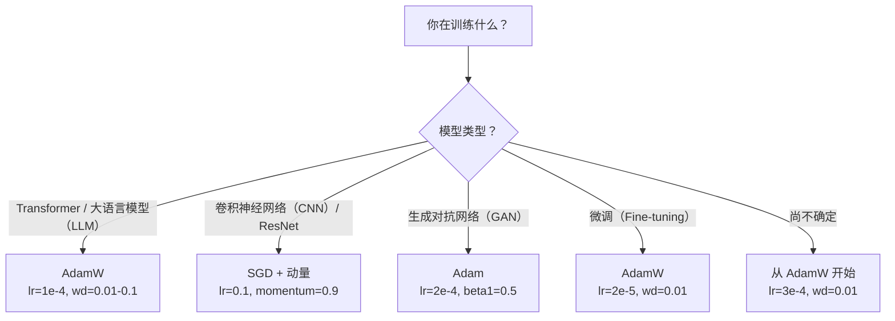

# 优化器（Optimizers）

> 梯度下降告诉你朝哪个方向走，却不说明走多远、多快。SGD 是指南针，Adam 是带实时路况的 GPS。

**Type:** Build
**Languages:** Python
**Prerequisites:** 第 03.05 课（损失函数，Loss Functions）
**Time:** ~75 分钟

## 学习目标（Learning Objectives）

- 用 Python 从零实现 SGD、带动量的 SGD、Adam 和 AdamW 优化器
- 解释 Adam 的偏差修正（Bias Correction）如何补偿训练早期零初始化的矩估计
- 在相同任务上演示 AdamW 为什么比带 L2 正则化的 Adam 泛化更好
- 为 Transformer、CNN、GAN 及微调选择合适的优化器与默认超参数

## 问题（The Problem）

你算出了梯度，知道第 #4,721 个权重应减小 0.003 来降低损失。但 0.003 是什么单位？按什么缩放？第 1 步和第 1,000 步应移动相同距离吗？

普通梯度下降在每一步对每个参数应用相同学习率：w = w - lr * gradient。这带来三个问题，让实际训练神经网络变得困难。

首先是振荡（Oscillation）。损失曲面很少像平滑的碗，更像狭长的山谷。梯度指向横穿山谷的陡峭方向，而非沿着山谷的平缓方向。梯度下降在窄维度上来回反弹，却在有用的方向上进展甚微。你见过这种情况：损失快速下降后进入平台期，不是模型收敛了，而是它在振荡。

其次，所有参数用同一个学习率不合理。有些权重需要大更新（仍处于早期欠拟合阶段），另一些只需要小更新（已接近最优值）。适合前者的学习率会破坏后者，反之亦然。

第三是鞍点（Saddle Point）。高维损失曲面中存在大片梯度接近零的平坦区域。普通 SGD 按梯度大小缓慢爬行，速度实际上接近零。模型看似卡住了，其实只是处于平坦区域，另一边仍有有用的下降方向。但 SGD 没有机制推动它穿过这里。

Adam 解决了全部三个问题。它为每个参数维护两个移动平均：平均梯度（动量，处理振荡）和梯度平方的平均值（自适应学习率，处理不同尺度）。结合最初几步的偏差修正，它用默认超参数就能解决 80% 的问题。本课从零构建它，让你准确理解剩下 20% 的问题中，它何时失败、为什么失败。

## 概念（The Concept）

### 随机梯度下降（Stochastic Gradient Descent，SGD）

最简单的优化器。在小批量（Mini-Batch）上计算梯度，沿反方向迈一步。

```
w = w - lr * gradient
```

“随机”意味着使用数据的随机子集（小批量）估计梯度，而不是整个数据集。这种噪声实际上有益，能帮助逃离尖锐的局部最小值，但也会导致振荡。

学习率是唯一的调节参数。过高会使损失发散，过低则训练耗时过长。最优值取决于架构、数据、批量大小以及当前训练阶段。现代网络使用普通 SGD 时，典型值为 0.01 到 0.1。但即使在一次训练中，理想学习率也会变化。

### 动量（Momentum）

小球滚下山坡的比喻虽然常被使用，却很准确。不再只按当前梯度迈步，而是维护一个累积历史梯度的速度。

```
m_t = beta * m_{t-1} + gradient
w = w - lr * m_t
```

Beta（通常为 0.9）控制保留多少历史。beta = 0.9 时，动量大致对应最近 10 个梯度的平均值（1 / (1 - 0.9) = 10）。

这为什么能解决振荡：方向一致的梯度累积，方向翻转的梯度抵消。在狭窄山谷中，“横向”分量每步变号，因而被抑制；“纵向”分量保持一致，因而被放大。结果是沿有用方向平稳加速。

实际数值：在条件不良的损失曲面上，单用 SGD 可能需要 10,000 步；同一问题中，带动量 SGD（beta=0.9）通常只需 3,000-5,000 步。这不是微小的加速。

### 均方根传播（RMSProp）

第一个真正有效的逐参数自适应学习率方法，由 Hinton 在 Coursera 课程中提出，从未正式发表。

```
s_t = beta * s_{t-1} + (1 - beta) * gradient^2
w = w - lr * gradient / (sqrt(s_t) + epsilon)
```

s_t 追踪梯度平方的移动平均。梯度持续较大的参数除以较大的数，有效学习率更小；梯度较小的参数除以较小的数，有效学习率更大。

这解决了“所有参数一个学习率”的问题。一直获得大更新的权重可能已经接近目标，应慢下来；一直只得到微小更新的权重可能训练不足，应加快。

Epsilon（通常为 1e-8）防止参数尚未更新时除以零。

### Adam：动量加 RMSProp（Adam: Momentum + RMSProp）

Adam 结合了两种思想，为每个参数维护两个指数移动平均（Exponential Moving Average）：

```
m_t = beta1 * m_{t-1} + (1 - beta1) * gradient        （一阶矩：均值）
v_t = beta2 * v_{t-1} + (1 - beta2) * gradient^2       （二阶矩：方差）
```

**偏差修正（Bias Correction）**是多数解释忽略的关键细节。第 1 步中，m_1 = (1 - beta1) * gradient。beta1 = 0.9 时，它只有 0.1 * gradient，小了十倍，因为移动平均尚未预热。偏差修正对此进行补偿：

```
m_hat = m_t / (1 - beta1^t)
v_hat = v_t / (1 - beta2^t)
```

第 1 步、beta1 = 0.9 时：m_hat = m_1 / (1 - 0.9) = m_1 / 0.1 = 实际梯度。到第 100 步，(1 - 0.9^100) 约为 1.0，修正作用消失。偏差修正在最初约 10 步很重要，约 50 步后便无关紧要。

更新公式：

```
w = w - lr * m_hat / (sqrt(v_hat) + epsilon)
```

Adam 默认值：lr = 0.001、beta1 = 0.9、beta2 = 0.999、epsilon = 1e-8。这些默认值适用于 80% 的问题。不奏效时，先改 lr，再改 beta2，几乎不用修改 beta1 或 epsilon。

### AdamW：正确的权重衰减（AdamW: Weight Decay Done Right）

L2 正则化向损失添加 lambda * w^2。在普通 SGD 中，这等价于权重衰减（Weight Decay），即每步从权重中减去 lambda * w。但在 Adam 中，这种等价关系不成立。

Loshchilov 与 Hutter 的洞察是：向损失添加 L2 后，Adam 处理梯度时，自适应学习率也会缩放正则化项。梯度方差大的参数获得较少正则化，方差小的参数获得更多。这不是你想要的，你需要不依赖梯度统计的统一正则化。

AdamW 在 Adam 更新之后直接对权重应用衰减，解决了这个问题：

```
w = w - lr * m_hat / (sqrt(v_hat) + epsilon) - lr * lambda * w
```

权重衰减项（lr * lambda * w）不被 Adam 的自适应因子缩放，每个参数都按相同比例收缩。

这看似是小细节，其实不然。几乎所有任务中，AdamW 都比 Adam + L2 正则化收敛到更好的解。它是在 PyTorch 中训练 Transformer、扩散模型（Diffusion Model）和多数现代架构的默认优化器。BERT、GPT、LLaMA、Stable Diffusion 都用 AdamW 训练。

### 学习率：最重要的超参数（Learning Rate: The Most Important Hyperparameter）



只调一个超参数，就调学习率。学习率改变 10x 的影响，大于你作出的任何架构决策。常见默认值：

- SGD：lr = 0.01 到 0.1
- Adam/AdamW：lr = 1e-4 到 3e-4
- 微调预训练模型：lr = 1e-5 到 5e-5
- 学习率预热：在前 1-10% 的步数中线性升高

### 优化器对比（Optimizer Comparison）



### 各优化器的优势场景（When Each Optimizer Wins）



```figure
optimizer-trajectory
```

## 动手实现（Build It）

### 步骤 1：普通 SGD（Step 1: Vanilla SGD）

```python
class SGD:
    def __init__(self, lr=0.01):
        self.lr = lr

    def step(self, params, grads):
        for i in range(len(params)):
            params[i] -= self.lr * grads[i]
```

### 步骤 2：带动量的 SGD（Step 2: SGD with Momentum）

```python
class SGDMomentum:
    def __init__(self, lr=0.01, beta=0.9):
        self.lr = lr
        self.beta = beta
        self.velocities = None

    def step(self, params, grads):
        if self.velocities is None:
            self.velocities = [0.0] * len(params)
        for i in range(len(params)):
            self.velocities[i] = self.beta * self.velocities[i] + grads[i]
            params[i] -= self.lr * self.velocities[i]
```

### 步骤 3：Adam（Step 3: Adam）

```python
import math

class Adam:
    def __init__(self, lr=0.001, beta1=0.9, beta2=0.999, epsilon=1e-8):
        self.lr = lr
        self.beta1 = beta1
        self.beta2 = beta2
        self.epsilon = epsilon
        self.m = None
        self.v = None
        self.t = 0

    def step(self, params, grads):
        if self.m is None:
            self.m = [0.0] * len(params)
            self.v = [0.0] * len(params)

        self.t += 1

        for i in range(len(params)):
            self.m[i] = self.beta1 * self.m[i] + (1 - self.beta1) * grads[i]
            self.v[i] = self.beta2 * self.v[i] + (1 - self.beta2) * grads[i] ** 2

            m_hat = self.m[i] / (1 - self.beta1 ** self.t)
            v_hat = self.v[i] / (1 - self.beta2 ** self.t)

            params[i] -= self.lr * m_hat / (math.sqrt(v_hat) + self.epsilon)
```

### 步骤 4：AdamW（Step 4: AdamW）

```python
class AdamW:
    def __init__(self, lr=0.001, beta1=0.9, beta2=0.999, epsilon=1e-8, weight_decay=0.01):
        self.lr = lr
        self.beta1 = beta1
        self.beta2 = beta2
        self.epsilon = epsilon
        self.weight_decay = weight_decay
        self.m = None
        self.v = None
        self.t = 0

    def step(self, params, grads):
        if self.m is None:
            self.m = [0.0] * len(params)
            self.v = [0.0] * len(params)

        self.t += 1

        for i in range(len(params)):
            self.m[i] = self.beta1 * self.m[i] + (1 - self.beta1) * grads[i]
            self.v[i] = self.beta2 * self.v[i] + (1 - self.beta2) * grads[i] ** 2

            m_hat = self.m[i] / (1 - self.beta1 ** self.t)
            v_hat = self.v[i] / (1 - self.beta2 ** self.t)

            params[i] -= self.lr * m_hat / (math.sqrt(v_hat) + self.epsilon)
            params[i] -= self.lr * self.weight_decay * params[i]
```

### 步骤 5：训练对比（Step 5: Training Comparison）

在第 05 课的圆形数据集上，使用四种优化器训练相同的双层网络，比较收敛情况。

```python
import random

def sigmoid(x):
    x = max(-500, min(500, x))
    return 1.0 / (1.0 + math.exp(-x))

def make_circle_data(n=200, seed=42):
    random.seed(seed)
    data = []
    for _ in range(n):
        x = random.uniform(-2, 2)
        y = random.uniform(-2, 2)
        label = 1.0 if x * x + y * y < 1.5 else 0.0
        data.append(([x, y], label))
    return data


class OptimizerTestNetwork:
    def __init__(self, optimizer, hidden_size=8):
        random.seed(0)
        self.hidden_size = hidden_size
        self.optimizer = optimizer

        self.w1 = [[random.gauss(0, 0.5) for _ in range(2)] for _ in range(hidden_size)]
        self.b1 = [0.0] * hidden_size
        self.w2 = [random.gauss(0, 0.5) for _ in range(hidden_size)]
        self.b2 = 0.0

    def get_params(self):
        params = []
        for row in self.w1:
            params.extend(row)
        params.extend(self.b1)
        params.extend(self.w2)
        params.append(self.b2)
        return params

    def set_params(self, params):
        idx = 0
        for i in range(self.hidden_size):
            for j in range(2):
                self.w1[i][j] = params[idx]
                idx += 1
        for i in range(self.hidden_size):
            self.b1[i] = params[idx]
            idx += 1
        for i in range(self.hidden_size):
            self.w2[i] = params[idx]
            idx += 1
        self.b2 = params[idx]

    def forward(self, x):
        self.x = x
        self.z1 = []
        self.h = []
        for i in range(self.hidden_size):
            z = self.w1[i][0] * x[0] + self.w1[i][1] * x[1] + self.b1[i]
            self.z1.append(z)
            self.h.append(max(0.0, z))

        self.z2 = sum(self.w2[i] * self.h[i] for i in range(self.hidden_size)) + self.b2
        self.out = sigmoid(self.z2)
        return self.out

    def compute_grads(self, target):
        eps = 1e-15
        p = max(eps, min(1 - eps, self.out))
        d_loss = -(target / p) + (1 - target) / (1 - p)
        d_sigmoid = self.out * (1 - self.out)
        d_out = d_loss * d_sigmoid

        grads = [0.0] * (self.hidden_size * 2 + self.hidden_size + self.hidden_size + 1)
        idx = 0
        for i in range(self.hidden_size):
            d_relu = 1.0 if self.z1[i] > 0 else 0.0
            d_h = d_out * self.w2[i] * d_relu
            grads[idx] = d_h * self.x[0]
            grads[idx + 1] = d_h * self.x[1]
            idx += 2

        for i in range(self.hidden_size):
            d_relu = 1.0 if self.z1[i] > 0 else 0.0
            grads[idx] = d_out * self.w2[i] * d_relu
            idx += 1

        for i in range(self.hidden_size):
            grads[idx] = d_out * self.h[i]
            idx += 1

        grads[idx] = d_out
        return grads

    def train(self, data, epochs=300):
        losses = []
        for epoch in range(epochs):
            total_loss = 0.0
            correct = 0
            for x, y in data:
                pred = self.forward(x)
                grads = self.compute_grads(y)
                params = self.get_params()
                self.optimizer.step(params, grads)
                self.set_params(params)

                eps = 1e-15
                p = max(eps, min(1 - eps, pred))
                total_loss += -(y * math.log(p) + (1 - y) * math.log(1 - p))
                if (pred >= 0.5) == (y >= 0.5):
                    correct += 1
            avg_loss = total_loss / len(data)
            accuracy = correct / len(data) * 100
            losses.append((avg_loss, accuracy))
            if epoch % 75 == 0 or epoch == epochs - 1:
                print(f"    Epoch {epoch:3d}: loss={avg_loss:.4f}, accuracy={accuracy:.1f}%")
        return losses
```

## 实际应用（Use It）

PyTorch 优化器处理参数组、梯度裁剪和学习率调度：

```python
import torch
import torch.optim as optim

model = torch.nn.Sequential(
    torch.nn.Linear(784, 256),
    torch.nn.ReLU(),
    torch.nn.Linear(256, 10),
)

optimizer = optim.AdamW(model.parameters(), lr=3e-4, weight_decay=0.01)

scheduler = optim.lr_scheduler.CosineAnnealingLR(optimizer, T_max=100)

for epoch in range(100):
    optimizer.zero_grad()
    output = model(torch.randn(32, 784))
    loss = torch.nn.functional.cross_entropy(output, torch.randint(0, 10, (32,)))
    loss.backward()
    torch.nn.utils.clip_grad_norm_(model.parameters(), max_norm=1.0)
    optimizer.step()
    scheduler.step()
```

固定模式是：zero_grad、forward、loss、backward、（clip）、step、（schedule）。记住这个顺序。顺序错误，例如在 optimizer.step() 之前调用 scheduler.step()，是隐蔽错误的常见来源。

对于 CNN，许多实践者仍偏好带动量 SGD（lr=0.1、momentum=0.9、weight_decay=1e-4），配合阶梯或余弦调度。SGD 能找到更平坦的最小值，往往泛化更好。对于 Transformer 和 LLM，AdamW 配合预热与余弦衰减是通用默认方案。没有测量依据，不要逆着共识走。

## 交付成果（Ship It）

本课产出：
- `outputs/prompt-optimizer-selector.md`：为任意架构选择合适优化器与学习率的决策提示词

## 练习（Exercises）

1. 实现 Nesterov 动量，在“前瞻”位置（w - lr * beta * v）而非当前位置计算梯度。在圆形数据集上与标准动量比较收敛情况。

2. 实现学习率预热调度：前 10% 的训练步数从 0 线性升至 max_lr，再余弦衰减至 0。对比带预热与不带预热的 Adam，测量在圆形数据集上达到 90% 准确率分别需要多少轮。

3. 在 Adam 训练中追踪每个参数的有效学习率：lr * m_hat / (sqrt(v_hat) + eps)。绘制第 10、50、200 步后的有效学习率分布。所有参数都按相同速度更新吗？

4. 实现按全局范数的梯度裁剪（Gradient Clipping），最大梯度范数设为 1.0。使用高学习率（Adam 的 lr=0.01）分别进行有裁剪和无裁剪的训练。使用 10 个随机种子，统计两种情况下分别有多少次发散（损失变为 NaN）。

5. 在大权重网络上比较 Adam 与 AdamW。将所有权重初始化为 [-5, 5] 内的随机值，远大于正常范围。设置 weight_decay=0.1，训练 200 轮。绘制两种优化器训练期间的权重 L2 范数，AdamW 应更快收缩权重。

## 关键术语（Key Terms）

| 术语 | 常见说法 | 实际含义 |
|------|----------------|----------------------|
| 学习率（Learning Rate） | “步长” | 梯度更新的标量乘数，是训练中影响最大的单个超参数 |
| 随机梯度下降（SGD） | “基本梯度下降” | 在小批量上计算梯度，通过减去 lr * gradient 更新权重 |
| 动量（Momentum） | “滚动小球的比喻” | 历史梯度的指数移动平均，抑制振荡、加速方向一致的移动 |
| 均方根传播（RMSProp） | “自适应学习率” | 每个参数的梯度除以其近期梯度的移动均方根，平衡学习率 |
| Adam | “默认优化器” | 结合动量（一阶矩）与 RMSProp（二阶矩），并在初始步骤进行偏差修正 |
| AdamW | “正确实现的 Adam” | 带解耦权重衰减的 Adam，直接对权重而非通过梯度应用正则化 |
| 偏差修正（Bias Correction） | “移动平均的预热” | 除以 (1 - beta^t)，补偿 Adam 矩估计的零初始化偏差 |
| 权重衰减（Weight Decay） | “收缩权重” | 每步减去权重值的一定比例，是惩罚大权重的正则化方法 |
| 学习率调度（Learning Rate Schedule） | “随时间改变 lr” | 训练期间调整学习率的函数，现代默认是预热加余弦衰减 |
| 梯度裁剪（Gradient Clipping） | “限制梯度范数” | 梯度向量范数超过阈值时按比例缩小，防止梯度爆炸导致的更新 |

## 延伸阅读（Further Reading）

- Kingma 与 Ba，《Adam：一种随机优化方法（Adam: A Method for Stochastic Optimization）》（2014）：Adam 原始论文，包含收敛分析和偏差修正推导
- Loshchilov 与 Hutter，《解耦权重衰减正则化（Decoupled Weight Decay Regularization）》（2017）：证明 L2 正则化与权重衰减在 Adam 中不等价，并提出 AdamW
- Smith，《用于训练神经网络的循环学习率（Cyclical Learning Rates for Training Neural Networks）》（2017）：提出学习率范围测试和循环调度，无需再调固定学习率
- Ruder，《梯度下降优化算法概述（An Overview of Gradient Descent Optimization Algorithms）》（2016）：涵盖各种优化器变体的优秀综述，包含清晰对比和直觉解释
