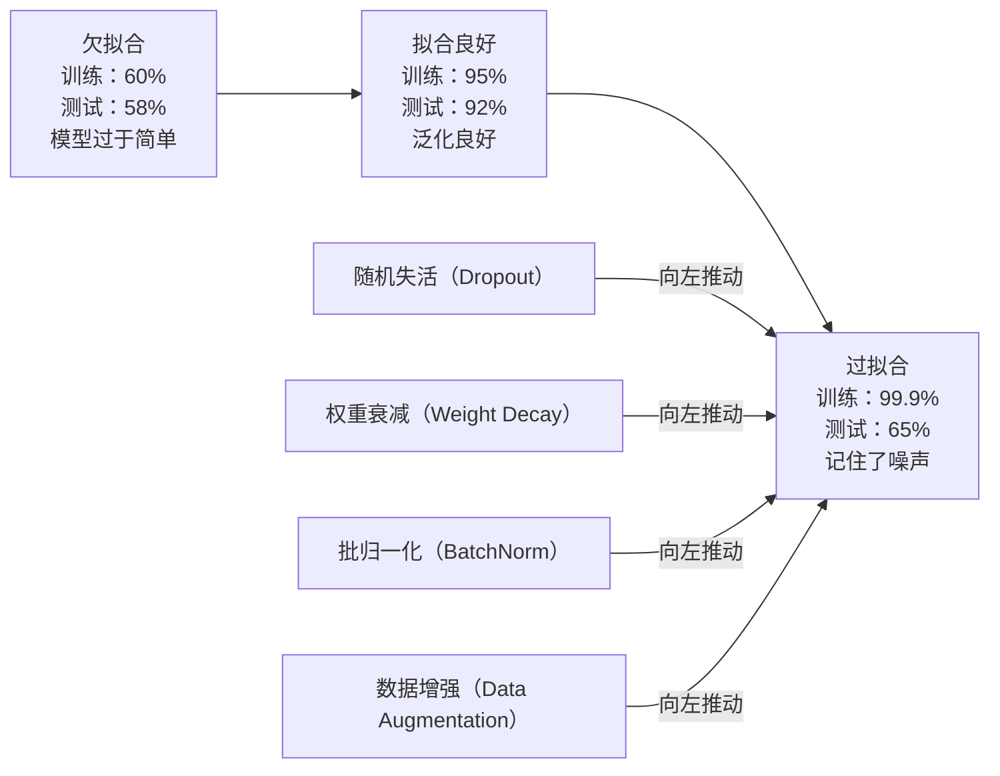
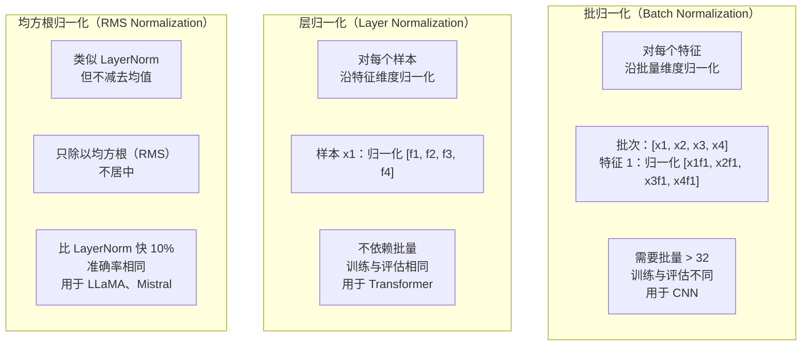
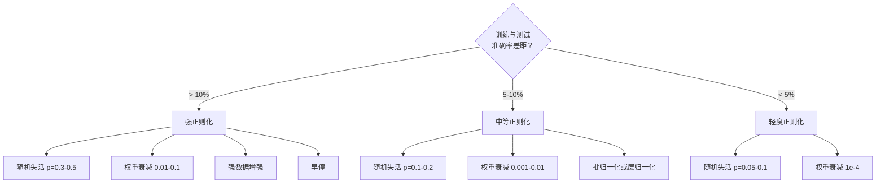

# 正则化（Regularization）

> 模型在训练数据上达到 99%，测试数据却只有 60%。它记住了数据，而不是学会了规律。正则化是对复杂度征收的税，迫使模型泛化。

**Type:** Build
**Languages:** Python
**Prerequisites:** 第 03.06 课（优化器，Optimizers）
**Time:** ~75 分钟

## 学习目标（Learning Objectives）

- 从零实现带反向缩放的随机失活（Dropout）、L2 权重衰减、批归一化、层归一化以及 RMSNorm
- 测量训练与测试准确率差距，通过正则化实验诊断过拟合（Overfitting）
- 解释 Transformer 为什么用 LayerNorm 而不是 BatchNorm，以及现代 LLM 为什么更倾向于 RMSNorm
- 根据过拟合的严重程度，应用正确的正则化技术组合

## 问题（The Problem）

参数足够多的神经网络可以记住任何数据集。这不是假设：Zhang 等人（2017）用带随机标签的 ImageNet 训练标准网络，证明了这一点。面对完全随机分配的标签，网络仍达到了接近零的训练损失。它们记住了一百万对没有任何可学规律的随机输入输出。训练损失完美，测试准确率为零。

这就是过拟合问题，模型越大，问题越严重。GPT-3 有 1750 亿参数，训练集约有 5000 亿词元（Token）。如此多参数足以逐字记住大量训练数据。没有正则化，它只会重复训练样本，而不是学习可泛化的模式。

训练表现与测试表现之差就是过拟合差距。本课每项技术都从不同角度缩小这一差距。随机失活迫使网络不依赖任何单个神经元，权重衰减防止单个权重过大。批归一化平滑损失曲面，让优化器找到更平坦、更能泛化的最小值。层归一化做类似的事，但能用于批归一化失效的场景（小批量、变长序列）。RMSNorm 省掉均值计算，速度再快 10%。每项技术都简单，组合起来却决定了模型是在记忆还是在泛化。

## 概念（The Concept）

### 过拟合谱系（The Overfitting Spectrum）

每个模型都位于欠拟合（Underfitting，过于简单而无法捕捉模式）到过拟合（复杂到连噪声也捕捉）的谱系上。理想位置在两者之间，正则化从过拟合的一端将模型推向那里。



### 随机失活（Dropout）

最简单的正则化技术，却有优雅的解释。训练期间，以概率 p 随机将每个神经元的输出设为零。

```
output = activation(z) * mask    其中 mask[i] ~ Bernoulli(1 - p)
```

p = 0.5 时，每次前向传播都有一半神经元被置零。网络无法预知哪些神经元可用，因此必须学习冗余表示。这防止了共适应（Co-Adaptation），即神经元学会依赖特定其他神经元的存在。

集成（Ensemble）解释：含 N 个神经元并使用随机失活的网络有 2^N 个可能的子网络，对应神经元开启或关闭的每种组合。带随机失活的训练近似于同时训练全部 2^N 个子网络，每个使用不同小批量。测试时使用全部神经元（不随机失活），将输出乘以 (1 - p)，匹配训练期间的期望值。这等价于平均 2^N 个子网络的预测，用一个模型得到巨大集成。

实践中，在训练时而非测试时进行缩放，称为反向随机失活（Inverted Dropout）：

```
训练期间：output = activation(z) * mask / (1 - p)
测试期间：output = activation(z)   （无需修改）
```

这样更简洁，因为测试代码完全不必知道随机失活的存在。

默认比例：Transformer 为 p = 0.1，MLP 为 p = 0.5，CNN 为 p = 0.2-0.3。失活比例越高，正则化越强，欠拟合风险也越高。

### 权重衰减，L2 正则化（Weight Decay (L2 Regularization)）

向损失中加入所有权重幅度的平方：

```
total_loss = task_loss + (lambda / 2) * sum(w_i^2)
```

正则化项的梯度为 lambda * w。因此每一步都将每个权重向零收缩，收缩量与自身幅度成比例。大权重受更大惩罚，模型被推向没有单个权重占主导的解。

这有助于泛化，是因为过拟合模型往往用大权重放大训练数据中的噪声。权重衰减让权重保持较小，限制模型的有效容量，迫使它依赖稳健、可泛化的特征，而不是记住的特殊细节。

超参数 lambda 控制强度，典型值为：

- Transformer 使用 AdamW 时为 0.01
- CNN 使用 SGD 时为 1e-4
- 严重过拟合模型为 0.1

如第 06 课所述，权重衰减与 L2 正则化在 SGD 中等价，在 Adam 中不等价。使用 Adam 训练时，应始终用 AdamW（解耦权重衰减）。

### 批归一化（Batch Normalization）

将每层的输出沿小批量维度归一化，再传给下一层。

对于某层的一个小批量激活值：

```
mu = (1/B) * sum(x_i)           （批次均值）
sigma^2 = (1/B) * sum((x_i - mu)^2)   （批次方差）
x_hat = (x_i - mu) / sqrt(sigma^2 + eps)   （归一化）
y = gamma * x_hat + beta        （缩放与平移）
```

Gamma 和 beta 是可学习参数，允许网络在最优方案需要时撤销归一化。没有它们，就等于强制每层输出均值为零、方差为一，而这未必符合网络需求。

**训练与推理的区别：**训练时，mu 和 sigma 来自当前小批量；推理时，使用训练中累积的移动平均（momentum = 0.1 的指数移动平均，即 90% 旧值加 10% 新值）。

BatchNorm 为什么有效仍有争论。原论文声称它减少“内部协变量偏移（Internal Covariate Shift）”，即早期层更新时后续层输入分布的变化。Santurkar 等人（2018）表明这一解释是错的。实际原因是 BatchNorm 使损失曲面更平滑：梯度更有预测性，Lipschitz 常数更小，优化器可以安全地迈更大的步。这就是 BatchNorm 允许更高学习率并加快收敛的原因。

BatchNorm 有一个根本局限：依赖批次统计。批量大小为 1 时，均值和方差没有意义；小批量（< 32）时，统计噪声会损害性能。这对目标检测（内存限制批量大小）和语言建模（序列长度变化）等任务很重要。

### 层归一化（Layer Normalization）

沿特征维度而非批量维度归一化。对单个样本：

```
mu = (1/D) * sum(x_j)           （特征均值）
sigma^2 = (1/D) * sum((x_j - mu)^2)   （特征方差）
x_hat = (x_j - mu) / sqrt(sigma^2 + eps)
y = gamma * x_hat + beta
```

D 是特征维度。每个样本独立归一化，不依赖批量大小。这就是 Transformer 用 LayerNorm 而非 BatchNorm 的原因。序列长度变化、批量往往很小（生成时甚至为 1），而训练与推理的计算保持一致。

Transformer 中的 LayerNorm 可以放在每个自注意力（Self-Attention）块和前馈（Feed-Forward）块之后（Post-LN），也可以放在之前（Pre-LN，训练更稳定）。

### 均方根归一化（RMSNorm）

不减去均值的 LayerNorm，由 Zhang 与 Sennrich（2019）提出。

```
rms = sqrt((1/D) * sum(x_j^2))
y = gamma * x / rms
```

仅此而已。不计算均值，也没有 beta 参数。观察表明，LayerNorm 的重新居中（减均值）对模型性能贡献很小，却消耗计算。移除它，可以保持准确率，同时减少约 10% 开销。

LLaMA、LLaMA 2、LLaMA 3、Mistral 和多数现代 LLM 用 RMSNorm 替代 LayerNorm。在数十亿参数、数万亿词元的规模上，节省 10% 意义重大。

### 归一化对比（Normalization Comparison）



### 用数据增强进行正则化（Data Augmentation as Regularization）

不修改模型，而是修改数据。在保留标签的前提下变换训练输入：

- 图像：随机裁剪、翻转、旋转、颜色抖动、随机遮挡（Cutout）
- 文本：同义词替换、回译（Back-Translation）、随机删除
- 音频：时间拉伸、音高偏移、添加噪声

效果与正则化相同：增加训练集的有效大小，让模型更难记住特定样本。只见过每张图像原始形态的模型可以记住它；见过每张图像 50 个增强版本的模型，则被迫学习不变结构。

### 早停（Early Stopping）

最简单的正则化方法：验证损失开始上升时停止训练，此时模型尚未过拟合。实践中，每轮追踪验证损失，保存最佳模型，并继续训练一个“耐心（Patience）”窗口，通常为 5-20 轮。窗口内验证损失没有改善，就停止并加载保存的最佳模型。

### 何时使用什么方法（When to Apply What）



```figure
l2-regularization
```

## 动手实现（Build It）

### 步骤 1：随机失活，训练与评估模式（Step 1: Dropout (Train and Eval Mode)）

```python
import random
import math


class Dropout:
    def __init__(self, p=0.5):
        self.p = p
        self.training = True
        self.mask = None

    def forward(self, x):
        if not self.training:
            return list(x)
        self.mask = []
        output = []
        for val in x:
            if random.random() < self.p:
                self.mask.append(0)
                output.append(0.0)
            else:
                self.mask.append(1)
                output.append(val / (1 - self.p))
        return output

    def backward(self, grad_output):
        grads = []
        for g, m in zip(grad_output, self.mask):
            if m == 0:
                grads.append(0.0)
            else:
                grads.append(g / (1 - self.p))
        return grads
```

### 步骤 2：L2 权重衰减（Step 2: L2 Weight Decay）

```python
def l2_regularization(weights, lambda_reg):
    penalty = 0.0
    for w in weights:
        penalty += w * w
    return lambda_reg * 0.5 * penalty

def l2_gradient(weights, lambda_reg):
    return [lambda_reg * w for w in weights]
```

### 步骤 3：批归一化（Step 3: Batch Normalization）

```python
class BatchNorm:
    def __init__(self, num_features, momentum=0.1, eps=1e-5):
        self.gamma = [1.0] * num_features
        self.beta = [0.0] * num_features
        self.eps = eps
        self.momentum = momentum
        self.running_mean = [0.0] * num_features
        self.running_var = [1.0] * num_features
        self.training = True
        self.num_features = num_features

    def forward(self, batch):
        batch_size = len(batch)
        if self.training:
            mean = [0.0] * self.num_features
            for sample in batch:
                for j in range(self.num_features):
                    mean[j] += sample[j]
            mean = [m / batch_size for m in mean]

            var = [0.0] * self.num_features
            for sample in batch:
                for j in range(self.num_features):
                    var[j] += (sample[j] - mean[j]) ** 2
            var = [v / batch_size for v in var]

            for j in range(self.num_features):
                self.running_mean[j] = (1 - self.momentum) * self.running_mean[j] + self.momentum * mean[j]
                self.running_var[j] = (1 - self.momentum) * self.running_var[j] + self.momentum * var[j]
        else:
            mean = list(self.running_mean)
            var = list(self.running_var)

        self.x_hat = []
        output = []
        for sample in batch:
            normalized = []
            out_sample = []
            for j in range(self.num_features):
                x_h = (sample[j] - mean[j]) / math.sqrt(var[j] + self.eps)
                normalized.append(x_h)
                out_sample.append(self.gamma[j] * x_h + self.beta[j])
            self.x_hat.append(normalized)
            output.append(out_sample)
        return output
```

### 步骤 4：层归一化（Step 4: Layer Normalization）

```python
class LayerNorm:
    def __init__(self, num_features, eps=1e-5):
        self.gamma = [1.0] * num_features
        self.beta = [0.0] * num_features
        self.eps = eps
        self.num_features = num_features

    def forward(self, x):
        mean = sum(x) / len(x)
        var = sum((xi - mean) ** 2 for xi in x) / len(x)

        self.x_hat = []
        output = []
        for j in range(self.num_features):
            x_h = (x[j] - mean) / math.sqrt(var + self.eps)
            self.x_hat.append(x_h)
            output.append(self.gamma[j] * x_h + self.beta[j])
        return output
```

### 步骤 5：RMSNorm（Step 5: RMSNorm）

```python
class RMSNorm:
    def __init__(self, num_features, eps=1e-6):
        self.gamma = [1.0] * num_features
        self.eps = eps
        self.num_features = num_features

    def forward(self, x):
        rms = math.sqrt(sum(xi * xi for xi in x) / len(x) + self.eps)
        output = []
        for j in range(self.num_features):
            output.append(self.gamma[j] * x[j] / rms)
        return output
```

### 步骤 6：有无正则化的训练对比（Step 6: Training With and Without Regularization）

```python
def sigmoid(x):
    x = max(-500, min(500, x))
    return 1.0 / (1.0 + math.exp(-x))


def make_circle_data(n=200, seed=42):
    random.seed(seed)
    data = []
    for _ in range(n):
        x = random.uniform(-2, 2)
        y = random.uniform(-2, 2)
        label = 1.0 if x * x + y * y < 1.5 else 0.0
        data.append(([x, y], label))
    return data


class RegularizedNetwork:
    def __init__(self, hidden_size=16, lr=0.05, dropout_p=0.0, weight_decay=0.0):
        random.seed(0)
        self.hidden_size = hidden_size
        self.lr = lr
        self.dropout_p = dropout_p
        self.weight_decay = weight_decay
        self.dropout = Dropout(p=dropout_p) if dropout_p > 0 else None

        self.w1 = [[random.gauss(0, 0.5) for _ in range(2)] for _ in range(hidden_size)]
        self.b1 = [0.0] * hidden_size
        self.w2 = [random.gauss(0, 0.5) for _ in range(hidden_size)]
        self.b2 = 0.0

    def forward(self, x, training=True):
        self.x = x
        self.z1 = []
        self.h = []
        for i in range(self.hidden_size):
            z = self.w1[i][0] * x[0] + self.w1[i][1] * x[1] + self.b1[i]
            self.z1.append(z)
            self.h.append(max(0.0, z))

        if self.dropout and training:
            self.dropout.training = True
            self.h = self.dropout.forward(self.h)
        elif self.dropout:
            self.dropout.training = False
            self.h = self.dropout.forward(self.h)

        self.z2 = sum(self.w2[i] * self.h[i] for i in range(self.hidden_size)) + self.b2
        self.out = sigmoid(self.z2)
        return self.out

    def backward(self, target):
        eps = 1e-15
        p = max(eps, min(1 - eps, self.out))
        d_loss = -(target / p) + (1 - target) / (1 - p)
        d_sigmoid = self.out * (1 - self.out)
        d_out = d_loss * d_sigmoid

        for i in range(self.hidden_size):
            d_relu = 1.0 if self.z1[i] > 0 else 0.0
            d_h = d_out * self.w2[i] * d_relu
            self.w2[i] -= self.lr * (d_out * self.h[i] + self.weight_decay * self.w2[i])
            for j in range(2):
                self.w1[i][j] -= self.lr * (d_h * self.x[j] + self.weight_decay * self.w1[i][j])
            self.b1[i] -= self.lr * d_h
        self.b2 -= self.lr * d_out

    def evaluate(self, data):
        correct = 0
        total_loss = 0.0
        for x, y in data:
            pred = self.forward(x, training=False)
            eps = 1e-15
            p = max(eps, min(1 - eps, pred))
            total_loss += -(y * math.log(p) + (1 - y) * math.log(1 - p))
            if (pred >= 0.5) == (y >= 0.5):
                correct += 1
        return total_loss / len(data), correct / len(data) * 100

    def train_model(self, train_data, test_data, epochs=300):
        history = []
        for epoch in range(epochs):
            total_loss = 0.0
            correct = 0
            for x, y in train_data:
                pred = self.forward(x, training=True)
                self.backward(y)
                eps = 1e-15
                p = max(eps, min(1 - eps, pred))
                total_loss += -(y * math.log(p) + (1 - y) * math.log(1 - p))
                if (pred >= 0.5) == (y >= 0.5):
                    correct += 1
            train_loss = total_loss / len(train_data)
            train_acc = correct / len(train_data) * 100
            test_loss, test_acc = self.evaluate(test_data)
            history.append((train_loss, train_acc, test_loss, test_acc))
            if epoch % 75 == 0 or epoch == epochs - 1:
                gap = train_acc - test_acc
                print(f"    Epoch {epoch:3d}: train_acc={train_acc:.1f}%, test_acc={test_acc:.1f}%, gap={gap:.1f}%")
        return history
```

## 实际应用（Use It）

PyTorch 将所有归一化和正则化方法提供为模块：

```python
import torch
import torch.nn as nn

model = nn.Sequential(
    nn.Linear(784, 256),
    nn.BatchNorm1d(256),
    nn.ReLU(),
    nn.Dropout(0.3),
    nn.Linear(256, 128),
    nn.BatchNorm1d(128),
    nn.ReLU(),
    nn.Dropout(0.3),
    nn.Linear(128, 10),
)

model.train()
out_train = model(torch.randn(32, 784))

model.eval()
out_test = model(torch.randn(1, 784))
```

`model.train()` / `model.eval()` 切换至关重要。它开启或关闭随机失活，并告诉 BatchNorm 使用批次统计还是移动统计。推理前忘记 `model.eval()` 是深度学习最常见的错误之一：随机失活仍然生效，BatchNorm 仍用小批量统计，测试准确率会随机波动。

Transformer 的模式不同：

```python
class TransformerBlock(nn.Module):
    def __init__(self, d_model=512, nhead=8, dropout=0.1):
        super().__init__()
        self.attention = nn.MultiheadAttention(d_model, nhead, dropout=dropout)
        self.norm1 = nn.LayerNorm(d_model)
        self.ff = nn.Sequential(
            nn.Linear(d_model, d_model * 4),
            nn.GELU(),
            nn.Linear(d_model * 4, d_model),
            nn.Dropout(dropout),
        )
        self.norm2 = nn.LayerNorm(d_model)
        self.dropout = nn.Dropout(dropout)

    def forward(self, x):
        attended, _ = self.attention(x, x, x)
        x = self.norm1(x + self.dropout(attended))
        x = self.norm2(x + self.ff(x))
        return x
```

使用 LayerNorm 而非 BatchNorm，随机失活为 p=0.1 而非 p=0.5。这些是 Transformer 的默认配置。

## 交付成果（Ship It）

本课产出：
- `outputs/prompt-regularization-advisor.md`：诊断过拟合并推荐合适正则化策略的提示词

## 练习（Exercises）

1. 为二维数据实现空间随机失活（Spatial Dropout）：不丢弃单个神经元，而是丢弃整个特征通道。将连续特征分组视为通道，整组丢弃来模拟它。在 hidden_size=32 的圆形数据集网络上，与标准随机失活比较训练测试差距。

2. 将第 05 课的标签平滑与本课随机失活结合。训练四种配置：两者都不用、只用随机失活、只用标签平滑、两者都用。测量每种配置最终的训练测试准确率差距，哪种组合最小？

3. 在圆形数据集网络的隐藏层与激活函数之间添加 BatchNorm 层。分别以 0.01、0.05、0.1 的学习率进行有无 BatchNorm 的训练。在普通网络发散的较高学习率下，BatchNorm 应仍能稳定训练。

4. 实现早停：每轮追踪测试损失，保存最佳权重，连续 20 轮测试损失未改善就停止。让正则化网络最多运行 1000 轮，报告哪一轮测试准确率最好，以及节省了多少轮计算。

5. 在 4 层而非仅 2 层的网络中比较 LayerNorm 与 RMSNorm，使用相同权重初始化。训练 200 轮，比较最终准确率、训练速度（每轮耗时）以及第一层梯度幅度，验证 RMSNorm 在准确率相同的情况下更快。

## 关键术语（Key Terms）

| 术语 | 常见说法 | 实际含义 |
|------|----------------|----------------------|
| 过拟合（Overfitting） | “模型记住了数据” | 训练表现明显高于测试表现，表明学到了噪声而非信号 |
| 正则化（Regularization） | “防止过拟合” | 通过限制模型复杂度改善泛化的技术，包括随机失活、权重衰减、归一化和增强 |
| 随机失活（Dropout） | “随机删除神经元” | 训练时以概率 p 随机将神经元置零，迫使网络学习冗余表示，等价于训练集成模型 |
| 权重衰减（Weight Decay） | “L2 惩罚” | 每步减去 lambda * w，使所有权重向零收缩，通过权重幅度惩罚复杂度 |
| 批归一化（Batch Normalization） | “按批次归一化” | 沿批量维度归一化层输出，训练用批次统计，推理用移动平均 |
| 层归一化（Layer Normalization） | “按样本归一化” | 在每个样本内沿特征归一化，不依赖批量，用于批量大小可变的 Transformer |
| 均方根归一化（RMSNorm） | “不算均值的 LayerNorm” | 移除 LayerNorm 的减均值步骤，准确率相同且速度提升 10% |
| 早停（Early Stopping） | “过拟合前停止” | 验证损失停止改善时终止训练，是最简单的正则化方法，常与其他方法并用 |
| 数据增强（Data Augmentation） | “少量数据变更多” | 变换训练输入（翻转、裁剪、噪声），增加有效数据集大小并迫使模型学习不变性 |
| 泛化差距（Generalization Gap） | “训练测试分割” | 训练与测试表现之间的差异，正则化旨在最小化这一差距 |

## 延伸阅读（Further Reading）

- Srivastava 等，《随机失活：防止神经网络过拟合的简单方法（Dropout: A Simple Way to Prevent Neural Networks from Overfitting）》（2014）：Dropout 原始论文，包含集成解释和大量实验
- Ioffe 与 Szegedy，《批归一化：通过减少内部协变量偏移加速深层网络训练（Batch Normalization: Accelerating Deep Network Training by Reducing Internal Covariate Shift）》（2015）：提出 BatchNorm 及其训练过程，是引用最多的深度学习论文之一
- Zhang 与 Sennrich，《均方根层归一化（Root Mean Square Layer Normalization）》（2019）：表明 RMSNorm 以更少计算匹配 LayerNorm 准确率，已被 LLaMA 和 Mistral 采用
- Zhang 等，《理解深度学习需要重新思考泛化（Understanding Deep Learning Requires Rethinking Generalization）》（2017）：展示神经网络能记住随机标签的里程碑论文，挑战了传统泛化观念
