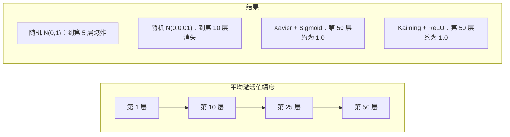
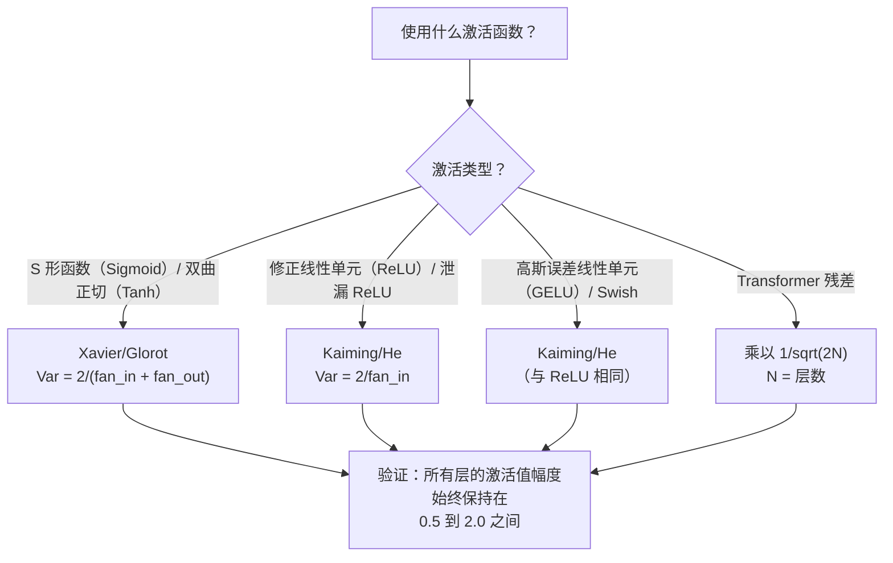

# 权重初始化与训练稳定性（Weight Initialization and Training Stability）

> 初始化错误，训练根本无法开始。初始化正确，50 层也能像 3 层一样平稳训练。

**Type:** Build
**Languages:** Python
**Prerequisites:** 第 03.04 课（激活函数，Activation Functions），第 03.07 课（正则化，Regularization）
**Time:** ~90 分钟

## 学习目标（Learning Objectives）

- 实现零初始化、随机初始化、Xavier/Glorot 和 Kaiming/He 初始化策略，测量它们对 50 层网络激活值幅度的影响
- 推导 Xavier 初始化为何使用 Var(w) = 2/(fan_in + fan_out)，Kaiming 为何使用 Var(w) = 2/fan_in
- 演示零初始化的对称性问题，解释为什么仅有随机尺度还不够
- 将初始化策略与激活函数正确配对：Sigmoid/tanh 用 Xavier，ReLU/GELU 用 Kaiming

## 问题（The Problem）

将所有权重初始化为零，网络什么也学不会。每个神经元计算相同函数，接收相同梯度，进行相同更新。训练 10,000 轮后，512 个神经元的隐藏层仍是同一个神经元的 512 份副本。你付出了 512 个参数的代价，却只得到 1 个。

初始化过大，激活值就会在网络中爆炸。到第 10 层，数值达到 1e15；到第 20 层，溢出为无穷大。梯度会沿相同轨迹反向变化。

从标准正态分布随机初始化，3 层网络能工作，到了 50 层，信号则会坍塌至零或爆炸至无穷大，取决于随机尺度略小还是略大。“有效”与“失效”的边界非常窄。

权重初始化（Weight Initialization）是深度学习中最被低估的决策。架构有论文，优化器有博客，初始化却只有脚注。但它一旦出错，其他一切都没有意义，网络在训练开始前就已经死亡。

## 概念（The Concept）

### 对称性问题（The Symmetry Problem）

同一层的每个神经元结构相同：输入乘权重、加偏置、应用激活函数。如果所有权重初值相同（零是极端情况），每个神经元输出相同，反向传播收到相同梯度，更新步骤中也改变相同数值。

你被困住了。网络有数百个参数，却全部同步移动。这称为对称性（Symmetry），随机初始化是打破它的直接方法。每个神经元从权重空间的不同位置出发，因此学习不同特征。

但“随机”还不够。随机数的*尺度*决定了网络能否训练。

### 方差的跨层传播（Variance Propagation Through Layers）

考虑一个有 fan_in 个输入的单层：

```
z = w1*x1 + w2*x2 + ... + w_n*x_n
```

如果每个权重 wi 取自方差为 Var(w) 的分布，每个输入 xi 的方差为 Var(x)，则输出方差为：

```
Var(z) = fan_in * Var(w) * Var(x)
```

若 Var(w) = 1 且 fan_in = 512，输出方差为输入方差的 512x。经过 10 层：512^10 = 1.2e27，信号已经爆炸。

若 Var(w) = 0.001，输出方差每层缩小为原来的 0.001 * 512 = 0.512。经过 10 层：0.512^10 = 0.00013，信号已经消失。

目标是选择 Var(w)，使 Var(z) = Var(x)，让信号幅度跨层保持恒定。

### Xavier/Glorot 初始化（Xavier/Glorot Initialization）

Glorot 和 Bengio（2010）为 Sigmoid 和 tanh 激活推导了解法。要在前向与反向传播中都保持方差恒定：

```
Var(w) = 2 / (fan_in + fan_out)
```

实践中，权重采样自：

```
w ~ Uniform(-limit, limit)  其中 limit = sqrt(6 / (fan_in + fan_out))
```

或者：

```
w ~ Normal(0, sqrt(2 / (fan_in + fan_out)))
```

这之所以有效，是因为正确初始化的激活值位于零附近，而 Sigmoid 和 tanh 在这里近似线性。方差经过数十层仍能保持稳定。

### Kaiming/He 初始化（Kaiming/He Initialization）

ReLU 会丢弃一半输出，所有负值都变成零。平均一半输入被置零，有效 fan_in 因而减半。Xavier 初始化没有考虑这一点，低估了所需方差。

He 等人（2015）调整了公式：

```
Var(w) = 2 / fan_in
```

权重采样自：

```
w ~ Normal(0, sqrt(2 / fan_in))
```

系数 2 补偿了 ReLU 将一半激活置零的影响。没有它，信号每层缩小到约 0.5x。经过 50 层：0.5^50 = 8.8e-16。Kaiming 初始化能防止这种情况。

### Transformer 初始化（Transformer Initialization）

GPT-2 引入了另一种模式。残差连接（Residual Connection）将每个子层的输出加到其输入上：

```
x = x + sublayer(x)
```

每次相加都会增加方差。N 个残差层使方差按 N 的比例增长。GPT-2 将残差层权重乘以 1/sqrt(2N)，其中 N 为层数，以保持累积信号幅度稳定。

Llama 3（405B 参数，126 层）使用类似方案。没有这种缩放，残差流（Residual Stream）经过 126 层注意力与前馈块时，会无界增长。

```mermaid
flowchart TD
    subgraph "零初始化（Zero Init）"
        Z1["第 1 层<br/>所有权重 = 0"] --> Z2["第 2 层<br/>所有神经元相同"]
        Z2 --> Z3["第 3 层<br/>仍然相同"]
        Z3 --> ZR["结果：无论宽度如何<br/>只有 1 个有效神经元"]
    end

    subgraph "Xavier 初始化（Xavier Init）"
        X1["第 1 层<br/>Var = 2/(fan_in+fan_out)"] --> X2["第 2 层<br/>信号稳定"]
        X2 --> X3["第 50 层<br/>信号稳定"]
        X3 --> XR["结果：Sigmoid/tanh<br/>可以训练"]
    end

    subgraph "Kaiming 初始化（Kaiming Init）"
        K1["第 1 层<br/>Var = 2/fan_in"] --> K2["第 2 层<br/>信号稳定"]
        K2 --> K3["第 50 层<br/>信号稳定"]
        K3 --> KR["结果：ReLU/GELU<br/>可以训练"]
    end
```



### 50 层网络中的激活值幅度（Activation Magnitude Through 50 Layers）



### 选择正确的初始化（Choosing the Right Init）



```figure
weight-init-variance
```

## 动手实现（Build It）

### 步骤 1：初始化策略（Step 1: Initialization Strategies）

四种权重矩阵初始化方法。每种返回一个列表的列表，即 fan_in 列、fan_out 行的二维矩阵。

```python
import math
import random


def zero_init(fan_in, fan_out):
    return [[0.0 for _ in range(fan_in)] for _ in range(fan_out)]


def random_init(fan_in, fan_out, scale=1.0):
    return [[random.gauss(0, scale) for _ in range(fan_in)] for _ in range(fan_out)]


def xavier_init(fan_in, fan_out):
    std = math.sqrt(2.0 / (fan_in + fan_out))
    return [[random.gauss(0, std) for _ in range(fan_in)] for _ in range(fan_out)]


def kaiming_init(fan_in, fan_out):
    std = math.sqrt(2.0 / fan_in)
    return [[random.gauss(0, std) for _ in range(fan_in)] for _ in range(fan_out)]
```

### 步骤 2：激活函数（Step 2: Activation Functions）

需要 Sigmoid、tanh 和 ReLU，来测试每种初始化与对应激活函数的组合。

```python
def sigmoid(x):
    x = max(-500, min(500, x))
    return 1.0 / (1.0 + math.exp(-x))


def tanh_act(x):
    return math.tanh(x)


def relu(x):
    return max(0.0, x)
```

### 步骤 3：前向通过 50 层（Step 3: Forward Pass Through 50 Layers）

将随机数据传过深层网络，测量每层的平均激活值幅度。

```python
def forward_deep(init_fn, activation_fn, n_layers=50, width=64, n_samples=100):
    random.seed(42)
    layer_magnitudes = []

    inputs = [[random.gauss(0, 1) for _ in range(width)] for _ in range(n_samples)]

    for layer_idx in range(n_layers):
        weights = init_fn(width, width)
        biases = [0.0] * width

        new_inputs = []
        for sample in inputs:
            output = []
            for neuron_idx in range(width):
                z = sum(weights[neuron_idx][j] * sample[j] for j in range(width)) + biases[neuron_idx]
                output.append(activation_fn(z))
            new_inputs.append(output)
        inputs = new_inputs

        magnitudes = []
        for sample in inputs:
            magnitudes.append(sum(abs(v) for v in sample) / width)
        mean_mag = sum(magnitudes) / len(magnitudes)
        layer_magnitudes.append(mean_mag)

    return layer_magnitudes
```

### 步骤 4：实验（Step 4: The Experiment）

运行全部组合：零初始化、随机 N(0,1)、随机 N(0,0.01)、Xavier 配 Sigmoid、Xavier 配 tanh、Kaiming 配 ReLU。打印关键层的幅度。

```python
def run_experiment():
    configs = [
        ("Zero init + Sigmoid", lambda fi, fo: zero_init(fi, fo), sigmoid),
        ("Random N(0,1) + ReLU", lambda fi, fo: random_init(fi, fo, 1.0), relu),
        ("Random N(0,0.01) + ReLU", lambda fi, fo: random_init(fi, fo, 0.01), relu),
        ("Xavier + Sigmoid", xavier_init, sigmoid),
        ("Xavier + Tanh", xavier_init, tanh_act),
        ("Kaiming + ReLU", kaiming_init, relu),
    ]

    print(f"{'Strategy':<30} {'L1':>10} {'L5':>10} {'L10':>10} {'L25':>10} {'L50':>10}")
    print("-" * 80)

    for name, init_fn, act_fn in configs:
        mags = forward_deep(init_fn, act_fn)
        row = f"{name:<30}"
        for idx in [0, 4, 9, 24, 49]:
            val = mags[idx]
            if val > 1e6:
                row += f" {'EXPLODED':>10}"
            elif val < 1e-6:
                row += f" {'VANISHED':>10}"
            else:
                row += f" {val:>10.4f}"
        print(row)
```

### 步骤 5：对称性演示（Step 5: Symmetry Demonstration）

展示零初始化如何产生完全相同的神经元。

```python
def symmetry_demo():
    random.seed(42)
    weights = zero_init(2, 4)
    biases = [0.0] * 4

    inputs = [0.5, -0.3]
    outputs = []
    for neuron_idx in range(4):
        z = sum(weights[neuron_idx][j] * inputs[j] for j in range(2)) + biases[neuron_idx]
        outputs.append(sigmoid(z))

    print("\nSymmetry Demo (4 neurons, zero init):")
    for i, out in enumerate(outputs):
        print(f"  Neuron {i}: output = {out:.6f}")
    all_same = all(abs(outputs[i] - outputs[0]) < 1e-10 for i in range(len(outputs)))
    print(f"  All identical: {all_same}")
    print(f"  Effective parameters: 1 (not {len(weights) * len(weights[0])})")
```

### 步骤 6：逐层幅度报告（Step 6: Layer-by-Layer Magnitude Report）

打印可视化条形图，展示激活值经过 50 层时的幅度。

```python
def magnitude_report(name, magnitudes):
    print(f"\n{name}:")
    for i, mag in enumerate(magnitudes):
        if i % 5 == 0 or i == len(magnitudes) - 1:
            if mag > 1e6:
                bar = "X" * 50 + " EXPLODED"
            elif mag < 1e-6:
                bar = "." + " VANISHED"
            else:
                bar_len = min(50, max(1, int(mag * 10)))
                bar = "#" * bar_len
            print(f"  Layer {i+1:3d}: {bar} ({mag:.6f})")
```

## 实际应用（Use It）

PyTorch 提供以下内置函数：

```python
import torch
import torch.nn as nn

layer = nn.Linear(512, 256)

nn.init.xavier_uniform_(layer.weight)
nn.init.xavier_normal_(layer.weight)

nn.init.kaiming_uniform_(layer.weight, nonlinearity='relu')
nn.init.kaiming_normal_(layer.weight, nonlinearity='relu')

nn.init.zeros_(layer.bias)
```

调用 `nn.Linear(512, 256)` 时，PyTorch 默认使用 Kaiming 均匀初始化。因此多数简单网络能“直接工作”，PyTorch 已替你作出正确选择。但构建自定义架构或深度超过 20 层时，你需要理解具体过程，并可能覆盖默认值。

对于 Transformer，HuggingFace 模型通常在 `_init_weights` 方法中处理初始化。GPT-2 的实现将残差投影乘以 1/sqrt(N)。如果从零构建 Transformer，就需要自己添加这一步。

## 交付成果（Ship It）

本课产出：
- `outputs/prompt-init-strategy.md`：诊断权重初始化问题并推荐正确策略的提示词

## 练习（Exercises）

1. 添加 LeCun 初始化（Var = 1/fan_in，为 SELU 激活设计）。用 LeCun 初始化 + tanh 运行 50 层实验，与 Xavier + tanh 比较。

2. 实现 GPT-2 残差缩放：每层输出先乘以 1/sqrt(2*N)，再加入残差流。分别运行有无缩放的 50 层网络，测量残差幅度增长速度。

3. 创建“初始化健康检查”函数，接收网络各层维度和激活类型，推荐正确初始化，并在当前初始化会出问题时发出警告。

4. 分别以 fan_in = 16 和 fan_in = 1024 运行实验。Xavier 和 Kaiming 会适应 fan_in，随机初始化不会。展示层变大后，“有效”与“失效”之间的差距如何扩大。

5. 实现正交初始化（Orthogonal Initialization）：生成随机矩阵，计算奇异值分解（SVD），使用正交矩阵 U。在 50 层 ReLU 网络上与 Kaiming 比较。

## 关键术语（Key Terms）

| 术语 | 常见说法 | 实际含义 |
|------|----------------|----------------------|
| 权重初始化（Weight Initialization） | “随机设置起始权重” | 选择初始权重值的策略，决定网络能否训练 |
| 对称性破缺（Symmetry Breaking） | “让神经元不同” | 通过随机初始化确保神经元学习不同特征，而非计算相同函数 |
| 扇入（Fan-in） | “神经元的输入数量” | 传入连接数，决定输入方差如何在加权和中累积 |
| 扇出（Fan-out） | “神经元的输出数量” | 传出连接数，与反向传播中保持梯度方差有关 |
| Xavier/Glorot 初始化（Xavier/Glorot Init） | “Sigmoid 的初始化” | Var(w) = 2/(fan_in + fan_out)，旨在使方差经过 Sigmoid 和 tanh 后保持不变 |
| Kaiming/He 初始化（Kaiming/He Init） | “ReLU 的初始化” | Var(w) = 2/fan_in，考虑 ReLU 将一半激活置零的影响 |
| 方差传播（Variance Propagation） | “信号逐层如何增大或缩小” | 根据权重尺度分析激活方差如何逐层变化的数学方法 |
| 残差缩放（Residual Scaling） | “GPT-2 的初始化技巧” | 将残差连接权重乘以 1/sqrt(2N)，防止方差经过 N 个 Transformer 层时增长 |
| 死亡网络（Dead Network） | “完全训练不动” | 初始化不当导致全部梯度为零或全部激活饱和的网络 |
| 激活爆炸（Exploding Activations） | “数值趋向无穷大” | 权重方差过高，使激活值幅度逐层指数级增长 |

## 延伸阅读（Further Reading）

- Glorot 与 Bengio，《理解深度前馈神经网络的训练困难（Understanding the difficulty of training deep feedforward neural networks）》（2010）：Xavier 初始化原始论文，包含方差分析
- He 等，《深入研究整流器（Delving Deep into Rectifiers）》（2015）：为 ReLU 网络提出 Kaiming 初始化
- Radford 等，《语言模型是无监督多任务学习者（Language Models are Unsupervised Multitask Learners）》（2019）：包含残差缩放初始化的 GPT-2 论文
- Mishkin 与 Matas，《你只需要一个好的初始化（All You Need is a Good Init）》（2016）：逐层单位方差初始化，以经验方法替代解析公式
