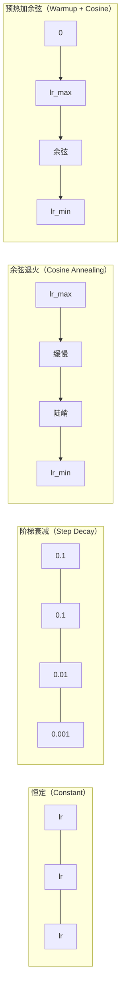
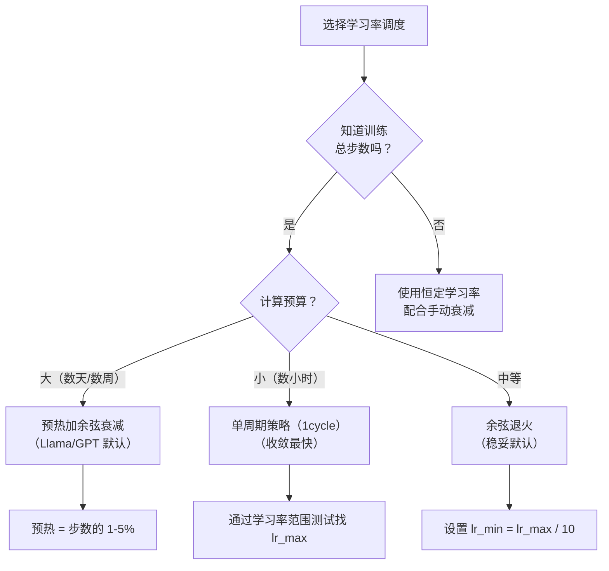
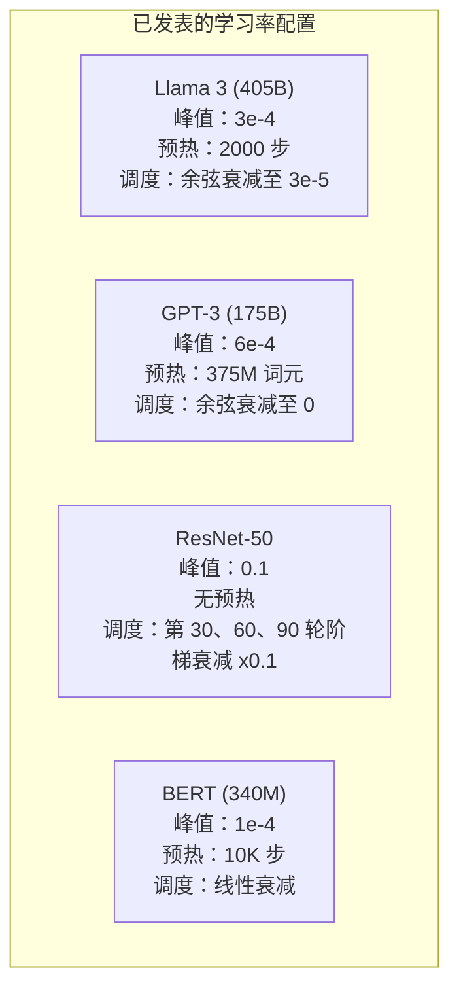

# 学习率调度与预热（Learning Rate Schedules and Warmup）

> 最重要的单个超参数是学习率。不是架构，不是数据集大小，也不是激活函数，就是学习率。其他都不调，也要调它。

**Type:** Build
**Languages:** Python
**Prerequisites:** 第 03.06 课（优化器，Optimizers），第 03.08 课（权重初始化，Weight Initialization）
**Time:** ~90 分钟

## 学习目标（Learning Objectives）

- 从零实现恒定、阶梯衰减、余弦退火、预热加余弦以及单周期（1cycle）学习率调度
- 演示学习率选择的三种失效模式：发散（过高）、停滞（过低）以及振荡（不衰减）
- 解释基于 Adam 的优化器为什么需要预热（Warmup），以及预热如何稳定早期训练
- 在相同任务上比较五种调度的收敛速度，为给定训练预算选择合适方案

## 问题（The Problem）

学习率设为 0.1，训练发散，3 步内损失升至无穷大。设为 0.0001，训练缓慢爬行，100 轮后模型仍几乎停在随机状态。设为 0.01，前 50 轮训练正常，随后损失在永远无法抵达的最小值周围振荡，因为步子太大。

最优学习率不是常数，而是随训练变化。早期需要大步快速探索，后期需要小步收敛到尖锐的最小值。准确率 90% 与 95% 的模型，差别往往仅在调度。

过去三年发表的每个主要模型都使用学习率调度。Llama 3 使用峰值 lr=3e-4、2000 步预热，再余弦衰减至 3e-5。GPT-3 使用 lr=6e-4，在前 3.75 亿词元上预热。这些选择不是随意的，而是耗资数百万美元的大规模超参数搜索结果。

你需要理解调度，因为默认值未必适合你的问题。微调预训练模型与从零训练需要不同调度；增大批量大小，预热时长也需变化；第 10,000 步训练失败时，你必须判断问题来自调度还是其他因素。

## 概念（The Concept）

### 恒定学习率（Constant Learning Rate）

最简单的方法：选一个数，每一步都用它。

```
lr(t) = lr_0
```

它很少最优：要么在训练后期过高（围绕最小值振荡），要么在早期过低（用微小步长浪费计算）。适合小模型和调试，但训练超过一小时的任务选它就很糟。

### 阶梯衰减（Step Decay）

ResNet 时代的传统方法，在固定轮次按比例降低学习率，通常降低 10 倍。

```
lr(t) = lr_0 * gamma^(floor(epoch / step_size))
```

gamma = 0.1、step_size = 30 意味着每 30 轮将 lr 降至原来的 1/10。ResNet-50 就用了它：lr=0.1，第 30、60、90 轮各降低 10 倍。

问题是最优衰减时点取决于数据集和架构。换个问题就需要重新调节何时下降。切换很突然，学习率骤变可能导致损失尖峰。

### 余弦退火（Cosine Annealing）

沿余弦曲线从最大学习率平滑衰减到最小值：

```
lr(t) = lr_min + 0.5 * (lr_max - lr_min) * (1 + cos(pi * t / T))
```

其中 t 为当前步数，T 为总步数。

t=0 时，余弦项为 1，因此 lr = lr_max；t=T 时，余弦项为 -1，因此 lr = lr_min。开始时衰减平缓，中间加快，临近结束时再次放缓。

这是多数现代训练任务的默认方案。除 lr_max 和 lr_min 外，没有超参数需要调节。余弦形状符合经验观察：大部分学习发生在训练中期，关键时期应保持合理步长。

### 预热：为什么从小步开始（Warmup: Why You Start Small）

Adam 和其他自适应优化器维护梯度均值与方差的移动估计。第 0 步时，这些估计初始化为零，最初几次梯度更新依据的是不可靠统计。如果此时学习率很大，模型就会迈出巨大而方向不准的步子。

预热解决了这一点。先用很小的学习率，通常为 lr_max / warmup_steps，甚至为零，再在前 N 步线性升至 lr_max。达到完整学习率时，Adam 的统计已经稳定。

```
lr(t) = lr_max * (t / warmup_steps)     当 t < warmup_steps 时
```

典型预热时长为总训练步数的 1-5%。Llama 3 用约 1.8 万亿词元训练，预热 2000 步。GPT-3 在前 3.75 亿词元上预热。

### 线性预热加余弦衰减（Linear Warmup + Cosine Decay）

现代默认方案：先线性升高，再余弦衰减：

```
if t < warmup_steps:
    lr(t) = lr_max * (t / warmup_steps)
else:
    progress = (t - warmup_steps) / (total_steps - warmup_steps)
    lr(t) = lr_min + 0.5 * (lr_max - lr_min) * (1 + cos(pi * progress))
```

Llama、GPT、PaLM 和多数现代 Transformer 都使用它。预热防止早期不稳定，余弦衰减使模型落在良好最小值上。

### 单周期策略（1cycle Policy）

Leslie Smith 在 2018 年发现：训练前半程将学习率从低值升至高值，后半程再降下来。这很反直觉，为什么在训练中途*提高*学习率？

理论是：高学习率向优化轨迹加入噪声，起到正则化（Regularization）作用。升高阶段让模型探索更多损失曲面，找到更好的盆地（Basin）；降低阶段则在找到的最佳盆地中精细优化。

```
阶段 1（0 到 T/2）：学习率从 lr_max/25 升至 lr_max
阶段 2（T/2 到 T）：学习率从 lr_max 降至 lr_max/10000
```

固定计算预算下，1cycle 往往比余弦退火训练更快。代价是必须提前知道总步数。

### 调度形状（Schedule Shapes）



### 决策流程图（Decision Flowchart）



### 已发表模型的实际数值（Real Numbers from Published Models）



```figure
lr-schedule
```

## 动手实现（Build It）

### 步骤 1：调度函数（Step 1: Schedule Functions）

每个函数接收当前步数，返回该步的学习率。

```python
import math


def constant_schedule(step, lr=0.01, **kwargs):
    return lr


def step_decay_schedule(step, lr=0.1, step_size=100, gamma=0.1, **kwargs):
    return lr * (gamma ** (step // step_size))


def cosine_schedule(step, lr=0.01, total_steps=1000, lr_min=1e-5, **kwargs):
    if step >= total_steps:
        return lr_min
    return lr_min + 0.5 * (lr - lr_min) * (1 + math.cos(math.pi * step / total_steps))


def warmup_cosine_schedule(step, lr=0.01, total_steps=1000, warmup_steps=100, lr_min=1e-5, **kwargs):
    if total_steps <= warmup_steps:
        return lr * (step / max(warmup_steps, 1))
    if step < warmup_steps:
        return lr * step / warmup_steps
    progress = (step - warmup_steps) / (total_steps - warmup_steps)
    return lr_min + 0.5 * (lr - lr_min) * (1 + math.cos(math.pi * progress))


def one_cycle_schedule(step, lr=0.01, total_steps=1000, **kwargs):
    mid = max(total_steps // 2, 1)
    if step < mid:
        return (lr / 25) + (lr - lr / 25) * step / mid
    else:
        progress = (step - mid) / max(total_steps - mid, 1)
        return lr * (1 - progress) + (lr / 10000) * progress
```

### 步骤 2：可视化全部调度（Step 2: Visualize All Schedules）

打印文本图，展示各调度如何随训练变化。

```python
def visualize_schedule(name, schedule_fn, total_steps=500, **kwargs):
    steps = list(range(0, total_steps, total_steps // 20))
    if total_steps - 1 not in steps:
        steps.append(total_steps - 1)

    lrs = [schedule_fn(s, total_steps=total_steps, **kwargs) for s in steps]
    max_lr = max(lrs) if max(lrs) > 0 else 1.0

    print(f"\n{name}:")
    for s, lr_val in zip(steps, lrs):
        bar_len = int(lr_val / max_lr * 40)
        bar = "#" * bar_len
        print(f"  Step {s:4d}: lr={lr_val:.6f} {bar}")
```

### 步骤 3：训练网络（Step 3: Training Network）

使用与前几课相同的简单双层网络和圆形数据集，但现在改变调度。

```python
import random


def sigmoid(x):
    x = max(-500, min(500, x))
    return 1.0 / (1.0 + math.exp(-x))


def relu(x):
    return max(0.0, x)


def relu_deriv(x):
    return 1.0 if x > 0 else 0.0


def make_circle_data(n=200, seed=42):
    random.seed(seed)
    data = []
    for _ in range(n):
        x = random.uniform(-2, 2)
        y = random.uniform(-2, 2)
        label = 1.0 if x * x + y * y < 1.5 else 0.0
        data.append(([x, y], label))
    return data


def train_with_schedule(schedule_fn, schedule_name, data, epochs=300, base_lr=0.05, **kwargs):
    random.seed(0)
    hidden_size = 8
    total_steps = epochs * len(data)

    std = math.sqrt(2.0 / 2)
    w1 = [[random.gauss(0, std) for _ in range(2)] for _ in range(hidden_size)]
    b1 = [0.0] * hidden_size
    w2 = [random.gauss(0, std) for _ in range(hidden_size)]
    b2 = 0.0

    step = 0
    epoch_losses = []

    for epoch in range(epochs):
        total_loss = 0
        correct = 0

        for x, target in data:
            lr = schedule_fn(step, lr=base_lr, total_steps=total_steps, **kwargs)

            z1 = []
            h = []
            for i in range(hidden_size):
                z = w1[i][0] * x[0] + w1[i][1] * x[1] + b1[i]
                z1.append(z)
                h.append(relu(z))

            z2 = sum(w2[i] * h[i] for i in range(hidden_size)) + b2
            out = sigmoid(z2)

            error = out - target
            d_out = error * out * (1 - out)

            for i in range(hidden_size):
                d_h = d_out * w2[i] * relu_deriv(z1[i])
                w2[i] -= lr * d_out * h[i]
                for j in range(2):
                    w1[i][j] -= lr * d_h * x[j]
                b1[i] -= lr * d_h
            b2 -= lr * d_out

            total_loss += (out - target) ** 2
            if (out >= 0.5) == (target >= 0.5):
                correct += 1
            step += 1

        avg_loss = total_loss / len(data)
        accuracy = correct / len(data) * 100
        epoch_losses.append(avg_loss)

    return epoch_losses
```

### 步骤 4：比较全部调度（Step 4: Compare All Schedules）

使用每种调度训练相同网络，比较最终损失及收敛行为。

```python
def compare_schedules(data):
    configs = [
        ("Constant", constant_schedule, {}),
        ("Step Decay", step_decay_schedule, {"step_size": 15000, "gamma": 0.1}),
        ("Cosine", cosine_schedule, {"lr_min": 1e-5}),
        ("Warmup+Cosine", warmup_cosine_schedule, {"warmup_steps": 3000, "lr_min": 1e-5}),
        ("1cycle", one_cycle_schedule, {}),
    ]

    print(f"\n{'Schedule':<20} {'Start Loss':>12} {'Mid Loss':>12} {'End Loss':>12} {'Best Loss':>12}")
    print("-" * 70)

    for name, schedule_fn, extra_kwargs in configs:
        losses = train_with_schedule(schedule_fn, name, data, epochs=300, base_lr=0.05, **extra_kwargs)
        mid_idx = len(losses) // 2
        best = min(losses)
        print(f"{name:<20} {losses[0]:>12.6f} {losses[mid_idx]:>12.6f} {losses[-1]:>12.6f} {best:>12.6f}")
```

### 步骤 5：学习率过高与过低（Step 5: LR Too High vs Too Low）

演示三种情况：过高（发散）、过低（缓慢爬行）以及恰当。

```python
def lr_sensitivity(data):
    learning_rates = [1.0, 0.1, 0.01, 0.001, 0.0001]

    print("\nLR Sensitivity (constant schedule, 100 epochs):")
    print(f"  {'LR':>10} {'Start Loss':>12} {'End Loss':>12} {'Status':>15}")
    print("  " + "-" * 52)

    for lr in learning_rates:
        losses = train_with_schedule(constant_schedule, f"lr={lr}", data, epochs=100, base_lr=lr)
        start = losses[0]
        end = losses[-1]

        if end > start or math.isnan(end) or end > 1.0:
            status = "DIVERGED"
        elif end > start * 0.9:
            status = "BARELY MOVED"
        elif end < 0.15:
            status = "CONVERGED"
        else:
            status = "LEARNING"

        end_str = f"{end:.6f}" if not math.isnan(end) else "NaN"
        print(f"  {lr:>10.4f} {start:>12.6f} {end_str:>12} {status:>15}")
```

## 实际应用（Use It）

PyTorch 在 `torch.optim.lr_scheduler` 中提供调度器：

```python
import torch
import torch.optim as optim
from torch.optim.lr_scheduler import CosineAnnealingLR, OneCycleLR, StepLR

model = nn.Sequential(nn.Linear(10, 64), nn.ReLU(), nn.Linear(64, 1))
optimizer = optim.Adam(model.parameters(), lr=3e-4)

scheduler = CosineAnnealingLR(optimizer, T_max=1000, eta_min=1e-5)

for step in range(1000):
    loss = train_step(model, optimizer)
    scheduler.step()
```

预热加余弦可以使用 lambda 调度器，或 HuggingFace 的 `get_cosine_schedule_with_warmup`：

```python
from transformers import get_cosine_schedule_with_warmup

scheduler = get_cosine_schedule_with_warmup(
    optimizer,
    num_warmup_steps=2000,
    num_training_steps=100000,
)
```

多数 Llama 和 GPT 微调脚本都使用这个 HuggingFace 函数。不确定时，使用预热加余弦，预热占总步数的 3-5%，它几乎适用于所有情况。

## 交付成果（Ship It）

本课产出：
- `outputs/prompt-lr-schedule-advisor.md`：根据训练设置推荐合适学习率调度和超参数的提示词

## 练习（Exercises）

1. 实现指数衰减（Exponential Decay）：lr(t) = lr_0 * gamma^t，其中 gamma = 0.999。在圆形数据集上与余弦退火比较。

2. 实现学习率范围测试（LR Range Test，Leslie Smith）：训练数百步，同时将学习率从 1e-7 指数级升至 1。绘制损失与学习率的关系。损失开始上升之前的学习率，就是最优的最大学习率。

3. 使用预热加余弦训练，分别让预热占总步数的 0%、1%、5%、10%、20%，找出训练最稳定的合适时长。

4. 实现带热重启的余弦退火（SGDR）：每 T 步将学习率重置为 lr_max，再次衰减。在更长的训练任务中与标准余弦比较。

5. 构建“调度调整器”，监控训练损失，在损失稳定时自动从预热切换到余弦，并在平台期持续过久时降低 lr。

## 关键术语（Key Terms）

| 术语 | 常见说法 | 实际含义 |
|------|----------------|----------------------|
| 学习率（Learning Rate） | “模型学得多快” | 乘以梯度以确定参数更新大小的标量 |
| 调度（Schedule） | “随时间改变学习率” | 将训练步数映射到学习率、旨在优化收敛的函数 |
| 预热（Warmup） | “从小学习率开始” | 前 N 步将学习率从接近零线性升至目标值，以稳定优化器统计 |
| 余弦退火（Cosine Annealing） | “平滑衰减学习率” | 训练期间沿余弦曲线将学习率从 lr_max 降至 lr_min |
| 阶梯衰减（Step Decay） | “在里程碑降低学习率” | 每隔固定轮次将学习率乘以一个因子，通常为 0.1 |
| 单周期策略（1cycle Policy） | “先升后降” | Leslie Smith 提出的学习率单周期升降方法，用于更快收敛 |
| 学习率范围测试（LR Range Test） | “找出最佳学习率” | 短暂训练并不断提高学习率，找出损失开始发散的值 |
| 带热重启的余弦调度（Cosine with Warm Restarts） | “重置再重复” | 定期将学习率重置为 lr_max，然后再次衰减（SGDR） |
| 最小学习率（Eta Min） | “学习率下限” | 调度衰减到的最小学习率 |
| 峰值学习率（Peak Learning Rate） | “最大学习率” | 训练期间达到的最高学习率，通常在预热结束时达到 |

## 延伸阅读（Further Reading）

- Loshchilov 与 Hutter，《SGDR：带热重启的随机梯度下降（SGDR: Stochastic Gradient Descent with Warm Restarts）》（2017）：提出余弦退火和热重启
- Smith，《超级收敛：使用大学习率快速训练神经网络（Super-Convergence: Very Fast Training of Neural Networks Using Large Learning Rates）》（2018）：1cycle 策略论文
- Touvron 等，《Llama 2：开放基础模型与微调聊天模型（Llama 2: Open Foundation and Fine-Tuned Chat Models）》（2023）：记录大规模训练使用的预热加余弦调度
- Goyal 等，《精确的大批量 SGD：一小时训练 ImageNet（Accurate, Large Minibatch SGD: Training ImageNet in 1 Hour）》（2017）：大批量训练中的线性缩放规则与预热
