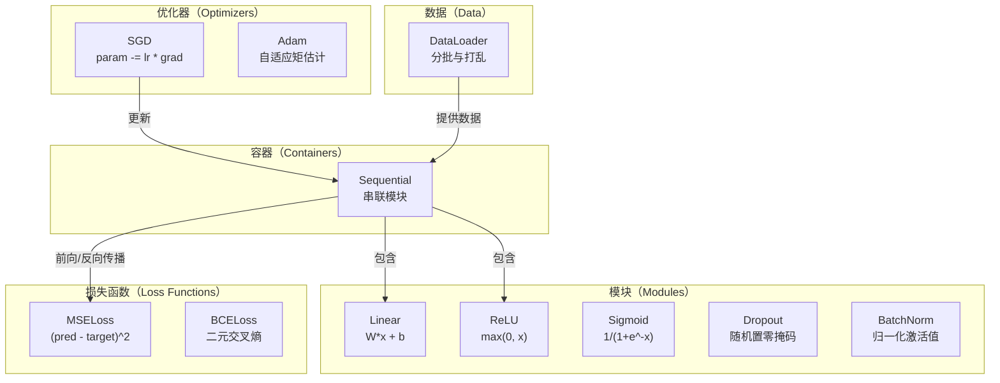
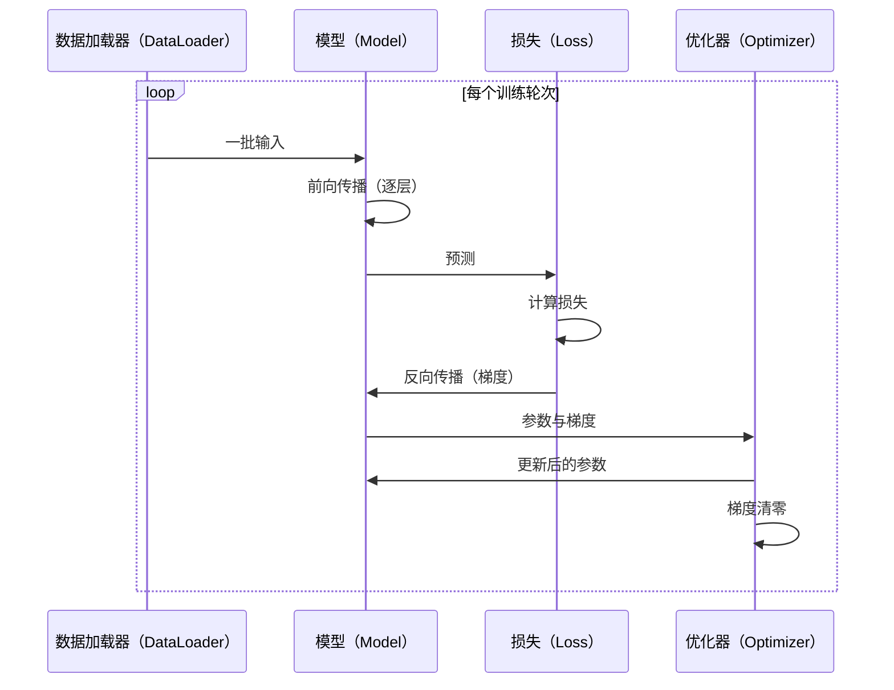
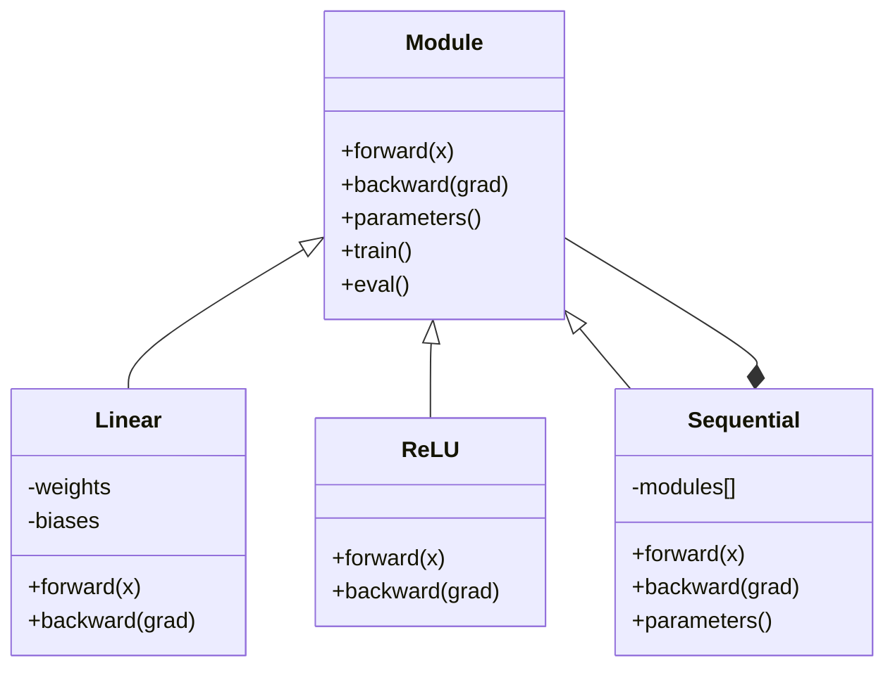

# 构建自己的迷你框架（Build Your Own Mini Framework）

> 你已构建神经元、层、网络、反向传播、激活函数、损失函数、优化器、正则化、初始化和学习率调度，但它们还是独立部件。现在将它们连接成一个框架。不是 PyTorch，不是 TensorFlow，而是你自己的。

**Type:** Build
**Languages:** Python
**Prerequisites:** 阶段 03 前面的全部课程（第 01-09 课）
**Time:** ~120 分钟

## 学习目标（Learning Objectives）

- 构建完整的深度学习框架（约 500 行），包含 Module、Linear、ReLU、Sigmoid、Dropout、BatchNorm、Sequential、损失函数、优化器和 DataLoader
- 解释 Module 抽象（forward、backward、parameters），以及为什么需要切换训练/评估模式
- 将所有组件连接到可运行的训练循环中，训练 4 层网络进行圆内外分类
- 将框架各组件映射到 PyTorch 对应项（nn.Module、nn.Sequential、optim.Adam、DataLoader）

## 问题（The Problem）

十节课的构建模块散落在不同文件里：这里有 `Value` 类，那里有训练循环，权重初始化在另一个文件，学习率调度又在别处。训练网络时，需要从五节不同课程中复制代码，再手动连接。

框架解决的就是这个问题。PyTorch 提供 `nn.Module`、`nn.Sequential`、`optim.Adam`、`DataLoader`，以及将它们串起来的训练循环模式。TensorFlow 提供 `keras.Layer`、`keras.Sequential`、`keras.optimizers.Adam`。它们不是魔法，而是组织模式，让你定义、训练、评估网络时，不必每次都重写连接逻辑。

你将用约 500 行 Python 构建同样的东西。不用 numpy，没有外部依赖。这个框架能定义任意前馈网络（Feedforward Network），用 SGD 或 Adam 训练，对数据分批，应用随机失活和批归一化，使用任意激活函数，并调度学习率。

完成后，你会准确理解在 PyTorch 中写下 `model = nn.Sequential(...)` 时发生了什么，为什么存在 `model.train()` 和 `model.eval()`，为什么 `optimizer.zero_grad()` 是单独调用。你会理解全部内容，因为全部都是你亲手构建的。

## 概念（The Concept）

### Module 抽象（The Module Abstraction）

PyTorch 的每一层都继承 `nn.Module`。Module 有三项职责：

1. **forward()**：根据输入计算输出
2. **parameters()**：返回所有可训练权重
3. **backward()**：计算梯度，PyTorch 由自动求导（Autograd）处理，我们显式实现

Linear 层是 Module，ReLU 激活是 Module，随机失活层是 Module，批归一化层也是 Module。它们有相同接口。

### Sequential 容器（Sequential Container）

`nn.Sequential` 串联 Module。前向传播时，数据依次经过 Module 1、Module 2、Module 3；反向传播时逆序处理。容器本身也是 Module，也有 forward()、parameters()、backward()。这就是组合模式（Composite Pattern）：Module 的序列本身仍是一个 Module。

### 训练与评估模式（Training vs Evaluation Mode）

随机失活在训练时随机将神经元置零，评估时则全部放行。批归一化在训练时用批次统计，评估时用移动平均。`train()` 和 `eval()` 方法切换这些行为，每个 Module 都有 `training` 标志。

### 优化器（Optimizer）

优化器根据梯度更新参数。SGD 执行 `param -= lr * grad`；Adam 维护动量和方差估计后更新。优化器不知道网络架构，只看到展平的参数及其梯度列表。

### 数据加载器（DataLoader）

分批有两个重要原因。第一，大问题中整个数据集无法一次装入内存。第二，小批量梯度下降引入噪声，有助于逃离局部最小值。DataLoader 将数据拆成批次，并可选地在各轮之间打乱顺序。

### 框架架构（Framework Architecture）



### 训练循环（Training Loop）



### 模块层级（Module Hierarchy）



```figure
gradient-clipping
```

## 动手实现（Build It）

### 步骤 1：Module 基类（Step 1: Module Base Class）

每个层都要实现的抽象接口。

```python
class Module:
    def __init__(self):
        self.training = True

    def forward(self, x):
        raise NotImplementedError

    def backward(self, grad):
        raise NotImplementedError

    def parameters(self):
        return []

    def train(self):
        self.training = True

    def eval(self):
        self.training = False
```

### 步骤 2：Linear 层（Step 2: Linear Layer）

基本构建模块。保存权重和偏置，前向计算 Wx + b，反向计算权重与输入梯度。

```python
import math
import random


class Linear(Module):
    def __init__(self, fan_in, fan_out):
        super().__init__()
        std = math.sqrt(2.0 / fan_in)
        self.weights = [[random.gauss(0, std) for _ in range(fan_in)] for _ in range(fan_out)]
        self.biases = [0.0] * fan_out
        self.weight_grads = [[0.0] * fan_in for _ in range(fan_out)]
        self.bias_grads = [0.0] * fan_out
        self.fan_in = fan_in
        self.fan_out = fan_out
        self.input = None

    def forward(self, x):
        self.input = x
        output = []
        for i in range(self.fan_out):
            val = self.biases[i]
            for j in range(self.fan_in):
                val += self.weights[i][j] * x[j]
            output.append(val)
        return output

    def backward(self, grad):
        input_grad = [0.0] * self.fan_in
        for i in range(self.fan_out):
            self.bias_grads[i] += grad[i]
            for j in range(self.fan_in):
                self.weight_grads[i][j] += grad[i] * self.input[j]
                input_grad[j] += grad[i] * self.weights[i][j]
        return input_grad

    def parameters(self):
        params = []
        for i in range(self.fan_out):
            for j in range(self.fan_in):
                params.append((self.weights, i, j, self.weight_grads))
            params.append((self.biases, i, None, self.bias_grads))
        return params
```

### 步骤 3：激活模块（Step 3: Activation Modules）

将 ReLU、Sigmoid 和 Tanh 实现为 Module，每个缓存反向传播所需的信息。

```python
class ReLU(Module):
    def __init__(self):
        super().__init__()
        self.mask = None

    def forward(self, x):
        self.mask = [1.0 if v > 0 else 0.0 for v in x]
        return [max(0.0, v) for v in x]

    def backward(self, grad):
        return [g * m for g, m in zip(grad, self.mask)]


class Sigmoid(Module):
    def __init__(self):
        super().__init__()
        self.output = None

    def forward(self, x):
        self.output = []
        for v in x:
            v = max(-500, min(500, v))
            self.output.append(1.0 / (1.0 + math.exp(-v)))
        return self.output

    def backward(self, grad):
        return [g * o * (1 - o) for g, o in zip(grad, self.output)]


class Tanh(Module):
    def __init__(self):
        super().__init__()
        self.output = None

    def forward(self, x):
        self.output = [math.tanh(v) for v in x]
        return self.output

    def backward(self, grad):
        return [g * (1 - o * o) for g, o in zip(grad, self.output)]
```

### 步骤 4：Dropout 模块（Step 4: Dropout Module）

训练时随机将元素置零，其余元素乘以 1/(1-p) 以保持期望值不变。评估时不作任何处理。

```python
class Dropout(Module):
    def __init__(self, p=0.5):
        super().__init__()
        self.p = p
        self.mask = None

    def forward(self, x):
        if not self.training:
            return x
        self.mask = [0.0 if random.random() < self.p else 1.0 / (1 - self.p) for _ in x]
        return [v * m for v, m in zip(x, self.mask)]

    def backward(self, grad):
        if self.mask is None:
            return grad
        return [g * m for g, m in zip(grad, self.mask)]
```

### 步骤 5：BatchNorm 模块（Step 5: BatchNorm Module）

对每个特征沿批量维度将激活值归一化为零均值、单位方差，并维护评估模式使用的移动统计。

```python
class BatchNorm(Module):
    def __init__(self, size, momentum=0.1, eps=1e-5):
        super().__init__()
        self.size = size
        self.gamma = [1.0] * size
        self.beta = [0.0] * size
        self.gamma_grads = [0.0] * size
        self.beta_grads = [0.0] * size
        self.running_mean = [0.0] * size
        self.running_var = [1.0] * size
        self.momentum = momentum
        self.eps = eps
        self.x_norm = None
        self.std_inv = None
        self.batch_input = None

    def forward_batch(self, batch):
        batch_size = len(batch)
        output_batch = []

        if self.training:
            mean = [0.0] * self.size
            for sample in batch:
                for j in range(self.size):
                    mean[j] += sample[j]
            mean = [m / batch_size for m in mean]

            var = [0.0] * self.size
            for sample in batch:
                for j in range(self.size):
                    var[j] += (sample[j] - mean[j]) ** 2
            var = [v / batch_size for v in var]

            self.std_inv = [1.0 / math.sqrt(v + self.eps) for v in var]

            self.x_norm = []
            self.batch_input = batch
            for sample in batch:
                normed = [(sample[j] - mean[j]) * self.std_inv[j] for j in range(self.size)]
                self.x_norm.append(normed)
                output = [self.gamma[j] * normed[j] + self.beta[j] for j in range(self.size)]
                output_batch.append(output)

            for j in range(self.size):
                self.running_mean[j] = (1 - self.momentum) * self.running_mean[j] + self.momentum * mean[j]
                self.running_var[j] = (1 - self.momentum) * self.running_var[j] + self.momentum * var[j]
        else:
            std_inv = [1.0 / math.sqrt(v + self.eps) for v in self.running_var]
            for sample in batch:
                normed = [(sample[j] - self.running_mean[j]) * std_inv[j] for j in range(self.size)]
                output = [self.gamma[j] * normed[j] + self.beta[j] for j in range(self.size)]
                output_batch.append(output)

        return output_batch

    def forward(self, x):
        result = self.forward_batch([x])
        return result[0]

    def backward(self, grad):
        if self.x_norm is None:
            return grad
        for j in range(self.size):
            self.gamma_grads[j] += self.x_norm[0][j] * grad[j]
            self.beta_grads[j] += grad[j]
        return [grad[j] * self.gamma[j] * self.std_inv[j] for j in range(self.size)]

    def parameters(self):
        params = []
        for j in range(self.size):
            params.append((self.gamma, j, None, self.gamma_grads))
            params.append((self.beta, j, None, self.beta_grads))
        return params
```

### 步骤 6：Sequential 容器（Step 6: Sequential Container）

串联模块，前向从左到右，反向从右到左。

```python
class Sequential(Module):
    def __init__(self, *modules):
        super().__init__()
        self.modules = list(modules)

    def forward(self, x):
        for module in self.modules:
            x = module.forward(x)
        return x

    def backward(self, grad):
        for module in reversed(self.modules):
            grad = module.backward(grad)
        return grad

    def parameters(self):
        params = []
        for module in self.modules:
            params.extend(module.parameters())
        return params

    def train(self):
        self.training = True
        for module in self.modules:
            module.train()

    def eval(self):
        self.training = False
        for module in self.modules:
            module.eval()
```

### 步骤 7：损失函数（Step 7: Loss Functions）

均方误差（MSE）与二元交叉熵（Binary Cross-Entropy）。每个返回损失值，并提供返回梯度的 backward()。

```python
class MSELoss:
    def __call__(self, predicted, target):
        self.predicted = predicted
        self.target = target
        n = len(predicted)
        self.loss = sum((p - t) ** 2 for p, t in zip(predicted, target)) / n
        return self.loss

    def backward(self):
        n = len(self.predicted)
        return [2 * (p - t) / n for p, t in zip(self.predicted, self.target)]


class BCELoss:
    def __call__(self, predicted, target):
        self.predicted = predicted
        self.target = target
        eps = 1e-7
        n = len(predicted)
        self.loss = 0
        for p, t in zip(predicted, target):
            p = max(eps, min(1 - eps, p))
            self.loss += -(t * math.log(p) + (1 - t) * math.log(1 - p))
        self.loss /= n
        return self.loss

    def backward(self):
        eps = 1e-7
        n = len(self.predicted)
        grads = []
        for p, t in zip(self.predicted, self.target):
            p = max(eps, min(1 - eps, p))
            grads.append((-t / p + (1 - t) / (1 - p)) / n)
        return grads
```

### 步骤 8：SGD 与 Adam 优化器（Step 8: SGD and Adam Optimizers）

两者都接收参数列表，并根据梯度更新权重。

```python
class SGD:
    def __init__(self, parameters, lr=0.01):
        self.params = parameters
        self.lr = lr

    def step(self):
        for container, i, j, grad_container in self.params:
            if j is not None:
                container[i][j] -= self.lr * grad_container[i][j]
            else:
                container[i] -= self.lr * grad_container[i]

    def zero_grad(self):
        for container, i, j, grad_container in self.params:
            if j is not None:
                grad_container[i][j] = 0.0
            else:
                grad_container[i] = 0.0


class Adam:
    def __init__(self, parameters, lr=0.001, beta1=0.9, beta2=0.999, eps=1e-8):
        self.params = parameters
        self.lr = lr
        self.beta1 = beta1
        self.beta2 = beta2
        self.eps = eps
        self.t = 0
        self.m = [0.0] * len(parameters)
        self.v = [0.0] * len(parameters)

    def step(self):
        self.t += 1
        for idx, (container, i, j, grad_container) in enumerate(self.params):
            if j is not None:
                g = grad_container[i][j]
            else:
                g = grad_container[i]

            self.m[idx] = self.beta1 * self.m[idx] + (1 - self.beta1) * g
            self.v[idx] = self.beta2 * self.v[idx] + (1 - self.beta2) * g * g

            m_hat = self.m[idx] / (1 - self.beta1 ** self.t)
            v_hat = self.v[idx] / (1 - self.beta2 ** self.t)

            update = self.lr * m_hat / (math.sqrt(v_hat) + self.eps)

            if j is not None:
                container[i][j] -= update
            else:
                container[i] -= update

    def zero_grad(self):
        for container, i, j, grad_container in self.params:
            if j is not None:
                grad_container[i][j] = 0.0
            else:
                grad_container[i] = 0.0
```

### 步骤 9：DataLoader（Step 9: DataLoader）

将数据拆成批次，可选地每轮打乱顺序。

```python
class DataLoader:
    def __init__(self, data, batch_size=32, shuffle=True):
        self.data = data
        self.batch_size = batch_size
        self.shuffle = shuffle

    def __iter__(self):
        indices = list(range(len(self.data)))
        if self.shuffle:
            random.shuffle(indices)
        for start in range(0, len(indices), self.batch_size):
            batch_indices = indices[start:start + self.batch_size]
            batch = [self.data[i] for i in batch_indices]
            inputs = [item[0] for item in batch]
            targets = [item[1] for item in batch]
            yield inputs, targets

    def __len__(self):
        return (len(self.data) + self.batch_size - 1) // self.batch_size
```

### 步骤 10：训练 4 层网络进行圆内外分类（Step 10: Train a 4-Layer Network on Circle Classification）

将所有内容连接起来：定义模型，选择损失，选择优化器，运行训练循环。

```python
def make_circle_data(n=500, seed=42):
    random.seed(seed)
    data = []
    for _ in range(n):
        x = random.uniform(-2, 2)
        y = random.uniform(-2, 2)
        label = 1.0 if x * x + y * y < 1.5 else 0.0
        data.append(([x, y], [label]))
    return data


def train():
    random.seed(42)

    model = Sequential(
        Linear(2, 16),
        ReLU(),
        Linear(16, 16),
        ReLU(),
        Linear(16, 8),
        ReLU(),
        Linear(8, 1),
        Sigmoid(),
    )

    criterion = BCELoss()
    optimizer = Adam(model.parameters(), lr=0.01)

    data = make_circle_data(500)
    split = int(len(data) * 0.8)
    train_data = data[:split]
    test_data = data[split:]

    loader = DataLoader(train_data, batch_size=16, shuffle=True)

    model.train()

    for epoch in range(100):
        total_loss = 0
        total_correct = 0
        total_samples = 0

        for batch_inputs, batch_targets in loader:
            batch_loss = 0
            for x, t in zip(batch_inputs, batch_targets):
                pred = model.forward(x)
                loss = criterion(pred, t)
                batch_loss += loss

                optimizer.zero_grad()
                grad = criterion.backward()
                model.backward(grad)
                optimizer.step()

                predicted_class = 1.0 if pred[0] >= 0.5 else 0.0
                if predicted_class == t[0]:
                    total_correct += 1
                total_samples += 1

            total_loss += batch_loss

        avg_loss = total_loss / total_samples
        accuracy = total_correct / total_samples * 100

        if epoch % 10 == 0 or epoch == 99:
            print(f"Epoch {epoch:3d} | Loss: {avg_loss:.6f} | Train Accuracy: {accuracy:.1f}%")

    model.eval()
    correct = 0
    for x, t in test_data:
        pred = model.forward(x)
        predicted_class = 1.0 if pred[0] >= 0.5 else 0.0
        if predicted_class == t[0]:
            correct += 1
    test_accuracy = correct / len(test_data) * 100
    print(f"\nTest Accuracy: {test_accuracy:.1f}% ({correct}/{len(test_data)})")

    return model, test_accuracy
```

## 实际应用（Use It）

下面是你刚构建的内容在 PyTorch 中的等效实现：

```python
import torch
import torch.nn as nn
from torch.utils.data import DataLoader, TensorDataset

model = nn.Sequential(
    nn.Linear(2, 16),
    nn.ReLU(),
    nn.Linear(16, 16),
    nn.ReLU(),
    nn.Linear(16, 8),
    nn.ReLU(),
    nn.Linear(8, 1),
    nn.Sigmoid(),
)

criterion = nn.BCELoss()
optimizer = torch.optim.Adam(model.parameters(), lr=0.01)

for epoch in range(100):
    model.train()
    for inputs, targets in dataloader:
        optimizer.zero_grad()
        predictions = model(inputs)
        loss = criterion(predictions, targets)
        loss.backward()
        optimizer.step()

    model.eval()
    with torch.no_grad():
        test_predictions = model(test_inputs)
```

结构完全相同：`Sequential`、`Linear`、`ReLU`、`Sigmoid`、`BCELoss`、`Adam`、`zero_grad`、`backward`、`step`、`train`、`eval`。每个概念一一对应。区别在于 PyTorch 自动处理求导，无需在每个模块实现 backward()，支持 GPU，并经过多年优化。但基本结构相同。

现在看到 PyTorch 代码，你就知道每行究竟发生了什么。建立这种理解正是本课的全部目的。

## 交付成果（Ship It）

本课产出：
- `outputs/prompt-framework-architect.md`：使用框架抽象设计神经网络架构的提示词

## 练习（Exercises）

1. 添加用于多分类的 `SoftmaxCrossEntropyLoss` 类，对预测执行 Softmax、计算交叉熵损失，并处理组合后的反向传播。在 3 类螺旋数据集上测试。

2. 在优化器中实现学习率调度：添加 `set_lr()` 方法，接入第 09 课的余弦调度。用预热加余弦训练圆内外分类器，与恒定学习率比较。

3. 为 Sequential 添加 `save()` 和 `load()` 方法，将全部权重序列化到 JSON 文件并重新加载。验证加载后的模型与原模型预测一致。

4. 在 Adam 优化器中实现权重衰减（L2 正则化），添加 `weight_decay` 参数，每步将权重向零收缩。比较 decay=0 与 decay=0.01 的训练。

5. 用正确的小批量梯度累积替换逐样本训练循环：累积一批所有样本的梯度，再除以批量大小，执行一次优化器更新。测量这是否改变收敛速度。

## 关键术语（Key Terms）

| 术语 | 常见说法 | 实际含义 |
|------|----------------|----------------------|
| 模块（Module） | “一个层” | 框架的基础抽象，任何具有 forward()、backward()、parameters() 的组件 |
| 顺序容器（Sequential） | “按顺序堆叠层” | 串联模块的容器，前向依次应用，反向逆序应用 |
| 前向传播（Forward Pass） | “运行网络” | 让输入按顺序经过各模块，计算输出 |
| 反向传播（Backward Pass） | “计算梯度” | 将损失梯度逆序传过各模块，计算参数梯度 |
| 参数（Parameters） | “可训练权重” | 网络中优化器可以更新的全部数值，包括权重和偏置 |
| 优化器（Optimizer） | “更新权重的东西” | 使用梯度更新参数的算法，实现 SGD、Adam 或其他规则 |
| 数据加载器（DataLoader） | “提供数据的东西” | 将数据集拆成批次的迭代器，可选地在各轮间打乱顺序 |
| 训练模式（Training Mode） | “model.train()” | 启用随机失活等随机行为，以及使用批次统计的批归一化的标志 |
| 评估模式（Evaluation Mode） | “model.eval()” | 关闭随机失活，让批归一化使用移动统计的标志 |
| 梯度清零（Zero Grad） | “清除梯度” | 计算下一批梯度前，将全部参数梯度重置为零 |

## 延伸阅读（Further Reading）

- Paszke 等，《PyTorch：命令式风格的高性能深度学习库（PyTorch: An Imperative Style, High-Performance Deep Learning Library）》（2019）：介绍 PyTorch 设计决策的论文
- Chollet，《Python 深度学习，第二版（Deep Learning with Python, Second Edition）》（2021）：第 3 章以相同的模块/层抽象介绍 Keras 内部机制
- Johnson，Tiny-DNN (https://github.com/tiny-dnn/tiny-dnn)：仅头文件的 C++ 深度学习框架，可用于理解框架内部机制
