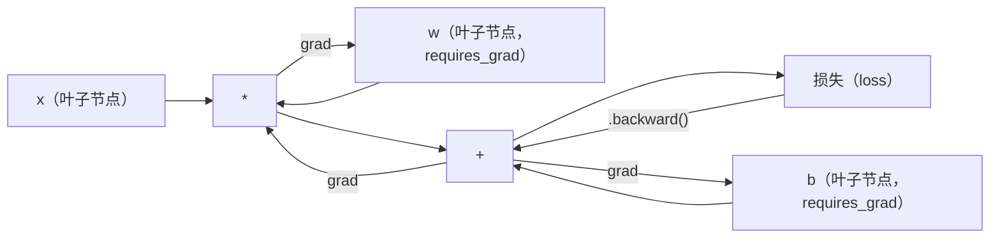
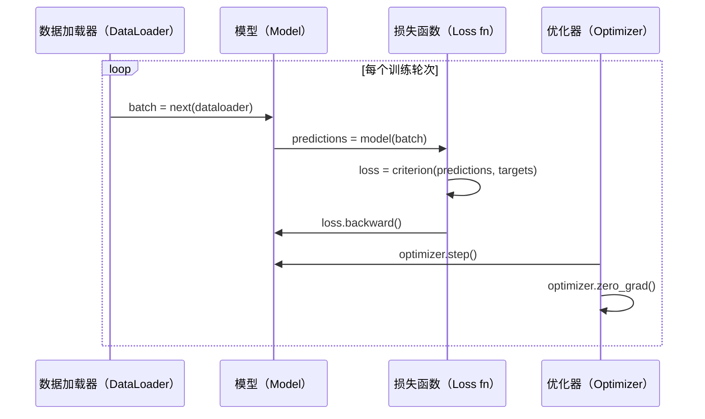

# PyTorch 入门（Introduction to PyTorch）

> 你已经用活塞和曲轴组装了发动机，现在来学大家实际驾驶的那一款。

**Type:** Build
**Languages:** Python
**Prerequisites:** 第 03.10 课（构建自己的迷你框架，Build Your Own Mini Framework）
**Time:** ~75 分钟

## 学习目标（Learning Objectives）

- 使用 PyTorch 的 nn.Module、nn.Sequential 和自动求导（Autograd）构建并训练神经网络
- 使用 PyTorch 张量（Tensor）、GPU 加速以及标准训练循环（zero_grad、forward、loss、backward、step）
- 将从零构建的迷你框架组件转换为 PyTorch 对应实现
- 在相同任务上进行性能分析，比较纯 Python 框架与 PyTorch 的训练速度

## 问题（The Problem）

你已有可运行的迷你框架：线性层、ReLU、随机失活、批归一化、Adam、DataLoader 和训练循环。它用纯 Python 在圆内外分类问题上训练 4 层网络。

但在同一问题上，它也比 PyTorch 慢 500 倍。

迷你框架用嵌套 Python 循环一次处理一个样本。PyTorch 将同样的操作交给 GPU 上优化过的 C++/CUDA 内核。单张 NVIDIA A100 上，PyTorch 训练 ResNet-50（25.6M 参数）处理 ImageNet（1.28M 图像）约需 6 小时。你的框架完成同一任务大约需要 3,000 小时，前提是内存没有先耗尽。

速度不是唯一差距。你的框架不支持 GPU，没有自动微分（Automatic Differentiation），每个模块的 backward() 都是手写的；没有序列化、分布式训练、混合精度，也没有除打印语句外的梯度流调试方法。

PyTorch 填补了全部空缺，同时保留你已经建立的相同心智模型：Module、forward()、parameters()、backward()、optimizer.step()。概念一一对应，语法几乎相同。区别在于 PyTorch 在你从零设计的同样接口背后，封装了十年的系统工程成果。

## 概念（The Concept）

### PyTorch 为什么胜出（Why PyTorch Won）

2015 年，TensorFlow 要求先定义静态计算图（Static Computation Graph），才能运行任何操作。构建图、编译，再输入数据。调试意味着盯着图的可视化，改变架构意味着从零重建计算图。

PyTorch 于 2017 年推出，采用不同理念：即时执行（Eager Execution）。你写 Python，它立刻运行。`y = model(x)` 真正在当下计算 y，而不是“添加一个稍后计算 y 的图节点”。这让标准 Python 调试工具都能工作：print()、pdb，以及前向传播中的 if/else。

到 2020 年，市场已给出答案。PyTorch 在机器学习研究论文中的占比从 2017 年的 7% 增至 2022 年超过 75%。Meta、Google DeepMind、OpenAI、Anthropic、Hugging Face 都将 PyTorch 作为主要框架。TensorFlow 2.x 随之采用即时执行，实际上承认了 PyTorch 的设计正确。

启示是：开发者体验会累积优势。运行慢 10% 但调试快 50% 的框架，总会胜出。

### 张量（Tensors）

张量是多维数组，有三个关键属性：形状（Shape）、数据类型（Dtype）和设备（Device）。

```python
import torch

x = torch.zeros(3, 4)           # shape: (3, 4), dtype: float32, device: cpu
x = torch.randn(2, 3, 224, 224) # batch of 2 RGB images, 224x224
x = torch.tensor([1, 2, 3])     # from a Python list
```

**形状（Shape）**表示维度。标量形状为 ()，向量为 (n,)，矩阵为 (m, n)，一批图像为 (batch, channels, height, width)。

**数据类型（Dtype）**控制精度和内存。

| dtype | 位数 | 范围 | 用途 |
|-------|------|-------|----------|
| float32 | 32 | 约 7 位十进制数字 | 默认训练 |
| float16 | 16 | 约 3.3 位十进制数字 | 混合精度 |
| bfloat16 | 16 | 与 float32 范围相同，精度更低 | LLM 训练 |
| int8 | 8 | -128 到 127 | 量化推理（Quantized Inference） |

**设备（Device）**决定计算发生在哪里。

```python
device = torch.device("cuda" if torch.cuda.is_available() else "cpu")
x = torch.randn(3, 4, device=device)
x = x.to("cuda")
x = x.cpu()
```

每项操作都要求所有张量位于同一设备。这是初学者最常遇到的 PyTorch 错误：`RuntimeError: Expected all tensors to be on the same device`。计算前将所有内容移至同一设备即可修复。

**重塑形状（Reshaping）**是常数时间操作，只修改元数据而非数据。

```python
x = torch.randn(2, 3, 4)
x.view(2, 12)      # reshape to (2, 12) -- must be contiguous
x.reshape(6, 4)    # reshape to (6, 4) -- works always
x.permute(2, 0, 1) # reorder dimensions
x.unsqueeze(0)     # add dimension: (1, 2, 3, 4)
x.squeeze()        # remove size-1 dimensions
```

### 自动求导（Autograd）

迷你框架要求你为每个模块实现 backward()，PyTorch 不需要。它将张量上的每项操作记录到有向无环图（即计算图）中，再逆向遍历，自动计算梯度。



与自建框架的关键区别是：PyTorch 使用基于带的自动微分（Tape-Based Autodiff）。前向传播时，每项操作追加到一条“带”上，调用 `.backward()` 时逆向回放。

```python
x = torch.randn(3, requires_grad=True)
y = x ** 2 + 3 * x
z = y.sum()
z.backward()
print(x.grad)  # dz/dx = 2x + 3
```

自动求导的三条规则：

1. 只有设置了 `requires_grad=True` 的叶子张量才会累积梯度
2. 默认累积梯度，每次反向传播前调用 `optimizer.zero_grad()`
3. `torch.no_grad()` 关闭梯度追踪，评估时使用

### 神经网络模块（nn.Module）

`nn.Module` 是 PyTorch 中所有神经网络组件的基类。你在第 10 课已构建这一抽象。PyTorch 版本增加了自动参数注册、递归模块发现、设备管理和状态字典序列化。

```python
import torch.nn as nn

class MLP(nn.Module):
    def __init__(self, input_dim, hidden_dim, output_dim):
        super().__init__()
        self.layer1 = nn.Linear(input_dim, hidden_dim)
        self.relu = nn.ReLU()
        self.layer2 = nn.Linear(hidden_dim, output_dim)

    def forward(self, x):
        x = self.layer1(x)
        x = self.relu(x)
        x = self.layer2(x)
        return x
```

在 `__init__` 中将 `nn.Module` 或 `nn.Parameter` 赋为属性时，PyTorch 自动注册它。`model.parameters()` 递归收集每个已注册参数，所以不必像迷你框架中那样手动汇总权重。

关键构建模块：

| 模块 | 功能 | 参数量 |
|--------|-------------|------------|
| nn.Linear(in, out) | Wx + b | in*out + out |
| nn.Conv2d(in_ch, out_ch, k) | 二维卷积（2D Convolution） | in_ch*out_ch*k*k + out_ch |
| nn.BatchNorm1d(features) | 归一化激活值 | 2 * features |
| nn.Dropout(p) | 随机置零 | 0 |
| nn.ReLU() | max(0, x) | 0 |
| nn.GELU() | 高斯误差线性激活 | 0 |
| nn.Embedding(vocab, dim) | 查找表（Lookup Table） | vocab * dim |
| nn.LayerNorm(dim) | 逐样本归一化 | 2 * dim |

### 损失函数与优化器（Loss Functions and Optimizers）

你构建的每种功能，PyTorch 都提供了可用于生产的版本。

**损失函数**（来自 `torch.nn`）：

| 损失 | 任务 | 输入 |
|------|------|-------|
| nn.MSELoss() | 回归 | 任意形状 |
| nn.CrossEntropyLoss() | 多分类 | 原始分数（Logits），非 Softmax 输出 |
| nn.BCEWithLogitsLoss() | 二元分类 | Logits，非 Sigmoid 输出 |
| nn.L1Loss() | 回归（稳健） | 任意形状 |
| nn.CTCLoss() | 序列对齐（Sequence Alignment） | 对数概率 |

注意：`CrossEntropyLoss` 内部组合了 `LogSoftmax` + `NLLLoss`。传入原始 Logit，而不是 Softmax 输出。这是常见错误，会悄悄产生错误梯度。

**优化器**（来自 `torch.optim`）：

| 优化器 | 使用场景 | 典型学习率 |
|-----------|-------------|-----------|
| SGD(params, lr, momentum) | CNN、充分调优的流程 | 0.01--0.1 |
| Adam(params, lr) | 默认起点 | 1e-3 |
| AdamW(params, lr, weight_decay) | Transformer、微调 | 1e-4--1e-3 |
| LBFGS(params) | 小规模、二阶优化 | 1.0 |

### 训练循环（The Training Loop）

每个 PyTorch 训练循环都遵循相同的五步模式，你在第 10 课已经见过。



标准模式：

```python
for epoch in range(num_epochs):
    model.train()
    for inputs, targets in train_loader:
        inputs, targets = inputs.to(device), targets.to(device)
        optimizer.zero_grad()
        outputs = model(inputs)
        loss = criterion(outputs, targets)
        loss.backward()
        optimizer.step()
```

批次循环里五行代码。这五行训练了 GPT-4、Stable Diffusion 和 LLaMA。架构会变，数据会变，这五行不变。

### 数据集与数据加载器（Dataset and DataLoader）

PyTorch 的 `Dataset` 是抽象类，包含 `__len__` 和 `__getitem__` 两个方法。`DataLoader` 为它包装分批、打乱和多进程数据加载。

```python
from torch.utils.data import Dataset, DataLoader

class MNISTDataset(Dataset):
    def __init__(self, images, labels):
        self.images = images
        self.labels = labels

    def __len__(self):
        return len(self.labels)

    def __getitem__(self, idx):
        return self.images[idx], self.labels[idx]

loader = DataLoader(dataset, batch_size=64, shuffle=True, num_workers=4)
```

`num_workers=4` 启动 4 个进程并行加载数据，同时 GPU 训练当前批次。对受磁盘限制的工作负载（大图像、音频），仅此一项就能将训练速度翻倍。

### GPU 训练（GPU Training）

将模型移至 GPU：

```python
device = torch.device("cuda" if torch.cuda.is_available() else "cpu")
model = model.to(device)
```

这会递归将每个参数和缓冲区移至 GPU，然后在训练时移动每个批次：

```python
inputs, targets = inputs.to(device), targets.to(device)
```

**混合精度（Mixed Precision）**在现代 GPU（A100、H100、RTX 4090）上可将内存使用减半、吞吐量翻倍：前向/反向传播用 float16，主权重仍保留 float32：

```python
from torch.amp import autocast, GradScaler

scaler = GradScaler()
for inputs, targets in loader:
    with autocast(device_type="cuda"):
        outputs = model(inputs)
        loss = criterion(outputs, targets)
    scaler.scale(loss).backward()
    scaler.step(optimizer)
    scaler.update()
    optimizer.zero_grad()
```

### 对比：迷你框架、PyTorch 与 JAX（Comparison: Mini Framework vs PyTorch vs JAX）

| 特性 | 迷你框架（第 10 课） | PyTorch | JAX |
|---------|---------------------|---------|-----|
| 自动微分 | 手动 backward() | 基于带的自动求导 | 函数变换 |
| 执行方式 | 即时（Python 循环） | 即时（C++ 内核） | 追踪 + 即时编译（JIT） |
| GPU 支持 | 无 | 有（CUDA、ROCm、MPS） | 有（CUDA、TPU） |
| 速度（MNIST MLP） | 约 300 秒/轮 | 约 0.5 秒/轮 | 约 0.3 秒/轮 |
| 模块系统 | 自定义 Module 类 | nn.Module | 无状态函数（Flax/Equinox） |
| 调试 | print() | print()、pdb、breakpoint() | 更困难（JIT 追踪会使 print 失效） |
| 生态 | 无 | Hugging Face、Lightning、timm | Flax、Optax、Orbax |
| 学习曲线 | 你自己构建的 | 中等 | 陡峭（函数式范式） |
| 生产使用 | 玩具问题 | Meta、OpenAI、Anthropic、HF | Google DeepMind、Midjourney |

```figure
dropout-mask
```

## 动手实现（Build It）

仅用 PyTorch 基础组件在 MNIST 上训练 3 层 MLP。不用高级封装，也不用 `torchvision.datasets`，自行下载并解析原始数据。

### 步骤 1：从原始文件加载 MNIST（Step 1: Load MNIST From Raw Files）

MNIST 提供 4 个 gzip 文件：训练图像（60,000 x 28 x 28）、训练标签、测试图像（10,000 x 28 x 28）和测试标签。我们下载它们并解析二进制格式。

```python
import torch
import torch.nn as nn
import struct
import gzip
import urllib.request
import os

def download_mnist(path="./mnist_data"):
    base_url = "https://storage.googleapis.com/cvdf-datasets/mnist/"
    files = [
        "train-images-idx3-ubyte.gz",
        "train-labels-idx1-ubyte.gz",
        "t10k-images-idx3-ubyte.gz",
        "t10k-labels-idx1-ubyte.gz",
    ]
    os.makedirs(path, exist_ok=True)
    for f in files:
        filepath = os.path.join(path, f)
        if not os.path.exists(filepath):
            urllib.request.urlretrieve(base_url + f, filepath)

def load_images(filepath):
    with gzip.open(filepath, "rb") as f:
        magic, num, rows, cols = struct.unpack(">IIII", f.read(16))
        data = f.read()
        images = torch.frombuffer(bytearray(data), dtype=torch.uint8)
        images = images.reshape(num, rows * cols).float() / 255.0
    return images

def load_labels(filepath):
    with gzip.open(filepath, "rb") as f:
        magic, num = struct.unpack(">II", f.read(8))
        data = f.read()
        labels = torch.frombuffer(bytearray(data), dtype=torch.uint8).long()
    return labels
```

### 步骤 2：定义模型（Step 2: Define the Model）

3 层 MLP：784 -> 256 -> 128 -> 10，使用 ReLU 激活、随机失活正则化。为保持简单，不使用批归一化。

```python
class MNISTModel(nn.Module):
    def __init__(self):
        super().__init__()
        self.net = nn.Sequential(
            nn.Linear(784, 256),
            nn.ReLU(),
            nn.Dropout(0.2),
            nn.Linear(256, 128),
            nn.ReLU(),
            nn.Dropout(0.2),
            nn.Linear(128, 10),
        )

    def forward(self, x):
        return self.net(x)
```

输出层产生 10 个原始 Logit，每个数字一个。不用 Softmax，`CrossEntropyLoss` 会在内部处理。

参数量：784*256 + 256 + 256*128 + 128 + 128*10 + 10 = 235,146。按现代标准很小，GPT-2 small 有 124M 参数。这个模型几秒就能训练。

### 步骤 3：训练循环（Step 3: Training Loop）

标准的前向、损失、反向、更新模式。

```python
def train_one_epoch(model, loader, criterion, optimizer, device):
    model.train()
    total_loss = 0
    correct = 0
    total = 0
    for images, labels in loader:
        images, labels = images.to(device), labels.to(device)
        optimizer.zero_grad()
        outputs = model(images)
        loss = criterion(outputs, labels)
        loss.backward()
        optimizer.step()
        total_loss += loss.item() * images.size(0)
        _, predicted = outputs.max(1)
        correct += predicted.eq(labels).sum().item()
        total += labels.size(0)
    return total_loss / total, correct / total


def evaluate(model, loader, criterion, device):
    model.eval()
    total_loss = 0
    correct = 0
    total = 0
    with torch.no_grad():
        for images, labels in loader:
            images, labels = images.to(device), labels.to(device)
            outputs = model(images)
            loss = criterion(outputs, labels)
            total_loss += loss.item() * images.size(0)
            _, predicted = outputs.max(1)
            correct += predicted.eq(labels).sum().item()
            total += labels.size(0)
    return total_loss / total, correct / total
```

注意评估时的 `torch.no_grad()`。它关闭自动求导，减少内存并加速推理。没有它，PyTorch 会构建一张你从不使用的计算图。

### 步骤 4：连接所有部分（Step 4: Wire Everything Together）

```python
def main():
    device = torch.device("cuda" if torch.cuda.is_available() else "cpu")

    download_mnist()
    train_images = load_images("./mnist_data/train-images-idx3-ubyte.gz")
    train_labels = load_labels("./mnist_data/train-labels-idx1-ubyte.gz")
    test_images = load_images("./mnist_data/t10k-images-idx3-ubyte.gz")
    test_labels = load_labels("./mnist_data/t10k-labels-idx1-ubyte.gz")

    train_dataset = torch.utils.data.TensorDataset(train_images, train_labels)
    test_dataset = torch.utils.data.TensorDataset(test_images, test_labels)
    train_loader = torch.utils.data.DataLoader(
        train_dataset, batch_size=64, shuffle=True
    )
    test_loader = torch.utils.data.DataLoader(
        test_dataset, batch_size=256, shuffle=False
    )

    model = MNISTModel().to(device)
    criterion = nn.CrossEntropyLoss()
    optimizer = torch.optim.Adam(model.parameters(), lr=1e-3)

    num_params = sum(p.numel() for p in model.parameters())
    print(f"Device: {device}")
    print(f"Parameters: {num_params:,}")
    print(f"Train samples: {len(train_dataset):,}")
    print(f"Test samples: {len(test_dataset):,}")
    print()

    for epoch in range(10):
        train_loss, train_acc = train_one_epoch(
            model, train_loader, criterion, optimizer, device
        )
        test_loss, test_acc = evaluate(
            model, test_loader, criterion, device
        )
        print(
            f"Epoch {epoch+1:2d} | "
            f"Train Loss: {train_loss:.4f} | Train Acc: {train_acc:.4f} | "
            f"Test Loss: {test_loss:.4f} | Test Acc: {test_acc:.4f}"
        )

    torch.save(model.state_dict(), "mnist_mlp.pt")
    print(f"\nModel saved to mnist_mlp.pt")
    print(f"Final test accuracy: {test_acc:.4f}")
```

训练 10 轮后的预期结果：测试准确率约 97.8%。CPU 训练约 30 秒，GPU 约 5 秒，同架构的迷你框架约 45 分钟。

## 实际应用（Use It）

### 快速对比：迷你框架与 PyTorch（Quick Comparison: Mini Framework vs PyTorch）

| 迷你框架（第 10 课） | PyTorch |
|---------------------------|---------|
| `model = Sequential(Linear(784, 256), ReLU(), ...)` | `model = nn.Sequential(nn.Linear(784, 256), nn.ReLU(), ...)` |
| `pred = model.forward(x)` | `pred = model(x)` |
| `optimizer.zero_grad()` | `optimizer.zero_grad()` |
| `grad = criterion.backward()`，然后 `model.backward(grad)` | `loss.backward()` |
| `optimizer.step()` | `optimizer.step()` |
| 不支持 GPU | `model.to("cuda")` |
| 每个模块手写反向传播 | 自动求导处理全部工作 |

接口几乎相同，区别都在内部实现。

### 保存与加载模型（Saving and Loading Models）

```python
torch.save(model.state_dict(), "model.pt")

model = MNISTModel()
model.load_state_dict(torch.load("model.pt", weights_only=True))
model.eval()
```

始终保存 `state_dict()`（参数字典），而不是模型对象。保存模型对象会使用 pickle，代码重构后可能无法加载。状态字典则可移植。

### 学习率调度（Learning Rate Scheduling）

```python
scheduler = torch.optim.lr_scheduler.CosineAnnealingLR(
    optimizer, T_max=10
)
for epoch in range(10):
    train_one_epoch(model, train_loader, criterion, optimizer, device)
    scheduler.step()
```

PyTorch 提供 15 种以上调度器：StepLR、ExponentialLR、CosineAnnealingLR、OneCycleLR、ReduceLROnPlateau，全部接入相同的优化器接口。

## 交付成果（Ship It）

本课产出两个交付物（Artifact）：

- `outputs/prompt-pytorch-debugger.md`：诊断常见 PyTorch 训练失败的提示词
- `outputs/skill-pytorch-patterns.md`：PyTorch 训练模式的技能参考

## 练习（Exercises）

1. **添加批归一化。**在每个线性层之后、激活之前插入 `nn.BatchNorm1d`。比较测试准确率与训练速度，同只用随机失活的版本对照。批归一化应以更少轮次达到 98% 以上。

2. **实现学习率查找器。**训练一轮，同时将学习率从 1e-7 指数级增至 1.0。绘制损失与学习率关系，损失开始上升前的学习率是最优值。用它为 MNIST 模型选择更好的学习率。

3. **迁移到 GPU 并使用混合精度。**向训练循环添加 `torch.amp.autocast` 和 `GradScaler`，测量 GPU 上有无混合精度的吞吐量（样本/秒）。A100 上预期约 2x 加速。

4. **构建自定义 Dataset。**下载 Fashion-MNIST，格式与 MNIST 相同，但内容是服饰。实现包含 `__getitem__` 和 `__len__` 的 `FashionMNISTDataset(Dataset)` 类。训练同一个 MLP 并比较准确率。Fashion-MNIST 更难，预期约 88%，而 MNIST 约 98%。

5. **将 Adam 替换为带动量 SGD。**使用 `SGD(params, lr=0.01, momentum=0.9)` 训练，比较收敛曲线，再添加 `CosineAnnealingLR` 调度器，观察第 10 轮时 SGD 能否追上 Adam。

## 关键术语（Key Terms）

| 术语 | 常见说法 | 实际含义 |
|------|----------------|----------------------|
| 张量（Tensor） | “多维数组” | 带类型、设备感知的数组，每项操作都内置自动微分支持 |
| 自动求导（Autograd） | “自动反向传播” | 前向传播时记录操作，再逆向回放计算精确梯度的带式系统 |
| 神经网络模块（nn.Module） | “一个层” | 任意可微计算块的基类，注册参数、支持嵌套、处理训练/评估模式 |
| 状态字典（state_dict） | “模型权重” | 将参数名映射到张量的 OrderedDict，是训练后模型可移植、可序列化的表示 |
| 反向传播（.backward()） | “计算梯度” | 逆向遍历计算图，为每个 requires_grad=True 的叶子张量计算并累积梯度 |
| 设备迁移（.to(device)） | “移至 GPU” | 将全部参数和缓冲区递归传至指定设备（CPU、CUDA、MPS） |
| 数据加载器（DataLoader） | “数据流水线” | 从 Dataset 分批、打乱并可选地并行加载数据的迭代器 |
| 混合精度（Mixed Precision） | “使用 float16” | 前向/反向用 float16 提速，同时保留 float32 主权重以维持数值稳定 |
| 即时执行（Eager Execution） | “现在就运行” | 操作调用时立即执行，不延迟到后续编译步骤，这是 PyTorch 区别于 TF 1.x 的核心设计 |
| 梯度清零（zero_grad） | “重置梯度” | 下次反向传播前将全部参数梯度设为零，因为 PyTorch 默认累积梯度 |

## 延伸阅读（Further Reading）

- Paszke 等，《PyTorch：命令式风格的高性能深度学习库（PyTorch: An Imperative Style, High-Performance Deep Learning Library）》（2019）：解释 PyTorch 设计权衡的原始论文
- PyTorch 教程：《通过示例学习 PyTorch（Learning PyTorch with Examples）》(https://pytorch.org/tutorials/beginner/pytorch_with_examples.html)：从张量到 nn.Module 的官方学习路径
- PyTorch 性能调优指南（PyTorch Performance Tuning Guide）(https://pytorch.org/tutorials/recipes/recipes/tuning_guide.html)：混合精度、DataLoader 工作进程、固定内存及其他生产优化
- Horace He，《让深度学习飞快运行（Making Deep Learning Go Brrrr）》(https://horace.io/brrr_intro.html)：解释 GPU 训练为何快速，并提供 PyTorch 特定优化策略
