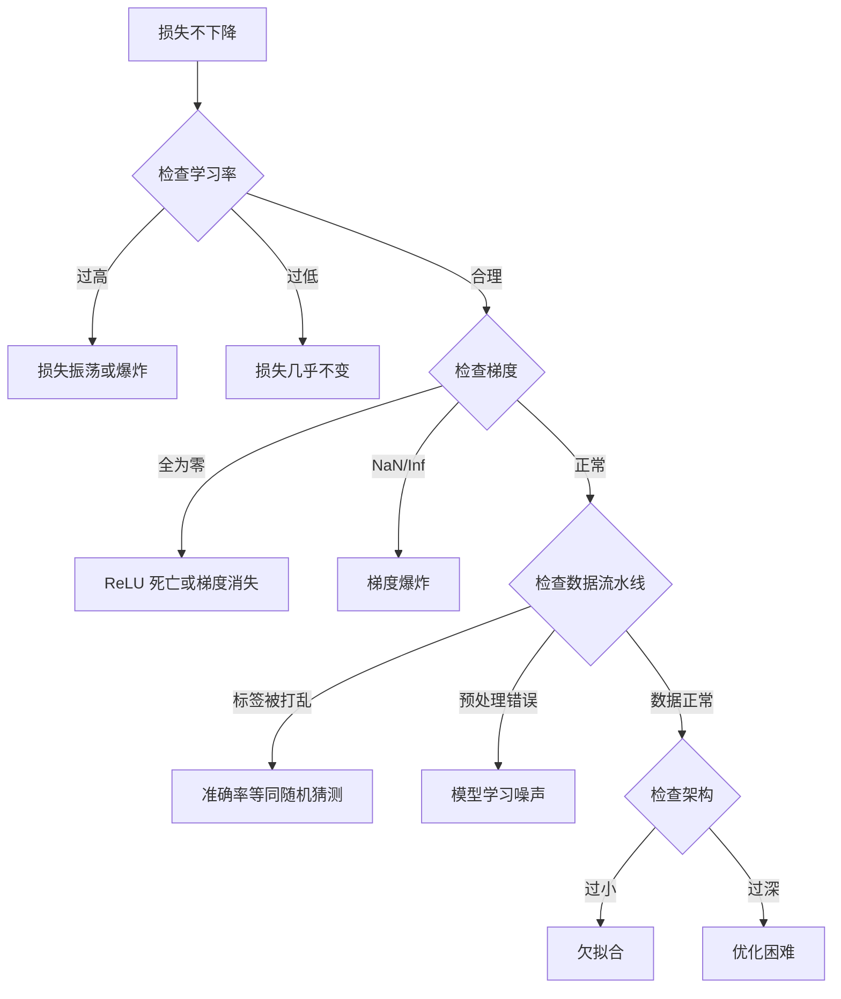
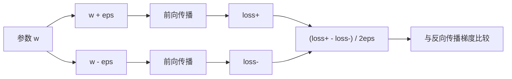
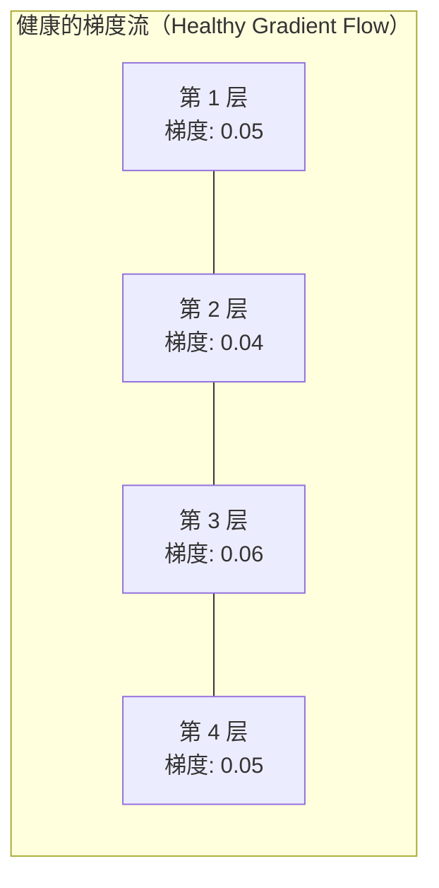
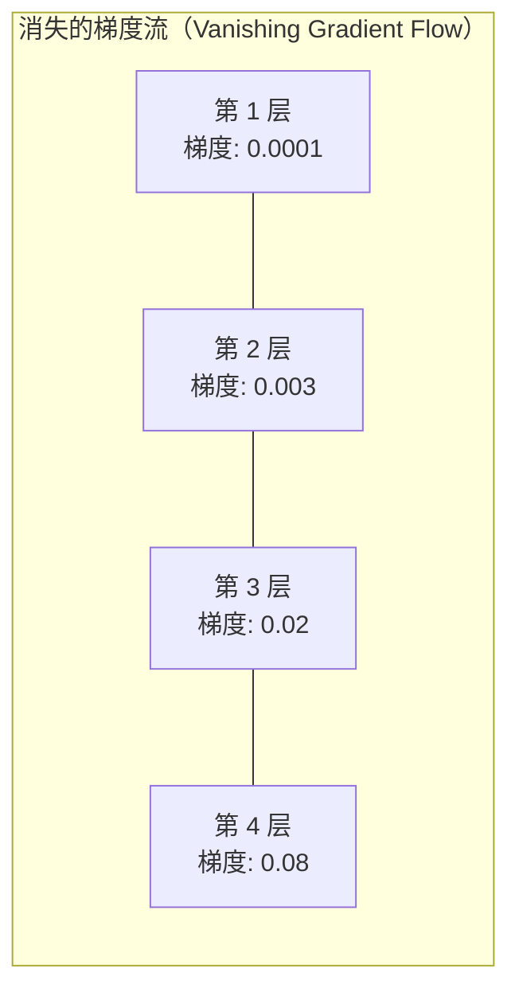
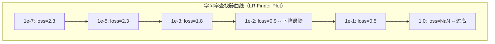

# 神经网络调试（Debugging Neural Networks）

> 你的网络编译成功，运行完毕，还输出了一个数。这个数是错的，却没有任何崩溃。欢迎面对最难的一类调试：连错误消息都没有的调试。

**Type:** Build
**Languages:** Python, PyTorch
**Prerequisites:** 阶段 03 第 01–10 课（尤其是反向传播（Backpropagation）、损失函数（Loss Functions）和优化器（Optimizers））
**Time:** 约 90 分钟

## 学习目标（Learning Objectives）

- 使用系统化调试策略诊断常见的神经网络故障，包括 NaN 损失、平坦的损失曲线、过拟合（Overfitting）和振荡（Oscillation）
- 运用“单批次过拟合（Overfit One Batch）”技术，验证模型架构和训练循环是否正确
- 检查梯度幅值（Gradient Magnitudes）、激活分布（Activation Distributions）和权重范数（Weight Norms），识别梯度消失与梯度爆炸问题
- 构建覆盖数据流水线、模型架构、损失函数、优化器和学习率问题的调试清单

## 问题（The Problem）

传统软件出错时会崩溃：空指针抛出异常，类型不匹配在编译时就失败，差一错误（Off-by-One Error）会产生明显错误的输出。

神经网络不会给你这样的便利。

出错的神经网络仍会运行到结束、打印损失值并输出预测。损失可能下降，预测看起来也可能合理。然而模型在悄无声息地出错：学习捷径、记忆噪声，或者收敛到没有用处的局部极小值（Local Minimum）。Google 研究人员估计，机器学习调试时间的 60–70% 都花在这类不报错却降低模型质量的“静默”错误上。

模型能否正常工作，往往只差一行放错位置的代码：漏掉一个 `zero_grad()`、转置错一个维度，或把学习率设错 10 倍。经典文章《神经网络训练配方》（Recipe for Training Neural Networks，2019）开篇就指出：“神经网络中最常见的错误，是那些不会导致崩溃的错误。”

本课教你找出这些错误。

## 概念（The Concept）

### 调试思维（The Debugging Mindset）

不要再靠打印几行输出然后祈祷问题自行解决。神经网络调试需要系统化方法，因为反馈循环很慢（每次训练需要数分钟到数小时），而症状又含糊不清（损失不正常可能对应 20 种不同原因）。

黄金法则：**从简单情况开始，每次只增加一部分复杂性，并独立验证每一部分。**



### 症状 1：损失不下降（Symptom 1: Loss Not Decreasing）

这是最常见的问题。训练循环在运行，一个个轮次（Epochs）过去，损失却保持平坦或剧烈振荡。

**学习率不正确（Wrong Learning Rate）。** 过高时，损失会振荡或跳到 NaN；过低时，损失下降得太慢，看起来像是没有变化。使用 Adam 时从 1e-3 开始；使用 SGD 时从 1e-1 或 1e-2 开始。在认定是其他问题之前，始终先尝试相邻值相差 10 倍的 3 个学习率（例如 1e-2、1e-3、1e-4）。

**ReLU 死亡（Dead ReLUs）。** 如果 ReLU 神经元收到一个很大的负输入，它的输出和梯度都是 0，此后便不再激活。如果死亡的神经元足够多，网络就无法学习。检查方法：打印每个 ReLU 层之后激活值恰好为 0 的比例。如果死亡比例超过 50%，就改用 LeakyReLU 或降低学习率。

**梯度消失（Vanishing Gradients）。** 在使用 sigmoid 或 tanh 激活函数的深层网络中，梯度在反向传播时会指数级缩小。到达第一层时，梯度已接近 0，前面的层便停止学习。修复方法：使用 ReLU/GELU、添加残差连接（Residual Connections），或使用批归一化（Batch Normalization）。

**梯度爆炸（Exploding Gradients）。** 与梯度消失相反，梯度会指数级增大。这在循环神经网络（RNNs）和很深的网络中很常见，损失会跳到 NaN。修复方法：使用梯度裁剪（Gradient Clipping，`torch.nn.utils.clip_grad_norm_`）、降低学习率，或添加归一化。

### 症状 2：损失下降，但模型表现差（Symptom 2: Loss Decreasing But Model is Bad）

损失在下降，训练准确率达到 99%，但测试准确率只有 55%。或者，模型在真实数据上给出毫无意义的输出。

**过拟合（Overfitting）。** 模型记住了训练数据，而没有学到模式。训练损失与验证损失之间的差距随时间扩大。修复方法：增加数据、使用随机失活（Dropout）、权重衰减（Weight Decay）、早停（Early Stopping）和数据增强（Data Augmentation）。

**数据泄漏（Data Leakage）。** 测试数据泄漏进了训练过程，准确率高得可疑。常见原因包括：划分之前打乱数据、使用完整数据集的统计量进行预处理，以及不同划分中出现重复样本。修复方法：先划分，再预处理，并检查重复样本。

**标签错误（Label Errors）。** 大多数真实数据集中有 5–10% 的标签是错误的（Northcutt 等，2021，《测试集中的普遍标签错误》（Pervasive Label Errors in Test Sets）），模型会学到这些噪声。修复方法：使用置信学习（Confident Learning）查找并修正错标样本，或使用损失截断（Loss Truncation）忽略高损失样本。

### 症状 3：损失出现 NaN 或 Inf（Symptom 3: NaN or Inf in Loss）

损失值变成 `nan` 或 `inf`，训练就无法继续。

**学习率过高（Learning Rate Too High）。** 梯度更新越过目标太远，导致权重爆炸。修复方法：将学习率降至原来的 1/10。

**log(0) 或对负数取对数（log(negative)）。** 交叉熵损失会计算 `log(p)`。如果模型输出的概率恰好为 0 或为负数，对数计算就会失控。修复方法：把预测值限制在 `[eps, 1-eps]`，其中 `eps=1e-7`。

**除零（Division by Zero）。** 批归一化需要除以标准差。一个值全部相同的批次，其 std=0。修复方法：在分母上加 epsilon（PyTorch 默认这样做，但自定义实现未必如此）。

**数值溢出（Numerical Overflow）。** 将很大的激活值送入 `exp()` 会得到 Inf，Softmax 尤其容易遇到这种情况。修复方法：求指数之前先减去最大值，即对数和指数技巧（Log-Sum-Exp Trick）。

### 技术 1：梯度检查（Technique 1: Gradient Checking）

将解析梯度（Analytical Gradients，来自反向传播）与数值梯度（Numerical Gradients，来自有限差分）比较。如果两者不一致，反向传播过程就存在错误。

参数 `w` 的数值梯度：

```
grad_numerical = (loss(w + eps) - loss(w - eps)) / (2 * eps)
```

一致性指标（相对差异，Relative Difference）：

```
rel_diff = |grad_analytical - grad_numerical| / max(|grad_analytical|, |grad_numerical|, 1e-8)
```

如果 `rel_diff < 1e-5`，则结果正确；如果 `rel_diff > 1e-3`，则几乎可以确定存在错误。



### 技术 2：激活统计（Technique 2: Activation Statistics）

在训练期间监测每一层之后激活值的均值和标准差。健康网络的激活值会保持均值接近 0、标准差接近 1（归一化之后），或者至少保持有界。

| 健康指标（Health Indicator） | 均值（Mean） | 标准差（Std） | 诊断（Diagnosis） |
|-----------------|------|-----|-----------|
| 健康（Healthy） | ~0 | ~1 | 网络正常学习 |
| 饱和（Saturated） | >>0 或 <<0 | ~0 | 激活值停留在极端值 |
| 死亡（Dead） | 0 | 0 | 神经元死亡（全为零） |
| 爆炸（Exploding） | >>10 | >>10 | 激活值无界增长 |

### 技术 3：梯度流可视化（Technique 3: Gradient Flow Visualization）

绘制每一层的平均梯度幅值。在健康网络中，各层的梯度幅值应该大致相近。如果前面层的梯度比后面层小 1000 倍，就存在梯度消失。





### 技术 4：单批次过拟合测试（Technique 4: The Overfit-One-Batch Test）

这是深度学习中最重要的一项调试技术。

取一个小批次（8–32 个样本），在其上训练 100 次以上迭代。损失应该接近零，训练准确率应该达到 100%。否则，模型或训练循环就存在根本性错误，不要继续进行完整训练。

这项测试可以发现：
- 有问题的损失函数
- 有问题的反向传播过程
- 架构过小，无法表示数据
- 优化器没有关联模型参数
- 数据与标签错位

运行这项测试只需 30 秒，却能节省数小时针对完整训练的调试时间。

### 技术 5：学习率查找器（Technique 5: Learning Rate Finder）

Leslie Smith（2017）提出，在一个轮次内将学习率从很小（1e-7）扫描到很大（10），同时记录损失。绘制损失与学习率的关系曲线。最优学习率大约比损失开始下降最快时的学习率小 10 倍。



本例的最佳学习率（LR）约为 1e-3，即最陡下降点之前一个数量级的位置。

### 常见 PyTorch 错误（Common PyTorch Bugs）

下面这些错误消耗了 PyTorch 社区最多的累计调试时间：

| 错误（Bug） | 症状（Symptom） | 修复方法（Fix） |
|-----|---------|-----|
| 忘记 `optimizer.zero_grad()` | 梯度跨批次累积，损失振荡 | 在 `loss.backward()` 之前添加 `optimizer.zero_grad()` |
| 测试时忘记 `model.eval()` | 随机失活和批归一化的行为不同，不同运行之间的测试准确率发生变化 | 添加 `model.eval()` 和 `torch.no_grad()` |
| 张量形状错误 | 静默广播产生错误结果，却不报错 | 调试时在每次操作之后打印形状 |
| CPU/GPU 不匹配 | `RuntimeError: expected CUDA tensor` | 对模型和数据都调用 `.to(device)` |
| 没有分离张量 | 计算图不断增长，导致内存不足（OOM） | 使用 `.detach()` 或 `with torch.no_grad()` |
| 原地操作破坏自动求导 | `RuntimeError: modified by in-place operation` | 将 `x += 1` 替换为 `x = x + 1` |
| 数据未归一化 | 损失停留在随机猜测水平 | 将输入归一化到 mean=0、std=1 |
| 标签的数据类型错误 | 交叉熵要求 `Long`，却收到 `Float` | 转换标签类型：`labels.long()` |

### 调试总表（The Master Debugging Table）

| 症状（Symptom） | 可能原因（Likely Cause） | 首先尝试（First Thing to Try） |
|---------|-------------|-------------------|
| 损失停留在 -log(1/num_classes) | 模型预测均匀分布 | 检查数据流水线，确认标签与输入匹配 |
| 几步之后损失变成 NaN | 学习率过高 | 将学习率降至原来的 1/10 |
| 损失立即变成 NaN | log(0) 或除零 | 在对数或除法操作中加入 epsilon |
| 损失剧烈振荡 | 学习率过高或批大小过小 | 降低学习率，增大批大小 |
| 损失先下降，随后进入平台期 | 对微调阶段而言学习率过高 | 加入学习率调度（余弦或阶梯衰减） |
| 训练准确率高，测试准确率低 | 过拟合 | 添加随机失活、权重衰减和更多数据 |
| 训练准确率 = 测试准确率 = 随机猜测水平 | 模型什么都没学到 | 运行单批次过拟合测试 |
| 训练准确率 = 测试准确率，但两者都低 | 欠拟合 | 使用更大的模型、更多层或更多特征 |
| 梯度全为零 | ReLU 死亡或计算图被分离 | 改用 LeakyReLU，检查 `.requires_grad` |
| 训练期间内存不足 | 批次过大或计算图未释放 | 减小批大小，评估时使用 `torch.no_grad()` |

```figure
learning-curves
```

## 动手构建（Build It）

构建一个监测激活值、梯度和损失曲线的诊断工具包。你将故意破坏网络，并使用工具包诊断每一个问题。

### 步骤 1：NetworkDebugger 类（Step 1: The NetworkDebugger Class）

通过挂钩（Hooks）接入 PyTorch 模型，记录每一层的激活与梯度统计。

```python
import torch
import torch.nn as nn
import math


class NetworkDebugger:
    def __init__(self, model):
        self.model = model
        self.activation_stats = {}
        self.gradient_stats = {}
        self.loss_history = []
        self.lr_losses = []
        self.hooks = []
        self._register_hooks()

    def _register_hooks(self):
        for name, module in self.model.named_modules():
            if isinstance(module, (nn.Linear, nn.Conv2d, nn.ReLU, nn.LeakyReLU)):
                hook = module.register_forward_hook(self._make_activation_hook(name))
                self.hooks.append(hook)
                hook = module.register_full_backward_hook(self._make_gradient_hook(name))
                self.hooks.append(hook)

    def _make_activation_hook(self, name):
        def hook(module, input, output):
            with torch.no_grad():
                out = output.detach().float()
                self.activation_stats[name] = {
                    "mean": out.mean().item(),
                    "std": out.std().item(),
                    "fraction_zero": (out == 0).float().mean().item(),
                    "min": out.min().item(),
                    "max": out.max().item(),
                }
        return hook

    def _make_gradient_hook(self, name):
        def hook(module, grad_input, grad_output):
            if grad_output[0] is not None:
                with torch.no_grad():
                    grad = grad_output[0].detach().float()
                    self.gradient_stats[name] = {
                        "mean": grad.mean().item(),
                        "std": grad.std().item(),
                        "abs_mean": grad.abs().mean().item(),
                        "max": grad.abs().max().item(),
                    }
        return hook

    def record_loss(self, loss_value):
        self.loss_history.append(loss_value)

    def check_loss_health(self):
        if len(self.loss_history) < 2:
            return "NOT_ENOUGH_DATA"
        recent = self.loss_history[-10:]
        if any(math.isnan(v) or math.isinf(v) for v in recent):
            return "NAN_OR_INF"
        if len(self.loss_history) >= 20:
            first_half = sum(self.loss_history[:10]) / 10
            second_half = sum(self.loss_history[-10:]) / 10
            if second_half >= first_half * 0.99:
                return "NOT_DECREASING"
        if len(recent) >= 5:
            diffs = [recent[i+1] - recent[i] for i in range(len(recent)-1)]
            if max(diffs) - min(diffs) > 2 * abs(sum(diffs) / len(diffs)):
                return "OSCILLATING"
        return "HEALTHY"

    def check_activations(self):
        issues = []
        for name, stats in self.activation_stats.items():
            if stats["fraction_zero"] > 0.5:
                issues.append(f"DEAD_NEURONS: {name} has {stats['fraction_zero']:.0%} zero activations")
            if abs(stats["mean"]) > 10:
                issues.append(f"EXPLODING_ACTIVATIONS: {name} mean={stats['mean']:.2f}")
            if stats["std"] < 1e-6:
                issues.append(f"COLLAPSED_ACTIVATIONS: {name} std={stats['std']:.2e}")
        return issues if issues else ["HEALTHY"]

    def check_gradients(self):
        issues = []
        grad_magnitudes = []
        for name, stats in self.gradient_stats.items():
            grad_magnitudes.append((name, stats["abs_mean"]))
            if stats["abs_mean"] < 1e-7:
                issues.append(f"VANISHING_GRADIENT: {name} abs_mean={stats['abs_mean']:.2e}")
            if stats["abs_mean"] > 100:
                issues.append(f"EXPLODING_GRADIENT: {name} abs_mean={stats['abs_mean']:.2e}")
        if len(grad_magnitudes) >= 2:
            first_mag = grad_magnitudes[0][1]
            last_mag = grad_magnitudes[-1][1]
            if last_mag > 0 and first_mag / last_mag > 100:
                issues.append(f"GRADIENT_RATIO: first/last = {first_mag/last_mag:.0f}x (vanishing)")
        return issues if issues else ["HEALTHY"]

    def print_report(self):
        print("\n=== NETWORK DEBUGGER REPORT ===")
        print(f"\nLoss health: {self.check_loss_health()}")
        if self.loss_history:
            print(f"  Last 5 losses: {[f'{v:.4f}' for v in self.loss_history[-5:]]}")
        print("\nActivation diagnostics:")
        for item in self.check_activations():
            print(f"  {item}")
        print("\nGradient diagnostics:")
        for item in self.check_gradients():
            print(f"  {item}")
        print("\nPer-layer activation stats:")
        for name, stats in self.activation_stats.items():
            print(f"  {name}: mean={stats['mean']:.4f} std={stats['std']:.4f} zero={stats['fraction_zero']:.1%}")
        print("\nPer-layer gradient stats:")
        for name, stats in self.gradient_stats.items():
            print(f"  {name}: abs_mean={stats['abs_mean']:.2e} max={stats['max']:.2e}")

    def remove_hooks(self):
        for hook in self.hooks:
            hook.remove()
        self.hooks.clear()
```

### 步骤 2：单批次过拟合测试（Step 2: The Overfit-One-Batch Test）

```python
def overfit_one_batch(model, x_batch, y_batch, criterion, lr=0.01, steps=200):
    optimizer = torch.optim.Adam(model.parameters(), lr=lr)
    model.train()
    print("\n=== OVERFIT ONE BATCH TEST ===")
    print(f"Batch size: {x_batch.shape[0]}, Steps: {steps}")

    for step in range(steps):
        optimizer.zero_grad()
        output = model(x_batch)
        loss = criterion(output, y_batch)
        loss.backward()
        optimizer.step()

        if step % 50 == 0 or step == steps - 1:
            with torch.no_grad():
                preds = (output > 0).float() if output.shape[-1] == 1 else output.argmax(dim=1)
                targets = y_batch if y_batch.dim() == 1 else y_batch.squeeze()
                acc = (preds.squeeze() == targets).float().mean().item()
            print(f"  Step {step:3d} | Loss: {loss.item():.6f} | Accuracy: {acc:.1%}")

    final_loss = loss.item()
    if final_loss > 0.1:
        print(f"\n  FAIL: Loss did not converge ({final_loss:.4f}). Model or training loop is broken.")
        return False
    print(f"\n  PASS: Loss converged to {final_loss:.6f}")
    return True
```

### 步骤 3：学习率查找器（Step 3: Learning Rate Finder）

```python
def find_learning_rate(model, x_data, y_data, criterion, start_lr=1e-7, end_lr=10, steps=100):
    import copy
    original_state = copy.deepcopy(model.state_dict())
    optimizer = torch.optim.SGD(model.parameters(), lr=start_lr)
    lr_mult = (end_lr / start_lr) ** (1 / steps)

    model.train()
    results = []
    best_loss = float("inf")
    current_lr = start_lr

    print("\n=== LEARNING RATE FINDER ===")

    for step in range(steps):
        optimizer.zero_grad()
        output = model(x_data)
        loss = criterion(output, y_data)

        if math.isnan(loss.item()) or loss.item() > best_loss * 10:
            break

        best_loss = min(best_loss, loss.item())
        results.append((current_lr, loss.item()))

        loss.backward()
        optimizer.step()

        current_lr *= lr_mult
        for param_group in optimizer.param_groups:
            param_group["lr"] = current_lr

    model.load_state_dict(original_state)

    if len(results) < 10:
        print("  Could not complete LR sweep -- loss diverged too quickly")
        return results

    min_loss_idx = min(range(len(results)), key=lambda i: results[i][1])
    suggested_lr = results[max(0, min_loss_idx - 10)][0]

    print(f"  Swept {len(results)} steps from {start_lr:.0e} to {results[-1][0]:.0e}")
    print(f"  Minimum loss {results[min_loss_idx][1]:.4f} at lr={results[min_loss_idx][0]:.2e}")
    print(f"  Suggested learning rate: {suggested_lr:.2e}")

    return results
```

### 步骤 4：梯度检查器（Step 4: Gradient Checker）

```python
def _flat_to_multi_index(flat_idx, shape):
    multi_idx = []
    remaining = flat_idx
    for dim in reversed(shape):
        multi_idx.insert(0, remaining % dim)
        remaining //= dim
    return tuple(multi_idx)


def gradient_check(model, x, y, criterion, eps=1e-4):
    model.train()
    x_double = x.double()
    y_double = y.double()
    model_double = model.double()

    print("\n=== GRADIENT CHECK ===")
    overall_max_diff = 0
    checked = 0

    for name, param in model_double.named_parameters():
        if not param.requires_grad:
            continue

        layer_max_diff = 0

        model_double.zero_grad()
        output = model_double(x_double)
        loss = criterion(output, y_double)
        loss.backward()
        analytical_grad = param.grad.clone()

        num_checks = min(5, param.numel())
        for i in range(num_checks):
            idx = _flat_to_multi_index(i, param.shape)
            original = param.data[idx].item()

            param.data[idx] = original + eps
            with torch.no_grad():
                loss_plus = criterion(model_double(x_double), y_double).item()

            param.data[idx] = original - eps
            with torch.no_grad():
                loss_minus = criterion(model_double(x_double), y_double).item()

            param.data[idx] = original

            numerical = (loss_plus - loss_minus) / (2 * eps)
            analytical = analytical_grad[idx].item()

            denom = max(abs(numerical), abs(analytical), 1e-8)
            rel_diff = abs(numerical - analytical) / denom

            layer_max_diff = max(layer_max_diff, rel_diff)
            checked += 1

        overall_max_diff = max(overall_max_diff, layer_max_diff)
        status = "OK" if layer_max_diff < 1e-5 else "MISMATCH"
        print(f"  {name}: max_rel_diff={layer_max_diff:.2e} [{status}]")

    model.float()

    print(f"\n  Checked {checked} parameters")
    if overall_max_diff < 1e-5:
        print("  PASS: Gradients match (rel_diff < 1e-5)")
    elif overall_max_diff < 1e-3:
        print("  WARN: Small differences (1e-5 < rel_diff < 1e-3)")
    else:
        print("  FAIL: Gradient mismatch detected (rel_diff > 1e-3)")
    return overall_max_diff
```

### 步骤 5：故意破坏的网络（Step 5: Deliberately Broken Networks）

现在将工具包应用于故意破坏的网络，逐一诊断。

```python
def demo_broken_networks():
    torch.manual_seed(42)
    x = torch.randn(64, 10)
    y = (x[:, 0] > 0).long()

    print("\n" + "=" * 60)
    print("BUG 1: Learning rate too high (lr=10)")
    print("=" * 60)
    model1 = nn.Sequential(nn.Linear(10, 32), nn.ReLU(), nn.Linear(32, 2))
    debugger1 = NetworkDebugger(model1)
    optimizer1 = torch.optim.SGD(model1.parameters(), lr=10.0)
    criterion = nn.CrossEntropyLoss()
    for step in range(20):
        optimizer1.zero_grad()
        out = model1(x)
        loss = criterion(out, y)
        debugger1.record_loss(loss.item())
        loss.backward()
        optimizer1.step()
    debugger1.print_report()
    debugger1.remove_hooks()

    print("\n" + "=" * 60)
    print("BUG 2: Dead ReLUs from bad initialization")
    print("=" * 60)
    model2 = nn.Sequential(nn.Linear(10, 32), nn.ReLU(), nn.Linear(32, 32), nn.ReLU(), nn.Linear(32, 2))
    with torch.no_grad():
        for m in model2.modules():
            if isinstance(m, nn.Linear):
                m.weight.fill_(-1.0)
                m.bias.fill_(-5.0)
    debugger2 = NetworkDebugger(model2)
    optimizer2 = torch.optim.Adam(model2.parameters(), lr=1e-3)
    for step in range(50):
        optimizer2.zero_grad()
        out = model2(x)
        loss = criterion(out, y)
        debugger2.record_loss(loss.item())
        loss.backward()
        optimizer2.step()
    debugger2.print_report()
    debugger2.remove_hooks()

    print("\n" + "=" * 60)
    print("BUG 3: Missing zero_grad (gradients accumulate)")
    print("=" * 60)
    model3 = nn.Sequential(nn.Linear(10, 32), nn.ReLU(), nn.Linear(32, 2))
    debugger3 = NetworkDebugger(model3)
    optimizer3 = torch.optim.SGD(model3.parameters(), lr=0.01)
    for step in range(50):
        out = model3(x)
        loss = criterion(out, y)
        debugger3.record_loss(loss.item())
        loss.backward()
        optimizer3.step()
    debugger3.print_report()
    debugger3.remove_hooks()

    print("\n" + "=" * 60)
    print("HEALTHY NETWORK: Correct setup for comparison")
    print("=" * 60)
    model_good = nn.Sequential(nn.Linear(10, 32), nn.ReLU(), nn.Linear(32, 2))
    debugger_good = NetworkDebugger(model_good)
    optimizer_good = torch.optim.Adam(model_good.parameters(), lr=1e-3)
    for step in range(50):
        optimizer_good.zero_grad()
        out = model_good(x)
        loss = criterion(out, y)
        debugger_good.record_loss(loss.item())
        loss.backward()
        optimizer_good.step()
    debugger_good.print_report()
    debugger_good.remove_hooks()

    print("\n" + "=" * 60)
    print("OVERFIT-ONE-BATCH TEST (healthy model)")
    print("=" * 60)
    model_test = nn.Sequential(nn.Linear(10, 32), nn.ReLU(), nn.Linear(32, 2))
    overfit_one_batch(model_test, x[:8], y[:8], criterion)

    print("\n" + "=" * 60)
    print("LEARNING RATE FINDER")
    print("=" * 60)
    model_lr = nn.Sequential(nn.Linear(10, 32), nn.ReLU(), nn.Linear(32, 2))
    find_learning_rate(model_lr, x, y, criterion)

    print("\n" + "=" * 60)
    print("GRADIENT CHECK")
    print("=" * 60)
    model_grad = nn.Sequential(nn.Linear(10, 8), nn.ReLU(), nn.Linear(8, 2))
    gradient_check(model_grad, x[:4], y[:4], criterion)
```

## 实际使用（Use It）

### PyTorch 内置工具（PyTorch Built-in Tools）

```python
import torch
import torch.nn as nn

model = nn.Sequential(
    nn.Linear(768, 256),
    nn.ReLU(),
    nn.Linear(256, 10),
)

with torch.autograd.detect_anomaly():
    output = model(input_tensor)
    loss = criterion(output, target)
    loss.backward()

for name, param in model.named_parameters():
    if param.grad is not None:
        print(f"{name}: grad_mean={param.grad.abs().mean():.2e}")
```

### 集成 Weights & Biases（Weights & Biases Integration）

```python
import wandb

wandb.init(project="debug-training")

for epoch in range(100):
    loss = train_one_epoch()
    wandb.log({
        "loss": loss,
        "lr": optimizer.param_groups[0]["lr"],
        "grad_norm": torch.nn.utils.clip_grad_norm_(model.parameters(), float("inf")),
    })

    for name, param in model.named_parameters():
        if param.grad is not None:
            wandb.log({f"grad/{name}": wandb.Histogram(param.grad.cpu().numpy())})
```

### TensorBoard 工具（TensorBoard）

```python
from torch.utils.tensorboard import SummaryWriter

writer = SummaryWriter("runs/debug_experiment")

for epoch in range(100):
    loss = train_one_epoch()
    writer.add_scalar("Loss/train", loss, epoch)

    for name, param in model.named_parameters():
        writer.add_histogram(f"weights/{name}", param, epoch)
        if param.grad is not None:
            writer.add_histogram(f"gradients/{name}", param.grad, epoch)
```

### 完整训练前的调试清单（The Debug Checklist (Before Full Training)）

1. 运行单批次过拟合测试。如果失败，立即停止。
2. 打印模型摘要，确认参数数量合理。
3. 用随机数据执行一次前向传播，检查输出形状。
4. 训练 5 个轮次，确认损失下降。
5. 检查激活统计，确保没有死亡层，也没有激活爆炸。
6. 检查梯度流，确保没有梯度消失或爆炸。
7. 验证数据流水线，打印 5 个随机样本及其标签。

## 交付成果（Ship It）

本课产出：
- `outputs/prompt-nn-debugger.md`：用于诊断神经网络训练故障的提示词
- `outputs/skill-debug-checklist.md`：用于调试训练问题的决策树清单

调试方面的关键部署模式：
- 在生产训练脚本中添加监测挂钩
- 每隔 N 步向 W&B 或 TensorBoard 记录激活与梯度统计
- 针对 NaN 损失、死亡神经元（超过 80% 的值为零）或梯度爆炸实现自动告警
- 每次更改架构或数据流水线时，都运行单批次过拟合测试

## 练习（Exercises）

1. **添加梯度爆炸检测器（Exploding Gradient Detector）。** 修改 `NetworkDebugger`，使其能够检测梯度是否超过阈值，并自动建议梯度裁剪值。在一个没有归一化的 20 层网络上测试。

2. **构建死亡神经元复活器（Dead Neuron Resurrector）。** 编写函数，识别死亡的 ReLU 神经元（始终输出 0），并使用 Kaiming 初始化重新初始化其输入权重。展示这种方法能够恢复一个超过 70% 神经元已经死亡的网络。

3. **实现带绘图功能的学习率查找器（Learning Rate Finder）。** 扩展 `find_learning_rate`，将结果保存为 CSV，再编写独立脚本读取 CSV，并用 matplotlib 展示学习率与损失的关系曲线。找出 ResNet-18 在 CIFAR-10 上的最优学习率。

4. **创建数据流水线验证器（Data Pipeline Validator）。** 编写函数，检查训练集与测试集之间的重复样本、标签分布不均衡（比例超过 10:1）、输入归一化情况（均值接近 0，标准差接近 1），以及数据中的 NaN/Inf 值。在一个故意损坏的数据集上运行它。

5. **调试一次真实故障（Debug a Real Failure）。** 使用第 10 课的迷你框架，引入一个细微错误（例如在反向传播中转置权重矩阵），然后通过梯度检查精确定位哪个参数的梯度不正确。记录调试过程。

## 关键术语（Key Terms）

| 术语（Term） | 常见说法（What People Say） | 实际含义（What It Actually Means） |
|------|----------------|----------------------|
| 静默错误（Silent Bug） | “能运行，但结果差” | 不产生报错却降低模型质量的错误，是机器学习中最主要的故障形式 |
| ReLU 死亡（Dead ReLU） | “神经元死了” | ReLU 神经元的输入始终为负，因此永久输出 0 并接收零梯度 |
| 梯度消失（Vanishing Gradients） | “前面的层停止学习” | 梯度在逐层传播时指数级缩小，使前面层的权重实际上被冻结 |
| 梯度爆炸（Exploding Gradients） | “损失变成 NaN 了” | 梯度在逐层传播时指数级增大，导致权重更新幅度过大而溢出 |
| 梯度检查（Gradient Checking） | “验证反向传播是否正确” | 将反向传播得到的解析梯度与有限差分得到的数值梯度比较 |
| 单批次过拟合（Overfit-One-Batch） | “最重要的调试测试” | 在单个小批次上训练，验证模型确实能够学习；如果不能，就存在根本性问题 |
| 学习率查找器（LR Finder） | “扫描找到合适的学习率” | 在一个轮次内指数级提高学习率，并选择损失发散前的学习率 |
| 数据泄漏（Data Leakage） | “测试数据泄漏进训练了” | 测试集的信息污染了训练过程，导致准确率被人为抬高 |
| 激活统计（Activation Statistics） | “监测各层健康状况” | 跟踪每层输出的均值、标准差和零值比例，以检测死亡、饱和或爆炸的神经元 |
| 梯度裁剪（Gradient Clipping） | “限制梯度幅值” | 当梯度范数超过阈值时将梯度缩小，防止梯度爆炸导致的更新 |

## 延伸阅读（Further Reading）

- Smith，《训练神经网络的周期学习率》（"Cyclical Learning Rates for Training Neural Networks"，2017）：提出学习率范围测试（学习率查找器）的论文
- Northcutt 等，《测试集中普遍存在的标签错误动摇了机器学习基准》（"Pervasive Label Errors in Test Sets Destabilize Machine Learning Benchmarks"，2021）：证明 ImageNet、CIFAR-10 和其他主要基准中有 3–6% 的标签是错误的
- Zhang 等，《理解深度学习需要重新思考泛化》（"Understanding Deep Learning Requires Rethinking Generalization"，2017）：说明神经网络能够记忆随机标签，这也是单批次过拟合测试奏效的原因
- PyTorch 关于 `torch.autograd.detect_anomaly` 和 `torch.autograd.set_detect_anomaly` 的文档，用于内置的 NaN/Inf 检测
