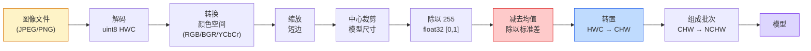
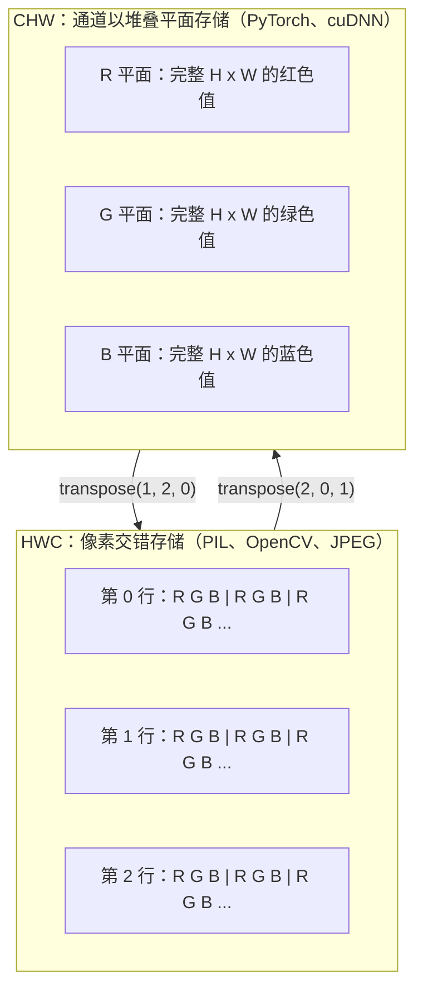

# 图像基础：像素、通道与颜色空间（Image Fundamentals — Pixels, Channels, Color Spaces）

> 图像是光采样值构成的张量。你将使用的每个视觉模型都以这一事实为起点。

**Type:** Build
**Languages:** Python
**Prerequisites:** 阶段 1 第 12 课（张量运算），阶段 3 第 11 课（PyTorch 入门）
**Time:** ~45 分钟

## 学习目标（Learning Objectives）

- 解释连续场景如何离散化为像素，以及采样与量化决策为何决定下游模型的上限
- 将图像作为 NumPy 数组读取、切片和检查，并熟练切换 HWC 与 CHW 布局
- 在 RGB、灰度、HSV 和 YCbCr 之间转换，说明各颜色空间存在的理由
- 严格按预训练 PyTorch 视觉模型的要求执行像素级预处理：归一化、标准化、调整大小、通道优先

## 问题（The Problem）

你将阅读的每篇论文、下载的每份预训练权重、调用的每个视觉 API，都假设输入采用特定编码。模型需要 `float32`，你却传入 `uint8` 图像，它仍会运行，却悄悄输出垃圾。向 RGB 训练的网络输入 BGR，准确率会下降十个百分点。模型需要通道优先，你却给通道末尾输入，第一卷积层便把高度当成特征通道。这些都不报错，只会毁掉指标，让你花一周追查一个其实藏在文件加载方式里的错误。

知道卷积在什么上面滑动后，卷积并不复杂。难点是，相机、JPEG 解码器、PIL、OpenCV、torchvision 和 CUDA 内核对“图像”的理解不同。每个技术栈都有自己的轴顺序、字节范围和通道约定。视觉工程师若分不清这些，就会交付错误流水线。

本课打牢基础，让本阶段其他课程得以建立其上。结束时你将理解像素是什么、为何每像素有三个数而非一个、“用 ImageNet 统计量归一化”实际做了什么，以及如何切换后续课程默认使用的两三种布局。

## 概念（The Concept）

### 完整预处理流程速览（The full preprocessing pipeline at a glance）

所有生产视觉系统都是相同的一串可逆变换。一步出错，模型看到的输入就与训练时不同。



红蓝两个方框承载了 80% 的静默失败：缺少标准化和布局错误。

### 像素是采样值，不是方块（A pixel is a sample, not a square）

相机传感器统计落到微型探测器网格上的光子。每个探测器在一小段时间内积累光，输出与光子数量成比例的电压，再将电压离散为整数。一个探测器对应一个像素。

```
连续场景                         传感器网格                      数字图像
（无限细节）                     （H x W 个探测器）              （H x W 个整数）

    ~~~~~                        +--+--+--+--+--+                 210 198 180 155 120
   ~   ~   ~                     |  |  |  |  |  |                 205 195 178 152 118
  ~ 光线  ~      ---->           +--+--+--+--+--+     ---->       200 190 175 150 115
   ~~~~~                         |  |  |  |  |  |                 195 185 170 148 112
                                 +--+--+--+--+--+                 188 180 165 145 108
```

这一步有两个选择，它们决定下游一切的上限：

- **空间采样（Spatial sampling）**决定场景每度视角有多少探测器。太少会产生锯齿边缘（混叠，Aliasing），太多则使存储与计算爆炸。
- **强度量化（Intensity quantization）**决定电压划分得多细。8 比特有 256 级，是显示标准。10、12、16 比特提供更平滑渐变，对医学成像、高动态范围（High Dynamic Range，HDR）和原始传感器流水线很重要。

像素不是有面积的彩色方块，而是一次测量。调整大小或旋转时，你是在对测量网格重新采样。

### 为什么是三个通道（Why three channels）

单个探测器统计整个可见光谱中的光子，得到灰度。要得到颜色，传感器用红绿蓝滤镜马赛克覆盖网格。去马赛克（Demosaicing）后，每个空间位置有三个整数，分别表示附近红、绿、蓝滤镜探测器的响应。这三个整数就是像素的 RGB 三元组。

```
内存中的一个像素：

    (R, G, B) = (210, 140, 30)   <- 偏红的橙色

一幅 H x W 的 RGB 图像：

    形状 (H, W, 3)     存储形式：H 行，每行 W 个像素，每像素 3 个值
                                 uint8 的每个值都在 [0, 255] 内
```

三并不神奇。深度相机增加 Z 通道，卫星增加红外和紫外波段。医学扫描常为单通道（X 光、CT）或多通道（高光谱）。通道数位于最后一轴，卷积层学习跨通道混合。

### 两种布局约定：HWC 与 CHW（Two layout conventions: HWC and CHW）

同一张量，两种顺序，各库各选一种。

```
HWC（高度、宽度、通道）                CHW（通道、高度、宽度）

   W ->                                    H ->
  +-----+-----+-----+                     +-----+-----+
H |R G B|R G B|R G B|                   C |R R R R R R|
| +-----+-----+-----+                   | +-----+-----+
v |R G B|R G B|R G B|                   v |G G G G G G|
  +-----+-----+-----+                     +-----+-----+
                                          |B B B B B B|
                                          +-----+-----+

   PIL、OpenCV、matplotlib、              PyTorch、多数深度学习
   几乎所有磁盘图像文件                  框架、cuDNN 内核
```

CHW 存在是因为卷积核沿 H、W 滑动。通道轴在前，使每个核看到各通道连续的二维平面，便于向量化。磁盘格式保留 HWC，因为它符合传感器输出扫描线的方式。

你会输入上千次的一行转换：

```
img_chw = img_hwc.transpose(2, 0, 1)      # NumPy
img_chw = img_hwc.permute(2, 0, 1)        # PyTorch tensor
```

内存布局可视化：



### 字节范围与数据类型（Byte ranges and dtype）

三种主流约定：

| 约定 | 数据类型 | 范围 | 常见位置 |
|------------|-------|-------|------------------|
| 原始值 | `uint8` | [0, 255] | 磁盘文件、PIL、OpenCV 输出 |
| 归一化 | `float32` | [0.0, 1.0] | `img.astype('float32') / 255` 之后 |
| 标准化 | `float32` | 大致 [-2, +2] | 减均值、除标准差之后 |

卷积网络在标准化输入上训练。ImageNet 统计量 `mean=[0.485, 0.456, 0.406]`、`std=[0.229, 0.224, 0.225]`，是整个 ImageNet 训练集三个通道的算术均值与标准差，在归一化到 [0, 1] 的像素上计算。向需要标准化浮点数的模型输入原始 `uint8`，是应用视觉最常见的静默失败。

### 颜色空间及其存在理由（Color spaces and why they exist）

RGB 是采集格式，却不总是模型最有用的表示。

```
 RGB               HSV                       YCbCr / YUV

 R 红              H 色相（角度 0-360）     Y 亮度
 G 绿              S 饱和度（0-1）          Cb 蓝黄色度
 B 蓝              V 明度（0-1）            Cr 红绿色度

 与传感器输出      将颜色与亮度分离。        将亮度与颜色分离。
 呈线性关系        适用于颜色阈值处理、      JPEG 和多数视频编解码器
                   界面滑块和简单滤镜。      对色度通道进行更强的压缩，
                                             因为人眼对色度细节的
                                             敏感度低于对 Y 的敏感度。
```

多数现代 CNN 接收 RGB。以下场景会遇到其他空间：

- **HSV（色相、饱和度、明度，Hue Saturation Value）**：经典计算机视觉代码、按颜色分割、白平衡。
- **YCbCr（亮度与色度）**：读取 JPEG 内部、视频流水线、只处理 Y 的超分辨率模型。
- **灰度（Grayscale）**：光学字符识别（Optical Character Recognition，OCR）、文档模型，以及颜色是干扰变量而非信号的场景。

RGB 转灰度是加权和，不是平均，因为人眼对绿色比对红蓝更敏感：

```
Y = 0.299 R + 0.587 G + 0.114 B       （ITU-R BT.601，经典权重）
```

### 纵横比、调整大小与插值（Aspect ratio, resizing, and interpolation）

每个模型都有固定输入尺寸，多数 ImageNet 分类器为 224x224，现代检测器为 384x384 或 512x512。图像很少正好匹配。三种重要选择：

- **缩放短边，再中心裁剪**：标准 ImageNet 配方。保持纵横比，丢弃一条边缘像素。
- **缩放并填充**：保持纵横比和所有像素，添加黑边。检测与 OCR 的标准方法。
- **直接缩放到目标**：拉伸图像。便宜但扭曲几何，对许多分类任务可接受。

新旧网格不对齐时，插值方法决定如何计算中间像素：

```
最近邻（Nearest neighbour）  最快，有块状感，掩码/标签的唯一选择
双线性（Bilinear）           快速、平滑，多数图像缩放的默认方法
双三次（Bicubic）            较慢，放大时更清晰
Lanczos                     最慢，质量最佳，用于最终显示
```

经验规则：训练用双线性，供人观看的素材用双三次或 Lanczos，包含整数类别 ID 的内容用最近邻。

```figure
conv-output-size
```

## 动手实现（Build It）

### 第 1 步：构建图像张量并检查形状（Step 1: Build an image tensor and inspect its shape）

从确定性合成图像开始，使第一个实验仅依赖 NumPy、离线运行。文件解码是独立边界：JPEG 或 PNG 解码器一旦返回 RGB 字节，后续张量操作就完全相同。

```python
import numpy as np

def synthetic_rgb(h=128, w=192, seed=0):
    rng = np.random.default_rng(seed)
    yy, xx = np.meshgrid(np.linspace(0, 1, h), np.linspace(0, 1, w), indexing="ij")
    r = (np.sin(xx * 6) * 0.5 + 0.5) * 255
    g = yy * 255
    b = (1 - yy) * xx * 255
    rgb = np.stack([r, g, b], axis=-1) + rng.normal(0, 6, (h, w, 3))
    return np.clip(rgb, 0, 255).astype(np.uint8)

arr = synthetic_rgb()

print(f"type:   {type(arr).__name__}")
print(f"dtype:  {arr.dtype}")
print(f"shape:  {arr.shape}     # (H, W, C)")
print(f"min:    {arr.min()}")
print(f"max:    {arr.max()}")
print(f"pixel at (0, 0): {arr[0, 0]}")
```

预期输出：`shape: (H, W, 3)`、`dtype: uint8`，范围 `[0, 255]`。不管字节来自相机、图像解码器还是这个合成生成器，这都是典型解码表示。

### 第 2 步：拆分通道并重排布局（Step 2: Split channels and re-order layout）

分别取出 R、G、B，再从 HWC 转成 PyTorch 的 CHW。

```python
R = arr[:, :, 0]
G = arr[:, :, 1]
B = arr[:, :, 2]
print(f"R shape: {R.shape}, mean: {R.mean():.1f}")
print(f"G shape: {G.shape}, mean: {G.mean():.1f}")
print(f"B shape: {B.shape}, mean: {B.mean():.1f}")

arr_chw = arr.transpose(2, 0, 1)
print(f"\nHWC shape: {arr.shape}")
print(f"CHW shape: {arr_chw.shape}")
```

三个灰度平面，每通道一个。CHW 仅重排轴；内存布局允许时，并不一定需要复制数据。

### 第 3 步：灰度与 HSV 转换（Step 3: Grayscale and HSV conversions）

先做加权和灰度，再手动实现 RGB 到 HSV。

```python
def rgb_to_grayscale(rgb):
    weights = np.array([0.299, 0.587, 0.114], dtype=np.float32)
    return (rgb.astype(np.float32) @ weights).astype(np.uint8)

def rgb_to_hsv(rgb):
    rgb_f = rgb.astype(np.float32) / 255.0
    r, g, b = rgb_f[..., 0], rgb_f[..., 1], rgb_f[..., 2]
    cmax = np.max(rgb_f, axis=-1)
    cmin = np.min(rgb_f, axis=-1)
    delta = cmax - cmin

    h = np.zeros_like(cmax)
    mask = delta > 0
    argmax = np.argmax(rgb_f, axis=-1)
    rmax = mask & (argmax == 0)
    gmax = mask & (argmax == 1)
    bmax = mask & (argmax == 2)
    h[rmax] = ((g[rmax] - b[rmax]) / delta[rmax]) % 6
    h[gmax] = ((b[gmax] - r[gmax]) / delta[gmax]) + 2
    h[bmax] = ((r[bmax] - g[bmax]) / delta[bmax]) + 4
    h = h * 60.0

    s = np.divide(delta, cmax, out=np.zeros_like(delta), where=cmax > 0)
    v = cmax
    return np.stack([h, s, v], axis=-1)

gray = rgb_to_grayscale(arr)
hsv = rgb_to_hsv(arr)
print(f"gray shape: {gray.shape}, range: [{gray.min()}, {gray.max()}]")
print(f"hsv   shape: {hsv.shape}")
print(f"hue range: [{hsv[..., 0].min():.1f}, {hsv[..., 0].max():.1f}] degrees")
print(f"sat range: [{hsv[..., 1].min():.2f}, {hsv[..., 1].max():.2f}]")
print(f"val range: [{hsv[..., 2].min():.2f}, {hsv[..., 2].max():.2f}]")
```

输出色相以度计，饱和度和明度在 [0, 1]。这与 OpenCV 的 `hsv_full` 约定一致。

### 第 4 步：归一化、标准化及其逆变换（Step 4: Normalize, standardize, and reverse it）

从原始字节转为预训练 ImageNet 模型要求的精确张量，再转回来。

```python
mean = np.array([0.485, 0.456, 0.406], dtype=np.float32)
std = np.array([0.229, 0.224, 0.225], dtype=np.float32)

def preprocess_imagenet(rgb_uint8):
    x = rgb_uint8.astype(np.float32) / 255.0
    x = (x - mean) / std
    x = x.transpose(2, 0, 1)
    return x

def deprocess_imagenet(chw_float32):
    x = chw_float32.transpose(1, 2, 0)
    x = x * std + mean
    x = np.clip(x * 255.0, 0, 255).astype(np.uint8)
    return x

x = preprocess_imagenet(arr)
print(f"preprocessed shape: {x.shape}     # (C, H, W)")
print(f"preprocessed dtype: {x.dtype}")
print(f"preprocessed mean per channel:  {x.mean(axis=(1, 2)).round(3)}")
print(f"preprocessed std  per channel:  {x.std(axis=(1, 2)).round(3)}")

roundtrip = deprocess_imagenet(x)
max_diff = np.abs(roundtrip.astype(int) - arr.astype(int)).max()
print(f"roundtrip max pixel diff: {max_diff}    # should be 0 or 1")
```

每通道均值应接近零，标准差接近一。预处理与逆处理这一对操作，就是 torchvision 每次 `transforms.Normalize` 调用的内部工作。

### 第 5 步：从零调整图像大小（Step 5: Resize from scratch）

最近邻将每个输出坐标舍入到一个源像素。双线性插值找到周围四像素，按距离混合。下方两种实现都使用端点对齐坐标，使首尾源像素固定。

```python
def resize_coordinates(source_length, target_length):
    if target_length == 1:
        return np.zeros(1, dtype=np.float32)
    return np.linspace(0, source_length - 1, target_length, dtype=np.float32)

def nearest_resize(image, target_height, target_width):
    y = np.rint(resize_coordinates(image.shape[0], target_height)).astype(int)
    x = np.rint(resize_coordinates(image.shape[1], target_width)).astype(int)
    return image[y[:, None], x[None, :]]

def bilinear_resize(image, target_height, target_width):
    y = resize_coordinates(image.shape[0], target_height)
    x = resize_coordinates(image.shape[1], target_width)
    y0 = np.floor(y).astype(int)
    x0 = np.floor(x).astype(int)
    y1 = np.minimum(y0 + 1, image.shape[0] - 1)
    x1 = np.minimum(x0 + 1, image.shape[1] - 1)
    wy = (y - y0)[:, None, None]
    wx = (x - x0)[None, :, None]

    source = image.astype(np.float32)
    top = source[y0[:, None], x0[None, :]] * (1 - wx)
    top += source[y0[:, None], x1[None, :]] * wx
    bottom = source[y1[:, None], x0[None, :]] * (1 - wx)
    bottom += source[y1[:, None], x1[None, :]] * wx
    result = top * (1 - wy) + bottom * wy
    return np.clip(np.rint(result), 0, 255).astype(image.dtype)

target_height = arr.shape[0] * 3
target_width = arr.shape[1] * 3
nearest = nearest_resize(arr, target_height, target_width)
bilinear = bilinear_resize(arr, target_height, target_width)

def local_roughness(x):
    gy = np.diff(x.astype(float), axis=0)
    gx = np.diff(x.astype(float), axis=1)
    return float(np.abs(gy).mean() + np.abs(gx).mean())

for name, out in [("nearest", nearest), ("bilinear", bilinear)]:
    print(f"{name:>8}  shape={out.shape}  roughness={local_roughness(out):6.2f}")
```

最近邻保留硬边缘，因此粗糙度最高。双线性更平滑，因为每个新像素在各轴混合两个位置。可运行配套代码用 Catmull-Rom 三次核，将同一可分离思想扩展到每轴四邻点，无需图像库即可打印三种结果。

## 实际应用（Use It）

PyTorch 在支持批次和设备的张量上执行相同操作。下方代码缩放短边、中心裁剪、逐通道标准化，生成预训练模型要求的 NCHW 张量。

```python
import torch
import torch.nn.functional as F

image_hwc = torch.from_numpy(synthetic_rgb(256, 320))
batch = image_hwc.permute(2, 0, 1).unsqueeze(0).float() / 255.0

height, width = batch.shape[-2:]
scale = 256 / min(height, width)
resized_height = round(height * scale)
resized_width = round(width * scale)
batch = F.interpolate(
    batch,
    size=(resized_height, resized_width),
    mode="bilinear",
    align_corners=False,
    antialias=True,
)

top = (resized_height - 224) // 2
left = (resized_width - 224) // 2
batch = batch[:, :, top:top + 224, left:left + 224]

mean = torch.tensor([0.485, 0.456, 0.406]).view(1, 3, 1, 1)
std = torch.tensor([0.229, 0.224, 0.225]).view(1, 3, 1, 1)
batch = (batch - mean) / std

print(f"tensor dtype: {batch.dtype}")
print(f"batched shape: {tuple(batch.shape)}")
print(f"per-channel mean: {batch.mean(dim=(0, 2, 3)).tolist()}")
print(f"per-channel std:  {batch.std(dim=(0, 2, 3)).tolist()}")
```

四步必须严格依次执行：字节转浮点并从 HWC 转 NCHW，短边缩到 256，中心裁剪 224x224，再减 ImageNet 均值、除标准差。颠倒顺序会悄悄改变模型收到的内容。

## 交付成果（Ship It）

本课产出：

- `outputs/prompt-vision-preprocessing-audit.md`：将模型卡或数据集卡转为团队必须遵守的精确预处理不变量清单的提示词。
- `outputs/skill-image-tensor-inspector.md`：给定图像形状张量或数组，报告类型、布局、范围及其看起来是原始、归一化还是标准化数据的技能。

## 练习（Exercises）

1. **（简单）** 创建具有四种不同颜色的 2x2 RGB `uint8` 数组。从 HWC 转 CHW 再转回，打印两种形状，证明往返保留所有值。
2. **（中等）** 编写 `standardize(img, mean, std)` 及逆函数，使任意 uint8 图像通过 `roundtrip_max_diff <= 1` 测试。同一调用必须既支持 HWC 单图，也支持 NCHW 批次。
3. **（困难）** 取三通道 ImageNet 标准化张量，通过学习 RGB 加权混合为单灰度通道的 1x1 卷积。权重初始化为 `[0.299, 0.587, 0.114]` 并冻结，验证输出在浮点误差内匹配手写 `rgb_to_grayscale`。还有哪些经典颜色空间变换可写成 1x1 卷积？

## 关键术语（Key Terms）

| 术语 | 常见说法 | 实际含义 |
|------|----------------|----------------------|
| 像素（Pixel） | “彩色方块” | 网格一个位置的光强采样；彩色三个数，灰度一个数 |
| 通道（Channel） | “颜色” | 堆叠成图像张量的并行空间网格之一；HWC 最后一轴，CHW 第一轴 |
| HWC / CHW | “形状” | 图像张量轴顺序：磁盘和 PIL 用 HWC，PyTorch、cuDNN 用 CHW |
| 归一化（Normalize） | “缩放图像” | 除以 255 让像素位于 [0, 1]，必要但不充分 |
| 标准化（Standardize） | “零中心化” | 逐通道减均值、除标准差，使输入分布匹配训练分布 |
| 灰度转换（Grayscale conversion） | “平均通道” | 用 0.299/0.587/0.114 加权求和，匹配人眼亮度感知 |
| 插值（Interpolation） | “缩放怎样选像素” | 新旧网格不对齐时决定输出值的规则；标签用最近邻，训练用双线性，显示用双三次 |
| 纵横比（Aspect ratio） | “宽除以高” | 区分“缩放并填充”与“缩放并拉伸”的比例 |

## 延伸阅读（Further Reading）

- [Charles Poynton：颜色空间导览（A Guided Tour of Color Space）](https://web.archive.org/web/20251220000525/https://poynton.ca/PDFs/Guided_tour.pdf)：清晰讲解为何有这么多颜色空间，以及各自何时重要
- [PyTorch 视觉变换文档（Vision Transforms Docs）](https://pytorch.org/vision/stable/transforms.html)：生产中实际组合使用的完整变换流程
- [JPEG 如何工作（How JPEG Works，Colt McAnlis）](https://www.youtube.com/watch?v=F1kYBnY6mwg)：直观讲解色度子采样、离散余弦变换（Discrete Cosine Transform，DCT），以及 JPEG 为何编码 YCbCr 而非 RGB
- [ImageNet 预处理约定（torchvision models）](https://pytorch.org/vision/stable/models.html)：`mean=[0.485, 0.456, 0.406]` 的权威来源，以及模型库中的模型为何都要求它
