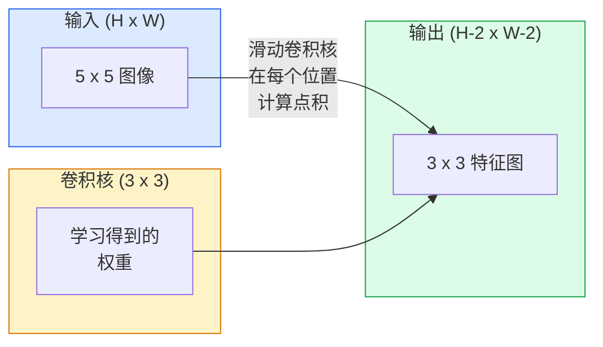
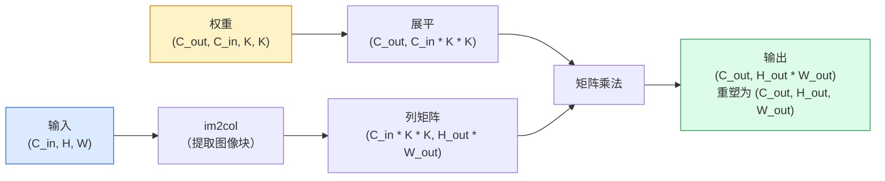

# 从零实现卷积（Convolutions from Scratch）

> 卷积是沿图像滑动的微型全连接层，在每个位置共享同一组权重。

**Type:** Build
**Languages:** Python
**Prerequisites:** 阶段 3（深度学习核心），阶段 4 第 01 课（图像基础）
**Time:** ~75 分钟

## 学习目标（Learning Objectives）

- 仅用 NumPy 从零实现二维卷积，包括嵌套循环版本和向量化的 `im2col` 版本
- 计算任意输入尺寸、卷积核大小、填充和步幅组合下的输出空间尺寸，并解释公式 `(H - K + 2P) / S + 1` 的依据
- 手工设计卷积核（边缘、模糊、锐化、Sobel），解释各自为何产生相应的激活模式
- 将卷积堆叠成特征提取器，说明堆叠深度与感受野大小的关系

## 问题（The Problem）

对 224x224 的 RGB 图像使用全连接层，每个神经元需要 224 * 224 * 3 = 150,528 个输入权重。仅一个包含 1,000 个单元的隐藏层，就已经有 1.5 亿个参数，此时还没有学到任何有用内容。更糟的是，这一层不知道左上角和右下角的狗属于同一种模式。它把每个像素位置视为独立的，而这恰好违背图像的特性：把猫平移三个像素，不应该迫使网络重新学习猫的概念。

图像模型需要两个性质：**平移等变性（Translation equivariance）**，即输入平移时输出随之平移；以及**参数共享（Parameter sharing）**，即相同特征检测器在所有位置运行。全连接层两者都不具备，卷积则天然具备。

卷积并不是为深度学习发明的。JPEG 压缩、Photoshop 中的高斯模糊、工业视觉中的边缘检测，以及所有已交付的音频滤波器，都依靠同一种运算。卷积神经网络（Convolutional Neural Network，CNN）在 2012 至 2020 年主导 ImageNet，是因为对于邻近数值相关、同一模式可出现在任何位置的数据，卷积提供了合适的先验。

## 概念（The Concept）

### 一个滑动的卷积核（One kernel, sliding）

二维卷积使用一个称为卷积核（Kernel）或滤波器（Filter）的小型权重矩阵，让它沿输入滑动，并在每个位置计算逐元素乘积之和。这个和就是一个输出像素。



下面是在 5x5 输入上使用 3x3 卷积核的具体示例（无填充，步幅为 1）：

```
输入 X (5 x 5)：               卷积核 W (3 x 3)：

  1  2  0  1  2                   1  0 -1
  0  1  3  1  0                   2  0 -2
  2  1  0  2  1                   1  0 -1
  1  0  2  1  3
  2  1  1  0  1

卷积核遍历每个有效的 3 x 3 窗口。输出 Y 为 3 x 3：

 Y[0,0] = sum( W * X[0:3, 0:3] )
 Y[0,1] = sum( W * X[0:3, 1:4] )
 Y[0,2] = sum( W * X[0:3, 2:5] )
 Y[1,0] = sum( W * X[1:4, 0:3] )
 ... 依此类推
```

这个公式中的**共享权重、局部性和滑动窗口**就是全部核心思想。其余工作都是索引与尺寸管理。

### 输出尺寸公式（Output size formula）

给定输入空间尺寸 `H`、卷积核大小 `K`、填充 `P` 和步幅 `S`：

```
H_out = floor( (H - K + 2P) / S ) + 1
```

记住这个公式。设计每种架构时，你都会计算几十次。

| 场景 | H | K | P | S | H_out |
|----------|---|---|---|---|-------|
| 有效卷积，无填充 | 32 | 3 | 0 | 1 | 30 |
| 同尺寸卷积（保持尺寸） | 32 | 3 | 1 | 1 | 32 |
| 下采样 2 倍 | 32 | 3 | 1 | 2 | 16 |
| 2x2 池化 | 32 | 2 | 0 | 2 | 16 |
| 大感受野 | 32 | 7 | 3 | 2 | 16 |

“同尺寸填充（Same padding）”是指选择 P，使 S == 1 时 H_out == H。对奇数 K，有 P = (K - 1) / 2。这就是 3x3 卷积核占主导的原因：它是仍具有中心位置的最小奇数卷积核。

### 填充（Padding）

没有填充时，每次卷积都会缩小特征图。堆叠 20 层后，224x224 图像变成 184x184，这会浪费边界处的计算，并使需要形状匹配的残差连接更复杂。

```
在 5 x 5 输入周围补零（P = 1）：

  0  0  0  0  0  0  0
  0  1  2  0  1  2  0
  0  0  1  3  1  0  0
  0  2  1  0  2  1  0       现在卷积核可以以像素
  0  1  0  2  1  3  0       (0, 0) 为中心，仍然有三行
  0  2  1  1  0  1  0       三列数值可供相乘。
  0  0  0  0  0  0  0
```

实践中会遇到这些模式：`zero`（最常见）、`reflect`（镜像边缘，在生成模型中避免硬边界）、`replicate`（复制边缘）、`circular`（环绕，用于环面问题）。

### 步幅（Stride）

步幅是滑动的步长。默认值为 `stride=1`。`stride=2` 将空间维度减半，是 CNN 中无需独立池化层即可下采样的经典方式。现代架构（ResNet、ConvNeXt、MobileNet）都在某些位置使用带步幅的卷积替代最大池化。

```
5 x 5 输入、3 x 3 卷积核，步幅为 1：

  起点： (0,0) (0,1) (0,2)        -> 输出行 0
          (1,0) (1,1) (1,2)        -> 输出行 1
          (2,0) (2,1) (2,2)        -> 输出行 2

  输出：3 x 3

相同输入，步幅为 2：

  起点： (0,0) (0,2)              -> 输出行 0
          (2,0) (2,2)              -> 输出行 1

  输出：2 x 2
```

### 多输入通道（Multiple input channels）

真实图像有三个通道。对 RGB 输入执行 3x3 卷积，实际使用的是 3x3x3 的体积：每个输入通道对应一个 3x3 切片。在每个空间位置，对三个切片全部逐元素相乘并求和，再加上偏置。

```
输入：   (C_in,  H,  W)        3 x 5 x 5
卷积核： (C_in,  K,  K)        3 x 3 x 3（一个卷积核）
输出：   (1,     H', W')       二维特征图

对于产生 C_out 个输出通道的层，堆叠 C_out 个卷积核：

权重：   (C_out, C_in, K, K)   例如 64 x 3 x 3 x 3
输出：   (C_out, H', W')       64 x 3 x 3

参数量：C_out * C_in * K * K + C_out   （+ C_out 表示偏置）
```

规划模型时，你需要计算最后一行。对三通道输入应用输出为 64 通道的 3x3 卷积，参数量为 `64 * 3 * 3 * 3 + 64 = 1,792`，成本很低。

### im2col 技巧（The im2col trick）

嵌套循环易读，但运行缓慢。GPU 适合大型矩阵乘法。技巧是：将输入的每个感受野窗口展平成大矩阵的一列，将卷积核展平成一行，整个卷积就变成一次矩阵乘法。



生产环境中的卷积实现都是这一思路的某种变体，再加上缓存分块技巧，例如直接卷积、Winograd 和用于大卷积核的快速傅里叶变换卷积（FFT conv）。理解 im2col，就理解了核心。

### 感受野（Receptive field）

一个 3x3 卷积观察 9 个输入像素。堆叠两个 3x3 卷积，第二层中的神经元就能观察 5x5 输入像素。三个 3x3 卷积得到 7x7 感受野。一般而言：

```
堆叠 L 层 K x K 卷积（步幅 1）后的 RF = 1 + L * (K - 1)

有步幅时：RF 随各层的步幅呈乘法增长。
```

“一路使用 3x3”在 VGG、ResNet 和 ConvNeXt 中奏效的根本原因，是两个 3x3 卷积与一个 5x5 卷积观察相同的输入区域，却使用更少参数，而且中间多了一次非线性变换。

```figure
convolution-kernel
```

## 动手实现（Build It）

### 第 1 步：填充数组（Step 1: Pad an array）

从最小的基本操作开始：编写一个在 H x W 数组周围填零的函数。

```python
import numpy as np

def pad2d(x, p):
    if p == 0:
        return x
    h, w = x.shape[-2:]
    out = np.zeros(x.shape[:-2] + (h + 2 * p, w + 2 * p), dtype=x.dtype)
    out[..., p:p + h, p:p + w] = x
    return out

x = np.arange(9).reshape(3, 3)
print(x)
print()
print(pad2d(x, 1))
```

利用末尾轴的技巧 `x.shape[:-2]`，同一个函数无需修改就能处理 `(H, W)`、`(C, H, W)` 或 `(N, C, H, W)`。

### 第 2 步：用嵌套循环实现二维卷积（Step 2: 2D convolution with nested loops）

这是参考实现，虽然慢，但含义明确。原则上，`torch.nn.functional.conv2d` 做的就是这件事。

```python
def conv2d_naive(x, w, b=None, stride=1, padding=0):
    c_in, h, w_in = x.shape
    c_out, c_in_w, kh, kw = w.shape
    assert c_in == c_in_w

    x_pad = pad2d(x, padding)
    h_out = (h + 2 * padding - kh) // stride + 1
    w_out = (w_in + 2 * padding - kw) // stride + 1

    out = np.zeros((c_out, h_out, w_out), dtype=np.float32)
    for oc in range(c_out):
        for i in range(h_out):
            for j in range(w_out):
                hs = i * stride
                ws = j * stride
                patch = x_pad[:, hs:hs + kh, ws:ws + kw]
                out[oc, i, j] = np.sum(patch * w[oc])
        if b is not None:
            out[oc] += b[oc]
    return out
```

四层嵌套循环：输出通道、行、列，以及对 C_in、kh、kw 的隐式求和。你将用它作为基准，核对每个更快的实现。

### 第 3 步：用手工设计的卷积核验证（Step 3: Verify with a hand-designed kernel）

构建垂直 Sobel 卷积核，将其应用于合成阶跃图像，观察垂直边缘处的强响应。

```python
def synthetic_step_image():
    img = np.zeros((1, 16, 16), dtype=np.float32)
    img[:, :, 8:] = 1.0
    return img

sobel_x = np.array([
    [[-1, 0, 1],
     [-2, 0, 2],
     [-1, 0, 1]]
], dtype=np.float32)[None]

x = synthetic_step_image()
y = conv2d_naive(x, sobel_x, padding=1)
print(y[0].round(1))
```

预期第 7 列出现较大的正值（亮度从左向右增加），其他位置均为零。这一次打印就是检查数学实现是否正确的基本测试。

### 第 4 步：im2col（Step 4: im2col）

将输入中每个卷积核大小的窗口转换为矩阵的一列。当 `C_in=3, K=3` 时，每列有 27 个数值。

```python
def im2col(x, kh, kw, stride=1, padding=0):
    c_in, h, w = x.shape
    x_pad = pad2d(x, padding)
    h_out = (h + 2 * padding - kh) // stride + 1
    w_out = (w + 2 * padding - kw) // stride + 1

    cols = np.zeros((c_in * kh * kw, h_out * w_out), dtype=x.dtype)
    col = 0
    for i in range(h_out):
        for j in range(w_out):
            hs = i * stride
            ws = j * stride
            patch = x_pad[:, hs:hs + kh, ws:ws + kw]
            cols[:, col] = patch.reshape(-1)
            col += 1
    return cols, h_out, w_out
```

这里仍有 Python 循环，但主要计算现在将由一次向量化矩阵乘法完成。

### 第 5 步：通过 im2col 和矩阵乘法加速卷积（Step 5: Fast conv via im2col + matmul）

用一次矩阵乘法替代四重循环。

```python
def conv2d_im2col(x, w, b=None, stride=1, padding=0):
    c_out, c_in, kh, kw = w.shape
    cols, h_out, w_out = im2col(x, kh, kw, stride, padding)
    w_flat = w.reshape(c_out, -1)
    out = w_flat @ cols
    if b is not None:
        out += b[:, None]
    return out.reshape(c_out, h_out, w_out)
```

正确性检查：运行两种实现并比较。

```python
rng = np.random.default_rng(0)
x = rng.normal(0, 1, (3, 16, 16)).astype(np.float32)
w = rng.normal(0, 1, (8, 3, 3, 3)).astype(np.float32)
b = rng.normal(0, 1, (8,)).astype(np.float32)

y_naive = conv2d_naive(x, w, b, padding=1)
y_im2col = conv2d_im2col(x, w, b, padding=1)

print(f"max abs diff: {np.max(np.abs(y_naive - y_im2col)):.2e}")
```

`max abs diff` 应在 `1e-5` 左右。差异源于浮点累加顺序，而不是程序错误。

### 第 6 步：一组手工设计的卷积核（Step 6: A bank of hand-designed kernels）

这五个滤波器展示了单个卷积层在训练之前就能表达什么。

```python
KERNELS = {
    "identity": np.array([[0, 0, 0], [0, 1, 0], [0, 0, 0]], dtype=np.float32),
    "blur_3x3": np.ones((3, 3), dtype=np.float32) / 9.0,
    "sharpen": np.array([[0, -1, 0], [-1, 5, -1], [0, -1, 0]], dtype=np.float32),
    "sobel_x": np.array([[-1, 0, 1], [-2, 0, 2], [-1, 0, 1]], dtype=np.float32),
    "sobel_y": np.array([[-1, -2, -1], [0, 0, 0], [1, 2, 1]], dtype=np.float32),
}

def apply_kernel(img2d, kernel):
    x = img2d[None].astype(np.float32)
    w = kernel[None, None]
    return conv2d_im2col(x, w, padding=1)[0]
```

应用于任意灰度图像时，模糊滤波器使图像柔和，锐化滤波器增强边缘，Sobel-x 对垂直边缘产生强响应，Sobel-y 对水平边缘产生强响应。这些正是 AlexNet 和 VGG 中训练后的*第一层*卷积最终学到的模式，因为无论后续任务是什么，好的图像模型都需要边缘和斑点检测器。

## 实际应用（Use It）

PyTorch 的 `nn.Conv2d` 为相同操作封装了自动微分（Autograd）、CUDA 内核和 cuDNN 优化。形状语义完全一致。

```python
import torch
import torch.nn as nn

conv = nn.Conv2d(in_channels=3, out_channels=64, kernel_size=3, stride=1, padding=1)
print(conv)
print(f"weight shape: {tuple(conv.weight.shape)}   # (C_out, C_in, K, K)")
print(f"bias shape:   {tuple(conv.bias.shape)}")
print(f"param count:  {sum(p.numel() for p in conv.parameters())}")

x = torch.randn(8, 3, 224, 224)
y = conv(x)
print(f"\ninput  shape: {tuple(x.shape)}")
print(f"output shape: {tuple(y.shape)}")
```

把 `padding=1` 改为 `padding=0`，输出降为 222x222；把 `stride=1` 改为 `stride=2`，输出降为 112x112。使用的仍是上面记住的公式。

## 交付成果（Ship It）

本课产出：

- `outputs/prompt-cnn-architect.md`：给定输入尺寸、参数预算和目标感受野，设计逐层 K/S/P 配置正确的 `Conv2d` 堆叠的提示词。
- `outputs/skill-conv-shape-calculator.md`：逐层遍历网络规格，返回每个模块的输出形状、感受野和参数量的技能。

## 练习（Exercises）

1. **（简单）** 给定 128x128 灰度输入和 `[Conv3x3(s=1,p=1), Conv3x3(s=2,p=1), Conv3x3(s=1,p=1), Conv3x3(s=2,p=1)]` 堆叠，手算每层的输出空间尺寸和感受野。用包含测试卷积层的 PyTorch `nn.Sequential` 验证。
2. **（中等）** 扩展 `conv2d_naive` 和 `conv2d_im2col`，使其接受 `groups` 参数。证明 `groups=C_in=C_out` 能实现逐通道卷积，且参数量为 `C * K * K`，而非 `C * C * K * K`。
3. **（困难）** 手写 `conv2d_im2col` 的反向传播：给定输出梯度，计算 `x` 和 `w` 的梯度。在相同输入和权重上，与 `torch.autograd.grad` 对比验证。关键技巧是：im2col 的梯度为 `col2im`，它必须累加重叠窗口。

## 关键术语（Key Terms）

| 术语 | 常见说法 | 实际含义 |
|------|----------------|----------------------|
| 卷积（Convolution） | “滑动滤波器” | 在每个空间位置使用共享权重的可学习点积；数学上是互相关，但通常称为卷积 |
| 卷积核 / 滤波器（Kernel / filter） | “特征检测器” | 形状为 (C_in, K, K) 的小型权重张量，与输入窗口的点积产生一个输出像素 |
| 步幅（Stride） | “每次跳多远” | 连续两次放置卷积核之间的步长；步幅 2 将每个空间维度减半 |
| 填充（Padding） | “边缘补零” | 在输入周围补充数值，使卷积核能够以边界像素为中心；`same` 填充使输出尺寸等于输入尺寸 |
| 感受野（Receptive field） | “神经元能看到多少” | 给定输出激活所依赖的原始输入区域，随深度和步幅增加而扩大 |
| im2col | “通用矩阵乘法（GEMM）技巧” | 将每个感受野窗口重排成列，使卷积变成一次大型矩阵乘法，是快速卷积内核的核心 |
| 逐通道卷积（Depthwise conv） | “每通道一个卷积核” | 满足 `groups == C_in` 的卷积，每个输出通道只由对应输入通道计算，是 MobileNet 和 ConvNeXt 的基础 |
| 平移等变性（Translation equivariance） | “输入平移，输出也平移” | 输入平移 k 个像素时，输出也平移 k 个像素的性质；共享权重天然带来这一性质 |

## 延伸阅读（Further Reading）

- [深度学习卷积算术指南（Dumoulin 与 Visin，2016）](https://arxiv.org/abs/1603.07285)：填充、步幅与空洞卷积的权威图解，各类课程常借用这些图
- [CS231n：用于视觉识别的卷积神经网络](https://cs231n.github.io/convolutional-networks/)：经典讲义，包含最初的 im2col 解释
- [带注释的卷积网络（fast.ai）](https://nbviewer.org/github/fastai/fastbook/blob/master/13_convolutions.ipynb)：从手工卷积一步步构建训练后的数字分类器的笔记本
- [CNN 感受野算术（Dang Ha The Hien）](https://distill.pub/2019/computing-receptive-fields/)：以论文质量交互讲解感受野计算
