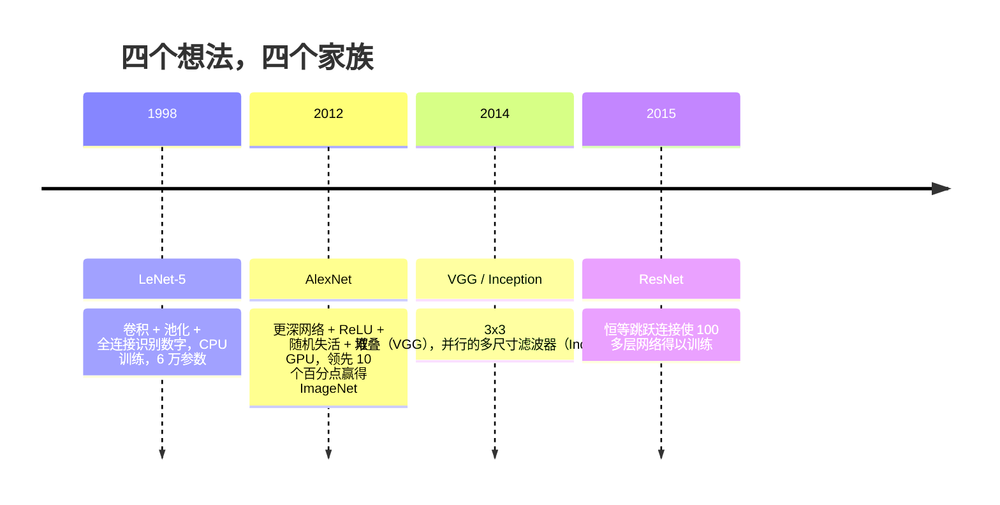
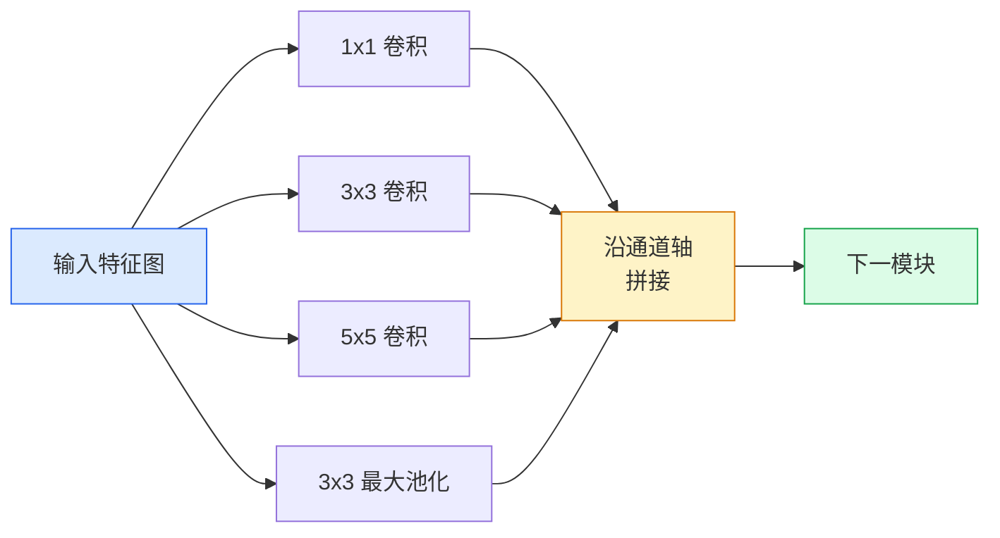
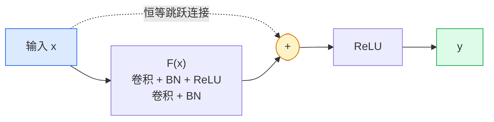

# 卷积神经网络：从 LeNet 到 ResNet（CNNs — LeNet to ResNet）

> 过去三十年的每个主要 CNN，都是在相同的“卷积、非线性、下采样”配方上增加一个新想法。按顺序学习这些想法。

**Type:** Learn + Build
**Languages:** Python
**Prerequisites:** 阶段 3 第 11 课（PyTorch），阶段 4 第 01 课（图像基础），阶段 4 第 02 课（从零实现卷积）
**Time:** ~75 分钟

## 学习目标（Learning Objectives）

- 梳理 LeNet-5 -> AlexNet -> VGG -> Inception -> ResNet 的架构谱系，说出每个家族贡献的核心新想法
- 在 PyTorch 中实现 LeNet-5、VGG 风格模块和 ResNet BasicBlock，每个实现不超过 40 行
- 解释残差连接为何能将无法训练的 1,000 层网络变成达到最佳水平的网络
- 阅读现代骨干网络（ResNet-18、ResNet-50），在查看源码之前预测输出形状、感受野和参数量

## 问题（The Problem）

2011 年，最好的 ImageNet 分类器前五准确率（Top-5 accuracy）约为 74%。2012 年，AlexNet 达到 85%。2015 年，ResNet 达到 96%。没有新数据，也没有新一代 GPU，这些进步来自架构思想。视觉工程师必须知道每个想法出自哪篇论文，因为你在 2026 年交付的每个生产骨干网络，都是这些部件的重新组合，而且这些思想仍在迁移：分组卷积从 CNN 走向 Transformer，残差连接从 ResNet 走向所有大语言模型（Large Language Model，LLM），批归一化也出现在扩散模型中。

按顺序研究这些网络还能避免一个常见错误：明明 LeNet 规模的网络就能解决问题，却直接选用最大的模型。MNIST 不需要 ResNet。了解每个家族的规模扩展曲线，才能知道应选择曲线上的哪个位置。

## 概念（The Concept）

### 改变视觉的四个想法（The four ideas that changed vision）



在经典视觉领域，没有其他进步能与这四次跨越相比。

### LeNet-5（1998）

Yann LeCun 的数字识别器，约 60,000 个参数。两个卷积池化模块、两个全连接层，以及 tanh 激活。它确立了所有 CNN 继承的模板：

```
输入 (1, 32, 32)
  卷积 5x5 -> (6, 28, 28)
  平均池化 2x2 -> (6, 14, 14)
  卷积 5x5 -> (16, 10, 10)
  平均池化 2x2 -> (16, 5, 5)
  展平 -> 400
  全连接 -> 120
  全连接 -> 84
  全连接 -> 10
```

今天被称为 CNN 的结构，即卷积与下采样交替，最后接一个小型分类头，本质上都是增加层数、加宽通道并改进激活函数后的 LeNet。

### AlexNet（2012）

三项改动共同带来了 ImageNet 的突破：

1. 用**修正线性单元（Rectified Linear Unit，ReLU）**替代 tanh。梯度不再消失，训练加速六倍。
2. 在全连接头中使用**随机失活（Dropout）**。正则化不再只是技巧，而成为网络层。
3. **深度和宽度**。五个卷积层、三个全连接层、6,000 万参数，模型拆分到两张 GPU 上训练。

论文图 2 仍将 GPU 拆分画成两条并行流。这种并行是硬件限制下的应对措施，而非架构洞见，但上面三个想法仍存在于你使用的每个模型中。

### VGG（2014）

VGG 提出的问题是：如果只用 3x3 卷积，并不断加深网络，会发生什么？

```
堆叠：   卷积 3x3 -> 卷积 3x3 -> 池化 2x2
重复：   16 或 19 个卷积层
```

两个 3x3 卷积与一个 5x5 卷积观察相同的 5x5 输入区域，但参数更少（2*9*C^2 = 18C^2 对比 25*C^2），中间还多了一个 ReLU。VGG 将这一观察发展为完整架构。只重复一种模块的简洁设计，使它成为后续架构的参照。

代价是 1.38 亿参数、训练缓慢、推理开销高。

### Inception（2014，同年）（Inception, same year）

对于“应该用多大的卷积核”，Google 的回答是：所有大小都用，并行运行。



各分支各有所长：1x1 混合通道，3x3 捕捉局部纹理，5x5 捕捉较大模式，池化提取平移不变特征。拼接让下一层选择有用的分支。Inception v1 在每个分支内部使用 1x1 卷积作为瓶颈，将参数量控制在合理范围。

### 退化问题（The degradation problem）

到 2015 年，VGG-19 能工作，VGG-32 却不行。深度原本应当有帮助，但超过约 20 层后，训练和测试损失都变差。这不是过拟合，而是梯度经过每一层时按乘法缩小，导致优化器无法找到有用的权重。

```
普通深层网络：
  y = f_L( f_{L-1}( ... f_1(x) ... ) )

相对于早期层的梯度：
  dL/dW_1 = dL/dy * df_L/df_{L-1} * ... * df_2/df_1 * df_1/dW_1

每个相乘项的量级大致为（权重量级）*（激活增益）。
当增益 < 1 时，堆叠 100 项后，梯度实际上就变为零。
```

VGG 在 19 层时能够工作，是因为同期发表的批归一化（Batch Normalization，BN）让激活值保持合理尺度。但即便批归一化也无法挽救超过约 30 层的深度。

### ResNet（2015）

He、Zhang、Ren、Sun 提出一项改动，解决了这些问题：

```
标准模块：   y = F(x)
残差模块：   y = F(x) + x
```

`+ x` 意味着该层始终可以通过将 `F(x)` 变为零来选择什么都不做。现在，1,000 层 ResNet 最差也不会比单层网络更差，因为每个额外模块都有一个简单的退出路径。有了这项保证，优化器就能让每个模块都发挥*一点*作用；这一点作用叠加 100 次，就达到了最佳水平。



两种模块变体随处可见：

- **基本模块（BasicBlock）**（ResNet-18、ResNet-34）：两个 3x3 卷积，跳跃连接跨越二者。
- **瓶颈模块（Bottleneck）**（ResNet-50、-101、-152）：1x1 降维、3x3 中间处理、1x1 升维，跳跃连接跨越三者。通道数高时成本更低。

当跳跃连接需要跨越下采样（stride=2）时，恒等路径被 stride=2 的 1x1 卷积替代，以匹配形状。

### 残差为何不只影响视觉（Why residuals matter beyond vision）

这个想法实际上不只是关于图像分类，而是把深层网络从“只能祈祷梯度存活”变成可靠、可扩展的工程工具。下一阶段你将读到的每个 Transformer，每个模块都使用完全相同的跳跃连接。没有 ResNet，就没有 GPT。

```figure
pooling
```

## 动手实现（Build It）

### 第 1 步：LeNet-5（Step 1: LeNet-5）

一个精简且忠于原设计的 LeNet：tanh 激活、平均池化。唯一的现代化调整，是在下游使用 `nn.CrossEntropyLoss`，而非原始高斯连接。

```python
import torch
import torch.nn as nn
import torch.nn.functional as F

class LeNet5(nn.Module):
    def __init__(self, num_classes=10):
        super().__init__()
        self.conv1 = nn.Conv2d(1, 6, kernel_size=5)
        self.conv2 = nn.Conv2d(6, 16, kernel_size=5)
        self.pool = nn.AvgPool2d(2)
        self.fc1 = nn.Linear(16 * 5 * 5, 120)
        self.fc2 = nn.Linear(120, 84)
        self.fc3 = nn.Linear(84, num_classes)

    def forward(self, x):
        x = self.pool(torch.tanh(self.conv1(x)))
        x = self.pool(torch.tanh(self.conv2(x)))
        x = torch.flatten(x, 1)
        x = torch.tanh(self.fc1(x))
        x = torch.tanh(self.fc2(x))
        return self.fc3(x)

net = LeNet5()
x = torch.randn(1, 1, 32, 32)
print(f"output: {net(x).shape}")
print(f"params: {sum(p.numel() for p in net.parameters()):,}")
```

预期输出：`output: torch.Size([1, 10])`、`params: 61,706`。这就是开启现代视觉的完整数字分类器。

### 第 2 步：VGG 模块（Step 2: A VGG block）

一个可复用模块：两个 3x3 卷积、ReLU、批归一化和最大池化。

```python
class VGGBlock(nn.Module):
    def __init__(self, in_c, out_c):
        super().__init__()
        self.conv1 = nn.Conv2d(in_c, out_c, kernel_size=3, padding=1)
        self.bn1 = nn.BatchNorm2d(out_c)
        self.conv2 = nn.Conv2d(out_c, out_c, kernel_size=3, padding=1)
        self.bn2 = nn.BatchNorm2d(out_c)
        self.pool = nn.MaxPool2d(2)

    def forward(self, x):
        x = F.relu(self.bn1(self.conv1(x)))
        x = F.relu(self.bn2(self.conv2(x)))
        return self.pool(x)

class MiniVGG(nn.Module):
    def __init__(self, num_classes=10):
        super().__init__()
        self.stack = nn.Sequential(
            VGGBlock(3, 32),
            VGGBlock(32, 64),
            VGGBlock(64, 128),
        )
        self.head = nn.Sequential(
            nn.AdaptiveAvgPool2d(1),
            nn.Flatten(),
            nn.Linear(128, num_classes),
        )

    def forward(self, x):
        return self.head(self.stack(x))

net = MiniVGG()
x = torch.randn(1, 3, 32, 32)
print(f"output: {net(x).shape}")
print(f"params: {sum(p.numel() for p in net.parameters()):,}")
```

对 CIFAR 尺寸的输入使用三个 VGG 模块，再接自适应池化和一个线性层，约 29 万参数，足以处理 CIFAR-10。

### 第 3 步：ResNet 基本模块（Step 3: A ResNet BasicBlock）

ResNet-18 和 ResNet-34 的核心构建模块。

```python
class BasicBlock(nn.Module):
    def __init__(self, in_c, out_c, stride=1):
        super().__init__()
        self.conv1 = nn.Conv2d(in_c, out_c, kernel_size=3, stride=stride, padding=1, bias=False)
        self.bn1 = nn.BatchNorm2d(out_c)
        self.conv2 = nn.Conv2d(out_c, out_c, kernel_size=3, stride=1, padding=1, bias=False)
        self.bn2 = nn.BatchNorm2d(out_c)
        if stride != 1 or in_c != out_c:
            self.shortcut = nn.Sequential(
                nn.Conv2d(in_c, out_c, kernel_size=1, stride=stride, bias=False),
                nn.BatchNorm2d(out_c),
            )
        else:
            self.shortcut = nn.Identity()

    def forward(self, x):
        out = F.relu(self.bn1(self.conv1(x)))
        out = self.bn2(self.conv2(out))
        out = out + self.shortcut(x)
        return F.relu(out)
```

卷积层设置 `bias=False` 是配合批归一化的惯例：BN 的 beta 参数已经处理偏置，额外保留卷积偏置只会浪费参数。`shortcut` 仅在步幅或通道数改变时需要真正的卷积，否则就是不做任何变换的恒等映射。

### 第 4 步：小型 ResNet（Step 4: A tiny ResNet）

堆叠四组 BasicBlock，得到能处理 CIFAR 尺寸输入的 ResNet。

```python
class TinyResNet(nn.Module):
    def __init__(self, num_classes=10):
        super().__init__()
        self.stem = nn.Sequential(
            nn.Conv2d(3, 32, kernel_size=3, stride=1, padding=1, bias=False),
            nn.BatchNorm2d(32),
            nn.ReLU(inplace=True),
        )
        self.layer1 = self._make_group(32, 32, num_blocks=2, stride=1)
        self.layer2 = self._make_group(32, 64, num_blocks=2, stride=2)
        self.layer3 = self._make_group(64, 128, num_blocks=2, stride=2)
        self.layer4 = self._make_group(128, 256, num_blocks=2, stride=2)
        self.head = nn.Sequential(
            nn.AdaptiveAvgPool2d(1),
            nn.Flatten(),
            nn.Linear(256, num_classes),
        )

    def _make_group(self, in_c, out_c, num_blocks, stride):
        blocks = [BasicBlock(in_c, out_c, stride=stride)]
        for _ in range(num_blocks - 1):
            blocks.append(BasicBlock(out_c, out_c, stride=1))
        return nn.Sequential(*blocks)

    def forward(self, x):
        x = self.stem(x)
        x = self.layer1(x)
        x = self.layer2(x)
        x = self.layer3(x)
        x = self.layer4(x)
        return self.head(x)

net = TinyResNet()
x = torch.randn(1, 3, 32, 32)
print(f"output: {net(x).shape}")
print(f"params: {sum(p.numel() for p in net.parameters()):,}")
```

四组，每组两个模块。第 2、3、4 组开头使用步幅 2，每次下采样将通道数翻倍，约 280 万参数。这是可以直接扩展到 ResNet-152 的标准配方。

### 第 5 步：比较参数与特征效率（Step 5: Compare parameter-to-feature efficiency）

让同样的输入通过三个网络，比较参数量。

```python
def summary(name, net, x):
    y = net(x)
    params = sum(p.numel() for p in net.parameters())
    print(f"{name:12s}  input {tuple(x.shape)} -> output {tuple(y.shape)}  params {params:>10,}")

x = torch.randn(1, 3, 32, 32)
summary("LeNet5",     LeNet5(),       torch.randn(1, 1, 32, 32))
summary("MiniVGG",    MiniVGG(),      x)
summary("TinyResNet", TinyResNet(),   x)
```

三个模型、三个时代、三个参数数量级。训练几个轮次后，CIFAR-10 准确率大致为：LeNet 60%、MiniVGG 89%、TinyResNet 93%。

## 实际应用（Use It）

`torchvision.models` 提供上述所有模型的预训练版本。不同家族使用相同的调用签名，这正是骨干网络抽象的意义。

```python
from torchvision.models import resnet18, ResNet18_Weights, vgg16, VGG16_Weights

r18 = resnet18(weights=ResNet18_Weights.IMAGENET1K_V1)
r18.eval()

print(f"ResNet-18 params: {sum(p.numel() for p in r18.parameters()):,}")
print(r18.layer1[0])
print()

v16 = vgg16(weights=VGG16_Weights.IMAGENET1K_V1)
v16.eval()
print(f"VGG-16   params: {sum(p.numel() for p in v16.parameters()):,}")
```

ResNet-18 有 1,170 万参数，VGG-16 有 1.38 亿，两者的 ImageNet 首选准确率（Top-1 accuracy）相近，分别为 69.8% 和 71.6%。残差连接带来了 12 倍参数效率提升。因此，ResNet 变体从 2016 年一直主导到 2021 年 ViT 出现，而且在计算受限的实际部署中仍占主导。

迁移学习（Transfer learning）的配方始终相同：加载预训练模型、冻结骨干网络、替换分类头。

```python
for p in r18.parameters():
    p.requires_grad = False
r18.fc = nn.Linear(r18.fc.in_features, 10)
```

只需三行，你就得到一个十分类 CIFAR 分类器，继承了 ImageNet 训练投入换来的表征。

## 交付成果（Ship It）

本课产出：

- `outputs/prompt-backbone-selector.md`：根据任务、数据集规模和计算预算选择合适 CNN 家族（LeNet/VGG/ResNet/MobileNet/ConvNeXt）的提示词。
- `outputs/skill-residual-block-reviewer.md`：读取 PyTorch 模块，标记跳跃连接错误的技能，包括步幅变化时缺少捷径分支、捷径激活顺序，以及 BN 相对加法的位置。

## 练习（Exercises）

1. **（简单）** 手工逐层计算 `TinyResNet` 的参数量，与 `sum(p.numel() for p in net.parameters())` 比较。大部分参数预算花在卷积、BN 还是分类头上？
2. **（中等）** 实现瓶颈模块（1x1 -> 3x3 -> 1x1，带跳跃连接），用它构建用于 CIFAR 的 ResNet-50 风格网络。与 `TinyResNet` 比较参数量。
3. **（困难）** 从 `BasicBlock` 中移除跳跃连接，在 CIFAR-10 上分别训练 34 模块的“普通”网络和 34 模块的 ResNet，各训练 10 个轮次。绘制两者训练损失随轮次变化的曲线。复现 He 等人图 1 的结果：普通深层网络收敛到的损失高于对应的浅层网络。

## 关键术语（Key Terms）

| 术语 | 常见说法 | 实际含义 |
|------|----------------|----------------------|
| 骨干网络（Backbone） | “模型” | 产生特征图并将其送入任务头的卷积模块堆叠 |
| 残差连接（Residual connection） | “跳跃连接” | `y = F(x) + x`；让优化器通过将 F 设为零学到恒等映射，使任意深度可以训练 |
| 基本模块（BasicBlock） | “两个 3x3 卷积加跳跃连接” | ResNet-18/34 的模块：卷积、BN、ReLU、卷积、BN、相加、ReLU |
| 瓶颈模块（Bottleneck） | “1x1 降维、3x3、1x1 升维” | ResNet-50/101/152 的模块；3x3 在较窄通道上运行，因此通道数高时成本低 |
| 退化问题（Degradation problem） | “越深越差” | 超过约 20 个普通卷积层后，训练与测试误差都增大；靠残差连接而非更多数据解决 |
| 输入干层（Stem） | “第一层” | 将三通道输入转换为基础特征宽度的初始卷积；ImageNet 通常用 7x7、步幅 2，CIFAR 用 3x3、步幅 1 |
| 任务头（Head） | “分类器” | 最后一个骨干模块之后的层：自适应池化、展平、一个或多个线性层 |
| 迁移学习（Transfer learning） | “预训练权重” | 加载在 ImageNet 上训练的骨干网络，只针对当前任务微调任务头 |

## 延伸阅读（Further Reading）

- [用于图像识别的深度残差学习（He 等，2015）](https://arxiv.org/abs/1512.03385)：ResNet 论文，每张图都值得研究
- [极深卷积网络（Simonyan 与 Zisserman，2014）](https://arxiv.org/abs/1409.1556)：VGG 论文，仍是理解“为什么用 3x3”的最佳参考
- [使用深度 CNN 进行 ImageNet 分类（Krizhevsky 等，2012）](https://papers.nips.cc/paper_files/paper/2012/hash/c399862d3b9d6b76c8436e924a68c45b-Abstract.html)：AlexNet，终结手工特征时代的论文
- [用卷积走向更深网络（Szegedy 等，2014）](https://arxiv.org/abs/1409.4842)：Inception v1，其中的并行滤波器思想仍出现在视觉 Transformer 中
