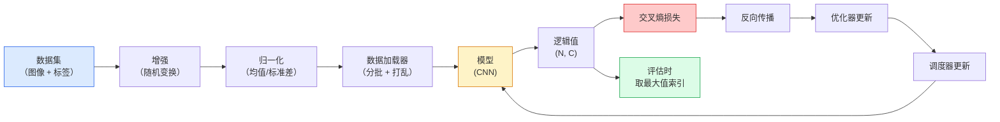

# 图像分类（Image Classification）

> 分类器是将像素映射为类别概率分布的函数。其余部分负责把流程连接起来。

**Type:** Build
**Languages:** Python
**Prerequisites:** 阶段 2 第 09 课（模型评估），阶段 3 第 10 课（微型框架），阶段 4 第 03 课（卷积神经网络）
**Time:** ~75 分钟

## 学习目标（Learning Objectives）

- 在 CIFAR-10 上构建端到端图像分类流水线：数据集、增强、模型、训练循环和评估
- 解释各组件（数据加载器、损失、优化器、调度器、增强）的作用，并预测任一组件出错时损失曲线会如何变化
- 从零实现混合增强、随机遮挡和标签平滑，说明何时值得加入它们
- 阅读混淆矩阵和逐类别精确率/召回率表，诊断总体准确率无法揭示的数据集与模型问题

## 问题（The Problem）

每项实际交付的视觉任务，在某个层面上都可归结为图像分类。检测对区域分类，分割对像素分类，检索按与类别质心的相似度排序。正确完成分类中的数据集循环、增强策略、损失和评估，是可以迁移到本阶段其他所有任务的能力。

多数分类错误不在模型内部，而在流水线中：归一化出错、训练集未打乱、增强破坏了标签含义、验证集混入训练数据，或学习率在第 30 个轮次后悄悄导致发散。同一个 CNN，正确配置时在 CIFAR-10 上可达到 93%，配置出错时常常只有 70–75%，而损失曲线始终看起来合理。

本课手工连接完整流水线，使每一部分都可以检查。你不会使用 `torchvision.datasets` 中可能隐藏问题的组件。

## 概念（The Concept）

### 分类流水线（The classification pipeline）



循环中的每一行都可能藏着错误。交叉熵接收原始逻辑值（Logits），而非 softmax 输出，因此在损失前调用任何 `model(x).softmax()`，都会悄悄算出错误梯度。增强只作用于输入，不作用于标签，混合增强（Mixup）除外，它会同时混合二者。每一步都必须调用一次 `optimizer.zero_grad()`；跳过它会累积梯度，看起来像学习率极不稳定。每一种错误都会让学习曲线趋平，却不抛出异常。

### 交叉熵、逻辑值与 softmax（Cross-entropy, logits, and softmax）

分类器对每张图像输出 `C` 个数值，称为逻辑值（Logits）。应用 softmax 后，它们变成概率分布：

```
softmax(z)_i = exp(z_i) / sum_j exp(z_j)
```

交叉熵（Cross-entropy）衡量正确类别概率的负对数：

```
CE(z, y) = -log( softmax(z)_y )
        = -z_y + log( sum_j exp(z_j) )
```

右侧形式具有数值稳定性，即对数指数和（Log-sum-exp）。PyTorch 的 `nn.CrossEntropyLoss` 将 softmax 与负对数似然（Negative Log-Likelihood，NLL）融合为一个操作，直接接收原始逻辑值。自行先应用 softmax 几乎总是错误的，因为你计算的是 log(softmax(softmax(z)))，一个没有意义的量。

### 数据增强为何有效（Why augmentation works）

CNN 因权重共享而具有关于平移的归纳偏置，但没有内置的裁剪、翻转、颜色抖动或遮挡不变性。教会它这些不变性的唯一方法，是展示体现这些变化的像素。训练时每次随机变换都相当于说：“这两张图像标签相同，请学习忽略差异的特征。”

```
原始裁剪：      “朝左的狗”
翻转：          “朝右的狗”                <- 相同标签，不同像素
旋转(+15)：     “略微倾斜的狗”
颜色抖动：      “暖光下的狗”
随机擦除：      “缺少一块区域的狗”
```

规则是：增强必须保持标签不变。对数字进行随机遮挡（Cutout）或旋转，可能把“6”变成“9”；因此，对这类数据集应使用较小的旋转范围，并选择符合数字特有不变性的增强。

### 混合增强与区域混合（Mixup and cutmix）

普通增强改变像素，但保留独热标签（One-hot labels）。**混合增强（Mixup）**和**区域混合（Cutmix）**通过同时插值输入和标签，打破这一做法。

```
混合增强（Mixup）：
  lambda ~ Beta(a, a)
  x = lambda * x_i + (1 - lambda) * x_j
  y = lambda * y_i + (1 - lambda) * y_j

区域混合（Cutmix）：
  将 x_j 的随机矩形区域粘贴到 x_i 中
  y = 按面积加权混合 y_i 和 y_j
```

它的作用在于：模型不再记忆尖锐的独热目标，而是学习在类别间插值。训练损失上升，测试准确率也上升。这是提升分类器鲁棒性成本最低的单项改进。

### 标签平滑（Label smoothing）

这是 Mixup 的近亲。不再以 `[0, 0, 1, 0, 0]` 为目标，而是用较小的 `eps`（例如 0.1），以 `[eps/C, eps/C, 1-eps, eps/C, eps/C]` 为目标训练。它防止模型产生任意尖锐的逻辑值，几乎不增加成本就能改善校准。自 PyTorch 1.10 起，已内置于 `nn.CrossEntropyLoss(label_smoothing=0.1)`。

### 准确率之外的评估（Evaluation beyond accuracy）

总体准确率会掩盖类别不平衡。在类别比例为 90–10 的二分类任务中，始终预测多数类也能得 90%。以下工具才能揭示实际情况：

- **逐类别准确率（Per-class accuracy）**：每类一个数值，立即暴露表现不佳的类别。
- **混淆矩阵（Confusion matrix）**：C x C 网格，第 i 行第 j 列表示真实类别 i 被预测为类别 j 的数量；对角线表示正确预测，非对角线揭示模型的问题。
- **首选 / 前五准确率（Top-1 / Top-5）**：正确类别是否位于前 1 或前 5 个预测中；Top-5 对 ImageNet 很重要，因为“诺里奇梗”和“诺福克梗”这类类别确实难以区分。
- **校准与期望校准误差（Expected Calibration Error，ECE）**：置信度为 0.8 的预测是否有 80% 正确？现代网络普遍过度自信，可用温度缩放或标签平滑修正。

```figure
receptive-field
```

## 动手实现（Build It）

### 第 1 步：确定性合成数据集（Step 1: A deterministic synthetic dataset）

CIFAR-10 存放在磁盘上。为使本课可复现且运行快速，我们构建类似 CIFAR 的合成数据集：32x32 RGB 图像，包含模型必须学习的类别特有结构。完全相同的流水线无需修改即可用于真实 CIFAR-10。

```python
import numpy as np
import torch
from torch.utils.data import Dataset


def synthetic_cifar(num_per_class=1000, num_classes=10, seed=0):
    rng = np.random.default_rng(seed)
    X = []
    Y = []
    for c in range(num_classes):
        centre = rng.uniform(0, 1, (3,))
        freq = 2 + c
        for _ in range(num_per_class):
            yy, xx = np.meshgrid(np.linspace(0, 1, 32), np.linspace(0, 1, 32), indexing="ij")
            r = np.sin(xx * freq) * 0.5 + centre[0]
            g = np.cos(yy * freq) * 0.5 + centre[1]
            b = (xx + yy) * 0.5 * centre[2]
            img = np.stack([r, g, b], axis=-1)
            img += rng.normal(0, 0.08, img.shape)
            img = np.clip(img, 0, 1)
            X.append(img.astype(np.float32))
            Y.append(c)
    X = np.stack(X)
    Y = np.array(Y)
    idx = rng.permutation(len(X))
    return X[idx], Y[idx]


class ArrayDataset(Dataset):
    def __init__(self, X, Y, transform=None):
        self.X = X
        self.Y = Y
        self.transform = transform

    def __len__(self):
        return len(self.X)

    def __getitem__(self, i):
        img = self.X[i]
        if self.transform is not None:
            img = self.transform(img)
        img = torch.from_numpy(img).permute(2, 0, 1)
        return img, int(self.Y[i])
```

每个类别都有自己的配色和频率模式，再加入高斯噪声，迫使模型学习信号而非记忆像素。共十类，每类一千张图像，顺序打乱。

### 第 2 步：归一化与增强（Step 2: Normalisation and augmentation）

每条视觉流水线都有这两种变换。

```python
def standardize(mean, std):
    mean = np.array(mean, dtype=np.float32)
    std = np.array(std, dtype=np.float32)
    def _fn(img):
        return (img - mean) / std
    return _fn


def random_hflip(p=0.5):
    def _fn(img):
        if np.random.random() < p:
            return img[:, ::-1, :].copy()
        return img
    return _fn


def random_crop(pad=4):
    def _fn(img):
        h, w = img.shape[:2]
        padded = np.pad(img, ((pad, pad), (pad, pad), (0, 0)), mode="reflect")
        y = np.random.randint(0, 2 * pad)
        x = np.random.randint(0, 2 * pad)
        return padded[y:y + h, x:x + w, :]
    return _fn


def compose(*fns):
    def _fn(img):
        for fn in fns:
            img = fn(img)
        return img
    return _fn
```

裁剪前使用反射填充，而非补零，因为黑色边框是一种会让模型以无益方式学习忽略它的信号。

### 第 3 步：混合增强（Step 3: Mixup）

在训练步骤内部混合两张图像和两个标签。将其实现为批次变换，使它位于前向传播旁，而非数据集内部。

```python
def mixup_batch(x, y, num_classes, alpha=0.2):
    if alpha <= 0:
        return x, torch.nn.functional.one_hot(y, num_classes).float()
    lam = float(np.random.beta(alpha, alpha))
    idx = torch.randperm(x.size(0), device=x.device)
    x_mixed = lam * x + (1 - lam) * x[idx]
    y_onehot = torch.nn.functional.one_hot(y, num_classes).float()
    y_mixed = lam * y_onehot + (1 - lam) * y_onehot[idx]
    return x_mixed, y_mixed


def soft_cross_entropy(logits, soft_targets):
    log_probs = torch.log_softmax(logits, dim=-1)
    return -(soft_targets * log_probs).sum(dim=-1).mean()
```

`soft_cross_entropy` 是针对软标签分布的交叉熵。当目标恰好为独热标签时，它退化为通常的独热情形。

### 第 4 步：训练循环（Step 4: The training loop）

完整配方：遍历一遍数据，每个批次计算一次梯度，每个轮次更新一次调度器。

```python
import torch
import torch.nn as nn
from torch.utils.data import DataLoader
from torch.optim import SGD
from torch.optim.lr_scheduler import CosineAnnealingLR

def train_one_epoch(model, loader, optimizer, device, num_classes, use_mixup=True):
    model.train()
    total, correct, loss_sum = 0, 0, 0.0
    for x, y in loader:
        x, y = x.to(device), y.to(device)
        if use_mixup:
            x_m, y_soft = mixup_batch(x, y, num_classes)
            logits = model(x_m)
            loss = soft_cross_entropy(logits, y_soft)
        else:
            logits = model(x)
            loss = nn.functional.cross_entropy(logits, y, label_smoothing=0.1)
        optimizer.zero_grad()
        loss.backward()
        optimizer.step()
        loss_sum += loss.item() * x.size(0)
        total += x.size(0)
        # Training accuracy vs the un-mixed labels `y` is only an approximation
        # when mixup is on (the model saw soft targets, not y). Treat it as a
        # rough progress signal; rely on val accuracy for real performance.
        with torch.no_grad():
            pred = logits.argmax(dim=-1)
            correct += (pred == y).sum().item()
    return loss_sum / total, correct / total


@torch.no_grad()
def evaluate(model, loader, device, num_classes):
    model.eval()
    total, correct = 0, 0
    loss_sum = 0.0
    cm = torch.zeros(num_classes, num_classes, dtype=torch.long)
    for x, y in loader:
        x, y = x.to(device), y.to(device)
        logits = model(x)
        loss = nn.functional.cross_entropy(logits, y)
        pred = logits.argmax(dim=-1)
        for t, p in zip(y.cpu(), pred.cpu()):
            cm[t, p] += 1
        loss_sum += loss.item() * x.size(0)
        total += x.size(0)
        correct += (pred == y).sum().item()
    return loss_sum / total, correct / total, cm
```

每次编写训练循环，都要检查五项不变量：

1. 训练前调用 `model.train()`，评估前调用 `model.eval()`，切换随机失活与批归一化的行为。
2. 在 `.backward()` 之前调用 `.zero_grad()`。
3. 累计指标时使用 `.item()`，避免任何对象继续保留计算图。
4. 评估时使用 `@torch.no_grad()`，节省内存和时间，避免隐蔽的意外。
5. 对原始逻辑值而非 softmax 输出取最大值索引，结果相同，少一次操作。

### 第 5 步：组装完整流程（Step 5: Put it together）

使用上一课的 `TinyResNet`，训练几个轮次后评估。

```python
from main import synthetic_cifar, ArrayDataset
from main import standardize, random_hflip, random_crop, compose
from main import mixup_batch, soft_cross_entropy
from main import train_one_epoch, evaluate
# TinyResNet comes from the previous lesson (03-cnns-lenet-to-resnet).
# Adjust the import path to wherever you stored the previous lesson's code.
from cnns_lenet_to_resnet import TinyResNet  # example placeholder

X, Y = synthetic_cifar(num_per_class=500)
split = int(0.9 * len(X))
X_train, Y_train = X[:split], Y[:split]
X_val, Y_val = X[split:], Y[split:]

mean = [0.5, 0.5, 0.5]
std = [0.25, 0.25, 0.25]
train_tf = compose(random_hflip(), random_crop(pad=4), standardize(mean, std))
eval_tf = standardize(mean, std)

train_ds = ArrayDataset(X_train, Y_train, transform=train_tf)
val_ds = ArrayDataset(X_val, Y_val, transform=eval_tf)

train_loader = DataLoader(train_ds, batch_size=128, shuffle=True, num_workers=0)
val_loader = DataLoader(val_ds, batch_size=256, shuffle=False, num_workers=0)

device = "cuda" if torch.cuda.is_available() else "cpu"
model = TinyResNet(num_classes=10).to(device)
optimizer = SGD(model.parameters(), lr=0.1, momentum=0.9, weight_decay=5e-4, nesterov=True)
scheduler = CosineAnnealingLR(optimizer, T_max=10)

for epoch in range(10):
    tr_loss, tr_acc = train_one_epoch(model, train_loader, optimizer, device, 10, use_mixup=True)
    va_loss, va_acc, _ = evaluate(model, val_loader, device, 10)
    scheduler.step()
    print(f"epoch {epoch:2d}  lr {scheduler.get_last_lr()[0]:.4f}  "
          f"train {tr_loss:.3f}/{tr_acc:.3f}  val {va_loss:.3f}/{va_acc:.3f}")
```

在合成数据集上，五个轮次内就能达到近乎完美的验证准确率，这正是目的：证明流水线正确，模型能学到可学习的内容。将数据集换成真实 CIFAR-10，相同循环无需修改就能训练到约 90%。

### 第 6 步：阅读混淆矩阵（Step 6: Read the confusion matrix）

只看准确率永远无法知道模型错在哪里，混淆矩阵可以。

```python
def print_confusion(cm, labels=None):
    c = cm.shape[0]
    labels = labels or [str(i) for i in range(c)]
    print(f"{'':>6}" + "".join(f"{l:>5}" for l in labels))
    for i in range(c):
        row = cm[i].tolist()
        print(f"{labels[i]:>6}" + "".join(f"{v:>5}" for v in row))
    print()
    tp = cm.diag().float()
    fp = cm.sum(dim=0).float() - tp
    fn = cm.sum(dim=1).float() - tp
    prec = tp / (tp + fp).clamp_min(1)
    rec = tp / (tp + fn).clamp_min(1)
    f1 = 2 * prec * rec / (prec + rec).clamp_min(1e-9)
    for i in range(c):
        print(f"{labels[i]:>6}  prec {prec[i]:.3f}  rec {rec[i]:.3f}  f1 {f1[i]:.3f}")

_, _, cm = evaluate(model, val_loader, device, 10)
print_confusion(cm)
```

行是真实类别，列是预测类别。类别 3 和 5 之间聚集的非对角线计数，说明模型混淆这两类，为针对性数据采集或类别专用增强提供了起点。

## 实际应用（Use It）

`torchvision` 将上述所有内容封装为惯用组件。对真实 CIFAR-10，完整流水线只需四行加一个训练循环。

```python
from torchvision.datasets import CIFAR10
from torchvision.transforms import Compose, RandomCrop, RandomHorizontalFlip, ToTensor, Normalize

mean = (0.4914, 0.4822, 0.4465)
std = (0.2470, 0.2435, 0.2616)
train_tf = Compose([
    RandomCrop(32, padding=4, padding_mode="reflect"),
    RandomHorizontalFlip(),
    ToTensor(),
    Normalize(mean, std),
])
eval_tf = Compose([ToTensor(), Normalize(mean, std)])

train_ds = CIFAR10(root="./data", train=True,  download=True, transform=train_tf)
val_ds   = CIFAR10(root="./data", train=False, download=True, transform=eval_tf)
```

注意两点：均值和标准差是**数据集专用的**，在 CIFAR-10 训练集而非 ImageNet 上计算；反射填充则是社区默认的裁剪策略。此处直接复制 ImageNet 统计量会损失约 1% 准确率，往往直到有人深入分析模型才被发现。

## 交付成果（Ship It）

本课产出：

- `outputs/prompt-classifier-pipeline-auditor.md`：依据上述五项不变量审计训练脚本，并指出首个违规项的提示词。
- `outputs/skill-classification-diagnostics.md`：给定混淆矩阵和类别名称列表，总结逐类别问题，并提出影响最大的一项修复建议的技能。

## 练习（Exercises）

1. **（简单）** 在合成数据集上，分别启用和禁用 Mixup，训练同一模型五个轮次。绘制两者的训练与验证损失。解释为何启用 Mixup 时训练损失更高，验证准确率却相近或更好。
2. **（中等）** 实现 Cutout：在每张训练图像上随机选取一个 8x8 方块置零。进行消融比较：不增强、水平翻转加裁剪、水平翻转加裁剪加 Cutout、水平翻转加裁剪加 Mixup。报告各配置的验证准确率。
3. **（困难）** 构建 CIFAR-100 流水线（100 类，相同输入尺寸），复现一次 ResNet-34 训练，将准确率与公开结果的差距控制在 1% 以内。扩展：扫描三种学习率和两种权重衰减，记录到本地 CSV，生成最终混淆矩阵中最常见混淆的汇总表。

## 关键术语（Key Terms）

| 术语 | 常见说法 | 实际含义 |
|------|----------------|----------------------|
| 逻辑值（Logits） | “原始输出” | 每张图像在 softmax 前的 C 维向量；交叉熵需要它，而不是经过 softmax 的值 |
| 交叉熵（Cross-entropy） | “损失” | 正确类别概率的负对数；将 log-softmax 和 NLL 合并为一次稳定运算 |
| 数据加载器（DataLoader） | “批次生成器” | 为数据集封装打乱、分批和可选的多进程加载；半数训练错误常被归咎于它 |
| 数据增强（Augmentation） | “随机变换” | 训练时保持标签不变的任意像素级变换，教会 CNN 本来不具备的不变性 |
| 混合增强 / 区域混合（Mixup / Cutmix） | “混合两张图像” | 同时混合输入和标签，让分类器学习平滑插值而非硬边界 |
| 标签平滑（Label smoothing） | “更软的目标” | 用 (1-eps, eps/(C-1), ...) 替代独热标签，改善校准并略微提高准确率 |
| 前 k 准确率（Top-k accuracy） | “Top-5” | 正确类别在概率最高的 k 个预测中；用于存在真正模糊类别的数据集 |
| 混淆矩阵（Confusion matrix） | “错误所在” | C x C 表，(i, j) 统计真实类别 i 被预测为 j 的图像数；对角线正确，非对角线指出应修复什么 |

## 延伸阅读（Further Reading）

- [CS231n：训练神经网络](https://cs231n.github.io/neural-networks-3/)：仍是单页讲解训练流水线最清晰的资料
- [图像分类技巧集（He 等，2019）](https://arxiv.org/abs/1812.01187)：这些小技巧合用，可使 ResNet 在 ImageNet 上的准确率提高 3–4%
- [mixup：超越经验风险最小化（Zhang 等，2017）](https://arxiv.org/abs/1710.09412)：Mixup 原始论文，三页理论加上有说服力的实验
- [温度缩放为何重要（Guo 等，2017）](https://arxiv.org/abs/1706.04599)：证明现代网络校准不佳，并用一个标量参数解决问题的论文
