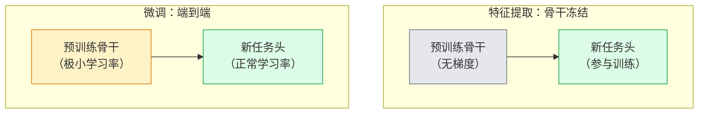

# 迁移学习与微调（Transfer Learning & Fine-Tuning）

> 别人已经花了一百万 GPU 小时，教会网络识别边缘、纹理和物体部件。自己训练前，应先借用这些特征。

**Type:** Build
**Languages:** Python
**Prerequisites:** 阶段 4 第 03 课（卷积神经网络），阶段 4 第 04 课（图像分类）
**Time:** ~75 分钟

## 学习目标（Learning Objectives）

- 区分特征提取与微调，根据数据集规模、领域距离和计算预算选择合适方法
- 加载预训练骨干网络、替换分类头，用不到 20 行代码仅训练任务头，得到可用基线
- 使用差异化学习率逐步解冻层，使早期通用特征的更新小于后期任务专用特征
- 诊断三类常见问题：解冻模块学习率过高导致特征漂移，小数据集上的 BN 统计量崩溃，以及灾难性遗忘

## 问题（The Problem）

在 ImageNet 上训练 ResNet-50 约需 2,000 GPU 小时。很少有团队能为每项交付任务投入这笔预算。几乎所有团队实际交付的，都是预训练骨干网络，加上用几百或几千张任务专用图像训练的新任务头。

这不是走捷径。任何在 ImageNet 上训练的 CNN，其第一个卷积模块都会学习边缘和类似 Gabor 的滤波器。接下来的几个模块学习纹理与简单图案，中间模块学习物体部件，最后的模块学习逐渐接近 ImageNet 1,000 个类别的组合。这一层级结构的前 90% 几乎可以原样迁移到医学成像、工业检测、卫星数据及其他视觉任务，因为自然界的边缘和纹理种类有限。最后 10% 才是你实际训练的部分。

正确迁移时有三类错误在等待你：学习率过高破坏预训练特征，冻结过多使模型无法获得足够信息，以及让 BatchNorm 的运行统计量偏向一个网络其余部分从未学习过的小数据集。本课会有意逐一探讨它们。

## 概念（The Concept）

### 特征提取与微调的区别（Feature extraction vs fine-tuning）

两种训练方式，取决于你对预训练特征的信任程度，以及手中数据量。



经验规则：

| 数据集规模 | 领域距离 | 配方 |
|--------------|-----------------|--------|
| < 1 千张图像 | 接近 ImageNet | 冻结骨干，仅训练任务头 |
| 1 千至 1 万 | 近 | 冻结前 2–3 个阶段，微调其余部分 |
| 1 万至 10 万 | 任意 | 使用差异化学习率端到端微调 |
| 10 万以上 | 远 | 微调全部参数；若领域足够远，考虑从零训练 |

“接近 ImageNet”大致指包含物体内容的自然 RGB 照片。医学 CT 扫描、俯视卫星图像和显微图像属于远领域：特征仍有帮助，但需要让更多层适应。

### 冻结为何有效（Why freezing works at all）

CNN 学到的 ImageNet 特征并非专为那 1,000 个类别设计，而是针对自然图像的统计特性：特定方向的边缘、纹理、对比模式和基本形状。这些统计特性在人们能说出的几乎所有视觉领域都很稳定。因此，ImageNet 训练模型只加一个新线性头、不微调骨干，在 CIFAR-10 上进行零样本评估就能达到 80% 以上准确率。任务头学习的是：该任务应如何对已有特征加权。

### 差异化学习率（Discriminative learning rates）

解冻时，早期层应比后期层训练得更慢。早期层编码的是需要保留的通用特征，后期层编码的是需要大幅调整的任务专用结构。

```
典型配方：

  阶段 0（输入干层 + 第一组）：lr = base_lr / 100    （基本固定）
  阶段 1：                       lr = base_lr / 10
  阶段 2：                       lr = base_lr / 3
  阶段 3（最后一组骨干模块）：   lr = base_lr
  任务头：                       lr = base_lr  （或略高）
```

在 PyTorch 中，这只是传给优化器的参数组列表。一个模型、五种学习率，无需额外代码。

### BatchNorm 问题（The BatchNorm problem）

BN 层保存了在 ImageNet 上计算的 `running_mean` 和 `running_var` 缓冲区。如果任务的像素分布不同，例如光照、传感器或颜色空间不同，这些缓冲区就不正确。按优先顺序有三种选择：

1. **让 BN 保持训练模式进行微调。** BN 与其他部分一起更新运行统计量。任务数据集规模中等（>= 5 千个样本）时，这是默认选择。
2. **将 BN 冻结在评估模式。** 保留 ImageNet 统计量，仅训练权重。当数据集小到 BN 移动平均会产生噪声时，这是正确选择。
3. **用组归一化（GroupNorm）替换 BN。** 完全消除移动平均问题。常用于每张 GPU 批次很小的检测和分割骨干网络。

处理错误会悄悄使准确率下降 5–15%。

### 任务头设计（Head design）

分类头由 1–3 个线性层和可选的随机失活组成。每个 torchvision 骨干都带有可以替换的默认任务头：

```
backbone.fc = nn.Linear(backbone.fc.in_features, num_classes)          # ResNet
backbone.classifier[1] = nn.Linear(..., num_classes)                    # EfficientNet, MobileNet
backbone.heads.head = nn.Linear(..., num_classes)                       # torchvision ViT
```

对小数据集，一个线性层通常足够。当任务分布与骨干训练分布相距较远时，增加隐藏层（Linear -> ReLU -> Dropout -> Linear）会有帮助。

### 逐层学习率衰减（Layer-wise LR decay）

现代微调（BEiT、DINOv2、ViT-B 微调）使用的一种更平滑的差异化学习率。不再将层按阶段分组，而是让每一层的学习率略小于其上一层：

```
lr_layer_k = base_lr * decay^(L - k)
```

当 decay = 0.75、L = 12 个 Transformer 模块时，第一个模块的学习率为任务头的 `0.75^11 ≈ 0.04x`。这对 Transformer 微调比 CNN 更重要；CNN 通常按阶段分组设置学习率就足够。

### 评估什么（What to evaluate）

迁移学习需要跟踪两个从零训练时不会记录的数值：

- **仅使用预训练特征的准确率（Pretrained-only accuracy）**：骨干冻结时任务头的准确率。这是下限。
- **微调后准确率（Fine-tuned accuracy）**：相同模型端到端训练后的准确率。这是上限。

若微调后低于仅使用预训练特征的结果，说明学习率或 BN 有错误。始终打印两者。

```figure
transfer-learning
```

## 动手实现（Build It）

### 第 1 步：加载并检查预训练骨干（Step 1: Load a pretrained backbone and inspect it）

```python
import torch
import torch.nn as nn
from torchvision.models import resnet18, ResNet18_Weights

backbone = resnet18(weights=ResNet18_Weights.IMAGENET1K_V1)
print(backbone)
print()
print("classifier head:", backbone.fc)
print("feature dim:", backbone.fc.in_features)
```

`ResNet18` 有四个阶段（`layer1..layer4`），另有输入干层和 `fc` 任务头。每个 torchvision 分类骨干都有类似结构。

### 第 2 步：特征提取，冻结全部参数并替换任务头（Step 2: Feature extraction — freeze everything, replace the head）

```python
def make_feature_extractor(num_classes=10):
    model = resnet18(weights=ResNet18_Weights.IMAGENET1K_V1)
    for p in model.parameters():
        p.requires_grad = False
    model.fc = nn.Linear(model.fc.in_features, num_classes)
    return model

model = make_feature_extractor(num_classes=10)
trainable = sum(p.numel() for p in model.parameters() if p.requires_grad)
frozen = sum(p.numel() for p in model.parameters() if not p.requires_grad)
print(f"trainable: {trainable:>10,}")
print(f"frozen:    {frozen:>10,}")
```

只有 `model.fc` 可训练，骨干是冻结的特征提取器。

### 第 3 步：差异化微调（Step 3: Discriminative fine-tuning）

构建具有阶段专用学习率的参数组的工具函数。

```python
def discriminative_param_groups(model, base_lr=1e-3, decay=0.3):
    stages = [
        ["conv1", "bn1"],
        ["layer1"],
        ["layer2"],
        ["layer3"],
        ["layer4"],
        ["fc"],
    ]
    groups = []
    for i, names in enumerate(stages):
        lr = base_lr * (decay ** (len(stages) - 1 - i))
        params = [p for n, p in model.named_parameters()
                  if any(n.startswith(k) for k in names)]
        if params:
            groups.append({"params": params, "lr": lr, "name": "_".join(names)})
    return groups

model = resnet18(weights=ResNet18_Weights.IMAGENET1K_V1)
model.fc = nn.Linear(model.fc.in_features, 10)
for p in model.parameters():
    p.requires_grad = True

groups = discriminative_param_groups(model)
for g in groups:
    print(f"{g['name']:>10s}  lr={g['lr']:.2e}  params={sum(p.numel() for p in g['params']):>8,}")
```

`decay=0.3` 表示每个阶段的学习率是下一阶段的 30%。`fc` 使用 `base_lr`，`layer4` 使用 `0.3 * base_lr`，`conv1` 使用 `0.3^5 * base_lr ≈ 0.00243 * base_lr`。听起来极端，实验上却有效。

### 第 4 步：处理 BatchNorm（Step 4: BatchNorm handling）

冻结 BN 运行统计量而不冻结其权重的辅助函数。

```python
def freeze_bn_stats(model):
    for m in model.modules():
        if isinstance(m, (nn.BatchNorm1d, nn.BatchNorm2d, nn.BatchNorm3d)):
            m.eval()
            for p in m.parameters():
                p.requires_grad = False
    return model
```

每个轮次开始时设置 `model.train()` 后调用它。`model.train()` 会将所有模块切换到训练模式，这个函数只对 BN 层反向切换。

### 第 5 步：最小端到端微调循环（Step 5: A minimal end-to-end fine-tuning loop）

```python
from torch.optim import SGD
from torch.utils.data import DataLoader
from torch.optim.lr_scheduler import CosineAnnealingLR
import torch.nn.functional as F

def fine_tune(model, train_loader, val_loader, device, epochs=5, base_lr=1e-3, freeze_bn=False):
    model = model.to(device)
    groups = discriminative_param_groups(model, base_lr=base_lr)
    optimizer = SGD(groups, momentum=0.9, weight_decay=1e-4, nesterov=True)
    scheduler = CosineAnnealingLR(optimizer, T_max=epochs)

    for epoch in range(epochs):
        model.train()
        if freeze_bn:
            freeze_bn_stats(model)
        tr_loss, tr_correct, tr_total = 0.0, 0, 0
        for x, y in train_loader:
            x, y = x.to(device), y.to(device)
            logits = model(x)
            loss = F.cross_entropy(logits, y, label_smoothing=0.1)
            optimizer.zero_grad()
            loss.backward()
            optimizer.step()
            tr_loss += loss.item() * x.size(0)
            tr_total += x.size(0)
            tr_correct += (logits.argmax(-1) == y).sum().item()
        scheduler.step()

        model.eval()
        va_total, va_correct = 0, 0
        with torch.no_grad():
            for x, y in val_loader:
                x, y = x.to(device), y.to(device)
                pred = model(x).argmax(-1)
                va_total += x.size(0)
                va_correct += (pred == y).sum().item()
        print(f"epoch {epoch}  train {tr_loss/tr_total:.3f}/{tr_correct/tr_total:.3f}  "
              f"val {va_correct/va_total:.3f}")
    return model
```

在 CIFAR-10 上按上述配方训练五个轮次，可将 `ResNet18-IMAGENET1K_V1` 从约 70% 的零样本线性探测准确率提高到约 93% 的微调准确率。若始终不触碰骨干，只训练任务头，准确率会在约 86% 处进入平台期。

### 第 6 步：逐步解冻（Step 6: Progressive unfreezing）

从后向前，每个轮次解冻一个阶段的调度方法。以多训练几个轮次为代价，减轻特征漂移。

```python
def progressive_unfreeze_schedule(model):
    stages = ["layer4", "layer3", "layer2", "layer1"]
    yielded = set()

    def start():
        for p in model.parameters():
            p.requires_grad = False
        for p in model.fc.parameters():
            p.requires_grad = True

    def unfreeze(epoch):
        if epoch < len(stages):
            name = stages[epoch]
            yielded.add(name)
            for n, p in model.named_parameters():
                if n.startswith(name):
                    p.requires_grad = True
            return name
        return None

    return start, unfreeze
```

首个轮次前调用一次 `start()`，每个轮次开始时调用 `unfreeze(epoch)`。可训练参数集合每次改变，都要重建优化器，否则冻结参数仍保留的缓存矩会干扰它。

## 实际应用（Use It）

多数实际任务只需 `torchvision.models` 加三行代码。遇到库默认设置无法解决的问题时，上述更复杂的机制才重要。

```python
from torchvision.models import resnet50, ResNet50_Weights

model = resnet50(weights=ResNet50_Weights.IMAGENET1K_V2)
model.fc = nn.Linear(model.fc.in_features, num_classes)
optimizer = torch.optim.AdamW(model.parameters(), lr=1e-4, weight_decay=1e-4)
```

另外两个生产级默认选择：

- `timm` 提供约 800 个预训练视觉骨干，采用一致 API（`timm.create_model("resnet50", pretrained=True, num_classes=10)`）。超出 torchvision 模型库范围的微调，通常都使用它。
- 对 Transformer，`transformers.AutoModelForImageClassification.from_pretrained(name, num_labels=N)` 提供 ViT / BEiT / DeiT，加载语义与文本模型相同。

## 交付成果（Ship It）

本课产出：

- `outputs/prompt-fine-tune-planner.md`：根据数据集规模、领域距离和计算预算，在特征提取、逐步微调和端到端微调之间选择的提示词。
- `outputs/skill-freeze-inspector.md`：给定 PyTorch 模型，报告哪些参数可训练、哪些 BatchNorm 层处于评估模式，以及优化器是否实际接收可训练参数的技能。

## 练习（Exercises）

1. **（简单）** 在同一合成 CIFAR 数据集上，将 `ResNet18` 分别作为线性探测器（冻结骨干）和完整微调模型训练。并列报告两种准确率。解释什么样的差距说明特征迁移良好，什么样的差距说明迁移不好。
2. **（中等）** 故意引入错误：将 `base_lr = 1e-1` 设在骨干阶段，而非任务头。展示训练损失爆炸，再通过 `discriminative_param_groups` 辅助函数恢复。记录每个阶段开始发散的学习率。
3. **（困难）** 选择医学成像数据集，例如 CheXpert-small、PatchCamelyon 或 HAM10000，比较三种方式：(a) ImageNet 预训练冻结骨干加线性头；(b) ImageNet 预训练后端到端微调；(c) 从零训练。报告各自准确率和计算成本。数据集达到多大时，从零训练开始具有竞争力？

## 关键术语（Key Terms）

| 术语 | 常见说法 | 实际含义 |
|------|----------------|----------------------|
| 特征提取（Feature extraction） | “冻结骨干，训练任务头” | 骨干参数冻结，只有新的分类头接收梯度 |
| 微调（Fine-tuning） | “端到端重训” | 全部参数可训练，学习率通常远低于从零训练 |
| 差异化学习率（Discriminative LR） | “早期层用小学习率” | 优化器参数组中，早期阶段学习率是后期阶段的一部分 |
| 逐层学习率衰减（Layer-wise LR decay） | “平滑的学习率梯度” | 各层学习率乘以 decay^(L - k)，常用于 Transformer 微调 |
| 灾难性遗忘（Catastrophic forgetting） | “模型忘了 ImageNet” | 学习率过高，在学到新任务信号之前就覆盖预训练特征 |
| BN 统计量漂移（BN statistics drift） | “运行均值错了” | BatchNorm 的 running_mean/var 在不同于当前任务的分布上计算，悄悄损害准确率 |
| 线性探测（Linear probe） | “冻结骨干加线性头” | 对预训练特征的评估，即冻结表征之上最佳线性分类器的准确率 |
| 灾难性崩溃（Catastrophic collapse） | “所有输入都预测成同一类” | 微调学习率高到在任务头梯度稳定前就破坏特征时发生 |

## 延伸阅读（Further Reading）

- [深度神经网络特征的可迁移性如何？（Yosinski 等，2014）](https://arxiv.org/abs/1411.1792)：量化不同层特征可迁移性的论文
- [通用语言模型微调（ULMFiT，Howard 与 Ruder，2018）](https://arxiv.org/abs/1801.06146)：差异化学习率与逐步解冻的原始配方，思想可直接迁移到视觉
- [timm 文档](https://huggingface.co/docs/timm)：现代视觉骨干及其训练时精确微调默认配置的参考
- [线性探测评估的简易框架（Kornblith 等，2019）](https://arxiv.org/abs/1805.08974)：线性探测准确率为何重要，以及如何正确报告
