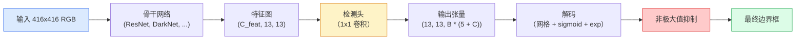

# 目标检测：从零实现 YOLO（Object Detection — YOLO from Scratch）

> 检测就是在特征图每个位置运行分类与回归，再用非极大值抑制清理结果。

**Type:** Build
**Languages:** Python
**Prerequisites:** 阶段 4 第 03 课（卷积神经网络），阶段 4 第 04 课（图像分类），阶段 4 第 05 课（迁移学习）
**Time:** ~75 分钟

## 学习目标（Learning Objectives）

- 解释网格与锚框设计如何将检测变成密集预测问题，并说出输出张量每个数值的含义
- 计算边界框之间的交并比，并从零实现非极大值抑制
- 在预训练骨干上构建最小 YOLO 风格检测头，包含分类、目标存在性和边界框回归损失
- 阅读一行检测指标（precision@0.5、recall、mAP@0.5、mAP@0.5:0.95），决定下一步调整什么

## 问题（The Problem）

分类说的是“这张图像是一只狗”。检测说的是“像素坐标 (112, 40, 280, 210) 处有一只狗，(400, 180, 560, 310) 处有一只猫，画面中没有其他目标”。从每张图像预测一个标签，变成预测数量可变的带标签边界框，这一结构变化支撑着所有自主系统、监控产品、文档布局解析器和工厂视觉生产线。

检测也让视觉中的各种工程取舍同时出现。你需要准确的边界框（回归头）、每个框的正确类别（分类头）、模型知道何时没有目标可检测（目标存在性分数），以及每个真实目标恰好一个预测（非极大值抑制）。缺少任意一项，流水线都会漏检目标、报告虚构边界框，或在略有不同的位置对同一目标预测十五次。

YOLO（You Only Look Once，Redmon 等，2016）通过卷积网络的一次前向传播完成全部操作，使实时运行成为可能。相同结构决策仍是现代检测器（YOLOv8、YOLOv9、YOLO-NAS、RT-DETR）的基础。学会核心后，每种变体都是相同部件的重新排列。

## 概念（The Concept）

### 将检测视为密集预测（Detection as dense prediction）

分类器对每张图像输出 C 个数值。YOLO 风格检测器对每张图像输出 `(S x S x (5 + C))` 个数值，其中 S 是空间网格大小。



`S * S` 个网格单元中，每个单元预测 `B` 个框。对于每个框：

- 4 个数值描述几何信息：`tx, ty, tw, th`。
- 1 个数值是目标存在性分数：“是否有目标的中心位于这个单元内？”
- C 个数值是类别概率。

每个单元共 `B * (5 + C)` 个数值。VOC 设置 `S=13, B=2, C=20` 时，每个单元为 50 个数值。

### 为什么使用网格和锚框（Why grids and anchors）

普通回归会为每个目标预测绝对坐标 `(x, y, w, h)`。这对卷积网络很困难，因为平移图像不应让所有预测都平移相同距离，每个目标在空间上都有自己的锚定位置。网格将每个真实框分配给其中心所在的单元，只有该单元对该目标负责，从而处理这一问题。

锚框（Anchor）解决第二个问题。3x3 卷积很难从感受野为 16 像素的特征单元中直接回归一个 500 像素宽的框。因此，我们为每个单元预定义 `B` 种先验框形状，即锚框，预测相对各锚框的小偏移。模型学习选对锚框并微调它，而不是凭空回归。

```
锚框先验（416x416 输入示例）：

  小型：   (30,  60)
  中型：   (75,  170)
  大型：   (200, 380)

在每个网格单元中，每个锚框输出 (tx, ty, tw, th, obj, c_1, ..., c_C)。
```

现代检测器常使用特征金字塔网络（Feature Pyramid Network，FPN），每种分辨率配不同锚框集合：浅层高分辨率图上放小锚框，深层低分辨率图上放大锚框。思想相同，只是尺度更多。

### 解码预测（Decoding predictions）

原始 `tx, ty, tw, th` 不是边界框坐标，而是回归目标，绘制前需要变换：

```
中心 x    = (sigmoid(tx) + cell_x) * stride
中心 y    = (sigmoid(ty) + cell_y) * stride
宽度      = anchor_w * exp(tw)
高度      = anchor_h * exp(th)
```

`sigmoid` 将中心偏移限制在单元内部；`exp` 让宽度可以相对锚框自由缩放，而不改变符号；`stride` 将网格坐标缩放回像素。从 v2 起，每个 YOLO 版本的解码步骤都相同。

### 交并比（Intersection-over-Union，IoU）

检测中衡量两个边界框相似度的通用指标：

```
IoU(A, B) = area(A intersect B) / area(A union B)
```

IoU = 1 表示完全相同，IoU = 0 表示没有重叠。预测框与真实框之间的 IoU 决定预测是否计为真正例，通常要求 IoU >= 0.5。两个预测框之间的 IoU 则用于非极大值抑制（Non-Maximum Suppression，NMS）去重。

### 非极大值抑制（Non-maximum suppression）

在相邻锚框上训练的卷积网络，常为同一目标预测重叠边界框。NMS 保留置信度最高的预测，删除与它的 IoU 超过阈值的其他预测。

```
NMS(boxes, scores, iou_threshold):
    按分数降序排列 boxes
    keep = []
    当 boxes 非空时：
        选出最高分框，加入 keep
        删除与所选框的 IoU > iou_threshold 的所有框
    return keep
```

目标检测中的典型阈值为 0.45。较新的检测器用 `soft-NMS`、`DIoU-NMS` 替换标准 NMS，或直接学习抑制过程（RT-DETR），但结构目的相同。

### 损失（The loss）

YOLO 损失是三类损失的加权和：

```
L = lambda_coord * L_box(pred, target, where obj=1)
  + lambda_obj   * L_obj(pred, 1,     where obj=1)
  + lambda_noobj * L_obj(pred, 0,     where obj=0)
  + lambda_cls   * L_cls(pred, target, where obj=1)
```

只有包含目标的单元贡献边界框回归和分类损失。没有目标的单元只贡献目标存在性损失，教会模型保持静默。`lambda_noobj` 通常较小，约 0.5，因为绝大多数单元为空，否则会主导总损失。

现代变体用完全交并比（Complete IoU，CIoU）或距离交并比（Distance IoU，DIoU）替换均方误差（Mean Squared Error，MSE）框损失，直接优化 IoU；用焦点损失（Focal loss）处理类别不平衡，用质量焦点损失平衡目标存在性。三部分结构不变。

### 检测指标（Detection metrics）

准确率无法直接用于检测，以下四个指标可以：

- **IoU=0.5 时的精确率（Precision@IoU=0.5）**：计为正例的预测中，有多少实际正确。
- **IoU=0.5 时的召回率（Recall@IoU=0.5）**：真实目标中找到了多少。
- **AP@0.5**：IoU 阈值为 0.5 时精确率召回率曲线下的面积，每类一个数值。
- **mAP@0.5:0.95**：在 IoU 阈值 0.5、0.55、...、0.95 上对 AP 求平均。这是 COCO 指标，最严格，也最有信息量。

四项都要报告。mAP@0.5 很强、mAP@0.5:0.95 很弱，表示检测器只能粗略定位，边界框不够贴合；可用更好的框回归损失修复。精确率高、召回率低，则过于保守，应降低置信度阈值或提高目标存在性权重。

```figure
object-detection-nms
```

## 动手实现（Build It）

### 第 1 步：交并比（Step 1: IoU）

本课的基础运算。接收两个 `(x1, y1, x2, y2)` 格式的边界框数组。

```python
import numpy as np

def box_iou(boxes_a, boxes_b):
    ax1, ay1, ax2, ay2 = boxes_a[:, 0], boxes_a[:, 1], boxes_a[:, 2], boxes_a[:, 3]
    bx1, by1, bx2, by2 = boxes_b[:, 0], boxes_b[:, 1], boxes_b[:, 2], boxes_b[:, 3]

    inter_x1 = np.maximum(ax1[:, None], bx1[None, :])
    inter_y1 = np.maximum(ay1[:, None], by1[None, :])
    inter_x2 = np.minimum(ax2[:, None], bx2[None, :])
    inter_y2 = np.minimum(ay2[:, None], by2[None, :])

    inter_w = np.clip(inter_x2 - inter_x1, 0, None)
    inter_h = np.clip(inter_y2 - inter_y1, 0, None)
    inter = inter_w * inter_h

    area_a = (ax2 - ax1) * (ay2 - ay1)
    area_b = (bx2 - bx1) * (by2 - by1)
    union = area_a[:, None] + area_b[None, :] - inter
    return inter / np.clip(union, 1e-8, None)
```

返回形状为 `(N_a, N_b)` 的两两 IoU 矩阵。要与单个真实框比较，将其中一个数组设为 `(1, 4)`。

### 第 2 步：非极大值抑制（Step 2: Non-max suppression）

```python
def nms(boxes, scores, iou_threshold=0.45):
    order = np.argsort(-scores)
    keep = []
    while len(order) > 0:
        i = order[0]
        keep.append(i)
        if len(order) == 1:
            break
        rest = order[1:]
        ious = box_iou(boxes[[i]], boxes[rest])[0]
        order = rest[ious <= iou_threshold]
    return np.array(keep, dtype=np.int64)
```

结果确定，排序带来 `O(N log N)` 复杂度，并在相同输入上匹配 `torchvision.ops.nms` 的行为。

### 第 3 步：边界框编码与解码（Step 3: Box encoding and decoding）

在像素坐标与网络实际回归的 `(tx, ty, tw, th)` 目标之间转换。

```python
def encode(box_xyxy, cell_x, cell_y, stride, anchor_wh):
    x1, y1, x2, y2 = box_xyxy
    cx = 0.5 * (x1 + x2)
    cy = 0.5 * (y1 + y2)
    w = x2 - x1
    h = y2 - y1
    tx = cx / stride - cell_x
    ty = cy / stride - cell_y
    tw = np.log(w / anchor_wh[0] + 1e-8)
    th = np.log(h / anchor_wh[1] + 1e-8)
    return np.array([tx, ty, tw, th])


def decode(tx_ty_tw_th, cell_x, cell_y, stride, anchor_wh):
    tx, ty, tw, th = tx_ty_tw_th
    cx = (sigmoid(tx) + cell_x) * stride
    cy = (sigmoid(ty) + cell_y) * stride
    w = anchor_wh[0] * np.exp(tw)
    h = anchor_wh[1] * np.exp(th)
    return np.array([cx - w / 2, cy - h / 2, cx + w / 2, cy + h / 2])


def sigmoid(x):
    return 1.0 / (1.0 + np.exp(-x))
```

测试：先编码再解码一个框，应得到与原框非常接近的结果；当 `tx` 不在 sigmoid 后的取值范围内时，sigmoid 逆变换无法完全逆转，存在这一限制。

### 第 4 步：最小 YOLO 检测头（Step 4: A minimal YOLO head）

对特征图执行一个 1x1 卷积，重塑为 `(B, S, S, num_anchors, 5 + C)`。

```python
import torch
import torch.nn as nn

class YOLOHead(nn.Module):
    def __init__(self, in_c, num_anchors, num_classes):
        super().__init__()
        self.num_anchors = num_anchors
        self.num_classes = num_classes
        self.conv = nn.Conv2d(in_c, num_anchors * (5 + num_classes), kernel_size=1)

    def forward(self, x):
        n, _, h, w = x.shape
        y = self.conv(x)
        y = y.view(n, self.num_anchors, 5 + self.num_classes, h, w)
        y = y.permute(0, 3, 4, 1, 2).contiguous()
        return y
```

输出形状：`(N, H, W, num_anchors, 5 + C)`。最后一维保存 `[tx, ty, tw, th, obj, cls_0, ..., cls_{C-1}]`。

### 第 5 步：分配真实目标（Step 5: Ground-truth assignment）

为每个真实框决定由哪个 `(cell, anchor)` 负责。

```python
def assign_targets(boxes_xyxy, classes, anchors, stride, grid_size, num_classes):
    num_anchors = len(anchors)
    target = np.zeros((grid_size, grid_size, num_anchors, 5 + num_classes), dtype=np.float32)
    has_obj = np.zeros((grid_size, grid_size, num_anchors), dtype=bool)

    for box, cls in zip(boxes_xyxy, classes):
        x1, y1, x2, y2 = box
        cx, cy = 0.5 * (x1 + x2), 0.5 * (y1 + y2)
        gx, gy = int(cx / stride), int(cy / stride)
        bw, bh = x2 - x1, y2 - y1

        ious = np.array([
            (min(bw, aw) * min(bh, ah)) / (bw * bh + aw * ah - min(bw, aw) * min(bh, ah))
            for aw, ah in anchors
        ])
        best = int(np.argmax(ious))
        aw, ah = anchors[best]

        target[gy, gx, best, 0] = cx / stride - gx
        target[gy, gx, best, 1] = cy / stride - gy
        target[gy, gx, best, 2] = np.log(bw / aw + 1e-8)
        target[gy, gx, best, 3] = np.log(bh / ah + 1e-8)
        target[gy, gx, best, 4] = 1.0
        target[gy, gx, best, 5 + cls] = 1.0
        has_obj[gy, gx, best] = True
    return target, has_obj
```

锚框选择采用“与真实框形状 IoU 最佳”的规则，这是低成本近似，与 YOLOv2/v3 的分配方式一致。v5 及后续版本用任务对齐匹配、动态 k 等更复杂策略完善相同思想。

### 第 6 步：三类损失（Step 6: The three losses）

```python
def yolo_loss(pred, target, has_obj, lambda_coord=5.0, lambda_obj=1.0, lambda_noobj=0.5, lambda_cls=1.0):
    has_obj_t = torch.from_numpy(has_obj).bool()
    target_t = torch.from_numpy(target).float()

    # box-regression loss: only on cells with objects
    box_pred = pred[..., :4][has_obj_t]
    box_true = target_t[..., :4][has_obj_t]
    loss_box = torch.nn.functional.mse_loss(box_pred, box_true, reduction="sum")

    # objectness loss
    obj_pred = pred[..., 4]
    obj_true = target_t[..., 4]
    loss_obj_pos = torch.nn.functional.binary_cross_entropy_with_logits(
        obj_pred[has_obj_t], obj_true[has_obj_t], reduction="sum")
    loss_obj_neg = torch.nn.functional.binary_cross_entropy_with_logits(
        obj_pred[~has_obj_t], obj_true[~has_obj_t], reduction="sum")

    # classification loss on cells with objects
    cls_pred = pred[..., 5:][has_obj_t]
    cls_true = target_t[..., 5:][has_obj_t]
    loss_cls = torch.nn.functional.binary_cross_entropy_with_logits(
        cls_pred, cls_true, reduction="sum")

    total = (lambda_coord * loss_box
             + lambda_obj * loss_obj_pos
             + lambda_noobj * loss_obj_neg
             + lambda_cls * loss_cls)
    return total, {"box": loss_box.item(), "obj_pos": loss_obj_pos.item(),
                   "obj_neg": loss_obj_neg.item(), "cls": loss_cls.item()}
```

每份 YOLO 教程都会硬编码或扫描这五个超参数。比例很重要：`lambda_coord=5, lambda_noobj=0.5` 对应原始 YOLOv1 论文，至今仍是合理的默认值。

### 第 7 步：推理流水线（Step 7: Inference pipeline）

解码检测头原始输出，应用 sigmoid/exp，按目标存在性阈值筛选，再执行 NMS。

```python
def postprocess(pred_tensor, anchors, stride, img_size, conf_threshold=0.25, iou_threshold=0.45):
    pred = pred_tensor.detach().cpu().numpy()
    grid_h, grid_w = pred.shape[1], pred.shape[2]
    num_anchors = len(anchors)

    boxes, scores, classes = [], [], []
    for gy in range(grid_h):
        for gx in range(grid_w):
            for a in range(num_anchors):
                tx, ty, tw, th, obj, *cls = pred[0, gy, gx, a]
                score = sigmoid(obj) * sigmoid(np.array(cls)).max()
                if score < conf_threshold:
                    continue
                cls_idx = int(np.argmax(cls))
                cx = (sigmoid(tx) + gx) * stride
                cy = (sigmoid(ty) + gy) * stride
                w = anchors[a][0] * np.exp(tw)
                h = anchors[a][1] * np.exp(th)
                boxes.append([cx - w / 2, cy - h / 2, cx + w / 2, cy + h / 2])
                scores.append(float(score))
                classes.append(cls_idx)

    if not boxes:
        return np.zeros((0, 4)), np.zeros((0,)), np.zeros((0,), dtype=int)
    boxes = np.array(boxes)
    scores = np.array(scores)
    classes = np.array(classes)
    keep = nms(boxes, scores, iou_threshold)
    return boxes[keep], scores[keep], classes[keep]
```

这就是完整评估路径：检测头 -> 解码 -> 阈值筛选 -> NMS。

## 实际应用（Use It）

`torchvision.models.detection` 提供概念结构相同的生产检测器，加载预训练模型只需三行。

```python
import torch
from torchvision.models.detection import fasterrcnn_resnet50_fpn_v2

model = fasterrcnn_resnet50_fpn_v2(weights="DEFAULT")
model.eval()
with torch.no_grad():
    predictions = model([torch.randn(3, 400, 600)])
print(predictions[0].keys())
print(f"boxes:  {predictions[0]['boxes'].shape}")
print(f"scores: {predictions[0]['scores'].shape}")
print(f"labels: {predictions[0]['labels'].shape}")
```

实时推理流水线通常使用 `ultralytics`（YOLOv8/v9）：`from ultralytics import YOLO; model = YOLO('yolov8n.pt'); model(img)`。模型内部处理解码和 NMS，返回与你上面构建的相同的 `boxes / scores / labels` 三元组。

## 交付成果（Ship It）

本课产出：

- `outputs/prompt-detection-metric-reader.md`：将一行 `precision, recall, AP, mAP@0.5:0.95` 指标转成一句诊断和最有用的下一项实验的提示词。
- `outputs/skill-anchor-designer.md`：给定真实框数据集，在 `(w, h)` 上运行 k 均值聚类，返回各 FPN 层级的锚框集合及选择合适锚框数量所需覆盖率统计的技能。

## 练习（Exercises）

1. **（简单）** 实现 `box_iou`，在 1,000 对随机边界框上与 `torchvision.ops.box_iou` 比较，验证最大绝对差小于 `1e-6`。
2. **（中等）** 将 `yolo_loss` 改为使用 `CIoU` 框损失而非 MSE 的版本。在包含 100 张图像的合成数据集上，证明相同训练轮次下，CIoU 收敛后的 mAP@0.5:0.95 优于 MSE。
3. **（困难）** 实现多尺度推理：将同一图像以三种分辨率输入模型，合并预测框，最后统一执行一次 NMS。在留出集上测量相对于单尺度推理的 mAP 提升。

## 关键术语（Key Terms）

| 术语 | 常见说法 | 实际含义 |
|------|----------------|----------------------|
| 锚框（Anchor） | “边界框先验” | 每个网格单元上的预定义框形状，网络预测相对它的偏移而非绝对坐标 |
| 交并比（Intersection-over-Union，IoU） | “重叠度” | 两个框的交集面积除以并集面积，是检测中的通用相似度指标 |
| 非极大值抑制（Non-Maximum Suppression，NMS） | “去重” | 保留最高分预测，移除与其重叠超过阈值的预测的贪心算法 |
| 目标存在性（Objectness） | “这里有东西吗” | 每个锚框、每个单元的标量，预测是否有目标中心位于该单元内 |
| 网格步幅（Grid stride） | “下采样倍数” | 每个网格单元对应的像素数；416 像素输入配 13 格检测头，步幅为 32 |
| 平均精度均值（Mean Average Precision，mAP） | “平均精度的平均值” | 对精确率召回率曲线下面积按类别求平均，COCO 还按 IoU 阈值平均 |
| AP@0.5 | “PASCAL VOC AP” | IoU 阈值为 0.5 的平均精度，是较宽松的版本 |
| mAP@0.5:0.95 | “COCO AP” | 对 0.5..0.95、步长 0.05 的 IoU 阈值求平均，是严格版本和当前社区标准 |

## 延伸阅读（Further Reading）

- [YOLOv1：只看一次（Redmon 等，2016）](https://arxiv.org/abs/1506.02640)：奠基论文，此后每个 YOLO 都是对这一结构的改进
- [YOLOv3（Redmon 与 Farhadi，2018）](https://arxiv.org/abs/1804.02767)：引入多尺度 FPN 风格检测头的论文，图解仍最清晰
- [Ultralytics YOLOv8 文档](https://docs.ultralytics.com)：当前生产参考，覆盖数据集格式、增强与训练配方
- [目标检测图解指南（Jonathan Hui）](https://jonathan-hui.medium.com/object-detection-series-24d03a12f904)：以浅显语言介绍完整检测器家族，对理解 DETR、RetinaNet、FCOS 与 YOLO 的关系很有价值
