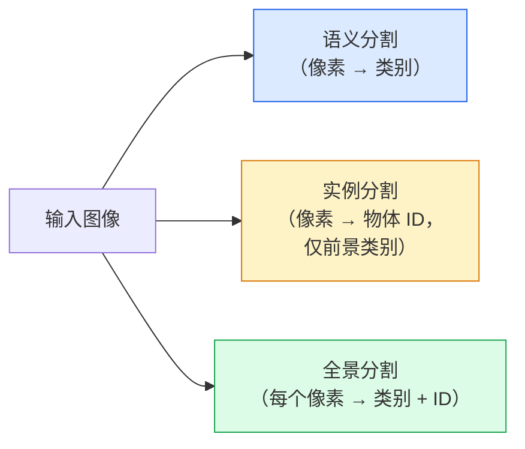
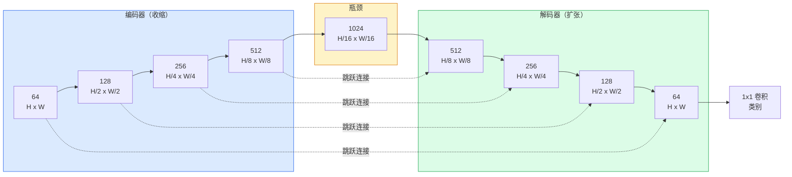

# 语义分割：U-Net（Semantic Segmentation — U-Net）

> 分割就是对每个像素分类。U-Net 将下采样编码器与上采样解码器配对，并在两者之间加入跳跃连接，使这一任务得以实现。

**Type:** Build
**Languages:** Python
**Prerequisites:** 阶段 4 第 03 课（卷积神经网络），阶段 4 第 04 课（图像分类）
**Time:** ~75 分钟

## 学习目标（Learning Objectives）

- 区分语义分割、实例分割和全景分割，为给定问题选择正确任务
- 用 PyTorch 从零构建 U-Net，包含编码器模块、瓶颈、带转置卷积的解码器和跳跃连接
- 实现逐像素交叉熵、Dice 损失，以及医学和工业分割当前默认使用的组合损失
- 阅读逐类别 IoU 与 Dice 指标，诊断低分源自小目标召回率、边界精度还是类别不平衡

## 问题（The Problem）

分类每张图像输出一个标签，检测每张图像输出几个框，分割则每个像素输出一个标签。对于尺寸为 `H x W` 的输入，输出张量形状为 `H x W`（语义分割）或 `H x W x N_instances`（实例分割）。每张图像需要数百万次预测，而非一次。

这种结构使分割支撑了几乎所有密集预测视觉产品：医学成像中的肿瘤掩码，自动驾驶中的道路、车道和障碍物，卫星图像中的建筑轮廓与农田边界，文档解析中的布局区域，以及机器人中的可抓取区域。这些任务都无法仅靠给物体画一个框解决，而是需要精确轮廓。

架构问题说起来简单，解决起来并不简单：网络必须同时看到图像的全局上下文，即这是什么场景，以及局部像素细节，即哪个像素是车道、哪个是人行道。标准 CNN 通过空间压缩获得上下文，却丢掉细节。U-Net 的设计兼得二者。

## 概念（The Concept）

### 语义、实例与全景分割（Semantic vs instance vs panoptic）



- **语义分割（Semantic segmentation）**说“这个像素是道路，那个像素是汽车”。两辆相邻汽车会合成一块。
- **实例分割（Instance segmentation）**说“这个像素属于 3 号车，那个像素属于 5 号车”。它忽略天空、道路、草地等背景区域（Stuff）。
- **全景分割（Panoptic segmentation）**统一二者：每个像素都有类别标签，每个实例都有唯一 ID，背景区域与可数物体都被分割。

本课讲语义分割，下一课 Mask R-CNN 讲实例分割。

### U-Net 的结构（The U-Net shape）



编码器四次将空间分辨率减半，并将通道数翻倍。解码器反向操作：四次将空间分辨率翻倍，并将通道数减半。跳跃连接在每个分辨率上，将对应编码器特征与解码器特征拼接。最后的 1x1 卷积在完整分辨率下完成 `64 -> num_classes` 映射。

跳跃连接不可或缺，是因为解码器尝试输出像素级预测时，此前只看到很小的特征图。没有跳跃连接，它无法精确定位边缘，因为这些信息已在编码器中被压缩掉。跳跃连接把编码器下采样过程中计算的高分辨率特征图交给解码器。

### 转置卷积与双线性上采样（Transposed vs bilinear upsample）

解码器必须扩大空间维度，有两种选择：

- **转置卷积（Transposed convolution）**（`nn.ConvTranspose2d`）：可学习的上采样，是早期 U-Net 默认方案。若卷积核大小不能被步幅整除，可能产生棋盘格伪影。
- **双线性上采样加 3x3 卷积（Bilinear upsample + 3x3 conv）**：先平滑上采样，再接卷积。伪影和参数更少，已成为现代默认方案。

实际系统中两者都有。初次构建 U-Net 时，双线性更稳妥。

### 像素网格上的交叉熵（Cross-entropy on a pixel grid）

对于 C 类语义分割，模型输出为 `(N, C, H, W)`，目标为包含整数类别 ID 的 `(N, H, W)`。交叉熵与分类时相同，只是应用于每个空间位置：

```
Loss = mean over (n, h, w) of -log( softmax(logits[n, :, h, w])[target[n, h, w]] )
```

PyTorch 的 `F.cross_entropy` 原生支持该形状，无需重塑。

### Dice 损失及其必要性（Dice loss and why you need it）

交叉熵平等对待每个像素。当某类占据绝大多数画面时，这并不合适，例如医学成像中 99% 背景、1% 肿瘤。网络只要处处预测背景就能达到 99% 准确率，却毫无用处。

Dice 损失直接优化预测掩码与真实掩码的重叠，解决这一问题：

```
Dice(p, y) = 2 * sum(p * y) / (sum(p) + sum(y) + epsilon)
Dice_loss = 1 - Dice
```

其中 `p` 是某类的 sigmoid/softmax 概率图，`y` 是二值真实掩码。只有完全重叠时损失才为零。因为基于比例，类别不平衡不会影响它。

实践中使用**组合损失（Combined loss）**：

```
L = L_cross_entropy + lambda * L_dice       (lambda ~ 1)
```

交叉熵在训练早期提供稳定梯度，Dice 让训练后期专注于真正匹配掩码形状。这一组合是医学成像默认方案，在任何类别不平衡数据集上都很难被超越。

### 评估指标（Evaluation metrics）

- **像素准确率（Pixel accuracy）**：预测正确的像素百分比，计算便宜。但在不平衡数据上失效，原因与分类准确率相同。
- **逐类别交并比（IoU per class）**：各类掩码的交并比，按类别求平均得到 mIoU。
- **Dice，像素上的 F1**：与 IoU 类似，`Dice = 2 * IoU / (1 + IoU)`。医学成像更常用 Dice，自动驾驶社区更常用 IoU，二者单调相关。
- **边界 F1（Boundary F1）**：衡量预测边界与真实边界的接近程度，即使小偏移也会受罚。对半导体检测等高精度任务很重要。

应报告逐类别 IoU，而不只是 mIoU。其他九类为 85% 时，平均值会掩盖某一类只有 15% 的事实。

### 输入分辨率取舍（Input resolution trade-off）

U-Net 编码器四次将分辨率减半，因此输入尺寸必须能被 16 整除。医学图像常为 512x512 或 1024x1024，自动驾驶裁剪为 2048x1024。U-Net 内存成本随 `H * W * C_max` 增长；1024x1024 输入配 1024 瓶颈通道时，仅前向传播就已占用数 GB 显存。

两种标准应对方式：
1. 将输入分块，处理相互重叠的 256x256 图块，再拼接。
2. 用空洞卷积（Dilated convolution）替换瓶颈，在保持较高空间分辨率的同时扩大感受野，例如 DeepLab 家族。

首个模型使用 256x256 输入和基础通道数为 64 的 U-Net，在 8 GB 显存上即可顺畅训练。

```figure
segmentation-flood
```

## 动手实现（Build It）

### 第 1 步：编码器模块（Step 1: Encoder block）

两个 3x3 卷积配批归一化和 ReLU。第一个卷积改变通道数，第二个保持通道数。

```python
import torch
import torch.nn as nn
import torch.nn.functional as F

class DoubleConv(nn.Module):
    def __init__(self, in_c, out_c):
        super().__init__()
        self.net = nn.Sequential(
            nn.Conv2d(in_c, out_c, kernel_size=3, padding=1, bias=False),
            nn.BatchNorm2d(out_c),
            nn.ReLU(inplace=True),
            nn.Conv2d(out_c, out_c, kernel_size=3, padding=1, bias=False),
            nn.BatchNorm2d(out_c),
            nn.ReLU(inplace=True),
        )

    def forward(self, x):
        return self.net(x)
```

整个网络复用这一模块。设置 `bias=False`，因为 BN 的 beta 负责偏置。

### 第 2 步：下采样与上采样模块（Step 2: Down and up blocks）

```python
class Down(nn.Module):
    def __init__(self, in_c, out_c):
        super().__init__()
        self.net = nn.Sequential(
            nn.MaxPool2d(2),
            DoubleConv(in_c, out_c),
        )

    def forward(self, x):
        return self.net(x)


class Up(nn.Module):
    def __init__(self, in_c, out_c):
        super().__init__()
        self.up = nn.Upsample(scale_factor=2, mode="bilinear", align_corners=False)
        self.conv = DoubleConv(in_c, out_c)

    def forward(self, x, skip):
        x = self.up(x)
        if x.shape[-2:] != skip.shape[-2:]:
            x = F.interpolate(x, size=skip.shape[-2:], mode="bilinear", align_corners=False)
        x = torch.cat([skip, x], dim=1)
        return self.conv(x)
```

只检查空间形状（`shape[-2:]`），可处理尺寸不能被 16 整除的输入；安全调用 `F.interpolate`，在拼接前对齐张量。若比较完整形状，通道数差异也会触发处理，而通道差异应该显式报错，不应悄悄插值。

### 第 3 步：U-Net（Step 3: The U-Net）

```python
class UNet(nn.Module):
    def __init__(self, in_channels=3, num_classes=2, base=64):
        super().__init__()
        self.inc = DoubleConv(in_channels, base)
        self.d1 = Down(base, base * 2)
        self.d2 = Down(base * 2, base * 4)
        self.d3 = Down(base * 4, base * 8)
        self.d4 = Down(base * 8, base * 16)
        self.u1 = Up(base * 16 + base * 8, base * 8)
        self.u2 = Up(base * 8 + base * 4, base * 4)
        self.u3 = Up(base * 4 + base * 2, base * 2)
        self.u4 = Up(base * 2 + base, base)
        self.outc = nn.Conv2d(base, num_classes, kernel_size=1)

    def forward(self, x):
        x1 = self.inc(x)
        x2 = self.d1(x1)
        x3 = self.d2(x2)
        x4 = self.d3(x3)
        x5 = self.d4(x4)
        x = self.u1(x5, x4)
        x = self.u2(x, x3)
        x = self.u3(x, x2)
        x = self.u4(x, x1)
        return self.outc(x)

net = UNet(in_channels=3, num_classes=2, base=32)
x = torch.randn(1, 3, 256, 256)
print(f"output: {net(x).shape}")
print(f"params: {sum(p.numel() for p in net.parameters()):,}")
```

输出形状为 `(1, 2, 256, 256)`，空间尺寸与输入相同，有 `num_classes` 个通道。`base=32` 时约 770 万参数。

### 第 4 步：损失（Step 4: Losses）

```python
def dice_loss(logits, targets, num_classes, eps=1e-6):
    probs = F.softmax(logits, dim=1)
    targets_one_hot = F.one_hot(targets, num_classes).permute(0, 3, 1, 2).float()
    dims = (0, 2, 3)
    intersection = (probs * targets_one_hot).sum(dim=dims)
    denom = probs.sum(dim=dims) + targets_one_hot.sum(dim=dims)
    dice = (2 * intersection + eps) / (denom + eps)
    return 1 - dice.mean()


def combined_loss(logits, targets, num_classes, lam=1.0):
    ce = F.cross_entropy(logits, targets)
    dc = dice_loss(logits, targets, num_classes)
    return ce + lam * dc, {"ce": ce.item(), "dice": dc.item()}
```

先逐类计算 Dice，再取平均，得到宏平均 Dice。`eps` 防止批次中缺失类别导致除零。

### 第 5 步：IoU 指标（Step 5: IoU metric）

```python
@torch.no_grad()
def iou_per_class(logits, targets, num_classes):
    preds = logits.argmax(dim=1)
    ious = torch.zeros(num_classes)
    for c in range(num_classes):
        pred_c = (preds == c)
        true_c = (targets == c)
        inter = (pred_c & true_c).sum().float()
        union = (pred_c | true_c).sum().float()
        ious[c] = (inter / union) if union > 0 else torch.tensor(float("nan"))
    return ious
```

返回长度为 C 的向量。`nan` 标记批次中缺失的类别，计算 mIoU 时不要将它们纳入平均。

### 第 6 步：用于端到端验证的合成数据集（Step 6: Synthetic dataset for end-to-end verification）

在彩色背景上生成图形，使网络必须学习形状，而非像素颜色。

```python
import numpy as np
from torch.utils.data import Dataset, DataLoader

def synthetic_segmentation(num_samples=200, size=64, seed=0):
    rng = np.random.default_rng(seed)
    images = np.zeros((num_samples, size, size, 3), dtype=np.float32)
    masks = np.zeros((num_samples, size, size), dtype=np.int64)
    for i in range(num_samples):
        bg = rng.uniform(0, 1, (3,))
        images[i] = bg
        masks[i] = 0
        num_shapes = rng.integers(1, 4)
        for _ in range(num_shapes):
            cls = int(rng.integers(1, 3))
            color = rng.uniform(0, 1, (3,))
            cx, cy = rng.integers(10, size - 10, size=2)
            r = int(rng.integers(4, 12))
            yy, xx = np.meshgrid(np.arange(size), np.arange(size), indexing="ij")
            if cls == 1:
                mask = (xx - cx) ** 2 + (yy - cy) ** 2 < r ** 2
            else:
                mask = (np.abs(xx - cx) < r) & (np.abs(yy - cy) < r)
            images[i][mask] = color
            masks[i][mask] = cls
        images[i] += rng.normal(0, 0.02, images[i].shape)
        images[i] = np.clip(images[i], 0, 1)
    return images, masks


class SegDataset(Dataset):
    def __init__(self, images, masks):
        self.images = images
        self.masks = masks

    def __len__(self):
        return len(self.images)

    def __getitem__(self, i):
        img = torch.from_numpy(self.images[i]).permute(2, 0, 1).float()
        mask = torch.from_numpy(self.masks[i]).long()
        return img, mask
```

三个类别：背景 (0)、圆形 (1)、正方形 (2)。网络必须学会区分形状。

### 第 7 步：训练循环（Step 7: Training loop）

```python
def train_one_epoch(model, loader, optimizer, device, num_classes):
    model.train()
    loss_sum, total = 0.0, 0
    iou_sum = torch.zeros(num_classes)
    for x, y in loader:
        x, y = x.to(device), y.to(device)
        logits = model(x)
        loss, _ = combined_loss(logits, y, num_classes)
        optimizer.zero_grad()
        loss.backward()
        optimizer.step()
        loss_sum += loss.item() * x.size(0)
        total += x.size(0)
        iou_sum += iou_per_class(logits, y, num_classes).nan_to_num(0)
    return loss_sum / total, iou_sum / len(loader)
```

在合成数据集上训练 10–30 个轮次，观察形状类别的 mIoU 超过 0.9。注意，`nan_to_num(0)` 将批次中缺失的类别视为零；要准确计算逐类 IoU，评估时应按类别是否存在进行掩码处理，并跨批次使用 `torch.nanmean`，而不是在这里直接平均。

## 实际应用（Use It）

生产中，`segmentation_models_pytorch`（简称 smp）用任意 torchvision 或 timm 骨干封装各种标准分割架构。只需三行：

```python
import segmentation_models_pytorch as smp

model = smp.Unet(
    encoder_name="resnet34",
    encoder_weights="imagenet",
    in_channels=3,
    classes=3,
)
```

实际工作中还值得了解：
- **DeepLabV3+** 用空洞卷积替代基于最大池化的下采样，使瓶颈保持分辨率；在卫星与驾驶数据上更快处理边界。
- **SegFormer** 用层次化 Transformer 替换卷积编码器，在许多基准上达到当前最佳水平。
- **Mask2Former** / **OneFormer** 用单一架构统一语义、实例和全景分割。

三者都可在 `smp` 或 `transformers` 中直接替换，并沿用相同数据加载器。

## 交付成果（Ship It）

本课产出：

- `outputs/prompt-segmentation-task-picker.md`：为给定任务选择语义、实例或全景分割，并指出架构的提示词。
- `outputs/skill-segmentation-mask-inspector.md`：报告类别分布、预测掩码统计，以及预测不足或边界模糊类别的技能。

## 练习（Exercises）

1. **（简单）** 为前景与背景的二值分割任务实现 `bce_dice_loss`。在合成二分类数据集上验证：前景占像素 5% 时，组合损失比单独使用二元交叉熵（BCE）收敛更快。
2. **（中等）** 用 `nn.ConvTranspose2d` 上采样模块替换 `nn.Upsample + conv` 模块。在合成数据集上训练两者并比较 mIoU，观察转置卷积版本在哪些位置出现棋盘格伪影。
3. **（困难）** 使用真实分割数据集，例如 Oxford-IIIT Pets、Cityscapes 小型划分或医学子集，将 U-Net 训练到与 `smp.Unet` 参考结果相差不超过 2 个 IoU 百分点。报告逐类别 IoU，指出哪些类别从加入 Dice 损失中受益最大。

## 关键术语（Key Terms）

| 术语 | 常见说法 | 实际含义 |
|------|----------------|----------------------|
| 语义分割（Semantic segmentation） | “标记每个像素” | 逐像素分为 C 类，同类实例会合并 |
| 实例分割（Instance segmentation） | “标记每个物体” | 区分同类中的不同实例，只处理前景 |
| 全景分割（Panoptic segmentation） | “语义加实例” | 每个像素有类别，每个可数物体实例还有唯一 ID |
| 跳跃连接（Skip connection） | “U-Net 桥梁” | 将编码器特征拼接到对应分辨率的解码器特征中，保留高频细节 |
| 转置卷积（Transposed conv） | “反卷积” | 可学习上采样，可能产生棋盘格伪影 |
| Dice 损失（Dice loss） | “重叠损失” | 1 - 2|A ∩ B| / (|A| + |B|)；直接优化掩码重叠，对类别不平衡稳健 |
| 平均交并比（Mean Intersection over Union，mIoU） | “交并比的平均值” | 跨类别平均 IoU，是分割社区标准指标 |
| 边界 F1（Boundary F1） | “边界准确率” | 仅在边界像素上计算的 F1，对精度关键任务很重要 |

## 延伸阅读（Further Reading）

- [U-Net：用于生物医学图像分割的卷积网络（Ronneberger 等，2015）](https://arxiv.org/abs/1505.04597)：原始论文，常被引用的那张图在第 2 页
- [全卷积网络（Long 等，2015）](https://arxiv.org/abs/1411.4038)：首次将分割变为端到端卷积问题的论文
- [segmentation_models_pytorch 分割模型库](https://github.com/qubvel/segmentation_models.pytorch)：生产分割参考，包含各种标准架构与标准损失
- [训练最佳水平分割模型的经验（Kaggle 竞赛）](https://www.kaggle.com/code/iafoss/carvana-unet-pytorch)：讲解测试时增强（TTA）、伪标签和类别权重为何对真实数据重要
