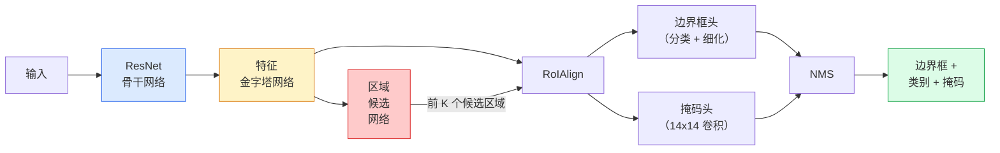

# 实例分割：Mask R-CNN（Instance Segmentation — Mask R-CNN）

> 为 Faster R-CNN 检测器增加一个小型掩码分支，就得到实例分割。难点是 RoIAlign，而且比看起来更难。

**Type:** Build + Learn
**Languages:** Python
**Prerequisites:** 阶段 4 第 06 课（YOLO），阶段 4 第 07 课（U-Net）
**Time:** ~75 分钟

## 学习目标（Learning Objectives）

- 端到端梳理 Mask R-CNN 架构：骨干、FPN、RPN、RoIAlign、边界框头和掩码头
- 从零实现 RoIAlign，解释为什么不再使用 RoIPool
- 使用 torchvision 的 `maskrcnn_resnet50_fpn_v2` 预训练模型生成生产质量的实例掩码，正确解读输出格式
- 在小型自定义数据集上，通过替换边界框头和掩码头、冻结骨干来微调 Mask R-CNN

## 问题（The Problem）

语义分割为每个类别提供一个掩码；实例分割为每个物体提供一个掩码，即使两个物体属于同一类也如此。个体计数、跨帧跟踪、物体测量，例如墙上每块砖或显微图像中每个细胞的边界框，都需要实例分割。

Mask R-CNN（He 等，2017）通过将实例分割重新表述为“检测加掩码”解决这一问题。设计非常清晰，此后五年几乎每篇实例分割论文都是 Mask R-CNN 变体；torchvision 实现至今仍是中小数据集的生产默认选择。

困难的工程问题是采样：候选框角点与像素边界不对齐时，如何从中裁出固定尺寸特征区域？处理错误会在各处损失零点几个 mAP 百分点。感兴趣区域对齐（Region of Interest Align，RoIAlign）就是答案。

## 概念（The Concept）

### 架构（The architecture）



需要理解五个部件：

1. **骨干网络（Backbone）**：ImageNet 训练的 ResNet-50 或 ResNet-101，产生步幅为 4、8、16、32 的层级特征图。
2. **特征金字塔网络（Feature Pyramid Network，FPN）**：自顶向下连接加横向连接，使每个层级都有 C 通道的丰富语义特征。检测时查询与目标尺寸匹配的 FPN 层级。
3. **区域候选网络（Region Proposal Network，RPN）**：小型卷积头，在每个锚框位置预测“这里有目标吗”和“如何细化框”。每张图像产生约 1000 个候选区域。
4. **感兴趣区域对齐（RoIAlign）**：从任意 FPN 层级上的任意框中，采样固定尺寸的特征块，例如 7x7。使用双线性采样，不量化。
5. **任务头（Heads）**：两层边界框头负责细化框并选择类别，另有小型卷积头为每个候选区域输出 `28x28` 二值掩码。

### 为什么用 RoIAlign 而非 RoIPool（Why RoIAlign, not RoIPool）

原始 Fast R-CNN 使用感兴趣区域池化（Region of Interest Pooling，RoIPool）：将候选框分成网格，每单元取最大特征，并把所有坐标取整。这种取整会使特征图与输入像素坐标错位，最多达到一个完整特征图像素；在 224x224 图像上看似很小，但特征图步幅为 32 时后果严重。

```
RoIPool:
  边界框 (34.7, 51.3, 98.2, 142.9)
  取整 -> (34, 51, 98, 142)
  划分网格 -> 对每个单元边界取整
  每一步都累积错位

RoIAlign:
  边界框 (34.7, 51.3, 98.2, 142.9)
  用双线性插值在精确浮点坐标处采样
  全程不取整
```

RoIAlign 无需额外代价，就将 COCO 掩码 AP 提高 3–4 个百分点。如今每个重视定位的检测器都使用它，YOLOv7 seg、RT-DETR、Mask2Former 也一样。

### 一段话理解 RPN（The RPN in one paragraph）

在特征图每个位置放置 K 个不同尺寸和形状的锚框。为每个锚框预测目标存在性分数与回归偏移，将它变成更贴合目标的框。按分数保留前约 1,000 个框，以 IoU 0.7 执行 NMS，将剩余框交给任务头。RPN 有自己的小型损失，结构与第 6 课 YOLO 损失相同，只是只有目标与无目标两类。

### 掩码头（The mask head）

对 RoIAlign 之后的每个候选区域，掩码头是微型全卷积网络（Fully Convolutional Network，FCN）：四个 3x3 卷积、一个 2 倍反卷积，以及最终的 1x1 卷积，在 `28x28` 分辨率下产生 `num_classes` 个输出通道。只保留预测类别对应的通道，忽略其他通道。这将掩码预测与分类解耦。

把 28x28 掩码上采样到候选区域的原始像素尺寸，得到最终二值掩码。

### 损失（Losses）

Mask R-CNN 将四项损失相加：

```
L = L_rpn_cls + L_rpn_box + L_box_cls + L_box_reg + L_mask
```

- `L_rpn_cls`、`L_rpn_box`：RPN 候选区域的目标存在性与框回归损失。
- `L_box_cls`：任务头分类器在包含背景的 (C+1) 类上计算的交叉熵。
- `L_box_reg`：任务头框细化的平滑 L1 损失。
- `L_mask`：28x28 掩码输出上的逐像素二元交叉熵。

每项损失都有默认权重，torchvision 实现将其作为构造函数参数暴露。

### 输出格式（Output format）

`torchvision.models.detection.maskrcnn_resnet50_fpn_v2` 返回字典列表，每张图像对应一个字典：

```
{
    "boxes":  (N, 4)，(x1, y1, x2, y2) 像素坐标，
    "labels": (N,) 类别 ID，0 = 背景，因此索引从 1 开始，
    "scores": (N,) 置信度分数，
    "masks":  (N, 1, H, W)，[0, 1] 内的浮点掩码，以 0.5 为阈值转为二值，
}
```

掩码已经是整幅图像的分辨率。28x28 检测头输出已在内部上采样。

```figure
cv3-roialign-sampling
```

## 动手实现（Build It）

### 第 1 步：从零实现 RoIAlign（Step 1: RoIAlign from scratch）

这是 Mask R-CNN 中看代码比看文字更容易理解的一个组件。

```python
import torch
import torch.nn.functional as F

def roi_align_single(feature, box, output_size=7, spatial_scale=1 / 16.0):
    """
    feature: (C, H, W) single-image feature map
    box: (x1, y1, x2, y2) in original image pixel coordinates
    output_size: side of the output grid (7 for box head, 14 for mask head)
    spatial_scale: reciprocal of the feature map stride
    """
    C, H, W = feature.shape
    x1, y1, x2, y2 = [c * spatial_scale - 0.5 for c in box]
    bin_w = (x2 - x1) / output_size
    bin_h = (y2 - y1) / output_size

    grid_y = torch.linspace(y1 + bin_h / 2, y2 - bin_h / 2, output_size)
    grid_x = torch.linspace(x1 + bin_w / 2, x2 - bin_w / 2, output_size)
    yy, xx = torch.meshgrid(grid_y, grid_x, indexing="ij")

    gx = 2 * (xx + 0.5) / W - 1
    gy = 2 * (yy + 0.5) / H - 1
    grid = torch.stack([gx, gy], dim=-1).unsqueeze(0)
    sampled = F.grid_sample(feature.unsqueeze(0), grid, mode="bilinear",
                            align_corners=False)
    return sampled.squeeze(0)
```

每个数值都来自双线性采样位置。不取整、不量化，也不丢失梯度。

### 第 2 步：与 torchvision 的 RoIAlign 比较（Step 2: Compare to torchvision's RoIAlign）

```python
from torchvision.ops import roi_align

feature = torch.randn(1, 16, 50, 50)
boxes = torch.tensor([[0, 10, 20, 100, 90]], dtype=torch.float32)  # (batch_idx, x1, y1, x2, y2)

ours = roi_align_single(feature[0], boxes[0, 1:].tolist(), output_size=7, spatial_scale=1/4)
theirs = roi_align(feature, boxes, output_size=(7, 7), spatial_scale=1/4, sampling_ratio=1, aligned=True)[0]

print(f"shape ours:   {tuple(ours.shape)}")
print(f"shape theirs: {tuple(theirs.shape)}")
print(f"max|diff|:    {(ours - theirs).abs().max().item():.3e}")
```

设置 `sampling_ratio=1` 和 `aligned=True` 时，两者误差在 `1e-5` 以内。

### 第 3 步：加载预训练 Mask R-CNN（Step 3: Load a pretrained Mask R-CNN）

```python
import torch
from torchvision.models.detection import maskrcnn_resnet50_fpn_v2, MaskRCNN_ResNet50_FPN_V2_Weights

model = maskrcnn_resnet50_fpn_v2(weights=MaskRCNN_ResNet50_FPN_V2_Weights.DEFAULT)
model.eval()
print(f"params: {sum(p.numel() for p in model.parameters()):,}")
print(f"classes (including background): {len(model.roi_heads.box_predictor.cls_score.out_features * [0])}")
```

4,600 万参数，91 类（COCO）。第一类 ID 0 是背景，模型实际检测的类别从 ID 1 开始。

### 第 4 步：运行推理（Step 4: Run inference）

```python
with torch.no_grad():
    x = torch.randn(3, 400, 600)
    predictions = model([x])
p = predictions[0]
print(f"boxes:  {tuple(p['boxes'].shape)}")
print(f"labels: {tuple(p['labels'].shape)}")
print(f"scores: {tuple(p['scores'].shape)}")
print(f"masks:  {tuple(p['masks'].shape)}")
```

掩码张量形状为 `(N, 1, H, W)`。以 0.5 为阈值，得到每个物体的二值掩码：

```python
binary_masks = (p['masks'] > 0.5).squeeze(1)  # (N, H, W) boolean
```

### 第 5 步：为自定义类别数替换任务头（Step 5: Swap the heads for a custom class count）

常见微调配方是复用骨干、FPN 和 RPN，替换两个分类任务头。

```python
from torchvision.models.detection.faster_rcnn import FastRCNNPredictor
from torchvision.models.detection.mask_rcnn import MaskRCNNPredictor

def build_custom_maskrcnn(num_classes):
    model = maskrcnn_resnet50_fpn_v2(weights=MaskRCNN_ResNet50_FPN_V2_Weights.DEFAULT)
    in_features = model.roi_heads.box_predictor.cls_score.in_features
    model.roi_heads.box_predictor = FastRCNNPredictor(in_features, num_classes)
    in_features_mask = model.roi_heads.mask_predictor.conv5_mask.in_channels
    hidden_layer = 256
    model.roi_heads.mask_predictor = MaskRCNNPredictor(in_features_mask, hidden_layer, num_classes)
    return model

custom = build_custom_maskrcnn(num_classes=5)
print(f"custom cls_score.out_features: {custom.roi_heads.box_predictor.cls_score.out_features}")
```

`num_classes` 必须包含背景类，因此有 4 个物体类别的数据集使用 `num_classes=5`。

### 第 6 步：冻结不需要训练的部分（Step 6: Freeze what does not need training）

小数据集上冻结骨干和 FPN，只学习 RPN 目标存在性与回归，以及两个任务头。

```python
def freeze_backbone_and_fpn(model):
    # torchvision Mask R-CNN packs the FPN inside `model.backbone` (as
    # `model.backbone.fpn`), so iterating `model.backbone.parameters()` covers
    # both the ResNet feature layers and the FPN lateral/output convs.
    for p in model.backbone.parameters():
        p.requires_grad = False
    return model

custom = freeze_backbone_and_fpn(custom)
trainable = sum(p.numel() for p in custom.parameters() if p.requires_grad)
print(f"trainable after freeze: {trainable:,}")
```

在只有 500 张图像的数据集上，这决定了模型是正常收敛还是过拟合。

## 实际应用（Use It）

torchvision 中 Mask R-CNN 的完整训练循环为 40 行，不同任务间基本不变，换数据集即可使用。

```python
def train_step(model, images, targets, optimizer):
    model.train()
    loss_dict = model(images, targets)
    losses = sum(loss for loss in loss_dict.values())
    optimizer.zero_grad()
    losses.backward()
    optimizer.step()
    return {k: v.item() for k, v in loss_dict.items()}
```

`targets` 列表必须包含逐图像字典，带有 `boxes`、`labels` 和 `masks`，其中掩码为 `(num_instances, H, W)` 二值张量。模型根据 `model.training`，训练时返回四项损失的字典，评估时返回预测列表。

`pycocotools` 评估器同时输出框和掩码的 mAP@IoU=0.5:0.95；必须看两个数值，才能知道瓶颈在边界框头还是掩码头。

## 交付成果（Ship It）

本课产出：

- `outputs/prompt-instance-vs-semantic-router.md`：提出三个问题，选择实例、语义或全景分割，并给出具体起始模型的提示词。
- `outputs/skill-mask-rcnn-head-swapper.md`：给定新的 `num_classes`，为任意 torchvision 检测模型生成十行任务头替换代码的技能。

## 练习（Exercises）

1. **（简单）** 在 100 个随机框上，将你的 RoIAlign 与 `torchvision.ops.roi_align` 比较，报告最大绝对差。再运行 RoIPool，即 2017 年以前的行为，展示靠近边界的框会产生约 1–2 个特征图像素的偏差。
2. **（中等）** 在包含 50 张图像的自定义数据集上微调 `maskrcnn_resnet50_fpn_v2`，任选两类，例如气球、鱼、路面坑洞、标志。冻结骨干，训练 20 个轮次，报告掩码 AP@0.5。
3. **（困难）** 将 Mask R-CNN 掩码头从 28x28 改为 56x56 预测。测量改动前后的 mAP@IoU=0.75，解释收益或没有收益的原因如何符合预期的边界精度与内存取舍。

## 关键术语（Key Terms）

| 术语 | 常见说法 | 实际含义 |
|------|----------------|----------------------|
| Mask R-CNN | “检测加掩码” | Faster R-CNN 加小型 FCN 头，为每个候选区域的每一类预测 28x28 掩码 |
| 特征金字塔网络（FPN） | “特征金字塔” | 自顶向下与横向连接，使每个步幅层级都有 C 通道的丰富语义特征 |
| 区域候选网络（RPN） | “区域提议器” | 每张图像产生约 1000 个目标/无目标候选区域的小型卷积头 |
| 感兴趣区域对齐（RoIAlign） | “不取整的裁剪” | 从任意浮点坐标框中双线性采样固定尺寸的特征网格 |
| 感兴趣区域池化（RoIPool） | “2017 年前的裁剪” | 与 RoIAlign 目的相同，但对框坐标取整，已过时 |
| 掩码平均精度（Mask AP） | “实例 mAP” | 用掩码 IoU 而非框 IoU 计算平均精度，是 COCO 实例分割指标 |
| 二值掩码头（Binary mask head） | “逐类别掩码” | 为每个候选区域的每一类预测二值掩码，只保留预测类别通道 |
| 背景类（Background class） | “类别 0” | 统一表示“无目标”的类别，真实类别索引从 1 开始 |

## 延伸阅读（Further Reading）

- [Mask R-CNN（He 等，2017）](https://arxiv.org/abs/1703.06870)：原始论文，第 3 节 RoIAlign 是重点
- [FPN：特征金字塔网络（Lin 等，2017）](https://arxiv.org/abs/1612.03144)：FPN 论文，现代检测器都使用它
- [torchvision Mask R-CNN 教程](https://pytorch.org/tutorials/intermediate/torchvision_tutorial.html)：微调循环参考
- [Detectron2 模型库](https://github.com/facebookresearch/detectron2/blob/main/MODEL_ZOO.md)：几乎所有检测与分割变体的生产实现及训练权重
