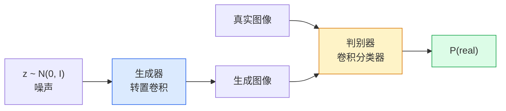
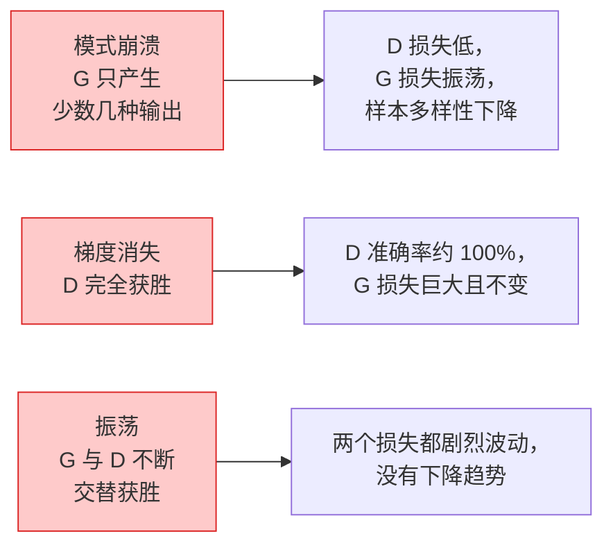

# 图像生成：生成对抗网络（Image Generation — GANs）

> GAN 是按固定规则博弈的两个神经网络。一个绘图，一个评判，二者共同进步，直到图像能骗过评判者。

**Type:** Build
**Languages:** Python
**Prerequisites:** 阶段 4 第 03 课（卷积神经网络），阶段 3 第 06 课（优化器），阶段 3 第 07 课（正则化）
**Time:** ~75 分钟

## 学习目标（Learning Objectives）

- 解释生成器与判别器之间的极小极大博弈，以及为何均衡对应 p_model = p_data
- 用不到 60 行 PyTorch 实现 DCGAN，生成结构连贯的 32x32 合成图像
- 使用三种标准技巧稳定 GAN 训练：非饱和损失、谱归一化和双时间尺度更新规则
- 阅读训练曲线，区分正常收敛、模式崩溃、振荡与判别器完全获胜

## 问题（The Problem）

分类教网络将图像映射为标签，生成则反过来：采样看起来来自相同分布的新图像。没有可供逐项比较的“正确”输出，只有想要模仿的分布。

标准损失函数，例如 MSE 和交叉熵，无法衡量“这个样本是否来自真实分布”。最小化逐像素误差得到的是模糊平均图像，而非逼真样本。突破在于学习损失：训练第二个网络分辨真假，用它的判断推动生成器。

生成对抗网络（Generative Adversarial Networks，GANs；Goodfellow 等，2014）确立了这一框架。到 2018 年，StyleGAN 已能生成与照片难以区分的 1024x1024 人脸。后来扩散模型在质量与可控性上领先，但让扩散可用的各种技巧，如归一化选择、潜在空间和特征损失，最早都是在 GAN 上被理解的。

## 概念（The Concept）

### 两个网络（The two networks）



**生成器（Generator）** G 接收噪声向量 `z` 并输出图像。**判别器（Discriminator）** D 接收图像，输出单个标量，表示图像为真的概率。

### 博弈（The game）

G 希望 D 判断错误，D 希望自己正确。形式化表示：

```
min_G max_D  E_x[log D(x)] + E_z[log(1 - D(G(z)))]
```

从右向左读：D 最大化对真实图像（`log D(real)`）和假图像（`log (1 - D(fake))`）的判断准确性。G 最小化 D 对假图像的准确性，希望 `D(G(z))` 越高越好。

Goodfellow 证明，这个极小极大问题有一个全局均衡：`p_G = p_data`，D 在所有位置输出 0.5，生成分布与真实分布的 Jensen-Shannon 散度为零。难点是到达那里。

### 非饱和损失（Non-saturating loss）

上面的形式在数值上不稳定。训练早期，每个假样本的 `D(G(z))` 都接近零，因此 `log(1 - D(G(z)))` 对 G 的梯度会消失。修复方法是反转 G 的损失。

```
L_D = -E_x[log D(x)] - E_z[log(1 - D(G(z)))]
L_G = -E_z[log D(G(z))]                          # 非饱和
```

现在，当 `D(G(z))` 接近零时，G 的损失很大，梯度仍有信息。现代 GAN 都使用这一变体训练。

### DCGAN 架构规则（DCGAN architecture rules）

Radford、Metz、Chintala（2015）将多年失败实验归纳为五条稳定 GAN 训练的规则：

1. 两个网络都用带步幅卷积替代池化。
2. 生成器与判别器都使用批归一化，但 G 输出层和 D 输入层除外。
3. 更深架构中移除全连接层。
4. G 除输出层外全部使用 ReLU；输出层用 tanh，使输出位于 [-1, 1]。
5. D 所有层使用 LeakyReLU（negative_slope=0.2）。

现代基于卷积的 GAN，如 StyleGAN、BigGAN、GigaGAN，仍以这些规则为起点，逐个替换组件。

### 失败模式及其特征（Failure modes and their signatures）



- **模式崩溃（Mode collapse）**：G 找到一张能骗过 D 的图像，此后只生成它。修复：加入小批次判别、谱归一化或标签条件。
- **判别器获胜（Discriminator wins）**：D 过快变得太强，G 的梯度消失。修复：缩小 D、降低 D 学习率，或对真实标签使用标签平滑。
- **振荡（Oscillation）**：两个网络轮流获胜，却始终不接近均衡。修复：双时间尺度更新规则（Two-Timescale Update Rule，TTUR），使 D 学习速度为 G 的 2–4 倍，或改用 Wasserstein 损失。

### 评估（Evaluation）

GAN 没有真实目标，如何知道它是否有效？

- **样本检查（Sample inspection）**：每个轮次结束时直接查看 64 个样本，这是必须做的。
- **弗雷歇 Inception 距离（Fréchet Inception Distance，FID）**：真实与生成样本集的 Inception-v3 特征分布之间的距离，越低越好，是社区标准。
- **Inception 分数（Inception Score）**：更旧、更脆弱，优先使用 FID。
- **生成模型精确率/召回率（Precision/Recall for generative models）**：分别衡量质量与覆盖范围，比只看 FID 信息更多。

小型合成数据实验中，检查样本就足够。

```figure
cv-gan-image
```

## 动手实现（Build It）

### 第 1 步：生成器（Step 1: Generator）

小型深度卷积生成对抗网络（Deep Convolutional GAN，DCGAN）生成器，接收 64 维噪声，产生 32x32 图像。

```python
import torch
import torch.nn as nn

class Generator(nn.Module):
    def __init__(self, z_dim=64, img_channels=3, feat=64):
        super().__init__()
        self.net = nn.Sequential(
            nn.ConvTranspose2d(z_dim, feat * 4, kernel_size=4, stride=1, padding=0, bias=False),
            nn.BatchNorm2d(feat * 4),
            nn.ReLU(inplace=True),
            nn.ConvTranspose2d(feat * 4, feat * 2, kernel_size=4, stride=2, padding=1, bias=False),
            nn.BatchNorm2d(feat * 2),
            nn.ReLU(inplace=True),
            nn.ConvTranspose2d(feat * 2, feat, kernel_size=4, stride=2, padding=1, bias=False),
            nn.BatchNorm2d(feat),
            nn.ReLU(inplace=True),
            nn.ConvTranspose2d(feat, img_channels, kernel_size=4, stride=2, padding=1, bias=False),
            nn.Tanh(),
        )

    def forward(self, z):
        return self.net(z.view(z.size(0), -1, 1, 1))
```

四个转置卷积，各自使用 `kernel_size=4, stride=2, padding=1`，使空间尺寸恰好翻倍。tanh 将输出激活限制在 [-1, 1]。

### 第 2 步：判别器（Step 2: Discriminator）

生成器的镜像：LeakyReLU、带步幅卷积，最后输出标量逻辑值。

```python
class Discriminator(nn.Module):
    def __init__(self, img_channels=3, feat=64):
        super().__init__()
        self.net = nn.Sequential(
            nn.Conv2d(img_channels, feat, kernel_size=4, stride=2, padding=1),
            nn.LeakyReLU(0.2, inplace=True),
            nn.Conv2d(feat, feat * 2, kernel_size=4, stride=2, padding=1, bias=False),
            nn.BatchNorm2d(feat * 2),
            nn.LeakyReLU(0.2, inplace=True),
            nn.Conv2d(feat * 2, feat * 4, kernel_size=4, stride=2, padding=1, bias=False),
            nn.BatchNorm2d(feat * 4),
            nn.LeakyReLU(0.2, inplace=True),
            nn.Conv2d(feat * 4, 1, kernel_size=4, stride=1, padding=0),
        )

    def forward(self, x):
        return self.net(x).view(-1)
```

最后一个卷积将 `4x4` 特征图缩为 `1x1`。每张图像输出一个标量，仅在计算损失时应用 sigmoid。

### 第 3 步：训练步骤（Step 3: Training step）

每个批次交替更新：先更新 D 一次，再更新 G 一次。

```python
import torch.nn.functional as F

def train_step(G, D, real, z, opt_g, opt_d, device):
    real = real.to(device)
    bs = real.size(0)

    # D step
    opt_d.zero_grad()
    d_real = D(real)
    d_fake = D(G(z).detach())
    loss_d = (F.binary_cross_entropy_with_logits(d_real, torch.ones_like(d_real))
              + F.binary_cross_entropy_with_logits(d_fake, torch.zeros_like(d_fake)))
    loss_d.backward()
    opt_d.step()

    # G step
    opt_g.zero_grad()
    d_fake = D(G(z))
    loss_g = F.binary_cross_entropy_with_logits(d_fake, torch.ones_like(d_fake))
    loss_g.backward()
    opt_g.step()

    return loss_d.item(), loss_g.item()
```

D 步骤中的 `G(z).detach()` 至关重要：更新 D 时不希望梯度流入 G。忘记这一点是经典的新手错误。

### 第 4 步：合成图形上的完整训练循环（Step 4: Full training loop on synthetic shapes）

```python
from torch.utils.data import DataLoader, TensorDataset
import numpy as np

def synthetic_images(num=2000, size=32, seed=0):
    rng = np.random.default_rng(seed)
    imgs = np.zeros((num, 3, size, size), dtype=np.float32) - 1.0
    for i in range(num):
        r = rng.uniform(6, 12)
        cx, cy = rng.uniform(r, size - r, size=2)
        yy, xx = np.meshgrid(np.arange(size), np.arange(size), indexing="ij")
        mask = (xx - cx) ** 2 + (yy - cy) ** 2 < r ** 2
        color = rng.uniform(-0.5, 1.0, size=3)
        for c in range(3):
            imgs[i, c][mask] = color[c]
    return torch.from_numpy(imgs)

device = "cuda" if torch.cuda.is_available() else "cpu"
data = synthetic_images()
loader = DataLoader(TensorDataset(data), batch_size=64, shuffle=True)

G = Generator(z_dim=64, img_channels=3, feat=32).to(device)
D = Discriminator(img_channels=3, feat=32).to(device)
opt_g = torch.optim.Adam(G.parameters(), lr=2e-4, betas=(0.5, 0.999))
opt_d = torch.optim.Adam(D.parameters(), lr=2e-4, betas=(0.5, 0.999))

for epoch in range(10):
    for (batch,) in loader:
        z = torch.randn(batch.size(0), 64, device=device)
        ld, lg = train_step(G, D, batch, z, opt_g, opt_d, device)
    print(f"epoch {epoch}  D {ld:.3f}  G {lg:.3f}")
```

`Adam(lr=2e-4, betas=(0.5, 0.999))` 是 DCGAN 默认设置。较低 beta1 防止动量项让对抗博弈中的更新方向保持过久。

### 第 5 步：采样（Step 5: Sampling）

```python
@torch.no_grad()
def sample(G, n=16, z_dim=64, device="cpu"):
    G.eval()
    z = torch.randn(n, z_dim, device=device)
    imgs = G(z)
    imgs = (imgs + 1) / 2
    return imgs.clamp(0, 1)
```

采样前始终切换到评估模式。对 DCGAN 很重要，因为此时使用批归一化运行统计量，而非当前批次统计量。

### 第 6 步：谱归一化（Step 6: Spectral normalisation）

可直接替换判别器中 BN 的方法，保证网络满足 1-Lipschitz 条件，解决多数“D 赢得太彻底”的失败。

```python
from torch.nn.utils import spectral_norm

def build_sn_discriminator(img_channels=3, feat=64):
    return nn.Sequential(
        spectral_norm(nn.Conv2d(img_channels, feat, 4, 2, 1)),
        nn.LeakyReLU(0.2, inplace=True),
        spectral_norm(nn.Conv2d(feat, feat * 2, 4, 2, 1)),
        nn.LeakyReLU(0.2, inplace=True),
        spectral_norm(nn.Conv2d(feat * 2, feat * 4, 4, 2, 1)),
        nn.LeakyReLU(0.2, inplace=True),
        spectral_norm(nn.Conv2d(feat * 4, 1, 4, 1, 0)),
    )
```

用 `build_sn_discriminator()` 替换 `Discriminator` 后，往往不再需要 TTUR。谱归一化是最容易应用的单项鲁棒性改进。

## 实际应用（Use It）

严肃的生成任务应使用预训练权重，或改用扩散模型。两个标准库：

- `torch_fidelity` 为生成器计算 FID / IS，无需自写评估代码。
- `pytorch-gan-zoo`（旧版）与 `StudioGAN` 提供经过测试的 DCGAN、WGAN-GP、SN-GAN、StyleGAN 和 BigGAN 实现。

2026 年，GAN 仍是实时图像生成（延迟 <10 ms）、风格迁移，以及精确控制的图像到图像转换（Pix2Pix、CycleGAN）的最佳选择。扩散模型在照片真实感与文本条件生成上占优。

## 交付成果（Ship It）

本课产出：

- `outputs/prompt-gan-training-triage.md`：阅读训练曲线描述，选择模式崩溃、D 获胜或振荡等失败模式，并给出单项修复建议的提示词。
- `outputs/skill-dcgan-scaffold.md`：根据 `z_dim`、目标 `image_size` 和 `num_channels` 编写 DCGAN 项目骨架，包含训练循环与样本保存器的技能。

## 练习（Exercises）

1. **（简单）** 在合成圆形数据集上训练上述 DCGAN，每个轮次结束时保存包含 16 个样本的网格。从哪个轮次开始，生成的圆形明显具有圆形轮廓？
2. **（中等）** 将判别器批归一化替换为谱归一化，并行比较两种版本。哪个收敛更快？哪个在三个随机种子下方差更低？
3. **（困难）** 实现条件 DCGAN：将类别标签同时输入 G 和 D，在 G 中将独热标签与噪声拼接，在 D 中拼接类别嵌入通道。在第 7 课的合成“圆形与正方形”数据集上训练，通过指定标签采样，证明类别条件有效。

## 关键术语（Key Terms）

| 术语 | 常见说法 | 实际含义 |
|------|----------------|----------------------|
| 生成器（Generator，G） | “绘图网络” | 将噪声映射为图像，训练目标是骗过判别器 |
| 判别器（Discriminator，D） | “评判者” | 二分类器，训练目标是区分真实与生成图像 |
| 极小极大（Minimax） | “博弈” | 对对抗损失关于 G 取最小、关于 D 取最大，均衡为 p_G = p_data |
| 非饱和损失（Non-saturating loss） | “数值合理的版本” | G 损失为 -log(D(G(z)))，而非 log(1 - D(G(z)))，避免训练早期梯度消失 |
| 模式崩溃（Mode collapse） | “生成器只造一种东西” | G 仅产生数据分布的一小部分，使用谱归一化、小批次判别或更大批次修复 |
| 双时间尺度更新规则（TTUR） | “两种学习率” | D 学得比 G 快，通常为 2–4 倍，从而稳定训练 |
| 谱归一化（Spectral norm） | “1-Lipschitz 层” | 为每层 Lipschitz 常数设上界的权重归一化，防止 D 变得任意陡峭 |
| 弗雷歇 Inception 距离（FID） | “Fréchet Inception 距离” | 真实与生成样本集的 Inception-v3 特征分布距离，是标准评估指标 |

## 延伸阅读（Further Reading）

- [生成对抗网络（Goodfellow 等，2014）](https://arxiv.org/abs/1406.2661)：开创这一领域的论文
- [DCGAN（Radford、Metz、Chintala，2015）](https://arxiv.org/abs/1511.06434)：使 GAN 可以训练的架构规则
- [GAN 谱归一化（Miyato 等，2018）](https://arxiv.org/abs/1802.05957)：最有用的单项稳定训练技巧
- [StyleGAN3（Karras 等，2021）](https://arxiv.org/abs/2106.12423)：最佳水平 GAN，读起来像过去十年各种技巧的精选集
