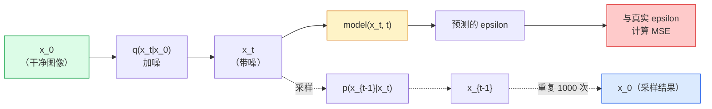

# 图像生成：扩散模型（Image Generation — Diffusion Models）

> 扩散模型学习去噪。训练它从带噪图像中去除少量噪声，再反向重复一千次，就得到图像生成器。

**Type:** Build
**Languages:** Python
**Prerequisites:** 阶段 4 第 07 课（U-Net），阶段 1 第 06 课（概率），阶段 3 第 06 课（优化器）
**Time:** ~75 分钟

## 学习目标（Learning Objectives）

- 推导前向加噪过程 `x_0 -> x_1 -> ... -> x_T`，解释闭式表达 `q(x_t | x_0)` 为何对任意 t 成立
- 实现 DDPM 风格训练目标，回归每步加入的噪声，并实现从纯噪声逐步返回图像的采样器
- 构建带时间条件的 U-Net，足够小以便在 CPU 上训练，能预测任意时间步的噪声
- 解释 DDPM 与 DDIM 采样的区别和适用场景，第 23 课将深入介绍流匹配与整流流

## 问题（The Problem）

GAN 一次生成：输入噪声，输出图像，只需一次前向传播。它速度快，但难训练。扩散模型迭代生成：从纯噪声开始，小步去噪，图像逐渐出现。它速度慢，但易训练。过去五年，易训练占据上风：任何小团队都能训练扩散模型并得到合理样本，而 GAN 训练是要经历多年失败才能掌握的技艺。

除训练稳定性外，扩散的迭代结构还使现代图像生成的各种能力成为可能：文本条件、图像修补、编辑、超分辨率和可控风格。采样循环每一步都能注入新约束。这一介入点解释了为什么 Stable Diffusion、Imagen、DALL-E 3、Midjourney，以及你将使用的各种可控图像模型，都基于扩散。

本课构建最小去噪扩散概率模型（Denoising Diffusion Probabilistic Model，DDPM）：前向加噪、反向去噪和训练循环。下一课 Stable Diffusion 将它与变分自编码器（Variational Autoencoder，VAE）、文本编码器和无分类器引导连接成生产系统。

## 概念（The Concept）

### 前向过程（The forward process）

取图像 `x_0`，加入少量高斯噪声得到 `x_1`，再加一点得到 `x_2`。持续 T 步，直到 `x_T` 几乎无法与纯高斯噪声区分。

```
q(x_t | x_{t-1}) = N(x_t; sqrt(1 - beta_t) * x_{t-1},  beta_t * I)
```

`beta_t` 是一组较小方差的调度，通常在 T=1000 步内从 0.0001 线性增加到 0.02。每一步略微缩短信号，并注入新噪声。

### 闭式跳转（The closed-form jump）

逐步加噪形成马尔可夫链（Markov chain），但数学上可以合并：只需一步就能直接从 `x_0` 采样 `x_t`。

```
定义 alpha_t = 1 - beta_t
定义 alpha_bar_t = prod_{s=1..t} alpha_s

则：
  q(x_t | x_0) = N(x_t; sqrt(alpha_bar_t) * x_0,  (1 - alpha_bar_t) * I)

等价地：
  x_t = sqrt(alpha_bar_t) * x_0 + sqrt(1 - alpha_bar_t) * epsilon
  其中 epsilon ~ N(0, I)
```

这个方程正是扩散能实际使用的原因。训练时随机选择 `t`，直接从 `x_0` 采样 `x_t`，一步完成训练，无需模拟整条马尔可夫链。

### 反向过程（The reverse process）

前向过程固定，神经网络学习的是反向过程 `p(x_{t-1} | x_t)`。扩散模型不直接预测 `x_{t-1}`，而预测第 t 步加入的噪声 `epsilon`，再通过数学公式由它推导 `x_{t-1}`。



### 训练损失（The training loss）

每个训练步骤：

1. 采样真实图像 `x_0`。
2. 从 [1, T] 均匀采样时间步 `t`。
3. 采样噪声 `epsilon ~ N(0, I)`。
4. 计算 `x_t = sqrt(alpha_bar_t) * x_0 + sqrt(1 - alpha_bar_t) * epsilon`。
5. 用网络预测 `epsilon_theta(x_t, t)`。
6. 最小化 `|| epsilon - epsilon_theta(x_t, t) ||^2`。

仅此而已。神经网络学会预测任意时间步的噪声，损失是均方误差（MSE），没有对抗博弈、崩溃或振荡。

### DDPM 采样器（The sampler, DDPM）

生成时，从 `x_T ~ N(0, I)` 出发，逐步反向前进。

```
for t = T, T-1, ..., 1:
    eps = model(x_t, t)
    x_{t-1} = (1 / sqrt(alpha_t)) * (x_t - (beta_t / sqrt(1 - alpha_bar_t)) * eps) + sqrt(beta_t) * z
    where z ~ N(0, I) if t > 1, else 0
return x_0
```

关键在于：一般情况下反向条件分布没有已知闭式形式，但对这个特定高斯前向过程则有。看起来复杂的系数来自贝叶斯法则。

### 为什么是 1000 步（Why 1000 steps）

前向噪声调度让每步加入的噪声恰好足够少，使反向步骤近似高斯。步数太少，反向步骤远离高斯，网络难以建模；步数太多，采样昂贵且收益递减。T=1000 配线性调度是 DDPM 默认设置。

### DDIM：采样加速 20 倍（DDIM: 20x faster sampling）

训练相同，采样改变。去噪扩散隐式模型（Denoising Diffusion Implicit Model，DDIM；Song 等，2020）定义了确定性反向过程，无需重训即可跳过时间步。DDIM 的 50 步采样接近 DDPM 的 1000 步质量。生产系统都使用 DDIM 或更快的变体，例如 DPM-Solver、Euler 祖先采样。

### 时间条件（Time conditioning）

网络 `epsilon_theta(x_t, t)` 需要知道正在为哪个时间步去噪。现代扩散模型通过正弦时间嵌入注入 `t`，思想与 Transformer 位置编码相同，将其加到 U-Net 每个层级的特征图中。

```
t_embedding = sinusoidal(t)
feature_map += MLP(t_embedding)
```

没有时间条件，网络必须从图像本身猜噪声水平，虽然可行，但样本效率低得多。

```figure
cv-diffusion-image
```

## 动手实现（Build It）

### 第 1 步：噪声调度（Step 1: Noise schedule）

```python
import torch

def linear_beta_schedule(T=1000, beta_start=1e-4, beta_end=2e-2):
    return torch.linspace(beta_start, beta_end, T)


def precompute_schedule(betas):
    alphas = 1.0 - betas
    alphas_cumprod = torch.cumprod(alphas, dim=0)
    return {
        "betas": betas,
        "alphas": alphas,
        "alphas_cumprod": alphas_cumprod,
        "sqrt_alphas_cumprod": torch.sqrt(alphas_cumprod),
        "sqrt_one_minus_alphas_cumprod": torch.sqrt(1.0 - alphas_cumprod),
        "sqrt_recip_alphas": torch.sqrt(1.0 / alphas),
    }

schedule = precompute_schedule(linear_beta_schedule(T=1000))
```

预计算一次，训练与采样时按索引提取。

### 第 2 步：前向扩散（Step 2: Forward diffusion, q_sample）

```python
def q_sample(x0, t, noise, schedule):
    sqrt_a = schedule["sqrt_alphas_cumprod"][t].view(-1, 1, 1, 1)
    sqrt_one_minus_a = schedule["sqrt_one_minus_alphas_cumprod"][t].view(-1, 1, 1, 1)
    return sqrt_a * x0 + sqrt_one_minus_a * noise
```

一行闭式表达。`t` 是一批时间步，与批次中每张图像一一对应。

### 第 3 步：带时间条件的微型 U-Net（Step 3: A tiny time-conditioned U-Net）

```python
import torch.nn as nn
import torch.nn.functional as F
import math

def timestep_embedding(t, dim=64):
    half = dim // 2
    freqs = torch.exp(-math.log(10000) * torch.arange(half, device=t.device) / half)
    args = t[:, None].float() * freqs[None]
    emb = torch.cat([args.sin(), args.cos()], dim=-1)
    return emb


class TinyUNet(nn.Module):
    def __init__(self, img_channels=3, base=32, t_dim=64):
        super().__init__()
        self.t_mlp = nn.Sequential(
            nn.Linear(t_dim, base * 4),
            nn.SiLU(),
            nn.Linear(base * 4, base * 4),
        )
        self.t_dim = t_dim
        self.enc1 = nn.Conv2d(img_channels, base, 3, padding=1)
        self.enc2 = nn.Conv2d(base, base * 2, 4, stride=2, padding=1)
        self.mid = nn.Conv2d(base * 2, base * 2, 3, padding=1)
        self.dec1 = nn.ConvTranspose2d(base * 2, base, 4, stride=2, padding=1)
        self.dec2 = nn.Conv2d(base * 2, img_channels, 3, padding=1)
        self.time_proj = nn.Linear(base * 4, base * 2)

    def forward(self, x, t):
        t_emb = timestep_embedding(t, self.t_dim)
        t_emb = self.t_mlp(t_emb)
        t_proj = self.time_proj(t_emb)[:, :, None, None]

        h1 = F.silu(self.enc1(x))
        h2 = F.silu(self.enc2(h1)) + t_proj
        h3 = F.silu(self.mid(h2))
        d1 = F.silu(self.dec1(h3))
        d2 = torch.cat([d1, h1], dim=1)
        return self.dec2(d2)
```

两层级 U-Net，在瓶颈处注入时间条件。处理真实图像时增加深度与宽度。

### 第 4 步：训练循环（Step 4: Training loop）

```python
def train_step(model, x0, schedule, optimizer, device, T=1000):
    model.train()
    x0 = x0.to(device)
    bs = x0.size(0)
    t = torch.randint(0, T, (bs,), device=device)
    noise = torch.randn_like(x0)
    x_t = q_sample(x0, t, noise, schedule)
    pred = model(x_t, t)
    loss = F.mse_loss(pred, noise)
    optimizer.zero_grad()
    loss.backward()
    optimizer.step()
    return loss.item()
```

这就是完整训练循环：没有 GAN 博弈，没有专用损失，只调用一次 MSE。

### 第 5 步：DDPM 采样器（Step 5: Sampler, DDPM）

```python
@torch.no_grad()
def sample(model, schedule, shape, T=1000, device="cpu"):
    model.eval()
    x = torch.randn(shape, device=device)
    betas = schedule["betas"].to(device)
    sqrt_one_minus_a = schedule["sqrt_one_minus_alphas_cumprod"].to(device)
    sqrt_recip_alphas = schedule["sqrt_recip_alphas"].to(device)

    for t in reversed(range(T)):
        t_batch = torch.full((shape[0],), t, dtype=torch.long, device=device)
        eps = model(x, t_batch)
        coef = betas[t] / sqrt_one_minus_a[t]
        mean = sqrt_recip_alphas[t] * (x - coef * eps)
        if t > 0:
            x = mean + torch.sqrt(betas[t]) * torch.randn_like(x)
        else:
            x = mean
    return x
```

1000 次前向传播生成一批样本。实际代码中应换为 DDIM 50 步采样器。

### 第 6 步：DDIM 采样器，确定性且约快 20 倍（Step 6: DDIM sampler, deterministic, ~20x faster）

```python
@torch.no_grad()
def sample_ddim(model, schedule, shape, steps=50, T=1000, device="cpu", eta=0.0):
    model.eval()
    x = torch.randn(shape, device=device)
    alphas_cumprod = schedule["alphas_cumprod"].to(device)

    ts = torch.linspace(T - 1, 0, steps + 1).long()
    for i in range(steps):
        t = ts[i]
        t_prev = ts[i + 1]
        t_batch = torch.full((shape[0],), t, dtype=torch.long, device=device)
        eps = model(x, t_batch)
        a_t = alphas_cumprod[t]
        a_prev = alphas_cumprod[t_prev] if t_prev >= 0 else torch.tensor(1.0, device=device)
        x0_pred = (x - torch.sqrt(1 - a_t) * eps) / torch.sqrt(a_t)
        sigma = eta * torch.sqrt((1 - a_prev) / (1 - a_t) * (1 - a_t / a_prev))
        dir_xt = torch.sqrt(1 - a_prev - sigma ** 2) * eps
        noise = sigma * torch.randn_like(x) if eta > 0 else 0
        x = torch.sqrt(a_prev) * x0_pred + dir_xt + noise
    return x
```

`eta=0` 完全确定，相同噪声输入始终产生相同输出。`eta=1` 则恢复 DDPM。

## 实际应用（Use It）

生产工作使用 `diffusers`：

```python
from diffusers import DDPMScheduler, UNet2DModel

unet = UNet2DModel(sample_size=32, in_channels=3, out_channels=3, layers_per_block=2)
scheduler = DDPMScheduler(num_train_timesteps=1000)
```

该库提供现成调度器（DDPM、DDIM、DPM-Solver、Euler、Heun）、可配置 U-Net、文生图和图生图流水线，以及低秩适配（Low-Rank Adaptation，LoRA）微调辅助工具。

研究中，Katherine Crowson 的 `k-diffusion` 提供最忠实的参考实现和最好的采样变体。

## 交付成果（Ship It）

本课产出：

- `outputs/prompt-diffusion-sampler-picker.md`：根据质量目标、延迟预算与条件类型选择 DDPM / DDIM / DPM-Solver / Euler 的提示词。
- `outputs/skill-noise-schedule-designer.md`：给定 T 与目标破坏程度，生成线性、余弦或 sigmoid beta 调度，以及信噪比随时间变化诊断图的技能。

## 练习（Exercises）

1. **（简单）** 可视化前向过程：取一张图像，绘制 `t in [0, 100, 250, 500, 750, 1000]` 时的 `x_t`，验证 `x_1000` 看起来像纯高斯噪声。
2. **（中等）** 在合成圆形数据集上训练 TinyUNet 20 个轮次，采样 16 个圆形。比较 DDPM（1000 步）与 DDIM（50 步）：从同一噪声种子出发，是否产生相似图像？
3. **（困难）** 实现余弦噪声调度（Nichol 与 Dhariwal，2021）：`alpha_bar_t = cos^2((t/T + s) / (1 + s) * pi / 2)`。用线性和余弦调度训练同一模型，证明低步数时余弦得到更好样本。

## 关键术语（Key Terms）

| 术语 | 常见说法 | 实际含义 |
|------|----------------|----------------------|
| 前向过程（Forward process） | “逐步加噪” | 在 T 步内将图像破坏成高斯噪声的固定马尔可夫链 |
| 反向过程（Reverse process） | “逐步去噪” | 从噪声逐步回到图像的学习分布 |
| 噪声预测（Epsilon prediction） | “预测噪声” | 训练目标：`epsilon_theta(x_t, t)` 预测第 t 步加入的噪声 |
| Beta 调度（Beta schedule） | “噪声量” | T 个小方差组成的序列，定义每步加入多少噪声 |
| alpha_bar_t | “累计保留因子” | 到时间 t 为止 (1 - beta_s) 的乘积，t 越大，剩余信号越少 |
| DDPM 采样器（DDPM sampler） | “祖先采样、随机” | 从条件高斯分布采样每个 x_{t-1}，共 1000 步 |
| DDIM 采样器（DDIM sampler） | “确定、快速” | 将采样改写为确定性常微分方程（ODE），20–100 步即可获得相近质量 |
| 时间条件（Time conditioning） | “告诉模型哪个 t” | 将 t 的正弦嵌入注入 U-Net，让它知道噪声水平 |

## 延伸阅读（Further Reading）

- [去噪扩散概率模型（Ho 等，2020）](https://arxiv.org/abs/2006.11239)：使扩散可用并在 FID 上击败 GAN 的论文
- [改进 DDPM（Nichol 与 Dhariwal，2021）](https://arxiv.org/abs/2102.09672)：余弦调度与 v 参数化
- [DDIM（Song、Meng、Ermon，2020）](https://arxiv.org/abs/2010.02502)：使实时推理成为可能的确定性采样器
- [阐明扩散模型的设计空间（Karras 等，2022）](https://arxiv.org/abs/2206.00364)：统一审视各种扩散设计选择，是当前最佳参考
