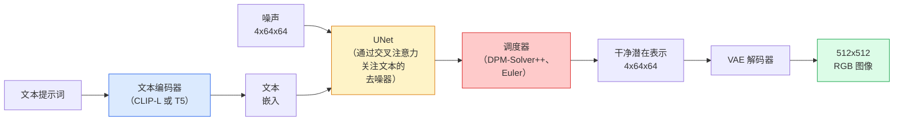

# Stable Diffusion：架构与微调（Stable Diffusion — Architecture & Fine-Tuning）

> Stable Diffusion 在预训练 VAE 的潜在空间运行 DDPM，通过交叉注意力接收文本条件，用快速确定性常微分方程求解器采样，并由无分类器引导控制。

**Type:** Learn + Use
**Languages:** Python
**Prerequisites:** 阶段 4 第 10 课（扩散），阶段 7 第 02 课（自注意力）
**Time:** ~75 分钟

## 学习目标（Learning Objectives）

- 梳理 Stable Diffusion 流水线的五个部件：VAE、文本编码器、U-Net、调度器、安全检查器，以及各自实际作用
- 解释潜在扩散，以及为何在 4x64x64 潜在空间而非 3x512x512 图像上训练，可减少 48 倍计算而不损失质量
- 使用 `diffusers` 生成图像，执行图生图、图像修补和 ControlNet 引导生成
- 在小型自定义数据集上用 LoRA 微调 Stable Diffusion，并在推理时加载 LoRA 适配器

## 问题（The Problem）

直接在 512x512 RGB 图像上训练 DDPM 成本高。每个训练步骤都要反向传播经过看到 3x512x512 = 786,432 个输入值的 U-Net，采样则需同一个 U-Net 的 50 多次前向传播。达到 2022 年发布的 Stable Diffusion 1.5 质量水平时，像素空间扩散大约需要 256 GPU 月训练，在消费级 GPU 上每张图像生成 10–30 秒。

让开放权重文生图可用的技巧是**潜在扩散（Latent diffusion）**，由 Rombach 等发表于 CVPR 2022。先训练 VAE，将 3x512x512 图像映射为 4x64x64 潜在张量并还原，再在潜在空间扩散。计算量减少 `(3*512*512)/(4*64*64) = 48x`，同一 GPU 上采样从几十秒降至两秒以内。

几乎所有现代图像生成模型，如 SDXL、SD3、FLUX、HunyuanDiT、Wan-Video，都是潜在扩散模型，只在自编码器、去噪器（U-Net 或 DiT）和文本条件上变化。学会 Stable Diffusion，就学会了模板。

## 概念（The Concept）

### 流水线（The pipeline）



- **变分自编码器（Variational Autoencoder，VAE）**：冻结的自编码器。编码器将图像变为潜在表示，用于图生图与训练；解码器将潜在表示还原为图像。
- **文本编码器（Text encoder）**：SD 1.x/2.x 用 CLIP 文本编码器，SDXL 用 CLIP-L + CLIP-G，SD3/FLUX 用 T5-XXL，产生词元嵌入序列。
- **U-Net**：去噪器。在每个分辨率层级都有从潜在表示关注文本嵌入的交叉注意力层。
- **调度器（Scheduler）**：采样算法，如 DDIM、Euler、DPM-Solver++。选择 sigma，将预测噪声重新混入潜在表示。
- **安全检查器（Safety checker）**：可选的输出图像过滤器，检测不适合工作场合（NSFW）或违法内容。

### 无分类器引导（Classifier-free guidance，CFG）

普通文本条件为每个提示词 `c` 学习 `epsilon_theta(x_t, t, c)`。CFG 在训练相同网络时，以 10% 概率丢弃 `c`，替换为空嵌入，使一个模型同时预测条件与无条件噪声。推理时：

```
eps = eps_uncond + w * (eps_cond - eps_uncond)
```

`w` 是引导强度，`w=0` 为无条件，`w=1` 为普通条件，`w>1` 牺牲多样性，让输出更加服从提示词。SD 默认为 `w=7.5`。

CFG 使文生图达到生产质量。没有它，提示词对输出的影响弱；有了它，提示词主导输出。

### 潜在空间几何（Latent space geometry）

VAE 的四通道潜在表示不只是压缩图像，而是一个流形，其算术运算大致对应语义编辑，提示词工程和插值都发生于此；扩散 U-Net 也将全部建模预算用于这个空间。解码随机 4x64x64 潜在张量并不会产生随机外观的图像，而是无意义结果，因为只有特定潜在子流形才能解码为有效图像。

两个推论：

1. **图生图（Img2img）**：图像编码为潜在表示，加入部分噪声，运行去噪器，再解码。编码近似可逆，因此保留图像结构，内容则按提示词改变。
2. **图像修补（Inpainting）**：与图生图相同，但去噪器仅更新掩码区域，未遮罩区域保持编码后的潜在表示。

### U-Net 架构（The U-Net architecture）

SD U-Net 是第 10 课 TinyUNet 的放大版，增加三项内容：

- 每个空间分辨率都有 **Transformer 模块**，包含自注意力和面向文本嵌入的交叉注意力。
- **时间嵌入（Time embedding）**：对正弦编码使用多层感知机（MLP）。
- 编码器与解码器在对应分辨率之间的**跳跃连接（Skip connections）**。

SD 1.5 总参数约 8.6 亿，SDXL 约 26 亿，FLUX 约 120 亿。参数增长主要在注意力层。

### LoRA 微调（LoRA fine-tuning）

Stable Diffusion 完整微调需要 20 GB 以上显存，更新 8.6 亿参数。低秩适配（Low-Rank Adaptation，LoRA）冻结基础模型，将小型低秩分解矩阵注入注意力层。SD LoRA 适配器通常为 10–50 MB，在单张消费级 GPU 上训练 10–60 分钟，推理时作为可直接插入的修改加载。

```
原始：    W_q : (d_in, d_out)   冻结
LoRA:     W_q + alpha * (A @ B)   其中 A : (d_in, r), B : (r, d_out)

r 通常为 4–32。
```

几乎所有社区微调都通过 LoRA 分发，CivitAI 与 Hugging Face 托管着数百万个。

### 常见调度器（Schedulers you will see）

- **DDIM**：确定性，约 50 步，简单。
- **Euler 祖先采样（Euler ancestral）**：随机，30–50 步，样本略具更多变化。
- **DPM-Solver++ 2M Karras**：确定性，20–30 步，生产默认选择。
- **LCM / TCD / Turbo**：一致性模型与蒸馏变体，牺牲部分质量换取 1–4 步采样。

在 `diffusers` 中换调度器只需一行，有时无需重训就能解决样本问题。

```figure
cv3-latent-compression
```

## 动手实现（Build It）

本课端到端使用 `diffusers`，而不是从零重建 Stable Diffusion。需要重建的 VAE、文本编码器、U-Net 和调度器各有专课，这里目标是熟练使用生产 API。

### 第 1 步：文生图（Step 1: Text-to-image）

```python
import torch
from diffusers import StableDiffusionPipeline

pipe = StableDiffusionPipeline.from_pretrained(
    "runwayml/stable-diffusion-v1-5",
    torch_dtype=torch.float16,
).to("cuda")

image = pipe(
    prompt="a dog riding a skateboard in tokyo, studio ghibli style",
    guidance_scale=7.5,
    num_inference_steps=25,
    generator=torch.Generator("cuda").manual_seed(42),
).images[0]
image.save("dog.png")
```

`float16` 将显存减半，没有可见质量损失。默认 DPM-Solver++ 的 `num_inference_steps=25`，匹配 DDIM 的 `num_inference_steps=50`。

### 第 2 步：更换调度器（Step 2: Swap the scheduler）

```python
from diffusers import DPMSolverMultistepScheduler, EulerAncestralDiscreteScheduler

pipe.scheduler = DPMSolverMultistepScheduler.from_config(pipe.scheduler.config)
pipe.scheduler = EulerAncestralDiscreteScheduler.from_config(pipe.scheduler.config)
```

调度器状态与 U-Net 权重解耦，可以用 DDPM 训练，再用任意调度器采样。

### 第 3 步：图生图（Step 3: Image-to-image）

```python
from diffusers import StableDiffusionImg2ImgPipeline
from PIL import Image

img2img = StableDiffusionImg2ImgPipeline.from_pretrained(
    "runwayml/stable-diffusion-v1-5",
    torch_dtype=torch.float16,
).to("cuda")

init_image = Image.open("dog.png").convert("RGB").resize((512, 512))
out = img2img(
    prompt="a dog riding a skateboard, oil painting",
    image=init_image,
    strength=0.6,
    guidance_scale=7.5,
).images[0]
```

`strength` 表示去噪前加入多少噪声，0.0 不变，1.0 完全重新生成。风格迁移标准范围是 0.5–0.7。

### 第 4 步：图像修补（Step 4: Inpainting）

```python
from diffusers import StableDiffusionInpaintPipeline

inpaint = StableDiffusionInpaintPipeline.from_pretrained(
    "runwayml/stable-diffusion-inpainting",
    torch_dtype=torch.float16,
).to("cuda")

image = Image.open("dog.png").convert("RGB").resize((512, 512))
mask = Image.open("dog_mask.png").convert("L").resize((512, 512))

out = inpaint(
    prompt="a cat",
    image=image,
    mask_image=mask,
    guidance_scale=7.5,
).images[0]
```

掩码白色像素是需重新生成的区域，黑色像素保留。

### 第 5 步：加载 LoRA（Step 5: LoRA loading）

```python
pipe.load_lora_weights("sayakpaul/sd-lora-ghibli")
pipe.fuse_lora(lora_scale=0.8)

image = pipe(prompt="a village square in ghibli style").images[0]
```

`lora_scale` 控制强度，0.0 无效果，1.0 完整效果。`fuse_lora` 为加速将适配器原地融合到权重中，但会妨碍替换。加载其他适配器前调用 `pipe.unfuse_lora()`。

### 第 6 步：LoRA 训练概要（Step 6: LoRA training, sketch）

真实 LoRA 训练位于 `peft` 或 `diffusers.training`，概要如下：

```python
# Pseudocode
for step, batch in enumerate(dataloader):
    images, prompts = batch
    latents = vae.encode(images).latent_dist.sample() * 0.18215

    t = torch.randint(0, num_train_timesteps, (batch_size,))
    noise = torch.randn_like(latents)
    noisy_latents = scheduler.add_noise(latents, noise, t)

    text_emb = text_encoder(tokenizer(prompts))

    pred_noise = unet(noisy_latents, t, text_emb)  # LoRA weights injected here

    loss = F.mse_loss(pred_noise, noise)
    loss.backward()
    optimizer.step()
```

只有 LoRA 矩阵接收梯度，基础 U-Net、VAE 和文本编码器冻结。批次为 1 并启用梯度检查点（Gradient checkpointing）时，8 GB 显存即可容纳。

## 实际应用（Use It）

生产中实际需要作出的选择：

- **模型家族**：SD 1.5 适合开源社区微调，SDXL 适合更高保真度，SD3 / FLUX 适合最佳水平及严格许可要求。
- **调度器**：20–30 步用 DPM-Solver++ 2M Karras，延迟要求低于 1 秒用 LCM-LoRA。
- **精度**：4080/4090 用 `float16`，A100 及更新硬件用 `bfloat16`，显存紧张时通过 `bitsandbytes` 或 `compel` 使用 `int8`。
- **条件控制**：纯文本可用，更强控制则在基础流水线上增加 ControlNet，使用 Canny 边缘、深度或姿态。

批量生成的社区工具是 `AUTO1111` / `ComfyUI`；生产 API 用 `diffusers` 加 `accelerate`，或配合 TensorRT 编译的 `optimum-nvidia`。

## 交付成果（Ship It）

本课产出：

- `outputs/prompt-sd-pipeline-planner.md`：根据延迟预算、保真目标和许可约束，选择 SD 1.5 / SDXL / SD3 / FLUX 及调度器和精度的提示词。
- `outputs/skill-lora-training-setup.md`：为自定义数据集编写完整 LoRA 训练配置，包含图像描述、秩、批次大小和学习率的技能。

## 练习（Exercises）

1. **（简单）** 用 `[1, 3, 5, 7.5, 10, 15]` 中的 `guidance_scale` 生成同一提示词，描述图像变化。从什么引导值开始出现伪影？
2. **（中等）** 取任意真实照片，在 `StableDiffusionImg2ImgPipeline` 中将 `strength` 分别设为 `[0.2, 0.4, 0.6, 0.8, 1.0]`。哪个强度能在改变风格时保留构图？为什么 1.0 完全忽略输入？
3. **（困难）** 用同一主体的 10–20 张图像训练 LoRA，例如宠物、标志或角色，并生成含该主体的新场景。报告在不过拟合输入图像的前提下，主体身份保留最佳的 LoRA 秩和训练步数。

## 关键术语（Key Terms）

| 术语 | 常见说法 | 实际含义 |
|------|----------------|----------------------|
| 潜在扩散（Latent diffusion） | “在潜在表示中扩散” | 在 VAE 潜在空间 4x64x64 而非像素空间 3x512x512 运行完整 DDPM，节省 48 倍计算 |
| VAE 缩放因子（VAE scale factor） | “0.18215” | 将 VAE 原始潜在表示缩放到近似单位方差的常数，每条 SD 流水线都硬编码它 |
| 无分类器引导（Classifier-free guidance） | “CFG” | 混合条件与无条件噪声预测，是影响最大的单项推理调节参数 |
| 调度器（Scheduler） | “采样器” | 将噪声与模型预测变为去噪潜在轨迹的算法 |
| 低秩适配（LoRA） | “低秩适配器” | 在不改基础权重的前提下微调注意力层的小型低秩分解矩阵 |
| 交叉注意力（Cross-attention） | “文本图像注意力” | 从潜在词元到文本词元的注意力，在 U-Net 每层级注入提示词信息 |
| ControlNet | “结构条件” | 单独训练的适配器，通过额外输入如 Canny、深度、姿态、分割引导 SD |
| DPM-Solver++ | “默认调度器” | 二阶确定性常微分方程求解器，2026 年低步数 20–30 步下质量最佳 |

## 延伸阅读（Further Reading）

- [使用潜在扩散合成高分辨率图像（Rombach 等，2022）](https://arxiv.org/abs/2112.10752)：Stable Diffusion 论文，包含支撑设计的各项消融实验
- [无分类器扩散引导（Ho 与 Salimans，2022）](https://arxiv.org/abs/2207.12598)：CFG 论文
- [LoRA：大语言模型低秩适配（Hu 等，2021）](https://arxiv.org/abs/2106.09685)：LoRA 最初用于自然语言处理，几乎无需修改就迁移到 SD
- [diffusers 文档](https://huggingface.co/docs/diffusers)：各种 SD / SDXL / SD3 / FLUX 流水线的参考
