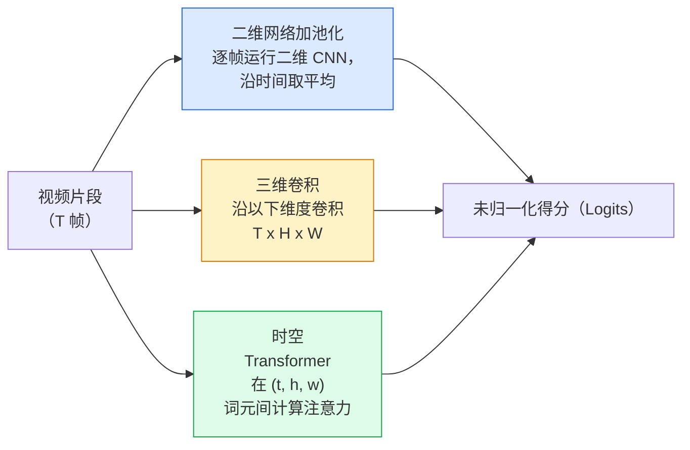

# 视频理解：时序建模（Video Understanding — Temporal Modeling）

> 视频是一系列图像，加上连接它们的物理规律。每种视频模型都将时间视为额外的轴（三维卷积）、进行注意力计算的序列（Transformer），或者提取后再池化的特征（二维网络加池化）。

**Type:** Learn + Build
**Languages:** Python
**Prerequisites:** 阶段 4 第 03 课（卷积神经网络），阶段 4 第 04 课（图像分类）
**Time:** 约 45 分钟

## 学习目标（Learning Objectives）

- 区分三类主要视频建模方法（二维网络加池化、三维卷积、时空 Transformer），并预测其成本与准确率的权衡
- 在 PyTorch 中实现帧采样、时序池化和二维网络加池化的基线分类器
- 解释为什么 I3D 的“膨胀”三维卷积核能有效迁移 ImageNet 权重，以及分解式 (2+1)D 卷积有何不同
- 理解标准动作识别数据集与指标：Kinetics-400/600、UCF101、Something-Something V2，以及片段级和视频级的 top-1 准确率

## 问题（The Problem）

一段 30 秒、每秒 30 帧的视频包含 900 张图像。最直接的视频分类做法是运行 900 次图像分类，然后以某种方式聚合结果。当几乎每帧都能看出动作时，例如体育、烹饪、健身视频，这种方法有效；但当动作由运动本身定义时，它会严重失效：“将某物从左向右推”在任意单帧中看起来都只是两个静止物体。

每种视频架构的核心问题都是：何时对时序结构建模，如何建模？答案决定其余一切，包括计算成本、预训练策略、能否复用 ImageNet 权重，以及用于训练的数据集。

本课有意比静态图像课程更短。核心图像处理机制已经具备，视频理解主要关注时间维度上的采样、建模和聚合。

## 概念（The Concept）

### 三大架构家族（The three architectural families）



### 二维网络加池化（2D + pool）

选取一个二维卷积神经网络（Convolutional Neural Network，CNN），例如 ResNet、EfficientNet、ViT。对每个采样帧独立运行网络，对逐帧嵌入取平均（或最大池化、注意力池化），再将池化后的向量送入分类器。

优点：
- 可直接迁移 ImageNet 预训练结果。
- 实现最简单。
- 成本低：T 帧 * 单张图像推理成本。

缺点：
- 无法对运动建模。动作只是外观的聚合。
- 时序池化与顺序无关；“开门”和“关门”看起来相同。

适用场景：以外观为主的任务、小视频数据集上的迁移学习，以及初始基线。

### 三维卷积（3D convolutions）

将二维 (H, W) 卷积核替换为三维 (T, H, W) 卷积核。网络同时沿空间和时间做卷积。早期代表包括 C3D、I3D、SlowFast。

I3D 的技巧：选取预训练的二维 ImageNet 模型，沿新增时间轴复制每个二维卷积核，实现“膨胀（Inflation）”。3x3 二维卷积变为 3x3x3 三维卷积。这样三维模型就能获得强大的预训练权重，无需从头训练。

优点：
- 直接对运动建模。
- I3D 膨胀免费带来迁移学习能力。

缺点：
- 比对应二维模型多 T/8 倍浮点运算量（Floating-Point Operations，FLOPs），这里指时间卷积核大小为 3、堆叠 3 次的情况。
- 时间卷积核较小；长程运动需要金字塔或双流方法。

适用场景：以运动为信号的动作识别，例如 Something-Something V2，以及 Kinetics 中运动特征占主导的类别。

### 时空 Transformer（Spatio-temporal transformers）

将视频转为时空图像块网格中的词元，并在所有词元之间计算注意力。代表模型包括 TimeSformer、ViViT、Video Swin、VideoMAE。

需要关注的注意力模式：
- **联合注意力（Joint）**：在 (t, h, w) 上统一计算大规模注意力。成本随 `T*H*W` 呈平方增长，开销很大。
- **分离注意力（Divided）**：每个模块有两次注意力计算，一次沿时间，一次沿空间，扩展成本近似线性。
- **分解注意力（Factorised）**：不同模块交替使用时间注意力与空间注意力。

优点：
- 在各主要基准上达到当前最优（State of the Art，SOTA）准确率。
- 通过图像块膨胀，从图像 Transformer（ViT）迁移。
- 通过稀疏注意力支持长上下文视频。

缺点：
- 计算需求大。
- 必须谨慎选择注意力模式，否则运行时间会急剧增加。

适用场景：大型数据集、高保真视频理解，以及视频加文本的多模态任务。

### 帧采样（Frame sampling）

一段 10 秒、每秒 30 帧的片段有 300 帧；把全部 300 帧送入任何模型都很浪费。标准策略如下：

- **均匀采样（Uniform sampling）**：在整个片段中均匀选取 T 帧，是二维网络加池化的默认方法。
- **密集采样（Dense sampling）**：随机选取连续 T 帧窗口。三维卷积常用这种方法，因为运动需要相邻帧。
- **多片段采样（Multi-clip）**：从同一视频采样多个 T 帧窗口，分别分类，在测试时平均预测。

T 通常为 8、16、32 或 64。T 越大，时序信号越丰富，计算成本也越高。

### 评估（Evaluation）

分为两个层级：
- **片段级准确率（Clip-level accuracy）**：模型只看一个 T 帧片段，报告 top-k。
- **视频级准确率（Video-level accuracy）**：对每个视频的多个片段预测取平均；准确率更高，也更稳定。

始终同时报告两者。片段级 78%、视频级 82% 的模型高度依赖测试时平均；80% / 81% 的模型则具有更稳健的单片段表现。

### 常见数据集（Datasets you will meet）

- **Kinetics-400 / 600 / 700**：通用动作数据集。包含 400k 个片段，以 YouTube URL 提供，其中很多链接现已失效。
- **Something-Something V2**：由运动定义的动作，例如“将 X 从左移到右”。二维网络加池化无法解决。
- **UCF-101**、**HMDB-51**：年代较早、规模较小，但仍会报告其结果。
- **AVA**：在空间和时间中进行动作*定位*，比分类更难。

```figure
v4-video-temporal
```

## 动手构建（Build It）

### 第 1 步：帧采样器（Step 1: Frame sampler）

对帧列表或视频张量使用的均匀采样器和密集采样器。

```python
import numpy as np

def sample_uniform(num_frames_total, T):
    if num_frames_total <= T:
        return list(range(num_frames_total)) + [num_frames_total - 1] * (T - num_frames_total)
    step = num_frames_total / T
    return [int(i * step) for i in range(T)]


def sample_dense(num_frames_total, T, rng=None):
    rng = rng or np.random.default_rng()
    if num_frames_total <= T:
        return list(range(num_frames_total)) + [num_frames_total - 1] * (T - num_frames_total)
    start = int(rng.integers(0, num_frames_total - T + 1))
    return list(range(start, start + T))
```

两者都返回 `T` 个索引，用于切片视频张量。

### 第 2 步：二维网络加池化基线（Step 2: A 2D+pool baseline）

对每帧运行二维 ResNet-18，对特征进行平均池化，再分类。

```python
import torch
import torch.nn as nn
from torchvision.models import resnet18, ResNet18_Weights

class FramePool(nn.Module):
    def __init__(self, num_classes=400, pretrained=True):
        super().__init__()
        weights = ResNet18_Weights.IMAGENET1K_V1 if pretrained else None
        backbone = resnet18(weights=weights)
        self.features = nn.Sequential(*(list(backbone.children())[:-1]))  # global avg pool kept
        self.head = nn.Linear(512, num_classes)

    def forward(self, x):
        # x: (N, T, 3, H, W)
        N, T = x.shape[:2]
        x = x.view(N * T, *x.shape[2:])
        feats = self.features(x).view(N, T, -1)
        pooled = feats.mean(dim=1)
        return self.head(pooled)

model = FramePool(num_classes=10)
x = torch.randn(2, 8, 3, 224, 224)
print(f"output: {model(x).shape}")
print(f"params: {sum(p.numel() for p in model.parameters()):,}")
```

1100 万参数，ImageNet 预训练，逐帧运行、平均、分类。对于以外观为主的任务，这个基线与真正三维模型的差距通常在 5-10 个百分点内；有时还更好，因为它复用了更强的 ImageNet 主干网络（Backbone）。

### 第 3 步：I3D 风格的膨胀三维卷积（Step 3: An I3D-style inflated 3D conv）

沿新增时间轴重复权重，将单个二维卷积转为三维卷积。

```python
def inflate_2d_to_3d(conv2d, time_kernel=3):
    out_c, in_c, kh, kw = conv2d.weight.shape
    weight_3d = conv2d.weight.data.unsqueeze(2)  # (out, in, 1, kh, kw)
    weight_3d = weight_3d.repeat(1, 1, time_kernel, 1, 1) / time_kernel
    conv3d = nn.Conv3d(in_c, out_c, kernel_size=(time_kernel, kh, kw),
                        padding=(time_kernel // 2, conv2d.padding[0], conv2d.padding[1]),
                        stride=(1, conv2d.stride[0], conv2d.stride[1]),
                        bias=False)
    conv3d.weight.data = weight_3d
    return conv3d

conv2d = nn.Conv2d(3, 64, kernel_size=3, padding=1, bias=False)
conv3d = inflate_2d_to_3d(conv2d, time_kernel=3)
print(f"2D weight shape:  {tuple(conv2d.weight.shape)}")
print(f"3D weight shape:  {tuple(conv3d.weight.shape)}")
x = torch.randn(1, 3, 8, 56, 56)
print(f"3D output shape:  {tuple(conv3d(x).shape)}")
```

除以 `time_kernel` 能使激活幅度大致保持不变，这对于避免首次前向计算破坏批归一化（Batch Normalization）统计量很重要。

### 第 4 步：分解式 (2+1)D 卷积（Step 4: Factorised (2+1)D conv）

将三维卷积分解为二维空间卷积与一维时间卷积。感受野相同，参数更少，在一些基准上的准确率更高。

```python
class Conv2Plus1D(nn.Module):
    def __init__(self, in_c, out_c, kernel_size=3):
        super().__init__()
        mid_c = (in_c * out_c * kernel_size * kernel_size * kernel_size) \
                // (in_c * kernel_size * kernel_size + out_c * kernel_size)
        self.spatial = nn.Conv3d(in_c, mid_c, kernel_size=(1, kernel_size, kernel_size),
                                 padding=(0, kernel_size // 2, kernel_size // 2), bias=False)
        self.bn = nn.BatchNorm3d(mid_c)
        self.act = nn.ReLU(inplace=True)
        self.temporal = nn.Conv3d(mid_c, out_c, kernel_size=(kernel_size, 1, 1),
                                  padding=(kernel_size // 2, 0, 0), bias=False)

    def forward(self, x):
        return self.temporal(self.act(self.bn(self.spatial(x))))

c = Conv2Plus1D(3, 64)
x = torch.randn(1, 3, 8, 56, 56)
print(f"(2+1)D output: {tuple(c(x).shape)}")
```

完整的 R(2+1)D 网络相当于把 ResNet-18 中每个 3x3 卷积替换为 `Conv2Plus1D`。

## 实际使用（Use It）

两个库覆盖生产环境中的视频工作：

- `torchvision.models.video`：提供带 Kinetics 预训练权重的 R(2+1)D、MViT、Swin3D，API 与图像模型相同。
- `pytorchvideo`（Meta）：提供模型库、Kinetics / SSv2 / AVA 数据加载器和标准变换。

对于视觉语言视频模型，例如视频描述、视频问答，使用 `transformers`（`VideoMAE`、`VideoLLaMA`、`InternVideo`）。

## 交付成果（Ship It）

本课产出：

- `outputs/prompt-video-architecture-picker.md`：根据外观与运动的重要程度、数据集规模和计算预算，选择二维网络加池化 / I3D / (2+1)D / Transformer 的提示词。
- `outputs/skill-frame-sampler-auditor.md`：检查视频流水线采样器的技能，标记索引差一错误、`num_frames < T` 时采样不均、缺少保持宽高比的裁剪等常见问题。

## 练习（Exercises）

1. **（简单）** 估算 T=8 的 FramePool 与 T=8 的 I3D 风格三维 ResNet 的浮点运算量。论证为什么二维网络加池化的成本低 3-5 倍。
2. **（中等）** 生成合成视频数据集：随机小球沿随机方向移动，按运动方向标注（“从左到右”“从右到左”“斜向上”）。在其上训练 FramePool。展示准确率接近随机猜测，从而证明仅靠外观不足以解决运动任务。
3. **（困难）** 将 ResNet-18 中每个 Conv2d 替换为 `Conv2Plus1D`，构建 R(2+1)D-18。从 ImageNet 预训练的 ResNet-18 膨胀第一个卷积的权重。在练习 2 的运动数据集上训练，并超过 FramePool。

## 关键术语（Key Terms）

| 术语 | 常见说法 | 实际含义 |
|------|----------------|----------------------|
| 二维网络加池化（2D + pool） | “逐帧分类器” | 对每个采样帧运行二维 CNN，沿时间对特征平均池化，再分类 |
| 三维卷积（3D convolution） | “时空卷积核” | 沿 (T, H, W) 做卷积的核，可原生建模运动 |
| 膨胀（Inflation） | “将二维权重提升到三维” | 沿新增时间轴重复二维卷积权重以初始化三维卷积，再除以 kernel_T，保持激活尺度 |
| (2+1)D | “分解式卷积” | 将三维拆成二维空间加一维时间；参数更少，中间增加非线性 |
| 分离注意力（Divided attention） | “先时间后空间” | 每层有两次注意力计算的 Transformer 模块：一次针对同帧词元，一次针对同位置词元 |
| 片段（Clip） | “T 帧窗口” | 采样得到的 T 帧子序列，是视频模型的输入单位 |
| 片段与视频准确率（Clip vs video accuracy） | “两种评估设置” | 片段：每个视频采样一次；视频：对多个采样片段求平均 |
| Kinetics | “视频领域的 ImageNet” | 400-700 个动作类别，300k 以上 YouTube 片段，是标准视频预训练语料 |

## 延伸阅读（Further Reading）

- [I3D：动作识别将走向何方（Carreira 与 Zisserman，2017）](https://arxiv.org/abs/1705.07750)：介绍膨胀方法和 Kinetics 数据集
- [R(2+1)D：深入审视时空卷积（Tran 等，2018）](https://arxiv.org/abs/1711.11248)：分解式卷积，至今仍是强基线
- [TimeSformer：只需时空注意力吗？（Bertasius 等，2021）](https://arxiv.org/abs/2102.05095)：首个性能强劲的视频 Transformer
- [VideoMAE（Tong 等，2022）](https://arxiv.org/abs/2203.12602)：视频掩码自编码器（Masked Autoencoder）预训练，当前主流预训练方案
