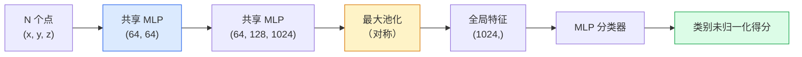

# 三维视觉：点云与神经辐射场（3D Vision — Point Clouds & NeRFs）

> 三维视觉有两类形式。点云是传感器的原始输出；神经辐射场是学习得到的体积场。两者都回答“空间中什么东西在哪里”。

**Type:** Learn + Build
**Languages:** Python
**Prerequisites:** 阶段 4 第 03 课（卷积神经网络），阶段 1 第 12 课（张量运算）
**Time:** 约 45 分钟

## 学习目标（Learning Objectives）

- 区分显式三维表示（点云、网格、体素）与隐式三维表示（有符号距离场、神经辐射场），理解各自适用场景
- 理解 PointNet 的对称函数技巧，说明它如何让神经网络对无序点集具备置换不变性
- 跟踪神经辐射场的前向过程：光线投射、体渲染、位置编码、多层感知机的密度与颜色输出头
- 使用 `nerfstudio` 或 `instant-ngp`，从少量带位姿图像进行基于预训练模型的三维重建

## 问题（The Problem）

相机产生二维图像。激光雷达（Light Detection and Ranging，LIDAR）产生一组无序三维点。运动恢复结构（Structure from Motion）流水线产生稀疏三维关键点云。神经辐射场（Neural Radiance Field，NeRF）从少量带位姿图像重建完整三维场景。这些都属于“视觉”，却都不像卷积神经网络（Convolutional Neural Network，CNN）所需的稠密张量。

三维视觉之所以重要，是因为几乎所有高价值机器人任务都在三维空间中运行：抓取、避障、导航、增强现实（Augmented Reality，AR）遮挡、三维内容采集。只理解二维图像的视觉工程师难以进入增长最快的领域，包括 AR / 虚拟现实（Virtual Reality，VR）内容、机器人、自动驾驶技术栈，以及房地产或建筑中的 NeRF 三维重建。

两类表示因不同原因占据主导地位。点云是传感器直接提供的数据；NeRF 及其后继方法（三维高斯泼溅、神经有符号距离场）则是让神经网络学习场景后得到的表示。

## 概念（The Concept）

### 点云（Point clouds）

点云是 R^3 中 N 个点构成的无序集合，每点还可附带特征，例如颜色、强度、法向量。

```
cloud = [
  (x1, y1, z1, r1, g1, b1),
  (x2, y2, z2, r2, g2, b2),
  ...
  (xN, yN, zN, rN, gN, bN),
]
```

没有网格，也没有连接关系。两个特性给神经网络带来困难：

- **置换不变性（Permutation invariance）**：输出不能依赖点的顺序。
- **可变点数 N（Variable N）**：同一个模型必须处理不同大小的点云。

PointNet（Qi 等，2017）用一个思路解决了两者：对每个点应用共享的多层感知机（Multilayer Perceptron，MLP），再用对称函数（最大池化）聚合。结果是一个与顺序无关的固定大小向量。

```
f(P) = max_{p in P} MLP(p)
```

这就是 PointNet 的全部核心。更深的变体，例如 PointNet++、Point Transformer，增加了分层采样和局部聚合，但对称函数技巧保持不变。

### PointNet 架构（The PointNet architecture）



“共享 MLP”表示同一个 MLP 独立处理每个点。为提高效率，可用沿点维度的 1x1 卷积实现。

### 神经辐射场（Neural Radiance Fields，NeRFs）

NeRF（Mildenhall 等，2020）提出“能否从 N 张照片重建三维场景”，并用一个本身就是场景的神经网络回答。网络将 `(x, y, z, viewing_direction)` 映射为 `(density, colour)`。渲染新视角就是对该网络执行光线投射循环。

```
NeRF MLP:  (x, y, z, theta, phi) -> (sigma, r, g, b)

渲染新视角的像素 (u, v)：
  1. 从相机经过像素 (u, v) 投射一条光线
  2. 沿光线在距离 t_1, t_2, ..., t_N 处采样
  3. 在每个点查询 MLP
  4. 按 (1 - exp(-sigma * dt)) 加权合成颜色
  5. 总和即渲染像素的颜色
```

损失函数比较渲染像素与训练照片中的真值像素。反向传播穿过渲染步骤，更新 MLP。没有三维真值，也没有显式几何；场景存储在 MLP 权重中。

### NeRF 中的位置编码（Positional encoding in NeRF）

直接输入 `(x, y, z)` 的普通 MLP 无法表示高频细节，因为 MLP 在频谱上偏向低频。NeRF 在输入 MLP 前，将每个坐标编码为傅里叶特征（Fourier Feature）向量来解决这个问题：

```
gamma(p) = (sin(2^0 pi p), cos(2^0 pi p), sin(2^1 pi p), cos(2^1 pi p), ...)
```

最多使用 L=10 个频率层级。这与 Transformer 处理位置的技巧相同，也会再次出现在扩散模型的时间条件中（第 10 课）。缺少它，NeRF 的结果就会模糊。

### 体渲染（Volumetric rendering）

```
C(r) = sum_i T_i * (1 - exp(-sigma_i * delta_i)) * c_i

T_i  = exp(- sum_{j<i} sigma_j * delta_j)
delta_i = t_{i+1} - t_i
```

`T_i` 是透射率（Transmittance），表示有多少光到达点 i。`(1 - exp(-sigma_i * delta_i))` 是点 i 的不透明度。`c_i` 是颜色。最终像素是沿光线的加权和。

### NeRF 的后继方法（What replaced NeRFs）

纯 NeRF 训练缓慢，需要数小时；渲染也慢，每张图像需要数秒。后续演进如下：

- **Instant-NGP**（2022）：用哈希网格编码（Hash-grid Encoding）替换 MLP 的位置输入，数秒内训练完成。
- **Mip-NeRF 360**：处理无界场景与抗锯齿。
- **三维高斯泼溅（3D Gaussian Splatting）**（2023）：用数百万个三维高斯替换体积场，数分钟内训练，实时渲染，是当前生产默认方案。

2026 年几乎所有实际 NeRF 产品使用的其实都是三维高斯泼溅，但理解框架仍然是 NeRF。

### 数据集与基准（Datasets and benchmarks）

- **ShapeNet**：将三维计算机辅助设计（Computer-Aided Design，CAD）模型视为点云，进行分类与分割。
- **ScanNet**：用于分割的真实室内扫描。
- **KITTI**：用于自动驾驶的室外激光雷达点云。
- **NeRF Synthetic** / **Blended MVS**：用于视角合成的带位姿图像数据集。
- **Mip-NeRF 360** 数据集：无界真实场景。

```figure
nerf-rays
```

## 动手构建（Build It）

### 第 1 步：PointNet 分类器（Step 1: PointNet classifier）

```python
import torch
import torch.nn as nn

class PointNet(nn.Module):
    def __init__(self, num_classes=10):
        super().__init__()
        self.mlp1 = nn.Sequential(
            nn.Conv1d(3, 64, 1),    nn.BatchNorm1d(64),   nn.ReLU(inplace=True),
            nn.Conv1d(64, 64, 1),   nn.BatchNorm1d(64),   nn.ReLU(inplace=True),
        )
        self.mlp2 = nn.Sequential(
            nn.Conv1d(64, 128, 1),  nn.BatchNorm1d(128),  nn.ReLU(inplace=True),
            nn.Conv1d(128, 1024, 1), nn.BatchNorm1d(1024), nn.ReLU(inplace=True),
        )
        self.head = nn.Sequential(
            nn.Linear(1024, 512),   nn.BatchNorm1d(512),  nn.ReLU(inplace=True),
            nn.Dropout(0.3),
            nn.Linear(512, 256),    nn.BatchNorm1d(256),  nn.ReLU(inplace=True),
            nn.Dropout(0.3),
            nn.Linear(256, num_classes),
        )

    def forward(self, x):
        # x: (N, 3, num_points) — transposed for Conv1d
        x = self.mlp1(x)
        x = self.mlp2(x)
        x = torch.max(x, dim=-1)[0]       # (N, 1024)
        return self.head(x)

pts = torch.randn(4, 3, 1024)
net = PointNet(num_classes=10)
print(f"output: {net(pts).shape}")
print(f"params: {sum(p.numel() for p in net.parameters()):,}")
```

约 1.6M 参数，每个点云处理 1,024 个点。

### 第 2 步：位置编码（Step 2: Positional encoding）

```python
def positional_encoding(x, L=10):
    """
    x: (..., D) -> (..., D * 2 * L)
    """
    freqs = 2.0 ** torch.arange(L, dtype=x.dtype, device=x.device)
    args = x.unsqueeze(-1) * freqs * 3.141592653589793
    sinc = torch.cat([args.sin(), args.cos()], dim=-1)
    return sinc.reshape(*x.shape[:-1], -1)

x = torch.randn(5, 3)
y = positional_encoding(x, L=10)
print(f"input:  {x.shape}")
print(f"encoded: {y.shape}     # (5, 60)")
```

乘以 `2^l * pi`，得到逐渐升高的频率。

### 第 3 步：微型 NeRF MLP（Step 3: Tiny NeRF MLP）

```python
class TinyNeRF(nn.Module):
    def __init__(self, L_pos=10, L_dir=4, hidden=128):
        super().__init__()
        self.L_pos = L_pos
        self.L_dir = L_dir
        pos_dim = 3 * 2 * L_pos
        dir_dim = 3 * 2 * L_dir
        self.trunk = nn.Sequential(
            nn.Linear(pos_dim, hidden), nn.ReLU(inplace=True),
            nn.Linear(hidden, hidden),  nn.ReLU(inplace=True),
            nn.Linear(hidden, hidden),  nn.ReLU(inplace=True),
            nn.Linear(hidden, hidden),  nn.ReLU(inplace=True),
        )
        self.sigma = nn.Linear(hidden, 1)
        self.color = nn.Sequential(
            nn.Linear(hidden + dir_dim, hidden // 2), nn.ReLU(inplace=True),
            nn.Linear(hidden // 2, 3), nn.Sigmoid(),
        )

    def forward(self, x, d):
        x_enc = positional_encoding(x, self.L_pos)
        d_enc = positional_encoding(d, self.L_dir)
        h = self.trunk(x_enc)
        sigma = torch.relu(self.sigma(h)).squeeze(-1)
        rgb = self.color(torch.cat([h, d_enc], dim=-1))
        return sigma, rgb

nerf = TinyNeRF()
x = torch.randn(128, 3)
d = torch.randn(128, 3)
s, c = nerf(x, d)
print(f"sigma: {s.shape}   rgb: {c.shape}")
```

相较于原始 NeRF（包含两个深度为 8 的 MLP 主干），这个模型很小，但足以展示架构。

### 第 4 步：沿光线进行体渲染（Step 4: Volumetric rendering along a ray）

```python
def volumetric_render(sigma, rgb, t_vals):
    """
    sigma: (..., N_samples)
    rgb:   (..., N_samples, 3)
    t_vals: (N_samples,) distances along the ray
    """
    delta = torch.cat([t_vals[1:] - t_vals[:-1], torch.full_like(t_vals[:1], 1e10)])
    alpha = 1.0 - torch.exp(-sigma * delta)
    trans = torch.cumprod(torch.cat([torch.ones_like(alpha[..., :1]), 1.0 - alpha + 1e-10], dim=-1), dim=-1)[..., :-1]
    weights = alpha * trans
    rendered = (weights.unsqueeze(-1) * rgb).sum(dim=-2)
    depth = (weights * t_vals).sum(dim=-1)
    return rendered, depth, weights


N = 64
t_vals = torch.linspace(2.0, 6.0, N)
sigma = torch.rand(N) * 0.5
rgb = torch.rand(N, 3)
rendered, depth, weights = volumetric_render(sigma, rgb, t_vals)
print(f"rendered colour: {rendered.tolist()}")
print(f"depth:           {depth.item():.2f}")
```

一条光线、64 个采样点，合成为一个 RGB 像素和一个深度值。

## 实际使用（Use It）

实际工作可使用：

- `nerfstudio`（Tancik 等）：当前 NeRF / Instant-NGP / 高斯泼溅的参考库，提供命令行与网页查看器。
- `pytorch3d`（Meta）：可微渲染、点云工具和网格操作。
- `open3d`：点云处理、配准和可视化。

部署中，三维高斯泼溅已基本取代纯 NeRF，因为它的渲染速度快 100 倍，而重建质量相当。

## 交付成果（Ship It）

本课产出：

- `outputs/prompt-3d-task-router.md`：根据任务与输入数据选择合适三维表示（点云、网格、体素、NeRF、高斯泼溅）的提示词。
- `outputs/skill-point-cloud-loader.md`：为 .ply / .pcd / .xyz 文件编写 PyTorch `Dataset` 的技能，正确执行归一化、中心化和点采样。

## 练习（Exercises）

1. **（简单）** 展示 PointNet 的置换不变性：将同一点云运行两次，其中一次打乱点的顺序。验证除浮点误差外，输出完全相同。
2. **（中等）** 实现最小光线生成函数，给定相机内参与位姿，为 H x W 图像的每个像素生成光线原点和方向。
3. **（困难）** 使用彩色立方体渲染视图的合成数据集训练 TinyNeRF，数据由可微渲染或简单光线追踪器生成。报告第 1、10、100 轮的渲染损失。模型从第几轮开始产生可辨识的视图？

## 关键术语（Key Terms）

| 术语 | 常见说法 | 实际含义 |
|------|----------------|----------------------|
| 点云（Point cloud） | “激光雷达的三维点” | 无序的 (x, y, z) 集合，每点可附带特征 |
| PointNet | “首个处理点云的神经网络” | 逐点共享 MLP 加对称的最大池化，结构上保证置换不变性 |
| 神经辐射场（NeRF） | “MLP 就是场景” | 将 (x, y, z, dir) 映射到 (density, colour) 的网络，通过光线投射渲染 |
| 位置编码（Positional encoding） | “傅里叶特征” | 将每个坐标编码为多个频率的 sin/cos，克服 MLP 的低频偏置 |
| 体渲染（Volumetric rendering） | “光线积分” | 使用透射率与 alpha，将沿光线的样本合成为单个像素 |
| Instant-NGP | “哈希网格 NeRF” | 用多分辨率哈希网格替换 NeRF 的坐标 MLP，速度快 100-1000 倍 |
| 三维高斯泼溅（3D Gaussian splatting） | “数百万个高斯” | 场景等于三维高斯集合，实时渲染、数分钟训练 |
| 有符号距离场（Signed Distance Field，SDF） | “带符号的距离场” | 返回到最近表面有符号距离的函数，是另一类隐式表示 |

## 延伸阅读（Further Reading）

- [PointNet（Qi 等，2017）](https://arxiv.org/abs/1612.00593)：具有置换不变性的分类器
- [NeRF（Mildenhall 等，2020）](https://arxiv.org/abs/2003.08934)：将照片三维重建转化为神经网络问题的论文
- [Instant-NGP（Müller 等，2022）](https://arxiv.org/abs/2201.05989)：哈希网格，1000 倍加速
- [三维高斯泼溅（Kerbl 等，2023）](https://arxiv.org/abs/2308.04079)：在生产环境中取代 NeRF 的架构
