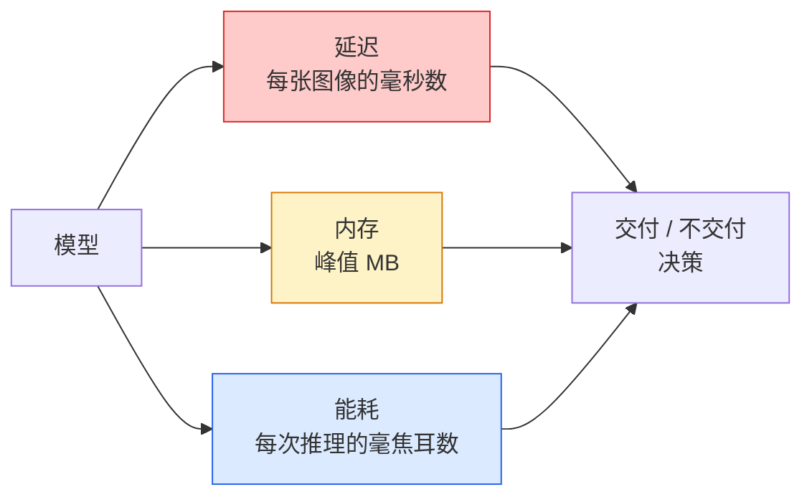

# 实时视觉：边缘部署（Real-Time Vision — Edge Deployment）

> 边缘推理研究如何让准确率为 90% 的模型，在只有 2 GB 内存的设备上以每秒 30 帧运行。每一个百分点的准确率都要与毫秒级延迟作权衡。

**Type:** Learn + Build
**Languages:** Python
**Prerequisites:** 阶段 4 第 04 课（图像分类），阶段 10 第 11 课（量化）
**Time:** 约 75 分钟

## 学习目标（Learning Objectives）

- 测量任意 PyTorch 模型的推理延迟、峰值内存与吞吐量，并理解浮点运算量、参数量与延迟的权衡
- 使用 PyTorch 训练后量化将视觉模型量化为 INT8，并验证准确率损失 < 1%
- 导出为 ONNX，使用 ONNX Runtime 或 TensorRT 编译；列举三类最常见的导出失败及修复方法
- 解释在何种边缘约束下选择 MobileNetV3、EfficientNet-Lite、ConvNeXt-Tiny 或 MobileViT

## 问题（The Problem）

训练时的视觉模型是浮点计算大户：100M 参数，每次前向传播 10 GFLOPs，2 GB 显存。手机、车载信息娱乐主机、工业相机或无人机都容不下这样的开销。交付视觉系统意味着在缩小 100 倍的预算内完成相同预测。

三个调节项承担大部分工作：模型选择，即相同训练方案配更小架构；量化，即用 INT8 替代 FP32；推理运行时，包括 ONNX Runtime、TensorRT、Core ML、TFLite。把它们选对，决定了成果是工作站上的演示，还是能在 30 美元相机模组上交付的产品。

本课先建立测量规范，因为无法测量就无法优化，再逐一介绍这三个调节项。目标不是学遍所有边缘运行时，而是知道有哪些手段，以及如何验证每种手段的实际作用。

## 概念（The Concept）

### 三项预算（The three budgets）



- **延迟（Latency）**：p50、p95、p99。仅对 p50 求平均会掩盖对实时系统重要的尾部行为。
- **峰值内存（Peak memory）**：设备运行中出现的最大值，而非稳态平均值。嵌入式目标上的内存不足（Out of Memory，OOM）是致命问题，因此这一指标很重要。
- **功率与能耗（Power / energy）**：电池设备每次推理消耗的毫焦耳数。常用 CPU/GPU 利用率 * 时间作为近似指标。

边缘部署决策依据的是模型、延迟、内存、准确率的对比表。每个单元格都必须在目标设备上测量，而不是在工作站上。

### 测量规范（Measurement discipline）

每次边缘性能分析都应遵循三条规则：

1. 测量前，用 5-10 次虚拟输入前向传播**预热（Warm up）**模型。冷缓存与即时编译（Just-in-Time Compilation，JIT）会导致最初的数字不具代表性。
2. 在计时代码块前后用 `torch.cuda.synchronize()` **同步（Synchronise）** GPU 工作负载。否则测到的是内核分发，而不是内核执行。
3. 将**输入尺寸固定（Fix input sizes）**为生产分辨率。224x224 的延迟不等于 512x512 的延迟。

### 用浮点运算量作近似指标（FLOPs as a proxy）

浮点运算量（Floating-Point Operations，FLOPs）指每次推理的浮点操作数，是成本低且与设备无关的延迟近似指标。它适合架构比较，但将其当成实际耗时会误导。浮点运算量多 10% 的模型，实践中可能快 2 倍，因为采用了硬件友好算子，例如逐通道卷积易于编译，而大型 7x7 卷积则不然。

原则：架构搜索使用 FLOPs，部署决策使用设备实测延迟。

### 一段话理解量化（Quantisation in one paragraph）

将 32 位浮点（FP32）权重与激活替换为 8 位整数（INT8）。模型大小缩小 4 倍，内存带宽需求降低 4 倍，在支持 INT8 内核的硬件上计算开销降低 2-4 倍，包括所有现代移动片上系统（System on Chip，SoC）与带 Tensor Core 的 NVIDIA GPU。训练后静态量化在视觉任务上的准确率损失通常为 0.1-1 个百分点。

类型：

- **动态量化（Dynamic）**：权重量化为 INT8，激活使用浮点计算。简单，但加速有限。
- **静态量化，训练后（Static, post-training）**：量化权重，并用小型校准集校准激活范围。比动态量化快得多。
- **量化感知训练（Quantisation-Aware Training，QAT）**：训练时模拟量化，让模型学会适应量化。准确率最好，但需要有标签数据。

对于视觉，训练后静态量化用 5% 的工作量获得 95% 的收益。只有训练后量化（Post-Training Quantisation，PTQ）的准确率损失不可接受时，才使用 QAT。

### 剪枝与蒸馏（Pruning and distillation）

- **剪枝（Pruning）**：移除不重要的权重，按幅值判断，或移除通道，即结构化剪枝。适合过参数化模型，对已经紧凑的架构作用较小。
- **蒸馏（Distillation）**：训练小型学生模型模仿大型教师模型的未归一化得分（Logits）。通常能恢复缩小模型所损失的大部分准确率，是生产边缘模型的标准方法。

### 推理运行时（The inference runtimes）

- **PyTorch 即时执行（Eager）**：慢，不适合部署，仅用于开发。
- **TorchScript**：旧方案，已被 `torch.compile` 与 ONNX 导出取代。
- **ONNX Runtime**：中立运行时。CPU、CUDA、CoreML、TensorRT、OpenVINO 都有 ONNX 执行提供程序（Provider）。从这里开始。
- **TensorRT**：NVIDIA 编译器，在 NVIDIA GPU，包括工作站与 Jetson 上延迟最佳。可与 ONNX Runtime 集成，也可独立使用。
- **Core ML**：Apple 的 iOS/macOS 运行时，需要 `.mlmodel` 或 `.mlpackage`。
- **TFLite**：Google 的 Android/ARM 运行时，需要 `.tflite`。
- **OpenVINO**：Intel 面向 CPU / 视觉处理单元（Vision Processing Unit，VPU）的运行时，需要 `.xml` + `.bin`。

实际路径：从 PyTorch 导出 -> ONNX -> 为目标选择运行时。ONNX 是通用交换语言。

### 边缘架构选择（Edge architecture picker）

| 预算 | 模型 | 原因 |
|--------|-------|-----|
| < 3M 参数 | MobileNetV3-Small | 可编译到各类平台，是良好基线 |
| 3-10M | EfficientNet-Lite-B0 | TFLite 上单位参数准确率最高 |
| 10-20M | ConvNeXt-Tiny | 单位参数准确率最高，CPU 友好 |
| 20-30M | MobileViT-S 或 EfficientViT | 具有 ImageNet 准确率表现的 Transformer |
| 30-80M | Swin-V2-Tiny | 技术栈支持窗口注意力时使用 |

除非有明确理由，否则全部量化为 INT8。

```figure
cnn-param-count
```

## 动手构建（Build It）

### 第 1 步：正确测量延迟（Step 1: Measure latency correctly）

```python
import time
import torch

def measure_latency(model, input_shape, device="cpu", warmup=10, iters=50):
    model = model.to(device).eval()
    x = torch.randn(input_shape, device=device)
    with torch.no_grad():
        for _ in range(warmup):
            model(x)
        if device == "cuda":
            torch.cuda.synchronize()
        times = []
        for _ in range(iters):
            if device == "cuda":
                torch.cuda.synchronize()
            t0 = time.perf_counter()
            model(x)
            if device == "cuda":
                torch.cuda.synchronize()
            times.append((time.perf_counter() - t0) * 1000)
    times.sort()
    return {
        "p50_ms": times[len(times) // 2],
        "p95_ms": times[int(len(times) * 0.95)],
        "p99_ms": times[int(len(times) * 0.99)],
        "mean_ms": sum(times) / len(times),
    }
```

预热、同步，并使用 `time.perf_counter()`。报告百分位数，而不只是均值。

### 第 2 步：参数量与浮点运算量（Step 2: Parameter and FLOP counts）

```python
def parameter_count(model):
    return sum(p.numel() for p in model.parameters())

def flops_estimate(model, input_shape):
    """
    Rough FLOP count for a conv/linear-only model. For production use `fvcore` or `ptflops`.
    """
    total = 0
    def conv_hook(m, inp, out):
        nonlocal total
        c_out, c_in, kh, kw = m.weight.shape
        h, w = out.shape[-2:]
        total += 2 * c_in * c_out * kh * kw * h * w
    def linear_hook(m, inp, out):
        nonlocal total
        total += 2 * m.in_features * m.out_features
    hooks = []
    for m in model.modules():
        if isinstance(m, torch.nn.Conv2d):
            hooks.append(m.register_forward_hook(conv_hook))
        elif isinstance(m, torch.nn.Linear):
            hooks.append(m.register_forward_hook(linear_hook))
    model.eval()
    with torch.no_grad():
        model(torch.randn(input_shape))
    for h in hooks:
        h.remove()
    return total
```

实际项目使用 `fvcore.nn.FlopCountAnalysis` 或 `ptflops`，它们能正确处理各类模块。

### 第 3 步：训练后静态量化（Step 3: Post-training static quantisation）

```python
def quantise_ptq(model, calibration_loader, backend="x86"):
    import torch.ao.quantization as tq
    model = model.eval().cpu()
    model.qconfig = tq.get_default_qconfig(backend)
    tq.prepare(model, inplace=True)
    with torch.no_grad():
        for x, _ in calibration_loader:
            model(x)
    tq.convert(model, inplace=True)
    return model
```

三个步骤：配置、准备（插入观察器）、用真实数据校准、转换（融合与量化）。要求先融合模型，即 `Conv -> BN -> ReLU` -> `ConvBnReLU`，由 `torch.ao.quantization.fuse_modules` 处理。

### 第 4 步：导出为 ONNX（Step 4: Export to ONNX）

```python
def export_onnx(model, sample_input, path="model.onnx"):
    model = model.eval()
    torch.onnx.export(
        model,
        sample_input,
        path,
        input_names=["input"],
        output_names=["output"],
        dynamic_axes={"input": {0: "batch"}, "output": {0: "batch"}},
        opset_version=17,
    )
    return path
```

`opset_version=17` 是 2026 年稳妥的默认值。`dynamic_axes` 允许以任意批量大小运行 ONNX 模型。

### 第 5 步：基准测试与方案比较（Step 5: Benchmark and compare regimes）

```python
import torch.nn as nn
from torchvision.models import mobilenet_v3_small

def compare_regimes():
    model = mobilenet_v3_small(weights=None, num_classes=10)
    params = parameter_count(model)
    flops = flops_estimate(model, (1, 3, 224, 224))
    lat_fp32 = measure_latency(model, (1, 3, 224, 224), device="cpu")
    print(f"FP32 MobileNetV3-Small: {params:,} params  {flops/1e9:.2f} GFLOPs  "
          f"p50={lat_fp32['p50_ms']:.2f}ms  p95={lat_fp32['p95_ms']:.2f}ms")
```

对 `resnet50`、`efficientnet_v2_s`、`convnext_tiny` 运行相同函数，即可得到部署决策所需的对比表。

## 实际使用（Use It）

生产技术栈通常归结为三条路径之一：

- **网页 / 无服务器（Web / serverless）**：PyTorch -> ONNX -> ONNX Runtime，使用 CPU 或 CUDA 执行提供程序。最简单，对多数情况已足够。
- **NVIDIA 边缘端（Jetson、GPU 服务器）**：PyTorch -> ONNX -> TensorRT。延迟最佳，工程投入最大。
- **移动端（Mobile）**：PyTorch -> ONNX -> Core ML（iOS）或 TFLite（Android）。导出前量化。

测量时，`torch-tb-profiler`、`nvprof` / `nsys` 和 macOS Instruments 提供逐层明细。`benchmark_app`（OpenVINO）与 `trtexec`（TensorRT）提供独立命令行测量结果。

## 交付成果（Ship It）

本课产出：

- `outputs/prompt-edge-deployment-planner.md`：根据目标设备与延迟服务级别协议（Service-Level Agreement，SLA），选择主干、量化策略和运行时的提示词。
- `outputs/skill-latency-profiler.md`：编写完整延迟基准脚本的技能，包含预热、同步、百分位数和内存跟踪。

## 练习（Exercises）

1. **（简单）** 在 CPU 上以 224x224 测量 `resnet18`、`mobilenet_v3_small`、`efficientnet_v2_s`、`convnext_tiny` 的 p50 延迟。报告表格，找出每毫秒准确率表现最佳的架构。
2. **（中等）** 对 `mobilenet_v3_small` 应用训练后静态量化。报告 FP32 与 INT8 延迟，并在留出的 CIFAR-10 或类似数据子集上报告准确率损失。
3. **（困难）** 将 `convnext_tiny` 导出为 ONNX，使用 `onnxruntime` 与 `CPUExecutionProvider` 运行，比较其延迟与 PyTorch 即时执行基线。找出 ONNX Runtime 首次更快的层，并解释原因。

## 关键术语（Key Terms）

| 术语 | 常见说法 | 实际含义 |
|------|----------------|----------------------|
| 延迟（Latency） | “有多快” | 从输入到输出的时间，用 p50/p95/p99 百分位数而非均值表示 |
| 浮点运算量（FLOPs） | “模型大小” | 每次前向传播的浮点操作数，粗略反映计算成本 |
| INT8 量化（INT8 quantisation） | “8 位” | 用 8 位整数替换 FP32 权重与激活，约缩小 4 倍、加速 2-4 倍 |
| 训练后量化（Post-Training Quantisation，PTQ） | “训练完再量化” | 不重新训练，直接量化已训练模型，简单且通常足够 |
| 量化感知训练（Quantisation-Aware Training，QAT） | “训练时考虑量化” | 训练时模拟量化，准确率最佳，需要有标签数据 |
| 开放神经网络交换格式（Open Neural Network Exchange，ONNX） | “中立格式” | 所有主流推理运行时支持的模型交换格式 |
| TensorRT | “NVIDIA 编译器” | 将 ONNX 编译为针对 NVIDIA GPU 优化的引擎 |
| 蒸馏（Distillation） | “教师 -> 学生” | 训练小模型模仿大模型的未归一化得分，恢复大部分损失的准确率 |

## 延伸阅读（Further Reading）

- [EfficientNet（Tan 与 Le，2019）](https://arxiv.org/abs/1905.11946)：高效架构的复合缩放（Compound Scaling）
- [MobileNetV3（Howard 等，2019）](https://arxiv.org/abs/1905.02244)：采用 h-swish 与挤压激励（Squeeze-and-Excitation）的移动优先架构
- [TensorRT 优化实用指南（NVIDIA）](https://developer.nvidia.com/blog/accelerating-model-inference-with-tensorrt-tips-and-best-practices-for-pytorch-users/)：如何真正达到论文中的吞吐量
- [ONNX Runtime 文档](https://onnxruntime.ai/docs/)：量化、图优化、执行提供程序选择
