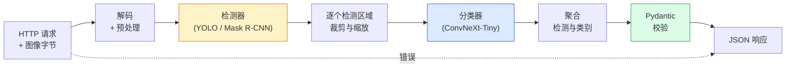

# 构建完整视觉流水线：综合项目（Build a Complete Vision Pipeline — Capstone）

> 生产视觉系统是用数据契约连接起来的一串模型与规则。本阶段已经提供各个部件，综合项目将它们端到端连接起来。

**Type:** Build
**Languages:** Python
**Prerequisites:** 阶段 4 第 01-15 课
**Time:** 约 120 分钟

## 学习目标（Learning Objectives）

- 设计生产视觉流水线，检测目标、进行分类、输出结构化 JSON，并处理所有失败路径
- 将检测器（Mask R-CNN 或 YOLO）、分类器（ConvNeXt-Tiny）和数据契约（Pydantic）整合到一个服务中
- 对端到端流水线做基准测试，找出首要瓶颈，通常先是预处理，然后是检测器
- 交付最小 FastAPI 服务，接受图像上传、运行流水线、返回检测与分类结果

## 问题（The Problem）

单个视觉模型很有用，而视觉产品由一串模型组成。零售货架审计是检测器、商品分类器和价格光学字符识别（Optical Character Recognition，OCR）流水线的组合。自动驾驶由二维检测器、三维检测器、分割器、跟踪器和规划器组成。医疗预筛查由分割器、区域分类器和医生用户界面组成。

将这些模型连接起来，正是机器学习（Machine Learning，ML）原型与产品的区别。模型间的每个接口都是新的出错点。每次坐标变换、归一化、掩码缩放都可能静默失败。流水线的可靠性受最薄弱接口限制。

本综合项目建立最小可行流水线：检测、分类、结构化输出和服务层。阶段 4 的其他内容都可装入这个骨架：将 Mask R-CNN 换为 YOLOv8、增加 OCR 头、分割分支或跟踪器。架构保持稳定，部件可插拔。

## 概念（The Concept）

### 流水线（The pipeline）



共七个阶段。两个模型阶段成本高，其他五个阶段则容易出现错误。

### 使用 Pydantic 定义数据契约（Data contracts with Pydantic）

每个模型边界都转为带类型的对象，让静默失败变为明确报错。

```
Detection(
    box: tuple[float, float, float, float],   # (x1, y1, x2, y2)，绝对像素坐标
    score: float,                              # [0, 1]
    class_id: int,                             # 来自检测器标签映射
    mask: Optional[list[list[int]]],           # 若存在则使用 RLE 编码
)

PipelineResult(
    image_id: str,
    detections: list[Detection],
    classifications: list[Classification],
    inference_ms: float,
)
```

如果检测器返回 `(cx, cy, w, h)` 格式边界框，而非 `(x1, y1, x2, y2)`，Pydantic 校验会在边界处失败，让你立即发现，而不是排查下游裁剪为什么静默返回空区域。

### 延迟花在哪里（Where latency goes）

几乎所有视觉流水线都符合三个事实：

1. **预处理通常是开销最大的单个环节。** JPEG 解码、颜色空间转换、缩放都受 CPU 限制，而且容易被忽略。
2. **检测器占据大部分 GPU 时间。** 70-90% 的 GPU 时间花在检测前向传播上。
3. **后处理在 GPU 上便宜，在 CPU 上昂贵。** 包括非极大值抑制（Non-Maximum Suppression，NMS）、游程编码（Run-Length Encoding，RLE）编解码。始终在实际目标上分析性能。

了解耗时分布，才能把优化工作排出优先级。

### 失效模式（Failure modes）

- **空检测结果（Empty detections）**：返回空列表，不要崩溃，并记录日志。
- **越界框（Out-of-bounds boxes）**：裁剪前将坐标限制在图像尺寸内。
- **过小裁剪（Tiny crops）**：边界框小于分类器最小输入时，跳过分类。
- **损坏上传（Corrupt upload）**：返回带具体错误码的 400 响应，而非 500。
- **模型加载失败（Model load failure）**：在服务启动时失败，而不是等到首个请求。

生产流水线应逐项处理，而不是编写会隐藏失败的通用 `try/except`。每种失败都有具名错误码和响应。

### 批处理（Batching）

生产服务面向多个客户端。跨请求批量执行检测与分类，可成倍提高吞吐量。代价是等待批次凑齐带来的额外延迟。典型设置是最多收集 20 毫秒请求，合成批次、处理、分发响应。`torchserve` 与 `triton` 原生支持；负载可预测的小服务可以自行实现微批处理器（Microbatcher）。

```figure
v4-vision-pipeline
```

## 动手构建（Build It）

### 第 1 步：数据契约（Step 1: Data contracts）

```python
from pydantic import BaseModel, Field
from typing import List, Optional, Tuple

class Detection(BaseModel):
    box: Tuple[float, float, float, float]
    score: float = Field(ge=0, le=1)
    class_id: int = Field(ge=0)
    mask_rle: Optional[str] = None


class Classification(BaseModel):
    detection_index: int
    class_id: int
    class_name: str
    score: float = Field(ge=0, le=1)


class PipelineResult(BaseModel):
    image_id: str
    detections: List[Detection]
    classifications: List[Classification]
    inference_ms: float
```

对于任何严肃的流水线，几秒钟写出的代码都能节省一小时排错。

### 第 2 步：最小 Pipeline 类（Step 2: A minimal Pipeline class）

```python
import time
import numpy as np
import torch
from PIL import Image

class VisionPipeline:
    def __init__(self, detector, classifier, class_names,
                 device="cpu", min_crop=32):
        self.detector = detector.to(device).eval()
        self.classifier = classifier.to(device).eval()
        self.class_names = class_names
        self.device = device
        self.min_crop = min_crop

    def preprocess(self, image):
        """
        image: PIL.Image or np.ndarray (H, W, 3) uint8
        returns: CHW float tensor on device
        """
        if isinstance(image, Image.Image):
            image = np.asarray(image.convert("RGB"))
        tensor = torch.from_numpy(image).permute(2, 0, 1).float() / 255.0
        return tensor.to(self.device)

    @torch.no_grad()
    def detect(self, image_tensor):
        return self.detector([image_tensor])[0]

    @torch.no_grad()
    def classify(self, crops):
        if len(crops) == 0:
            return []
        batch = torch.stack(crops).to(self.device)
        logits = self.classifier(batch)
        probs = logits.softmax(-1)
        scores, cls = probs.max(-1)
        return list(zip(cls.tolist(), scores.tolist()))

    def run(self, image, image_id="anonymous"):
        t0 = time.perf_counter()
        tensor = self.preprocess(image)
        det = self.detect(tensor)

        crops = []
        detections = []
        valid_indices = []
        for i, (box, score, cls) in enumerate(zip(det["boxes"], det["scores"], det["labels"])):
            x1, y1, x2, y2 = [max(0, int(b)) for b in box.tolist()]
            x2 = min(x2, tensor.shape[-1])
            y2 = min(y2, tensor.shape[-2])
            detections.append(Detection(
                box=(x1, y1, x2, y2),
                score=float(score),
                class_id=int(cls),
            ))
            if (x2 - x1) < self.min_crop or (y2 - y1) < self.min_crop:
                continue
            crop = tensor[:, y1:y2, x1:x2]
            crop = torch.nn.functional.interpolate(
                crop.unsqueeze(0),
                size=(224, 224),
                mode="bilinear",
                align_corners=False,
            )[0]
            crops.append(crop)
            valid_indices.append(i)

        class_preds = self.classify(crops)

        classifications = []
        for valid_idx, (cls_id, cls_score) in zip(valid_indices, class_preds):
            classifications.append(Classification(
                detection_index=valid_idx,
                class_id=int(cls_id),
                class_name=self.class_names[cls_id],
                score=float(cls_score),
            ))

        return PipelineResult(
            image_id=image_id,
            detections=detections,
            classifications=classifications,
            inference_ms=(time.perf_counter() - t0) * 1000,
        )
```

每个接口都有类型，每条失败路径都有具体处理决策。

### 第 3 步：连接检测器与分类器（Step 3: Wire a detector and a classifier）

```python
from torchvision.models.detection import maskrcnn_resnet50_fpn_v2
from torchvision.models import convnext_tiny

# Use ImageNet-pretrained weights for a realistic pipeline without training
detector = maskrcnn_resnet50_fpn_v2(weights="DEFAULT")
classifier = convnext_tiny(weights="DEFAULT")
class_names = [f"imagenet_class_{i}" for i in range(1000)]

pipe = VisionPipeline(detector, classifier, class_names)

# Smoke test with a synthetic image
test_image = (np.random.rand(400, 600, 3) * 255).astype(np.uint8)
result = pipe.run(test_image, image_id="demo")
print(result.model_dump_json(indent=2)[:500])
```

### 第 4 步：FastAPI 服务（Step 4: FastAPI service）

```python
from fastapi import FastAPI, UploadFile, HTTPException
from io import BytesIO

app = FastAPI()
pipe = None  # initialised on startup

@app.on_event("startup")
def load():
    global pipe
    detector = maskrcnn_resnet50_fpn_v2(weights="DEFAULT").eval()
    classifier = convnext_tiny(weights="DEFAULT").eval()
    pipe = VisionPipeline(detector, classifier, class_names=[f"c{i}" for i in range(1000)])

@app.post("/detect")
async def detect_endpoint(file: UploadFile):
    if file.content_type not in {"image/jpeg", "image/png", "image/webp"}:
        raise HTTPException(status_code=400, detail="unsupported image type")
    data = await file.read()
    try:
        img = Image.open(BytesIO(data)).convert("RGB")
    except Exception:
        raise HTTPException(status_code=400, detail="cannot decode image")
    result = pipe.run(img, image_id=file.filename or "upload")
    return result.model_dump()
```

使用 `uvicorn main:app --host 0.0.0.0 --port 8000` 运行。使用 `curl -F 'file=@dog.jpg' http://localhost:8000/detect` 测试。

### 第 5 步：流水线基准测试（Step 5: Benchmark the pipeline）

```python
import time

def benchmark(pipe, num_runs=20, image_size=(400, 600)):
    img = (np.random.rand(*image_size, 3) * 255).astype(np.uint8)
    pipe.run(img)  # warm up

    stages = {"preprocess": [], "detect": [], "classify": [], "total": []}
    for _ in range(num_runs):
        t0 = time.perf_counter()
        tensor = pipe.preprocess(img)
        t1 = time.perf_counter()
        det = pipe.detect(tensor)
        t2 = time.perf_counter()
        crops = []
        for box in det["boxes"]:
            x1, y1, x2, y2 = [max(0, int(b)) for b in box.tolist()]
            x2 = min(x2, tensor.shape[-1])
            y2 = min(y2, tensor.shape[-2])
            if (x2 - x1) >= pipe.min_crop and (y2 - y1) >= pipe.min_crop:
                crop = tensor[:, y1:y2, x1:x2]
                crop = torch.nn.functional.interpolate(
                    crop.unsqueeze(0), size=(224, 224), mode="bilinear", align_corners=False
                )[0]
                crops.append(crop)
        pipe.classify(crops)
        t3 = time.perf_counter()
        stages["preprocess"].append((t1 - t0) * 1000)
        stages["detect"].append((t2 - t1) * 1000)
        stages["classify"].append((t3 - t2) * 1000)
        stages["total"].append((t3 - t0) * 1000)

    for stage, times in stages.items():
        times.sort()
        print(f"{stage:12s}  p50={times[len(times)//2]:7.1f} ms  p95={times[int(len(times)*0.95)]:7.1f} ms")
```

CPU 上的典型输出：预处理约 3 毫秒，检测 300-500 毫秒，分类 20-40 毫秒，总计 350-550 毫秒。GPU 上检测为 20-40 毫秒，预处理与分类的相对占比开始增大。

## 实际使用（Use It）

生产模板趋向相同结构，并增加以下内容：

- **模型版本管理（Model versioning）**：始终在响应中记录模型名称与权重哈希。
- **逐请求跟踪 ID（Per-request trace IDs）**：为每个请求记录各阶段耗时，便于将慢响应与具体阶段关联。
- **降级路径（Fallback path）**：分类器超时时，返回不带分类的检测结果，而不是让整个请求失败。
- **安全过滤器（Safety filters）**：不宜工作场所内容（Not Safe for Work，NSFW）与个人可识别信息（Personally Identifiable Information，PII）过滤在分类后、响应离开服务前运行。
- **批量端点（Batch endpoint）**：提供接受图像 URL 列表的 `/detect_batch`，用于批量处理。

生产服务可用 `torchserve`、`Triton Inference Server`、`BentoML`，它们开箱即用地处理批处理、版本管理、指标与健康检查。原型和小规模产品直接运行 `FastAPI` 也可以。

## 交付成果（Ship It）

本课产出：

- `outputs/prompt-vision-service-shape-reviewer.md`：审查视觉服务代码中违反契约或响应结构的问题，并指出首个破坏性错误的提示词。
- `outputs/skill-pipeline-budget-planner.md`：根据目标延迟和吞吐量，为各流水线阶段分配时间预算，并标记哪个阶段最先超预算的技能。

## 练习（Exercises）

1. **（简单）** 在任意开放数据集的 10 张图像上运行流水线。报告各阶段平均耗时，以及每张图像检测数量的分布。
2. **（中等）** 为 `Detection` 增加掩码输出字段，以 RLE 编码。验证即使图像包含 10 个目标，JSON 也保持在 1MB 以下。
3. **（困难）** 在分类器之前增加微批处理器：最多收集 10 毫秒裁剪图，在一次 GPU 调用中全部分类，并按请求返回结果。测量每秒 5 个并发请求时的吞吐量增益与新增延迟。

## 关键术语（Key Terms）

| 术语 | 常见说法 | 实际含义 |
|------|----------------|----------------------|
| 流水线（Pipeline） | “系统” | 预处理、推理、后处理的有序链条，相邻步骤间都有带类型接口 |
| 数据契约（Data contract） | “模式” | 各阶段输入输出遵循的 Pydantic / dataclass 定义，在边界发现集成错误 |
| 预处理（Preprocessing） | “模型之前” | 解码、颜色转换、缩放、归一化，通常是最大的 CPU 时间开销 |
| 后处理（Postprocessing） | “模型之后” | NMS、掩码缩放、阈值处理、RLE 编码，在 GPU 上便宜，在 CPU 上昂贵 |
| 微批处理器（Microbatcher） | “先收集再前向” | 在固定窗口内等待多个请求，再执行一次批量前向传播的聚合器 |
| 跟踪 ID（Trace ID） | “请求 ID” | 在各阶段记录的逐请求标识，支持端到端追踪慢请求 |
| 失败码（Failure code） | “具名错误” | 每类失败对应具体错误码，而非通用 500，支持客户端重试逻辑 |
| 健康检查（Health check） | “就绪探针” | 低成本端点，报告服务能否响应；负载均衡器依赖它 |

## 延伸阅读（Further Reading）

- [全栈深度学习：模型部署](https://fullstackdeeplearning.com/course/2022/lecture-5-deployment/)：生产机器学习部署的经典概览
- [BentoML 文档](https://docs.bentoml.com)：提供批处理、版本管理与指标的服务框架
- [torchserve 文档](https://pytorch.org/serve/)：PyTorch 官方服务库
- [NVIDIA Triton 推理服务器](https://developer.nvidia.com/triton-inference-server)：支持批处理与多模型的高吞吐服务
