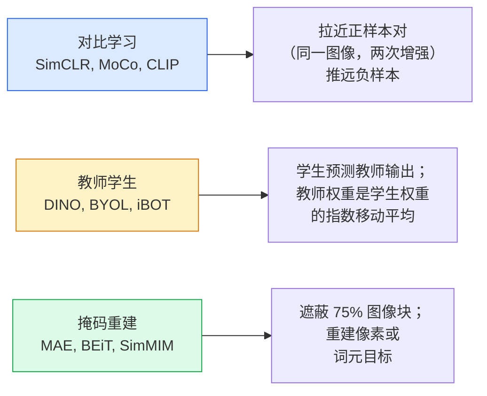

# 自监督视觉：SimCLR、DINO、MAE（Self-Supervised Vision — SimCLR, DINO, MAE）

> 标签是监督视觉的瓶颈。自监督预训练去掉了这一依赖：从 100M 张无标签图像学习视觉特征，再用 10k 张有标签图像微调。

**Type:** Learn + Build
**Languages:** Python
**Prerequisites:** 阶段 4 第 04 课（图像分类），阶段 4 第 14 课（视觉 Transformer）
**Time:** 约 75 分钟

## 学习目标（Learning Objectives）

- 梳理三类主要自监督方法：对比学习（SimCLR）、教师学生（DINO）、掩码重建（MAE），说明各自优化什么
- 从零实现 InfoNCE 损失，解释为什么批量大小 512 有效，而 32 会失败
- 解释 MAE 的 75% 遮蔽比例为何不是随意选择，以及它与 BERT 文本 15% 遮蔽比例的区别
- 使用 DINOv2 或 MAE 的 ImageNet 检查点进行线性探测与零样本检索

## 问题（The Problem）

监督式 ImageNet 有 1.3M 张标注图像，估计标注成本达 1000 万美元。医疗与工业数据集更小，标注却更贵。每个视觉团队都会问：能否先用便宜的无标签数据预训练，例如 YouTube 帧、网页抓取图像、网络摄像头录像、卫星扫描，再用小型有标签集微调？

自监督学习（Self-Supervised Learning，SSL）就是答案。在 LAION 或 JFT 上训练的现代自监督视觉 Transformer（Vision Transformer，ViT），微调后能达到或超过监督式 ImageNet 准确率。相比监督预训练，它向检测、分割、深度等下游任务的迁移也更好。DINOv2（Meta，2023）与掩码自编码器（Masked Autoencoder，MAE；Meta，2022）是当前可迁移视觉特征的生产默认选择。

观念变化在于，代理任务（Pretext Task），即模型在训练中要完成的任务，不必等同于下游任务。重要的是它必须迫使模型学习有用特征。预测灰度图颜色、旋转图像并分类旋转角度、遮蔽图像块再重建，都曾有效。能扩展到大规模的三类方法是对比学习、教师学生蒸馏与掩码重建。

## 概念（The Concept）

### 三类方法（Three families）



### 对比学习（Contrastive learning，SimCLR）

对一张图像应用两次随机增强，得到两个视图。让两者通过相同编码器与投影头。最小化这样一种损失：“这两个嵌入应接近”，“这个嵌入应远离批次中其他所有图像的嵌入”。

```
每批 2N 个视图中，正样本对 (z_i, z_j) 的损失：

   L_ij = -log( exp(sim(z_i, z_j) / tau) / sum_k in batch \ {i} exp(sim(z_i, z_k) / tau) )

sim = 余弦相似度
tau = 温度（标准值 0.1）
```

这就是 InfoNCE 损失。每个正样本需要很多负样本，因此批量大小很重要，SimCLR 需要 512-8192。MoCo 引入保存过去批次特征的动量队列（Momentum Queue），将负样本数量与批量大小解耦。

### 教师学生方法（Teacher-student，DINO）

两个同架构网络，分别是学生与教师。教师权重是学生权重的指数移动平均（Exponential Moving Average，EMA）。两者都接收图像增强视图。训练学生输出匹配教师输出，不使用显式负样本。

```
loss = CE( student_output(view_1),  teacher_output(view_2) )
     + CE( student_output(view_2),  teacher_output(view_1) )

teacher_weights = m * teacher_weights + (1 - m) * student_weights   (m ≈ 0.996)
```

为什么不会坍塌成“预测常数”：教师输出经过中心化（Centering），减去各维均值，以及锐化（Sharpening），除以较小温度。中心化防止某一维占主导，锐化防止输出坍塌为均匀分布。

DINOv2 将 DINO 扩展到 142M 张精选图像。得到的特征在零样本视觉检索与稠密预测中达到当前最优（State of the Art，SOTA）水平。

### 掩码重建（Masked reconstruction，MAE）

遮蔽 ViT 输入的 75% 图像块，只将可见的 25% 送入编码器。小型解码器接收编码器输出，以及放在遮蔽位置的掩码词元，训练目标是重建被遮蔽图像块的像素。

```
编码器：可见的 25% 图像块 -> 特征
解码器：特征 + 遮蔽位置的掩码词元 -> 重建像素
损失：仅在被遮蔽图像块上计算重建像素与原始像素的均方误差（MSE）
```

使 MAE 有效的关键设计：

- **75% 遮蔽比例（Mask ratio）**：比例很高，迫使编码器学习语义特征。如果只重建 25%，任务几乎过于简单，因为相邻像素高度相关，CNN 就能轻松完成。
- **非对称编码器与解码器（Asymmetric encoder/decoder）**：大型 ViT 编码器只看可见图像块；小型解码器，8 层、512 维，负责重建。预训练比朴素 BEiT 快 3 倍。
- **像素空间重建目标（Pixel-space reconstruction target）**：比 BEiT 的词元化目标更简单，在 ViT 上效果也更好。

预训练后丢弃解码器，编码器就是特征提取器。

### 为什么是 75%，而非 15%（Why 75% and not 15%）

BERT 遮蔽 15% 的词元，MAE 遮蔽 75%。区别在于信息密度。

- 自然语言每个词元的熵很高。即使只预测 15%，仍然很难，因为每个遮蔽位置都有很多合理补全。
- 图像块的熵较低，未遮蔽邻域通常几乎能精确确定被遮蔽块的像素。若要让预测必须依赖语义理解，就得大幅遮蔽。

75% 足够高，使简单空间外推无法解决任务，编码器必须表示图像内容。

### 线性探测评估（Linear-probe evaluation）

自监督预训练后，标准评估是**线性探测（Linear Probe）**：冻结编码器，在其特征上使用 ImageNet 标签训练单个线性分类器，报告 top-1 准确率。

- SimCLR ResNet-50：约 71%（2020 年）
- DINO ViT-S/16：约 77%（2021 年）
- MAE ViT-L/16：约 76%（2022 年）
- DINOv2 ViT-g/14：约 86%（2023 年）

线性探测纯粹衡量特征质量；微调通常增加 2-5 个百分点，但也混入了重新训练输出头的影响。

```figure
data-augmentation
```

## 动手构建（Build It）

### 第 1 步：双视图增强流水线（Step 1: Two-view augmentation pipeline）

```python
import torch
import torchvision.transforms as T

two_view_train = lambda: T.Compose([
    T.RandomResizedCrop(96, scale=(0.2, 1.0)),
    T.RandomHorizontalFlip(),
    T.ColorJitter(0.4, 0.4, 0.4, 0.1),
    T.RandomGrayscale(p=0.2),
    T.ToTensor(),
])


class TwoViewDataset(torch.utils.data.Dataset):
    def __init__(self, base):
        self.base = base
        self.aug = two_view_train()

    def __len__(self):
        return len(self.base)

    def __getitem__(self, i):
        img, _ = self.base[i]
        v1 = self.aug(img)
        v2 = self.aug(img)
        return v1, v2
```

每次 __getitem__ 返回同一图像的两个增强视图，不需要标签。

### 第 2 步：InfoNCE 损失（Step 2: InfoNCE loss）

```python
import torch.nn.functional as F

def info_nce(z1, z2, tau=0.1):
    """
    z1, z2: (N, D) L2-normalised embeddings of paired views
    """
    N, D = z1.shape
    z = torch.cat([z1, z2], dim=0)  # (2N, D)
    sim = z @ z.T / tau              # (2N, 2N)

    mask = torch.eye(2 * N, dtype=torch.bool, device=z.device)
    sim = sim.masked_fill(mask, float("-inf"))

    targets = torch.cat([torch.arange(N, 2 * N), torch.arange(0, N)]).to(z.device)
    return F.cross_entropy(sim, targets)
```

调用前对嵌入进行 L2 归一化。`tau=0.1` 是 SimCLR 默认值；温度越低，损失越尖锐，需要的负样本越多。

### 第 3 步：InfoNCE 基本检查（Step 3: Sanity check InfoNCE）

```python
z1 = F.normalize(torch.randn(16, 32), dim=-1)
z2 = z1.clone()
loss_same = info_nce(z1, z2, tau=0.1).item()
z2_random = F.normalize(torch.randn(16, 32), dim=-1)
loss_random = info_nce(z1, z2_random, tau=0.1).item()
print(f"InfoNCE with identical pairs:  {loss_same:.3f}")
print(f"InfoNCE with random pairs:     {loss_random:.3f}")
```

相同配对应产生较低损失，在大批量与低温度下接近 0。16 对样本的批次中，随机配对应产生 log(2N-1) = ~log(31) = ~3.4。

### 第 4 步：MAE 风格遮蔽（Step 4: MAE-style masking）

```python
def random_mask_indices(num_patches, mask_ratio=0.75, seed=0):
    g = torch.Generator().manual_seed(seed)
    n_keep = int(num_patches * (1 - mask_ratio))
    perm = torch.randperm(num_patches, generator=g)
    visible = perm[:n_keep]
    masked = perm[n_keep:]
    return visible.sort().values, masked.sort().values


num_patches = 196
visible, masked = random_mask_indices(num_patches, mask_ratio=0.75)
print(f"visible: {len(visible)} / {num_patches}")
print(f"masked:  {len(masked)} / {num_patches}")
```

简单、快速，给定种子后结果确定。实际 MAE 实现会批量处理，并为每个样本保留独立掩码。

## 实际使用（Use It）

DINOv2 是 2026 年的生产标准：

```python
import torch
from transformers import AutoImageProcessor, AutoModel

processor = AutoImageProcessor.from_pretrained("facebook/dinov2-base")
model = AutoModel.from_pretrained("facebook/dinov2-base")
model.eval()

# Per-image embeddings for zero-shot retrieval
with torch.no_grad():
    inputs = processor(images=[pil_image], return_tensors="pt")
    outputs = model(**inputs)
    embedding = outputs.last_hidden_state[:, 0]  # CLS token
```

生成的 768 维嵌入是现代图像检索、稠密对应和零样本迁移流水线的基础。下游任务微调很少需要超过一个线性头。

图文嵌入中的对应选择是 SigLIP 或 OpenCLIP；对于 MAE 风格微调，`timm` 仓库提供所有 MAE 检查点。

## 交付成果（Ship It）

本课产出：

- `outputs/prompt-ssl-pretraining-picker.md`：根据数据集规模、计算资源与下游任务选择 SimCLR / MAE / DINOv2 的提示词。
- `outputs/skill-linear-probe-runner.md`：为任意冻结编码器与有标签数据集编写线性探测评估的技能。

## 练习（Exercises）

1. **（简单）** 验证：对于对齐良好的嵌入，降低温度会使 InfoNCE 损失下降；对于随机嵌入，降低温度会使损失上升。绘制 `tau in [0.05, 0.1, 0.2, 0.5]` 与损失的关系图。
2. **（中等）** 实现 DINO 风格的中心缓冲区。展示没有中心化时，学生会在数轮内坍塌为常数向量。
3. **（困难）** 以第 10 课的 TinyUNet 为主干，在 CIFAR-100 上训练 MAE。报告第 10、50、200 轮的线性探测准确率。展示在同一包含 1,000 张图像的子集上，MAE 预训练后的线性探测优于从零监督训练的线性探测。

## 关键术语（Key Terms）

| 术语 | 常见说法 | 实际含义 |
|------|----------------|----------------------|
| 自监督（Self-supervised） | “无需标签” | 用代理任务从无标签数据产生有用表示 |
| 代理任务（Pretext task） | “替代任务” | 自监督学习期间使用的目标，例如重建图像块、匹配视图，预训练后丢弃 |
| 线性探测（Linear probe） | “冻结编码器加线性头” | 标准自监督评估，只在冻结特征上训练线性分类器 |
| InfoNCE | “对比损失” | 对余弦相似度做 softmax，正样本对作为目标类别，其余都是负样本 |
| 指数移动平均教师（EMA teacher） | “移动平均教师” | 教师权重是学生权重的指数移动平均，BYOL、MoCo、DINO 使用此方法 |
| 遮蔽比例（Mask ratio） | “隐藏图像块的百分比” | MAE 中被遮蔽图像块的占比，视觉为 75%，文本为 15% |
| 表示坍塌（Representation collapse） | “常数输出” | 编码器对所有输入输出同一常数向量的自监督失败，可用中心化、锐化或负样本防止 |
| DINOv2 | “生产自监督主干” | Meta 2023 年的自监督 ViT，2026 年最强的通用图像特征 |

## 延伸阅读（Further Reading）

- [SimCLR（Chen 等，2020）](https://arxiv.org/abs/2002.05709)：对比学习参考
- [DINO（Caron 等，2021）](https://arxiv.org/abs/2104.14294)：结合动量、中心化、锐化的教师学生方法
- [MAE（He 等，2022）](https://arxiv.org/abs/2111.06377)：ViT 的掩码自编码器预训练
- [DINOv2（Oquab 等，2023）](https://arxiv.org/abs/2304.07193)：将自监督 ViT 扩展为生产可用特征
