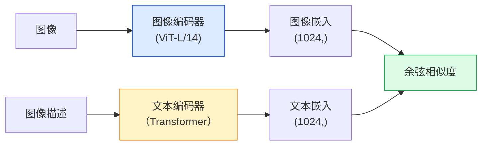

# 开放词汇视觉：CLIP（Open-Vocabulary Vision — CLIP）

> 联合训练图像编码器与文本编码器，让匹配的图像、描述对落在共享空间中的同一点。这就是全部技巧。

**Type:** Build + Use
**Languages:** Python
**Prerequisites:** 阶段 4 第 14 课（视觉 Transformer），阶段 4 第 17 课（自监督）
**Time:** 约 45 分钟

## 学习目标（Learning Objectives）

- 解释 CLIP 的双塔架构与对比训练目标
- 使用预训练 CLIP 或 SigLIP 进行零样本分类，不进行任何任务专用训练
- 从零实现零样本分类：编码类别提示词、计算余弦相似度、取最大值索引
- 区分 CLIP、SigLIP、OpenCLIP 与 LLaVA/LLaMA-vision 模型，理解它们在 2026 年的各自用途

## 问题（The Problem）

传统分类器采用封闭词汇（Closed Vocabulary）：1000 类 ImageNet 模型只能预测 1000 个标签。每增加一个类别，都需要标注数据并重新训练分类头。

对比语言图像预训练（Contrastive Language-Image Pre-training，CLIP；Radford 等，OpenAI，2021）表明，在网页抓取的 400M 对图像与描述上训练，可以得到一种模型：推理时仅用自然语言描述任意类别集合，就能进行分类。写一句话，就能给它增加一个新类别。

这种零样本迁移（Zero-Shot Transfer）能力，是每个现代视觉系统都从 CLIP 家族检查点开始的原因。检测（Grounding DINO、OWL-ViT）、分割（CLIPSeg、SAM）、检索、内容审核、视觉语言模型与文生图，都建立在 CLIP 风格联合嵌入之上。

## 概念（The Concept）

### 双塔（Two towers）



两个编码器都以线性投影结束，输出相同嵌入维度，CLIP-B/32 为 512，CLIP-L/14 为 1024。进行 L2 归一化后计算余弦相似度（Cosine Similarity）。

### 优化目标（The objective）

给定包含 N 对图像与描述的批次，构建 NxN 相似度矩阵。训练两个编码器，让对角线上的匹配对相似度高，非对角线的不匹配对相似度低。

```
sim_matrix = image_embeddings @ text_embeddings.T / tau

loss_i2t = cross_entropy(sim_matrix,       targets=arange(N))
loss_t2i = cross_entropy(sim_matrix.T,     targets=arange(N))
loss = (loss_i2t + loss_t2i) / 2
```

之所以对称，是因为图搜文与文搜图都应有效。`tau` 是温度（Temperature），通常作为标量参数学习，初始化为 0.07。

### SigLIP：更好的损失（SigLIP: a better loss）

SigLIP（Zhai 等，2023）用逐对 sigmoid 替换 softmax：

```
loss = 对所有配对的 log(1 + exp(-y_ij * sim_ij)) 取平均
y_ij = 匹配时为 +1，否则为 -1
```

逐对损失去掉了 CLIP 所需的批次级归一化。SigLIP 在小批量下训练更好，相同数据量时可匹配或超过 CLIP。

### 零样本分类（Zero-shot classification）

给定已训练的 CLIP：

1. 为每个类别编写提示词：“一张 {class} 的照片”。
2. 用文本编码器编码全部类别提示词 -> `T`，形状为 (C, d)。
3. 编码测试图像 -> `I`，形状为 (1, d)。
4. 相似度 = `I @ T.T`，形状为 (1, C)。
5. 取最大值索引（Argmax）-> 预测类别。

提示词工程（Prompt Engineering）很重要。OpenAI 为 ImageNet 发布了 80 个提示词模板，例如“一张 {} 的照片”“一张模糊的 {} 照片”“一幅 {} 的素描”等。对每个类别的全部模板嵌入取平均，可额外提高 1-3% 的 top-1 准确率。

### 2026 年 CLIP 风格模型的应用（Where CLIP-style models are used in 2026）

- **零样本分类（Zero-shot classification）**：直接使用。
- **图像检索（Image retrieval）**：一次性编码全部图像，推理时嵌入查询。
- **文本条件检测（Text-conditioned detection）**：Grounding DINO、OWL-ViT 为检测器接入 CLIP 文本塔。
- **文本条件分割（Text-conditioned segmentation）**：CLIPSeg；SAM 通过 CLIP 使用文本提示输入。
- **视觉语言模型（Vision-Language Model，VLM）**：LLaVA、Qwen-VL、InternVL 将 CLIP 家族视觉编码器连接到大语言模型（Large Language Model，LLM）。
- **文生图（Text-to-image generation）**：Stable Diffusion、DALL-E 3 以 CLIP 文本嵌入为条件。

一旦有了共享嵌入空间，每个视觉加语言任务都会变为距离计算。

```figure
clip-contrastive
```

## 动手构建（Build It）

### 第 1 步：微型双塔模型（Step 1: A tiny two-tower model）

真实 CLIP 是 ViT 加 Transformer。本课的两个塔是处理预提取特征的小型多层感知机（Multilayer Perceptron，MLP），便于在 CPU 上观察训练信号。

```python
import torch
import torch.nn as nn
import torch.nn.functional as F


class TwoTower(nn.Module):
    def __init__(self, img_in=128, txt_in=64, emb=64):
        super().__init__()
        self.image_proj = nn.Sequential(nn.Linear(img_in, 128), nn.ReLU(), nn.Linear(128, emb))
        self.text_proj = nn.Sequential(nn.Linear(txt_in, 128), nn.ReLU(), nn.Linear(128, emb))
        self.logit_scale = nn.Parameter(torch.ones([]) * 2.6592)  # ln(1/0.07)

    def forward(self, img_feats, txt_feats):
        i = F.normalize(self.image_proj(img_feats), dim=-1)
        t = F.normalize(self.text_proj(txt_feats), dim=-1)
        return i, t, self.logit_scale.exp()
```

两个投影、相同维度输出、可学习温度，接口形状与真实 CLIP API 一致。

### 第 2 步：对比损失（Step 2: Contrastive loss）

```python
def clip_loss(image_emb, text_emb, logit_scale):
    N = image_emb.size(0)
    sim = logit_scale * image_emb @ text_emb.T
    targets = torch.arange(N, device=sim.device)
    l_i = F.cross_entropy(sim, targets)
    l_t = F.cross_entropy(sim.T, targets)
    return (l_i + l_t) / 2
```

损失对称。logit_scale 越高，softmax 越尖锐，置信度越高，但也有不稳定风险。

### 第 3 步：零样本分类器（Step 3: Zero-shot classifier）

```python
@torch.no_grad()
def zero_shot_classify(model, image_feats, class_text_feats, class_names):
    """
    image_feats:      (N, img_in)
    class_text_feats: (C, txt_in)   one averaged embedding per class
    """
    i = F.normalize(model.image_proj(image_feats), dim=-1)
    t = F.normalize(model.text_proj(class_text_feats), dim=-1)
    sim = i @ t.T
    pred = sim.argmax(dim=-1)
    return [class_names[p] for p in pred.tolist()]
```

每一步一行。这正是生产 CLIP 检查点使用的零样本流程。

### 第 4 步：基本检查（Step 4: Sanity check）

```python
torch.manual_seed(0)
model = TwoTower()

img = torch.randn(8, 128)
txt = torch.randn(8, 64)
i, t, scale = model(img, txt)
loss = clip_loss(i, t, scale)
print(f"batch size: {i.size(0)}   loss: {loss.item():.3f}")
```

随机初始化模型的损失应接近 `log(N) = log(8) = 2.08`，这是尚未学到结构时的对称交叉熵目标值。

## 实际使用（Use It）

OpenCLIP 是 2026 年社区的默认选择：

```python
import open_clip
import torch
from PIL import Image

model, _, preprocess = open_clip.create_model_and_transforms("ViT-B-32", pretrained="laion2b_s34b_b79k")
tokenizer = open_clip.get_tokenizer("ViT-B-32")

image = preprocess(Image.open("dog.jpg")).unsqueeze(0)
text = tokenizer(["a photo of a dog", "a photo of a cat", "a photo of a car"])

with torch.no_grad():
    image_features = model.encode_image(image)
    text_features = model.encode_text(text)
    image_features = image_features / image_features.norm(dim=-1, keepdim=True)
    text_features = text_features / text_features.norm(dim=-1, keepdim=True)
    probs = (100.0 * image_features @ text_features.T).softmax(dim=-1)

print(probs)
```

SigLIP 更新，在小规模下训练更好，新工作优先选择它：`google/siglip-base-patch16-224`。Hugging Face 提供两者。

## 交付成果（Ship It）

本课产出：

- `outputs/prompt-zero-shot-class-picker.md`：根据类别列表与领域，为零样本 CLIP 设计类别模板的提示词。
- `outputs/skill-image-text-retriever.md`：使用任意 CLIP 检查点构建图像嵌入索引的技能，支持文本查询与图像查询。

## 练习（Exercises）

1. **（简单）** 使用预训练 OpenCLIP ViT-B/32 与 80 模板提示词集，在 CIFAR-10 上进行零样本分类。报告 top-1 准确率，应约为 85-90%。
2. **（中等）** 在相同 CIFAR-10 任务上，比较单模板“一张 {} 的照片”与 80 模板平均嵌入。量化差距，解释模板为何有效。
3. **（困难）** 构建零样本图像检索索引：用 CLIP 嵌入 1,000 张图像，建立 FAISS 索引，用自然语言描述查询。手工编写 20 个留出查询，报告检索 recall@5。

## 关键术语（Key Terms）

| 术语 | 常见说法 | 实际含义 |
|------|----------------|----------------------|
| 双塔（Two-tower） | “双编码器” | 独立图像与文本编码器，以相同维度的投影头结束 |
| 零样本（Zero-shot） | “无需任务专用训练” | 推理时仅根据文本描述的类别分类，不使用标签 |
| 温度 / logit_scale（Temperature / logit_scale） | “tau” | 在 softmax 前缩放相似度矩阵的可学习标量 |
| 提示词模板（Prompt template） | “一张 {} 的照片” | 用自然语言包裹类别名，平均多个模板可提高零样本准确率 |
| 对比语言图像预训练（CLIP） | “图文模型” | OpenAI 2021 年模型，也是 2026 年该领域的通用术语 |
| SigLIP | “采用 sigmoid 的 CLIP” | 用逐对 sigmoid 替换 softmax，小批量训练更好 |
| OpenCLIP | “开放复现” | 社区在 LAION 上训练的 CLIP 变体，是开源流水线的生产默认选择 |
| 视觉语言模型（Vision-Language Model，VLM） | “视觉加语言模型” | CLIP 家族编码器加 LLM，训练后回答图像相关问题 |

## 延伸阅读（Further Reading）

- [CLIP：从自然语言监督学习可迁移视觉模型（Radford 等，2021）](https://arxiv.org/abs/2103.00020)
- [SigLIP：用于语言图像预训练的 Sigmoid 损失（Zhai 等，2023）](https://arxiv.org/abs/2303.15343)
- [OpenCLIP](https://github.com/mlfoundations/open_clip)：社区代码库
- [DINOv2、CLIP 与 MAE 特征比较](https://huggingface.co/blog/dinov2)：Hugging Face 指南，并列展示使用场景
