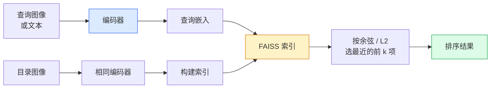

# 图像检索与度量学习（Image Retrieval & Metric Learning）

> 检索系统依据嵌入空间中的距离对候选项排序。度量学习研究如何塑造这个空间，让距离表达你所需的含义。

**Type:** Build
**Languages:** Python
**Prerequisites:** 阶段 4 第 14 课（视觉 Transformer），阶段 4 第 18 课（CLIP）
**Time:** 约 45 分钟

## 学习目标（Learning Objectives）

- 解释三元组、对比与基于代理的度量学习损失，并为给定数据集选择合适方法
- 正确实现 L2 归一化与余弦相似度，审视“同一物品”和“同一类别”检索的区别
- 构建 FAISS 索引，通过文本与图像查询，报告留出查询集的 recall@K
- 使用 DINOv2、CLIP、SigLIP 作为现成嵌入主干，理解各自优势场景

## 问题（The Problem）

生产视觉中检索无处不在：重复检测、反向图像搜索、视觉搜索，例如“寻找相似商品”、人脸重识别、监控中的行人重识别、电商中的实例级匹配。产品问题始终相同：“给定这张查询图像，对我的目录排序”。

两个设计决策决定整个系统。嵌入，即由什么模型生成向量；索引，即如何大规模寻找最近邻。2026 年两者都已成为成熟基础组件，嵌入用 DINOv2，索引用 FAISS，因此要求也更高：难点是定义你的应用中*什么算相似*，再塑造嵌入空间，让距离与定义一致。

这就是度量学习（Metric Learning）。它范围不大，却能带来显著效果。

## 概念（The Concept）

### 检索概览（Retrieval at a glance）



### 四类损失（The four loss families）

| 损失 | 所需数据 | 优点 | 缺点 |
|------|----------|------|------|
| **对比损失（Contrastive）** | 锚点、正样本对，加负样本 | 简单，适用于任意成对标签 | 负样本不足时收敛慢 |
| **三元组损失（Triplet）** | 锚点、正样本、负样本三元组 | 直观，可直接控制间隔 | 困难三元组挖掘成本高 |
| **NT-Xent / InfoNCE** | 样本对与批次内挖掘的负样本 | 可扩展到大批量 | 需要大批量或动量队列 |
| **基于代理的损失（Proxy-based，ProxyNCA）** | 仅类别标签 | 快、稳定、无需挖掘 | 小数据集上可能对代理过拟合 |

多数生产场景应从预训练主干开始，只有现成嵌入在测试集上表现不足时，才增加度量学习微调。

### 三元组损失的形式化定义（Triplet loss formally）

```
L = max(0, ||f(a) - f(p)||^2 - ||f(a) - f(n)||^2 + margin)
```

将锚点 `a` 拉近正样本 `p`，推离负样本 `n`，并通过 `margin` 保证间隔。三图结构可以推广到任意相似度排序。

挖掘很重要：简单三元组中 `n` 已远离 `a`，损失为零；只有困难三元组才能教会网络。半困难挖掘（Semi-hard Mining）选择比 `p` 更远、但仍在间隔范围内的 `n`，是 2016 年 FaceNet 的方案，至今仍占主导。

### 余弦相似度与 L2（Cosine similarity vs L2）

两种度量，两种约定：

- **余弦（Cosine）**：向量间夹角，要求 L2 归一化嵌入。
- **L2**：欧氏距离（Euclidean Distance）。可用于原始或归一化嵌入，但通常采用 L2 归一化加平方 L2。

对多数现代网络，两者等价：当 `||a|| = ||b|| = 1` 时，`||a - b||^2 = 2 - 2 cos(a, b)`。选择与嵌入训练匹配的约定；混用会静默改变“最近”的含义。

### 前 K 项召回率（Recall@K）

标准检索指标：

```
recall@K = 前 K 个结果中至少有一个正确匹配的查询占比
```

并列报告 recall@1、@5、@10。recall@10 高于 0.95，而 recall@1 低于 0.5，说明嵌入空间结构正确，但排序噪声较大，可尝试更长微调或重排序（Re-ranking）。

重复检测更重视 precision@K，因为每个假阳性都是用户可见的错误。视觉搜索则以 recall@K 作为产品信号。

### 一段话理解 FAISS（FAISS in one paragraph）

Facebook 人工智能相似度搜索（Facebook AI Similarity Search，FAISS）是最近邻搜索的事实标准库。有三种索引选择：

- `IndexFlatIP` / `IndexFlatL2`：暴力、精确、无需训练，适合约 1M 个向量以内。
- `IndexIVFFlat`：分成 K 个单元，只搜索最近的几个单元。近似、快速，需要训练数据。
- `IndexHNSW`：基于图，多查询时最快，索引较大。

100k 个向量通常可用 `IndexFlatIP` 做余弦相似度检索。10M 个用 `IndexIVFFlat`。100M 以上结合乘积量化（Product Quantization），即 `IndexIVFPQ`。

### 实例级与类别级检索（Instance-level vs category-level retrieval）

同名之下是两个很不一样的问题：

- **类别级（Category-level）**：“在目录中找猫”。基于类别的相似性，现成 CLIP / DINOv2 嵌入表现良好。
- **实例级（Instance-level）**：“在目录中找到*这一件具体商品*”。需要细粒度区分同类别中外观相似的物体；现成嵌入表现不足，度量学习微调很重要。

选模型前，始终先问清楚解决哪一种问题。

```figure
metric-embedding
```

## 动手构建（Build It）

### 第 1 步：三元组损失（Step 1: Triplet loss）

```python
import torch
import torch.nn.functional as F

def triplet_loss(anchor, positive, negative, margin=0.2):
    d_ap = F.pairwise_distance(anchor, positive, p=2)
    d_an = F.pairwise_distance(anchor, negative, p=2)
    return F.relu(d_ap - d_an + margin).mean()
```

一行即可，适用于 L2 归一化或原始嵌入。

### 第 2 步：半困难挖掘（Step 2: Semi-hard mining）

给定一批嵌入与标签，为每个锚点寻找最困难的半困难负样本。

```python
def semi_hard_negatives(emb, labels, margin=0.2):
    dist = torch.cdist(emb, emb)
    same_class = labels[:, None] == labels[None, :]
    diff_class = ~same_class
    N = emb.size(0)

    positives = dist.clone()
    positives[~same_class] = float("-inf")
    positives.fill_diagonal_(float("-inf"))
    pos_idx = positives.argmax(dim=1)

    semi_hard = dist.clone()
    semi_hard[same_class] = float("inf")
    d_ap = dist[torch.arange(N), pos_idx].unsqueeze(1)
    semi_hard[dist <= d_ap] = float("inf")
    neg_idx = semi_hard.argmin(dim=1)

    fallback_mask = semi_hard[torch.arange(N), neg_idx] == float("inf")
    if fallback_mask.any():
        hardest = dist.clone()
        hardest[same_class] = float("inf")
        neg_idx = torch.where(fallback_mask, hardest.argmin(dim=1), neg_idx)
    return pos_idx, neg_idx
```

每个锚点得到同类中最困难的正样本，以及比正样本更远但仍在间隔内的半困难负样本。

### 第 3 步：前 K 项召回率（Step 3: Recall@K）

```python
def recall_at_k(query_emb, gallery_emb, query_labels, gallery_labels, k=1):
    sim = query_emb @ gallery_emb.T
    _, top_k = sim.topk(k, dim=-1)
    matches = (gallery_labels[top_k] == query_labels[:, None]).any(dim=-1)
    return matches.float().mean().item()
```

L2 归一化嵌入按内积取 top-k，等价于按余弦相似度取 top-k。报告至少有一个正确邻居的查询所占平均比例。

### 第 4 步：整合（Step 4: Putting it together）

```python
import torch
import torch.nn as nn
from torch.optim import Adam

class Encoder(nn.Module):
    def __init__(self, in_dim=128, emb_dim=64):
        super().__init__()
        self.net = nn.Sequential(
            nn.Linear(in_dim, 128), nn.ReLU(),
            nn.Linear(128, emb_dim),
        )

    def forward(self, x):
        return F.normalize(self.net(x), dim=-1)

torch.manual_seed(0)
num_classes = 6
protos = F.normalize(torch.randn(num_classes, 128), dim=-1)

def sample_batch(bs=32):
    labels = torch.randint(0, num_classes, (bs,))
    x = protos[labels] + 0.15 * torch.randn(bs, 128)
    return x, labels

enc = Encoder()
opt = Adam(enc.parameters(), lr=3e-3)

for step in range(200):
    x, y = sample_batch(32)
    emb = enc(x)
    pos_idx, neg_idx = semi_hard_negatives(emb, y)
    loss = triplet_loss(emb, emb[pos_idx], emb[neg_idx])
    opt.zero_grad(); loss.backward(); opt.step()
```

数百步之后，嵌入会按类别形成簇，每类一簇。

## 实际使用（Use It）

2026 年生产技术栈：

- **DINOv2 + FAISS**：通用视觉检索，开箱即用。
- **CLIP + FAISS**：查询为文本时使用。
- **微调 DINOv2 + FAISS**：实例级检索、人脸重识别、时尚、电商。
- **Milvus / Weaviate / Qdrant**：围绕 FAISS 或 HNSW 封装的托管向量数据库。

要实现当前最优（State of the Art，SOTA）的实例检索，方案是：DINOv2 主干、增加嵌入头，在实例标注样本对上用三元组或 InfoNCE 损失微调，再用 FAISS 建索引。

## 交付成果（Ship It）

本课产出：

- `outputs/prompt-retrieval-loss-picker.md`：为给定检索问题选择三元组 / InfoNCE / ProxyNCA 的提示词。
- `outputs/skill-recall-at-k-runner.md`：编写清晰 recall@K 评估框架的技能，包含训练集、验证集、候选库划分与适当数据契约。

## 练习（Exercises）

1. **（简单）** 运行上述玩具示例。训练前后使用主成分分析（Principal Component Analysis，PCA）绘制嵌入，观察六个簇形成。
2. **（中等）** 增加 ProxyNCA 损失实现：每类一个可学习“代理”，对余弦相似度使用标准交叉熵。在玩具数据上比较它与三元组损失的收敛速度。
3. **（困难）** 取 1,000 张 ImageNet 验证图像，通过 Hugging Face 使用 DINOv2 嵌入，构建 FAISS 平坦索引。分别以相同图像为查询，应为 1.0，以及以留出划分为查询、ImageNet 标签为真值，报告 recall@{1, 5, 10}。

## 关键术语（Key Terms）

| 术语 | 常见说法 | 实际含义 |
|------|----------------|----------------------|
| 度量学习（Metric learning） | “塑造空间” | 训练编码器，让输出空间距离反映目标相似性 |
| 三元组损失（Triplet loss） | “拉近与推远” | L = max(0, d(a, p) - d(a, n) + margin)，经典度量学习损失 |
| 半困难挖掘（Semi-hard mining） | “有用负样本” | 比正样本离锚点更远、但仍在间隔内的负样本，经验上信息量最大 |
| 基于代理的损失（Proxy-based loss） | “类别原型” | 每类一个可学习代理，对与代理的相似度做交叉熵，无需样本对挖掘 |
| 前 K 项召回率（Recall@K） | “前 K 项命中率” | 前 K 项至少含一个正确结果的查询占比 |
| 实例检索（Instance retrieval） | “找这一个具体对象” | 细粒度匹配，现成特征通常表现不足 |
| FAISS | “最近邻库” | Facebook 的最近邻（Nearest Neighbour，NN）库，支持精确与近似索引 |
| 分层可导航小世界图（Hierarchical Navigable Small World，HNSW） | “图索引” | 以较小内存开销实现快速近似最近邻搜索 |

## 延伸阅读（Further Reading）

- [FaceNet：用于人脸识别的统一嵌入（Schroff 等，2015）](https://arxiv.org/abs/1503.03832)：三元组损失与半困难挖掘论文
- [为行人重识别中的三元组损失辩护（Hermans 等，2017）](https://arxiv.org/abs/1703.07737)：三元组微调实用指南
- [FAISS 文档](https://github.com/facebookresearch/faiss/wiki)：各类索引与权衡
- [SMoT：度量学习分类体系（Kim 等，2021）](https://arxiv.org/abs/2010.06927)：现代损失及相互联系综述
