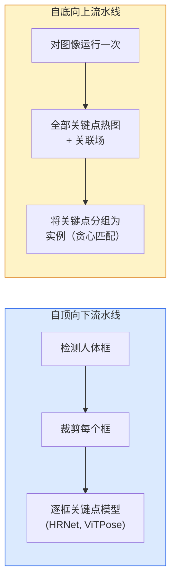

# 关键点检测与姿态估计（Keypoint Detection & Pose Estimation）

> 姿态是一组有序关键点。关键点检测器是热图回归器。其余工作都是组织与管理。

**Type:** Build
**Languages:** Python
**Prerequisites:** 阶段 4 第 06 课（检测），阶段 4 第 07 课（U-Net）
**Time:** 约 45 分钟

## 学习目标（Learning Objectives）

- 区分自顶向下与自底向上的姿态估计，说明各自适用场景
- 以每个关键点一个高斯分布为目标，回归 K 个关键点热图，并在推理时提取坐标
- 解释部件亲和场（Part Affinity Fields，PAFs），以及自底向上流水线如何将关键点关联为实例
- 使用 MediaPipe Pose 或 MMPose 进行生产关键点估计，理解输出格式

## 问题（The Problem）

关键点任务有很多名称：人体姿态，17 个身体关节；面部标志点，68 或 478 个点；手部，21 个点；动物姿态、机器人目标姿态、医学解剖标志点。它们结构相同：检测物体上的 K 个离散点，输出其 (x, y) 坐标。

姿态估计（Pose Estimation）是动作捕捉、健身应用、体育分析、手势控制、动画、增强现实（Augmented Reality，AR）试穿与机器人抓取的基础。二维情况已成熟；三维姿态，即由单相机估计世界坐标中的关节位置，是当前研究前沿。

工程问题在于规模。单张图像、单人姿态是一个 20 毫秒级问题。在人群中以每秒 30 帧估计多人姿态，则是需要不同架构的另一问题。

## 概念（The Concept）

### 自顶向下与自底向上（Top-down vs bottom-up）



- **自顶向下（Top-down）**：先检测人，再对每个人的裁剪图运行关键点模型。准确率最高，成本随人数线性增长。
- **自底向上（Bottom-up）**：一次前向传播预测全部关键点与关联场，再分组。无论人群规模如何，时间都恒定。

自顶向下方法 HRNet、ViTPose 在准确率上领先；自底向上方法 OpenPose、HigherHRNet 在拥挤场景的吞吐量上领先。

### 热图回归（Heatmap regression）

不直接回归 `(x, y)`，而是为每个关键点预测一张 `H x W` 热图（Heatmap），其高斯峰以真实位置为中心。

```
target[k, y, x] = exp(-((x - cx_k)^2 + (y - cy_k)^2) / (2 sigma^2))
```

推理时，每张热图的最大值索引（Argmax）就是预测关键点位置。

热图为何优于直接回归：网络的空间结构，即卷积特征图，与空间输出自然对齐。高斯目标也有正则化作用，小定位误差产生小损失，而非零损失。

### 亚像素定位（Sub-pixel localisation）

Argmax 给出整数坐标。要达到亚像素精度，可用最大值位置及邻点拟合抛物线进行细化，或采用常见偏移 `(dx, dy) = 0.25 * (heatmap[y, x+1] - heatmap[y, x-1], ...)` 的方向。

### 部件亲和场（Part Affinity Fields，PAFs）

这是 OpenPose 进行自底向上关联的技巧。对每对相连关键点，例如左肩到左肘，预测双通道场，编码从一个点指向另一个点的单位向量。要将肩与对应肘关联，沿候选点对连线积分 PAF，匹配积分最高的点对。

```
对每个连接（肢体）：
  PAF 通道：2（单位向量 x, y）
  线积分：对采样点的 (PAF . line_direction) 求和
  积分越高 = 匹配越强
```

方法简洁，不需要逐人裁剪，就能扩展到任意人群规模。

### COCO 关键点（COCO keypoints）

标准人体姿态数据集，每人 17 个关键点，以正确关键点百分比（Percentage of Correct Keypoints，PCK）与目标关键点相似度（Object Keypoint Similarity，OKS）为指标。OKS 相当于关键点领域的交并比（Intersection over Union，IoU），也是 COCO mAP@OKS 使用的指标。

### 二维与三维（2D vs 3D）

- **二维姿态（2D pose）**：图像坐标，已达到生产质量，例如 MediaPipe、HRNet、ViTPose。
- **三维姿态（3D pose）**：世界或相机坐标，仍是活跃研究方向。常见方法：
  - 用小型多层感知机（Multilayer Perceptron，MLP）将二维预测提升到三维，例如 VideoPose3D。
  - 从图像直接回归三维，例如 PyMAF、MHFormer。
  - 使用多视角设备获取真值，例如 CMU Panoptic。

```figure
cv3-pose-heatmap
```

## 动手构建（Build It）

### 第 1 步：高斯热图目标（Step 1: Gaussian heatmap target）

```python
import numpy as np
import torch

def gaussian_heatmap(size, cx, cy, sigma=2.0):
    yy, xx = np.meshgrid(np.arange(size), np.arange(size), indexing="ij")
    return np.exp(-((xx - cx) ** 2 + (yy - cy) ** 2) / (2 * sigma ** 2)).astype(np.float32)

hm = gaussian_heatmap(64, 32, 32, sigma=2.0)
print(f"peak: {hm.max():.3f} at ({hm.argmax() % 64}, {hm.argmax() // 64})")
```

将每个关键点的热图沿通道轴堆叠，得到完整目标张量。

### 第 2 步：微型关键点头（Step 2: Tiny keypoint head）

输出 K 个热图通道的 U-Net 风格模型。

```python
import torch.nn as nn
import torch.nn.functional as F

class TinyKeypointNet(nn.Module):
    def __init__(self, num_keypoints=4, base=16):
        super().__init__()
        self.down1 = nn.Sequential(nn.Conv2d(3, base, 3, 2, 1), nn.ReLU(inplace=True))
        self.down2 = nn.Sequential(nn.Conv2d(base, base * 2, 3, 2, 1), nn.ReLU(inplace=True))
        self.mid = nn.Sequential(nn.Conv2d(base * 2, base * 2, 3, 1, 1), nn.ReLU(inplace=True))
        self.up1 = nn.ConvTranspose2d(base * 2, base, 2, 2)
        self.up2 = nn.ConvTranspose2d(base, num_keypoints, 2, 2)

    def forward(self, x):
        h1 = self.down1(x)
        h2 = self.down2(h1)
        h3 = self.mid(h2)
        u1 = self.up1(h3)
        return self.up2(u1)
```

输入为 `(N, 3, H, W)`，输出为 `(N, K, H, W)`。损失是相对于高斯目标的逐像素均方误差（Mean Squared Error，MSE）。

### 第 3 步：推理，提取关键点坐标（Step 3: Inference — extract keypoint coordinates）

```python
def heatmap_to_coords(heatmaps):
    """
    heatmaps: (N, K, H, W)
    returns:  (N, K, 2) float coordinates in image pixels
    """
    N, K, H, W = heatmaps.shape
    hm = heatmaps.reshape(N, K, -1)
    idx = hm.argmax(dim=-1)
    ys = (idx // W).float()
    xs = (idx % W).float()
    return torch.stack([xs, ys], dim=-1)

coords = heatmap_to_coords(torch.randn(2, 4, 32, 32))
print(f"coords: {coords.shape}")  # (2, 4, 2)
```

推理时一行即可。要进行亚像素细化，可在最大值位置周围插值。

### 第 4 步：合成关键点数据集（Step 4: Synthetic keypoint dataset）

很简单：在白色画布上画四个点，学习预测它们。

```python
def make_synthetic_sample(size=64):
    img = np.ones((3, size, size), dtype=np.float32)
    rng = np.random.default_rng()
    kps = rng.integers(8, size - 8, size=(4, 2))
    for cx, cy in kps:
        img[:, cy - 2:cy + 2, cx - 2:cx + 2] = 0.0
    hms = np.stack([gaussian_heatmap(size, cx, cy) for cx, cy in kps])
    return img, hms, kps
```

足够简单，微型模型一分钟即可学会。

### 第 5 步：训练（Step 5: Training）

```python
model = TinyKeypointNet(num_keypoints=4)
opt = torch.optim.Adam(model.parameters(), lr=3e-3)

for step in range(200):
    batch = [make_synthetic_sample() for _ in range(16)]
    imgs = torch.from_numpy(np.stack([b[0] for b in batch]))
    hms = torch.from_numpy(np.stack([b[1] for b in batch]))
    pred = model(imgs)
    # Upsample pred to full resolution
    pred = F.interpolate(pred, size=hms.shape[-2:], mode="bilinear", align_corners=False)
    loss = F.mse_loss(pred, hms)
    opt.zero_grad(); loss.backward(); opt.step()
```

## 实际使用（Use It）

- **MediaPipe Pose**：Google 的生产姿态估计器，提供 WebGL 与移动运行时，延迟低于 10 毫秒。
- **MMPose**（OpenMMLab）：全面的研究代码库，提供各类当前最优（State of the Art，SOTA）架构与预训练权重。
- **YOLOv8-pose**：单次前向传播实现最快的实时多人姿态估计。
- **transformers HumanDPT / PoseAnything**：较新的视觉语言方法，支持开放词汇姿态，即任意物体、任意关键点集合。

## 交付成果（Ship It）

本课产出：

- `outputs/prompt-pose-stack-picker.md`：根据延迟、人群规模及二维或三维需求，选择 MediaPipe / YOLOv8-pose / HRNet / ViTPose 的提示词。
- `outputs/skill-heatmap-to-coords.md`：编写各生产姿态模型使用的亚像素热图转坐标程序的技能。

## 练习（Exercises）

1. **（简单）** 在合成四点数据集上训练微型关键点模型。报告 200 步后预测关键点与真值之间的平均 L2 误差。
2. **（中等）** 增加亚像素细化：给定最大值位置，利用邻近像素分别沿 x、y 拟合一维抛物线。报告相对整数 argmax 的准确率增益。
3. **（困难）** 构建双人合成数据集，每张图像展示两个四关键点图案实例。训练带 PAF 的自底向上流水线，预测各关键点归属哪个实例，并评估 OKS。

## 关键术语（Key Terms）

| 术语 | 常见说法 | 实际含义 |
|------|----------------|----------------------|
| 关键点（Keypoint） | “标志点” | 物体上具有指定顺序的点，例如关节、角点、特征点 |
| 姿态（Pose） | “骨架” | 属于同一实例的有序关键点集合 |
| 自顶向下（Top-down） | “先检测再估计姿态” | 人体检测器加逐裁剪关键点模型的两阶段流水线，准确率最高 |
| 自底向上（Bottom-up） | “先姿态后分组” | 单次预测全部关键点再分组，耗时不随人数变化 |
| 热图（Heatmap） | “高斯目标” | 每关键点一张 H x W 张量，峰值位于真实位置，是优选回归目标 |
| 部件亲和场（PAF） | “部件之间的关联场” | 编码肢体方向的双通道单位向量场，用于将关键点分组为实例 |
| 目标关键点相似度（OKS） | “关键点 IoU” | COCO 的姿态评估指标 |
| 高分辨率网络（High-Resolution Net，HRNet） | “高分辨率网络” | 主流自顶向下关键点架构，全程保留高分辨率特征 |

## 延伸阅读（Further Reading）

- [OpenPose（Cao 等，2017）](https://arxiv.org/abs/1812.08008)：使用 PAF 的自底向上方法，仍是该方法的最佳讲解
- [HRNet（Sun 等，2019）](https://arxiv.org/abs/1902.09212)：自顶向下参考架构
- [ViTPose（Xu 等，2022）](https://arxiv.org/abs/2204.12484)：以普通 ViT 为姿态主干，在许多基准上达到当前最优水平
- [MediaPipe Pose](https://developers.google.com/mediapipe/solutions/vision/pose_landmarker)：生产实时姿态估计，2026 年最快的已部署技术栈
