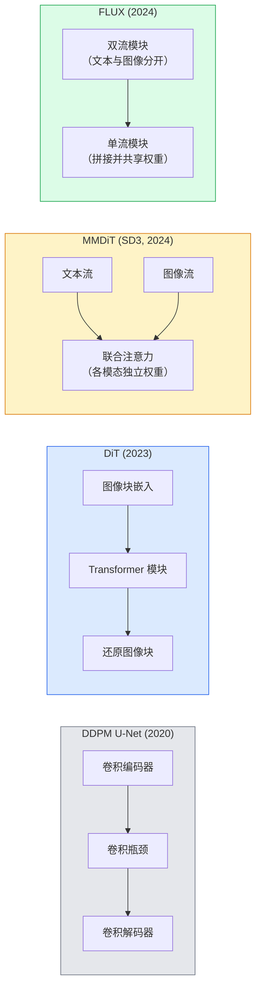

# 扩散 Transformer 与整流流（Diffusion Transformers & Rectified Flow）

> U-Net 并非扩散的秘诀。将它换成 Transformer，将噪声调度换成直线流，就得到了 SD3、FLUX 以及 2026 年的各类文生图模型。

**Type:** Learn + Build
**Languages:** Python
**Prerequisites:** 阶段 4 第 10 课（扩散 DDPM），阶段 4 第 14 课（视觉 Transformer），阶段 7 第 02 课（自注意力）
**Time:** 约 75 分钟

## 学习目标（Learning Objectives）

- 梳理从 U-Net DDPM（第 10 课）到扩散 Transformer（Diffusion Transformer，DiT）、MMDiT（SD3）、单双流 DiT（FLUX）的演进
- 解释整流流：为什么噪声与数据之间的直线轨迹，让模型只需 20 步而非 1000 步采样
- 实现微型 DiT 模块与整流流训练循环，两者分别不超过 100 行
- 从架构、参数量与许可区分 SD3、FLUX.1-dev、FLUX.1-schnell、Z-Image、Qwen-Image 等变体

## 问题（The Problem）

第 10 课构建了以 U-Net 为去噪器的去噪扩散概率模型（Denoising Diffusion Probabilistic Model，DDPM）。这套 U-Net、beta 调度、噪声预测损失的方案主导了 2020-2023 年，产生 Stable Diffusion 1.5、2.1 与 DALL-E 2。

2026 年的所有最先进文生图模型都已超越它。Stable Diffusion 3、FLUX、SD4、Z-Image、Qwen-Image、Hunyuan-Image 都不使用 U-Net，而使用 DiT。SD3 与 FLUX 还用整流流（Rectified Flow）替换 DDPM 噪声调度，将噪声到数据的路径拉直，并通过一致性或蒸馏变体实现 1-4 步推理。

这一转变重要，因为它让扩散图像生成变得可控、准确遵循提示词，SD3/SD4 解决了文字渲染，并达到生产所需速度。理解 DiT 加整流流，就是理解 2026 年生成式图像技术栈。

## 概念（The Concept）

### 从 U-Net 到 Transformer（From U-Net to transformer）



- **DiT**（Peebles 与 Xie，2023）：用在潜变量图像块上运行的类 ViT Transformer 替换 U-Net，通过自适应层归一化（Adaptive Layer Normalization，AdaLN）注入条件。
- **多模态扩散 Transformer（MMDiT）**（SD3，Esser 等，2024）：文本与图像词元各有独立权重流，共享联合注意力。
- **FLUX**（Black Forest Labs，2024）：前 N 个模块采用类似 SD3 的双流，后续模块拼接并共享权重，形成单流，以提高较深层的效率。
- **Z-Image**（2025）：6B 参数的高效单流 DiT，挑战“不惜代价扩大规模”的思路。

### 一段话理解整流流（Rectified flow in one paragraph）

DDPM 将前向过程定义为带噪声的随机微分方程（Stochastic Differential Equation，SDE），`x_t` 逐渐被破坏。学习得到的反向过程是另一个 SDE，用 1000 个小步求解。

整流流在干净数据与纯噪声之间定义**直线插值**：

```
x_t = (1 - t) * x_0 + t * epsilon,     t in [0, 1]
```

训练网络预测速度 `v_theta(x_t, t) = epsilon - x_0`，即沿干净数据到噪声直线路径的前向方向（`dx_t/dt`）。采样时反向积分该速度，从噪声向数据移动。得到的常微分方程（Ordinary Differential Equation，ODE）轨迹更接近直线，因此采样所需积分步数少得多。

SD3 称其为**整流流匹配（Rectified Flow Matching）**。FLUX、Z-Image 与大多数 2026 年模型采用相同目标。典型推理为 20-30 个确定性的欧拉步，而旧 DDPM 体系需要 50 步以上 DDIM。蒸馏、turbo、schnell、LCM 变体进一步降至 1-4 步。

### AdaLN 条件注入（AdaLN conditioning）

DiT 通过**自适应层归一化**注入时间步与类别或文本条件：根据条件向量预测 `scale` 与 `shift`，在 LayerNorm 后应用。比 U-Net 的特征级线性调制（Feature-wise Linear Modulation，FiLM）风格调制更简洁，是现代 DiT 的默认方案。

```
cond -> MLP -> (scale, shift, gate)
norm(x) * (1 + scale) + shift，随后乘以 gate 再做残差相加
```

### SD3 与 FLUX 的文本编码器（Text encoders in SD3 and FLUX）

- **SD3** 使用三个文本编码器：两个 CLIP 模型加 T5-XXL。嵌入拼接后作为文本条件送入图像流。
- **FLUX** 使用一个 CLIP-L 加 T5-XXL。
- **Qwen-Image / Z-Image** 变体使用与其基础大语言模型（Large Language Model，LLM）对齐的自研文本编码器。

文本编码器是 SD3/FLUX 对提示词推理远优于 SD1.5 的重要原因。仅 T5-XXL 就有 4.7B 参数。

### 无分类器引导仍然适用（Classifier-free guidance still holds）

整流流改变采样器，而不改变条件机制。无分类器引导（Classifier-Free Guidance，CFG）在训练时以 10% 概率丢弃文本，推理时混合条件与无条件预测，在整流流中仍以相同方式工作。多数 2026 年模型的引导系数为 3.5-5，低于 SD1.5 的 7.5，因为整流流模型默认更严格遵循提示词。

### 一致性、Turbo、Schnell 与 LCM（Consistency, Turbo, Schnell, LCM）

四个名称表达相同思路：将缓慢的多步模型蒸馏为快速的少步模型。

- **潜在一致性模型（Latent Consistency Model，LCM）**：训练学生从任意中间状态 `x_t` 一步预测最终 `x_0`。
- **SDXL Turbo / FLUX schnell**：通过对抗扩散蒸馏训练的 1-4 步模型。
- **SD Turbo**：将 OpenAI 风格一致性模型（Consistency Model）适配到潜在扩散。

新模型的生产服务都会同时提供“完整质量”检查点与“turbo / schnell”变体。Schnell 是德语“快”，为 Black Forest Labs 的命名习惯，运行 1-4 步，适合实时流水线。

### 2026 年模型格局（Model landscape in 2026）

| 模型 | 规模 | 架构 | 许可 |
|-------|------|--------------|---------|
| Stable Diffusion 3 Medium | 2B | MMDiT | SAI Community |
| Stable Diffusion 3.5 Large | 8B | MMDiT | SAI Community |
| FLUX.1-dev | 12B | 双流加单流 DiT | 非商业用途 |
| FLUX.1-schnell | 12B | 相同架构，经过蒸馏 | Apache 2.0 |
| FLUX.2 | — | FLUX.1 的迭代版本 | 混合许可 |
| Z-Image | 6B | 可扩展单流 DiT（Scalable Single-Stream，S3-DiT） | 宽松许可 |
| Qwen-Image | 约 20B | DiT 加 Qwen 文本塔 | Apache 2.0 |
| Hunyuan-Image-3.0 | 约 80B | DiT | 研究用途 |
| SD4 Turbo | 3B | DiT 加蒸馏 | SAI Commercial |

FLUX.1-schnell 是 2026 年开源默认选择。Z-Image 在效率上领先。FLUX.2 与 SD4 处于当前质量前沿。

### 为什么这次转变重要（Why this phase shift matters）

DDPM 加 U-Net 有效，而 DiT 加整流流**更好、更快、更易扩展**。这类似自然语言处理（Natural Language Processing，NLP）从循环神经网络（Recurrent Neural Network，RNN）转向 Transformer：两种架构解决相同问题，但 Transformer 能扩展，如今占据主导。2026 年每篇图像、视频或三维生成论文都使用 DiT 形态的去噪器，通常搭配整流流目标。U-Net DDPM 现主要用于教学，如第 10 课。

```figure
cv3-rectified-flow
```

## 动手构建（Build It）

### 第 1 步：带 AdaLN 的 DiT 模块（Step 1: A DiT block with AdaLN）

```python
import torch
import torch.nn as nn


class AdaLNZero(nn.Module):
    """
    Adaptive LayerNorm with a gate. Predicts (scale, shift, gate) from the conditioning.
    Init such that the whole block starts as identity ("zero init").
    """

    def __init__(self, dim, cond_dim):
        super().__init__()
        self.norm = nn.LayerNorm(dim, elementwise_affine=False)
        self.mlp = nn.Linear(cond_dim, dim * 3)
        nn.init.zeros_(self.mlp.weight)
        nn.init.zeros_(self.mlp.bias)

    def forward(self, x, cond):
        scale, shift, gate = self.mlp(cond).chunk(3, dim=-1)
        h = self.norm(x) * (1 + scale.unsqueeze(1)) + shift.unsqueeze(1)
        return h, gate.unsqueeze(1)


class DiTBlock(nn.Module):
    def __init__(self, dim=192, heads=3, mlp_ratio=4, cond_dim=192):
        super().__init__()
        self.adaln1 = AdaLNZero(dim, cond_dim)
        self.attn = nn.MultiheadAttention(dim, heads, batch_first=True)
        self.adaln2 = AdaLNZero(dim, cond_dim)
        self.mlp = nn.Sequential(
            nn.Linear(dim, dim * mlp_ratio),
            nn.GELU(),
            nn.Linear(dim * mlp_ratio, dim),
        )

    def forward(self, x, cond):
        h, gate1 = self.adaln1(x, cond)
        a, _ = self.attn(h, h, h, need_weights=False)
        x = x + gate1 * a
        h, gate2 = self.adaln2(x, cond)
        x = x + gate2 * self.mlp(h)
        return x
```

`AdaLNZero` 的 MLP 权重初始化为零，因此初始为恒等映射。训练让模块逐渐偏离恒等映射，显著稳定深层 Transformer 扩散模型。

### 第 2 步：微型 DiT（Step 2: A tiny DiT）

```python
def timestep_embedding(t, dim):
    import math
    half = dim // 2
    freqs = torch.exp(-math.log(10000) * torch.arange(half, device=t.device) / half)
    args = t[:, None].float() * freqs[None]
    return torch.cat([args.sin(), args.cos()], dim=-1)


class TinyDiT(nn.Module):
    def __init__(self, image_size=16, patch_size=2, in_channels=3, dim=96, depth=4, heads=3):
        super().__init__()
        self.patch_size = patch_size
        self.num_patches = (image_size // patch_size) ** 2
        self.patch = nn.Conv2d(in_channels, dim, kernel_size=patch_size, stride=patch_size)
        self.pos = nn.Parameter(torch.zeros(1, self.num_patches, dim))
        self.time_mlp = nn.Sequential(
            nn.Linear(dim, dim * 2),
            nn.SiLU(),
            nn.Linear(dim * 2, dim),
        )
        self.blocks = nn.ModuleList([DiTBlock(dim, heads, cond_dim=dim) for _ in range(depth)])
        self.norm_out = nn.LayerNorm(dim, elementwise_affine=False)
        self.head = nn.Linear(dim, patch_size * patch_size * in_channels)

    def forward(self, x, t):
        n = x.size(0)
        x = self.patch(x)
        x = x.flatten(2).transpose(1, 2) + self.pos
        t_emb = self.time_mlp(timestep_embedding(t, self.pos.size(-1)))
        for blk in self.blocks:
            x = blk(x, t_emb)
        x = self.norm_out(x)
        x = self.head(x)
        return self._unpatchify(x, n)

    def _unpatchify(self, x, n):
        p = self.patch_size
        h = w = int(self.num_patches ** 0.5)
        x = x.view(n, h, w, p, p, -1).permute(0, 5, 1, 3, 2, 4).reshape(n, -1, h * p, w * p)
        return x
```

### 第 3 步：整流流训练（Step 3: Rectified flow training）

```python
import torch.nn.functional as F

def rectified_flow_train_step(model, x0, optimizer, device):
    model.train()
    x0 = x0.to(device)
    n = x0.size(0)
    t = torch.rand(n, device=device)
    epsilon = torch.randn_like(x0)
    x_t = (1 - t[:, None, None, None]) * x0 + t[:, None, None, None] * epsilon

    target_velocity = epsilon - x0
    pred_velocity = model(x_t, t)

    loss = F.mse_loss(pred_velocity, target_velocity)
    optimizer.zero_grad()
    loss.backward()
    optimizer.step()
    return loss.item()
```

与 DDPM 噪声预测损失（第 10 课）比较：结构相同，目标不同。不再预测噪声 `epsilon`，而预测**速度** `epsilon - x_0`，沿直线插值从数据指向噪声。

### 第 4 步：欧拉采样器（Step 4: Euler sampler）

整流流是 ODE。欧拉法（Euler's Method）最简单；对训练良好的整流流模型，在 20 步以上时几乎与高阶求解器同样准确。

```python
@torch.no_grad()
def rectified_flow_sample(model, shape, steps=20, device="cpu"):
    model.eval()
    x = torch.randn(shape, device=device)
    dt = 1.0 / steps
    t = torch.ones(shape[0], device=device)
    for _ in range(steps):
        v = model(x, t)
        x = x - dt * v
        t = t - dt
    return x
```

只需 20 步。对于已训练模型，这能生成与 1000 步 DDPM 相当的样本。

### 第 5 步：端到端冒烟测试（Step 5: End-to-end smoke test）

```python
import numpy as np

def synthetic_blobs(num=200, size=16, seed=0):
    rng = np.random.default_rng(seed)
    out = np.zeros((num, 3, size, size), dtype=np.float32)
    yy, xx = np.meshgrid(np.arange(size), np.arange(size), indexing="ij")
    for i in range(num):
        cx, cy = rng.uniform(4, size - 4, size=2)
        r = rng.uniform(2, 4)
        mask = (xx - cx) ** 2 + (yy - cy) ** 2 < r ** 2
        colour = rng.uniform(-1, 1, size=3)
        for c in range(3):
            out[i, c][mask] = colour[c]
    return torch.from_numpy(out)
```

在这些数据上用整流流训练 `TinyDiT`。500 步后，采样输出应呈现淡淡的彩色斑块。

## 实际使用（Use It）

实际使用 FLUX / SD3 / Z-Image 生成图像时，`diffusers` 为它们提供统一 API：

```python
from diffusers import FluxPipeline, StableDiffusion3Pipeline
import torch

pipe = FluxPipeline.from_pretrained(
    "black-forest-labs/FLUX.1-schnell",
    torch_dtype=torch.bfloat16,
).to("cuda")

out = pipe(
    prompt="a golden retriever surfing a tsunami, hyperrealistic, studio lighting",
    guidance_scale=0.0,           # schnell was trained without CFG
    num_inference_steps=4,
    max_sequence_length=256,
).images[0]
out.save("surf.png")
```

三行代码，`FLUX.1-schnell` 四步生成。将模型 id 换为 `black-forest-labs/FLUX.1-dev`，可在 20-30 步配合 CFG 获得更高质量。

SD3 用法：

```python
pipe = StableDiffusion3Pipeline.from_pretrained(
    "stabilityai/stable-diffusion-3.5-large",
    torch_dtype=torch.bfloat16,
).to("cuda")
out = pipe(prompt, guidance_scale=3.5, num_inference_steps=28).images[0]
```

## 交付成果（Ship It）

本课产出：

- `outputs/prompt-dit-model-picker.md`：根据质量、延迟与许可约束，在 SD3、FLUX.1-dev、FLUX.1-schnell、Z-Image、SD4 Turbo 之间选择。
- `outputs/skill-rectified-flow-trainer.md`：编写包含 AdaLN DiT 与欧拉采样的完整整流流训练循环。

## 练习（Exercises）

1. **（简单）** 在合成斑块数据集上训练上述 TinyDiT 500 步。比较 10、20、50 个欧拉步生成的样本。
2. **（中等）** 将可学习类别嵌入拼接到时间嵌入，加入文本条件，按颜色划分 10 个斑块“类别”。用类别 0、5、9 采样，验证颜色匹配。
3. **（困难）** 对相同规模网络的整流流版与 DDPM 版，在相同数据上训练相同步数，计算其生成样本之间的 Fréchet 距离，作为 FID 的近似指标。报告哪种收敛更快。

## 关键术语（Key Terms）

| 术语 | 常见说法 | 实际含义 |
|------|----------------|----------------------|
| 扩散 Transformer（DiT） | “Transformer 去噪器” | 替代 U-Net 作为扩散去噪器的 Transformer，处理分块潜变量 |
| 自适应层归一化（AdaLN） | “条件化层归一化” | 在 LayerNorm 后应用可学习缩放、平移、门控，注入时间或文本条件，是现代 DiT 标准 |
| 多模态 DiT（MMDiT） | “SD3 的多模态 DiT” | 文本与图像词元使用独立权重流，共享联合自注意力 |
| 单流 / 双流（Single-stream / double-stream） | “FLUX 技巧” | 前 N 个模块双流，各模态独立权重；后续模块单流，拼接并共享权重以提高效率 |
| 整流流（Rectified flow） | “从噪声直线到数据” | 数据与噪声间线性插值，网络预测速度，推理所需 ODE 步数更少 |
| 速度目标（Velocity target） | “epsilon - x_0” | 整流流回归目标，从干净数据指向噪声 |
| 无分类器引导（CFG guidance） | “无分类器的条件引导” | 混合条件与无条件预测，整流流模型仍使用 |
| Schnell / turbo / LCM | “1-4 步蒸馏” | 从完整质量模型蒸馏的少步变体，用于生产实时生成 |

## 延伸阅读（Further Reading）

- [基于 Transformer 的可扩展扩散模型（Peebles 与 Xie，2023）](https://arxiv.org/abs/2212.09748)：DiT 论文
- [扩展整流流 Transformer（Esser 等，SD3 论文）](https://arxiv.org/abs/2403.03206)：大规模 MMDiT 与整流流
- [FLUX.1 模型卡与技术报告（Black Forest Labs）](https://huggingface.co/black-forest-labs/FLUX.1-dev)：双流与单流细节
- [Z-Image：高效图像生成基础模型（2025）](https://arxiv.org/html/2511.22699v1)：6B 单流 DiT
- [阐明扩散模型的设计空间（Karras 等，2022）](https://arxiv.org/abs/2206.00364)：各类扩散设计权衡的参考
- [潜在一致性模型（Luo 等，2023）](https://arxiv.org/abs/2310.04378)：LCM-LoRA 如何实现四步推理
